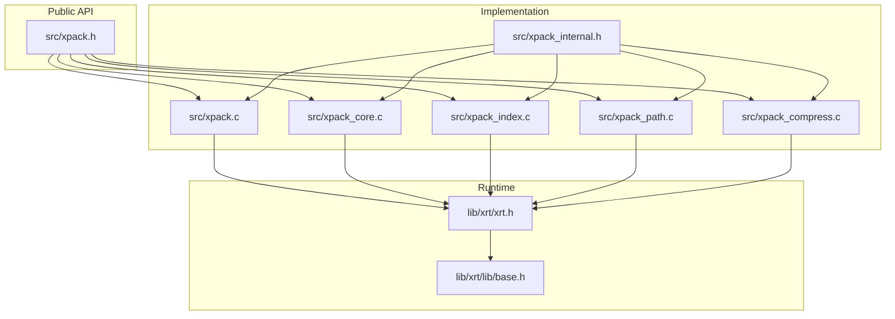
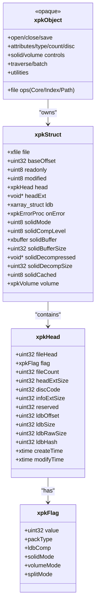
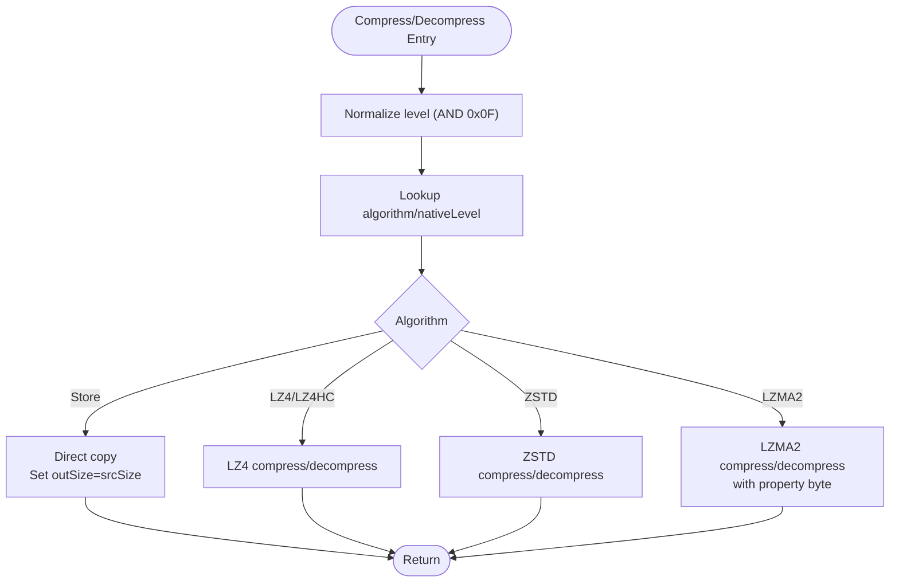
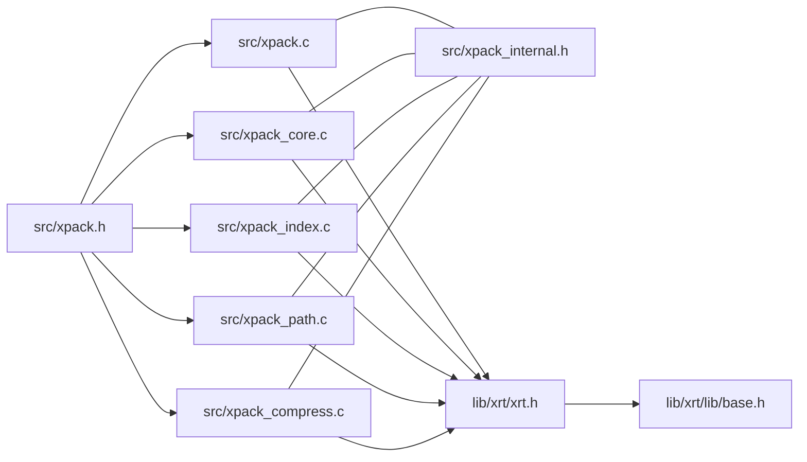

# API Reference

<cite>
**Referenced Files in This Document**
- [xpack.h](file://src/xpack.h)
- [xpack_internal.h](file://src/xpack_internal.h)
- [xpack.c](file://src/xpack.c)
- [xpack_core.c](file://src/xpack_core.c)
- [xpack_index.c](file://src/xpack_index.c)
- [xpack_path.c](file://src/xpack_path.c)
- [xpack_compress.c](file://src/xpack_compress.c)
- [xrt.h](file://lib/xrt/xrt.h)
- [base.h](file://lib/xrt/lib/base.h)
- [11_error_handling.h](file://test/11_error_handling.h)
- [26_memory_management.h](file://test/26_memory_management.h)
- [23_concurrent_access.h](file://test/23_concurrent_access.h)
- [28_performance_benchmark.h](file://test/28_performance_benchmark.h)
</cite>

## Table of Contents
1. [Introduction](#introduction)
2. [Project Structure](#project-structure)
3. [Core Components](#core-components)
4. [Architecture Overview](#architecture-overview)
5. [Detailed Component Analysis](#detailed-component-analysis)
6. [Dependency Analysis](#dependency-analysis)
7. [Performance Considerations](#performance-considerations)
8. [Troubleshooting Guide](#troubleshooting-guide)
9. [Conclusion](#conclusion)
10. [Appendices](#appendices)

## Introduction
This document provides a comprehensive API reference for xPack’s unified compression library interface. It covers lifecycle management, package attributes, file operations across the four package modes (Core, Index, Linux, Win32), callback and error handling, data structures, enumerations, and practical usage patterns. It also includes thread-safety considerations, performance guidelines, and memory management best practices derived from the implementation and tests.

## Project Structure
The xPack library exposes a single public header defining the API surface and several internal modules implementing lifecycle, package attributes, compression routing, and per-mode operations. The library integrates with the xrt runtime for file I/O, memory management, and time utilities.

**Diagram sources**
- [xpack.h](file://src/xpack.h#L322-L447)
- [xpack.c](file://src/xpack.c#L1-L762)
- [xpack_core.c](file://src/xpack_core.c#L1-L403)
- [xpack_index.c](file://src/xpack_index.c#L1-L290)
- [xpack_path.c](file://src/xpack_path.c#L1-L373)
- [xpack_compress.c](file://src/xpack_compress.c#L1-L251)
- [xpack_internal.h](file://src/xpack_internal.h#L1-L145)
- [xrt.h](file://lib/xrt/xrt.h#L1-L2651)
- [base.h](file://lib/xrt/lib/base.h#L1-L132)

**Section sources**
- [xpack.h](file://src/xpack.h#L1-L447)
- [xpack_internal.h](file://src/xpack_internal.h#L1-L145)

## Core Components
This section summarizes the primary API categories and their responsibilities.

- Lifecycle management: open, save, close packages and manage read-only mode.
- Package attributes: type, count, disc code, error callbacks, and header access.
- Solid compression controls: enable/disable, block info.
- Volume controls: enable/disable, size, split mode, current and total volumes, stats.
- Core mode operations: append/update/remove by position, extract to file/data, info getters/setters.
- Index mode operations: append/update/remove by integer index, user data, find by index.
- Path mode operations: append/update/remove by file path, existence check, path retrieval.
- Traversal and batch operations: iterate entries, match patterns, extract all, append directory.
- Utilities: free buffers, hash calculation, verification, statistics, rebuild, last error.

**Section sources**
- [xpack.h](file://src/xpack.h#L332-L447)
- [xpack.c](file://src/xpack.c#L202-L297)

## Architecture Overview
The API is organized around a single opaque object type representing an open package. Internally, the object encapsulates file handles, header metadata, LDB arrays, compression settings, and optional solid and volume subsystems. The implementation routes compression/decompression through a unified router that selects among LZ4, LZ4-HC, ZSTD, and LZMA2 based on configured levels.

**Diagram sources**
- [xpack.h](file://src/xpack.h#L105-L148)
- [xpack.h](file://src/xpack.h#L105-L115)
- [xpack_internal.h](file://src/xpack_internal.h#L47-L84)

**Section sources**
- [xpack_internal.h](file://src/xpack_internal.h#L47-L84)
- [xpack.h](file://src/xpack.h#L105-L148)

## Detailed Component Analysis

### Lifecycle Management
- xpkOpen(path, offset, readonly): Opens or creates a package at a given file offset. Initializes runtime, sets read-only flag, prepares volume and solid subsystems, loads header and LDB if present.
- xpkSave(xpk): Updates modification time, writes header and LDB (or solid block), and persists volume metadata.
- xpkClose(xpk): Closes all volumes, frees LDB and head extensions, destroys solid buffers, closes main file, and shuts down runtime.

Key behaviors:
- Returns NULL on failure and sets last error via thread-local storage.
- Readonly mode prevents write operations and save attempts.
- Supports base offset for embedding packages inside larger files.

**Section sources**
- [xpack.c](file://src/xpack.c#L49-L200)
- [xpack.c](file://src/xpack.c#L202-L259)
- [xpack.c](file://src/xpack.c#L261-L297)

### Package Attributes and Controls
- xpkType(xpk), xpkTypeSet(xpk, type): Query/set package type (Core/Index/Linux/Win32). Type changes require empty pack and write mode.
- xpkCount(xpk): Number of stored files.
- xpkDiscCode(xpk), xpkDiscCodeSet(xpk, code): Access and set a user-defined disc code.
- xpkOnError(xpk, callback): Register error callback.
- xpkGetHead(xpk): Access package header.
- Solid controls: xpkSolidMode, xpkSolidModeSet, xpkSolidBlockInfo.
- Volume controls: xpkVolumeMode, xpkVolumeModeSet, xpkVolumeSize, xpkVolumeSizeSet, xpkVolumeCount, xpkVolumeCurrent, xpkVolumeSplitMode, xpkVolumeSplitModeSet, xpkVolumePath, xpkVolumeStatGet.

Notes:
- Solid mode requires empty pack and disables updates/removals.
- Volume mode toggles multi-file packaging and affects header layout.

**Section sources**
- [xpack.c](file://src/xpack.c#L303-L350)
- [xpack.c](file://src/xpack.c#L366-L421)
- [xpack.c](file://src/xpack.c#L646-L761)

### Core Mode Operations (Position-based)
Core mode uses numeric positions to address files. Operations include:
- Append: xpkAppendFile, xpkAppendData
- Extract: xpkExtractFile, xpkExtractData
- Update: xpkUpdateFile, xpkUpdateData
- Remove: xpkRemove
- Info: xpkInfo, xpkInfoSize, xpkInfoPacked, xpkInfoHash, xpkInfoLevel, xpkInfoType, xpkInfoTypeSet

Behavior highlights:
- Solid mode stores raw concatenated data and resolves offsets at read time.
- Empty data is handled without compression.
- Position indices are 0-based.

**Section sources**
- [xpack_core.c](file://src/xpack_core.c#L18-L128)
- [xpack_core.c](file://src/xpack_core.c#L134-L207)
- [xpack_core.c](file://src/xpack_core.c#L213-L326)
- [xpack_core.c](file://src/xpack_core.c#L332-L358)
- [xpack_core.c](file://src/xpack_core.c#L364-L402)

### Index Mode Operations (ID-based)
Index mode associates files with integer IDs:
- xpkIndexFind(index)
- xpkIndexAppendFile(index, path, level), xpkIndexAppendData(index, data, size, level)
- xpkIndexExtractFile(index, path), xpkIndexExtractData(index, outSize)
- xpkIndexUpdateFile(index, path, level), xpkIndexUpdateData(index, data, size, level)
- xpkIndexRemove(index)
- xpkIndexUserData(index), xpkIndexUserDataSet(index, value)

Constraints:
- Duplicate indices are rejected.
- Type must be Index; otherwise, automatic conversion or explicit type set is required.

**Section sources**
- [xpack_index.c](file://src/xpack_index.c#L18-L30)
- [xpack_index.c](file://src/xpack_index.c#L36-L67)
- [xpack_index.c](file://src/xpack_index.c#L69-L174)
- [xpack_index.c](file://src/xpack_index.c#L180-L204)
- [xpack_index.c](file://src/xpack_index.c#L210-L235)
- [xpack_index.c](file://src/xpack_index.c#L241-L252)
- [xpack_index.c](file://src/xpack_index.c#L258-L289)

### Path Mode Operations (Path-based, Linux/Win32)
Path mode organizes files by filesystem-like paths:
- xpkPathFind(filePath), xpkPathExists(filePath)
- xpkPathAppendFile(filePath, srcPath, level), xpkPathAppendData(filePath, data, size, level)
- xpkPathExtractFile(filePath, dstPath), xpkPathExtractData(filePath, outSize)
- xpkPathUpdateFile(filePath, srcPath, level), xpkPathUpdateData(filePath, data, size, level)
- xpkPathRemove(filePath)
- xpkPathGet(pos): Retrieve stored path for a position

Path hashing:
- Linux: case-sensitive hash and exact string comparison.
- Win32: lowercase conversion and forward slash normalization before hashing and comparison.

Constraints:
- Duplicate paths are rejected.
- Path length must not exceed XPK_PATH_MAX.

**Section sources**
- [xpack_path.c](file://src/xpack_path.c#L52-L94)
- [xpack_path.c](file://src/xpack_path.c#L100-L136)
- [xpack_path.c](file://src/xpack_path.c#L138-L279)
- [xpack_path.c](file://src/xpack_path.c#L285-L307)
- [xpack_path.c](file://src/xpack_path.c#L313-L337)
- [xpack_path.c](file://src/xpack_path.c#L343-L353)
- [xpack_path.c](file://src/xpack_path.c#L359-L372)

### Traversal and Batch Operations
- xpkEach(xpk, callback, userData): Iterate all entries; callback receives position and info.
- xpkEachMatch(xpk, pattern, callback, userData): Iterate entries matching a pattern.
- xpkExtractAll(xpk, dir): Extract all files to a directory.
- xpkAppendDir(xpk, dir, pattern, level, recursive): Add directory contents.

Notes:
- Callbacks can be NULL; iteration still proceeds without invoking callbacks.
- Pattern matching is supported in path mode.

**Section sources**
- [xpack.h](file://src/xpack.h#L421-L422)
- [xpack_core.c](file://src/xpack_core.c#L364-L402)
- [xpack_path.c](file://src/xpack_path.c#L285-L307)

### Utilities and Verification
- xpkFree(ptr): Free buffers returned by extraction.
- xpkHash(data, size): Compute 32-bit hash.
- xpkVerify(xpk, pos), xpkVerifyAll(xpk): Verify integrity of a file or entire package.
- xpkStatGet(xpk, stat): Gather statistics (count, total/raw/packed sizes, ratio).
- xpkRebuild(xpk): Compact and optimize package after deletions or in-place updates.

**Section sources**
- [xpack.h](file://src/xpack.h#L433-L440)
- [xpack.c](file://src/xpack.c#L202-L259)
- [xpack.c](file://src/xpack.c#L202-L259)

### Compression Routing and Algorithms
The router maps compression levels to algorithms and native parameters:
- Levels 0–15 map to Store, LZ4, LZ4-HC, ZSTD, and LZMA2 according to a predefined table.
- Bound estimation is provided per algorithm.
- Decompression mirrors the selected algorithm.

**Diagram sources**
- [xpack_compress.c](file://src/xpack_compress.c#L20-L147)
- [xpack_compress.c](file://src/xpack_compress.c#L153-L220)

**Section sources**
- [xpack_compress.c](file://src/xpack_compress.c#L20-L147)
- [xpack_compress.c](file://src/xpack_compress.c#L153-L220)

## Dependency Analysis
- Public API: Declared in xpack.h; implemented across xpack.c, xpack_core.c, xpack_index.c, xpack_path.c, and xpack_compress.c.
- Internal structures: Defined in xpack_internal.h and used by all modules.
- Runtime dependencies: xrt.h and base.h provide memory, file I/O, hashing, and time utilities.

**Diagram sources**
- [xpack.h](file://src/xpack.h#L322-L447)
- [xpack.c](file://src/xpack.c#L1-L762)
- [xpack_core.c](file://src/xpack_core.c#L1-L403)
- [xpack_index.c](file://src/xpack_index.c#L1-L290)
- [xpack_path.c](file://src/xpack_path.c#L1-L373)
- [xpack_compress.c](file://src/xpack_compress.c#L1-L251)
- [xpack_internal.h](file://src/xpack_internal.h#L1-L145)
- [xrt.h](file://lib/xrt/xrt.h#L1-L2651)
- [base.h](file://lib/xrt/lib/base.h#L1-L132)

**Section sources**
- [xpack.h](file://src/xpack.h#L322-L447)
- [xpack_internal.h](file://src/xpack_internal.h#L1-L145)

## Performance Considerations
- Choose appropriate compression levels: higher levels increase CPU time but reduce packed size. Benchmarks demonstrate throughput trade-offs across levels and file sizes.
- Prefer batch operations (xpkAppendDir, xpkExtractAll) to minimize repeated opens/closes.
- Solid mode consolidates data for improved locality but disallows in-place updates/removals.
- Use xpkVolumeSplitModeSet with file-based splitting for predictable multi-volume layouts.
- Leverage xpkStatGet to monitor compression ratios and adjust strategies.

[No sources needed since this section provides general guidance]

## Troubleshooting Guide
Common issues and resolutions:
- Null pointer or invalid path: xpkOpen returns NULL; check last error via xpkLastError and xpkLastErrorMsg.
- Readonly mode write attempts: Save and write operations fail; open with readonly=0.
- Out-of-range positions: Operations return errors; verify xpkCount and use valid indices.
- Unsupported or corrupted packages: Signature/version checks may reject malformed files.
- Type changes after files added: Prohibited; clear pack or rebuild before switching modes.
- Duplicate indices/paths: Insertion fails; ensure uniqueness before append.
- Path too long: Exceeding XPK_PATH_MAX leads to failure.
- Empty data handling: Passing NULL data with size 0 appends an empty file.

**Section sources**
- [11_error_handling.h](file://test/11_error_handling.h#L7-L388)
- [xpack.c](file://src/xpack.c#L22-L43)
- [xpack.c](file://src/xpack.c#L622-L640)

## Conclusion
xPack provides a unified, extensible API for creating and manipulating compressed archives across multiple modes. Its design cleanly separates concerns between lifecycle, attributes, operations, and compression routing while integrating with a robust runtime for file and memory operations. Following the usage patterns, error handling, and performance guidelines outlined here will help you build reliable and efficient applications.

[No sources needed since this section summarizes without analyzing specific files]

## Appendices

### API Definitions and Signatures
- Lifecycle
  - xpkOpen(const char*, uint32_t, int) -> xpkObject
  - xpkSave(xpkObject) -> int
  - xpkClose(xpkObject) -> void
- Package attributes
  - xpkType(xpkObject) -> int
  - xpkTypeSet(xpkObject, int) -> int
  - xpkCount(xpkObject) -> uint32_t
  - xpkDiscCode(xpkObject) -> uint32_t
  - xpkDiscCodeSet(xpkObject, uint32_t) -> int
  - xpkOnError(xpkObject, xpkErrorProc) -> void
  - xpkGetHead(xpkObject) -> xpkHead*
- Solid compression
  - xpkSolidMode(xpkObject) -> int
  - xpkSolidModeSet(xpkObject, int) -> int
  - xpkSolidBlockInfo(xpkObject, uint32_t*, uint32_t*) -> int
- Volume controls
  - xpkVolumeMode(xpkObject) -> int
  - xpkVolumeModeSet(xpkObject, int) -> int
  - xpkVolumeSize(xpkObject) -> int
  - xpkVolumeSizeSet(xpkObject, uint32_t) -> int
  - xpkVolumeCount(xpkObject) -> int
  - xpkVolumeCurrent(xpkObject) -> int
  - xpkVolumeSplitMode(xpkObject) -> int
  - xpkVolumeSplitModeSet(xpkObject, int) -> int
  - xpkVolumePath(xpkObject, int) -> const char*
  - xpkVolumeStatGet(xpkObject, xpkVolumeStat*) -> int
- Core mode (position-based)
  - xpkAppendFile(xpkObject, const char*, int) -> uint32_t
  - xpkAppendData(xpkObject, const void*, uint32_t, int) -> uint32_t
  - xpkExtractFile(xpkObject, uint32_t, const char*) -> int
  - xpkExtractData(xpkObject, uint32_t, uint32_t*) -> void*
  - xpkUpdateFile(xpkObject, uint32_t, const char*, int) -> int
  - xpkUpdateData(xpkObject, uint32_t, const void*, uint32_t, int) -> int
  - xpkRemove(xpkObject, uint32_t) -> int
  - xpkInfo(xpkObject, uint32_t) -> void*
  - xpkInfoSize(xpkObject, uint32_t) -> uint32_t
  - xpkInfoPacked(xpkObject, uint32_t) -> uint32_t
  - xpkInfoHash(xpkObject, uint32_t) -> uint32_t
  - xpkInfoLevel(xpkObject, uint32_t) -> int
  - xpkInfoType(xpkObject, uint32_t) -> int
  - xpkInfoTypeSet(xpkObject, uint32_t, int) -> int
- Index mode (ID-based)
  - xpkIndexFind(xpkObject, int32_t) -> uint32_t
  - xpkIndexAppendFile(xpkObject, int32_t, const char*, int) -> xpkFileInfoIndex*
  - xpkIndexAppendData(xpkObject, int32_t, const void*, uint32_t, int) -> xpkFileInfoIndex*
  - xpkIndexExtractFile(xpkObject, int32_t, const char*) -> int
  - xpkIndexExtractData(xpkObject, int32_t, uint32_t*) -> void*
  - xpkIndexUpdateFile(xpkObject, int32_t, const char*, int) -> int
  - xpkIndexUpdateData(xpkObject, int32_t, const void*, uint32_t, int) -> int
  - xpkIndexRemove(xpkObject, int32_t) -> int
  - xpkIndexUserData(xpkObject, int32_t) -> int32_t
  - xpkIndexUserDataSet(xpkObject, int32_t, int32_t) -> int
- Path mode (Linux/Win32)
  - xpkPathFind(xpkObject, const char*) -> uint32_t
  - xpkPathExists(xpkObject, const char*) -> int
  - xpkPathAppendFile(xpkObject, const char*, const char*, int) -> void*
  - xpkPathAppendData(xpkObject, const char*, const void*, uint32_t, int) -> uint32_t
  - xpkPathExtractFile(xpkObject, const char*, const char*) -> int
  - xpkPathExtractData(xpkObject, const char*, uint32_t*) -> void*
  - xpkPathUpdateFile(xpkObject, const char*, const char*, int) -> int
  - xpkPathUpdateData(xpkObject, const char*, const void*, uint32_t, int) -> int
  - xpkPathRemove(xpkObject, const char*) -> int
  - xpkPathGet(xpkObject, uint32_t) -> const char*
- Traversal and batch
  - xpkEach(xpkObject, xpkEachCallback, void*) -> int
  - xpkEachMatch(xpkObject, const char*, xpkEachCallback, void*) -> int
  - xpkExtractAll(xpkObject, const char*) -> int
  - xpkAppendDir(xpkObject, const char*, const char*, int, int) -> int
- Utilities
  - xpkFree(void*) -> void
  - xpkHash(const void*, uint32_t) -> uint32_t
  - xpkVerify(xpkObject, uint32_t) -> int
  - xpkVerifyAll(xpkObject) -> int
  - xpkStatGet(xpkObject, xpkStat*) -> int
  - xpkRebuild(xpkObject) -> int
  - xpkLastError(void) -> int
  - xpkLastErrorMsg(void) -> const char*

**Section sources**
- [xpack.h](file://src/xpack.h#L332-L447)

### Data Structures and Enumerations
- xpkFlag: Bitfield controlling packType, ldbComp, solidMode, volumeMode, splitMode.
- xpkHead: Package header containing signature, flags, counts, sizes, hashes, timestamps.
- xpkFileFlag: Per-file flags for compression level, file type, and encryption marker.
- xpkFileInfo/Core: Per-file metadata for Core mode.
- xpkFileInfoIndex/Index: Extended metadata for Index mode (index and user data).
- xpkFileInfoLinux/Win32: Extended metadata for path-based modes (path, hash, attributes, timestamps).
- xpkFileInfoSolid: Solid block offset for solid mode.
- xpkVolumeInfo: Header extension for multi-volume support.
- xpkCompMap: Level-to-algorithm mapping.
- xpkStat: Statistics container.
- xpkVolumeStat: Multi-volume statistics.

**Section sources**
- [xpack.h](file://src/xpack.h#L105-L148)
- [xpack.h](file://src/xpack.h#L153-L161)
- [xpack.h](file://src/xpack.h#L167-L174)
- [xpack.h](file://src/xpack.h#L180-L191)
- [xpack.h](file://src/xpack.h#L198-L214)
- [xpack.h](file://src/xpack.h#L221-L237)
- [xpack.h](file://src/xpack.h#L243-L246)
- [xpack.h](file://src/xpack.h#L252-L256)
- [xpack.h](file://src/xpack.h#L261-L264)

### Thread Safety and Concurrency
- Error reporting uses thread-local storage; errors are not shared across threads.
- xrt runtime maintains thread-local temporary memory and error state; APIs are not guaranteed to be thread-safe.
- Recommended practice: serialize access to a single xpkObject across threads; open separate handles for concurrent operations.

**Section sources**
- [xpack.c](file://src/xpack.c#L22-L26)
- [base.h](file://lib/xrt/lib/base.h#L75-L84)

### Practical Usage Patterns and Examples
- Basic lifecycle: open, append data, save, close; verify with extract and hash.
- Type switching: set type to Index or Path before appending; ensure pack is empty.
- Solid mode: enable before adding files; avoid updates/removals; rebuild if needed.
- Multi-volume: enable volume mode, set split mode, and inspect stats.
- Error handling: check return codes and call xpkLastError/xpkLastErrorMsg; register callbacks via xpkOnError.
- Memory management: always free buffers returned by xpkExtractData; reuse allocated buffers for repeated operations.

**Section sources**
- [26_memory_management.h](file://test/26_memory_management.h#L15-L300)
- [23_concurrent_access.h](file://test/23_concurrent_access.h#L8-L570)
- [28_performance_benchmark.h](file://test/28_performance_benchmark.h#L8-L333)