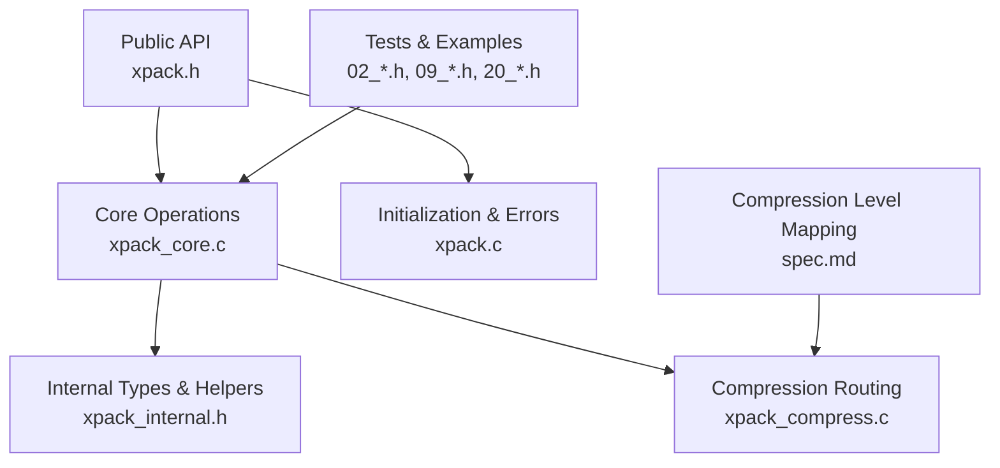
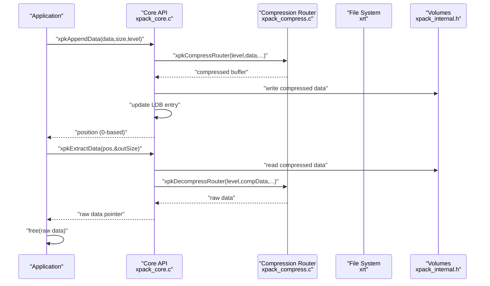
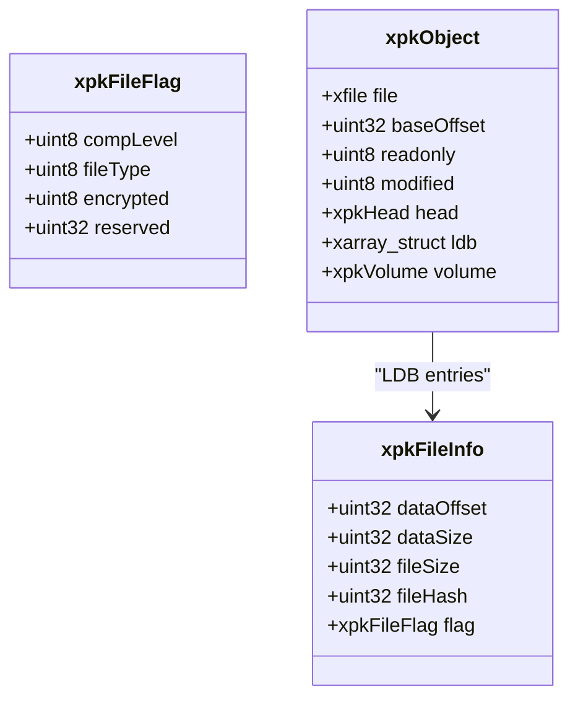
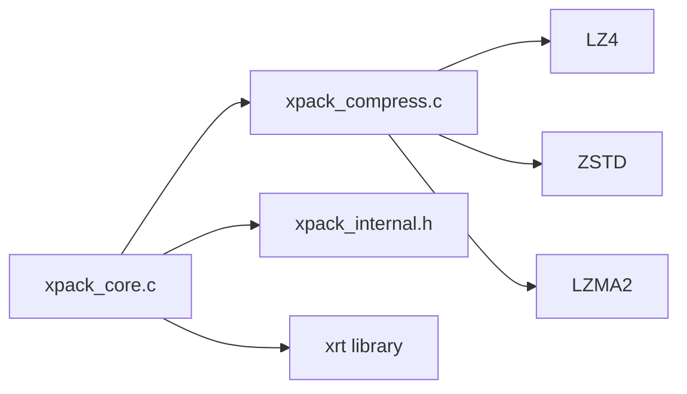

# Core Mode Operations

<cite>
**Referenced Files in This Document**
- [xpack.h](file://src/xpack.h)
- [xpack_core.c](file://src/xpack_core.c)
- [xpack_internal.h](file://src/xpack_internal.h)
- [xpack_compress.c](file://src/xpack_compress.c)
- [xpack.c](file://src/xpack.c)
- [02_core_operations.h](file://test/02_core_operations.h)
- [09_compression_large_files.h](file://test/09_compression_large_files.h)
- [20_multiple_packages.h](file://test/20_multiple_packages.h)
- [spec.md](file://docs/spec.md)
</cite>

## Table of Contents
1. [Introduction](#introduction)
2. [Project Structure](#project-structure)
3. [Core Components](#core-components)
4. [Architecture Overview](#architecture-overview)
5. [Detailed Component Analysis](#detailed-component-analysis)
6. [Dependency Analysis](#dependency-analysis)
7. [Performance Considerations](#performance-considerations)
8. [Troubleshooting Guide](#troubleshooting-guide)
9. [Conclusion](#conclusion)
10. [Appendices](#appendices)

## Introduction
This document provides comprehensive API documentation for xPack’s Core mode file operations focused on position-based file management. Core mode organizes files as a sequential list with 0-based positions, enabling efficient random access and manipulation of package contents. The documented functions cover appending files and raw data, extracting files and raw data, updating existing entries, removing files, and retrieving metadata. Practical examples demonstrate typical workflows, error handling patterns, and memory management best practices. The document also explains the sequential nature of Core mode, position-based addressing, and performance considerations for large packages.

## Project Structure
Core mode APIs are defined in the public header and implemented in dedicated modules:
- Public API declarations and data structures: [xpack.h](file://src/xpack.h)
- Core mode operations implementation: [xpack_core.c](file://src/xpack_core.c)
- Internal structures and helpers: [xpack_internal.h](file://src/xpack_internal.h)
- Compression routing and algorithms: [xpack_compress.c](file://src/xpack_compress.c)
- General library initialization and error handling: [xpack.c](file://src/xpack.c)
- Example usage and tests demonstrating memory management and workflows: [02_core_operations.h](file://test/02_core_operations.h), [09_compression_large_files.h](file://test/09_compression_large_files.h), [20_multiple_packages.h](file://test/20_multiple_packages.h)
- Compression level mapping specification: [spec.md](file://docs/spec.md)

**Diagram sources**
- [xpack.h](file://src/xpack.h#L369-L389)
- [xpack_core.c](file://src/xpack_core.c#L1-L403)
- [xpack_internal.h](file://src/xpack_internal.h#L47-L84)
- [xpack_compress.c](file://src/xpack_compress.c#L1-L200)
- [xpack.c](file://src/xpack.c#L1-L200)
- [02_core_operations.h](file://test/02_core_operations.h#L1-L378)
- [09_compression_large_files.h](file://test/09_compression_large_files.h#L179-L230)
- [20_multiple_packages.h](file://test/20_multiple_packages.h#L184-L233)
- [spec.md](file://docs/spec.md#L400-L435)

**Section sources**
- [xpack.h](file://src/xpack.h#L369-L389)
- [xpack_core.c](file://src/xpack_core.c#L1-L403)
- [xpack_internal.h](file://src/xpack_internal.h#L47-L84)
- [xpack_compress.c](file://src/xpack_compress.c#L1-L200)
- [xpack.c](file://src/xpack.c#L1-L200)
- [02_core_operations.h](file://test/02_core_operations.h#L1-L378)
- [09_compression_large_files.h](file://test/09_compression_large_files.h#L179-L230)
- [20_multiple_packages.h](file://test/20_multiple_packages.h#L184-L233)
- [spec.md](file://docs/spec.md#L400-L435)

## Core Components
Core mode provides position-based operations on a sequential file list. The key functions are:
- Append operations: add files or raw data at the end of the package
- Extract operations: retrieve files or raw data by position
- Update operations: replace existing entries with new data
- Remove operation: delete entries by position
- Info functions: query metadata such as sizes, packed sizes, hashes, compression levels, and file types

Return value conventions:
- Append and update operations return a 0-based position on success or a sentinel indicating failure.
- Extract operations return 0 on success and non-zero on failure; extracted data must be freed by the caller.
- Remove and info-type setters return 0 on success and non-zero on failure.

Compression level mapping:
- Levels 0–15 select among multiple algorithms and strategies. See the mapping table for details.

**Section sources**
- [xpack.h](file://src/xpack.h#L369-L389)
- [xpack_core.c](file://src/xpack_core.c#L18-L128)
- [xpack_core.c](file://src/xpack_core.c#L134-L207)
- [xpack_core.c](file://src/xpack_core.c#L213-L326)
- [xpack_core.c](file://src/xpack_core.c#L332-L358)
- [xpack_core.c](file://src/xpack_core.c#L364-L402)
- [spec.md](file://docs/spec.md#L400-L435)

## Architecture Overview
Core mode organizes package data as a sequential list of file entries. Each entry stores position-based metadata (offset, sizes, hash, flags). Data is stored contiguously after the package header and LDB. Operations manipulate either the LDB (metadata) or the data stream directly.

**Diagram sources**
- [xpack_core.c](file://src/xpack_core.c#L39-L128)
- [xpack_core.c](file://src/xpack_core.c#L147-L207)
- [xpack_compress.c](file://src/xpack_compress.c#L20-L147)
- [xpack_internal.h](file://src/xpack_internal.h#L128-L139)

## Detailed Component Analysis

### Position-Based Data Model
Core mode uses a contiguous data region and a linear metadata list (LDB). Each file entry contains:
- dataOffset: byte offset of compressed data from the package base
- dataSize: compressed size
- fileSize: original size
- fileHash: 32-bit hash of original data
- flag: compLevel and fileType bits

Positions are 0-based indices into the LDB. The baseOffset accounts for any container offset (e.g., embedded packages).

**Diagram sources**
- [xpack.h](file://src/xpack.h#L164-L174)
- [xpack.h](file://src/xpack.h#L151-L161)
- [xpack_internal.h](file://src/xpack_internal.h#L47-L84)

**Section sources**
- [xpack.h](file://src/xpack.h#L151-L174)
- [xpack_internal.h](file://src/xpack_internal.h#L47-L84)

### Append Operations
- xpkAppendFile: reads a file and appends its contents with a given compression level.
- xpkAppendData: appends raw data with compression.

Behavior:
- Validates inputs and readonly mode.
- Compresses data using the compression router.
- Writes compressed data to the end of the package.
- Updates LDB with a new entry and returns the 0-based position.

Compression level semantics:
- Levels 0–15 map to algorithms and strategies. See the mapping table.

Memory management:
- xpkAppendFile allocates and frees temporary buffers internally.
- xpkAppendData allocates a compression buffer; callers must manage the input buffer.

Return values:
- On success, returns the 0-based position; on failure, returns a sentinel and sets an error.

**Section sources**
- [xpack_core.c](file://src/xpack_core.c#L18-L37)
- [xpack_core.c](file://src/xpack_core.c#L39-L128)
- [xpack_compress.c](file://src/xpack_compress.c#L20-L147)
- [spec.md](file://docs/spec.md#L400-L435)

### Extract Operations
- xpkExtractFile: extracts a file by position to disk.
- xpkExtractData: extracts raw data by position and returns a pointer to caller-owned memory.

Behavior:
- Validates position and retrieves metadata.
- Reads compressed data from the data region.
- Decompresses using the compression router.
- Allocates a buffer sized to the original file size.

Memory management:
- Caller must free the returned pointer using the provided free function.
- Empty files still require allocation of a minimal buffer.

Return values:
- xpkExtractFile returns 0 on success; xpkExtractData returns a pointer on success and NULL on failure.

**Section sources**
- [xpack_core.c](file://src/xpack_core.c#L134-L145)
- [xpack_core.c](file://src/xpack_core.c#L147-L207)
- [xpack_compress.c](file://src/xpack_compress.c#L153-L200)

### Update Operations
- xpkUpdateFile: replaces an existing file by position with a new file.
- xpkUpdateData: replaces an existing entry by position with new raw data.

Behavior:
- Validates inputs and readonly mode.
- Solid archives are not supported for updates.
- Recompresses data and writes to either the original location (if smaller) or at the end (leaving holes).
- Updates LDB entry atomically.

Constraints:
- Updates are not supported in solid mode.
- If new data is larger than the original, the package becomes fragmented until rebuilt.

Return values:
- 0 on success; non-zero on failure.

**Section sources**
- [xpack_core.c](file://src/xpack_core.c#L213-L232)
- [xpack_core.c](file://src/xpack_core.c#L234-L326)

### Remove Operation
- xpkRemove: deletes an entry by position.

Behavior:
- Validates inputs and readonly mode.
- Solid archives are not supported for removal.
- Removes the entry from LDB.

Constraints:
- Removal is not supported in solid mode.
- Removing entries leaves gaps; consider rebuilding to compact.

Return values:
- 0 on success; non-zero on failure.

**Section sources**
- [xpack_core.c](file://src/xpack_core.c#L332-L358)

### Info Functions
- xpkInfo: returns a pointer to the metadata entry for a given position.
- xpkInfoSize: returns original size.
- xpkInfoPacked: returns compressed size.
- xpkInfoHash: returns original data hash.
- xpkInfoLevel: returns compression level used.
- xpkInfoType: returns file type.
- xpkInfoTypeSet: sets file type.

Behavior:
- All functions operate on the LDB entry for the given position.
- Type setter requires write access.

Return values:
- Info functions return values or pointers; type setter returns 0 on success.

**Section sources**
- [xpack_core.c](file://src/xpack_core.c#L364-L402)
- [xpack.h](file://src/xpack.h#L380-L389)

### Practical Workflows and Examples
- Basic append and extract: demonstrates adding a file and extracting it back to disk.
- Update data and file: shows replacing existing entries with new data.
- Remove operations: shows deleting entries and verifying remaining content.
- Info functions: verifies sizes, packed sizes, compression levels, and hashes.
- Large file handling: shows updates and extractions of large buffers.
- Cross-package copying: demonstrates extracting data and appending to another package.

Memory management patterns:
- Always free extracted data using the provided free function.
- Manage buffers for append/update operations appropriately.
- Close packages after use and clean up temporary files.

**Section sources**
- [02_core_operations.h](file://test/02_core_operations.h#L7-L47)
- [02_core_operations.h](file://test/02_core_operations.h#L49-L99)
- [02_core_operations.h](file://test/02_core_operations.h#L106-L138)
- [02_core_operations.h](file://test/02_core_operations.h#L170-L204)
- [02_core_operations.h](file://test/02_core_operations.h#L206-L230)
- [02_core_operations.h](file://test/02_core_operations.h#L232-L264)
- [02_core_operations.h](file://test/02_core_operations.h#L266-L299)
- [09_compression_large_files.h](file://test/09_compression_large_files.h#L193-L230)
- [20_multiple_packages.h](file://test/20_multiple_packages.h#L215-L233)

## Dependency Analysis
Core mode depends on:
- Compression router for algorithm selection and compression/decompression.
- Volume manager for multi-file packages.
- xrt library for file I/O and memory management.
- Internal macros to convert 1-based array indices to 0-based positions.

**Diagram sources**
- [xpack_core.c](file://src/xpack_core.c#L1-L403)
- [xpack_compress.c](file://src/xpack_compress.c#L1-L200)
- [xpack_internal.h](file://src/xpack_internal.h#L10-L15)

**Section sources**
- [xpack_core.c](file://src/xpack_core.c#L1-L403)
- [xpack_compress.c](file://src/xpack_compress.c#L1-L200)
- [xpack_internal.h](file://src/xpack_internal.h#L10-L15)

## Performance Considerations
- Sequential nature: Core mode is designed for sequential access and append-heavy workloads. Frequent insertions in the middle are expensive due to LDB shifts.
- Position-based addressing: O(1) access to entries by position; updates may cause fragmentation if data grows.
- Compression trade-offs: Higher compression levels increase CPU time and memory usage. Choose levels based on workload characteristics.
- Large packages: Updates that grow entries leave holes; consider periodic rebuilds to compact storage.
- Solid mode: Not supported for updates/removal; use for read-only scenarios where compression benefits outweigh update costs.
- Memory management: Extracted data must be freed; avoid holding large buffers unnecessarily.

[No sources needed since this section provides general guidance]

## Troubleshooting Guide
Common errors and handling patterns:
- Invalid file position: Returned when accessing entries outside the LDB bounds.
- Readonly mode write denied: Attempts to append/update/remove in readonly mode fail.
- Compression/Decompression failures: Occur when compression routines fail; verify input sizes and levels.
- Memory allocation failures: Insufficient memory during compression or extraction; reduce buffer sizes or levels.
- Hash verification failures: Detected during integrity checks; re-extract and compare hashes.

Error reporting:
- Functions set an internal error code and message; retrieve via the last-error APIs.

Best practices:
- Always check return values and handle errors gracefully.
- Free extracted data promptly.
- Verify positions before operations.
- Rebuild packages periodically to optimize storage after frequent updates.

**Section sources**
- [xpack.c](file://src/xpack.c#L27-L43)
- [xpack_core.c](file://src/xpack_core.c#L18-L37)
- [xpack_core.c](file://src/xpack_core.c#L134-L145)
- [xpack_core.c](file://src/xpack_core.c#L234-L326)
- [xpack_core.c](file://src/xpack_core.c#L332-L358)

## Conclusion
Core mode offers a straightforward, position-based interface for managing packages with predictable performance characteristics. By understanding position semantics, compression levels, and memory management requirements, developers can efficiently build workflows for append, extract, update, remove, and metadata queries. For large packages with frequent modifications, consider periodic rebuilds and careful selection of compression levels to balance speed, size, and reliability.

[No sources needed since this section summarizes without analyzing specific files]

## Appendices

### API Reference Summary
- Append
  - xpkAppendFile(xpk, path, level): Append file; returns 0-based position or sentinel.
  - xpkAppendData(xpk, data, size, level): Append raw data; returns 0-based position or sentinel.
- Extract
  - xpkExtractFile(xpk, pos, path): Extract to file; returns 0 on success.
  - xpkExtractData(xpk, pos, outSize): Extract raw data; caller must free; returns pointer or NULL.
- Update
  - xpkUpdateFile(xpk, pos, path, level): Replace file by position; returns 0 on success.
  - xpkUpdateData(xpk, pos, data, size, level): Replace raw data by position; returns 0 on success.
- Remove
  - xpkRemove(xpk, pos): Delete entry by position; returns 0 on success.
- Info
  - xpkInfo(xpk, pos): Get metadata pointer.
  - xpkInfoSize(xpk, pos): Original size.
  - xpkInfoPacked(xpk, pos): Compressed size.
  - xpkInfoHash(xpk, pos): Original data hash.
  - xpkInfoLevel(xpk, pos): Compression level.
  - xpkInfoType(xpk, pos): File type.
  - xpkInfoTypeSet(xpk, pos, type): Set file type; returns 0 on success.

**Section sources**
- [xpack.h](file://src/xpack.h#L369-L389)
- [xpack_core.c](file://src/xpack_core.c#L18-L128)
- [xpack_core.c](file://src/xpack_core.c#L134-L207)
- [xpack_core.c](file://src/xpack_core.c#L213-L326)
- [xpack_core.c](file://src/xpack_core.c#L332-L358)
- [xpack_core.c](file://src/xpack_core.c#L364-L402)

### Compression Level Mapping
Levels 0–15 map to algorithms and strategies. See the mapping table for details.

**Section sources**
- [spec.md](file://docs/spec.md#L400-L435)