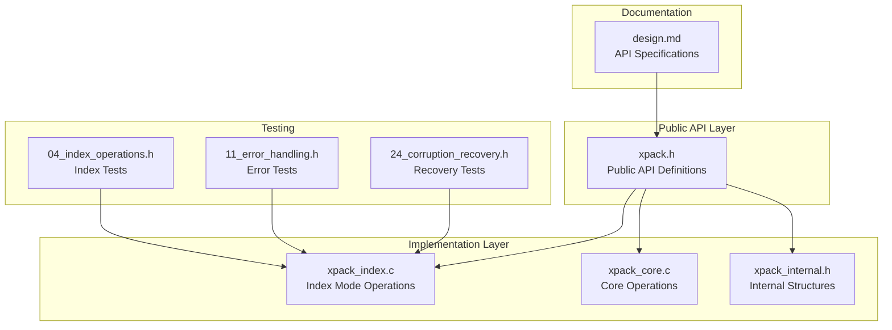
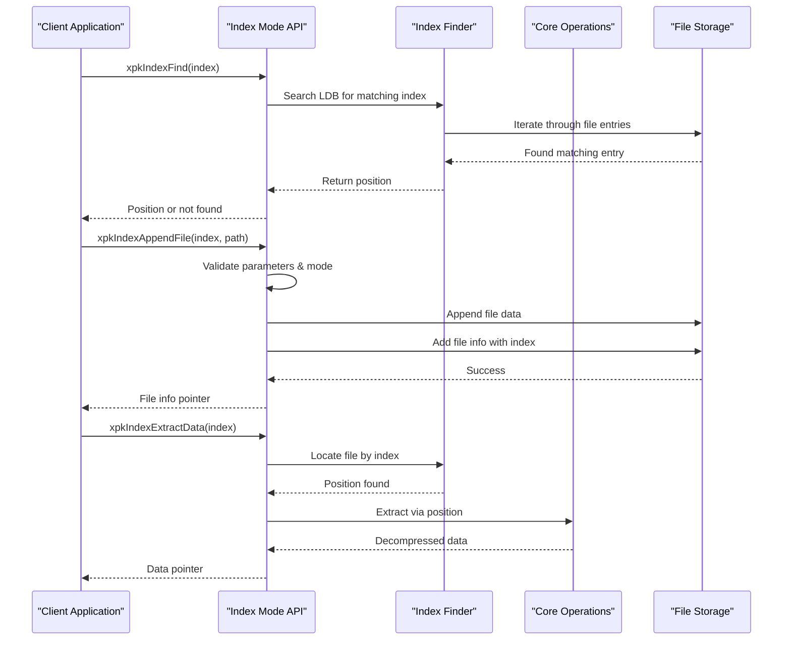
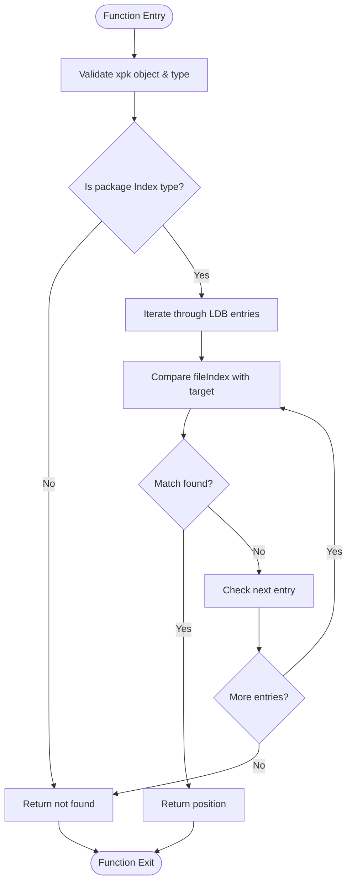
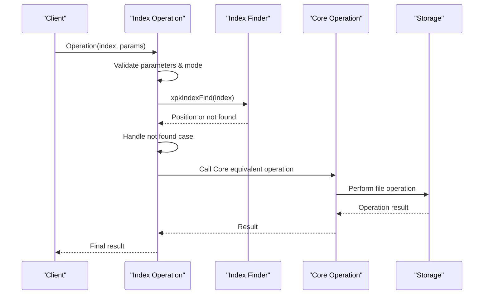
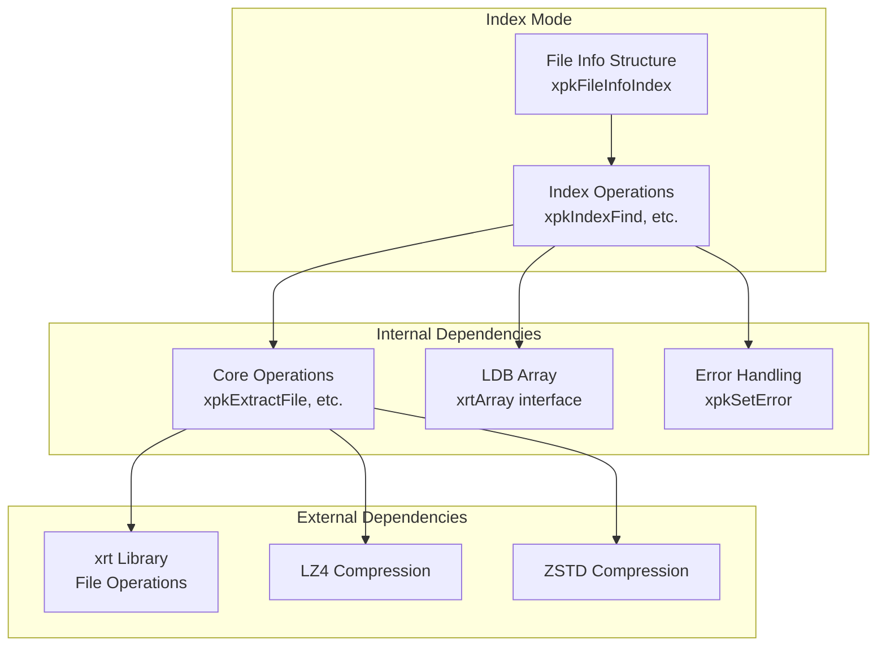

# Index Mode Operations

<cite>
**Referenced Files in This Document**
- [xpack.h](file://src/xpack.h)
- [xpack_index.c](file://src/xpack_index.c)
- [xpack_internal.h](file://src/xpack_internal.h)
- [design.md](file://docs/design.md)
- [04_index_operations.h](file://test/04_index_operations.h)
- [11_error_handling.h](file://test/11_error_handling.h)
- [24_corruption_recovery.h](file://test/24_corruption_recovery.h)
</cite>

## Table of Contents
1. [Introduction](#introduction)
2. [Project Structure](#project-structure)
3. [Core Components](#core-components)
4. [Architecture Overview](#architecture-overview)
5. [Detailed Component Analysis](#detailed-component-analysis)
6. [Dependency Analysis](#dependency-analysis)
7. [Performance Considerations](#performance-considerations)
8. [Troubleshooting Guide](#troubleshooting-guide)
9. [Conclusion](#conclusion)

## Introduction
This document provides comprehensive API documentation for xPack's Index mode file operations. Index mode enables integer-based file indexing, offering direct access by ID, flexible file ordering, and efficient random access patterns. The documentation covers the complete set of index-based operations including finding files by index number, appending, extracting, updating, and removing files, along with custom per-file data storage capabilities.

## Project Structure
The Index mode functionality is implemented within the xPack library with the following key components:

**Diagram sources**
- [xpack.h](file://src/xpack.h#L391-L403)
- [xpack_index.c](file://src/xpack_index.c#L1-L290)
- [xpack_internal.h](file://src/xpack_internal.h#L47-L84)

**Section sources**
- [xpack.h](file://src/xpack.h#L391-L403)
- [xpack_index.c](file://src/xpack_index.c#L1-L290)
- [xpack_internal.h](file://src/xpack_internal.h#L47-L84)

## Core Components
The Index mode API consists of seven primary functions grouped into logical operation categories:

### Index Finding Operations
- `xpkIndexFind`: Locates files by their integer index number
- Returns the position in the file list or a sentinel value if not found

### Index-Based File Operations
- `xpkIndexAppendFile`: Adds a file with a specified index from disk
- `xpkIndexAppendData`: Adds a file with a specified index from memory
- `xpkIndexExtractFile`: Extracts a file identified by index to disk
- `xpkIndexExtractData`: Extracts a file identified by index to memory
- `xpkIndexUpdateFile`: Updates an existing file by index from disk
- `xpkIndexUpdateData`: Updates an existing file by index from memory
- `xpkIndexRemove`: Removes a file by its index

### User Data Management
- `xpkIndexUserData`: Retrieves custom per-file user data
- `xpkIndexUserDataSet`: Sets custom per-file user data

**Section sources**
- [xpack.h](file://src/xpack.h#L391-L403)
- [xpack_index.c](file://src/xpack_index.c#L18-L290)

## Architecture Overview
The Index mode architecture implements a hybrid approach combining integer indexing with the underlying Core mode infrastructure:

**Diagram sources**
- [xpack_index.c](file://src/xpack_index.c#L18-L290)
- [xpack.h](file://src/xpack.h#L391-L403)

The architecture maintains several key design principles:
- **Direct Access**: Integer indices enable O(n) lookup where n is the number of files
- **Flexible Ordering**: Files can be inserted at arbitrary positions based on index values
- **Efficient Random Access**: Supports efficient random access patterns for batch processing
- **Consistent Interface**: All operations follow the same parameter patterns as Core mode

**Section sources**
- [xpack_index.c](file://src/xpack_index.c#L18-L290)
- [xpack_internal.h](file://src/xpack_internal.h#L90-L96)

## Detailed Component Analysis

### Index Finding Implementation
The `xpkIndexFind` function provides the foundation for all index-based operations:

**Diagram sources**
- [xpack_index.c](file://src/xpack_index.c#L18-L30)

Key characteristics:
- **Linear Search**: O(n) time complexity due to sequential iteration
- **Exact Matching**: Uses direct integer comparison for fileIndex field
- **Type Safety**: Validates package type before searching
- **Error Handling**: Returns sentinel value for not found conditions

**Section sources**
- [xpack_index.c](file://src/xpack_index.c#L18-L30)

### Index-Based File Operations
All index-based operations follow a consistent pattern:

**Diagram sources**
- [xpack_index.c](file://src/xpack_index.c#L180-L252)

The operations support both file-based and memory-based data:
- **File Operations**: Read from disk, compress, and store
- **Memory Operations**: Accept raw data buffers with specified size
- **Compression Levels**: Support configurable compression levels (0-15)
- **Error Propagation**: Inherits error handling from Core operations

**Section sources**
- [xpack_index.c](file://src/xpack_index.c#L36-L174)
- [xpack_index.c](file://src/xpack_index.c#L180-L252)

### User Data Management
The user data functionality provides extensible storage for custom metadata:

```mermaid
classDiagram
class xpkFileInfoIndex {
+uint32_t dataOffset
+uint32_t dataSize
+uint32_t fileSize
+uint32_t fileHash
+xpkFileFlag flag
+int32_t fileIndex
+int32_t userData
}
class UserDataOperations {
+xpkIndexUserData(index) int32_t
+xpkIndexUserDataSet(index, value) int
}
xpkFileInfoIndex --> UserDataOperations : "provides storage for"
```

**Diagram sources**
- [xpack.h](file://src/xpack.h#L177-L192)
- [xpack_index.c](file://src/xpack_index.c#L258-L289)

User data characteristics:
- **Integer Storage**: 32-bit signed integer capacity
- **Custom Metadata**: Can store any integer-based metadata
- **Persistence**: Stored within file information structure
- **Direct Access**: No additional lookup required

**Section sources**
- [xpack.h](file://src/xpack.h#L177-L192)
- [xpack_index.c](file://src/xpack_index.c#L258-L289)

## Dependency Analysis
The Index mode operations depend on several internal components:

**Diagram sources**
- [xpack_index.c](file://src/xpack_index.c#L12-L13)
- [xpack_internal.h](file://src/xpack_internal.h#L98-L101)

Key dependencies:
- **xrt Library**: Provides file I/O, memory management, and hashing
- **Compression Libraries**: LZ4, LZ4-HC, ZSTD, and LZMA2 support
- **Core Operations**: Reuse of existing Core mode functionality
- **LDB Interface**: Array-based file list management

**Section sources**
- [xpack_index.c](file://src/xpack_index.c#L12-L13)
- [xpack_internal.h](file://src/xpack_internal.h#L98-L101)

## Performance Considerations
Index mode operations exhibit the following performance characteristics:

### Time Complexity
- **Index Finding**: O(n) where n equals the number of files in the package
- **File Operations**: O(1) for position-based operations plus compression/decompression overhead
- **Memory Operations**: O(1) for pure memory operations

### Memory Usage
- **Index Operations**: Minimal additional memory overhead
- **Compression**: Memory usage scales with compression level and data size
- **Storage Overhead**: Each file adds fixed-size metadata overhead

### Optimization Strategies
- **Batch Processing**: Group multiple operations to minimize repeated lookups
- **Index Planning**: Design index sequences to minimize file movement
- **Compression Selection**: Choose appropriate compression levels for data characteristics
- **Memory Management**: Use memory-based operations for large datasets

## Troubleshooting Guide

### Common Error Conditions
The Index mode API implements comprehensive error handling:

| Error Condition | Error Code | Description | Resolution |
|-----------------|------------|-------------|------------|
| Invalid Package Type | 11 | Package is not in Index mode | Convert package type or use appropriate mode |
| Index Not Found | 6 | Target index does not exist | Verify index value or check package contents |
| Duplicate Index | 11 | Index already exists | Use unique index values |
| ReadOnly Mode | 10 | Cannot modify in read-only mode | Open package in write mode |
| Solid Mode | 11 | Cannot append to solid archives | Disable solid mode or use supported operations |

### Validation and Range Checking
The implementation includes several validation mechanisms:
- **Parameter Validation**: Null pointer checks and bounds verification
- **Package Type Validation**: Ensures Index mode before operations
- **Index Existence**: Verifies target index exists before modification
- **Mode Compatibility**: Checks for unsupported operations in specific modes

### Best Practices for Index Consistency
- **Unique Index Assignment**: Ensure each index appears only once
- **Sequential Indexing**: Consider using sequential numbering for predictability
- **Batch Operations**: Group related operations to maintain consistency
- **Regular Verification**: Use `xpkVerifyAll` to check package integrity
- **Backup Strategy**: Create backups before major modifications

**Section sources**
- [xpack_index.c](file://src/xpack_index.c#L39-L93)
- [xpack_index.c](file://src/xpack_index.c#L210-L252)
- [11_error_handling.h](file://test/11_error_handling.h#L379-L380)

## Conclusion
xPack's Index mode provides a powerful alternative to traditional path-based file access, enabling efficient integer-based file management with direct ID access, flexible ordering, and optimal random access patterns. The implementation offers comprehensive functionality including complete CRUD operations, user data storage, and robust error handling.

Key advantages of Index mode include:
- **Direct Access**: O(n) lookup with integer indices
- **Flexible Ordering**: Arbitrary file positioning based on index values
- **Efficient Random Access**: Optimal for batch processing scenarios
- **Extensible Metadata**: Custom user data storage per file
- **Consistent Interface**: Familiar API patterns aligned with Core mode

The API design ensures reliability through comprehensive validation, error handling, and integration with the broader xPack ecosystem. Proper use of Index mode can significantly improve performance for applications requiring frequent random access to package contents.