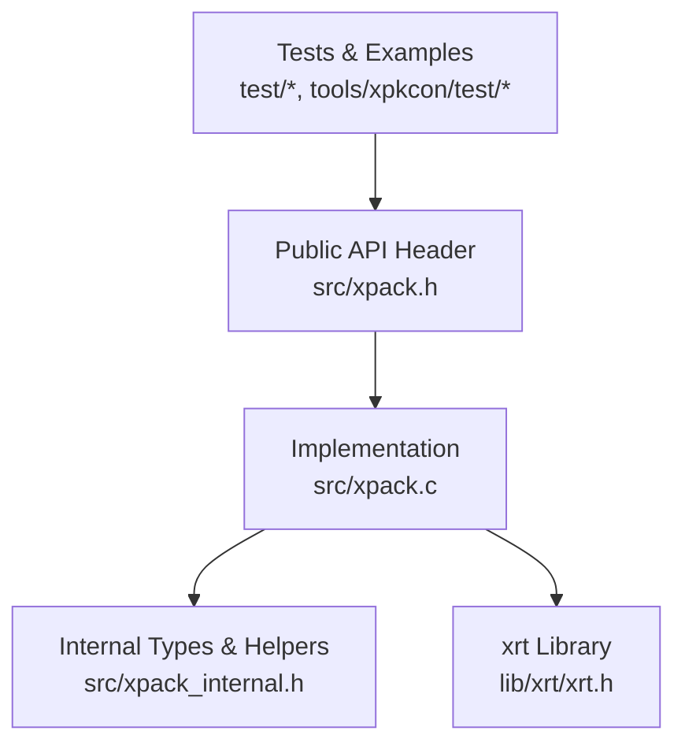
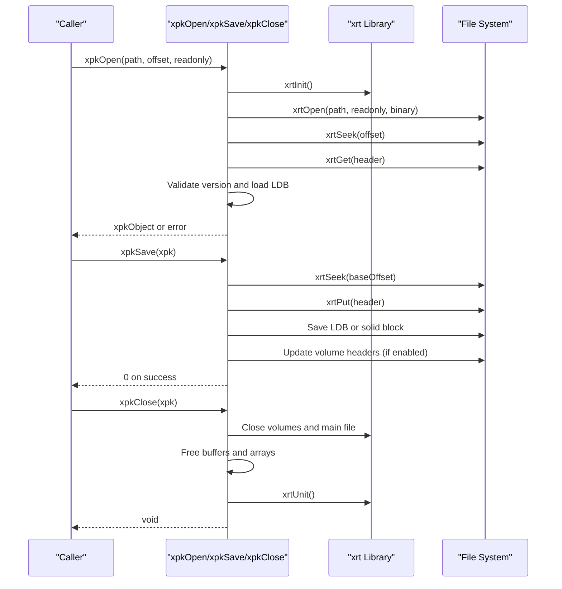
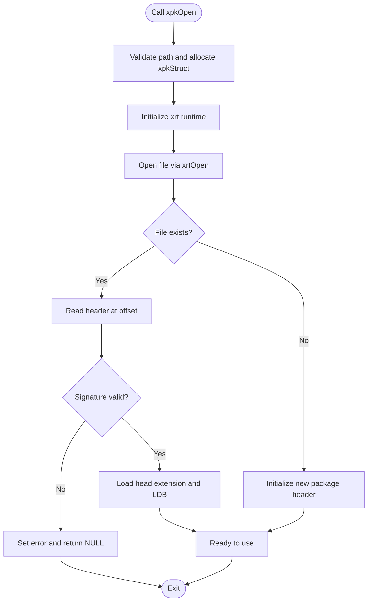
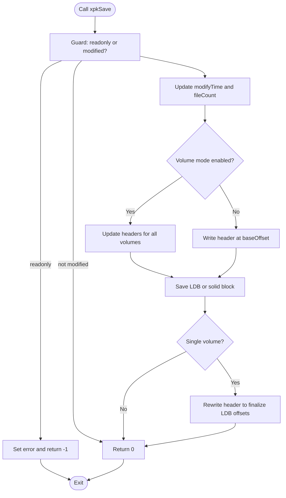
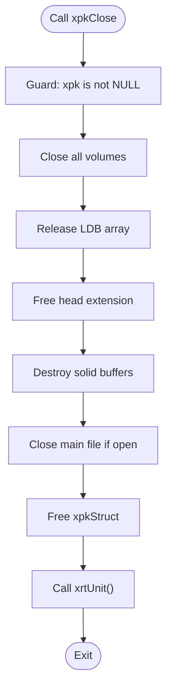
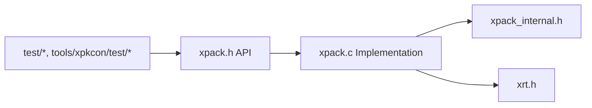

# Lifecycle Management

<cite>
**Referenced Files in This Document**
- [xpack.h](file://src/xpack.h)
- [xpack.c](file://src/xpack.c)
- [xpack_internal.h](file://src/xpack_internal.h)
- [xrt.h](file://lib/xrt/xrt.h)
- [test_xpk_api.c](file://tools/xpkcon/test/test_xpk_api.c)
- [11_error_handling.h](file://test/11_error_handling.h)
- [19_save_load_cycles.h](file://test/19_save_load_cycles.h)
- [23_concurrent_access.h](file://test/23_concurrent_access.h)
- [26_memory_management.h](file://test/26_memory_management.h)
</cite>

## Table of Contents
1. [Introduction](#introduction)
2. [Project Structure](#project-structure)
3. [Core Components](#core-components)
4. [Architecture Overview](#architecture-overview)
5. [Detailed Component Analysis](#detailed-component-analysis)
6. [Dependency Analysis](#dependency-analysis)
7. [Performance Considerations](#performance-considerations)
8. [Troubleshooting Guide](#troubleshooting-guide)
9. [Conclusion](#conclusion)

## Introduction
This document provides comprehensive API documentation for xPack’s lifecycle management functions focused on object creation, persistence, and cleanup. It covers:
- xpkOpen: opening packages with path, offset, and readonly flags, including file opening modes and error handling
- xpkSave: persisting changes to disk with transaction-like semantics and rollback considerations
- xpkClose: proper resource cleanup and memory deallocation

It also includes practical examples, thread-safety considerations, and troubleshooting guidance for common initialization and cleanup issues.

## Project Structure
The lifecycle management APIs are defined in the public header and implemented in the main source file. Internals are encapsulated in the internal header and rely on the xrt library for file operations.

**Diagram sources**
- [xpack.h](file://src/xpack.h#L322-L334)
- [xpack.c](file://src/xpack.c#L49-L297)
- [xpack_internal.h](file://src/xpack_internal.h#L47-L84)
- [xrt.h](file://lib/xrt/xrt.h#L668-L721)

**Section sources**
- [xpack.h](file://src/xpack.h#L1-L447)
- [xpack.c](file://src/xpack.c#L1-L762)
- [xpack_internal.h](file://src/xpack_internal.h#L1-L145)
- [xrt.h](file://lib/xrt/xrt.h#L668-L721)

## Core Components
- xpkOpen(const char* path, uint32_t offset, int readonly): Creates or opens a package at a given file path and base offset, with optional read-only mode. Validates version signatures and initializes internal structures.
- xpkSave(xpkObject xpk): Persists changes to disk. Updates timestamps, writes headers and LDB (or solid blocks), and updates volume metadata when applicable.
- xpkClose(xpkObject xpk): Releases all resources, closes files, frees buffers, and performs finalization.

Key behaviors:
- Modified flag tracks whether changes require saving.
- Readonly mode prevents write operations and triggers errors on attempted modifications.
- Volume mode supports multi-file packages with per-volume headers and offsets.
- Solid mode compresses appended data into a single compressed block for storage efficiency.

**Section sources**
- [xpack.h](file://src/xpack.h#L332-L334)
- [xpack.c](file://src/xpack.c#L49-L297)
- [xpack_internal.h](file://src/xpack_internal.h#L47-L84)

## Architecture Overview
The lifecycle functions integrate with the xrt library for file I/O and manage internal state for packages, including arrays for file metadata, buffers for solid compression, and volume management.

**Diagram sources**
- [xpack.c](file://src/xpack.c#L49-L297)
- [xrt.h](file://lib/xrt/xrt.h#L668-L721)

## Detailed Component Analysis

### xpkOpen: Package Opening and Initialization
Purpose:
- Initialize runtime environment
- Allocate and configure the xpk object
- Open the target file (existing or new)
- Validate file signature and version
- Load existing headers and LDB if present
- Initialize arrays, flags, and volume/solid settings

Parameters:
- path: Target file path; required
- offset: Base offset within the file where the package starts
- readonly: Non-zero enables read-only mode

Behavior highlights:
- Validates path and allocates xpkStruct
- Initializes volume base path and flags
- Opens file via xrtOpen with binary charset
- Reads and validates the package header
- Loads head extension and LDB entries
- Sets up solid mode and volume metadata
- Marks as modified for new packages

Error handling:
- Returns NULL and sets last error on invalid path, allocation failure, read failures, or invalid signatures
- In read-only mode, denies creation of new files

Thread safety:
- Uses a thread-local error state; xrtInit/xrtUnit are global but the error state is not synchronized across threads

Practical example references:
- Basic open and append/save/close cycle: [test_xpk_api.c](file://tools/xpkcon/test/test_xpk_api.c#L6-L42)
- Read-only vs read-write usage patterns: [19_save_load_cycles.h](file://test/19_save_load_cycles.h#L16-L39), [23_concurrent_access.h](file://test/23_concurrent_access.h#L125-L155)

**Section sources**
- [xpack.c](file://src/xpack.c#L49-L200)
- [xpack_internal.h](file://src/xpack_internal.h#L47-L84)
- [xrt.h](file://lib/xrt/xrt.h#L668-L671)

### xpkSave: Persistence and Transaction Semantics
Purpose:
- Persist pending changes to disk
- Update modification time and counts
- Write headers and LDB (or solid block)
- Update volume headers when enabled

Processing logic:
- Guard against readonly mode and unmodified state
- Update head.modifyTime and head.fileCount
- For volume mode: iterate volumes and update headers and volume info
- For single volume: write header at baseOffset
- Save LDB in independent mode or solid block in solid mode
- Re-write header (single volume) to finalize LDB offsets

Transaction semantics:
- Atomicity: The function writes headers and data in stages; partial writes can occur
- Isolation: No explicit locking; concurrent writes from other handles may cause corruption
- Durability: Depends on OS-level flush; consider external synchronization for critical data
- Rollback: Not implemented; on failure, the package remains in an inconsistent state until corrected

Practical example references:
- Single save/load cycle: [19_save_load_cycles.h](file://test/19_save_load_cycles.h#L16-L39)
- Multiple save/load cycles: [19_save_load_cycles.h](file://test/19_save_load_cycles.h#L41-L64)
- Save after modifications and removal/update: [19_save_load_cycles.h](file://test/19_save_load_cycles.h#L66-L184)

**Section sources**
- [xpack.c](file://src/xpack.c#L202-L259)
- [xpack_internal.h](file://src/xpack_internal.h#L47-L84)

### xpkClose: Resource Cleanup and Finalization
Purpose:
- Close all open file handles (including volumes)
- Release allocated buffers and arrays
- Deallocate head extension data
- Finalize runtime environment

Cleanup steps:
- Close all volumes via volume manager
- Destroy LDB array
- Free head extension buffer
- Destroy solid buffers (created and cached)
- Close main file if still open
- Free xpkStruct
- Call xrtUnit()

Thread safety:
- Safe to call from any thread; however, if another thread is accessing the same file concurrently, undefined behavior may occur

Practical example references:
- Rapid open/close cycles: [23_concurrent_access.h](file://test/23_concurrent_access.h#L8-L27)
- Multiple package creation and close: [20_multiple_packages.h](file://test/20_multiple_packages.h#L381-L424)
- Memory management verification: [26_memory_management.h](file://test/26_memory_management.h#L15-L56)

**Section sources**
- [xpack.c](file://src/xpack.c#L261-L297)
- [xpack_internal.h](file://src/xpack_internal.h#L47-L84)

### API Workflow Diagrams

#### xpkOpen Workflow

**Diagram sources**
- [xpack.c](file://src/xpack.c#L49-L200)

#### xpkSave Workflow

**Diagram sources**
- [xpack.c](file://src/xpack.c#L202-L259)

#### xpkClose Workflow

**Diagram sources**
- [xpack.c](file://src/xpack.c#L261-L297)

## Dependency Analysis
- Public API depends on internal types and helpers
- Implementation relies on xrt for file operations and memory management
- Tests demonstrate usage patterns and validate error handling

**Diagram sources**
- [xpack.h](file://src/xpack.h#L322-L334)
- [xpack.c](file://src/xpack.c#L49-L297)
- [xpack_internal.h](file://src/xpack_internal.h#L1-L145)
- [xrt.h](file://lib/xrt/xrt.h#L668-L721)

**Section sources**
- [xpack.h](file://src/xpack.h#L322-L334)
- [xpack.c](file://src/xpack.c#L49-L297)
- [xpack_internal.h](file://src/xpack_internal.h#L1-L145)
- [xrt.h](file://lib/xrt/xrt.h#L668-L721)

## Performance Considerations
- Solid mode reduces per-file overhead by compressing appended data into a single block; suitable for many small files
- Independent mode stores each file’s metadata separately; better for random access and frequent updates
- Volume mode splits data across multiple files; useful for large archives and streaming
- Frequent saves increase I/O; batch operations before saving to minimize disk writes
- Avoid unnecessary reopens; keep handles open during batch operations

[No sources needed since this section provides general guidance]

## Troubleshooting Guide

Common initialization and cleanup issues:
- Invalid path or empty path: xpkOpen returns NULL; check last error code and message
- File not found in read-only mode: xpkOpen fails; switch to read-write mode or ensure file exists
- Version/signature mismatch: xpkOpen fails; verify file integrity or correct version
- Memory allocation failure: xpkOpen fails; ensure sufficient memory and close unused handles
- Readonly mode write denied: xpkSave returns -1; switch to read-write mode or avoid write operations

Error handling patterns:
- Always check return values from xpkOpen, xpkSave, and xpk operations
- Use xpkLastError and xpkLastErrorMsg to diagnose failures
- Ensure xpkClose is called to release resources and finalize runtime

Practical references:
- Error handling tests: [11_error_handling.h](file://test/11_error_handling.h#L7-L21)
- Read-only write denial: [11_error_handling.h](file://test/11_error_handling.h#L23-L40)
- Out-of-range and remove/update errors: [11_error_handling.h](file://test/11_error_handling.h#L42-L129)
- Corrupted package handling: [11_error_handling.h](file://test/11_error_handling.h#L131-L153)
- Save/load cycles and modifications: [19_save_load_cycles.h](file://test/19_save_load_cycles.h#L16-L184)
- Concurrent access patterns: [23_concurrent_access.h](file://test/23_concurrent_access.h#L125-L155)
- Memory management verification: [26_memory_management.h](file://test/26_memory_management.h#L15-L56)

**Section sources**
- [xpack.c](file://src/xpack.c#L202-L259)
- [11_error_handling.h](file://test/11_error_handling.h#L7-L21)
- [19_save_load_cycles.h](file://test/19_save_load_cycles.h#L16-L184)
- [23_concurrent_access.h](file://test/23_concurrent_access.h#L125-L155)
- [26_memory_management.h](file://test/26_memory_management.h#L15-L56)

## Conclusion
xPack’s lifecycle management provides a robust foundation for creating, persisting, and cleaning up packages. xpkOpen initializes and validates packages, xpkSave persists changes with careful header and data writing, and xpkClose ensures complete resource cleanup. Proper error handling, awareness of read-only constraints, and mindful use of volume and solid modes are essential for reliable operation. The provided tests illustrate correct usage patterns and highlight common pitfalls to avoid.