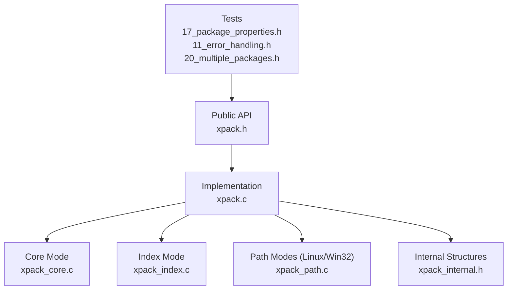
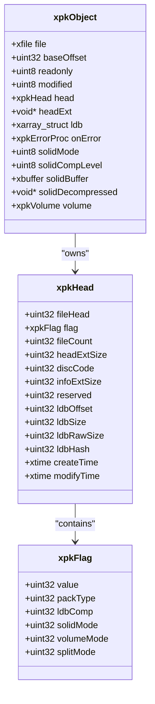
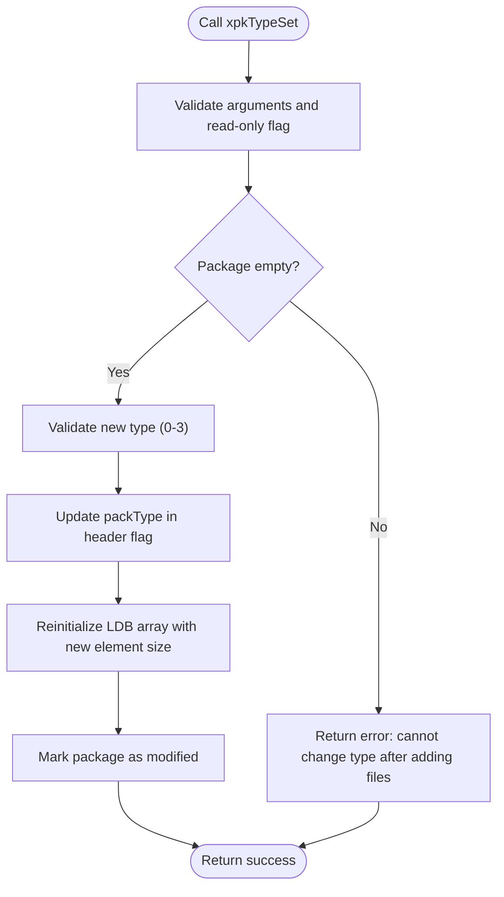
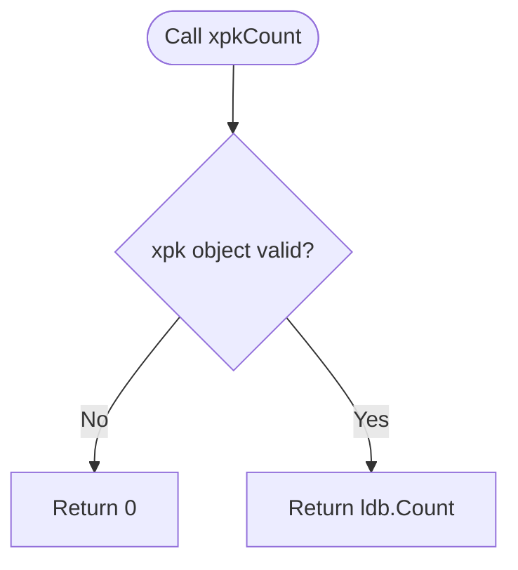
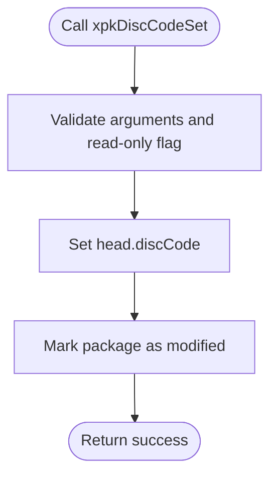
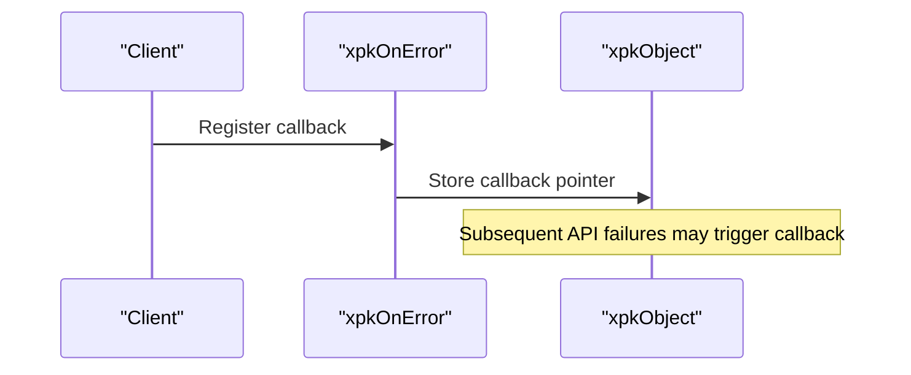
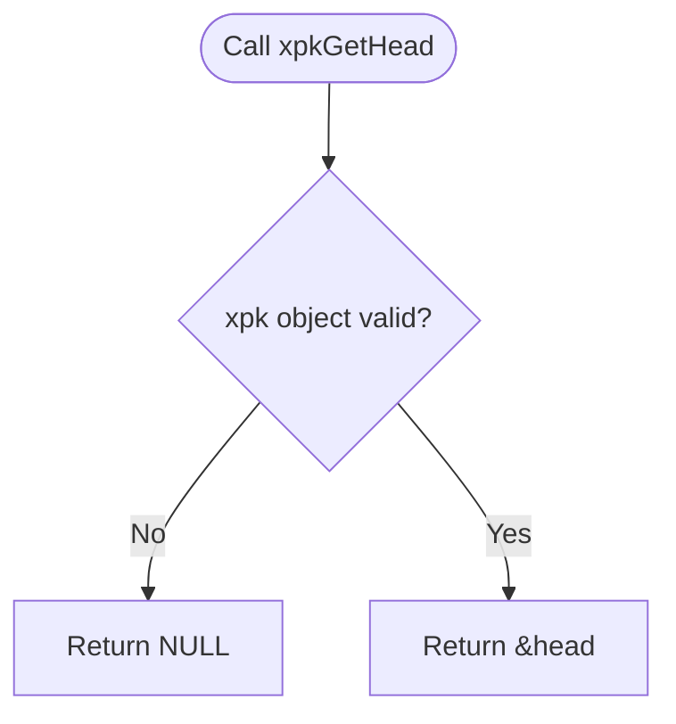
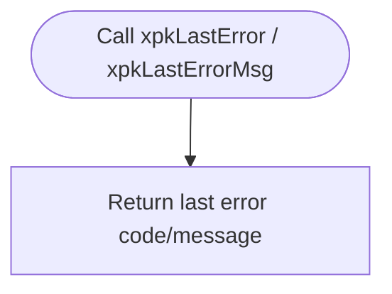
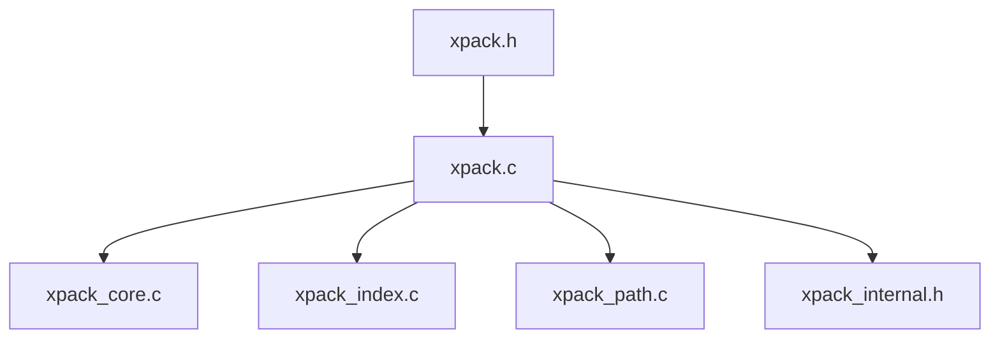

# Package Operations

<cite>
**Referenced Files in This Document**
- [xpack.h](file://src/xpack.h)
- [xpack.c](file://src/xpack.c)
- [xpack_internal.h](file://src/xpack_internal.h)
- [xpack_core.c](file://src/xpack_core.c)
- [xpack_index.c](file://src/xpack_index.c)
- [xpack_path.c](file://src/xpack_path.c)
- [17_package_properties.h](file://test/17_package_properties.h)
- [11_error_handling.h](file://test/11_error_handling.h)
- [20_multiple_packages.h](file://test/20_multiple_packages.h)
</cite>

## Table of Contents
1. [Introduction](#introduction)
2. [Project Structure](#project-structure)
3. [Core Components](#core-components)
4. [Architecture Overview](#architecture-overview)
5. [Detailed Component Analysis](#detailed-component-analysis)
6. [Dependency Analysis](#dependency-analysis)
7. [Performance Considerations](#performance-considerations)
8. [Troubleshooting Guide](#troubleshooting-guide)
9. [Conclusion](#conclusion)

## Introduction
This document provides comprehensive API documentation for xPack’s package-level operations, focusing on package properties, metadata management, and error handling. It covers the package type manipulation functions (xpkType and xpkTypeSet) across Core, Index, Linux, and Win32 modes, along with xpkCount for file count, xpkDiscCode and xpkDiscCodeSet for custom identification codes, xpkOnError for custom error callbacks, xpkGetHead for header access, and xpkLastError/xpkLastErrorMsg for error retrieval. It also explains the relationship between package types and available file operation modes, including mode switching implications and limitations.

## Project Structure
The package operations are implemented across several modules:
- Public API and data structures: [xpack.h](file://src/xpack.h)
- Implementation of lifecycle and package properties: [xpack.c](file://src/xpack.c)
- Internal structures and helpers: [xpack_internal.h](file://src/xpack_internal.h)
- Mode-specific operations:
  - Core mode: [xpack_core.c](file://src/xpack_core.c)
  - Index mode: [xpack_index.c](file://src/xpack_index.c)
  - Path modes (Linux/Win32): [xpack_path.c](file://src/xpack_path.c)
- Tests demonstrating usage and error handling: [17_package_properties.h](file://test/17_package_properties.h), [11_error_handling.h](file://test/11_error_handling.h), [20_multiple_packages.h](file://test/20_multiple_packages.h)

**Diagram sources**
- [xpack.h](file://src/xpack.h#L329-L441)
- [xpack.c](file://src/xpack.c#L49-L297)
- [xpack_core.c](file://src/xpack_core.c#L1-L403)
- [xpack_index.c](file://src/xpack_index.c#L1-L290)
- [xpack_path.c](file://src/xpack_path.c#L1-L373)
- [xpack_internal.h](file://src/xpack_internal.h#L47-L84)

**Section sources**
- [xpack.h](file://src/xpack.h#L1-L447)
- [xpack.c](file://src/xpack.c#L1-L762)
- [xpack_internal.h](file://src/xpack_internal.h#L1-L145)

## Core Components
This section documents the primary package-level operations and their behavior.

- xpkType: Retrieves the current package type (Core, Index, Linux, Win32).
- xpkTypeSet: Sets the package type, with restrictions and reinitialization of internal structures.
- xpkCount: Returns the number of files in the package.
- xpkDiscCode/xpkDiscCodeSet: Access and set a custom 32-bit identification code stored in the package header.
- xpkOnError: Registers a custom error callback invoked on API failures.
- xpkGetHead: Returns a pointer to the package header structure for inspection.
- xpkLastError/xpkLastErrorMsg: Retrieve the last error code and message.

Key behaviors:
- Type changes require an empty package and are disallowed in read-only mode.
- Disc code updates mark the package as modified.
- Error retrieval is thread-local and persists until overwritten by subsequent operations.

**Section sources**
- [xpack.h](file://src/xpack.h#L339-L345)
- [xpack.c](file://src/xpack.c#L303-L360)
- [xpack.c](file://src/xpack.c#L622-L640)

## Architecture Overview
The package object encapsulates file operations, metadata, and runtime state. The public API delegates to mode-specific implementations, while internal helpers manage arrays, compression routing, and volume handling.

**Diagram sources**
- [xpack.h](file://src/xpack.h#L118-L148)
- [xpack.h](file://src/xpack.h#L102-L115)
- [xpack_internal.h](file://src/xpack_internal.h#L47-L84)

## Detailed Component Analysis

### Package Type Manipulation (xpkType and xpkTypeSet)
- Purpose: Select and switch the package mode (Core, Index, Linux, Win32).
- Behavior:
  - xpkType reads the packType field from the header flag.
  - xpkTypeSet validates the new type, enforces constraints (empty package, writable), reinitializes the LDB array sized according to the selected mode, and marks the package as modified.
- Implications:
  - Changing type affects the size and layout of file entries in the LDB.
  - Mode switching is not permitted after files have been added.
  - Core mode is the default for newly created packages.

**Diagram sources**
- [xpack.c](file://src/xpack.c#L308-L329)

**Section sources**
- [xpack.h](file://src/xpack.h#L38-L41)
- [xpack.c](file://src/xpack.c#L303-L329)
- [xpack_internal.h](file://src/xpack_internal.h#L90-L96)

### File Count Retrieval (xpkCount)
- Purpose: Obtain the number of files currently in the package.
- Behavior: Returns the count maintained by the LDB array.

**Diagram sources**
- [xpack.c](file://src/xpack.c#L331-L334)

**Section sources**
- [xpack.c](file://src/xpack.c#L331-L334)

### Disc Code Management (xpkDiscCode and xpkDiscCodeSet)
- Purpose: Store and retrieve a custom 32-bit identification code in the package header.
- Behavior:
  - xpkDiscCode returns the stored disc code.
  - xpkDiscCodeSet updates the disc code and marks the package as modified.
- Persistence: The disc code is saved with the package header during xpkSave.

**Diagram sources**
- [xpack.c](file://src/xpack.c#L341-L350)

**Section sources**
- [xpack.c](file://src/xpack.c#L336-L350)

### Error Callback Registration (xpkOnError)
- Purpose: Register a custom error callback invoked on API failures.
- Behavior: Stores the provided callback pointer in the package object for later invocation.

**Diagram sources**
- [xpack.c](file://src/xpack.c#L352-L355)

**Section sources**
- [xpack.c](file://src/xpack.c#L352-L355)

### Header Access (xpkGetHead)
- Purpose: Retrieve a pointer to the package header for inspection.
- Behavior: Returns a pointer to the internal xpkHead structure.

**Diagram sources**
- [xpack.c](file://src/xpack.c#L357-L360)

**Section sources**
- [xpack.c](file://src/xpack.c#L357-L360)

### Error Retrieval (xpkLastError and xpkLastErrorMsg)
- Purpose: Obtain the last error code and message.
- Behavior: Thread-local storage is used to track the last error state. The message array is populated with either the provided message or a predefined message based on the code.

**Diagram sources**
- [xpack.c](file://src/xpack.c#L634-L640)

**Section sources**
- [xpack.c](file://src/xpack.c#L22-L43)
- [xpack.c](file://src/xpack.c#L622-L640)

### Relationship Between Package Types and File Operation Modes
- Core mode:
  - Files are accessed by numeric position.
  - Suitable for simple sequential access and straightforward batch operations.
  - Example usage: [xpack_core.c](file://src/xpack_core.c#L18-L128)
- Index mode:
  - Files are identified by an integer index; supports user-defined metadata (userData).
  - Requires explicit type setting before use.
  - Example usage: [xpack_index.c](file://src/xpack_index.c#L36-L174)
- Linux mode:
  - Files are addressed by path with case-sensitive hashing; path length is limited.
  - Example usage: [xpack_path.c](file://src/xpack_path.c#L100-L279)
- Win32 mode:
  - Files are addressed by path with case-insensitive hashing and normalized separators.
  - Example usage: [xpack_path.c](file://src/xpack_path.c#L100-L279)

Mode switching implications:
- Type changes are only allowed on empty packages and in writable mode.
- After changing type, the LDB element size changes to match the new mode, affecting memory layout and compatibility.

**Section sources**
- [xpack.h](file://src/xpack.h#L38-L41)
- [xpack.c](file://src/xpack.c#L308-L329)
- [xpack_core.c](file://src/xpack_core.c#L1-L403)
- [xpack_index.c](file://src/xpack_index.c#L1-L290)
- [xpack_path.c](file://src/xpack_path.c#L1-L373)

## Dependency Analysis
The package operations depend on:
- Public API declarations in [xpack.h](file://src/xpack.h#L329-L441)
- Implementation in [xpack.c](file://src/xpack.c#L303-L360) for property getters/setters and error handling
- Mode-specific implementations:
  - Core: [xpack_core.c](file://src/xpack_core.c#L1-L403)
  - Index: [xpack_index.c](file://src/xpack_index.c#L1-L290)
  - Path: [xpack_path.c](file://src/xpack_path.c#L1-L373)
- Internal structures and helpers in [xpack_internal.h](file://src/xpack_internal.h#L47-L84)

**Diagram sources**
- [xpack.h](file://src/xpack.h#L329-L441)
- [xpack.c](file://src/xpack.c#L49-L297)
- [xpack_core.c](file://src/xpack_core.c#L1-L403)
- [xpack_index.c](file://src/xpack_index.c#L1-L290)
- [xpack_path.c](file://src/xpack_path.c#L1-L373)
- [xpack_internal.h](file://src/xpack_internal.h#L47-L84)

**Section sources**
- [xpack.h](file://src/xpack.h#L329-L441)
- [xpack.c](file://src/xpack.c#L49-L297)
- [xpack_internal.h](file://src/xpack_internal.h#L47-L84)

## Performance Considerations
- Type changes require reinitializing the LDB array, which can be expensive for large packages.
- Disc code updates mark the package as modified; frequent updates increase save overhead.
- Error handling uses thread-local storage; keep error checks minimal in hot paths.
- Solid mode affects both storage and access patterns; consider trade-offs between compression ratio and random access performance.

## Troubleshooting Guide
Common issues and strategies:
- Invalid package type after adding files:
  - Symptom: xpkTypeSet fails with a type mismatch error.
  - Resolution: Ensure the package is empty before changing type.
  - Reference: [xpack.c](file://src/xpack.c#L314-L317)
- Readonly mode write attempts:
  - Symptom: Append/update/remove operations return errors.
  - Resolution: Open with writable mode or avoid write operations.
  - Reference: [xpack_core.c](file://src/xpack_core.c#L19-L36), [xpack_index.c](file://src/xpack_index.c#L36-L67), [xpack_path.c](file://src/xpack_path.c#L100-L136)
- Out-of-range positions:
  - Symptom: Extract/update/remove with invalid indices fail.
  - Resolution: Verify xpkCount and use valid positions.
  - Reference: [xpack_core.c](file://src/xpack_core.c#L147-L207)
- Corrupted or unsupported signatures:
  - Symptom: xpkOpen returns NULL or behaves unexpectedly.
  - Resolution: Validate file integrity and version compatibility.
  - Reference: [xpack.c](file://src/xpack.c#L98-L104), [11_error_handling.h](file://test/11_error_handling.h#L131-L153)

**Section sources**
- [xpack.c](file://src/xpack.c#L314-L317)
- [xpack_core.c](file://src/xpack_core.c#L19-L36)
- [xpack_index.c](file://src/xpack_index.c#L36-L67)
- [xpack_path.c](file://src/xpack_path.c#L100-L136)
- [xpack_core.c](file://src/xpack_core.c#L147-L207)
- [xpack.c](file://src/xpack.c#L98-L104)
- [11_error_handling.h](file://test/11_error_handling.h#L131-L153)

## Conclusion
xPack’s package-level operations provide robust mechanisms for managing package properties, metadata, and error handling. Type manipulation is constrained to ensure data integrity, while disc code and header access enable flexible identification and inspection. Mode-specific operations align with distinct access patterns, and error handling is centralized with thread-local state and optional callbacks. Following the guidelines and constraints outlined here ensures reliable and efficient package management across Core, Index, Linux, and Win32 modes.