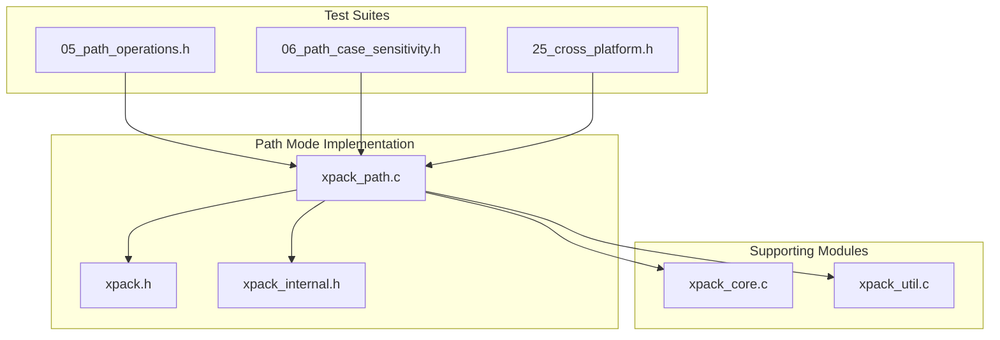
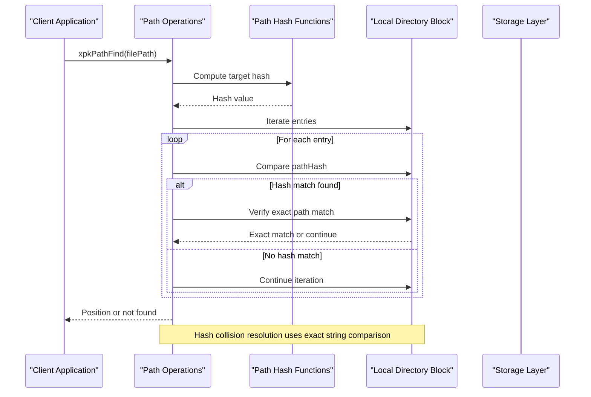
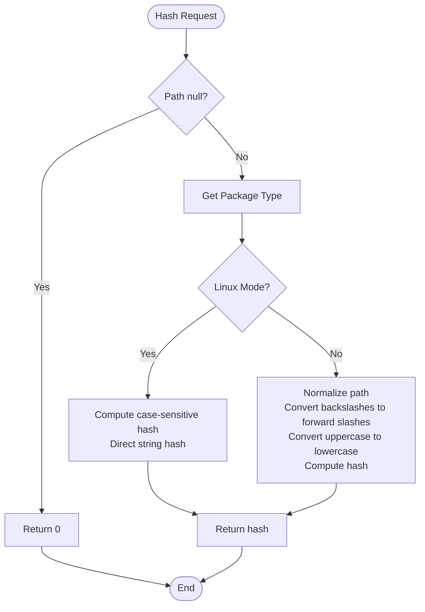
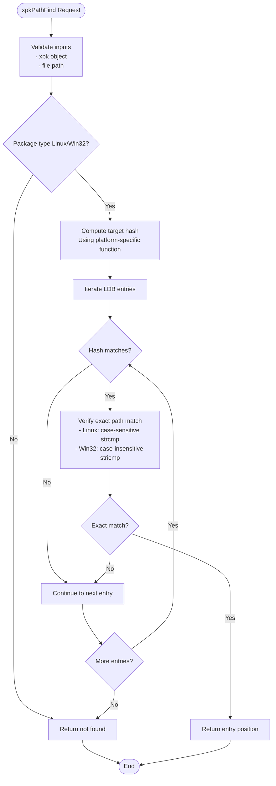
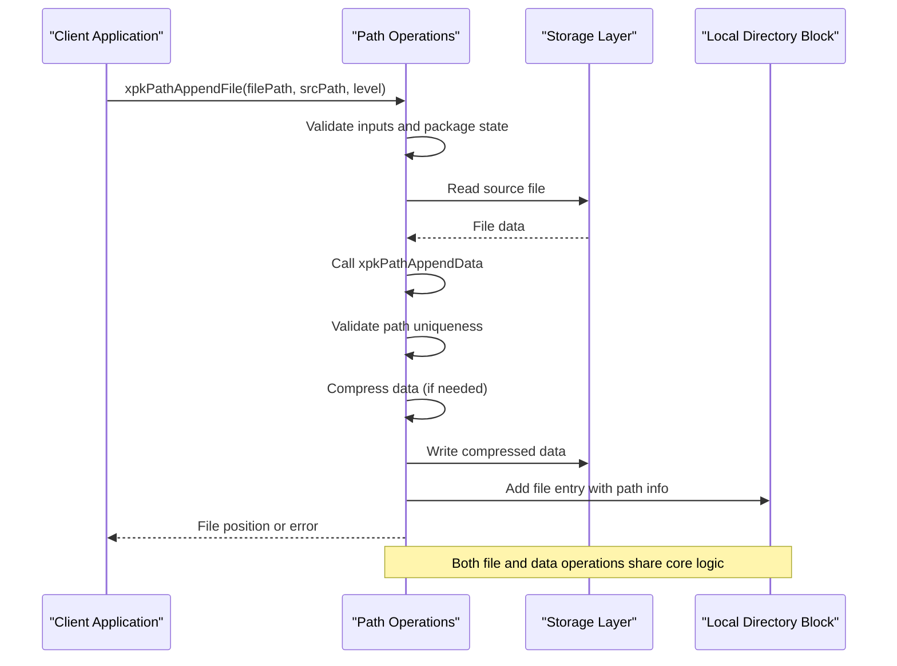
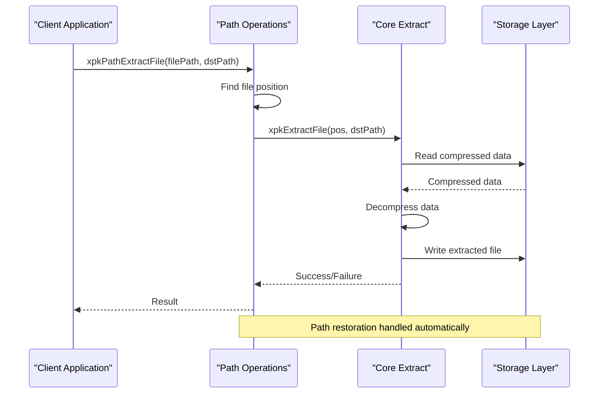
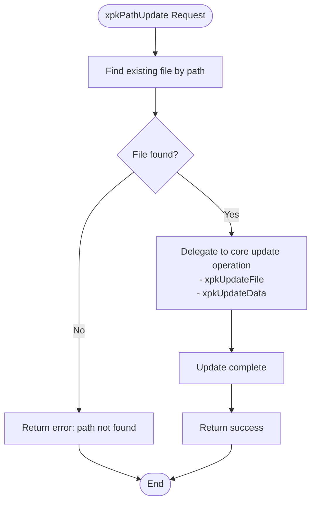
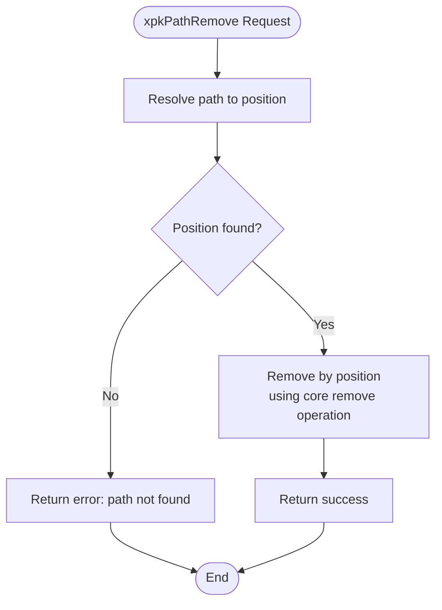
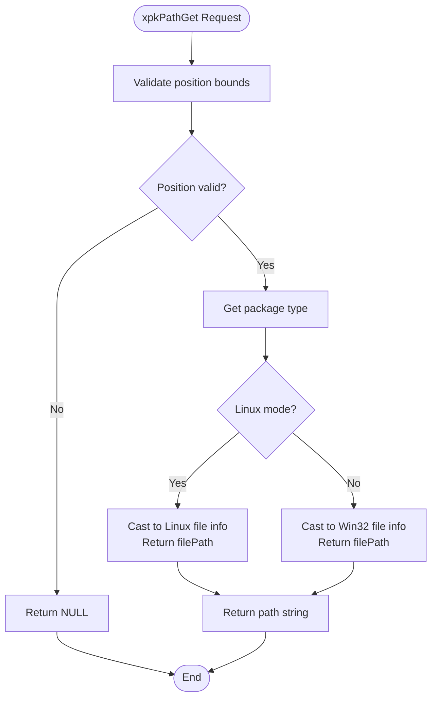
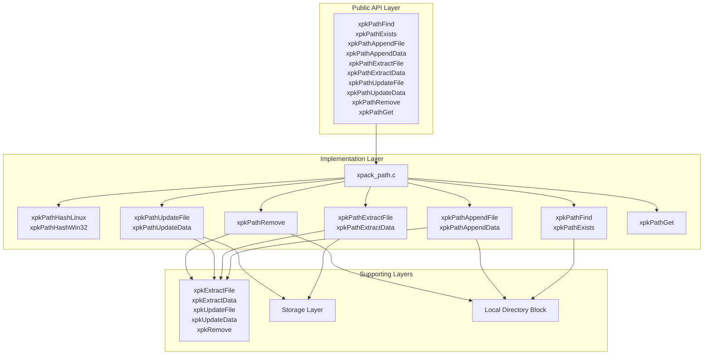

# Path Mode Operations

<cite>
**Referenced Files in This Document**
- [xpack_path.c](file://src/xpack_path.c)
- [xpack.h](file://src/xpack.h)
- [xpack_internal.h](file://src/xpack_internal.h)
- [xpack_core.c](file://src/xpack_core.c)
- [xpack_util.c](file://src/xpack_util.c)
- [05_path_operations.h](file://test/05_path_operations.h)
- [06_path_case_sensitivity.h](file://test/06_path_case_sensitivity.h)
- [25_cross_platform.h](file://test/25_cross_platform.h)
</cite>

## Table of Contents
1. [Introduction](#introduction)
2. [Project Structure](#project-structure)
3. [Core Components](#core-components)
4. [Architecture Overview](#architecture-overview)
5. [Detailed Component Analysis](#detailed-component-analysis)
6. [Dependency Analysis](#dependency-analysis)
7. [Performance Considerations](#performance-considerations)
8. [Troubleshooting Guide](#troubleshooting-guide)
9. [Conclusion](#conclusion)
10. [Appendices](#appendices)

## Introduction
This document provides comprehensive API documentation for xPack's Path mode operations, focusing on file path-based access across Linux and Win32 modes. It covers the complete set of path-based APIs including file location and existence checking, file addition with path preservation, extraction with path restoration, file modification, deletion, and path retrieval by position. The document explains the case sensitivity differences between Linux (case-sensitive) and Win32 (case-insensitive) modes, including platform-specific behavior and migration considerations. Practical examples demonstrate path-based workflows, cross-platform compatibility, and best practices for path management across different operating systems.

## Project Structure
The path mode functionality is implemented primarily in the path module with supporting infrastructure in the core and utility modules. The key files include:

- Path operations implementation: `src/xpack_path.c`
- Public API declarations: `src/xpack.h`
- Internal structures and helpers: `src/xpack_internal.h`
- Core extraction utilities: `src/xpack_core.c`
- Utility functions and batch operations: `src/xpack_util.c`
- Test suites demonstrating usage: `test/05_path_operations.h`, `test/06_path_case_sensitivity.h`, `test/25_cross_platform.h`

**Diagram sources**
- [xpack_path.c](file://src/xpack_path.c#L1-L373)
- [xpack.h](file://src/xpack.h#L405-L417)
- [xpack_internal.h](file://src/xpack_internal.h#L1-L145)

**Section sources**
- [xpack_path.c](file://src/xpack_path.c#L1-L373)
- [xpack.h](file://src/xpack.h#L405-L417)

## Core Components
The path mode operations consist of several key functional areas:

### Path Hashing Functions
- `xpkPathHashLinux`: Computes case-sensitive hash for Linux paths
- `xpkPathHashWin32`: Computes case-insensitive hash for Win32 paths with forward slash normalization

### Path Lookup Operations
- `xpkPathFind`: Locates files by path with hash-based indexing
- `xpkPathExists`: Checks file existence without returning position

### Path Manipulation Operations
- `xpkPathAppendFile`: Adds files from disk preserving original paths
- `xpkPathAppendData`: Adds memory data with path preservation
- `xpkPathExtractFile`: Extracts files to disk with path restoration
- `xpkPathExtractData`: Extracts data to memory with path restoration
- `xpkPathUpdateFile`: Updates existing files from disk
- `xpkPathUpdateData`: Updates existing files from memory
- `xpkPathRemove`: Deletes files by path
- `xpkPathGet`: Retrieves file paths by position

### Platform-Specific Behavior
- Linux mode: Case-sensitive path comparison, preserves original case
- Win32 mode: Case-insensitive path comparison, converts backslashes to forward slashes during hash computation

**Section sources**
- [xpack_path.c](file://src/xpack_path.c#L18-L94)
- [xpack.h](file://src/xpack.h#L405-L417)

## Architecture Overview
The path mode architecture implements a hybrid approach combining hash indexing with precise string comparison for collision resolution:

**Diagram sources**
- [xpack_path.c](file://src/xpack_path.c#L52-L94)
- [xpack_internal.h](file://src/xpack_internal.h#L90-L96)

The architecture ensures efficient O(n) lookup with hash-based early filtering, where n is the number of files in the package. The hash functions handle platform-specific differences transparently.

**Section sources**
- [xpack_path.c](file://src/xpack_path.c#L52-L94)
- [xpack_internal.h](file://src/xpack_internal.h#L90-L96)

## Detailed Component Analysis

### Path Hashing Implementation
The hashing system provides platform-specific behavior through dedicated functions:

**Diagram sources**
- [xpack_path.c](file://src/xpack_path.c#L18-L46)

Key characteristics:
- Linux hashing: Direct character-by-character hash computation
- Win32 hashing: Normalizes path separators and case for case-insensitive comparison
- Path length validation prevents buffer overflow
- Efficient hash computation using internal hash library

**Section sources**
- [xpack_path.c](file://src/xpack_path.c#L18-L46)

### Path Finding and Existence Checking
The path lookup system combines hash-based filtering with exact string comparison:

**Diagram sources**
- [xpack_path.c](file://src/xpack_path.c#L52-L94)

The system provides O(n) worst-case complexity with typical performance improvements through hash-based filtering. The `xpkPathExists` function uses the same mechanism but returns boolean results.

**Section sources**
- [xpack_path.c](file://src/xpack_path.c#L52-L94)

### Path Addition Operations
The path addition system handles both file-based and data-based additions:

**Diagram sources**
- [xpack_path.c](file://src/xpack_path.c#L100-L136)
- [xpack_path.c](file://src/xpack_path.c#L138-L279)

Key validation steps include:
- Package state checks (not read-only, not solid mode)
- Path uniqueness verification
- Path length validation (maximum 200 characters)
- Compression level bounds checking
- Memory allocation failure handling

**Section sources**
- [xpack_path.c](file://src/xpack_path.c#L100-L136)
- [xpack_path.c](file://src/xpack_path.c#L138-L279)

### Path Extraction Operations
Extraction operations restore files to their original paths:

**Diagram sources**
- [xpack_path.c](file://src/xpack_path.c#L285-L307)
- [xpack_core.c](file://src/xpack_core.c#L147-L188)

The extraction process maintains path structure by writing files to their stored paths relative to the destination directory, enabling automatic directory recreation.

**Section sources**
- [xpack_path.c](file://src/xpack_path.c#L285-L307)
- [xpack_core.c](file://src/xpack_core.c#L147-L188)

### Path Update Operations
Update operations replace existing file content while preserving path metadata:

**Diagram sources**
- [xpack_path.c](file://src/xpack_path.c#L313-L337)

Update operations maintain the same position in the package, preserving file ordering and metadata while replacing content.

**Section sources**
- [xpack_path.c](file://src/xpack_path.c#L313-L337)

### Path Removal Operations
Deletion operations remove files by path with position resolution:

**Diagram sources**
- [xpack_path.c](file://src/xpack_path.c#L343-L353)

Removal operations cascade through the package structure, maintaining internal consistency and updating indices.

**Section sources**
- [xpack_path.c](file://src/xpack_path.c#L343-L353)

### Path Retrieval Operations
The path retrieval system provides indexed access to stored paths:

**Diagram sources**
- [xpack_path.c](file://src/xpack_path.c#L359-L372)

Path retrieval enables enumeration and inspection of stored file paths without requiring external mapping.

**Section sources**
- [xpack_path.c](file://src/xpack_path.c#L359-L372)

## Dependency Analysis
The path mode operations have well-defined dependencies and relationships:

**Diagram sources**
- [xpack_path.c](file://src/xpack_path.c#L1-L373)
- [xpack.h](file://src/xpack.h#L405-L417)

The dependency graph shows clear separation of concerns with path-specific operations delegating to core functionality while maintaining platform-specific behavior.

**Section sources**
- [xpack_path.c](file://src/xpack_path.c#L1-L373)
- [xpack.h](file://src/xpack.h#L405-L417)

## Performance Considerations
The path mode operations are designed for optimal performance through several mechanisms:

### Hash-Based Indexing
- O(n) lookup complexity with hash-based filtering
- Collision resolution through exact string comparison
- Platform-specific hash functions minimize collisions

### Memory Management
- Efficient buffer allocation for compression operations
- Proper cleanup on error paths
- Minimal memory overhead per file entry

### Compression Integration
- Adaptive compression based on file characteristics
- Memory-efficient compression/decompression pipeline
- Configurable compression levels (0-15)

### Storage Efficiency
- Direct data streaming to/from storage
- Minimal intermediate buffering
- Optimized I/O patterns for sequential access

## Troubleshooting Guide

### Common Error Scenarios
1. **Path Not Found**: Occurs when `xpkPathFind` cannot locate the specified path
2. **Path Already Exists**: Thrown when attempting to add files with duplicate paths
3. **Invalid Package Type**: Error when operations are performed on unsupported package types
4. **Read-Only Mode**: Operations fail when attempting modifications to read-only packages
5. **Solid Mode Restrictions**: Cannot append/update/remove in solid mode packages

### Case Sensitivity Issues
- **Linux Mode**: Paths are case-sensitive; ensure consistent casing
- **Win32 Mode**: Paths are case-insensitive; case variations are treated as identical
- **Migration**: When converting between platforms, verify path case consistency

### Path Length Limitations
- Maximum path length: 200 characters
- Exceeding this limit results in immediate rejection
- Consider relative paths for deeply nested structures

### Platform-Specific Considerations
- **Path Separators**: Win32 mode normalizes backslashes to forward slashes
- **Case Handling**: Linux mode preserves original case; Win32 mode ignores case differences
- **Directory Structure**: Extraction automatically recreates directory hierarchies

**Section sources**
- [xpack_path.c](file://src/xpack_path.c#L138-L279)
- [xpack_path.c](file://src/xpack_path.c#L52-L94)

## Conclusion
The xPack Path mode operations provide a robust, cross-platform solution for file path-based access with platform-specific optimizations. The implementation balances performance through hash-based indexing with reliability through exact string comparison for collision resolution. The case sensitivity differences between Linux and Win32 modes enable seamless cross-platform compatibility while maintaining platform-appropriate behavior.

Key strengths include:
- Efficient O(n) lookup with hash-based filtering
- Comprehensive path manipulation capabilities
- Platform-specific optimizations for both Linux and Win32 environments
- Robust error handling and validation
- Automatic path restoration during extraction

The API design enables practical workflows for file management across different operating systems while maintaining performance and reliability standards.

## Appendices

### API Reference Summary
- **Lookup**: `xpkPathFind`, `xpkPathExists`
- **Addition**: `xpkPathAppendFile`, `xpkPathAppendData`
- **Extraction**: `xpkPathExtractFile`, `xpkPathExtractData`
- **Modification**: `xpkPathUpdateFile`, `xpkPathUpdateData`
- **Deletion**: `xpkPathRemove`
- **Retrieval**: `xpkPathGet`

### Best Practices
1. **Consistent Path Formatting**: Use forward slashes for cross-platform compatibility
2. **Case Management**: Be aware of platform-specific case sensitivity
3. **Path Validation**: Check path lengths and uniqueness before operations
4. **Error Handling**: Implement proper error checking for all operations
5. **Performance Considerations**: Batch operations when possible to minimize I/O overhead

### Migration Guidelines
- **Linux to Win32**: Convert all paths to lowercase for case-insensitive compatibility
- **Win32 to Linux**: Preserve original case sensitivity requirements
- **Cross-Platform Tools**: Use forward slashes universally
- **Testing**: Validate path behavior across target platforms before deployment