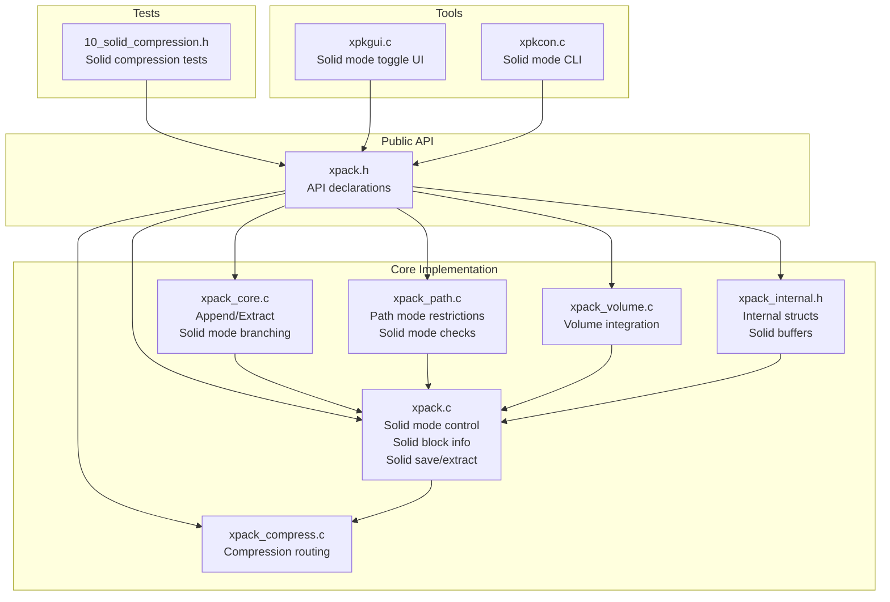
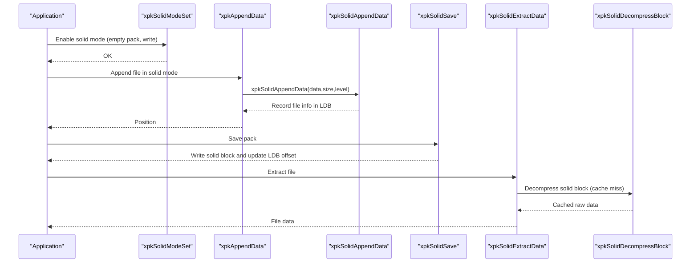
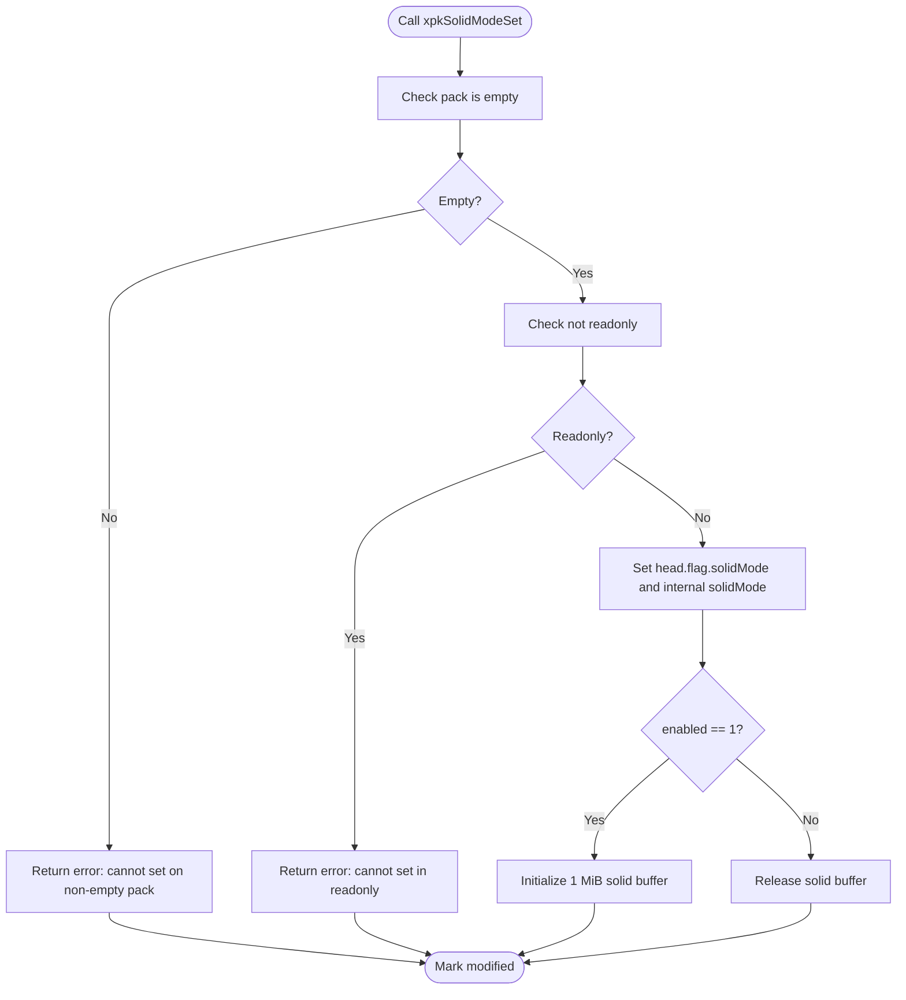
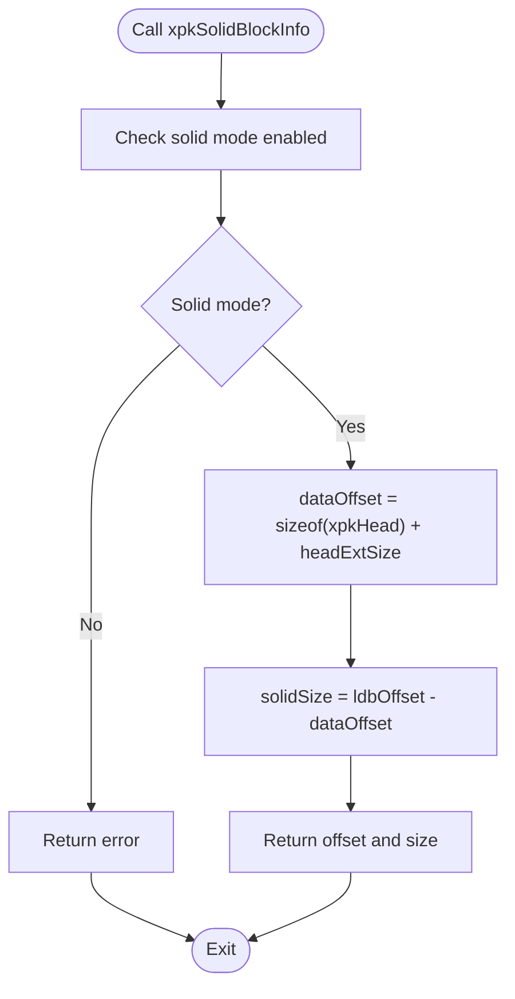
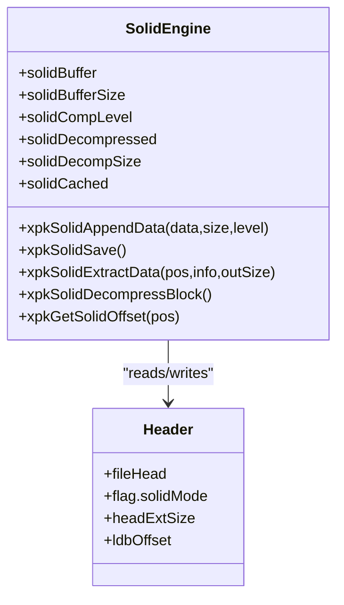
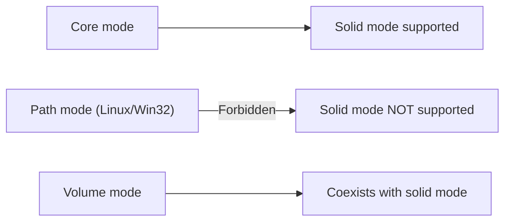
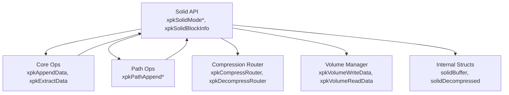

# Solid Compression Control

<cite>
**Referenced Files in This Document**
- [xpack.h](file://src/xpack.h)
- [xpack.c](file://src/xpack.c)
- [xpack_internal.h](file://src/xpack_internal.h)
- [xpack_core.c](file://src/xpack_core.c)
- [xpack_compress.c](file://src/xpack_compress.c)
- [xpack_path.c](file://src/xpack_path.c)
- [xpack_volume.c](file://src/xpack_volume.c)
- [10_solid_compression.h](file://test/10_solid_compression.h)
- [xpkgui.c](file://tools/xpkgui/xpkgui.c)
- [xpkcon.c](file://tools/xpkcon/xpkcon.c)
</cite>

## Table of Contents
1. [Introduction](#introduction)
2. [Project Structure](#project-structure)
3. [Core Components](#core-components)
4. [Architecture Overview](#architecture-overview)
5. [Detailed Component Analysis](#detailed-component-analysis)
6. [Dependency Analysis](#dependency-analysis)
7. [Performance Considerations](#performance-considerations)
8. [Troubleshooting Guide](#troubleshooting-guide)
9. [Conclusion](#conclusion)
10. [Appendices](#appendices)

## Introduction
This document provides comprehensive API documentation for xPack’s solid compression control interface. It focuses on enabling and disabling solid compression mode, retrieving solid block information, and integrating solid compression with different package types. It also covers the benefits and trade-offs of solid compression, performance implications, memory usage patterns, best practices, and troubleshooting guidance.

## Project Structure
The solid compression functionality is implemented within the core xPack library and integrates with compression routing, file operations, and volume management. The primary API surface for solid compression is declared in the public header and implemented in the core library.

**Diagram sources**
- [xpack.h](file://src/xpack.h#L347-L352)
- [xpack.c](file://src/xpack.c#L366-L421)
- [xpack_core.c](file://src/xpack_core.c#L39-L128)
- [xpack_path.c](file://src/xpack_path.c#L100-L162)
- [xpack_compress.c](file://src/xpack_compress.c#L20-L147)
- [xpack_volume.c](file://src/xpack_volume.c#L44-L160)
- [xpack_internal.h](file://src/xpack_internal.h#L47-L84)
- [10_solid_compression.h](file://test/10_solid_compression.h#L7-L33)
- [xpkgui.c](file://tools/xpkgui/xpkgui.c#L1425-L1457)
- [xpkcon.c](file://tools/xpkcon/xpkcon.c#L339-L376)

**Section sources**
- [xpack.h](file://src/xpack.h#L347-L352)
- [xpack.c](file://src/xpack.c#L366-L421)
- [xpack_internal.h](file://src/xpack_internal.h#L47-L84)

## Core Components
- Solid mode control API:
  - xpkSolidMode(xpkObject): returns current solid mode state (0 or 1).
  - xpkSolidModeSet(xpkObject, int enabled): enables or disables solid mode; requires empty pack and write mode.
  - xpkSolidBlockInfo(xpkObject, uint32_t* offset, uint32_t* size): retrieves solid block offset and size when solid mode is enabled.
- Internal solid compression engine:
  - xpkSolidAppendData: appends data to the solid buffer and records file info.
  - xpkSolidSave: compresses and writes the solid block; updates LDB offset.
  - xpkSolidExtractData: extracts a file from the solid block using cached decompressed data.
  - xpkSolidDecompressBlock: decompresses the entire solid block into memory cache.
  - xpkGetSolidOffset: computes cumulative offsets for files within the solid block.
- Integration points:
  - Core append/extract branches to solid functions when solid mode is enabled.
  - Path mode explicitly forbids appending to solid archives.
  - Volume mode coexists with solid mode; both are saved in the pack header.

**Section sources**
- [xpack.h](file://src/xpack.h#L347-L352)
- [xpack.c](file://src/xpack.c#L366-L421)
- [xpack.c](file://src/xpack.c#L427-L616)
- [xpack_core.c](file://src/xpack_core.c#L46-L49)
- [xpack_path.c](file://src/xpack_path.c#L114-L118)

## Architecture Overview
Solid compression operates by aggregating all files into a single compressed block stored after the pack header and header extension. The LDB stores per-file metadata with offsets relative to the solid block. On extraction, the entire solid block is decompressed once and individual files are copied from the cached buffer.

**Diagram sources**
- [xpack.c](file://src/xpack.c#L371-L408)
- [xpack_core.c](file://src/xpack_core.c#L46-L49)
- [xpack.c](file://src/xpack.c#L427-L478)
- [xpack.c](file://src/xpack.c#L480-L525)
- [xpack.c](file://src/xpack.c#L527-L556)
- [xpack.c](file://src/xpack.c#L558-L606)

## Detailed Component Analysis

### Solid Mode Control API
- xpkSolidMode(xpkObject):
  - Purpose: Query whether solid mode is currently enabled.
  - Behavior: Returns 1 if enabled, 0 otherwise.
- xpkSolidModeSet(xpkObject, int enabled):
  - Purpose: Enable or disable solid mode.
  - Constraints:
    - Pack must be empty (no files added).
    - Must be writable.
    - Enabling initializes a 1 MiB solid buffer; disabling releases it.
  - Side effects: Updates header flag and internal state; marks pack as modified.
- xpkSolidBlockInfo(xpkObject, uint32_t* offset, uint32_t* size):
  - Purpose: Retrieve the solid block’s offset and size.
  - Preconditions: Solid mode must be enabled.
  - Output: offset = header + headerExt size; size = ldbOffset - dataOffset.

**Diagram sources**
- [xpack.c](file://src/xpack.c#L371-L408)

**Section sources**
- [xpack.h](file://src/xpack.h#L347-L352)
- [xpack.c](file://src/xpack.c#L366-L421)

### Solid Block Information Retrieval
- xpkSolidBlockInfo returns:
  - offset: start of solid block after header and header extension.
  - size: total size of the solid block.
- These values are computed from header fields and are useful for:
  - Verifying solid block boundaries.
  - Debugging and diagnostics.
  - Integrating with external tools or custom readers.

**Diagram sources**
- [xpack.c](file://src/xpack.c#L410-L421)

**Section sources**
- [xpack.c](file://src/xpack.c#L410-L421)

### Solid Compression Internals
- xpkSolidAppendData:
  - Computes file hash.
  - Appends raw data to the solid buffer (skips empty data).
  - Records file info in LDB with compLevel and hash.
  - Updates modified flag.
- xpkSolidSave:
  - Compresses the solid buffer using the selected compression level.
  - Writes compressed block to disk.
  - Updates head.ldbOffset to mark end of solid block.
  - Saves LDB and clears the solid buffer.
- xpkSolidExtractData:
  - On first access, decompresses the entire solid block into memory.
  - Uses xpkGetSolidOffset to locate the file within the solid block.
  - Copies the file data from the cached buffer.
- xpkSolidDecompressBlock:
  - Reads compressed solid block.
  - Computes total raw size by summing file sizes.
  - Decompresses into a single contiguous buffer and caches it.
- xpkGetSolidOffset:
  - Accumulates file sizes to compute byte offset within the solid block.

**Diagram sources**
- [xpack_internal.h](file://src/xpack_internal.h#L67-L84)
- [xpack.c](file://src/xpack.c#L427-L616)

**Section sources**
- [xpack.c](file://src/xpack.c#L427-L616)
- [xpack_internal.h](file://src/xpack_internal.h#L67-L84)

### Integration with Package Types
- Core mode:
  - Supports solid mode append/extract.
  - Branches from xpkAppendData/xpkExtractData to solid functions when enabled.
- Path mode (Linux/Win32):
  - Explicitly forbids appending to solid archives.
  - Path operations rely on separate per-file blocks and cannot use solid mode.
- Volume mode:
  - Solid mode and volume mode coexist; both flags are stored in the header.
  - Volume writes occur through the volume manager, which respects solid block boundaries.

**Diagram sources**
- [xpack_core.c](file://src/xpack_core.c#L46-L49)
- [xpack_path.c](file://src/xpack_path.c#L114-L118)
- [xpack_volume.c](file://src/xpack_volume.c#L135-L157)

**Section sources**
- [xpack_core.c](file://src/xpack_core.c#L46-L49)
- [xpack_path.c](file://src/xpack_path.c#L114-L118)
- [xpack_volume.c](file://src/xpack_volume.c#L135-L157)

### Practical Examples
- Enable solid mode and add files:
  - Open a new pack in write mode.
  - Call xpkSolidModeSet(xpk, 1).
  - Add multiple files using xpkAppendData; each becomes part of the solid block.
  - Save the pack; xpkSolidSave writes the compressed solid block.
- Retrieve solid block information:
  - After saving, call xpkSolidBlockInfo to get offset and size.
  - Use these values for diagnostics or external tools.
- Extract files:
  - Open the pack in read mode.
  - Call xpkExtractData for any position; the first extract triggers solid block decompression.
- Integration with tools:
  - Command-line tool sets solid mode during initial archive creation.
  - GUI toggles solid mode only when the pack is empty.

**Section sources**
- [10_solid_compression.h](file://test/10_solid_compression.h#L7-L33)
- [xpkcon.c](file://tools/xpkcon/xpkcon.c#L339-L376)
- [xpkgui.c](file://tools/xpkgui/xpkgui.c#L1425-L1457)

## Dependency Analysis
Solid compression depends on:
- Compression routing (ZSTD, LZ4, LZMA2) for compressing the solid buffer.
- File operations (core/path) for appending/extraction.
- Volume manager for writing solid blocks across multiple volumes.
- Internal structures for managing solid buffers and cached decompressed data.

**Diagram sources**
- [xpack.c](file://src/xpack.c#L366-L421)
- [xpack_core.c](file://src/xpack_core.c#L39-L128)
- [xpack_path.c](file://src/xpack_path.c#L100-L162)
- [xpack_compress.c](file://src/xpack_compress.c#L20-L147)
- [xpack_volume.c](file://src/xpack_volume.c#L178-L229)
- [xpack_internal.h](file://src/xpack_internal.h#L67-L84)

**Section sources**
- [xpack.c](file://src/xpack.c#L366-L421)
- [xpack_core.c](file://src/xpack_core.c#L39-L128)
- [xpack_path.c](file://src/xpack_path.c#L100-L162)
- [xpack_compress.c](file://src/xpack_compress.c#L20-L147)
- [xpack_volume.c](file://src/xpack_volume.c#L178-L229)
- [xpack_internal.h](file://src/xpack_internal.h#L67-L84)

## Performance Considerations
- Benefits of solid compression:
  - Improved compression ratios for datasets with repeated patterns across files.
  - Single pass compression reduces per-file overhead.
- Trade-offs:
  - Random access limitation: extracting a single file requires decompressing the entire solid block.
  - Memory usage: entire solid block is held in memory during decompression.
  - Write-time cost: solid buffer grows as files are appended; compression occurs on save.
- Compression levels:
  - Higher levels improve compression but increase CPU time and memory pressure.
  - Default level is chosen for balanced performance.
- Buffer sizing:
  - Solid buffer initialized to 1 MiB; growing beyond capacity triggers reallocation.
- Volume mode:
  - Solid block is written as a single contiguous region; volume splitting applies around the solid block boundary.

[No sources needed since this section provides general guidance]

## Troubleshooting Guide
Common issues and resolutions:
- Cannot enable solid mode:
  - Cause: Pack contains files or is read-only.
  - Resolution: Ensure pack is empty and writable; call xpkSolidModeSet only on empty packs.
- Cannot append to solid archive:
  - Cause: Path mode explicitly forbids appending to solid archives.
  - Resolution: Use Core mode or disable solid mode before adding via path operations.
- Extraction performance:
  - Cause: First extract triggers full solid block decompression.
  - Resolution: Expect slower first access; subsequent accesses reuse cached data.
- Large solid blocks:
  - Cause: Very large files or many files increase memory usage.
  - Resolution: Monitor memory usage; consider disabling solid mode for extremely large datasets.
- Mixed compression levels:
  - Cause: Solid block uses the first file’s compression level.
  - Resolution: Choose a suitable level for the dataset; changing levels mid-pack is not supported.
- Volume and solid compatibility:
  - Cause: Volume mode writes across multiple files; solid block is contiguous.
  - Resolution: Both modes coexist; ensure correct order of operations (set volume mode before adding files if needed).

**Section sources**
- [xpack.c](file://src/xpack.c#L371-L408)
- [xpack_path.c](file://src/xpack_path.c#L114-L118)
- [xpack_core.c](file://src/xpack_core.c#L147-L207)

## Conclusion
Solid compression in xPack provides significant compression ratio improvements for datasets with cross-file repetition at the cost of random access flexibility and memory usage during extraction. The API is straightforward: enable solid mode on an empty pack, add files, save, and extract. Integration with Core mode is seamless, while Path mode intentionally restricts solid usage. Proper selection of compression levels and awareness of memory patterns are key to successful solid compression workflows.

[No sources needed since this section summarizes without analyzing specific files]

## Appendices

### API Reference Summary
- xpkSolidMode(xpkObject): returns current solid mode state.
- xpkSolidModeSet(xpkObject, int enabled): enables/disables solid mode; requires empty pack and write mode.
- xpkSolidBlockInfo(xpkObject, uint32_t* offset, uint32_t* size): returns solid block offset and size.

**Section sources**
- [xpack.h](file://src/xpack.h#L347-L352)
- [xpack.c](file://src/xpack.c#L366-L421)

### Best Practices
- Use solid mode for:
  - Datasets with repeated patterns across files.
  - Scenarios favoring higher compression over random access.
- Avoid solid mode for:
  - Many small unique files where random access is frequent.
  - Systems with constrained memory.
- Choose compression levels carefully:
  - Lower levels for speed; higher levels for compression.
- Keep packs empty when toggling solid mode.
- Prefer Core mode for solid compression; avoid path mode for solid archives.

[No sources needed since this section provides general guidance]