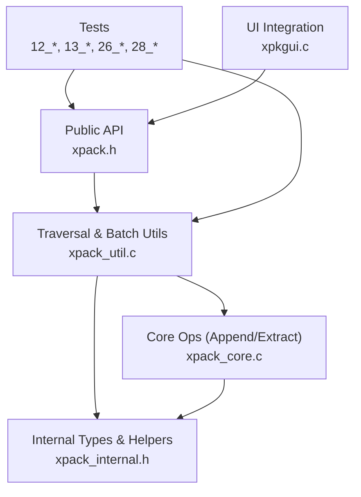
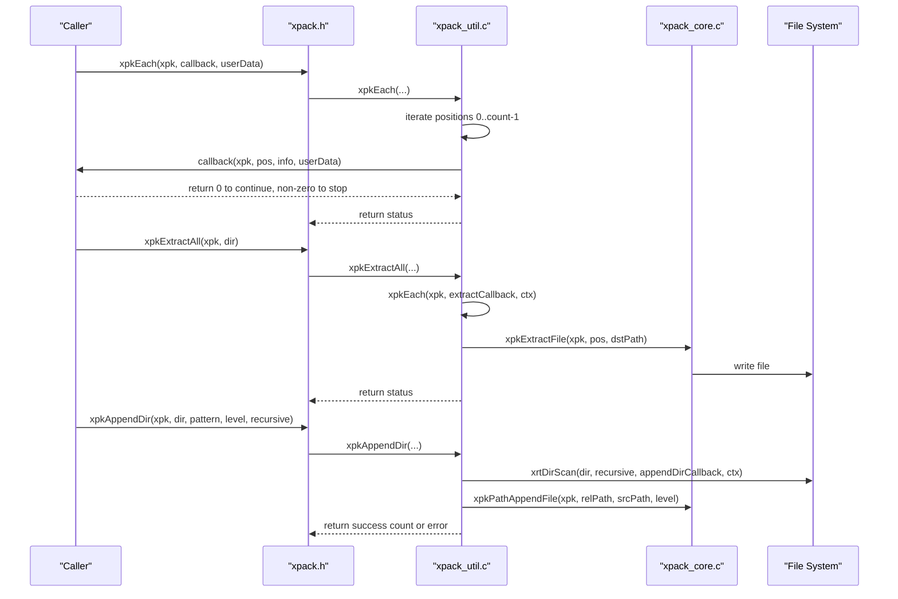
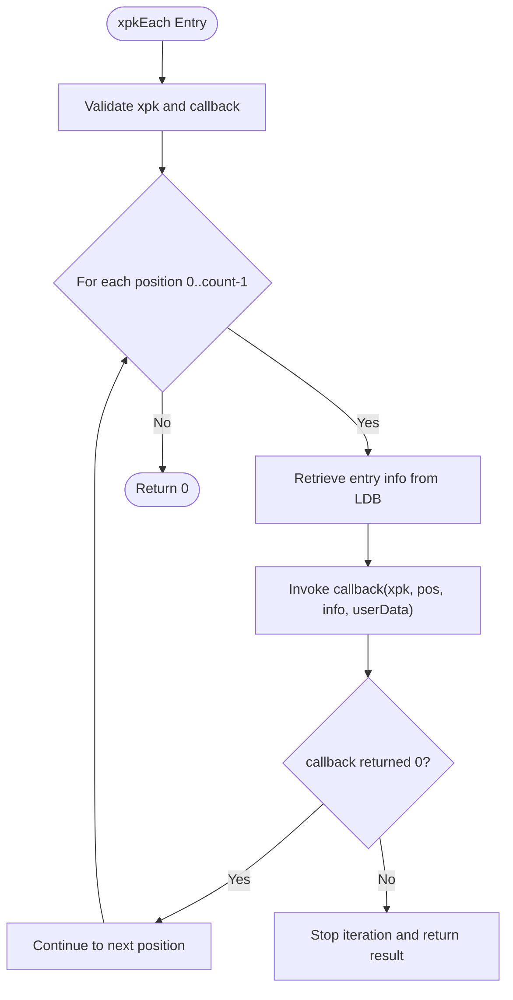
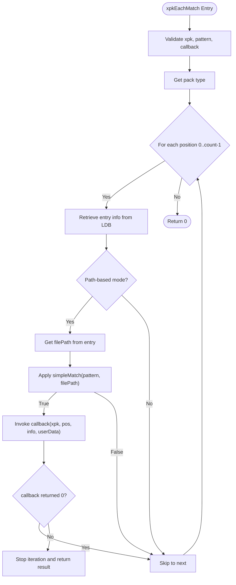
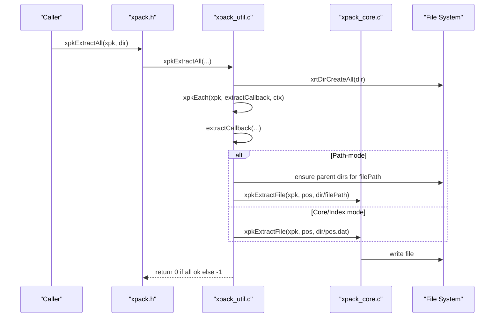
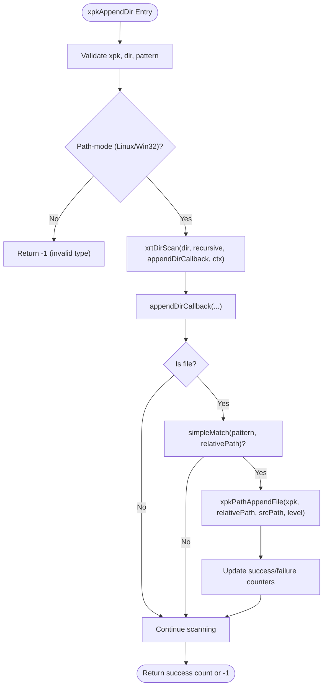
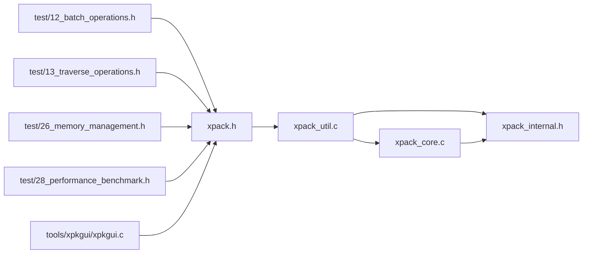

# Traversal and Batch Operations

<cite>
**Referenced Files in This Document**
- [xpack.h](file://src/xpack.h)
- [xpack_util.c](file://src/xpack_util.c)
- [xpack_core.c](file://src/xpack_core.c)
- [xpack_internal.h](file://src/xpack_internal.h)
- [12_batch_operations.h](file://test/12_batch_operations.h)
- [13_traverse_operations.h](file://test/13_traverse_operations.h)
- [26_memory_management.h](file://test/26_memory_management.h)
- [28_performance_benchmark.h](file://test/28_performance_benchmark.h)
- [xpkgui.c](file://tools/xpkgui/xpkgui.c)
</cite>

## Table of Contents
1. [Introduction](#introduction)
2. [Project Structure](#project-structure)
3. [Core Components](#core-components)
4. [Architecture Overview](#architecture-overview)
5. [Detailed Component Analysis](#detailed-component-analysis)
6. [Dependency Analysis](#dependency-analysis)
7. [Performance Considerations](#performance-considerations)
8. [Troubleshooting Guide](#troubleshooting-guide)
9. [Conclusion](#conclusion)

## Introduction
This document provides comprehensive API documentation for xPack’s traversal and batch operation interfaces, focusing on bulk file processing capabilities. It covers:
- xpkEach: Iterating through all package contents with a callback-based processing model
- xpkEachMatch: Pattern-based filtering with wildcard support for selective traversal
- xpkExtractAll: Extracting entire packages to directory structures
- xpkAppendDir: Adding directory trees with optional recursive processing and pattern matching

The guide explains the APIs, implementation patterns, data flows, and integration with file system operations. It also includes performance considerations for large packages, memory management during traversal, best practices for efficient batch operations, and troubleshooting guidance for common scenarios.

## Project Structure
The traversal and batch operations are implemented in the core library and validated through tests. Key locations:
- Public API declarations: [xpack.h](file://src/xpack.h)
- Traversal and batch utilities: [xpack_util.c](file://src/xpack_util.c)
- Core package operations (append/extract): [xpack_core.c](file://src/xpack_core.c)
- Internal structures and helpers: [xpack_internal.h](file://src/xpack_internal.h)
- Tests validating behavior: [12_batch_operations.h](file://test/12_batch_operations.h), [13_traverse_operations.h](file://test/13_traverse_operations.h), [26_memory_management.h](file://test/26_memory_management.h), [28_performance_benchmark.h](file://test/28_performance_benchmark.h)
- UI integration examples: [xpkgui.c](file://tools/xpkgui/xpkgui.c)

**Diagram sources**
- [xpack.h](file://src/xpack.h#L419-L429)
- [xpack_util.c](file://src/xpack_util.c#L96-L306)
- [xpack_core.c](file://src/xpack_core.c#L18-L128)
- [xpack_internal.h](file://src/xpack_internal.h#L47-L145)
- [12_batch_operations.h](file://test/12_batch_operations.h#L197-L247)
- [13_traverse_operations.h](file://test/13_traverse_operations.h#L7-L175)
- [xpkgui.c](file://tools/xpkgui/xpkgui.c#L1749-L1810)

**Section sources**
- [xpack.h](file://src/xpack.h#L419-L429)
- [xpack_util.c](file://src/xpack_util.c#L96-L306)
- [xpack_core.c](file://src/xpack_core.c#L18-L128)
- [xpack_internal.h](file://src/xpack_internal.h#L47-L145)
- [12_batch_operations.h](file://test/12_batch_operations.h#L197-L247)
- [13_traverse_operations.h](file://test/13_traverse_operations.h#L7-L175)
- [xpkgui.c](file://tools/xpkgui/xpkgui.c#L1749-L1810)

## Core Components
This section documents the four primary APIs for traversal and batch operations.

- xpkEach
  - Purpose: Iterate over all entries in a package and invoke a callback for each entry
  - Signature: see [xpack.h](file://src/xpack.h#L421-L421)
  - Behavior: Iterates positions 0..count-1; stops early if callback returns non-zero
  - Typical usage: Bulk statistics, verification, or transformation
  - Example usage in tests: [13_traverse_operations.h](file://test/13_traverse_operations.h#L7-L29), [26_memory_management.h](file://test/26_memory_management.h#L205-L224)

- xpkEachMatch
  - Purpose: Filter entries by a pattern and invoke a callback for matched entries
  - Signature: see [xpack.h](file://src/xpack.h#L422-L422)
  - Pattern support: Wildcards *, ? handled via internal matcher
  - Path-based matching: Uses filePath from path-mode packages (Linux/Win32)
  - Example usage in UI: [xpkgui.c](file://tools/xpkgui/xpkgui.c#L1749-L1810)

- xpkExtractAll
  - Purpose: Extract all entries to a target directory, recreating directory structures
  - Signature: see [xpack.h](file://src/xpack.h#L427-L427)
  - Behavior: Creates directory tree; writes files per entry; handles Core/Index vs path-mode differently
  - Example usage in tests: [12_batch_operations.h](file://test/12_batch_operations.h#L197-L247)

- xpkAppendDir
  - Purpose: Recursively scan a directory and append matching files into a package
  - Signature: see [xpack.h](file://src/xpack.h#L428-L428)
  - Constraints: Requires path-mode packages (Linux/Win32)
  - Pattern matching: Supports wildcards; optionally recursive
  - Example usage in tests: [12_batch_operations.h](file://test/12_batch_operations.h#L249-L374)

**Section sources**
- [xpack.h](file://src/xpack.h#L419-L429)
- [xpack_util.c](file://src/xpack_util.c#L96-L306)
- [xpack_core.c](file://src/xpack_core.c#L18-L128)
- [12_batch_operations.h](file://test/12_batch_operations.h#L197-L247)
- [13_traverse_operations.h](file://test/13_traverse_operations.h#L7-L29)
- [26_memory_management.h](file://test/26_memory_management.h#L205-L224)
- [xpkgui.c](file://tools/xpkgui/xpkgui.c#L1749-L1810)

## Architecture Overview
The traversal and batch operations rely on:
- Public API surface in xpack.h
- Utility implementations in xpack_util.c for traversal and batch logic
- Core append/extract routines in xpack_core.c for data handling
- Internal structures and helpers in xpack_internal.h for object lifecycle and offsets
- Tests validating correctness and performance
- UI integration demonstrating real-world usage

**Diagram sources**
- [xpack.h](file://src/xpack.h#L419-L429)
- [xpack_util.c](file://src/xpack_util.c#L96-L306)
- [xpack_core.c](file://src/xpack_core.c#L134-L145)

## Detailed Component Analysis

### xpkEach: Callback-Based Iteration
- Purpose: Iterate all entries in a package and process metadata via a callback
- Implementation highlights:
  - Iterates over internal LDB indices
  - Invokes callback with xpk handle, position, and entry info pointer
  - Stops immediately if callback returns non-zero
- Typical callback responsibilities:
  - Read metadata (sizes, hashes, compression level)
  - Perform transformations or validations
  - Accumulate counts or aggregate statistics
- Example usage patterns:
  - Traverse and verify entries: [13_traverse_operations.h](file://test/13_traverse_operations.h#L89-L113)
  - Count entries with null callback: [26_memory_management.h](file://test/26_memory_management.h#L205-L224)

**Diagram sources**
- [xpack_util.c](file://src/xpack_util.c#L96-L109)
- [xpack_internal.h](file://src/xpack_internal.h#L90-L96)

**Section sources**
- [xpack_util.c](file://src/xpack_util.c#L96-L109)
- [xpack_internal.h](file://src/xpack_internal.h#L90-L96)
- [13_traverse_operations.h](file://test/13_traverse_operations.h#L89-L113)
- [26_memory_management.h](file://test/26_memory_management.h#L205-L224)

### xpkEachMatch: Pattern-Based Filtering with Wildcards
- Purpose: Apply a pattern filter to entries and invoke a callback for matches
- Pattern matching:
  - Wildcard * matches any sequence
  - Wildcard ? matches any single character
  - Implemented via internal simpleMatch routine
- Path-based matching:
  - Uses filePath from path-mode packages (Linux/Win32)
  - Core/Index modes do not expose filePath; matching is skipped for those modes
- Example usage:
  - UI pattern selection and extraction: [xpkgui.c](file://tools/xpkgui/xpkgui.c#L1749-L1810)
  - Tests with null callback counting matches: [26_memory_management.h](file://test/26_memory_management.h#L226-L248)

**Diagram sources**
- [xpack_util.c](file://src/xpack_util.c#L136-L165)
- [xpack_util.c](file://src/xpack_util.c#L111-L134)

**Section sources**
- [xpack_util.c](file://src/xpack_util.c#L136-L165)
- [xpack_util.c](file://src/xpack_util.c#L111-L134)
- [xpkgui.c](file://tools/xpkgui/xpkgui.c#L1749-L1810)
- [26_memory_management.h](file://test/26_memory_management.h#L226-L248)

### xpkExtractAll: Extract Entire Package to Directory Structures
- Purpose: Extract all entries to a destination directory, preserving directory hierarchy
- Behavior:
  - Creates target directory if missing
  - Uses xpkEach internally to enumerate entries
  - Path-mode entries: constructs destination path using filePath and ensures parent directories exist
  - Core/Index entries: writes files as numbered .dat files
- Integration points:
  - Calls xpkExtractFile for each entry
  - Returns failure if any extraction fails; otherwise success
- Example usage:
  - Core mode extraction: [12_batch_operations.h](file://test/12_batch_operations.h#L197-L219)
  - Path-mode extraction: [12_batch_operations.h](file://test/12_batch_operations.h#L221-L247)

**Diagram sources**
- [xpack.h](file://src/xpack.h#L427-L427)
- [xpack_util.c](file://src/xpack_util.c#L227-L237)
- [xpack_util.c](file://src/xpack_util.c#L171-L225)
- [xpack_core.c](file://src/xpack_core.c#L134-L145)

**Section sources**
- [xpack.h](file://src/xpack.h#L427-L427)
- [xpack_util.c](file://src/xpack_util.c#L227-L237)
- [xpack_util.c](file://src/xpack_util.c#L171-L225)
- [xpack_core.c](file://src/xpack_core.c#L134-L145)
- [12_batch_operations.h](file://test/12_batch_operations.h#L197-L247)

### xpkAppendDir: Add Directory Trees with Optional Recursion and Pattern Matching
- Purpose: Scan a directory tree and append matching files into a package
- Constraints:
  - Only valid for path-mode packages (Linux/Win32)
  - Fails in readonly mode
- Behavior:
  - Scans directory recursively if requested
  - Filters files by pattern using the same wildcard logic as xpkEachMatch
  - Adds files via xpkPathAppendFile, storing relative paths
- Example usage:
  - Basic directory append: [12_batch_operations.h](file://test/12_batch_operations.h#L249-L277)
  - Pattern-based appends: [12_batch_operations.h](file://test/12_batch_operations.h#L279-L338)
  - Recursive append: [12_batch_operations.h](file://test/12_batch_operations.h#L340-L374)

**Diagram sources**
- [xpack.h](file://src/xpack.h#L428-L428)
- [xpack_util.c](file://src/xpack_util.c#L280-L306)
- [xpack_util.c](file://src/xpack_util.c#L239-L306)

**Section sources**
- [xpack.h](file://src/xpack.h#L428-L428)
- [xpack_util.c](file://src/xpack_util.c#L280-L306)
- [xpack_util.c](file://src/xpack_util.c#L239-L306)
- [12_batch_operations.h](file://test/12_batch_operations.h#L249-L374)

## Dependency Analysis
Key dependencies and relationships:
- xpack.h declares public APIs for traversal and batch operations
- xpack_util.c implements traversal, pattern matching, extract-all, and append-dir
- xpack_core.c implements low-level append/extract operations used by batch utilities
- xpack_internal.h defines internal structures and macros used by both layers
- Tests validate correctness and performance characteristics
- UI demonstrates practical usage of pattern matching and extraction

**Diagram sources**
- [xpack.h](file://src/xpack.h#L419-L429)
- [xpack_util.c](file://src/xpack_util.c#L96-L306)
- [xpack_core.c](file://src/xpack_core.c#L18-L128)
- [xpack_internal.h](file://src/xpack_internal.h#L47-L145)
- [12_batch_operations.h](file://test/12_batch_operations.h#L197-L247)
- [13_traverse_operations.h](file://test/13_traverse_operations.h#L7-L29)
- [26_memory_management.h](file://test/26_memory_management.h#L205-L248)
- [28_performance_benchmark.h](file://test/28_performance_benchmark.h#L98-L125)
- [xpkgui.c](file://tools/xpkgui/xpkgui.c#L1749-L1810)

**Section sources**
- [xpack.h](file://src/xpack.h#L419-L429)
- [xpack_util.c](file://src/xpack_util.c#L96-L306)
- [xpack_core.c](file://src/xpack_core.c#L18-L128)
- [xpack_internal.h](file://src/xpack_internal.h#L47-L145)
- [12_batch_operations.h](file://test/12_batch_operations.h#L197-L247)
- [13_traverse_operations.h](file://test/13_traverse_operations.h#L7-L29)
- [26_memory_management.h](file://test/26_memory_management.h#L205-L248)
- [28_performance_benchmark.h](file://test/28_performance_benchmark.h#L98-L125)
- [xpkgui.c](file://tools/xpkgui/xpkgui.c#L1749-L1810)

## Performance Considerations
- Traversal overhead
  - xpkEach iterates all entries; keep callbacks lightweight
  - For large packages, consider batching or limiting work per callback
- Pattern matching cost
  - xpkEachMatch applies simple wildcard matching per entry; avoid overly complex patterns
  - Prefer path-mode packages for predictable matching behavior
- Extraction throughput
  - xpkExtractAll performs per-entry extraction; ensure sufficient disk I/O bandwidth
  - For many small files, consider filesystem-level optimizations (e.g., pre-creating directory hierarchy)
- Directory scanning
  - xpkAppendDir scans directories recursively; enable recursion only when needed
  - Use restrictive patterns to minimize file additions
- Compression levels
  - Higher compression levels increase CPU usage; choose levels appropriate for workload
- Solid mode
  - Solid mode improves compression ratios but requires decompressing larger blocks; trade off storage vs. random access speed

[No sources needed since this section provides general guidance]

## Troubleshooting Guide
Common issues and resolutions:
- xpkEachMatch returns unexpected counts
  - Ensure the package is path-mode (Linux/Win32) so entries have filePath
  - Verify pattern syntax and case sensitivity (Linux is case-sensitive; Win32 is not)
  - Reference: [xpkgui.c](file://tools/xpkgui/xpkgui.c#L1749-L1810), [26_memory_management.h](file://test/26_memory_management.h#L226-L248)
- xpkExtractAll fails to create directories
  - Confirm target directory exists or allow creation via xrtDirCreateAll
  - Check permissions and path separators
  - Reference: [xpack_util.c](file://src/xpack_util.c#L227-L237), [12_batch_operations.h](file://test/12_batch_operations.h#L197-L247)
- xpkAppendDir returns -1
  - Verify package type is Linux or Win32; Core/Index modes are unsupported
  - Ensure not in readonly mode
  - Confirm directory exists and readable
  - Reference: [xpack_util.c](file://src/xpack_util.c#L280-L306), [12_batch_operations.h](file://test/12_batch_operations.h#L249-L374)
- Memory growth during traversal
  - Avoid allocating large buffers inside callbacks; reuse buffers or process incrementally
  - Free extracted buffers promptly using xpkFree
  - Reference: [xpack_core.c](file://src/xpack_core.c#L147-L200), [26_memory_management.h](file://test/26_memory_management.h#L38-L94)
- Performance bottlenecks
  - Reduce number of small files by grouping or adjusting compression levels
  - Use xpkEachMatch to limit processing to necessary subsets
  - Reference: [28_performance_benchmark.h](file://test/28_performance_benchmark.h#L98-L125)

**Section sources**
- [xpkgui.c](file://tools/xpkgui/xpkgui.c#L1749-L1810)
- [26_memory_management.h](file://test/26_memory_management.h#L38-L94)
- [xpack_util.c](file://src/xpack_util.c#L227-L306)
- [xpack_core.c](file://src/xpack_core.c#L147-L200)
- [12_batch_operations.h](file://test/12_batch_operations.h#L197-L247)
- [28_performance_benchmark.h](file://test/28_performance_benchmark.h#L98-L125)

## Conclusion
xPack’s traversal and batch operation APIs provide robust primitives for bulk file processing:
- xpkEach enables efficient, callback-driven iteration over all entries
- xpkEachMatch adds flexible pattern-based filtering with wildcard support
- xpkExtractAll streamlines package extraction to directory structures
- xpkAppendDir simplifies adding directory trees with recursion and pattern matching

By understanding the implementation patterns, leveraging tests and UI examples, and applying the performance and troubleshooting guidance, developers can implement efficient and reliable batch workflows for large packages.