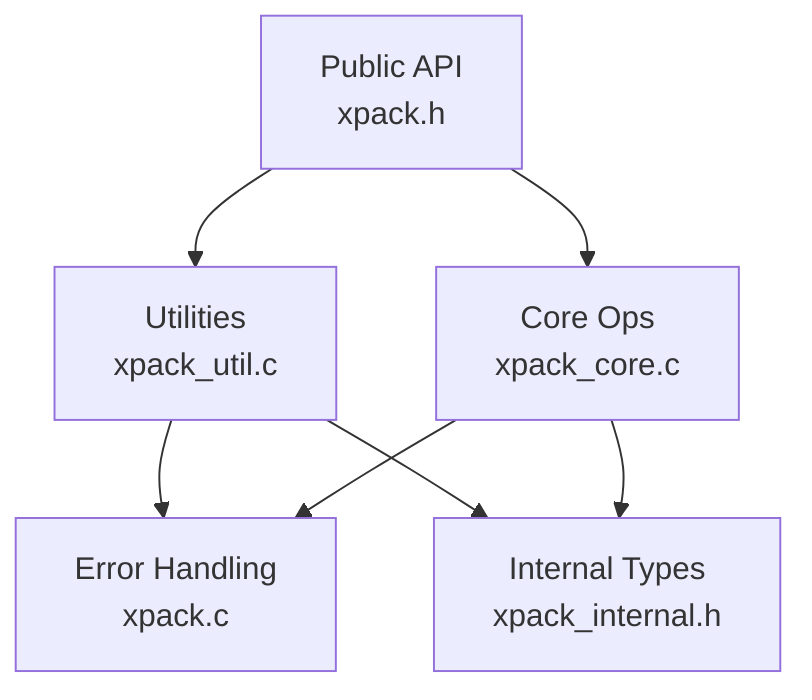
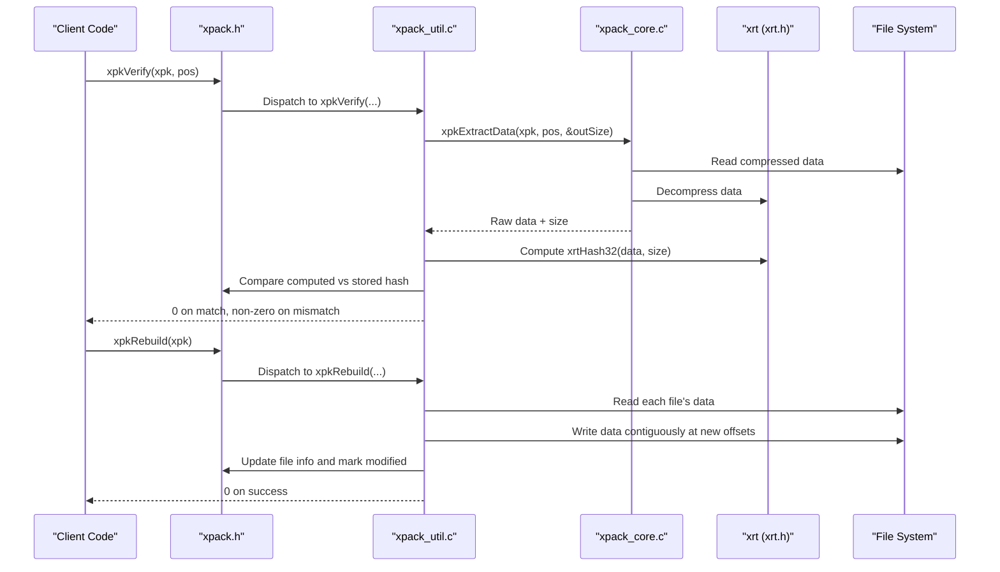
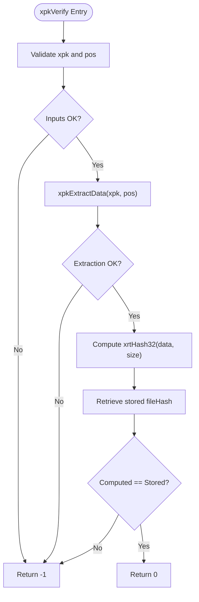
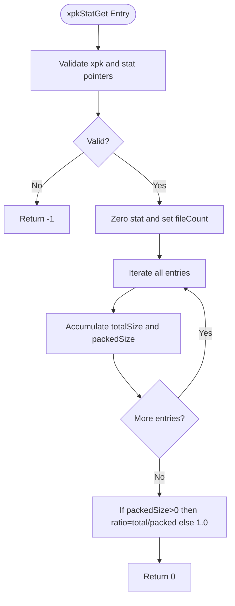
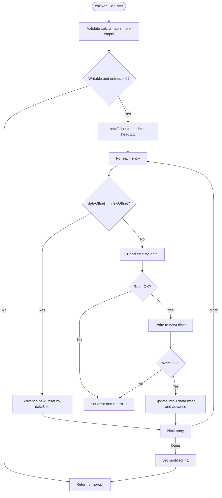
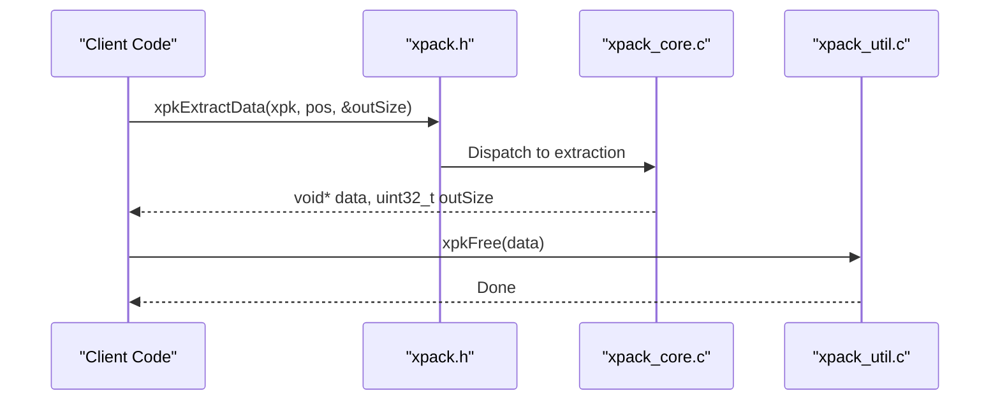
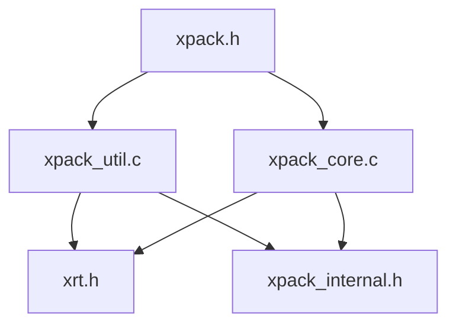

# Utility and Validation Functions

<cite>
**Referenced Files in This Document**
- [xpack.h](file://src/xpack.h)
- [xpack_util.c](file://src/xpack_util.c)
- [xpack_core.c](file://src/xpack_core.c)
- [xpack.c](file://src/xpack.c)
- [xpack_internal.h](file://src/xpack_internal.h)
- [15_verify_operations.h](file://test/15_verify_operations.h)
- [14_statistics.h](file://test/14_statistics.h)
- [16_rebuild_operations.h](file://test/16_rebuild_operations.h)
- [26_memory_management.h](file://test/26_memory_management.h)
- [test_framework.h](file://test/test_framework.h)
</cite>

## Table of Contents
1. [Introduction](#introduction)
2. [Project Structure](#project-structure)
3. [Core Components](#core-components)
4. [Architecture Overview](#architecture-overview)
5. [Detailed Component Analysis](#detailed-component-analysis)
6. [Dependency Analysis](#dependency-analysis)
7. [Performance Considerations](#performance-considerations)
8. [Troubleshooting Guide](#troubleshooting-guide)
9. [Conclusion](#conclusion)
10. [Appendices](#appendices)

## Introduction
This document provides comprehensive API documentation for xPack’s utility and validation functions focused on package maintenance and verification operations. It covers:
- Integrity checking: xpkVerify and xpkVerifyAll
- Comprehensive statistics: xpkStatGet
- Package repair: xpkRebuild
- Proper memory management: xpkFree
- Data hashing: xpkHash
- Error retrieval: xpkLastError and xpkLastErrorMsg

It also includes practical examples demonstrating validation workflows, statistical analysis, repair procedures, and memory management best practices, along with the relationship between verification functions and package health monitoring, performance implications, and integration with quality assurance processes.

## Project Structure
The utility and validation APIs are part of the public xPack interface and are implemented in dedicated modules:
- Public API declarations: [xpack.h](file://src/xpack.h)
- Utility implementations (verification, statistics, rebuild, memory): [xpack_util.c](file://src/xpack_util.c)
- Core operations (extraction, updates, info): [xpack_core.c](file://src/xpack_core.c)
- Error handling and runtime support: [xpack.c](file://src/xpack.c)
- Internal structures and helpers: [xpack_internal.h](file://src/xpack_internal.h)
- Practical usage examples via tests: [15_verify_operations.h](file://test/15_verify_operations.h), [14_statistics.h](file://test/14_statistics.h), [16_rebuild_operations.h](file://test/16_rebuild_operations.h), [26_memory_management.h](file://test/26_memory_management.h)

**Diagram sources**
- [xpack.h](file://src/xpack.h#L328-L446)
- [xpack_util.c](file://src/xpack_util.c#L1-L361)
- [xpack_core.c](file://src/xpack_core.c#L1-L403)
- [xpack.c](file://src/xpack.c#L21-L200)
- [xpack_internal.h](file://src/xpack_internal.h#L47-L84)

**Section sources**
- [xpack.h](file://src/xpack.h#L328-L446)
- [xpack_util.c](file://src/xpack_util.c#L1-L361)
- [xpack_core.c](file://src/xpack_core.c#L1-L403)
- [xpack.c](file://src/xpack.c#L21-L200)
- [xpack_internal.h](file://src/xpack_internal.h#L47-L84)

## Core Components
This section documents the five primary utility/validation functions and related helpers.

- xpkVerify(xpkObject xpk, uint32_t pos)
  - Purpose: Validates a single file entry by extracting its data and recomputing its hash, comparing against stored hash.
  - Returns: 0 on success, non-zero on failure.
  - Behavior: Extracts data, computes 32-bit hash, compares with stored hash; frees extracted buffer.
  - Related APIs: xpkExtractData, xpkInfo, xrtHash32.

- xpkVerifyAll(xpkObject xpk)
  - Purpose: Iterates all entries and validates each using xpkVerify.
  - Returns: 0 if all pass; returns the failing position (as int) otherwise.
  - Behavior: Short-circuits on first failure.

- xpkStatGet(xpkObject xpk, xpkStat* stat)
  - Purpose: Computes package-wide statistics including file count, total raw size, packed size, and compression ratio.
  - Returns: 0 on success; sets stat fields accordingly.
  - Ratio calculation: totalSize / packedSize when packedSize > 0; otherwise ratio = 1.0.

- xpkRebuild(xpkObject xpk)
  - Purpose: Reorganizes stored data to eliminate gaps and optimize data offsets for better integrity and performance.
  - Returns: 0 on success; non-zero on failure with error code/message set.
  - Behavior: Reads each file’s data, writes it contiguously at new offsets, updates file info; marks package modified.

- xpkHash(const void* data, uint32_t size)
  - Purpose: Computes a 32-bit hash of arbitrary data using the underlying xrt hash function.
  - Returns: Hash value; 0 for invalid inputs.

- xpkFree(void* ptr)
  - Purpose: Safely frees memory allocated by xPack extraction or similar operations.
  - Behavior: No-op if ptr is NULL.

- xpkLastError(void) and xpkLastErrorMsg(void)
  - Purpose: Retrieve the last error code and message set by the library.
  - Behavior: Thread-local storage; message corresponds to numeric code.

Practical usage patterns are demonstrated in the test suite under categories for verification, statistics, rebuild, and memory management.

**Section sources**
- [xpack.h](file://src/xpack.h#L433-L446)
- [xpack_util.c](file://src/xpack_util.c#L35-L91)
- [xpack_util.c](file://src/xpack_util.c#L312-L360)
- [xpack.c](file://src/xpack.c#L21-L43)
- [xpack.c](file://src/xpack.c#L622-L640)

## Architecture Overview
The validation and utility functions integrate with the core extraction pipeline and internal structures. The following diagram shows the call flow for verification and rebuild.

**Diagram sources**
- [xpack.h](file://src/xpack.h#L332-L446)
- [xpack_util.c](file://src/xpack_util.c#L35-L64)
- [xpack_util.c](file://src/xpack_util.c#L312-L360)
- [xpack_core.c](file://src/xpack_core.c#L147-L207)
- [xpack_internal.h](file://src/xpack_internal.h#L47-L84)

## Detailed Component Analysis

### Integrity Checking: xpkVerify and xpkVerifyAll
- xpkVerify
  - Steps:
    1. Validate inputs and entry bounds.
    2. Extract raw data for the given position.
    3. Compute 32-bit hash of extracted data.
    4. Retrieve stored hash from file info.
    5. Compare hashes; return match status.
  - Edge cases handled:
    - Invalid position or missing info.
    - Extraction failures leading to early termination.
  - Complexity: O(N) per file where N is uncompressed size; dominated by extraction and hashing.

- xpkVerifyAll
  - Iterates all entries and returns immediately upon the first failure, returning the failing index cast to int.

**Diagram sources**
- [xpack_util.c](file://src/xpack_util.c#L35-L52)
- [xpack_core.c](file://src/xpack_core.c#L147-L207)

**Section sources**
- [xpack_util.c](file://src/xpack_util.c#L35-L64)
- [xpack_core.c](file://src/xpack_core.c#L147-L207)

### Statistical Analysis: xpkStatGet
- Purpose: Aggregate package-level metrics.
- Computation:
  - Sum total raw size and packed size across all entries.
  - Compute ratio = totalSize / packedSize if packedSize > 0; else ratio = 1.0.
- Output structure: xpkStat with fields for counts and sizes.

**Diagram sources**
- [xpack_util.c](file://src/xpack_util.c#L70-L91)

**Section sources**
- [xpack_util.c](file://src/xpack_util.c#L70-L91)

### Repair Operations: xpkRebuild
- Purpose: Optimize package layout by rewriting data contiguously and updating offsets.
- Steps:
  1. Validate xpk and write mode.
  2. Iterate entries; if dataOffset equals current optimal offset, advance; else read data and write to new offset.
  3. Update file info with new dataOffset and advance.
  4. Mark package as modified.
- Error handling:
  - Read/write failures set error code and abort.
  - Read-only mode disallowed.

**Diagram sources**
- [xpack_util.c](file://src/xpack_util.c#L312-L360)

**Section sources**
- [xpack_util.c](file://src/xpack_util.c#L312-L360)

### Memory Management: xpkFree and Buffer Handling
- xpkFree
  - Safely frees memory allocated by xPack extraction routines.
- Typical usage pattern:
  - Extract data via xpkExtractData.
  - Use returned buffer and size.
  - Free buffer using xpkFree.
- Tests demonstrate repeated extraction and freeing cycles, ensuring no leaks.

**Diagram sources**
- [xpack.h](file://src/xpack.h#L332-L446)
- [xpack_core.c](file://src/xpack_core.c#L147-L207)
- [xpack_util.c](file://src/xpack_util.c#L18-L20)

**Section sources**
- [xpack.h](file://src/xpack.h#L433-L446)
- [xpack_core.c](file://src/xpack_core.c#L147-L207)
- [xpack_util.c](file://src/xpack_util.c#L18-L20)
- [26_memory_management.h](file://test/26_memory_management.h#L38-L94)

### Data Hashing: xpkHash
- Computes a 32-bit hash of arbitrary data using the underlying xrt hash function.
- Useful for quick integrity checks outside the package context.

**Section sources**
- [xpack.h](file://src/xpack.h#L433-L446)
- [xpack_util.c](file://src/xpack_util.c#L26-L29)

### Error Retrieval: xpkLastError and xpkLastErrorMsg
- Thread-local error state maintained by the library.
- xpkSetError(code, msg) stores the last error and message.
- xpkLastError returns the numeric code; xpkLastErrorMsg returns the message string.

**Section sources**
- [xpack.c](file://src/xpack.c#L21-L43)
- [xpack.c](file://src/xpack.c#L622-L640)

## Dependency Analysis
The utility functions depend on core extraction and internal structures. The following diagram shows key dependencies.

**Diagram sources**
- [xpack.h](file://src/xpack.h#L22-L24)
- [xpack_util.c](file://src/xpack_util.c#L7-L12)
- [xpack_core.c](file://src/xpack_core.c#L7-L12)
- [xpack_internal.h](file://src/xpack_internal.h#L10-L11)

**Section sources**
- [xpack.h](file://src/xpack.h#L22-L24)
- [xpack_util.c](file://src/xpack_util.c#L7-L12)
- [xpack_core.c](file://src/xpack_core.c#L7-L12)
- [xpack_internal.h](file://src/xpack_internal.h#L10-L11)

## Performance Considerations
- Verification cost:
  - xpkVerify performs extraction plus hashing; cost proportional to uncompressed size.
  - xpkVerifyAll scales linearly with number of entries.
- Rebuild cost:
  - Reads and writes all stored data; cost proportional to total packed size.
  - Improves data locality and reduces fragmentation.
- Statistics cost:
  - Linear scan over all entries; negligible overhead for typical packages.
- Recommendations:
  - Run xpkVerifyAll periodically in QA builds.
  - Use xpkRebuild after heavy update/remove cycles to maintain performance.
  - Prefer batch operations (xpkExtractAll, xpkAppendDir) to minimize repeated I/O.

[No sources needed since this section provides general guidance]

## Troubleshooting Guide
Common issues and resolutions:
- Verification fails:
  - Confirm package is opened in read-only mode for verification.
  - Use xpkLastError and xpkLastErrorMsg to diagnose extraction/compression errors.
  - After suspected corruption, run xpkRebuild to rewrite data and re-validate.
- Rebuild fails:
  - Ensure package is not read-only.
  - Check for disk write permissions and sufficient space.
  - Review error code/message for I/O or compression failures.
- Memory leaks:
  - Always free buffers returned by xpkExtractData using xpkFree.
  - Avoid holding references to freed buffers.

**Section sources**
- [xpack_util.c](file://src/xpack_util.c#L312-L360)
- [xpack.c](file://src/xpack.c#L622-L640)
- [26_memory_management.h](file://test/26_memory_management.h#L38-L94)

## Conclusion
The utility and validation functions in xPack provide robust mechanisms for maintaining package integrity, analyzing compression effectiveness, repairing layout inefficiencies, and managing memory safely. Integrating xpkVerifyAll and xpkStatGet into QA processes ensures early detection of corruption and performance regressions. Periodic rebuilds help sustain long-term reliability and performance.

[No sources needed since this section summarizes without analyzing specific files]

## Appendices

### Practical Examples and Workflows

- Validation Workflow
  - Open package in read-only mode.
  - Call xpkVerifyAll to check all entries.
  - On failure, inspect xpkLastError and xpkLastErrorMsg.
  - Optionally run xpkRebuild and re-verify.

- Statistical Analysis
  - Open package in read-only mode.
  - Call xpkStatGet and review fileCount, totalSize, packedSize, ratio.
  - Use ratio to assess compression effectiveness across different compression levels.

- Repair Procedure
  - Open package in write mode.
  - Call xpkRebuild to optimize data layout.
  - Save package and verify integrity with xpkVerifyAll.

- Memory Management Best Practices
  - Always free extracted buffers with xpkFree.
  - Avoid mixing manual malloc/free with xPack-managed buffers.
  - Use repeated extraction tests to validate leak-free operation.

**Section sources**
- [15_verify_operations.h](file://test/15_verify_operations.h#L26-L45)
- [14_statistics.h](file://test/14_statistics.h#L7-L29)
- [16_rebuild_operations.h](file://test/16_rebuild_operations.h#L7-L25)
- [26_memory_management.h](file://test/26_memory_management.h#L38-L94)