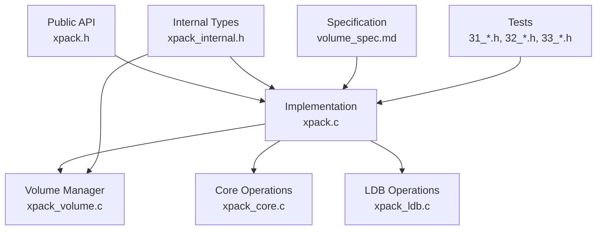
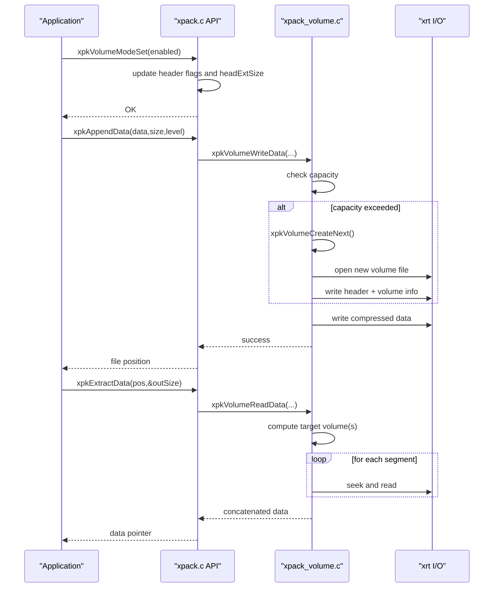
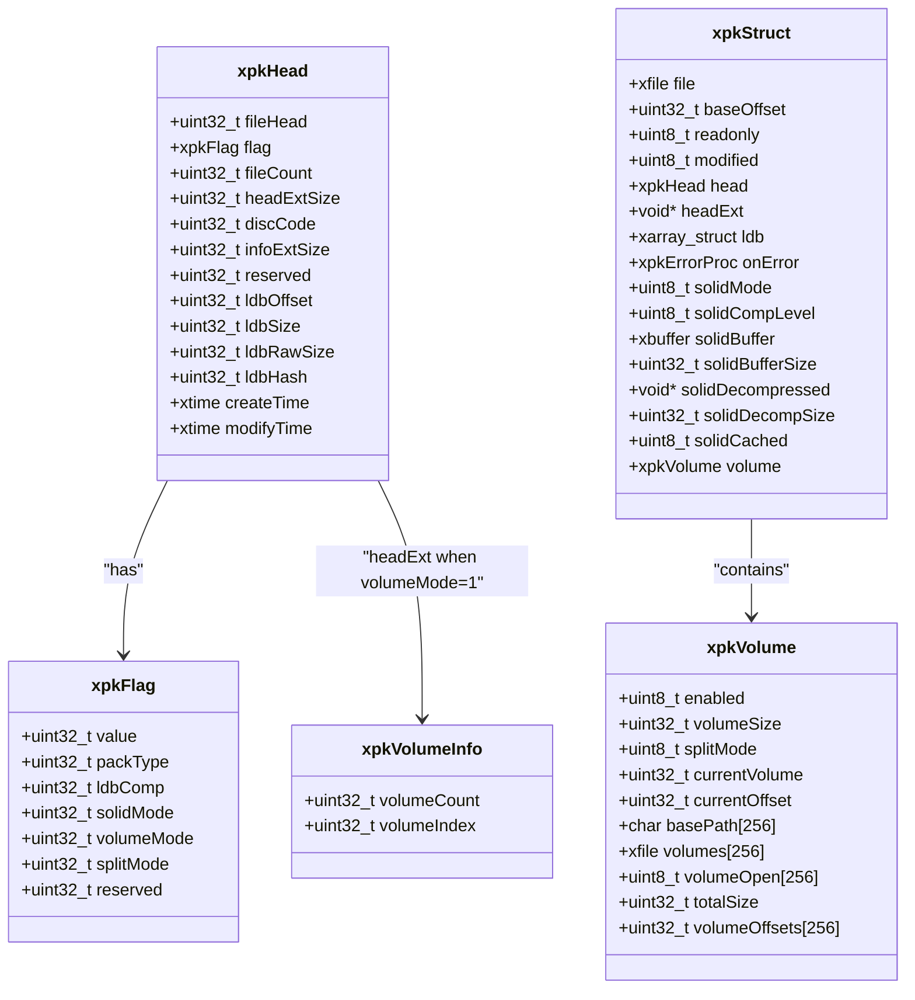
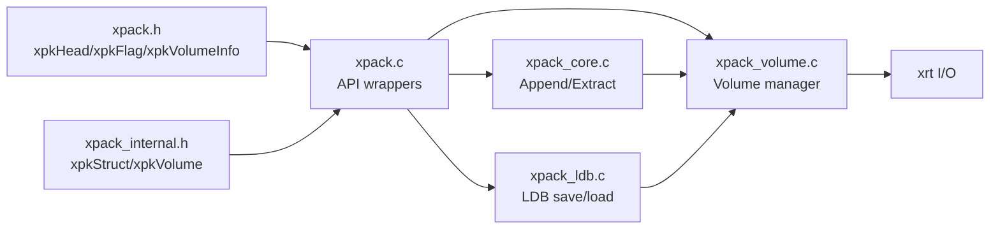

# Volume Control Interface

<cite>
**Referenced Files in This Document**
- [xpack.h](file://src/xpack.h)
- [xpack_internal.h](file://src/xpack_internal.h)
- [xpack.c](file://src/xpack.c)
- [xpack_volume.c](file://src/xpack_volume.c)
- [xpack_core.c](file://src/xpack_core.c)
- [xpack_ldb.c](file://src/xpack_ldb.c)
- [volume_spec.md](file://docs/volume_spec.md)
- [31_volume_basic.h](file://test/31_volume_basic.h)
- [32_volume_single_file.h](file://test/32_volume_single_file.h)
- [33_volume_cross.h](file://test/33_volume_cross.h)
</cite>

## Table of Contents
1. [Introduction](#introduction)
2. [Project Structure](#project-structure)
3. [Core Components](#core-components)
4. [Architecture Overview](#architecture-overview)
5. [Detailed Component Analysis](#detailed-component-analysis)
6. [Dependency Analysis](#dependency-analysis)
7. [Performance Considerations](#performance-considerations)
8. [Troubleshooting Guide](#troubleshooting-guide)
9. [Conclusion](#conclusion)
10. [Appendices](#appendices)

## Introduction
This document describes the multi-volume support interface for xPack, focusing on automatic archive splitting functionality. It documents the APIs for enabling/disabling multi-volume mode, configuring split sizes and modes, managing volumes, and retrieving volume statistics. Practical examples demonstrate configuration, split size optimization, and multi-volume archive management. Cross-platform considerations and repair procedures are also covered.

## Project Structure
The multi-volume feature spans public APIs, internal runtime structures, and implementation modules:
- Public API declarations define the volume control interface.
- Internal structures encapsulate runtime volume state and metadata.
- Implementation modules handle file naming, capacity checks, cross-volume reads/writes, and statistics collection.
- Tests validate basic operations, single-file scenarios, and cross-volume behavior.

**Diagram sources**
- [xpack.h](file://src/xpack.h#L355-L367)
- [xpack.c](file://src/xpack.c#L642-L762)
- [xpack_volume.c](file://src/xpack_volume.c#L1-L353)
- [xpack_core.c](file://src/xpack_core.c#L1-L200)
- [xpack_ldb.c](file://src/xpack_ldb.c#L1-L198)
- [xpack_internal.h](file://src/xpack_internal.h#L17-L84)
- [volume_spec.md](file://docs/volume_spec.md#L279-L355)

**Section sources**
- [xpack.h](file://src/xpack.h#L355-L367)
- [xpack_internal.h](file://src/xpack_internal.h#L17-L84)
- [volume_spec.md](file://docs/volume_spec.md#L279-L355)

## Core Components
- xpkVolumeMode and xpkVolumeModeSet: Enable or disable multi-volume mode. Enabling sets the package header’s volumeMode flag and configures head extension size accordingly.
- xpkVolumeSize and xpkVolumeSizeSet: Configure per-volume size limits (bytes). Zero means unlimited.
- xpkVolumeCount and xpkVolumeCurrent: Query total number of volumes and the index of the currently active volume.
- xpkVolumeSplitMode and xpkVolumeSplitModeSet: Choose between byte-based and file-based splitting strategies.
- xpkVolumePath: Retrieve the absolute path of a specific volume file.
- xpkVolumeStatGet: Obtain per-volume sizes, totals, and averages.

These APIs are thin wrappers around internal volume manager logic that handles file naming, capacity checks, cross-volume routing, and statistics.

**Section sources**
- [xpack.h](file://src/xpack.h#L355-L367)
- [xpack.c](file://src/xpack.c#L646-L762)
- [xpack_internal.h](file://src/xpack_internal.h#L23-L42)

## Architecture Overview
The volume control interface integrates with the core xPack operations transparently. When multi-volume mode is enabled, write operations route through the volume manager to automatically create new volumes when capacity thresholds are reached. Reads span multiple volumes seamlessly.

**Diagram sources**
- [xpack.c](file://src/xpack.c#L646-L762)
- [xpack_volume.c](file://src/xpack_volume.c#L178-L229)
- [xpack_volume.c](file://src/xpack_volume.c#L235-L319)

**Section sources**
- [xpack.c](file://src/xpack.c#L646-L762)
- [xpack_volume.c](file://src/xpack_volume.c#L178-L229)
- [xpack_volume.c](file://src/xpack_volume.c#L235-L319)

## Detailed Component Analysis

### Volume Mode and Split Mode Controls
- xpkVolumeMode: Reports whether multi-volume mode is active.
- xpkVolumeModeSet: Enables or disables multi-volume mode and updates the package header flags and head extension size. Disabling reverts to single-volume semantics.
- xpkVolumeSplitMode: Returns the current split strategy (byte-based or file-based).
- xpkVolumeSplitModeSet: Validates and sets the split mode. Only 0 (byte-based) and 1 (file-based) are supported.

Behavioral notes:
- Enabling multi-volume mode sets the header’s volumeMode flag and headExtSize to accommodate volume info.
- Split mode affects how capacity checks and automatic volume creation are performed.

**Section sources**
- [xpack.c](file://src/xpack.c#L646-L668)
- [xpack.c](file://src/xpack.c#L697-L720)
- [xpack.h](file://src/xpack.h#L105-L115)
- [xpack.h](file://src/xpack.h#L249-L256)

### Volume Size and Capacity Management
- xpkVolumeSize: Returns the configured per-volume size limit.
- xpkVolumeSizeSet: Updates the per-volume size limit. Zero indicates unlimited size.
- xpkVolumeCheckCapacity: Internal helper determines if a write operation would exceed the current volume’s remaining capacity.

Key implementation details:
- Capacity checks compare requested data size against remaining bytes in the current volume.
- When capacity is exceeded, the volume manager creates a new volume and updates offsets and indices.

**Section sources**
- [xpack.c](file://src/xpack.c#L670-L684)
- [xpack_volume.c](file://src/xpack_volume.c#L166-L172)
- [xpack_internal.h](file://src/xpack_internal.h#L17-L18)

### Automatic Volume Creation and Naming
- xpkVolumeCreateNext: Creates the next volume file, writes the package header and volume info, and initializes its metadata.
- xpkVolumeGetName: Generates volume file names. The first volume retains the base path; subsequent volumes use a dot-segmented suffix derived from the original extension.

Operational flow:
- New volumes are opened in binary mode and initialized with a simplified header containing volume info.
- The volume manager tracks cumulative offsets and the current volume index.

**Section sources**
- [xpack_volume.c](file://src/xpack_volume.c#L113-L160)
- [xpack_volume.c](file://src/xpack_volume.c#L15-L38)
- [xpack_internal.h](file://src/xpack_internal.h#L23-L42)

### Cross-Volume Read/Write Routing
- xpkVolumeWriteData: Writes data across volumes, creating new volumes as needed and updating offsets and sizes.
- xpkVolumeReadData: Reads data spanning multiple volumes, computing target volumes from global offsets and merging segments.

Performance characteristics:
- Cross-volume writes incur minimal overhead compared to single-volume writes.
- Cross-volume reads add slight overhead due to boundary crossings and potential lazy-open of subsequent volumes.

**Section sources**
- [xpack_volume.c](file://src/xpack_volume.c#L178-L229)
- [xpack_volume.c](file://src/xpack_volume.c#L235-L319)
- [volume_spec.md](file://docs/volume_spec.md#L380-L427)

### Volume Path Retrieval and Statistics
- xpkVolumePath: Returns the absolute path of a given volume index.
- xpkVolumeStatGet: Computes per-volume sizes, total size, total data size, and average size. Memory allocated for per-volume sizes must be freed by the caller.

Usage:
- Useful for enumerating all generated volumes and diagnosing distribution across volumes.

**Section sources**
- [xpack.c](file://src/xpack.c#L722-L724)
- [xpack.c](file://src/xpack.c#L726-L761)
- [xpack.h](file://src/xpack.h#L309-L318)

### Integration with Core Operations
- xpkAppendData: Uses xpkVolumeWriteData to persist compressed data, updating LDB entries with global offsets.
- xpkExtractData: Uses xpkVolumeReadData to fetch compressed data and decompress it.
- xpkLdbSave: Writes LDB data to the appropriate volume and sets end-of-file markers for the current volume.

**Section sources**
- [xpack_core.c](file://src/xpack_core.c#L39-L128)
- [xpack_core.c](file://src/xpack_core.c#L147-L200)
- [xpack_ldb.c](file://src/xpack_ldb.c#L101-L198)

### Class and Data Model Overview

**Diagram sources**
- [xpack.h](file://src/xpack.h#L120-L148)
- [xpack.h](file://src/xpack.h#L105-L115)
- [xpack.h](file://src/xpack.h#L249-L256)
- [xpack_internal.h](file://src/xpack_internal.h#L23-L84)

**Section sources**
- [xpack.h](file://src/xpack.h#L120-L148)
- [xpack.h](file://src/xpack.h#L105-L115)
- [xpack.h](file://src/xpack.h#L249-L256)
- [xpack_internal.h](file://src/xpack_internal.h#L23-L84)

## Dependency Analysis
Volume control depends on:
- Header flags and head extension size for multi-volume metadata.
- Runtime volume manager for file lifecycle and cross-volume routing.
- Core and LDB modules for persistence and offset computation.

**Diagram sources**
- [xpack.c](file://src/xpack.c#L646-L762)
- [xpack_volume.c](file://src/xpack_volume.c#L1-L353)
- [xpack_core.c](file://src/xpack_core.c#L1-L200)
- [xpack_ldb.c](file://src/xpack_ldb.c#L1-L198)
- [xpack.h](file://src/xpack.h#L120-L148)
- [xpack_internal.h](file://src/xpack_internal.h#L23-L84)

**Section sources**
- [xpack.c](file://src/xpack.c#L646-L762)
- [xpack_volume.c](file://src/xpack_volume.c#L1-L353)
- [xpack_core.c](file://src/xpack_core.c#L1-L200)
- [xpack_ldb.c](file://src/xpack_ldb.c#L1-L198)
- [xpack.h](file://src/xpack.h#L120-L148)
- [xpack_internal.h](file://src/xpack_internal.h#L23-L84)

## Performance Considerations
- Byte-based splitting yields balanced per-volume sizes and predictable boundaries.
- File-based splitting ensures atomicity of individual files across volumes but may lead to uneven distribution.
- Recommended per-volume sizes vary by deployment scenario:
  - Network transfer: 50–100 MB for easier resumable transfers.
  - Optical media: ~700 MB (CD) and ~4.7 GB (DVD).
  - Cloud uploads: 100–500 MB depending on provider policies.
  - Local storage: set to zero for unlimited size.
- Overheads:
  - Cross-volume reads/writes add modest overhead compared to single-volume operations.
  - Lazy opening of subsequent volumes minimizes I/O until needed.

[No sources needed since this section provides general guidance]

## Troubleshooting Guide
Common issues and remedies:
- Maximum volume count exceeded: Attempting to create more than the supported maximum number of volumes. Reduce split size or increase capacity per volume.
- Volume file not available: A required volume could not be opened. Verify file existence and permissions.
- Volume data incomplete: Cross-volume read failed due to missing or truncated volumes. Reconstruct missing volumes or restore from backups.
- Volume header validation failure: A volume’s header is invalid. Recreate the archive or repair using available tools.

Operational tips:
- Always save after enabling multi-volume mode and adding data.
- Use xpkVolumeStatGet to diagnose uneven distribution and adjust split sizes accordingly.
- Prefer byte-based splitting for predictable sizing; use file-based splitting when preserving file boundaries is critical.

**Section sources**
- [xpack.c](file://src/xpack.c#L27-L43)
- [volume_spec.md](file://docs/volume_spec.md#L698-L718)

## Conclusion
The xPack multi-volume interface provides transparent, robust support for splitting archives across multiple files. With simple APIs for enabling multi-volume mode, configuring split sizes and strategies, and retrieving volume statistics, developers can efficiently manage large archives across diverse platforms and deployment scenarios.

[No sources needed since this section summarizes without analyzing specific files]

## Appendices

### Practical Examples

- Example: Create a 100 MB multi-volume archive
  - Enable multi-volume mode.
  - Set per-volume size to 100 MB.
  - Choose byte-based splitting.
  - Add files; new volumes are created automatically.
  - Save and close; inspect generated volumes.

- Example: Read a multi-volume archive
  - Open the primary volume in read-only mode.
  - Check if multi-volume mode is active and enumerate volumes.
  - Extract files normally; cross-volume reads are handled transparently.

- Example: Optimize split size for network transfer
  - Set per-volume size to 50–100 MB.
  - Monitor per-volume sizes via statistics.
  - Adjust compression level and split mode to balance throughput and resumability.

- Example: Query per-volume information
  - Retrieve total volumes and paths.
  - Compute average sizes and identify oversized volumes.
  - Plan remediation (e.g., smaller per-volume size or different split mode).

**Section sources**
- [volume_spec.md](file://docs/volume_spec.md#L546-L671)
- [31_volume_basic.h](file://test/31_volume_basic.h#L7-L58)
- [32_volume_single_file.h](file://test/32_volume_single_file.h#L7-L101)
- [33_volume_cross.h](file://test/33_volume_cross.h#L7-L146)

### Cross-Platform Considerations
- File naming follows platform-appropriate conventions; ensure paths are valid on the target OS.
- Permissions and disk quotas may affect volume creation and writing.
- Network or cloud environments may impose upload size limits; choose per-volume sizes accordingly.

**Section sources**
- [volume_spec.md](file://docs/volume_spec.md#L720-L738)

### Repair Procedures
- If a volume is missing, reconstruct it by recreating the archive or restoring from backups.
- If a volume header is corrupted, rebuild the archive from source data.
- Use statistics to identify missing or inconsistent volumes and replace them.

**Section sources**
- [volume_spec.md](file://docs/volume_spec.md#L698-L718)