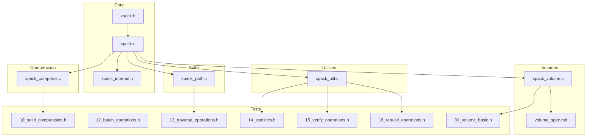
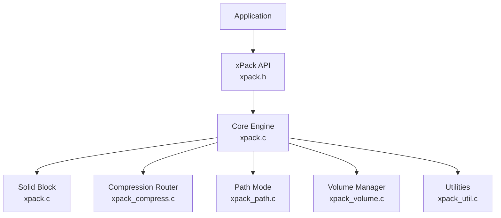
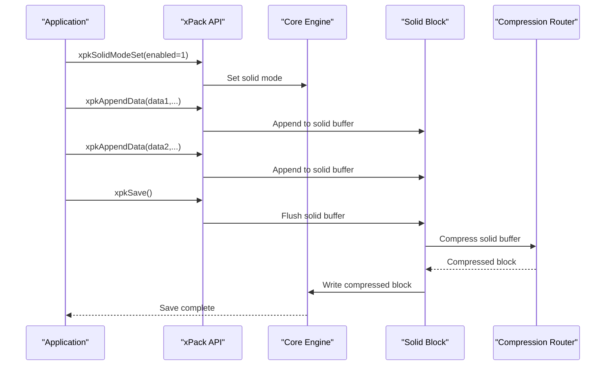
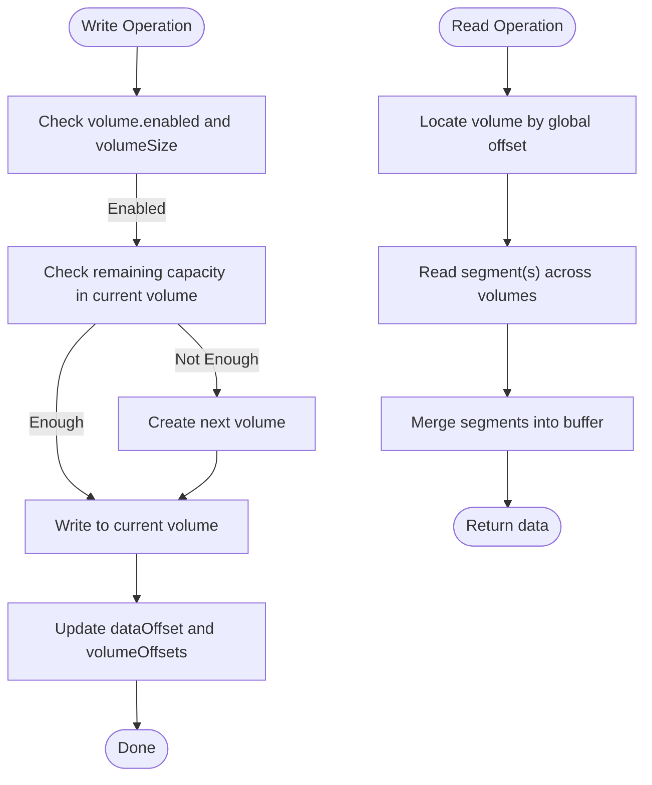
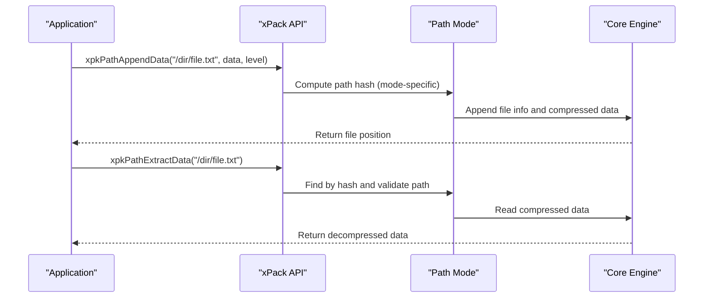
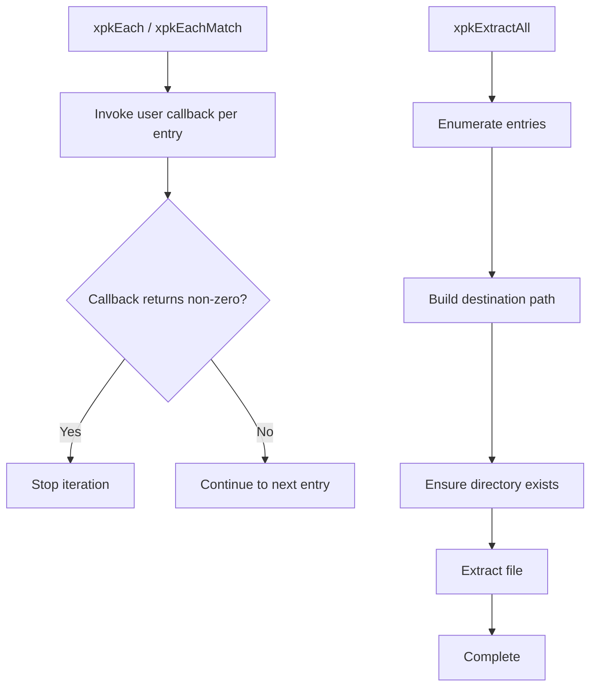
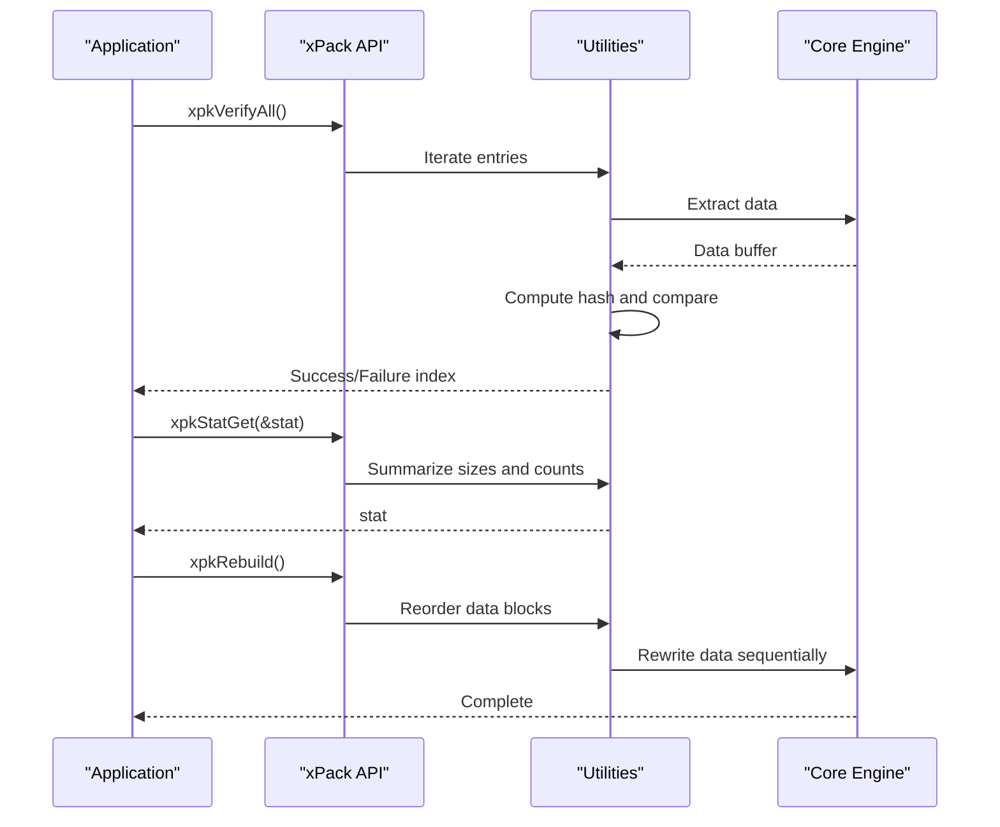
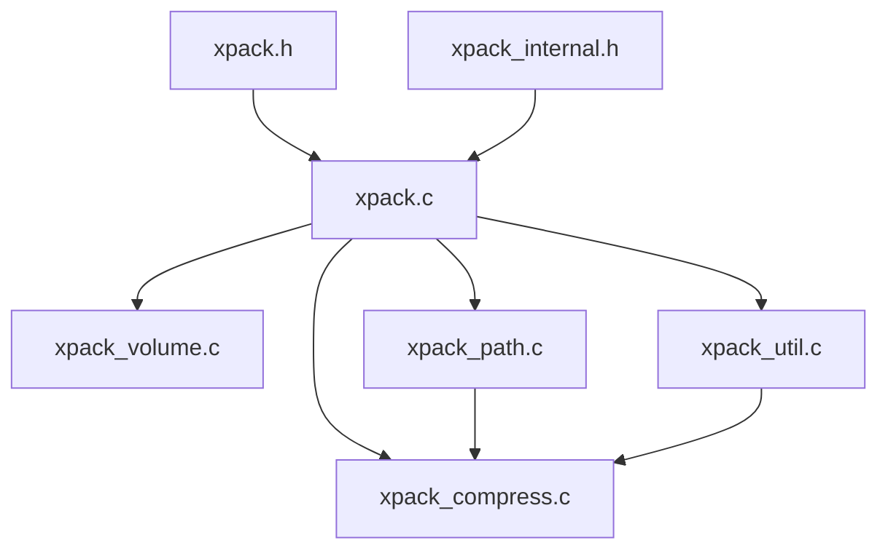

# Advanced Features

<cite>
**Referenced Files in This Document**
- [xpack.h](file://src/xpack.h)
- [xpack.c](file://src/xpack.c)
- [xpack_compress.c](file://src/xpack_compress.c)
- [xpack_volume.c](file://src/xpack_volume.c)
- [xpack_path.c](file://src/xpack_path.c)
- [xpack_util.c](file://src/xpack_util.c)
- [xpack_internal.h](file://src/xpack_internal.h)
- [spec.md](file://docs/spec.md)
- [volume_spec.md](file://docs/volume_spec.md)
- [10_solid_compression.h](file://test/10_solid_compression.h)
- [12_batch_operations.h](file://test/12_batch_operations.h)
- [13_traverse_operations.h](file://test/13_traverse_operations.h)
- [14_statistics.h](file://test/14_statistics.h)
- [15_verify_operations.h](file://test/15_verify_operations.h)
- [16_rebuild_operations.h](file://test/16_rebuild_operations.h)
- [31_volume_basic.h](file://test/31_volume_basic.h)
</cite>

## Table of Contents
1. [Introduction](#introduction)
2. [Project Structure](#project-structure)
3. [Core Components](#core-components)
4. [Architecture Overview](#architecture-overview)
5. [Detailed Component Analysis](#detailed-component-analysis)
6. [Dependency Analysis](#dependency-analysis)
7. [Performance Considerations](#performance-considerations)
8. [Troubleshooting Guide](#troubleshooting-guide)
9. [Conclusion](#conclusion)
10. [Appendices](#appendices)

## Introduction
This document explains xPack’s advanced features for sophisticated package management, focusing on:
- Solid compression for combining multiple files into a single compressed stream
- Multi-volume support for automatic splitting across multiple archive files
- Batch processing operations for bulk file handling
- Path-based operations for direct file access by path names
- Traversal interfaces for iterating through package contents
- Advanced utility functions for verification, statistics, and rebuild operations

It also covers technical details such as volume management, compression optimization techniques, and memory-efficient processing, with practical workflows and troubleshooting guidance.

## Project Structure
The advanced features span several modules:
- Core lifecycle and attributes: [xpack.c](file://src/xpack.c), [xpack.h](file://src/xpack.h)
- Compression routing and algorithms: [xpack_compress.c](file://src/xpack_compress.c)
- Solid compression implementation: [xpack.c](file://src/xpack.c), [xpack_internal.h](file://src/xpack_internal.h)
- Multi-volume system: [xpack_volume.c](file://src/xpack_volume.c), [xpack_internal.h](file://src/xpack_internal.h), [volume_spec.md](file://docs/volume_spec.md)
- Path-based operations: [xpack_path.c](file://src/xpack_path.c), [xpack.h](file://src/xpack.h)
- Traversal and batch utilities: [xpack_util.c](file://src/xpack_util.c), [xpack.h](file://src/xpack.h)
- Tests validating advanced workflows: [10_solid_compression.h](file://test/10_solid_compression.h), [12_batch_operations.h](file://test/12_batch_operations.h), [13_traverse_operations.h](file://test/13_traverse_operations.h), [14_statistics.h](file://test/14_statistics.h), [15_verify_operations.h](file://test/15_verify_operations.h), [16_rebuild_operations.h](file://test/16_rebuild_operations.h), [31_volume_basic.h](file://test/31_volume_basic.h)

**Diagram sources**
- [xpack.h](file://src/xpack.h#L1-L447)
- [xpack.c](file://src/xpack.c#L1-L762)
- [xpack_compress.c](file://src/xpack_compress.c#L1-L251)
- [xpack_volume.c](file://src/xpack_volume.c#L1-L353)
- [xpack_path.c](file://src/xpack_path.c#L1-L373)
- [xpack_util.c](file://src/xpack_util.c#L1-L361)
- [xpack_internal.h](file://src/xpack_internal.h#L1-L145)
- [volume_spec.md](file://docs/volume_spec.md#L1-L800)
- [10_solid_compression.h](file://test/10_solid_compression.h#L1-L339)
- [12_batch_operations.h](file://test/12_batch_operations.h#L1-L390)
- [13_traverse_operations.h](file://test/13_traverse_operations.h#L1-L176)
- [14_statistics.h](file://test/14_statistics.h#L1-L401)
- [15_verify_operations.h](file://test/15_verify_operations.h#L1-L371)
- [16_rebuild_operations.h](file://test/16_rebuild_operations.h#L1-L459)
- [31_volume_basic.h](file://test/31_volume_basic.h#L1-L65)

**Section sources**
- [xpack.h](file://src/xpack.h#L1-L447)
- [xpack.c](file://src/xpack.c#L1-L762)
- [xpack_internal.h](file://src/xpack_internal.h#L1-L145)
- [volume_spec.md](file://docs/volume_spec.md#L1-L800)

## Core Components
- Solid compression: Combines multiple files into a single compressed block, reducing metadata overhead and improving compression ratios for similar data. Implemented via a dedicated solid buffer and block layout.
- Multi-volume system: Automatically splits archives across multiple files with configurable sizes and split modes (byte-wise or file-wise).
- Path-based operations: Enable direct manipulation of files by path names in Linux/Win32 modes with case sensitivity rules.
- Traversal and batch utilities: Provide iteration callbacks, pattern matching, and bulk extraction/appending for efficient large-scale operations.
- Verification, statistics, and rebuild: Offer integrity checks, compression metrics, and defragmentation-like rebuild to optimize storage layout.

**Section sources**
- [xpack.h](file://src/xpack.h#L320-L447)
- [xpack.c](file://src/xpack.c#L366-L525)
- [xpack_volume.c](file://src/xpack_volume.c#L1-L353)
- [xpack_path.c](file://src/xpack_path.c#L1-L373)
- [xpack_util.c](file://src/xpack_util.c#L1-L361)

## Architecture Overview
The advanced features integrate through a unified API surface with internal routing and shared data structures.

**Diagram sources**
- [xpack.h](file://src/xpack.h#L320-L447)
- [xpack.c](file://src/xpack.c#L1-L762)
- [xpack_compress.c](file://src/xpack_compress.c#L1-L251)
- [xpack_path.c](file://src/xpack_path.c#L1-L373)
- [xpack_volume.c](file://src/xpack_volume.c#L1-L353)
- [xpack_util.c](file://src/xpack_util.c#L1-L361)

## Detailed Component Analysis

### Solid Compression
Solid compression aggregates multiple files into a single compressed block, improving compression ratios for similar data and reducing per-file metadata overhead.

Key behaviors:
- Enabling solid mode restricts package type changes and initializes a solid buffer.
- Data appended in solid mode is accumulated in-memory until saved.
- On save, the solid buffer is compressed once and written as one contiguous block.
- Extraction reads the entire solid block once, then slices out individual files by precomputed offsets.

**Diagram sources**
- [xpack.c](file://src/xpack.c#L371-L421)
- [xpack.c](file://src/xpack.c#L480-L525)
- [xpack_compress.c](file://src/xpack_compress.c#L20-L147)

Practical usage examples (from tests):
- Basic solid creation and extraction: [10_solid_compression.h](file://test/10_solid_compression.h#L7-L33)
- Adding multiple files and verifying traversal: [10_solid_compression.h](file://test/10_solid_compression.h#L35-L98)
- Large files and mixed sizes: [10_solid_compression.h](file://test/10_solid_compression.h#L189-L228), [10_solid_compression.h](file://test/10_solid_compression.h#L269-L313)

**Section sources**
- [xpack.c](file://src/xpack.c#L366-L525)
- [xpack_compress.c](file://src/xpack_compress.c#L20-L147)
- [10_solid_compression.h](file://test/10_solid_compression.h#L1-L339)

### Multi-Volume Support
The multi-volume system automatically splits archives across multiple files with transparent read/write semantics.

Key behaviors:
- Enable/disable volume mode and configure volume size and split mode.
- Automatic creation of subsequent volumes when capacity is exceeded.
- Cross-volume read/write routing with offset mapping and per-volume metadata.
- Statistics collection across all volumes.

**Diagram sources**
- [xpack_volume.c](file://src/xpack_volume.c#L166-L229)
- [xpack_volume.c](file://src/xpack_volume.c#L235-L319)
- [xpack_volume.c](file://src/xpack_volume.c#L325-L338)

Practical usage examples (from tests):
- Enabling/disabling volume mode and configuring sizes: [31_volume_basic.h](file://test/31_volume_basic.h#L7-L42)
- Split mode configuration: [31_volume_basic.h](file://test/31_volume_basic.h#L44-L58)

**Section sources**
- [xpack_volume.c](file://src/xpack_volume.c#L1-L353)
- [xpack_internal.h](file://src/xpack_internal.h#L17-L84)
- [volume_spec.md](file://docs/volume_spec.md#L1-L800)
- [31_volume_basic.h](file://test/31_volume_basic.h#L1-L65)

### Path-Based Operations
Path-based operations enable direct file manipulation by path names in Linux/Win32 modes, with case sensitivity rules and hash-based lookup.

Key behaviors:
- Hash computation differs by platform mode (case-sensitive vs case-insensitive).
- Path existence check, append/update/extract/remove by path.
- Path retrieval and enumeration via traversal APIs.

**Diagram sources**
- [xpack_path.c](file://src/xpack_path.c#L18-L46)
- [xpack_path.c](file://src/xpack_path.c#L100-L136)
- [xpack_path.c](file://src/xpack_path.c#L285-L307)

Practical usage examples (from tests):
- Path existence and append/extract: [13_traverse_operations.h](file://test/13_traverse_operations.h#L143-L165)
- Batch extract in path mode: [12_batch_operations.h](file://test/12_batch_operations.h#L221-L247)

**Section sources**
- [xpack_path.c](file://src/xpack_path.c#L1-L373)
- [xpack.h](file://src/xpack.h#L405-L417)
- [13_traverse_operations.h](file://test/13_traverse_operations.h#L1-L176)
- [12_batch_operations.h](file://test/12_batch_operations.h#L221-L247)

### Traversal and Batch Utilities
Traversal and batch utilities provide efficient iteration and bulk operations across packages.

Key behaviors:
- Iterate all entries with callbacks and optional pattern matching.
- Bulk extraction to a directory preserving path structure.
- Directory scanning and appending with wildcards and recursion.

**Diagram sources**
- [xpack_util.c](file://src/xpack_util.c#L97-L165)
- [xpack_util.c](file://src/xpack_util.c#L227-L237)
- [xpack_util.c](file://src/xpack_util.c#L280-L306)

Practical usage examples (from tests):
- Basic traversal and info access: [13_traverse_operations.h](file://test/13_traverse_operations.h#L7-L87)
- Batch extract and directory append: [12_batch_operations.h](file://test/12_batch_operations.h#L64-L170), [12_batch_operations.h](file://test/12_batch_operations.h#L249-L374)

**Section sources**
- [xpack_util.c](file://src/xpack_util.c#L1-L361)
- [xpack.h](file://src/xpack.h#L419-L431)
- [12_batch_operations.h](file://test/12_batch_operations.h#L1-L390)
- [13_traverse_operations.h](file://test/13_traverse_operations.h#L1-L176)

### Verification, Statistics, and Rebuild
Advanced utility functions provide integrity checks, compression metrics, and defragmentation-like rebuild.

Key behaviors:
- Verify individual or all entries by recomputing and comparing hashes.
- Collect statistics including total/raw sizes, packed size, and compression ratio.
- Rebuild rewrites data blocks sequentially to optimize storage layout.

**Diagram sources**
- [xpack_util.c](file://src/xpack_util.c#L35-L64)
- [xpack_util.c](file://src/xpack_util.c#L70-L91)
- [xpack_util.c](file://src/xpack_util.c#L312-L360)

Practical usage examples (from tests):
- Verify single/all files and after updates/rebuilds: [15_verify_operations.h](file://test/15_verify_operations.h#L1-L371)
- Statistics across multiple scenarios: [14_statistics.h](file://test/14_statistics.h#L1-L401)
- Rebuild operations and validation: [16_rebuild_operations.h](file://test/16_rebuild_operations.h#L1-L459)

**Section sources**
- [xpack_util.c](file://src/xpack_util.c#L1-L361)
- [xpack.h](file://src/xpack.h#L432-L441)
- [14_statistics.h](file://test/14_statistics.h#L1-L401)
- [15_verify_operations.h](file://test/15_verify_operations.h#L1-L371)
- [16_rebuild_operations.h](file://test/16_rebuild_operations.h#L1-L459)

## Dependency Analysis
The advanced features share common dependencies and internal helpers.

**Diagram sources**
- [xpack.h](file://src/xpack.h#L1-L447)
- [xpack_internal.h](file://src/xpack_internal.h#L1-L145)
- [xpack.c](file://src/xpack.c#L1-L762)
- [xpack_compress.c](file://src/xpack_compress.c#L1-L251)
- [xpack_volume.c](file://src/xpack_volume.c#L1-L353)
- [xpack_path.c](file://src/xpack_path.c#L1-L373)
- [xpack_util.c](file://src/xpack_util.c#L1-L361)

**Section sources**
- [xpack.h](file://src/xpack.h#L1-L447)
- [xpack_internal.h](file://src/xpack_internal.h#L1-L145)

## Performance Considerations
- Solid compression reduces per-file metadata overhead and improves compression ratios for similar data. It trades CPU for reduced storage and fewer I/O operations.
- Multi-volume writes incur minimal overhead (~2–5%) compared to single-volume writes; cross-volume reads add slight overhead (~5–10%) depending on boundary crossings.
- Path hashing avoids linear scans by using precomputed hashes; case-insensitive hashing performs normalization for Win32 mode.
- Utilities like rebuild minimize fragmentation and improve sequential access performance by rewriting data blocks contiguously.
- Memory efficiency: Solid mode buffers data in-memory until saved; consider large solids carefully. Volume manager opens volumes on-demand to reduce file handle usage.

[No sources needed since this section provides general guidance]

## Troubleshooting Guide
Common issues and resolutions:
- Solid mode restrictions: Cannot change package type or append files after enabling solid mode. Disable solid mode before changing type or adding files.
- Volume errors:
  - Maximum volume count exceeded: Limit is 256 volumes; reduce volume size or consolidate.
  - Volume file not available: Ensure all expected volume files exist and are readable/writable.
  - Volume data incomplete: Indicates missing or truncated volumes; verify all parts are present.
- Path mode mismatches: Case sensitivity differences between Linux and Win32 modes can cause path-not-found errors; normalize paths accordingly.
- Verification failures: Recompute hashes and compare; rebuild may resolve layout-related inconsistencies.

**Section sources**
- [xpack.c](file://src/xpack.c#L371-L408)
- [xpack_volume.c](file://src/xpack_volume.c#L113-L160)
- [xpack_volume.c](file://src/xpack_volume.c#L235-L283)
- [xpack_util.c](file://src/xpack_util.c#L35-L64)
- [volume_spec.md](file://docs/volume_spec.md#L698-L718)

## Conclusion
xPack’s advanced features provide a robust foundation for sophisticated package management:
- Solid compression optimizes storage and throughput for similar data.
- Multi-volume support enables scalable distribution and archival across multiple files.
- Path-based operations streamline direct file manipulation with platform-aware semantics.
- Traversal and batch utilities accelerate bulk operations and integration workflows.
- Verification, statistics, and rebuild utilities maintain integrity and performance over time.

These capabilities combine to support large-scale, automated, and reliable package workflows across diverse environments.

[No sources needed since this section summarizes without analyzing specific files]

## Appendices

### Practical Workflows

- Large-scale file processing:
  - Use path mode with directory scanning and pattern matching to bulk-append files.
  - Apply appropriate compression levels (e.g., ZSTD greedy/default) for balanced speed/compression.
  - Periodically run rebuild to optimize storage layout.

- Automated package maintenance:
  - Schedule periodic verification to detect corruption early.
  - Use statistics to monitor compression effectiveness and storage trends.

- Integration with external systems:
  - Multi-volume mode supports chunked uploads/downloads and CD/DVD burning workflows.
  - Solid mode reduces the number of files to manage for deployment pipelines.

[No sources needed since this section provides general guidance]