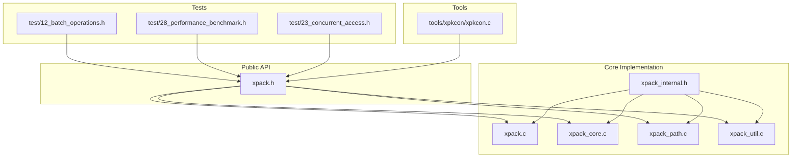
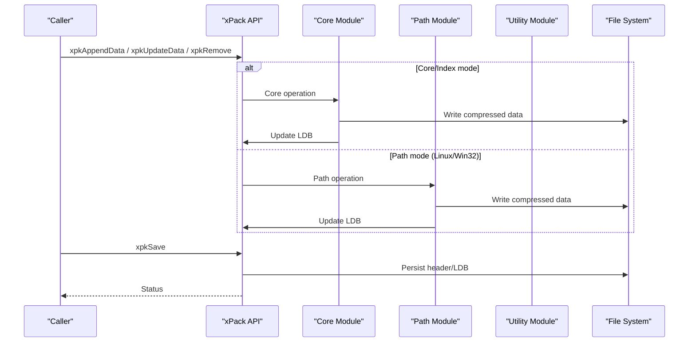
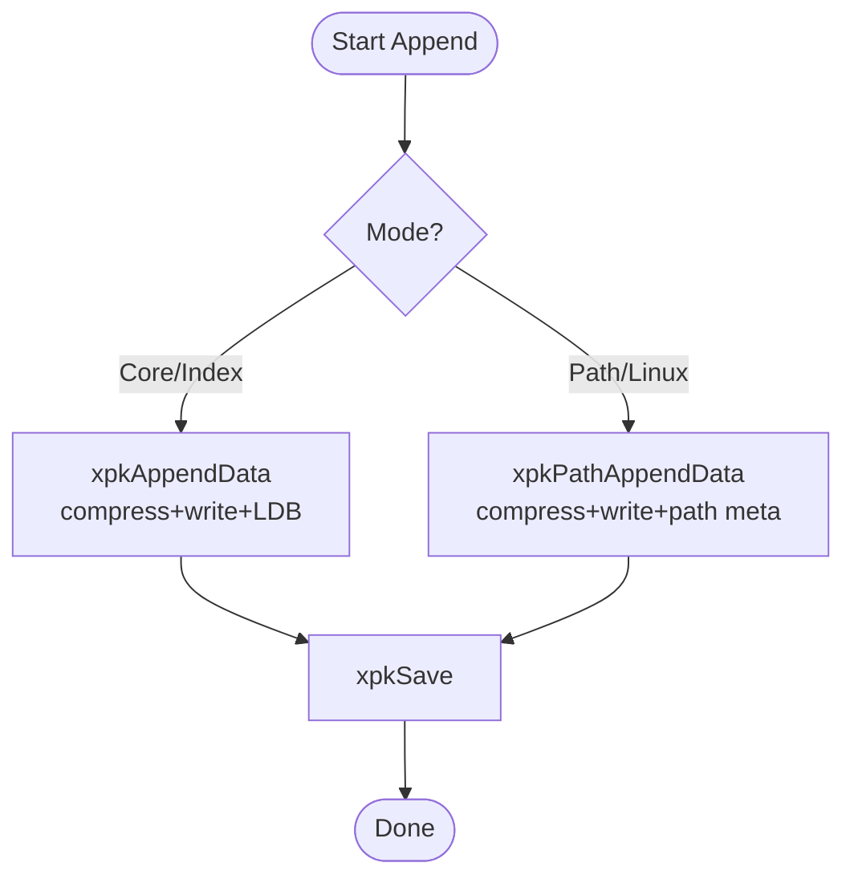
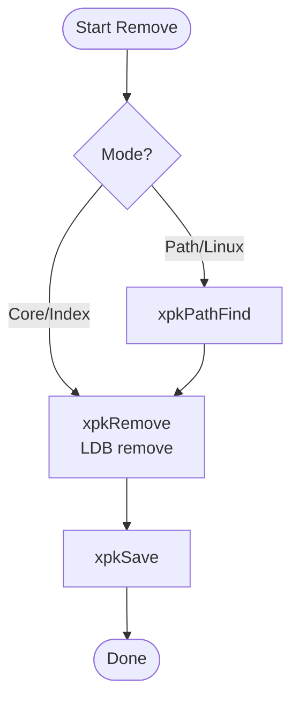
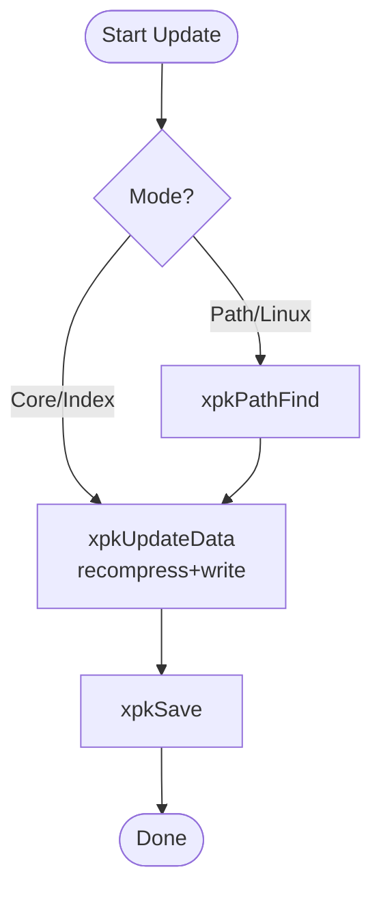
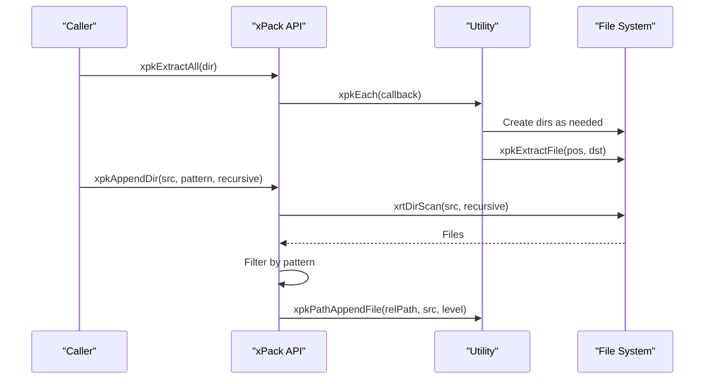
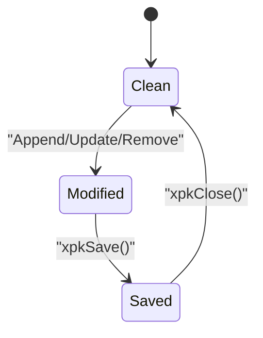
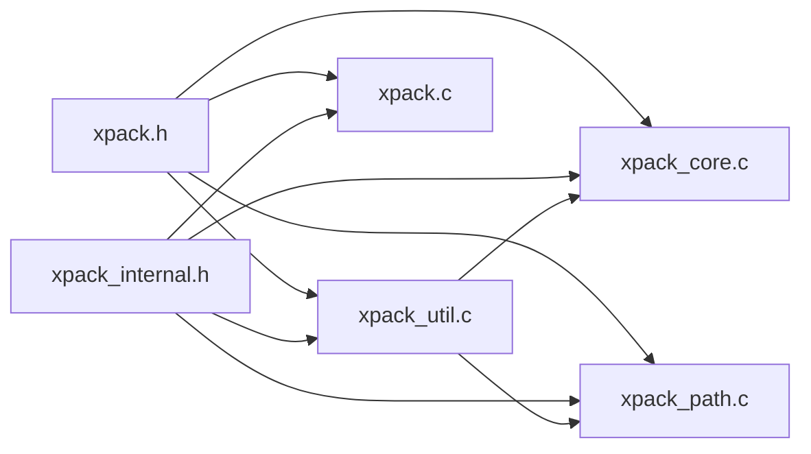
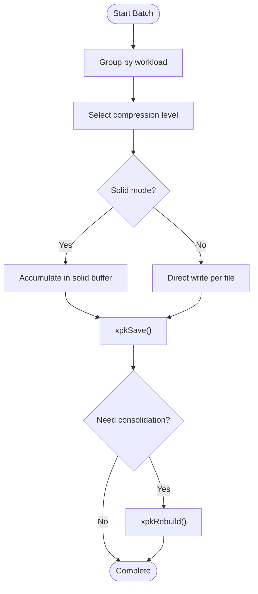

# Batch Operations

<cite>
**Referenced Files in This Document**
- [xpack.h](file://src/xpack.h)
- [xpack.c](file://src/xpack.c)
- [xpack_core.c](file://src/xpack_core.c)
- [xpack_path.c](file://src/xpack_path.c)
- [xpack_util.c](file://src/xpack_util.c)
- [xpack_internal.h](file://src/xpack_internal.h)
- [12_batch_operations.h](file://test/12_batch_operations.h)
- [28_performance_benchmark.h](file://test/28_performance_benchmark.h)
- [23_concurrent_access.h](file://test/23_concurrent_access.h)
- [xpkcon.c](file://tools/xpkcon/xpkcon.c)
- [benchmark_framework.h](file://test/benchmark_framework.h)
</cite>

## Table of Contents
1. [Introduction](#introduction)
2. [Project Structure](#project-structure)
3. [Core Components](#core-components)
4. [Architecture Overview](#architecture-overview)
5. [Detailed Component Analysis](#detailed-component-analysis)
6. [Dependency Analysis](#dependency-analysis)
7. [Performance Considerations](#performance-considerations)
8. [Troubleshooting Guide](#troubleshooting-guide)
9. [Conclusion](#conclusion)
10. [Appendices](#appendices)

## Introduction
This document describes xPack’s batch operations system for efficient mass file processing. It covers the batch APIs for adding, removing, and modifying files in bulk, the underlying workflow and transaction model, atomicity guarantees, performance optimization strategies, and practical integration patterns. It also documents scheduling considerations, error recovery, and concurrency behavior derived from the test suite.

## Project Structure
The batch operations span several modules:
- Public API surface for batch operations is declared in the public header.
- Core implementation resides in core and path-specific modules.
- Utilities implement higher-level batch helpers like directory scanning and extraction.
- Tests exercise batch workflows, performance, and concurrent access.

**Diagram sources**
- [xpack.h](file://src/xpack.h#L329-L441)
- [xpack.c](file://src/xpack.c#L1-L762)
- [xpack_core.c](file://src/xpack_core.c#L1-L403)
- [xpack_path.c](file://src/xpack_path.c#L1-L373)
- [xpack_util.c](file://src/xpack_util.c#L170-L361)
- [xpack_internal.h](file://src/xpack_internal.h#L1-L145)
- [12_batch_operations.h](file://test/12_batch_operations.h#L1-L389)
- [28_performance_benchmark.h](file://test/28_performance_benchmark.h#L1-L333)
- [23_concurrent_access.h](file://test/23_concurrent_access.h#L1-L570)
- [xpkcon.c](file://tools/xpkcon/xpkcon.c#L498-L588)

**Section sources**
- [xpack.h](file://src/xpack.h#L329-L441)
- [xpack.c](file://src/xpack.c#L1-L762)
- [xpack_core.c](file://src/xpack_core.c#L1-L403)
- [xpack_path.c](file://src/xpack_path.c#L1-L373)
- [xpack_util.c](file://src/xpack_util.c#L170-L361)
- [xpack_internal.h](file://src/xpack_internal.h#L1-L145)
- [12_batch_operations.h](file://test/12_batch_operations.h#L1-L389)
- [28_performance_benchmark.h](file://test/28_performance_benchmark.h#L1-L333)
- [23_concurrent_access.h](file://test/23_concurrent_access.h#L1-L570)
- [xpkcon.c](file://tools/xpkcon/xpkcon.c#L498-L588)

## Core Components
- Batch APIs:
  - Append/update/remove by position (Core/Index modes): xpkAppendData, xpkUpdateData, xpkRemove.
  - Path-based append/update/remove (Linux/Win32 modes): xpkPathAppendData, xpkPathUpdateData, xpkPathRemove.
  - Bulk extraction and directory import: xpkExtractAll, xpkAppendDir.
- Transaction model:
  - Modified state tracked per package; changes are persisted on save.
  - Solid mode defers writes until flush; independent mode writes immediately.
- Atomicity:
  - Per-operation atomicity; multi-operation sequences require explicit save boundaries.

**Section sources**
- [xpack.h](file://src/xpack.h#L369-L429)
- [xpack_core.c](file://src/xpack_core.c#L39-L358)
- [xpack_path.c](file://src/xpack_path.c#L100-L353)
- [xpack_util.c](file://src/xpack_util.c#L227-L306)
- [xpack.c](file://src/xpack.c#L202-L259)

## Architecture Overview
The batch pipeline integrates low-level file operations with higher-level utilities and a transaction-like persistence model.

**Diagram sources**
- [xpack_core.c](file://src/xpack_core.c#L39-L358)
- [xpack_path.c](file://src/xpack_path.c#L100-L353)
- [xpack_util.c](file://src/xpack_util.c#L227-L306)
- [xpack.c](file://src/xpack.c#L202-L259)

## Detailed Component Analysis

### Batch Add Operations
- Core/Index mode:
  - xpkAppendData appends raw data, compresses it, writes to storage, and updates LDB atomically within the operation.
- Path mode:
  - xpkPathAppendData validates path uniqueness and length, compresses, writes, and stores path metadata.
- Directory import:
  - xpkAppendDir scans directories, filters by pattern, and appends matching files to the archive.

**Diagram sources**
- [xpack_core.c](file://src/xpack_core.c#L39-L128)
- [xpack_path.c](file://src/xpack_path.c#L138-L279)
- [xpack_util.c](file://src/xpack_util.c#L280-L306)

**Section sources**
- [xpack_core.c](file://src/xpack_core.c#L39-L128)
- [xpack_path.c](file://src/xpack_path.c#L138-L279)
- [xpack_util.c](file://src/xpack_util.c#L280-L306)

### Batch Remove Operations
- Core/Index mode:
  - xpkRemove deletes entries from LDB; solid mode forbids removal.
- Path mode:
  - xpkPathRemove resolves path to position, then removes via Core logic.

**Diagram sources**
- [xpack_core.c](file://src/xpack_core.c#L332-L358)
- [xpack_path.c](file://src/xpack_path.c#L343-L353)

**Section sources**
- [xpack_core.c](file://src/xpack_core.c#L332-L358)
- [xpack_path.c](file://src/xpack_path.c#L343-L353)

### Batch Update Operations
- Core/Index mode:
  - xpkUpdateData recompresses and writes data; if larger than original, appends to end (leaving gaps; rebuild can compact).
- Path mode:
  - xpkPathUpdateData resolves path, then updates via Core logic.

**Diagram sources**
- [xpack_core.c](file://src/xpack_core.c#L234-L326)
- [xpack_path.c](file://src/xpack_path.c#L313-L337)

**Section sources**
- [xpack_core.c](file://src/xpack_core.c#L234-L326)
- [xpack_path.c](file://src/xpack_path.c#L313-L337)

### Bulk Extraction and Directory Import
- xpkExtractAll iterates entries and extracts to a target directory, creating subdirectories as needed.
- xpkAppendDir scans a directory tree, applies a simple pattern filter, and appends matching files.

**Diagram sources**
- [xpack_util.c](file://src/xpack_util.c#L178-L237)
- [xpack_util.c](file://src/xpack_util.c#L258-L306)

**Section sources**
- [xpack_util.c](file://src/xpack_util.c#L178-L237)
- [xpack_util.c](file://src/xpack_util.c#L258-L306)

### Transaction Model and Atomicity
- Modified state:
  - Each operation sets a modified flag; xpkSave persists header, LDB, and optional solid block.
- Solid vs independent mode:
  - Solid mode accumulates data in a buffer and writes on save; independent mode writes immediately.
- Atomicity:
  - Individual operations are atomic; multi-operation sequences are not automatically atomic; callers should bracket with saves.

**Diagram sources**
- [xpack.c](file://src/xpack.c#L202-L259)
- [xpack_core.c](file://src/xpack_core.c#L47-L49)
- [xpack.c](file://src/xpack.c#L480-L525)

**Section sources**
- [xpack.c](file://src/xpack.c#L202-L259)
- [xpack_core.c](file://src/xpack_core.c#L47-L49)
- [xpack.c](file://src/xpack.c#L480-L525)

### Practical Examples from Tests
- Batch append many files, remove many, update many, and mixed operations demonstrate typical batch workflows.
- Large-volume batches and directory import tests show scalability and pattern filtering.

**Section sources**
- [12_batch_operations.h](file://test/12_batch_operations.h#L7-L195)
- [12_batch_operations.h](file://test/12_batch_operations.h#L249-L374)

### Integration with External File Systems
- Tools like xpkcon leverage xPack APIs to extract and manage archives, demonstrating real-world integration patterns.

**Section sources**
- [xpkcon.c](file://tools/xpkcon/xpkcon.c#L498-L588)

## Dependency Analysis
- Public API depends on internal structures and utilities.
- Core and path modules share common compression and LDB routines.
- Utility module orchestrates higher-level batch operations.

**Diagram sources**
- [xpack.h](file://src/xpack.h#L329-L441)
- [xpack_core.c](file://src/xpack_core.c#L1-L403)
- [xpack_path.c](file://src/xpack_path.c#L1-L373)
- [xpack_util.c](file://src/xpack_util.c#L170-L361)
- [xpack.c](file://src/xpack.c#L1-L762)
- [xpack_internal.h](file://src/xpack_internal.h#L1-L145)

**Section sources**
- [xpack.h](file://src/xpack.h#L329-L441)
- [xpack_internal.h](file://src/xpack_internal.h#L1-L145)

## Performance Considerations
- Compression levels:
  - Benchmarks cover small/large files, extract-all, verify-all, traversal, find, rebuild, save/load cycles, update/remove, and compression levels.
- Memory management:
  - Solid mode buffers data in-memory; independent mode allocates per-file buffers.
  - Rebuild consolidates gaps left by in-place updates.
- Scheduling:
  - Batch operations benefit from grouping by workload type and minimizing save frequency.
- Progress reporting:
  - The test framework supports timing and throughput metrics; applications can implement progress hooks around batch loops.

**Diagram sources**
- [28_performance_benchmark.h](file://test/28_performance_benchmark.h#L8-L333)
- [xpack_core.c](file://src/xpack_core.c#L47-L128)
- [xpack.c](file://src/xpack.c#L480-L525)
- [xpack_util.c](file://src/xpack_util.c#L312-L360)

**Section sources**
- [28_performance_benchmark.h](file://test/28_performance_benchmark.h#L8-L333)
- [xpack_core.c](file://src/xpack_core.c#L47-L128)
- [xpack.c](file://src/xpack.c#L480-L525)
- [xpack_util.c](file://src/xpack_util.c#L312-L360)

## Troubleshooting Guide
- Common errors surfaced by tests:
  - Invalid position, path not found, path duplicate, path too long, pack type mismatch, and readonly mode denials.
- Recovery patterns:
  - Validate positions and paths before batch operations.
  - Use xpkSave to persist changes; use xpkRebuild to consolidate fragmented data post-updates.
  - For concurrent access, follow safe patterns demonstrated in the concurrent tests.

**Section sources**
- [12_batch_operations.h](file://test/12_batch_operations.h#L32-L195)
- [23_concurrent_access.h](file://test/23_concurrent_access.h#L125-L570)

## Conclusion
xPack’s batch operations provide robust primitives for mass file processing across Core, Index, and Path modes. The design emphasizes per-operation atomicity with a simple transaction model (save), efficient compression, and practical utilities for directory import and bulk extraction. Performance and reliability are validated by comprehensive benchmarks and concurrent-access tests.

## Appendices

### API Reference Summary
- Core/Index batch:
  - xpkAppendData, xpkUpdateData, xpkRemove, xpkExtractData, xpkExtractFile.
- Path batch:
  - xpkPathAppendData, xpkPathUpdateData, xpkPathRemove, xpkPathExtractData, xpkPathExtractFile, xpkPathFind, xpkPathExists.
- Bulk:
  - xpkExtractAll, xpkAppendDir.

**Section sources**
- [xpack.h](file://src/xpack.h#L369-L429)