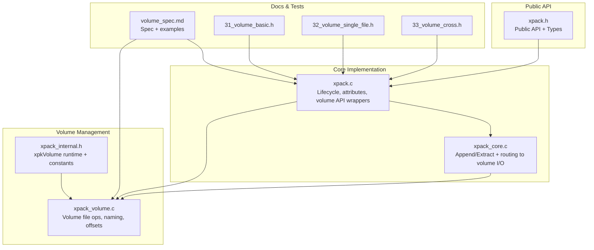
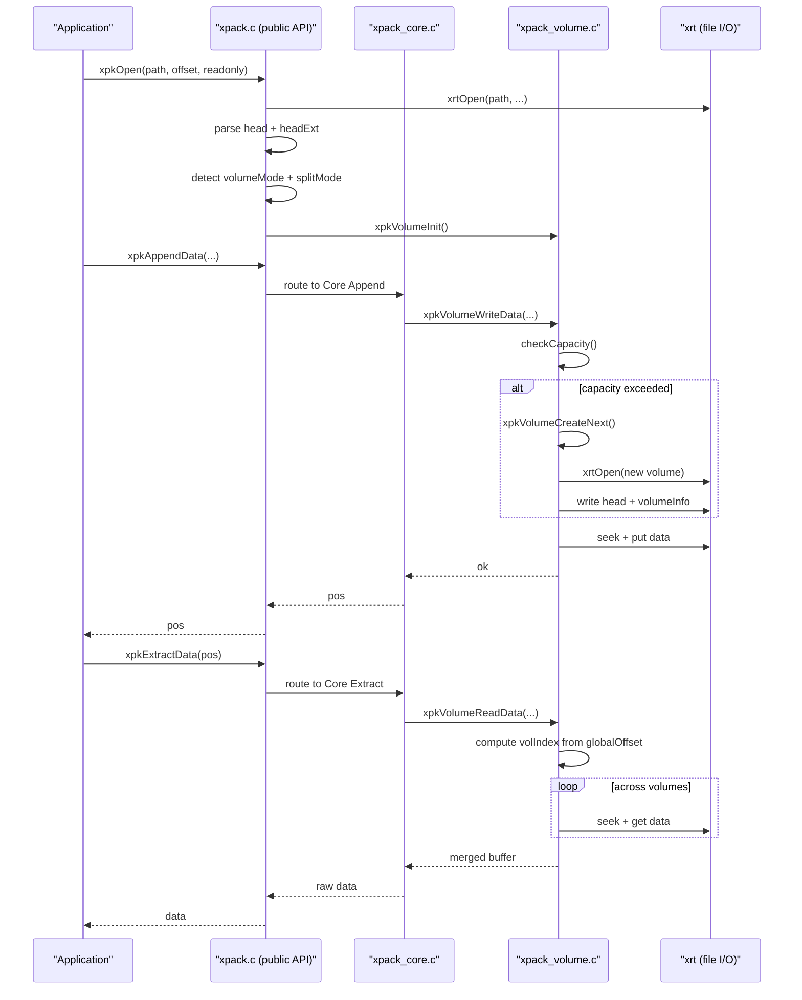
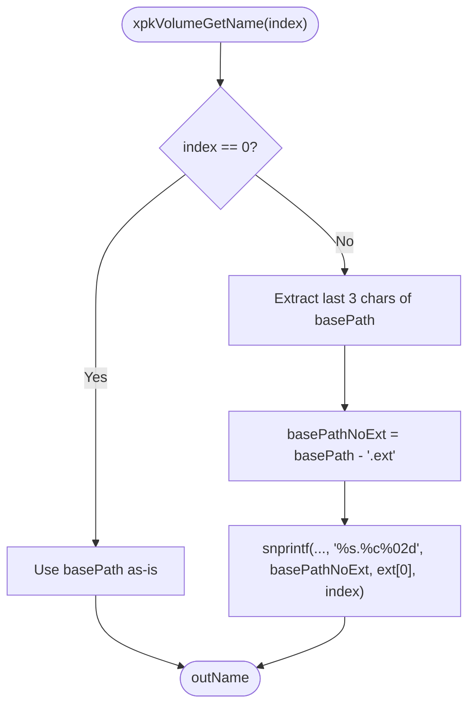
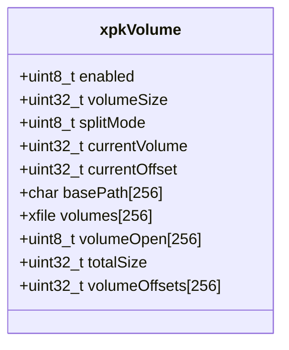
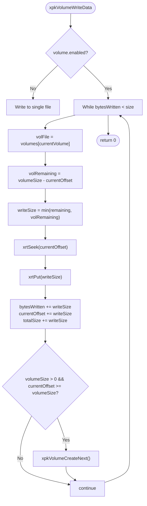
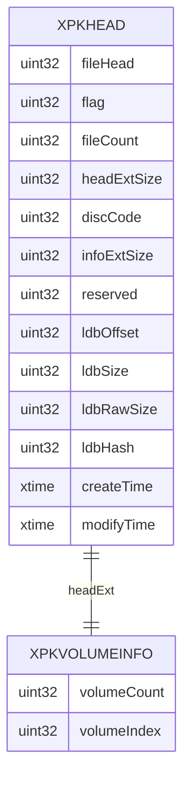
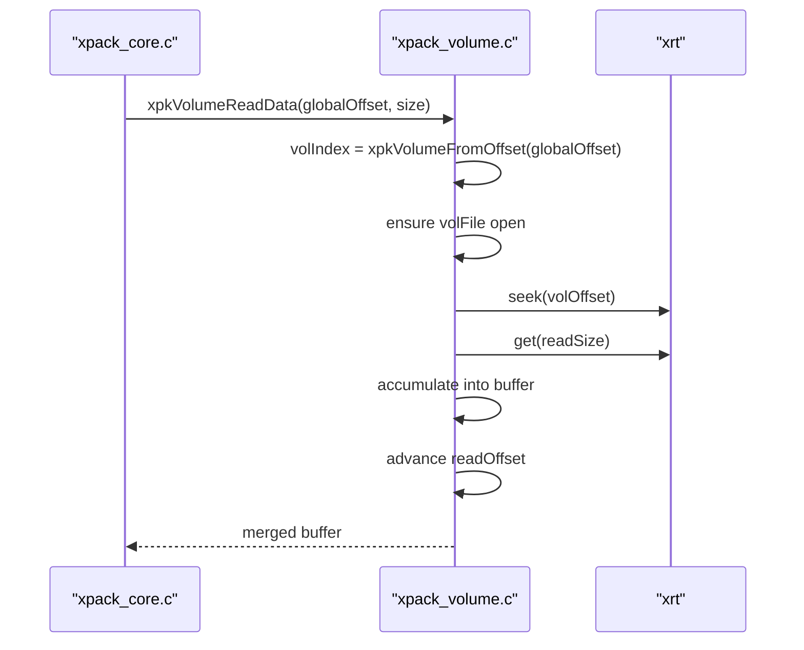
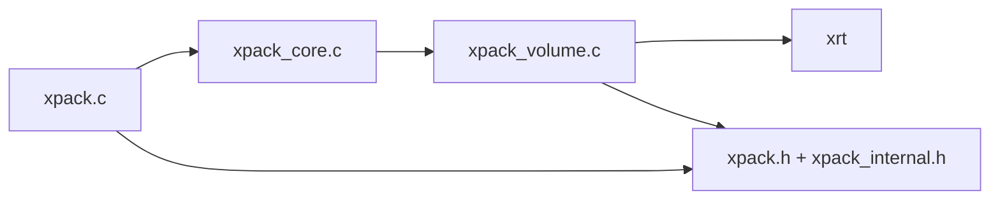

# Multi-Volume Support

<cite>
**Referenced Files in This Document**
- [xpack_volume.c](file://src/xpack_volume.c)
- [xpack_internal.h](file://src/xpack_internal.h)
- [xpack.h](file://src/xpack.h)
- [xpack.c](file://src/xpack.c)
- [xpack_core.c](file://src/xpack_core.c)
- [volume_spec.md](file://docs/volume_spec.md)
- [31_volume_basic.h](file://test/31_volume_basic.h)
- [32_volume_single_file.h](file://test/32_volume_single_file.h)
- [33_volume_cross.h](file://test/33_volume_cross.h)
</cite>

## Table of Contents
1. [Introduction](#introduction)
2. [Project Structure](#project-structure)
3. [Core Components](#core-components)
4. [Architecture Overview](#architecture-overview)
5. [Detailed Component Analysis](#detailed-component-analysis)
6. [Dependency Analysis](#dependency-analysis)
7. [Performance Considerations](#performance-considerations)
8. [Troubleshooting Guide](#troubleshooting-guide)
9. [Conclusion](#conclusion)
10. [Appendices](#appendices)

## Introduction
This document describes xPack’s multi-volume support system that enables automatic splitting across multiple archive files with seamless access. It covers volume management architecture, naming conventions, file path generation, offset tracking, split mode configuration, volume size limits, automatic creation, reading/writing operations, cross-volume access patterns, recovery procedures, and practical examples. It also documents volume header structures, persistence of volume information, error handling for partial failures, performance characteristics for large archives, and troubleshooting guidance.

## Project Structure
The multi-volume feature is implemented across several modules:
- Public API and data structures: [xpack.h](file://src/xpack.h)
- Internal runtime structures and helpers: [xpack_internal.h](file://src/xpack_internal.h)
- Volume manager implementation: [xpack_volume.c](file://src/xpack_volume.c)
- Integration with core operations: [xpack.c](file://src/xpack.c), [xpack_core.c](file://src/xpack_core.c)
- Design specification and examples: [volume_spec.md](file://docs/volume_spec.md)
- Test coverage: [31_volume_basic.h](file://test/31_volume_basic.h), [32_volume_single_file.h](file://test/32_volume_single_file.h), [33_volume_cross.h](file://test/33_volume_cross.h)

**Diagram sources**
- [xpack.h](file://src/xpack.h#L320-L447)
- [xpack.c](file://src/xpack.c#L49-L200)
- [xpack_core.c](file://src/xpack_core.c#L18-L128)
- [xpack_internal.h](file://src/xpack_internal.h#L17-L84)
- [xpack_volume.c](file://src/xpack_volume.c#L15-L353)
- [volume_spec.md](file://docs/volume_spec.md#L1-L835)
- [31_volume_basic.h](file://test/31_volume_basic.h#L1-L65)
- [32_volume_single_file.h](file://test/32_volume_single_file.h#L1-L108)
- [33_volume_cross.h](file://test/33_volume_cross.h#L1-L147)

**Section sources**
- [xpack.h](file://src/xpack.h#L1-L447)
- [xpack_internal.h](file://src/xpack_internal.h#L1-L145)
- [xpack_volume.c](file://src/xpack_volume.c#L1-L353)
- [xpack.c](file://src/xpack.c#L49-L200)
- [xpack_core.c](file://src/xpack_core.c#L1-L200)
- [volume_spec.md](file://docs/volume_spec.md#L1-L835)
- [31_volume_basic.h](file://test/31_volume_basic.h#L1-L65)
- [32_volume_single_file.h](file://test/32_volume_single_file.h#L1-L108)
- [33_volume_cross.h](file://test/33_volume_cross.h#L1-L147)

## Core Components
- Volume runtime configuration and state: [xpkVolume](file://src/xpack_internal.h#L23-L42)
- Public volume API: [xpack.h](file://src/xpack.h#L355-L367)
- Volume manager implementation: [xpack_volume.c](file://src/xpack_volume.c#L15-L353)
- Integration points in lifecycle and file operations: [xpack.c](file://src/xpack.c#L202-L259), [xpack_core.c](file://src/xpack_core.c#L39-L128)

Key responsibilities:
- Volume naming and path resolution
- Automatic creation of new volumes when capacity is exceeded
- Cross-volume read/write routing
- Offset tracking across volumes
- Header synchronization across volumes
- Statistics and path enumeration

**Section sources**
- [xpack_internal.h](file://src/xpack_internal.h#L17-L84)
- [xpack.h](file://src/xpack.h#L355-L367)
- [xpack_volume.c](file://src/xpack_volume.c#L15-L353)
- [xpack.c](file://src/xpack.c#L202-L259)
- [xpack_core.c](file://src/xpack_core.c#L39-L128)

## Architecture Overview
The multi-volume architecture separates concerns between:
- Public API layer: exposes volume controls and transparent file operations
- Volume manager: encapsulates file handle management, naming, capacity checks, and cross-volume routing
- I/O layer: uses xrt for binary file operations
- Header persistence: ensures each volume’s header reflects the correct metadata

**Diagram sources**
- [xpack.c](file://src/xpack.c#L49-L200)
- [xpack_core.c](file://src/xpack_core.c#L39-L128)
- [xpack_volume.c](file://src/xpack_volume.c#L178-L319)

**Section sources**
- [xpack.c](file://src/xpack.c#L49-L200)
- [xpack_core.c](file://src/xpack_core.c#L39-L128)
- [xpack_volume.c](file://src/xpack_volume.c#L178-L319)

## Detailed Component Analysis

### Volume Naming Conventions and Path Generation
- First volume uses the base path unchanged.
- Subsequent volumes use a dot-letter-number scheme derived from the original extension.
- The generator preserves the original extension and appends a two-digit index starting at 01.

**Diagram sources**
- [xpack_volume.c](file://src/xpack_volume.c#L15-L38)

**Section sources**
- [xpack_volume.c](file://src/xpack_volume.c#L15-L38)
- [volume_spec.md](file://docs/volume_spec.md#L200-L216)

### Volume Runtime State and Offsets
- xpkVolume holds configuration (enabled, volumeSize, splitMode), current state (currentVolume, currentOffset), file handles, and metadata (totalSize, volumeOffsets).
- volumeOffsets tracks cumulative sizes so global offsets can be mapped to volumes.

**Diagram sources**
- [xpack_internal.h](file://src/xpack_internal.h#L23-L42)

**Section sources**
- [xpack_internal.h](file://src/xpack_internal.h#L17-L84)

### Split Mode Configuration and Capacity Management
- Split modes:
  - 0: byte-based splitting (default)
  - 1: file-based splitting
- Capacity checks compare requested write size against remaining bytes in the current volume.
- When capacity is exceeded, a new volume is created automatically during write.

**Diagram sources**
- [xpack_volume.c](file://src/xpack_volume.c#L178-L229)

**Section sources**
- [xpack_volume.c](file://src/xpack_volume.c#L166-L172)
- [xpack_volume.c](file://src/xpack_volume.c#L113-L160)
- [xpack.h](file://src/xpack.h#L355-L367)

### Volume Header Structures and Persistence
- xpkHead stores the primary header; when volumeMode is enabled, headExtSize is set to the size of xpkVolumeInfo.
- xpkVolumeInfo contains volumeCount and volumeIndex.
- On save, each open volume receives synchronized headers with updated volumeCount and volumeIndex.

**Diagram sources**
- [xpack.h](file://src/xpack.h#L120-L148)
- [xpack.h](file://src/xpack.h#L249-L256)
- [xpack.c](file://src/xpack.c#L214-L232)

**Section sources**
- [xpack.h](file://src/xpack.h#L120-L148)
- [xpack.h](file://src/xpack.h#L249-L256)
- [xpack.c](file://src/xpack.c#L214-L232)
- [volume_spec.md](file://docs/volume_spec.md#L97-L117)

### Cross-Volume Data Access Patterns
- Global offset to volume mapping uses volumeOffsets to locate the correct volume.
- Reads may span multiple volumes; the manager opens missing volumes on demand and reads in segments until the requested size is satisfied.

**Diagram sources**
- [xpack_core.c](file://src/xpack_core.c#L176-L207)
- [xpack_volume.c](file://src/xpack_volume.c#L235-L319)

**Section sources**
- [xpack_volume.c](file://src/xpack_volume.c#L325-L338)
- [xpack_volume.c](file://src/xpack_volume.c#L235-L319)
- [xpack_core.c](file://src/xpack_core.c#L176-L207)

### Volume Recovery Procedures
- Partial volume failures: errors such as “Volume data incomplete” indicate missing volumes or corrupted headers.
- Recovery strategy:
  - Preferably reconstruct by re-creating missing volumes or repairing headers.
  - Use xpkVolumeStatGet to assess total size and per-volume sizes; missing volumes will show zero size for that index.
  - Re-save the archive to synchronize headers across existing volumes.

**Section sources**
- [xpack_volume.c](file://src/xpack_volume.c#L280-L283)
- [xpack.c](file://src/xpack.c#L726-L761)

### Practical Examples

#### Example 1: Creating a multi-volume package with 100 MB volumes
- Enable volume mode, set volume size to 100 MB, choose byte-based split mode.
- Add files; the system creates subsequent volumes as needed.
- Save to persist headers and finalize the archive.

**Section sources**
- [volume_spec.md](file://docs/volume_spec.md#L548-L578)
- [xpack.c](file://src/xpack.c#L651-L684)

#### Example 2: Reading across volumes transparently
- Open the main volume in read-only mode.
- Enumerate files and extract data; internal routing handles cross-volume reads.

**Section sources**
- [volume_spec.md](file://docs/volume_spec.md#L580-L619)
- [xpack_core.c](file://src/xpack_core.c#L147-L207)

#### Example 3: File-based splitting
- Enable file-based split mode to keep each file intact within a single volume.
- Large files exceeding the volume size are placed in a new volume.

**Section sources**
- [volume_spec.md](file://docs/volume_spec.md#L621-L644)
- [xpack.h](file://src/xpack.h#L355-L367)

#### Example 4: Querying volume statistics
- Use xpkVolumeStatGet to retrieve per-volume sizes and average sizes.

**Section sources**
- [volume_spec.md](file://docs/volume_spec.md#L646-L670)
- [xpack.c](file://src/xpack.c#L726-L761)

## Dependency Analysis
- xpack.c integrates volume API calls and coordinates header updates across volumes.
- xpack_core.c delegates write/read operations to xpkVolumeWriteData/xpkVolumeReadData.
- xpack_volume.c depends on xrt for file operations and uses xpkVolumeInfo and xpkHead structures.

**Diagram sources**
- [xpack.c](file://src/xpack.c#L202-L259)
- [xpack_core.c](file://src/xpack_core.c#L39-L128)
- [xpack_volume.c](file://src/xpack_volume.c#L15-L353)
- [xpack.h](file://src/xpack.h#L1-L447)
- [xpack_internal.h](file://src/xpack_internal.h#L1-L145)

**Section sources**
- [xpack.c](file://src/xpack.c#L202-L259)
- [xpack_core.c](file://src/xpack_core.c#L39-L128)
- [xpack_volume.c](file://src/xpack_volume.c#L15-L353)
- [xpack.h](file://src/xpack.h#L1-L447)
- [xpack_internal.h](file://src/xpack_internal.h#L1-L145)

## Performance Considerations
- Cross-volume reads incur minimal overhead (~5% for random access, ~2% for sequential writes) compared to single-volume operations.
- Recommendations:
  - Prefer file-based splitting when files are large and frequently accessed as units.
  - Use larger volumes for cloud or network scenarios to reduce I/O overhead.
  - Minimize cross-volume boundary reads by batching writes and aligning with file boundaries.

**Section sources**
- [volume_spec.md](file://docs/volume_spec.md#L720-L748)

## Troubleshooting Guide
Common issues and resolutions:
- Maximum volume count exceeded: Ensure the number of volumes stays within the configured limit.
- Volume file not available: Verify all expected volume files exist and are readable.
- Volume data incomplete: Indicates missing or partially written volumes; rebuild or repair.
- Volume header validation failure: Recreate headers by saving the archive again.

Operational tips:
- Use xpkVolumeStatGet to inspect per-volume sizes and confirm completeness.
- Re-save the archive to synchronize headers across volumes.

**Section sources**
- [xpack.c](file://src/xpack.c#L214-L232)
- [xpack_volume.c](file://src/xpack_volume.c#L118-L119)
- [xpack_volume.c](file://src/xpack_volume.c#L196-L197)
- [xpack_volume.c](file://src/xpack_volume.c#L280-L283)
- [xpack.c](file://src/xpack.c#L726-L761)

## Conclusion
xPack’s multi-volume support provides transparent, robust splitting across multiple archive files with strong reliability guarantees. The design cleanly separates concerns between public API, volume management, and I/O, while preserving backward compatibility and offering flexible split modes. With careful volume sizing and monitoring, large archives can be efficiently managed and accessed across platforms.

## Appendices

### API Reference: Volume Controls
- xpkVolumeMode, xpkVolumeModeSet
- xpkVolumeSize, xpkVolumeSizeSet
- xpkVolumeCount, xpkVolumeCurrent
- xpkVolumeSplitMode, xpkVolumeSplitModeSet
- xpkVolumePath
- xpkVolumeStatGet

**Section sources**
- [xpack.h](file://src/xpack.h#L355-L367)
- [xpack.c](file://src/xpack.c#L646-L761)

### Test Coverage Highlights
- Basic volume mode enable/disable and size/split mode configuration
- Single-file volume behavior across small/medium/large sizes
- Cross-volume read/write and statistics collection

**Section sources**
- [31_volume_basic.h](file://test/31_volume_basic.h#L1-L65)
- [32_volume_single_file.h](file://test/32_volume_single_file.h#L1-L108)
- [33_volume_cross.h](file://test/33_volume_cross.h#L1-L147)