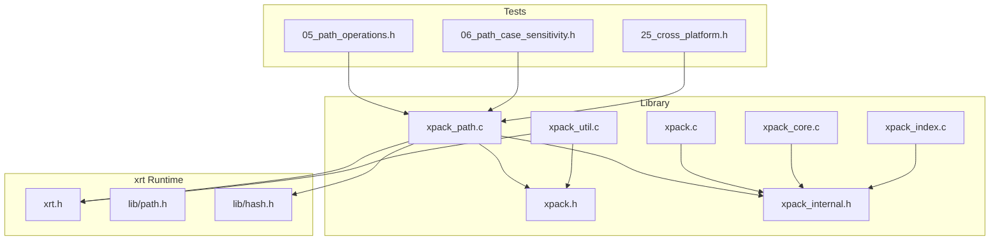
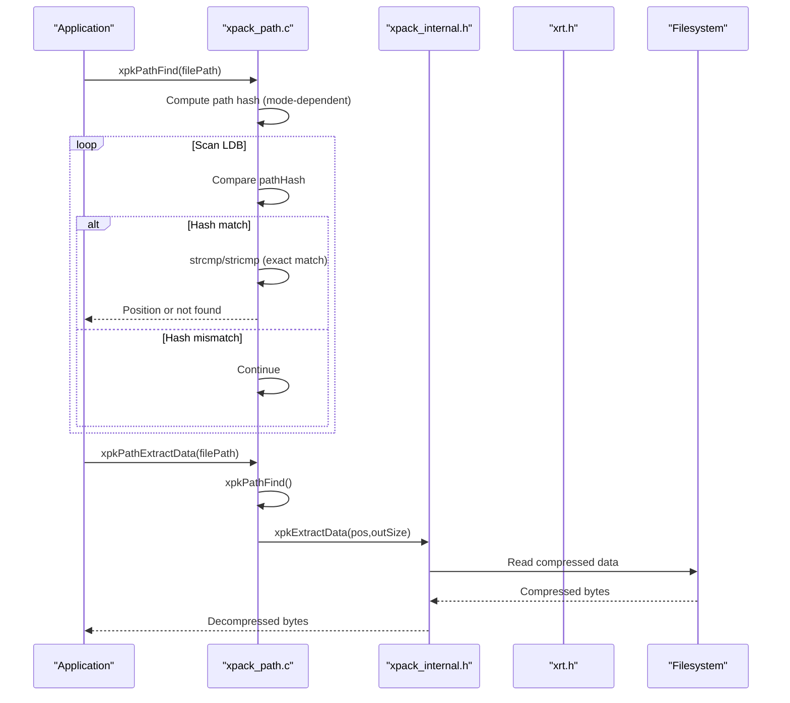
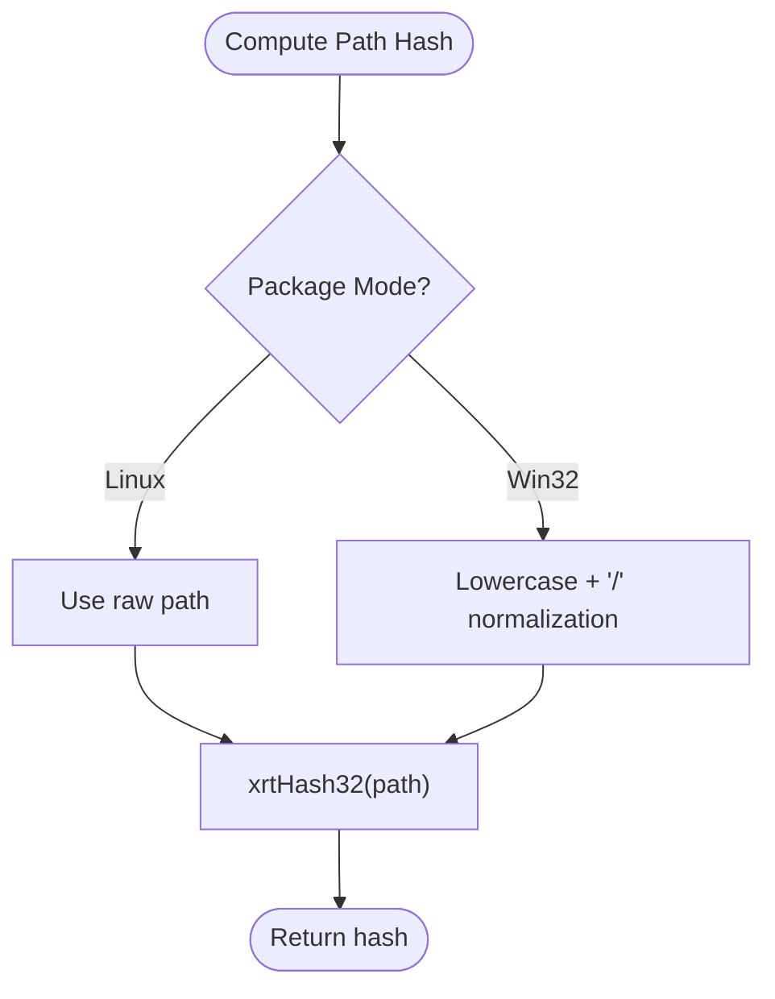
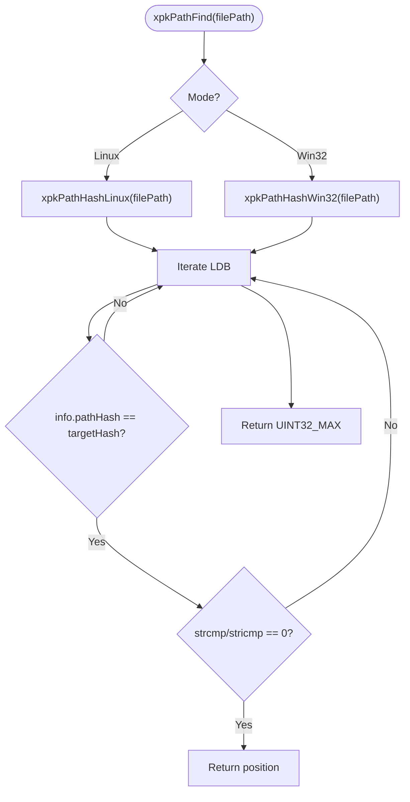
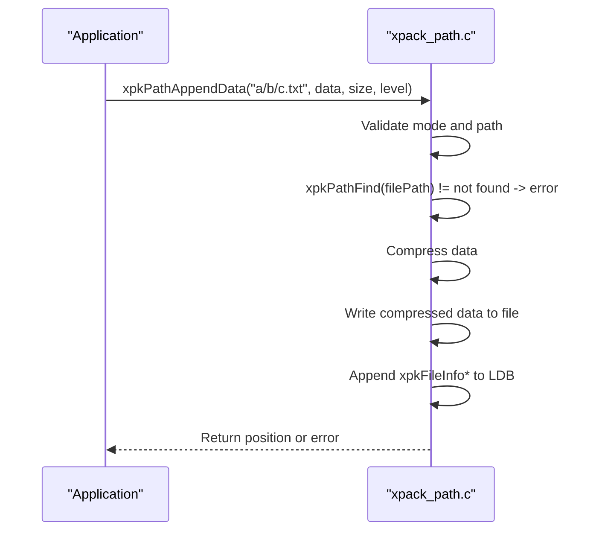
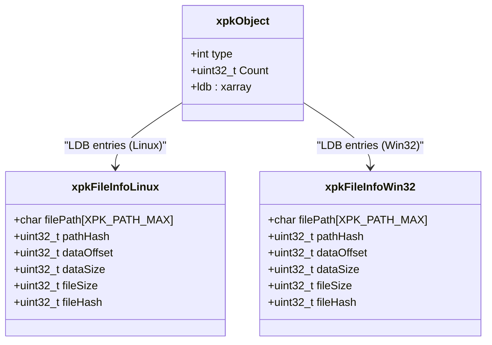
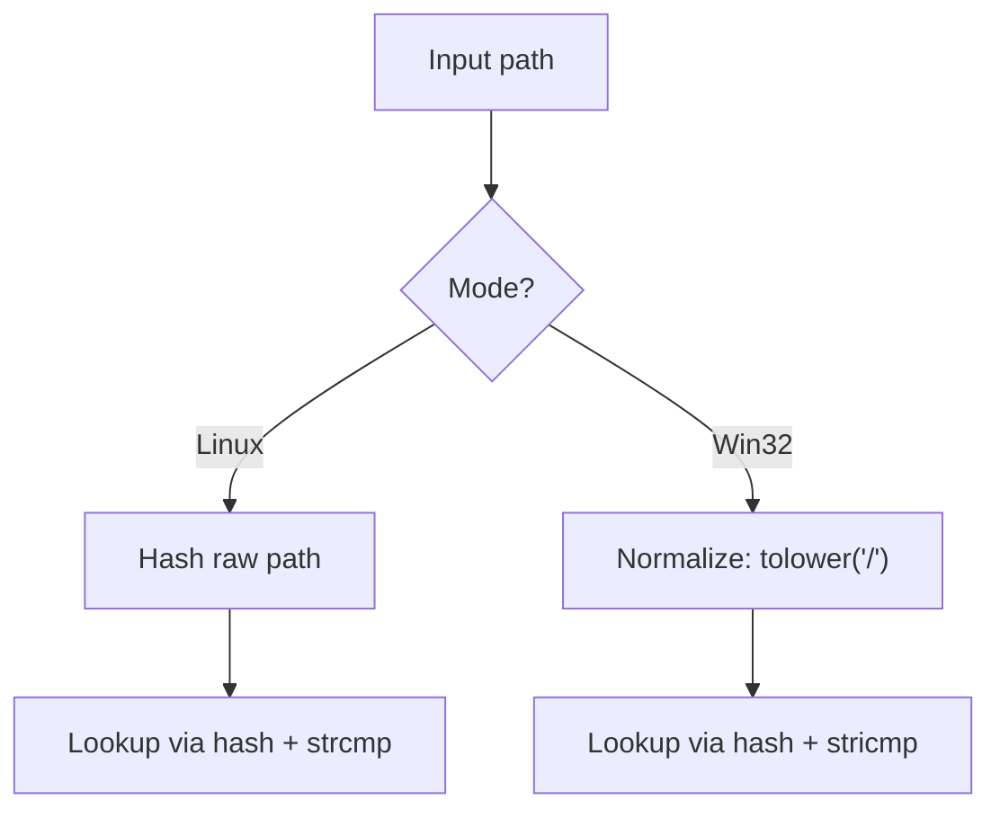
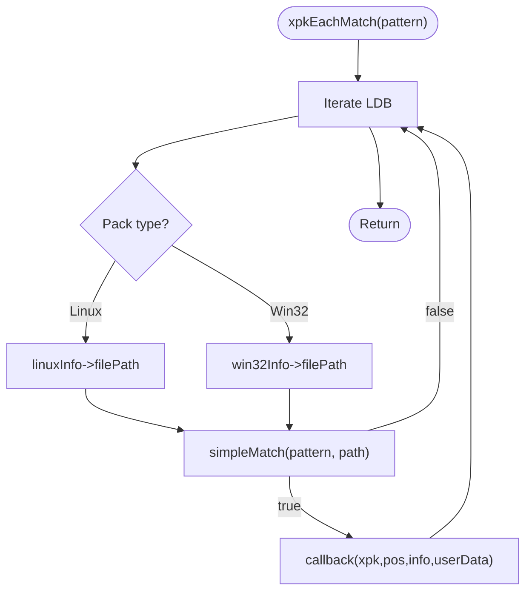
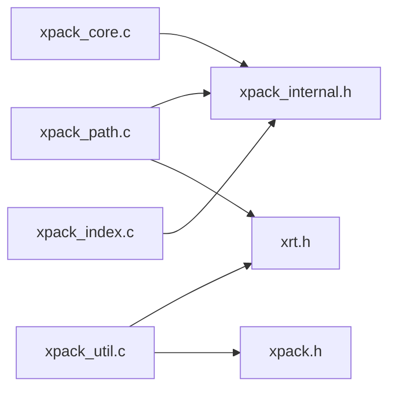

# Path-Based Operations

<cite>
**Referenced Files in This Document**
- [xpack_path.c](file://src/xpack_path.c)
- [xpack.h](file://src/xpack.h)
- [xpack_internal.h](file://src/xpack_internal.h)
- [xpack.c](file://src/xpack.c)
- [xpack_util.c](file://src/xpack_util.c)
- [xpack_core.c](file://src/xpack_core.c)
- [xpack_index.c](file://src/xpack_index.c)
- [xrt.h](file://lib/xrt/xrt.h)
- [path.h](file://lib/xrt/lib/path.h)
- [hash.h](file://lib/xrt/lib/hash.h)
- [05_path_operations.h](file://test/05_path_operations.h)
- [06_path_case_sensitivity.h](file://test/06_path_case_sensitivity.h)
- [25_cross_platform.h](file://test/25_cross_platform.h)
</cite>

## Table of Contents
1. [Introduction](#introduction)
2. [Project Structure](#project-structure)
3. [Core Components](#core-components)
4. [Architecture Overview](#architecture-overview)
5. [Detailed Component Analysis](#detailed-component-analysis)
6. [Dependency Analysis](#dependency-analysis)
7. [Performance Considerations](#performance-considerations)
8. [Troubleshooting Guide](#troubleshooting-guide)
9. [Conclusion](#conclusion)
10. [Appendices](#appendices)

## Introduction
This document explains xPack’s path-based file operations, focusing on direct path access rather than sequential iteration. It covers the path resolution system, case-sensitivity handling across package modes (Linux vs Win32), path normalization, indexing strategy, lookup algorithms, and performance characteristics. It also details integration with Core, Index, Linux, and Win32 modes, and provides practical examples for extraction, metadata retrieval, and conditional operations. Additional topics include path caching, wildcard pattern matching, cross-platform compatibility, security considerations, invalid path handling, and optimization strategies for large hierarchies.

## Project Structure
The path-based functionality is implemented in the core library with tight integration to the xrt runtime library for file I/O and hashing. Tests validate behavior across modes and platforms.

**Diagram sources**
- [xpack_path.c](file://src/xpack_path.c#L1-L373)
- [xpack.h](file://src/xpack.h#L1-L447)
- [xpack_internal.h](file://src/xpack_internal.h#L1-L145)
- [xpack.c](file://src/xpack.c#L1-L200)
- [xpack_util.c](file://src/xpack_util.c#L1-L200)
- [xpack_core.c](file://src/xpack_core.c#L1-L200)
- [xpack_index.c](file://src/xpack_index.c#L1-L200)
- [xrt.h](file://lib/xrt/xrt.h#L1-L800)
- [path.h](file://lib/xrt/lib/path.h#L1-L190)
- [hash.h](file://lib/xrt/lib/hash.h#L540-L1233)
- [05_path_operations.h](file://test/05_path_operations.h#L1-L187)
- [06_path_case_sensitivity.h](file://test/06_path_case_sensitivity.h#L1-L142)
- [25_cross_platform.h](file://test/25_cross_platform.h#L1-L356)

**Section sources**
- [xpack_path.c](file://src/xpack_path.c#L1-L373)
- [xpack.h](file://src/xpack.h#L1-L447)
- [xpack_internal.h](file://src/xpack_internal.h#L1-L145)
- [xrt.h](file://lib/xrt/xrt.h#L1-L800)
- [path.h](file://lib/xrt/lib/path.h#L1-L190)
- [hash.h](file://lib/xrt/lib/hash.h#L540-L1233)

## Core Components
- Path hashing and normalization:
  - Linux mode: case-sensitive hashing via a 32-bit hash function.
  - Win32 mode: path normalized to lowercase and forward slashes prior to hashing.
- Path lookup:
  - Hash-first filter followed by exact string comparison to resolve collisions.
- Path operations:
  - Append file/data by path, extract file/data by path, update by path, remove by path, existence check, and path retrieval by index.
- Integration with package modes:
  - Core/Index modes use positional access; Linux/Win32 modes support path-based access with mode-specific case handling.
- Wildcard matching:
  - Pattern-based traversal using a simple recursive matcher for “*” and “?”.

**Section sources**
- [xpack_path.c](file://src/xpack_path.c#L18-L90)
- [xpack.h](file://src/xpack.h#L38-L42)
- [xpack.h](file://src/xpack.h#L206-L236)
- [xpack_util.c](file://src/xpack_util.c#L111-L165)

## Architecture Overview
The path-based subsystem builds on xPack’s package modes and xrt’s primitives. It computes path hashes per mode, stores paths and hashes in file info structures, and resolves lookups by scanning the LDB list while filtering via precomputed hashes.

**Diagram sources**
- [xpack_path.c](file://src/xpack_path.c#L52-L90)
- [xpack_path.c](file://src/xpack_path.c#L285-L307)
- [xpack.h](file://src/xpack.h#L407-L416)
- [xpack_internal.h](file://src/xpack_internal.h#L98-L101)
- [xrt.h](file://lib/xrt/xrt.h#L650-L768)

## Detailed Component Analysis

### Path Hashing and Normalization
- Linux mode:
  - Uses the raw path for hashing; case-sensitive comparisons.
- Win32 mode:
  - Normalizes uppercase letters to lowercase and backslashes to forward slashes before hashing; case-insensitive comparisons.
- Hash function:
  - 32-bit hash computed via xrt’s hash primitive.

**Diagram sources**
- [xpack_path.c](file://src/xpack_path.c#L18-L46)
- [xrt.h](file://lib/xrt/xrt.h#L930-L963)

**Section sources**
- [xpack_path.c](file://src/xpack_path.c#L18-L46)
- [xrt.h](file://lib/xrt/xrt.h#L930-L963)

### Path Lookup Algorithm
- Filter by hash to reduce candidate set.
- Verify exact match using strcmp (Linux) or stricmp (Win32).
- Return position if found, otherwise UINT32_MAX.

**Diagram sources**
- [xpack_path.c](file://src/xpack_path.c#L52-L90)

**Section sources**
- [xpack_path.c](file://src/xpack_path.c#L52-L90)

### Path Operations API
- Existence and retrieval:
  - xpkPathExists(filePath): convenience wrapper around xpkPathFind.
  - xpkPathGet(pos): returns stored path for a given index depending on mode.
- Extraction:
  - xpkPathExtractFile(filePath, dstPath): extracts to filesystem.
  - xpkPathExtractData(filePath, outSize): returns allocated buffer.
- Update and removal:
  - xpkPathUpdateFile/UpdateData(filePath, ...): replaces existing path.
  - xpkPathRemove(filePath): deletes by path.
- Append:
  - xpkPathAppendFile(filePath, srcPath, level): adds from filesystem.
  - xpkPathAppendData(filePath, data, size, level): adds from memory.

**Diagram sources**
- [xpack_path.c](file://src/xpack_path.c#L138-L279)
- [xpack.h](file://src/xpack.h#L407-L416)

**Section sources**
- [xpack_path.c](file://src/xpack_path.c#L92-L94)
- [xpack_path.c](file://src/xpack_path.c#L138-L279)
- [xpack_path.c](file://src/xpack_path.c#L285-L353)
- [xpack_path.c](file://src/xpack_path.c#L359-L372)
- [xpack.h](file://src/xpack.h#L407-L416)

### Integration with Package Modes
- Core mode:
  - Path-based APIs are not applicable; use positional APIs (xpkAppendFile/Data, xpkExtractFile/Data, etc.).
- Index mode:
  - Path-based APIs are not applicable; use index-based APIs (xpkIndexFind, xpkIndexAppend*, etc.).
- Linux mode:
  - Path-based APIs supported; case-sensitive semantics.
- Win32 mode:
  - Path-based APIs supported; case-insensitive semantics.

**Diagram sources**
- [xpack.h](file://src/xpack.h#L195-L236)
- [xpack.h](file://src/xpack.h#L38-L42)

**Section sources**
- [xpack.h](file://src/xpack.h#L38-L42)
- [xpack.h](file://src/xpack.h#L195-L236)

### Case-Sensitivity Handling
- Linux mode:
  - Paths are case-sensitive; “Test.txt” and “test.txt” are distinct.
- Win32 mode:
  - Paths are case-insensitive; normalization converts to lowercase and backslashes to forward slashes during hashing.

**Diagram sources**
- [xpack_path.c](file://src/xpack_path.c#L18-L46)
- [xpack_path.c](file://src/xpack_path.c#L68-L87)

**Section sources**
- [xpack_path.c](file://src/xpack_path.c#L18-L46)
- [xpack_path.c](file://src/xpack_path.c#L68-L87)
- [25_cross_platform.h](file://test/25_cross_platform.h#L15-L52)
- [06_path_case_sensitivity.h](file://test/06_path_case_sensitivity.h#L7-L21)

### Path Normalization and Separator Handling
- Win32 mode normalizes backslashes to forward slashes and lowercases alphabetic characters before hashing.
- Tests demonstrate that both “folder/sub/file.txt” and “folder\sub\file.txt” can resolve to the same stored path in Win32 mode.

**Section sources**
- [xpack_path.c](file://src/xpack_path.c#L24-L46)
- [25_cross_platform.h](file://test/25_cross_platform.h#L54-L75)

### Wildcard Pattern Matching and Conditional Operations
- xpkEachMatch(pattern, callback, userData):
  - Iterates LDB and matches stored paths against a simple wildcard pattern (“*” and “?”).
  - Linux/Win32 modes populate paths from their respective file info structures.

**Diagram sources**
- [xpack_util.c](file://src/xpack_util.c#L136-L165)
- [xpack_util.c](file://src/xpack_util.c#L111-L134)
- [xpack.h](file://src/xpack.h#L421-L422)

**Section sources**
- [xpack_util.c](file://src/xpack_util.c#L111-L165)
- [xpack.h](file://src/xpack.h#L421-L422)

### Practical Examples
- Path-based file extraction:
  - Open a package in Linux/Win32 mode, call xpkPathExtractFile(filePath, dstPath) to extract to disk.
- Metadata retrieval:
  - After opening in read-only mode, call xpkPathGet(pos) to retrieve the stored path and combine with xpkInfo* getters for size, packed size, hash, and compression level.
- Conditional operations:
  - Use xpkEachMatch("pattern", callback, ...) to process subsets of files meeting a wildcard condition.

**Section sources**
- [xpack_path.c](file://src/xpack_path.c#L285-L307)
- [xpack.h](file://src/xpack.h#L382-L388)
- [xpack_util.c](file://src/xpack_util.c#L136-L165)

## Dependency Analysis
- Internal dependencies:
  - xpack_path.c depends on xpack_internal.h for macros and internal helpers, and on xrt.h for file I/O and hashing.
  - xpack_util.c provides wildcard matching and traversal; it reads path fields from Linux/Win32 file info structures.
- External dependencies:
  - xrt provides hashing (xrtHash32), file operations (xrtOpen, xrtGet, xrtPut, xrtFileGetAll), and path utilities.

**Diagram sources**
- [xpack_path.c](file://src/xpack_path.c#L7-L12)
- [xpack_internal.h](file://src/xpack_internal.h#L10-L11)
- [xpack_util.c](file://src/xpack_util.c#L7-L12)
- [xpack_core.c](file://src/xpack_core.c#L7-L12)
- [xpack_index.c](file://src/xpack_index.c#L7-L12)

**Section sources**
- [xpack_path.c](file://src/xpack_path.c#L7-L12)
- [xpack_internal.h](file://src/xpack_internal.h#L10-L11)
- [xpack_util.c](file://src/xpack_util.c#L7-L12)

## Performance Considerations
- Hash filter reduces scan cost:
  - Average O(1) hash lookup plus O(k) collision checks; typical k << N.
- Memory overhead:
  - Linux/Win32 file info structures include a fixed-size path field and a path hash; this enables fast lookup at the cost of extra storage.
- Compression and I/O:
  - Compression level affects CPU and I/O; choose appropriate levels for balancing speed and size.
- Large hierarchies:
  - For very large packages, consider batching operations and minimizing repeated path lookups by caching positions locally if needed.

[No sources needed since this section provides general guidance]

## Troubleshooting Guide
- Path not found:
  - Ensure the package is in Linux or Win32 mode; path-based APIs are unavailable in Core/Index modes.
  - Verify case sensitivity expectations; in Win32 mode, paths are case-insensitive.
- Duplicate path errors:
  - xpkPathAppendData prevents adding a path that already exists; remove or update instead.
- Path too long:
  - Paths exceeding XPK_PATH_MAX are rejected.
- Readonly mode:
  - Path-based append/update/remove operations are disallowed in readonly mode.
- Compression failures:
  - Inspect error codes returned by compression routines; retry with different levels.

**Section sources**
- [xpack_path.c](file://src/xpack_path.c#L108-L112)
- [xpack_path.c](file://src/xpack_path.c#L164-L168)
- [xpack_path.c](file://src/xpack_path.c#L170-L175)
- [xpack_path.c](file://src/xpack_path.c#L103-L106)
- [xpack.h](file://src/xpack.h#L78-L80)

## Conclusion
xPack’s path-based operations provide efficient, mode-aware access to files within archives. By combining hash-filtered lookups with mode-specific normalization and case handling, the system supports robust cross-platform workflows. While path-based APIs are exclusive to Linux and Win32 modes, they integrate seamlessly with wildcard matching and metadata retrieval for flexible, high-performance file management.

[No sources needed since this section summarizes without analyzing specific files]

## Appendices

### API Reference Highlights
- Path-based APIs:
  - xpkPathFind, xpkPathExists, xpkPathAppendFile/Data, xpkPathExtractFile/Data, xpkPathUpdateFile/Data, xpkPathRemove, xpkPathGet.
- Traversal and matching:
  - xpkEach, xpkEachMatch.

**Section sources**
- [xpack.h](file://src/xpack.h#L407-L416)
- [xpack.h](file://src/xpack.h#L421-L422)

### Tests Demonstrating Behavior
- Path operations:
  - Append, extract, directory nesting, relative/absolute paths, special characters, deep nesting, updates, multiple files, traversal.
- Case sensitivity:
  - Creation, extraction, updates, duplicates, mixed case, extensions, Unicode.
- Cross-platform:
  - Case insensitivity on Win32, case sensitivity on Linux, separator handling, absolute/relative paths, nested structures, drive letters, special characters.

**Section sources**
- [05_path_operations.h](file://test/05_path_operations.h#L7-L186)
- [06_path_case_sensitivity.h](file://test/06_path_case_sensitivity.h#L7-L141)
- [25_cross_platform.h](file://test/25_cross_platform.h#L15-L356)