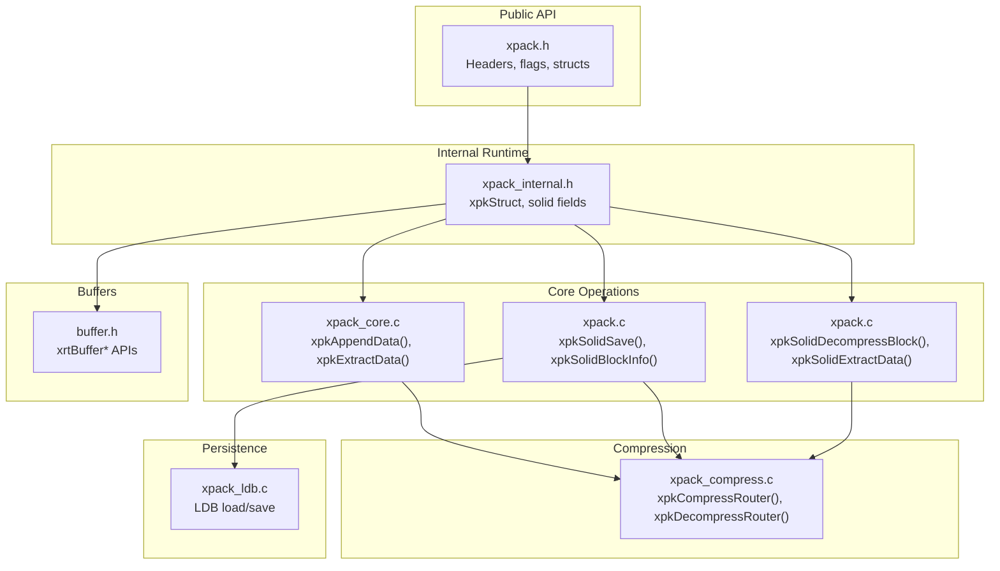
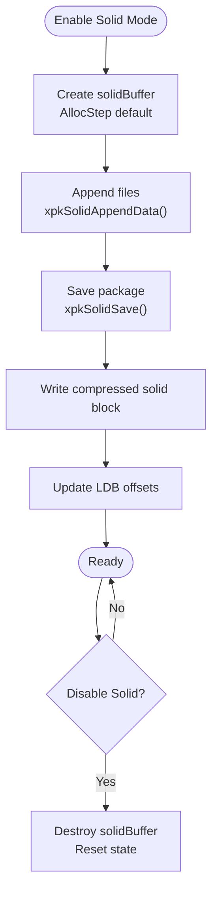
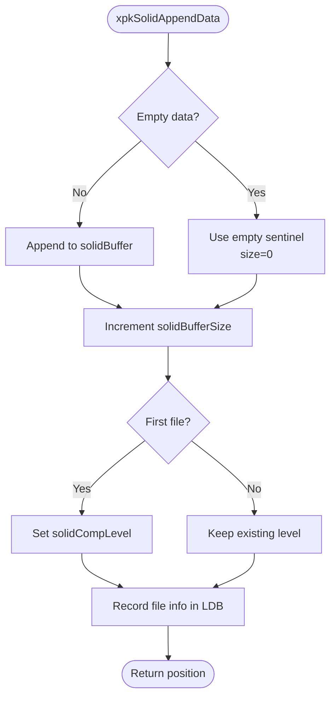
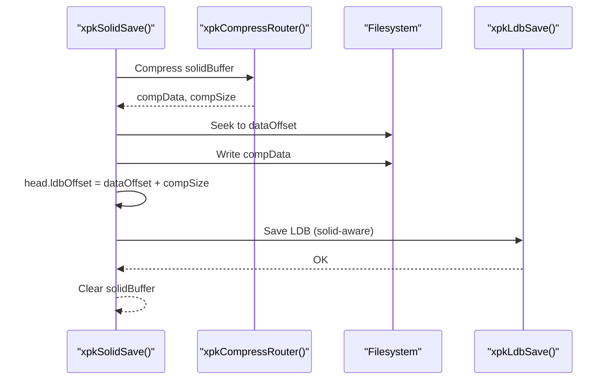
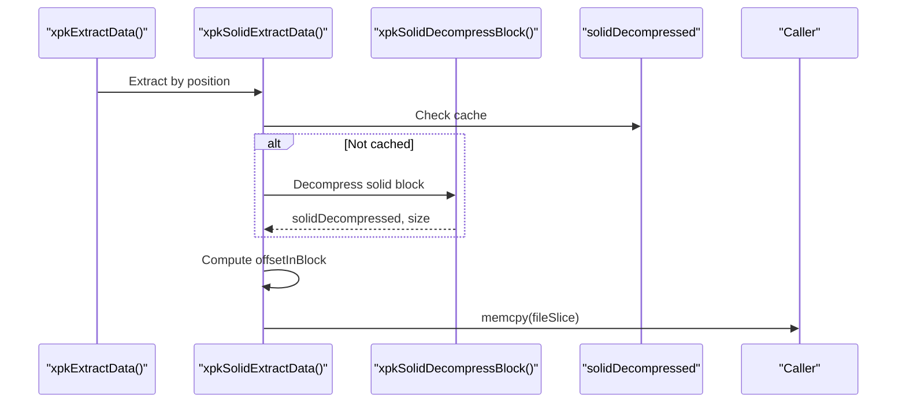
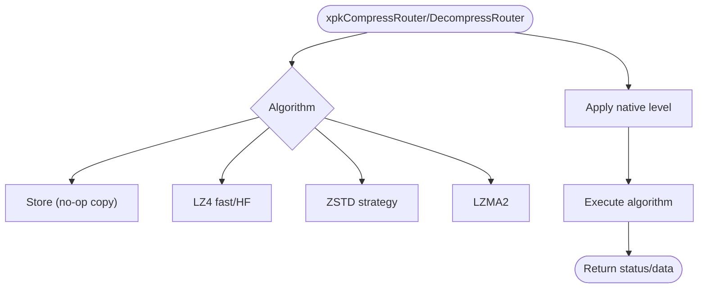
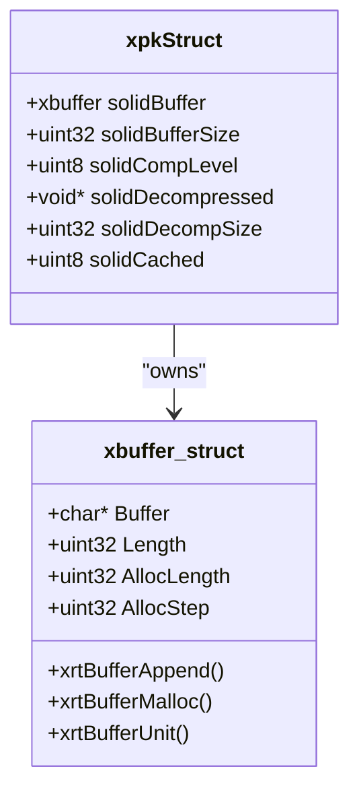
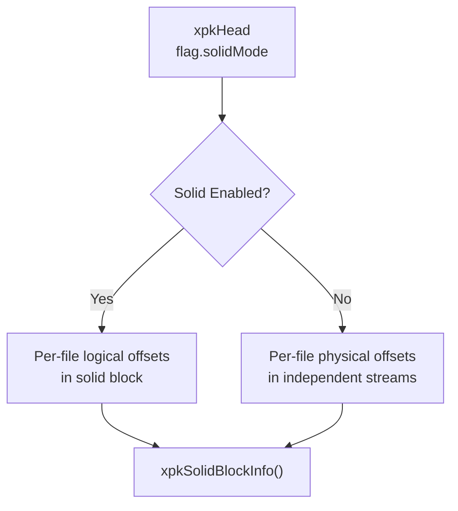
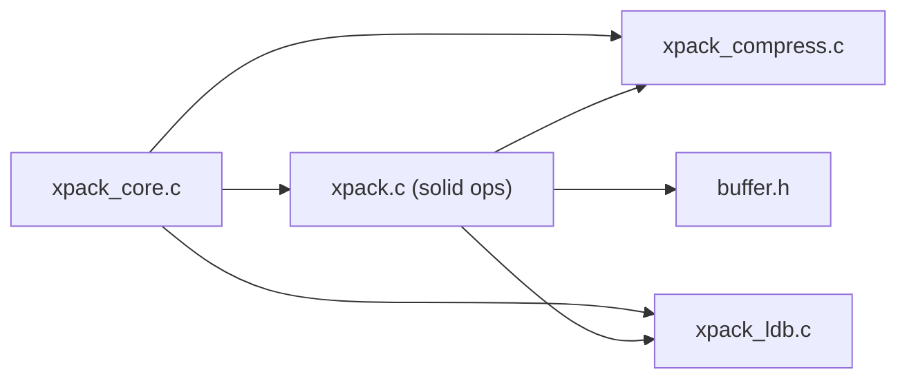

# Solid Compression

<cite>
**Referenced Files in This Document**
- [xpack.h](file://src/xpack.h)
- [xpack_internal.h](file://src/xpack_internal.h)
- [xpack.c](file://src/xpack.c)
- [xpack_core.c](file://src/xpack_core.c)
- [xpack_compress.c](file://src/xpack_compress.c)
- [xpack_ldb.c](file://src/xpack_ldb.c)
- [buffer.h](file://lib/xrt/lib/buffer.h)
- [10_solid_compression.h](file://test/10_solid_compression.h)
</cite>

## Table of Contents
1. [Introduction](#introduction)
2. [Project Structure](#project-structure)
3. [Core Components](#core-components)
4. [Architecture Overview](#architecture-overview)
5. [Detailed Component Analysis](#detailed-component-analysis)
6. [Dependency Analysis](#dependency-analysis)
7. [Performance Considerations](#performance-considerations)
8. [Troubleshooting Guide](#troubleshooting-guide)
9. [Conclusion](#conclusion)
10. [Appendices](#appendices)

## Introduction
This document explains xPack’s solid compression feature, which combines multiple files into a single compressed stream to improve compression ratios. It covers how solid compression differs from independent file compression, the compression pipeline for solid streams, memory-efficient processing, and practical guidance for optimal usage. It also documents the internal implementation, buffer management, and error handling mechanisms.

## Project Structure
Solid compression spans several modules:
- Public API and data structures define the package format and solid mode flags.
- Internal runtime structures manage solid buffers and caching.
- Core append/extract routines route to solid or independent paths depending on mode.
- Compression router selects and invokes underlying algorithms.
- LDB persistence integrates solid offsets and metadata.



**Diagram sources**
- [xpack.h](file://src/xpack.h#L100-L148)
- [xpack_internal.h](file://src/xpack_internal.h#L47-L84)
- [xpack_core.c](file://src/xpack_core.c#L39-L128)
- [xpack.c](file://src/xpack.c#L427-L616)
- [xpack_compress.c](file://src/xpack_compress.c#L20-L147)
- [xpack_ldb.c](file://src/xpack_ldb.c#L101-L197)
- [buffer.h](file://lib/xrt/lib/buffer.h#L5-L116)

**Section sources**
- [xpack.h](file://src/xpack.h#L100-L148)
- [xpack_internal.h](file://src/xpack_internal.h#L47-L84)

## Core Components
- Solid mode flag: A bit in the package header enables solid compression for the entire package.
- Solid buffer: A growable in-memory buffer accumulates concatenated file data until saved.
- Solid cache: After decompression, the entire solid block is cached for fast per-file extraction.
- Offset calculation: Per-file offsets within the solid block are computed by summing previous file sizes.
- Compression routing: The same compression router is used for both independent and solid blocks.

Key public APIs:
- xpkSolidModeSet(xpk, enabled): Enable/disable solid mode.
- xpkSolidBlockInfo(xpk, offset*, size*): Get solid block location and size.
- xpkAppendData(..., level): Adds data to solid buffer when solid mode is enabled.
- xpkExtractData(...): Extracts individual files from solid cache when solid mode is enabled.

**Section sources**
- [xpack.h](file://src/xpack.h#L105-L115)
- [xpack.h](file://src/xpack.h#L348-L352)
- [xpack_internal.h](file://src/xpack_internal.h#L67-L84)
- [xpack.c](file://src/xpack.c#L380-L421)
- [xpack.c](file://src/xpack.c#L427-L525)
- [xpack.c](file://src/xpack.c#L527-L616)

## Architecture Overview
Solid compression operates by:
- Accumulating file data into a solid buffer while in solid mode.
- Saving the solid buffer as one compressed block at package save time.
- Storing per-file metadata in LDB with logical offsets within the solid block.
- On extract, decompressing the solid block once and copying the requested file slice from the cache.

```mermaid
sequenceDiagram
participant App as "Application"
participant Core as "xpkAppendData()"
participant Solid as "xpkSolidAppendData()"
participant Buf as "xrtBufferAppend()"
participant Save as "xpkSolidSave()"
participant Comp as "xpkCompressRouter()"
participant LDB as "xpkLdbSave()"
participant FS as "Filesystem"
App->>Core : Append file in solid mode
Core->>Solid : Delegate to solid path
Solid->>Buf : Append raw bytes to solidBuffer
Note over Solid,Buf : Empty files are skipped; non-empty files appended
App->>Save : xpkSave()
Save->>Comp : Compress solidBuffer
Comp-->>Save : compData, compSize
Save->>FS : Write solid block
Save->>LDB : Persist LDB with solid offsets
LDB-->>Save : OK
Save-->>App : OK
```

**Diagram sources**
- [xpack_core.c](file://src/xpack_core.c#L39-L128)
- [xpack.c](file://src/xpack.c#L427-L525)
- [xpack_compress.c](file://src/xpack_compress.c#L20-L147)
- [xpack_ldb.c](file://src/xpack_ldb.c#L101-L197)

## Detailed Component Analysis

### Solid Mode Control and Lifecycle
- Enabling solid mode allocates a growing buffer and initializes solid state.
- Disabling solid mode frees the buffer and clears state.
- Solid block info exposes the offset and size of the solid region.



**Diagram sources**
- [xpack.c](file://src/xpack.c#L380-L421)
- [xpack.c](file://src/xpack.c#L480-L525)

**Section sources**
- [xpack.c](file://src/xpack.c#L380-L421)
- [xpack.c](file://src/xpack.c#L480-L525)

### Solid Append Pipeline
- Empty files are treated specially (no append to buffer).
- Non-empty files are appended to the solid buffer with incremental offset tracking.
- First file’s compression level sets the solid block’s compression level.



**Diagram sources**
- [xpack.c](file://src/xpack.c#L427-L478)

**Section sources**
- [xpack.c](file://src/xpack.c#L427-L478)

### Solid Save and LDB Integration
- Compress the accumulated solid buffer using the selected algorithm.
- Write the compressed block to disk at the data region.
- Update LDB offsets and persist LDB; solid mode defers LDB offset computation to here.



**Diagram sources**
- [xpack.c](file://src/xpack.c#L480-L525)
- [xpack_ldb.c](file://src/xpack_ldb.c#L137-L197)

**Section sources**
- [xpack.c](file://src/xpack.c#L480-L525)
- [xpack_ldb.c](file://src/xpack_ldb.c#L137-L197)

### Solid Extract Pipeline
- On first extract, decompress the solid block into a cache.
- Compute the file’s offset within the solid block by summing preceding file sizes.
- Copy the requested slice from the cache.



**Diagram sources**
- [xpack_core.c](file://src/xpack_core.c#L147-L200)
- [xpack.c](file://src/xpack.c#L527-L616)
- [xpack.c](file://src/xpack.c#L558-L606)

**Section sources**
- [xpack_core.c](file://src/xpack_core.c#L147-L200)
- [xpack.c](file://src/xpack.c#L527-L616)
- [xpack.c](file://src/xpack.c#L558-L606)

### Compression Router and Algorithms
- The router supports multiple algorithms and levels, used for both independent and solid blocks.
- Solid blocks compress the entire concatenated buffer using the configured level.
- On extract, the same router is used to decompress the solid block.



**Diagram sources**
- [xpack_compress.c](file://src/xpack_compress.c#L20-L147)

**Section sources**
- [xpack_compress.c](file://src/xpack_compress.c#L20-L147)

### Buffer Management and Streaming
- Solid buffer grows incrementally via xrtBufferAppend with a default step size.
- Empty files are skipped to avoid unnecessary allocations.
- After save, the buffer is cleared to release memory.



**Diagram sources**
- [buffer.h](file://lib/xrt/lib/buffer.h#L1022-L1027)
- [xpack_internal.h](file://src/xpack_internal.h#L72-L84)

**Section sources**
- [buffer.h](file://lib/xrt/lib/buffer.h#L5-L116)
- [xpack_internal.h](file://src/xpack_internal.h#L72-L84)

### Header and Metadata
- Solid mode is stored in the package header flags.
- LDB stores per-file metadata; in solid mode, file dataOffset semantics differ (logical offsets within solid block).
- Solid block info API reports the physical location of the solid region.



**Diagram sources**
- [xpack.h](file://src/xpack.h#L105-L115)
- [xpack.h](file://src/xpack.h#L242-L246)
- [xpack.c](file://src/xpack.c#L410-L421)

**Section sources**
- [xpack.h](file://src/xpack.h#L105-L115)
- [xpack.h](file://src/xpack.h#L242-L246)
- [xpack.c](file://src/xpack.c#L410-L421)

## Dependency Analysis
Solid compression depends on:
- Core append/extract paths to route to solid logic when enabled.
- Compression router for algorithm selection and execution.
- LDB persistence to record per-file metadata and offsets.
- Buffer library for efficient in-memory concatenation.



**Diagram sources**
- [xpack_core.c](file://src/xpack_core.c#L39-L128)
- [xpack.c](file://src/xpack.c#L427-L616)
- [xpack_compress.c](file://src/xpack_compress.c#L20-L147)
- [xpack_ldb.c](file://src/xpack_ldb.c#L101-L197)
- [buffer.h](file://lib/xrt/lib/buffer.h#L5-L116)

**Section sources**
- [xpack_core.c](file://src/xpack_core.c#L39-L128)
- [xpack.c](file://src/xpack.c#L427-L616)
- [xpack_compress.c](file://src/xpack_compress.c#L20-L147)
- [xpack_ldb.c](file://src/xpack_ldb.c#L101-L197)
- [buffer.h](file://lib/xrt/lib/buffer.h#L5-L116)

## Performance Considerations
- Solid compression improves ratios by allowing cross-file redundancy reduction across the entire package.
- Overheads include:
  - Single-pass compression of the concatenated buffer.
  - One-time decompression and caching of the solid block.
  - Additional memory for the solid buffer and cache.
- Independent compression avoids per-file decompression overhead but loses cross-file redundancy.

Practical guidance:
- Prefer solid mode for packages with many similar files (e.g., logs, binaries built from templates).
- Use independent mode for packages with few or highly diverse files to reduce memory and initial latency.
- Choose higher compression levels for solid mode when storage savings outweigh CPU cost.

[No sources needed since this section provides general guidance]

## Troubleshooting Guide
Common issues and diagnostics:
- Solid mode disabled unexpectedly: Verify xpkSolidModeSet returned success and xpkSolidMode reflects enabled.
- Extraction failures: Check xpkLastError and xpkLastErrorMsg; errors include invalid positions, read/write failures, and decompression errors.
- Memory pressure: Solid mode holds the entire concatenated buffer and cache; reduce file counts or sizes, or disable solid mode.
- Mixed empty/non-empty files: Ensure empty files are handled correctly; they contribute zero-length entries but do not inflate buffer.

Operational checks:
- Confirm solid block info returns valid offset and size.
- Validate LDB integrity after save; hash mismatch indicates corruption.
- Reopen and re-extract to confirm round-trip correctness.

**Section sources**
- [xpack.c](file://src/xpack.c#L622-L640)
- [xpack.c](file://src/xpack.c#L558-L606)
- [xpack_ldb.c](file://src/xpack_ldb.c#L47-L71)

## Conclusion
Solid compression in xPack aggregates multiple files into a single compressed stream, leveraging shared redundancy to achieve better compression ratios. While it increases memory usage and requires a one-time block decompression, it is ideal for archives with repetitive content. The implementation cleanly separates solid and independent paths, reuses the compression router, and integrates tightly with LDB and buffer management.

[No sources needed since this section summarizes without analyzing specific files]

## Appendices

### Practical Examples and Best Practices
- Basic solid creation and extraction:
  - Enable solid mode, append multiple files, save, reopen, and extract.
  - See tests for end-to-end verification.
- Compression ratio comparison:
  - Create identical or highly similar files; compare total packed sizes between solid and independent modes.
- Optimal use cases:
  - Solid mode: Many small, similar files (logs, assets).
  - Independent mode: Few large, unique files (media, executables).

**Section sources**
- [10_solid_compression.h](file://test/10_solid_compression.h#L7-L69)
- [10_solid_compression.h](file://test/10_solid_compression.h#L100-L145)