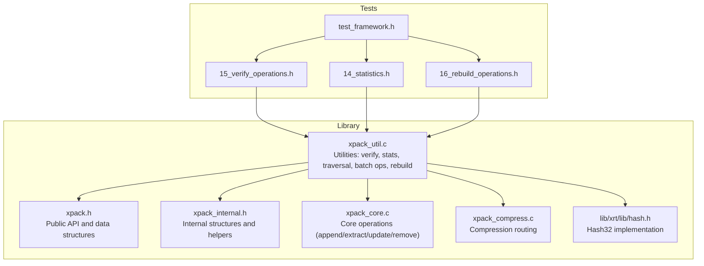
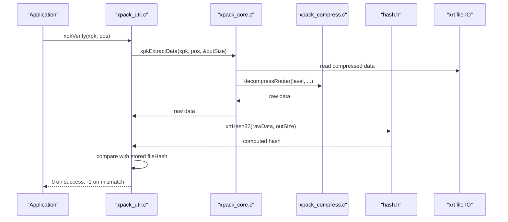
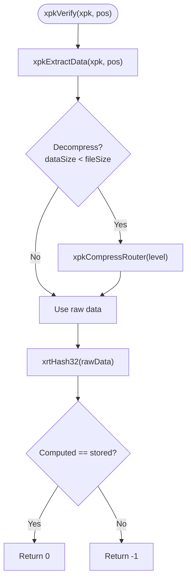
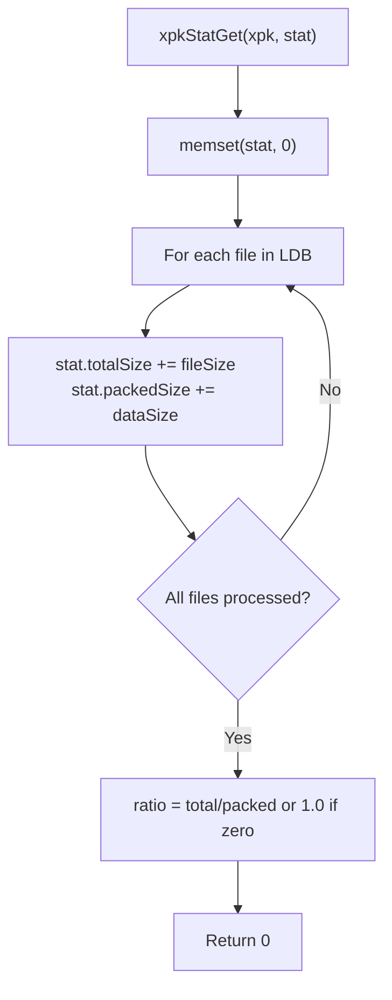
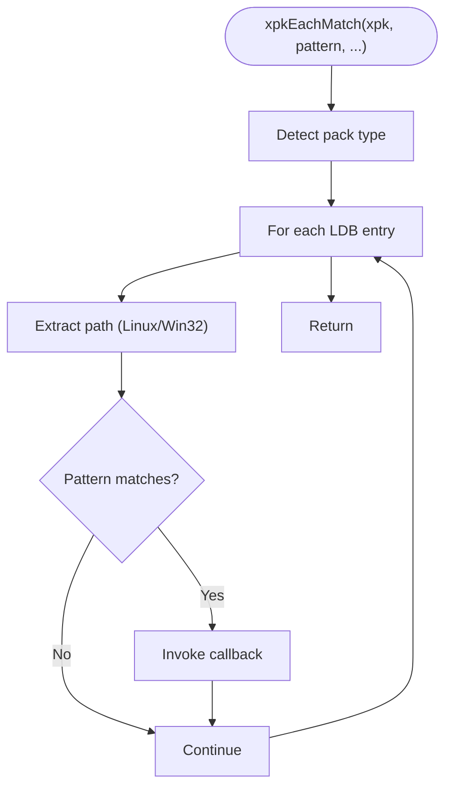
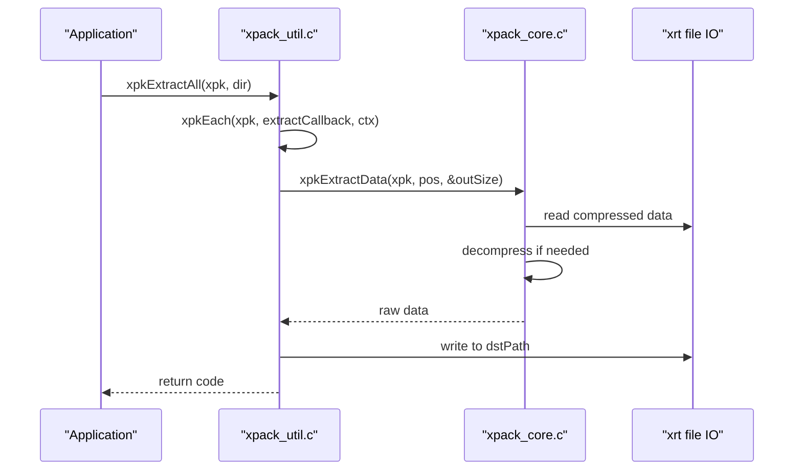
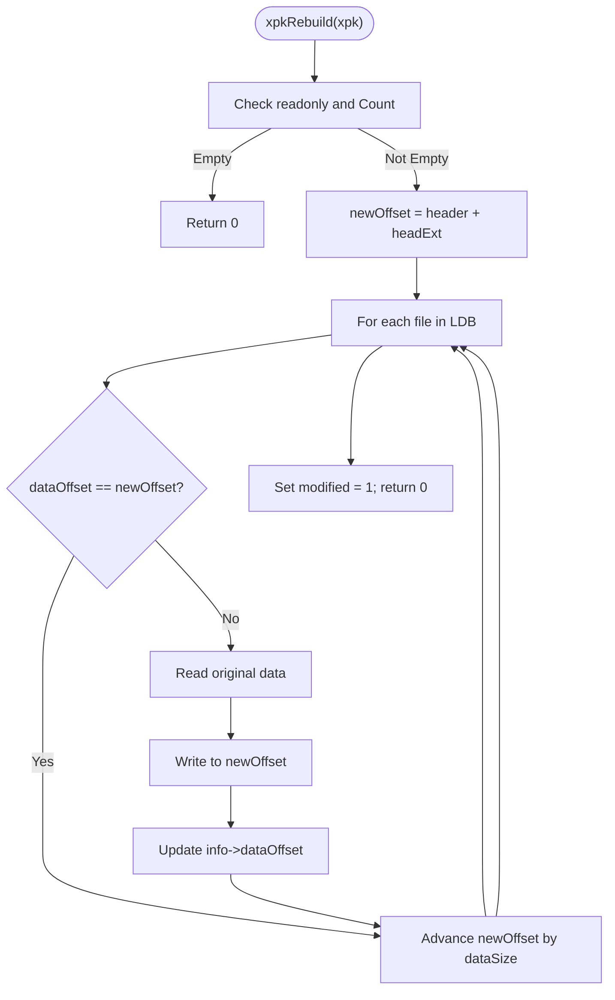
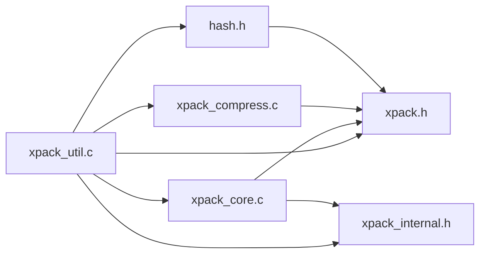

# Utility Functions

<cite>
**Referenced Files in This Document**
- [xpack_util.c](file://src/xpack_util.c)
- [xpack.h](file://src/xpack.h)
- [xpack_internal.h](file://src/xpack_internal.h)
- [xpack_core.c](file://src/xpack_core.c)
- [xpack_compress.c](file://src/xpack_compress.c)
- [hash.h](file://lib/xrt/lib/hash.h)
- [15_verify_operations.h](file://test/15_verify_operations.h)
- [14_statistics.h](file://test/14_statistics.h)
- [16_rebuild_operations.h](file://test/16_rebuild_operations.h)
- [test_framework.h](file://test/test_framework.h)
</cite>

## Table of Contents
1. [Introduction](#introduction)
2. [Project Structure](#project-structure)
3. [Core Components](#core-components)
4. [Architecture Overview](#architecture-overview)
5. [Detailed Component Analysis](#detailed-component-analysis)
6. [Dependency Analysis](#dependency-analysis)
7. [Performance Considerations](#performance-considerations)
8. [Troubleshooting Guide](#troubleshooting-guide)
9. [Conclusion](#conclusion)

## Introduction
This document focuses on xPack’s utility functions that enable verification, statistics collection, and package maintenance operations. It explains how the library validates package integrity, collects performance and diagnostic metrics, and performs rebuild operations to repair packages. Practical examples demonstrate package health monitoring, automated verification workflows, and maintenance scheduling. Technical details cover hash algorithms, statistical data structures, rebuild strategies, performance impact, optimization techniques for large packages, and integration with monitoring systems.

## Project Structure
The utility functions are implemented in the core library and exposed via public APIs. Supporting components include compression routing, hash computation, and internal data structures. Tests validate verification, statistics, and rebuild behaviors across multiple scenarios.

**Diagram sources**
- [xpack_util.c](file://src/xpack_util.c#L1-L361)
- [xpack.h](file://src/xpack.h#L1-L447)
- [xpack_internal.h](file://src/xpack_internal.h#L1-L145)
- [xpack_core.c](file://src/xpack_core.c#L1-L403)
- [xpack_compress.c](file://src/xpack_compress.c#L1-L200)
- [hash.h](file://lib/xrt/lib/hash.h#L594-L602)
- [15_verify_operations.h](file://test/15_verify_operations.h#L1-L371)
- [14_statistics.h](file://test/14_statistics.h#L1-L401)
- [16_rebuild_operations.h](file://test/16_rebuild_operations.h#L1-L459)
- [test_framework.h](file://test/test_framework.h#L1-L114)

**Section sources**
- [xpack_util.c](file://src/xpack_util.c#L1-L361)
- [xpack.h](file://src/xpack.h#L1-L447)
- [xpack_internal.h](file://src/xpack_internal.h#L1-L145)

## Core Components
- Verification: integrity checks using computed and stored hashes.
- Statistics: aggregate metrics across files and compression ratios.
- Traversal and filtering: iterate packages and match patterns.
- Batch operations: extract all or append directory contents.
- Rebuild: optimize data layout and fix fragmentation.

Key APIs:
- Verification: [xpkVerify](file://src/xpack.h#L435-L436), [xpkVerifyAll](file://src/xpack.h#L436-L436)
- Statistics: [xpkStatGet](file://src/xpack.h#L437-L437)
- Traversal: [xpkEach](file://src/xpack.h#L421-L421), [xpkEachMatch](file://src/xpack.h#L422-L422)
- Batch: [xpkExtractAll](file://src/xpack.h#L427-L427), [xpkAppendDir](file://src/xpack.h#L428-L428)
- Rebuild: [xpkRebuild](file://src/xpack.h#L438-L438)

**Section sources**
- [xpack.h](file://src/xpack.h#L431-L441)
- [xpack_util.c](file://src/xpack_util.c#L35-L361)

## Architecture Overview
The utility layer orchestrates operations on top of core package operations and compression routing. Hashes are computed using a high-performance 32-bit hash function and compared against stored values. Statistics are derived from file metadata arrays. Rebuild reorganizes data segments to contiguous offsets.

**Diagram sources**
- [xpack_util.c](file://src/xpack_util.c#L35-L52)
- [xpack_core.c](file://src/xpack_core.c#L147-L207)
- [xpack_compress.c](file://src/xpack_compress.c#L153-L194)
- [hash.h](file://lib/xrt/lib/hash.h#L594-L602)

## Detailed Component Analysis

### Verification System
Verification ensures integrity by recomputing the hash of extracted data and comparing it to the stored hash.

- Single-file verification:
  - Extracts raw data for a given position.
  - Computes 32-bit hash using [xrtHash32](file://lib/xrt/lib/hash.h#L599-L602).
  - Compares with stored [fileHash](file://src/xpack.h#L171-L171).
  - Returns 0 on success, -1 on mismatch.

- Full-package verification:
  - Iterates all positions and returns the first failing index or 0 if all pass.

- Hash algorithm:
  - Uses a high-performance 32-bit hash implementation ([NMHASH32X](file://lib/xrt/lib/hash.h#L547-L582)) with platform-specific optimizations.

**Diagram sources**
- [xpack_util.c](file://src/xpack_util.c#L35-L52)
- [xpack_core.c](file://src/xpack_core.c#L147-L207)
- [xpack_compress.c](file://src/xpack_compress.c#L153-L194)
- [hash.h](file://lib/xrt/lib/hash.h#L594-L602)

Practical examples:
- Single-file verification: [verify_single_file](file://test/15_verify_operations.h#L7-L24)
- Full-package verification: [verify_all_files](file://test/15_verify_operations.h#L26-L45)
- Mixed compression levels: [verify_different_levels](file://test/15_verify_operations.h#L87-L110)
- After rebuild: [verify_after_rebuild](file://test/15_verify_operations.h#L152-L179)

**Section sources**
- [xpack_util.c](file://src/xpack_util.c#L35-L64)
- [xpack_core.c](file://src/xpack_core.c#L147-L207)
- [hash.h](file://lib/xrt/lib/hash.h#L594-L602)
- [15_verify_operations.h](file://test/15_verify_operations.h#L7-L179)

### Statistics Collection Framework
Statistics provide aggregate metrics across files, including counts, sizes, and compression ratios.

- Metrics collected:
  - [xpkStat.fileCount](file://src/xpack.h#L302-L302)
  - [xpkStat.totalSize](file://src/xpack.h#L303-L303)
  - [xpkStat.packedSize](file://src/xpack.h#L304-L304)
  - [xpkStat.ratio](file://src/xpack.h#L305-L305)

- Computation:
  - Summarizes [fileSize](file://src/xpack.h#L171-L171) and [dataSize](file://src/xpack.h#L171-L171) from file metadata.
  - Ratio calculated as totalSize / packedSize.

**Diagram sources**
- [xpack_util.c](file://src/xpack_util.c#L70-L91)
- [xpack.h](file://src/xpack.h#L301-L306)

Practical examples:
- Basic statistics: [stats_basic](file://test/14_statistics.h#L7-L29)
- Multiple files and large files: [stats_multiple_files](file://test/14_statistics.h#L31-L56), [stats_large_files](file://test/14_statistics.h#L138-L163)
- After updates/removals: [stats_after_removal](file://test/14_statistics.h#L103-L136), [stats_after_update](file://test/14_statistics.h#L225-L263)

**Section sources**
- [xpack_util.c](file://src/xpack_util.c#L70-L91)
- [xpack.h](file://src/xpack.h#L299-L306)
- [14_statistics.h](file://test/14_statistics.h#L7-L163)

### Traversal and Pattern Matching
Utilities support iterating packages and filtering by path patterns.

- Iteration:
  - [xpkEach](file://src/xpack.h#L421-L421) iterates all entries and invokes a callback.
  - [xpkEachMatch](file://src/xpack.h#L422-L422) filters by pattern and path.

- Pattern matching:
  - Simple wildcard matching supports '*' and '?'.
  - Path extraction differs by pack type (Linux vs Win32).

**Diagram sources**
- [xpack_util.c](file://src/xpack_util.c#L136-L165)

Practical examples:
- Path-mode iteration: [verify_path_mode](file://test/15_verify_operations.h#L181-L205)
- Index-mode iteration: [verify_index_mode](file://test/15_verify_operations.h#L207-L233)

**Section sources**
- [xpack_util.c](file://src/xpack_util.c#L97-L165)
- [xpack.h](file://src/xpack.h#L419-L422)

### Batch Operations
Batch operations streamline bulk tasks such as extracting all files or appending directory contents.

- Extract all:
  - [xpkExtractAll](file://src/xpack.h#L427-L427) iterates entries and writes files to a target directory.
  - Creates parent directories as needed.

- Append directory:
  - [xpkAppendDir](file://src/xpack.h#L428-L428) scans a directory tree, filters by pattern, and appends files to the package.

**Diagram sources**
- [xpack_util.c](file://src/xpack_util.c#L227-L237)
- [xpack_core.c](file://src/xpack_core.c#L147-L207)

Practical examples:
- Extract all: [xpkExtractAll](file://src/xpack_util.c#L227-L237)
- Append directory: [xpkAppendDir](file://src/xpack_util.c#L280-L306)

**Section sources**
- [xpack_util.c](file://src/xpack_util.c#L171-L306)
- [xpack_core.c](file://src/xpack_core.c#L147-L207)

### Rebuild Operations
Rebuild optimizes package layout by reordering data segments to contiguous offsets, fixing fragmentation caused by updates/removals.

- Process:
  - Compute new data offset starting after header and extensions.
  - Iterate files; if dataOffset equals newOffset, advance; otherwise:
    - Read original data segment.
    - Write to newOffset.
    - Update file metadata [dataOffset](file://src/xpack.h#L171-L171).
  - Mark package as modified.

- Constraints:
  - Requires write mode; fails in readonly.
  - No effect on empty packages.

**Diagram sources**
- [xpack_util.c](file://src/xpack_util.c#L312-L360)

Practical examples:
- Empty package: [rebuild_empty_package](file://test/16_rebuild_operations.h#L7-L25)
- Single/multiple files: [rebuild_single_file](file://test/16_rebuild_operations.h#L27-L55), [rebuild_multiple_files](file://test/16_rebuild_operations.h#L57-L111)
- After removal/update: [rebuild_after_remove](file://test/16_rebuild_operations.h#L113-L145), [rebuild_after_update](file://test/16_rebuild_operations.h#L147-L189)
- Large files and mixed levels: [rebuild_large_files](file://test/16_rebuild_operations.h#L230-L283), [rebuild_mixed_levels](file://test/16_rebuild_operations.h#L387-L444)

**Section sources**
- [xpack_util.c](file://src/xpack_util.c#L312-L360)
- [16_rebuild_operations.h](file://test/16_rebuild_operations.h#L7-L283)

## Dependency Analysis
Utility functions depend on core operations, compression routing, and hash computation. Internal structures and macros bridge between public APIs and implementation details.

**Diagram sources**
- [xpack_util.c](file://src/xpack_util.c#L1-L361)
- [xpack_core.c](file://src/xpack_core.c#L1-L403)
- [xpack_compress.c](file://src/xpack_compress.c#L1-L200)
- [hash.h](file://lib/xrt/lib/hash.h#L594-L602)
- [xpack.h](file://src/xpack.h#L1-L447)
- [xpack_internal.h](file://src/xpack_internal.h#L1-L145)

**Section sources**
- [xpack_util.c](file://src/xpack_util.c#L1-L361)
- [xpack_core.c](file://src/xpack_core.c#L1-L403)
- [xpack_compress.c](file://src/xpack_compress.c#L1-L200)
- [hash.h](file://lib/xrt/lib/hash.h#L594-L602)
- [xpack.h](file://src/xpack.h#L1-L447)
- [xpack_internal.h](file://src/xpack_internal.h#L1-L145)

## Performance Considerations
- Hash computation:
  - 32-bit hash uses a high-performance implementation with vectorization and platform-specific optimizations ([hash.h](file://lib/xrt/lib/hash.h#L594-L602)).
- Compression routing:
  - Compression levels map to algorithms and strategies; fallback to no-compression on failure ([xpack_compress.c](file://src/xpack_compress.c#L20-L147)).
- Verification overhead:
  - Recomputes hash per file; suitable for periodic checks rather than frequent runs.
- Rebuild cost:
  - Reads/writes all data segments; best performed offline or during maintenance windows.
- Large packages:
  - Prefer batch operations and rebuild during idle periods.
  - Use statistics to monitor compression ratios and identify candidates for rebuild.

[No sources needed since this section provides general guidance]

## Troubleshooting Guide
Common issues and resolutions:
- Readonly mode errors:
  - Rebuild and append/update require write access; open in non-readonly mode.
- Invalid positions:
  - Ensure indices are within [0, Count) before verification or extraction.
- Compression failures:
  - Router falls back to no-compression; rebuild may be needed to optimize layout.
- Pattern matching:
  - Wildcards supported; ensure patterns match actual paths for the pack type.

Integration with monitoring:
- Use [xpkStatGet](file://src/xpack.h#L437-L437) to periodically collect metrics.
- Schedule [xpkVerifyAll](file://src/xpack.h#L436-L436) for integrity checks.
- Trigger [xpkRebuild](file://src/xpack.h#L438-L438) after significant updates/removals.

**Section sources**
- [xpack_util.c](file://src/xpack_util.c#L312-L360)
- [xpack_core.c](file://src/xpack_core.c#L234-L326)
- [xpack_compress.c](file://src/xpack_compress.c#L20-L147)
- [test_framework.h](file://test/test_framework.h#L1-L114)

## Conclusion
xPack’s utility functions provide robust mechanisms for verification, statistics collection, and package maintenance. Verification relies on recomputed hashes for integrity, statistics offer actionable insights into package composition, and rebuild optimizes data layout. By integrating these utilities into monitoring and maintenance workflows, teams can ensure reliable, efficient package operations across diverse environments and workloads.