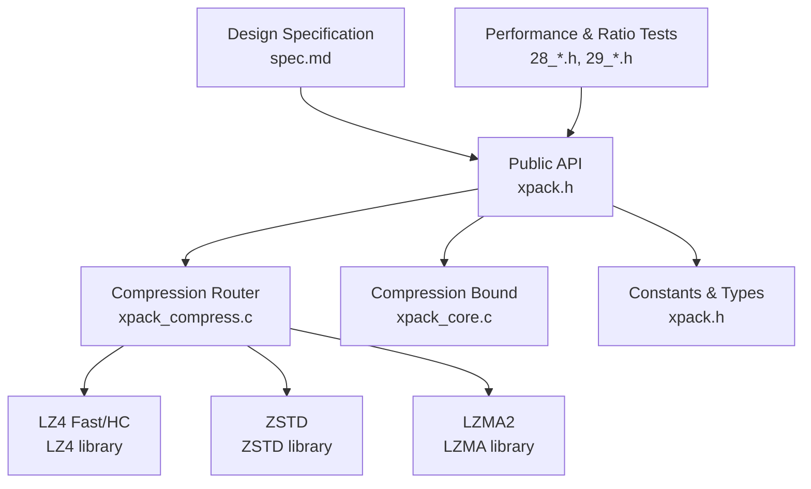
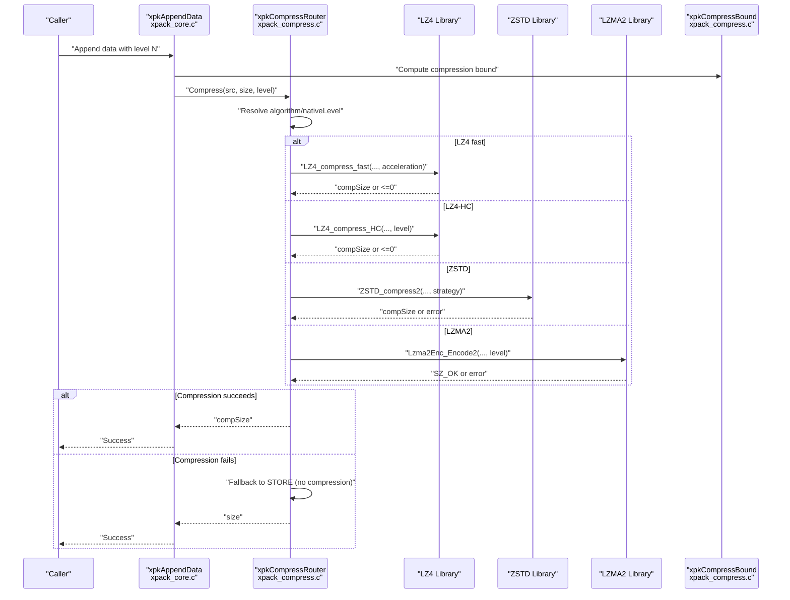
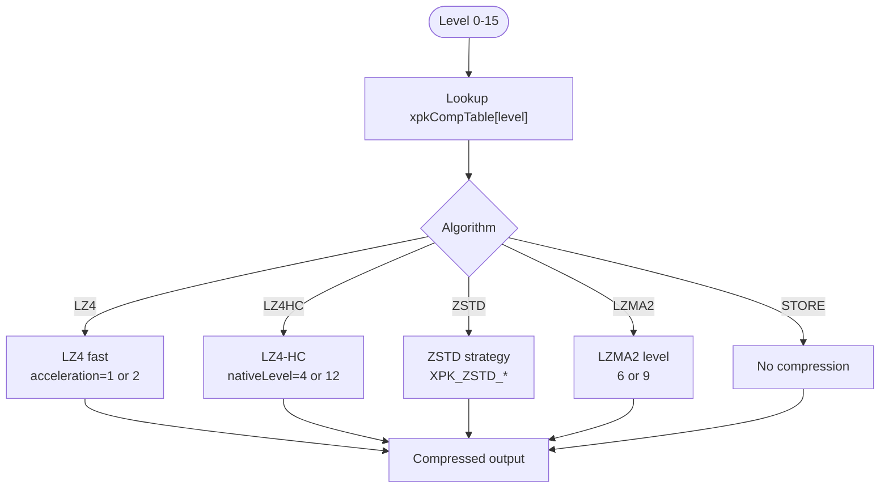
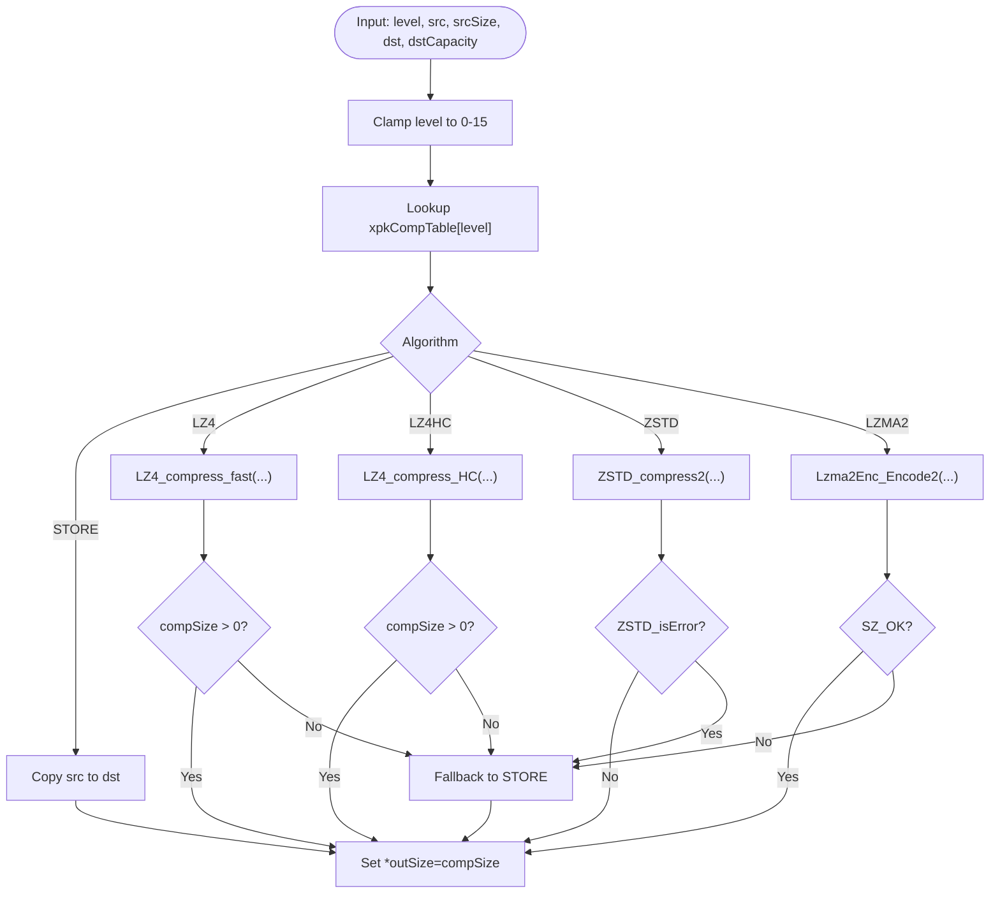
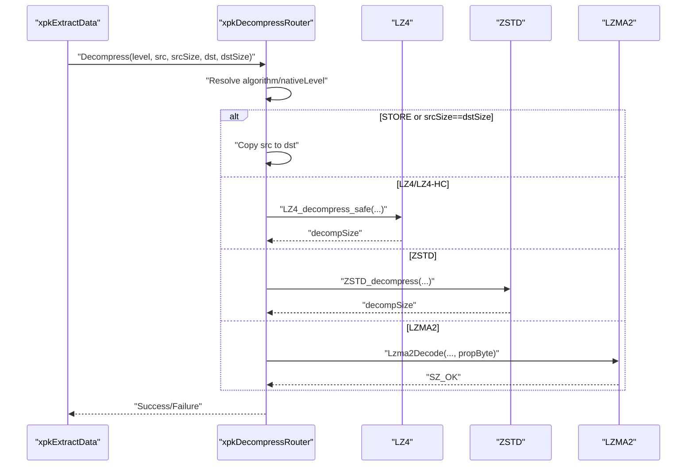
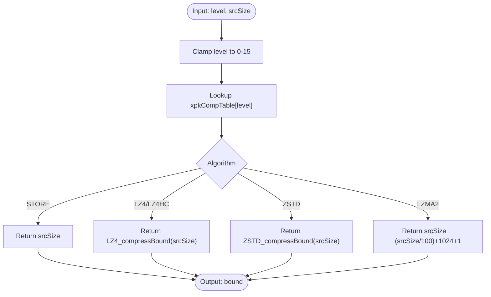
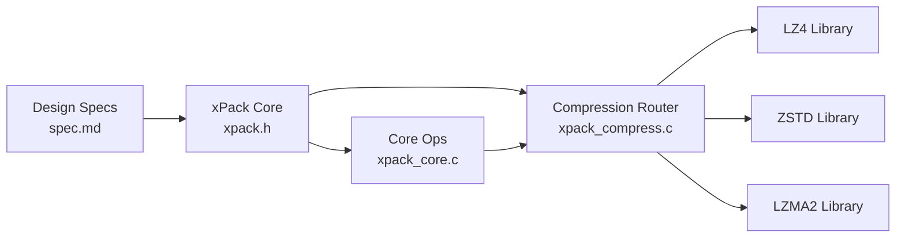

# Compression Level System

<cite>
**Referenced Files in This Document**
- [xpack.h](file://src/xpack.h)
- [xpack_compress.c](file://src/xpack_compress.c)
- [xpack_internal.h](file://src/xpack_internal.h)
- [xpack_core.c](file://src/xpack_core.c)
- [spec.md](file://docs/spec.md)
- [28_performance_benchmark.h](file://test/28_performance_benchmark.h)
- [29_compression_ratio.h](file://test/29_compression_ratio.h)
</cite>

## Table of Contents
1. [Introduction](#introduction)
2. [Project Structure](#project-structure)
3. [Core Components](#core-components)
4. [Architecture Overview](#architecture-overview)
5. [Detailed Component Analysis](#detailed-component-analysis)
6. [Dependency Analysis](#dependency-analysis)
7. [Performance Considerations](#performance-considerations)
8. [Troubleshooting Guide](#troubleshooting-guide)
9. [Conclusion](#conclusion)

## Introduction
This document explains xPack's compression level system with a strict monotonic behavior: higher compression levels always yield better compression ratios but slower processing speeds. The system maps 16 levels (0-15) to four algorithms (no compression, LZ4, LZ4-HC, ZSTD, LZMA2) with carefully chosen native parameters to maintain the monotonic property across all levels.

## Project Structure
The compression system spans several core files:
- Public API and constants: [xpack.h](file://src/xpack.h)
- Compression routing and fallback: [xpack_compress.c](file://src/xpack_compress.c)
- Internal structures and helpers: [xpack_internal.h](file://src/xpack_internal.h)
- Core package operations (compression bound calculation): [xpack_core.c](file://src/xpack_core.c)
- Design specification and monotonicity guarantees: [spec.md](file://docs/spec.md)
- Performance and ratio tests: [28_performance_benchmark.h](file://test/28_performance_benchmark.h), [29_compression_ratio.h](file://test/29_compression_ratio.h)

**Diagram sources**
- [xpack.h](file://src/xpack.h#L269-L286)
- [xpack_compress.c](file://src/xpack_compress.c#L20-L147)
- [xpack_core.c](file://src/xpack_core.c#L11-L12)
- [spec.md](file://docs/spec.md#L34-L76)

**Section sources**
- [xpack.h](file://src/xpack.h#L269-L286)
- [xpack_compress.c](file://src/xpack_compress.c#L20-L147)
- [xpack_core.c](file://src/xpack_core.c#L11-L12)
- [spec.md](file://docs/spec.md#L34-L76)

## Core Components
- Compression mapping table: Defines the algorithm and native parameter for each level 0-15.
- Compression router: Selects the appropriate algorithm and applies fallback on failure.
- Decompression router: Uses the same mapping to decompress data.
- Compression bound calculator: Estimates worst-case compressed size per algorithm.
- Monotonicity guarantee: Higher levels always improve compression ratio and degrade speed.

Key implementation references:
- Mapping table definition: [xpack.h](file://src/xpack.h#L269-L286)
- Router logic: [xpack_compress.c](file://src/xpack_compress.c#L20-L147)
- Bound calculation: [xpack_compress.c](file://src/xpack_compress.c#L227-L250)
- Monotonicity policy: [spec.md](file://docs/spec.md#L57-L60)

**Section sources**
- [xpack.h](file://src/xpack.h#L269-L286)
- [xpack_compress.c](file://src/xpack_compress.c#L20-L147)
- [xpack_compress.c](file://src/xpack_compress.c#L227-L250)
- [spec.md](file://docs/spec.md#L57-L60)

## Architecture Overview
The compression pipeline follows a deterministic mapping from user level to algorithm/native parameter, with robust fallback behavior.

**Diagram sources**
- [xpack_core.c](file://src/xpack_core.c#L39-L128)
- [xpack_compress.c](file://src/xpack_compress.c#L20-L147)
- [xpack_compress.c](file://src/xpack_compress.c#L227-L250)

## Detailed Component Analysis

### Compression Mapping Table (Levels 0-15)
The mapping table assigns algorithms and native parameters to each level while preserving strict monotonicity:
- Level 0: No compression (STORE)
- Levels 1-2: LZ4 fast with acceleration factor mapping
- Levels 3-4: LZ4-HC with native levels 4 and 12
- Levels 5-13: ZSTD strategies from fast to btultra2
- Levels 14-15: LZMA2 with levels 6 and 9

**Diagram sources**
- [xpack.h](file://src/xpack.h#L269-L286)

**Section sources**
- [xpack.h](file://src/xpack.h#L269-L286)

### Native Parameter Mapping Details
- LZ4 fast levels:
  - Level 1: LZ4 fast with acceleration factor 1
  - Level 2: LZ4 fast with acceleration factor 2 (64KB block hint)
- LZ4-HC levels:
  - Level 3: LZ4-HC with native level 4
  - Level 4: LZ4-HC with native level 12
- ZSTD strategies:
  - Levels 5-13 map to XPK_ZSTD_FAST through XPK_ZSTD_BTULTRA2
- LZMA2 levels:
  - Level 14: LZMA2 level 6
  - Level 15: LZMA2 level 9

These mappings ensure that increasing levels increase compression ratio and decrease speed monotonically.

**Section sources**
- [xpack.h](file://src/xpack.h#L53-L63)
- [xpack.h](file://src/xpack.h#L269-L286)

### Compression Router and Fallback Mechanisms
The router selects the algorithm and native parameter, then executes compression. On failure, it falls back to STORE (no compression) and returns success with original size.

**Diagram sources**
- [xpack_compress.c](file://src/xpack_compress.c#L20-L147)

**Section sources**
- [xpack_compress.c](file://src/xpack_compress.c#L20-L147)

### Decompression Router
The decompressor mirrors the mapping to select the correct algorithm. It also detects STORE by comparing compressed and uncompressed sizes.

**Diagram sources**
- [xpack_compress.c](file://src/xpack_compress.c#L153-L220)

**Section sources**
- [xpack_compress.c](file://src/xpack_compress.c#L153-L220)

### Compression Bound Calculations
The bound estimator provides worst-case compressed size for allocation safety:
- STORE: exact size
- LZ4/LZ4-HC: LZ4_compressBound
- ZSTD: ZSTD_compressBound
- LZMA2: conservative estimate including properties overhead

**Diagram sources**
- [xpack_compress.c](file://src/xpack_compress.c#L227-L250)

**Section sources**
- [xpack_compress.c](file://src/xpack_compress.c#L227-L250)

### Practical Level Assignments and Scenarios
- Real-time loading (levels 0-3):
  - Level 0: Uncompressed for fastest load
  - Level 1: LZ4 fast for minimal CPU overhead
  - Level 2: LZ4 fast with 64KB block acceleration
  - Level 3: LZ4-HC level 4 for slightly better ratio with acceptable speed
- General applications (levels 4-8):
  - Level 4: LZ4-HC level 12 for balanced ratio/speed
  - Levels 5-8: ZSTD strategies from fast to lazy2
- Software distribution (levels 9-12):
  - Levels 9-12: ZSTD strategies btlazy2 through btultra
- Archival storage (levels 13-15):
  - Levels 13-15: ZSTD btultra2 and LZMA2 levels 6/9 for maximum compression

Monotonicity ensures that moving from level N to N+1 improves compression ratio and reduces speed consistently.

**Section sources**
- [spec.md](file://docs/spec.md#L34-L76)
- [xpack.h](file://src/xpack.h#L269-L286)

## Dependency Analysis
The compression system depends on external libraries and maintains internal consistency:
- LZ4: fast and HC compression
- ZSTD: multiple strategies mapped to levels
- LZMA2: high-compression levels with property encoding
- xrt: hashing and file I/O utilities

**Diagram sources**
- [xpack.h](file://src/xpack.h#L269-L286)
- [xpack_compress.c](file://src/xpack_compress.c#L20-L147)
- [xpack_core.c](file://src/xpack_core.c#L11-L12)
- [spec.md](file://docs/spec.md#L34-L76)

**Section sources**
- [xpack.h](file://src/xpack.h#L269-L286)
- [xpack_compress.c](file://src/xpack_compress.c#L20-L147)
- [xpack_core.c](file://src/xpack_core.c#L11-L12)
- [spec.md](file://docs/spec.md#L34-L76)

## Performance Considerations
- LZ4 fast levels achieve very high compression/decompression speeds suitable for real-time scenarios.
- ZSTD strategies progressively increase compression ratio with decreasing speed.
- LZMA2 provides the highest compression ratios at significantly lower speeds.
- The monotonic property guarantees predictable trade-offs across levels.
- Tests demonstrate measurable differences in compression ratios and performance across levels.

**Section sources**
- [spec.md](file://docs/spec.md#L34-L76)
- [28_performance_benchmark.h](file://test/28_performance_benchmark.h#L299-L317)
- [29_compression_ratio.h](file://test/29_compression_ratio.h#L15-L36)

## Troubleshooting Guide
Common issues and resolutions:
- Compression failure:
  - Symptom: Compression returns error or produces no output
  - Behavior: Router falls back to STORE (no compression)
  - Resolution: Verify destination capacity meets bound estimation; retry with lower level
- Decompression failure:
  - Symptom: Decompression returns error or size mismatch
  - Behavior: Operation fails with error code
  - Resolution: Ensure data integrity; verify level matches stored metadata
- Allocation failures:
  - Symptom: Memory allocation errors during compression
  - Behavior: Router returns failure
  - Resolution: Increase available memory or reduce input size

**Section sources**
- [xpack_compress.c](file://src/xpack_compress.c#L45-L50)
- [xpack_compress.c](file://src/xpack_compress.c#L61-L67)
- [xpack_compress.c](file://src/xpack_compress.c#L85-L91)
- [xpack_compress.c](file://src/xpack_compress.c#L132-L138)
- [xpack_core.c](file://src/xpack_core.c#L72-L82)

## Conclusion
xPack’s compression level system provides a strict monotonic balance between compression ratio and speed across 16 levels. The mapping table and router ensure predictable behavior, while fallback mechanisms maintain reliability. The design enables tailored compression strategies for diverse use cases, from real-time loading to archival storage.