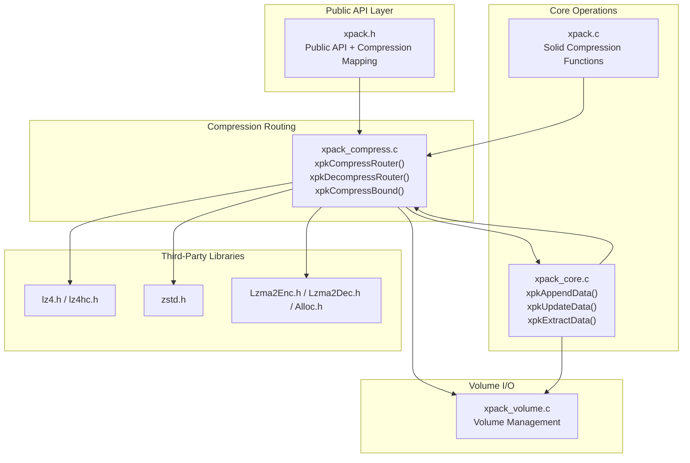
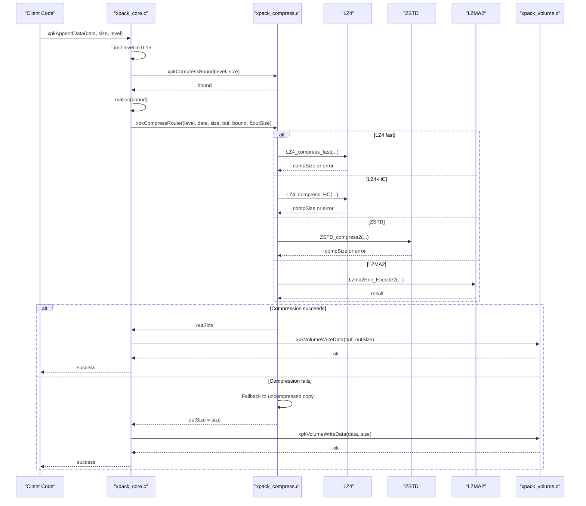
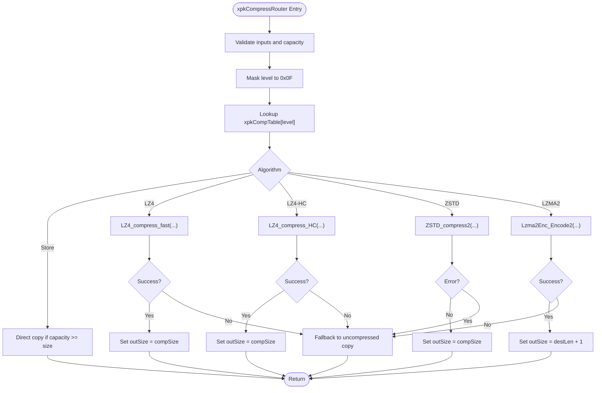
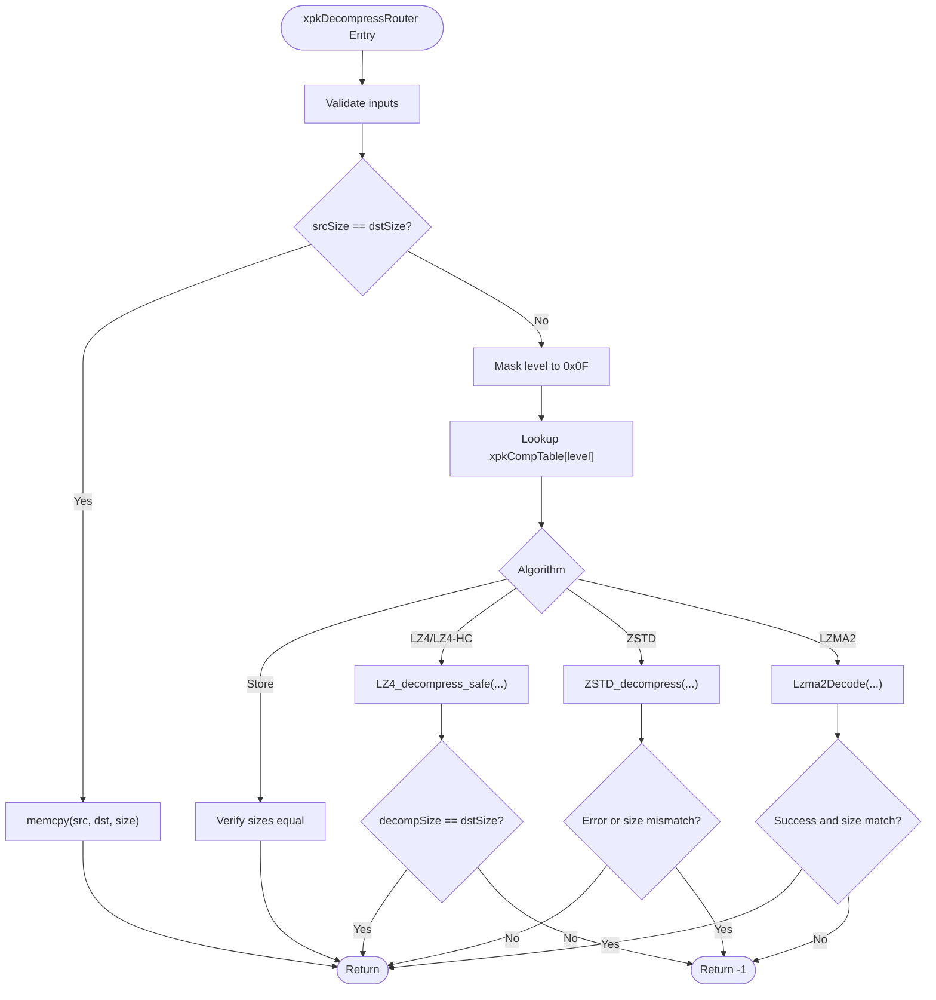
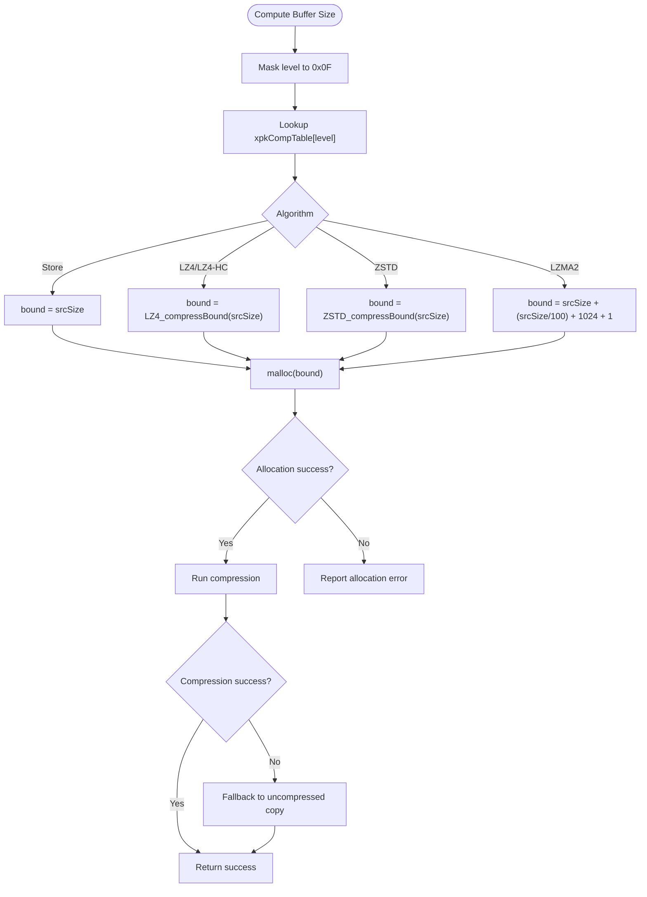
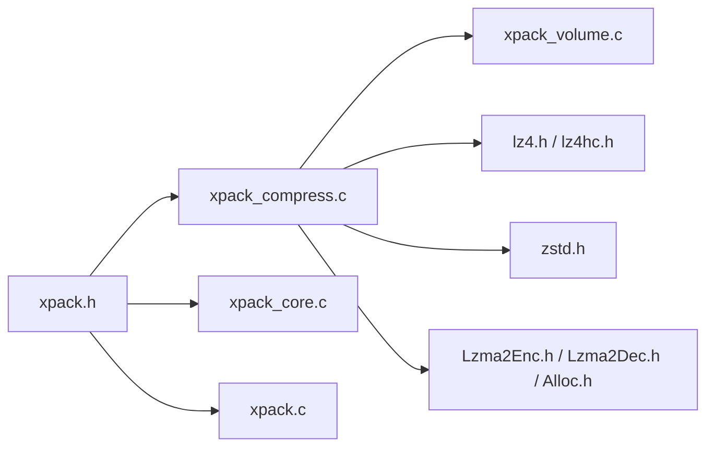

# Compression Routing System

<cite>
**Referenced Files in This Document**
- [xpack.h](file://src/xpack.h)
- [xpack_compress.c](file://src/xpack_compress.c)
- [xpack_internal.h](file://src/xpack_internal.h)
- [xpack_core.c](file://src/xpack_core.c)
- [xpack_volume.c](file://src/xpack_volume.c)
- [xpack.c](file://src/xpack.c)
- [lz4.h](file://lib/lz4/lz4.h)
- [lz4hc.h](file://lib/lz4/lz4hc.h)
- [zstd.h](file://lib/zstd/zstd.h)
- [Lzma2Enc.h](file://lib/lzma/Lzma2Enc.h)
- [Lzma2Dec.h](file://lib/lzma/Lzma2Dec.h)
- [Alloc.h](file://lib/lzma/Alloc.h)
</cite>

## Table of Contents
1. [Introduction](#introduction)
2. [Project Structure](#project-structure)
3. [Core Components](#core-components)
4. [Architecture Overview](#architecture-overview)
5. [Detailed Component Analysis](#detailed-component-analysis)
6. [Dependency Analysis](#dependency-analysis)
7. [Performance Considerations](#performance-considerations)
8. [Troubleshooting Guide](#troubleshooting-guide)
9. [Conclusion](#conclusion)

## Introduction
This document provides comprehensive technical documentation for xPack's compression routing system, focusing on the `xpkCompressRouter()` and `xpkDecompressRouter()` functions. It explains the level masking mechanism, compression mapping table lookup, algorithm-specific execution paths, fallback behavior, compression bound calculations, memory allocation strategies, and integration with xPack's core functionality. Practical examples illustrate the routing flow from API calls through compression selection to algorithm execution, error propagation patterns, and performance optimization techniques.

## Project Structure
The compression routing system resides primarily in the compression module and integrates with the core package operations, volume handling, and solid compression features. The key files are:

- Compression routing and bounds calculation: [xpack_compress.c](file://src/xpack_compress.c)
- Public API and compression mapping table: [xpack.h](file://src/xpack.h)
- Internal declarations and helpers: [xpack_internal.h](file://src/xpack_internal.h)
- Core operations (append/update/extract): [xpack_core.c](file://src/xpack_core.c)
- Solid compression and block handling: [xpack.c](file://src/xpack.c)
- Volume I/O operations: [xpack_volume.c](file://src/xpack_volume.c)
- Third-party compression libraries: [lz4.h](file://lib/lz4/lz4.h), [lz4hc.h](file://lib/lz4/lz4hc.h), [zstd.h](file://lib/zstd/zstd.h), [Lzma2Enc.h](file://lib/lzma/Lzma2Enc.h), [Lzma2Dec.h](file://lib/lzma/Lzma2Dec.h), [Alloc.h](file://lib/lzma/Alloc.h)

**Diagram sources**
- [xpack.h](file://src/xpack.h#L44-L286)
- [xpack_compress.c](file://src/xpack_compress.c#L19-L250)
- [xpack_core.c](file://src/xpack_core.c#L39-L128)
- [xpack.c](file://src/xpack.c#L427-L556)
- [xpack_volume.c](file://src/xpack_volume.c#L178-L218)
- [lz4.h](file://lib/lz4/lz4.h)
- [lz4hc.h](file://lib/lz4/lz4hc.h)
- [zstd.h](file://lib/zstd/zstd.h)
- [Lzma2Enc.h](file://lib/lzma/Lzma2Enc.h)
- [Lzma2Dec.h](file://lib/lzma/Lzma2Dec.h)
- [Alloc.h](file://lib/lzma/Alloc.h)

**Section sources**
- [xpack.h](file://src/xpack.h#L44-L286)
- [xpack_compress.c](file://src/xpack_compress.c#L19-L250)
- [xpack_core.c](file://src/xpack_core.c#L39-L128)
- [xpack.c](file://src/xpack.c#L427-L556)
- [xpack_volume.c](file://src/xpack_volume.c#L178-L218)

## Core Components
This section focuses on the compression routing functions and supporting structures.

- Level masking and mapping table:
  - Level masking: `level = level & 0x0F` ensures the compression level is safely constrained to 0-15, preventing overflow and invalid indices.
  - Compression mapping table: A static table maps each level (0-15) to an algorithm type and native level parameter. This enables deterministic selection across LZ4, LZ4-HC, ZSTD, and LZMA2.

- Compression router (`xpkCompressRouter`):
  - Validates inputs and capacity.
  - Selects algorithm via mapping table.
  - Executes algorithm-specific compression with fallback to uncompressed mode on failure.
  - Returns compressed size and handles output buffer sizing.

- Decompression router (`xpkDecompressRouter`):
  - Detects uncompressed data by comparing sizes.
  - Uses mapping table to select algorithm.
  - Executes algorithm-specific decompression with strict size verification.

- Compression bound calculator (`xpkCompressBound`):
  - Provides worst-case upper bound for compressed size per algorithm.
  - Used by core operations to pre-allocate buffers safely.

**Section sources**
- [xpack.h](file://src/xpack.h#L269-L286)
- [xpack_compress.c](file://src/xpack_compress.c#L20-L147)
- [xpack_compress.c](file://src/xpack_compress.c#L153-L220)
- [xpack_compress.c](file://src/xpack_compress.c#L227-L250)

## Architecture Overview
The compression routing system sits between the public API and third-party compression libraries. It centralizes algorithm selection, safety checks, and fallback behavior, while core operations rely on it for memory allocation and buffer sizing.

**Diagram sources**
- [xpack_core.c](file://src/xpack_core.c#L39-L128)
- [xpack_compress.c](file://src/xpack_compress.c#L20-L147)
- [xpack_volume.c](file://src/xpack_volume.c#L178-L218)

## Detailed Component Analysis

### Level Masking and Safety
- Purpose: Prevent out-of-bounds access to the compression mapping table and ensure deterministic behavior regardless of higher bits in the level parameter.
- Implementation: `level = level & 0x0F` masks the level to 4 bits (0-15).
- Effect: Guarantees that `xpkCompTable[level]` is always valid and that the selected algorithm/native level are within supported ranges.

**Section sources**
- [xpack_compress.c](file://src/xpack_compress.c#L27-L28)
- [xpack.h](file://src/xpack.h#L269-L286)

### Compression Mapping Table Lookup
- Structure: Each entry maps a logical level (0-15) to `(algorithm, nativeLevel)`.
- Supported algorithms:
  - Store (no compression)
  - LZ4 fast and LZ4 fast with larger blocks
  - LZ4-HC with specific levels
  - ZSTD with strategy constants
  - LZMA2 with specific levels
- Selection flow: The router dereferences `xpkCompTable[level]` to obtain the algorithm and native level, then branches accordingly.

**Section sources**
- [xpack.h](file://src/xpack.h#L269-L286)
- [xpack_compress.c](file://src/xpack_compress.c#L28-L30)

### Algorithm-Specific Compression Execution
- Store (no compression):
  - Direct copy if destination capacity allows.
  - Returns uncompressed size.
- LZ4 fast:
  - Uses `LZ4_compress_fast` with acceleration derived from native level.
  - On failure, falls back to uncompressed copy.
- LZ4-HC:
  - Uses `LZ4_compress_HC` with the configured native level.
  - On failure, falls back to uncompressed copy.
- ZSTD:
  - Creates a compression context, disables checksum, sets strategy via native level, and compresses.
  - On error, falls back to uncompressed copy.
- LZMA2:
  - Creates encoder, sets properties, writes a property byte, then encodes.
  - On failure, falls back to uncompressed copy.

**Diagram sources**
- [xpack_compress.c](file://src/xpack_compress.c#L20-L147)

**Section sources**
- [xpack_compress.c](file://src/xpack_compress.c#L38-L147)

### Decompression Router and Uncompressed Detection
- Uncompressed detection: If `srcSize == dstSize`, treat as uncompressed and copy directly.
- Algorithm selection mirrors compression mapping.
- Strict size verification: Decompression must produce exactly `dstSize` bytes; otherwise, it fails.
- LZ4/LZ4-HC share the same decompressor; ZSTD and LZMA2 use their respective decoders.

**Diagram sources**
- [xpack_compress.c](file://src/xpack_compress.c#L153-L220)

**Section sources**
- [xpack_compress.c](file://src/xpack_compress.c#L153-L220)

### Fallback Mechanisms and Error Propagation
- Compression failure fallback:
  - If any algorithm returns an error or produces non-positive output, the router copies the original data into the destination buffer and sets `outSize = srcSize`.
  - Capacity checks ensure the destination can accommodate uncompressed data.
- Error propagation:
  - Core operations call `xpkCompressRouter` and propagate errors via `xpkSetError` with specific codes for compression failures.
  - Decompression failures are handled similarly in extraction operations.

**Section sources**
- [xpack_compress.c](file://src/xpack_compress.c#L45-L50)
- [xpack_compress.c](file://src/xpack_compress.c#L61-L67)
- [xpack_compress.c](file://src/xpack_compress.c#L85-L91)
- [xpack_compress.c](file://src/xpack_compress.c#L132-L138)
- [xpack_core.c](file://src/xpack_core.c#L78-L82)
- [xpack_core.c](file://src/xpack_core.c#L194-L200)

### Compression Bound Calculation and Memory Allocation
- Purpose: Estimate maximum compressed size to pre-allocate buffers safely without reallocation overhead.
- Bounds:
  - Store: `srcSize`
  - LZ4/LZ4-HC: Use `LZ4_compressBound(srcSize)`
  - ZSTD: Use `ZSTD_compressBound(srcSize)`
  - LZMA2: Conservative estimate including a property byte and overhead.
- Allocation strategy:
  - Core operations compute `compBound = xpkCompressBound(level, size)` and allocate a buffer of that size.
  - On allocation failure, an error is reported and the operation aborts.
  - On compression failure, the router falls back to uncompressed mode and still returns success.

**Diagram sources**
- [xpack_compress.c](file://src/xpack_compress.c#L227-L250)
- [xpack_core.c](file://src/xpack_core.c#L69-L83)

**Section sources**
- [xpack_compress.c](file://src/xpack_compress.c#L227-L250)
- [xpack_core.c](file://src/xpack_core.c#L69-L83)

### Integration with xPack Core Functionality
- Append operations:
  - Compute compression bound, allocate buffer, compress via router, write to volume, update LDB metadata.
- Update operations:
  - Similar flow; if new compressed data fits, overwrite in place; otherwise append to end and leave a hole requiring rebuild.
- Extract operations:
  - Read compressed data from volume, allocate raw buffer sized by stored file size, decompress via router.
- Solid compression:
  - Uses dedicated solid functions that compress a block and cache decompressed data for indexed access.

**Section sources**
- [xpack_core.c](file://src/xpack_core.c#L39-L128)
- [xpack_core.c](file://src/xpack_core.c#L234-L326)
- [xpack_core.c](file://src/xpack_core.c#L147-L207)
- [xpack.c](file://src/xpack.c#L427-L556)

### Practical Routing Flow Example
- API call: `xpkAppendData(xpk, data, size, level)`
- Steps:
  1. Limit level to 0-15.
  2. Compute `compBound = xpkCompressBound(level, size)`.
  3. Allocate buffer.
  4. Call `xpkCompressRouter(level, data, size, buf, compBound, &outSize)`.
  5. Write compressed data via volume manager.
  6. Update LDB with offsets, sizes, and flags.
- Error handling:
  - Allocation failure: error code for buffer allocation.
  - Compression failure: fallback to uncompressed mode; still succeeds.
  - Decompression failure: error code for extraction.

**Section sources**
- [xpack_core.c](file://src/xpack_core.c#L39-L128)
- [xpack_compress.c](file://src/xpack_compress.c#L20-L147)
- [xpack_volume.c](file://src/xpack_volume.c#L178-L218)

## Dependency Analysis
The compression routing system depends on:
- Public API definitions and mapping table in [xpack.h](file://src/xpack.h)
- Router implementation in [xpack_compress.c](file://src/xpack_compress.c)
- Core operations in [xpack_core.c](file://src/xpack_core.c)
- Solid compression in [xpack.c](file://src/xpack.c)
- Volume I/O in [xpack_volume.c](file://src/xpack_volume.c)
- Third-party libraries for each algorithm

**Diagram sources**
- [xpack.h](file://src/xpack.h#L44-L286)
- [xpack_compress.c](file://src/xpack_compress.c#L19-L250)
- [xpack_core.c](file://src/xpack_core.c#L39-L128)
- [xpack.c](file://src/xpack.c#L427-L556)
- [xpack_volume.c](file://src/xpack_volume.c#L178-L218)
- [lz4.h](file://lib/lz4/lz4.h)
- [lz4hc.h](file://lib/lz4/lz4hc.h)
- [zstd.h](file://lib/zstd/zstd.h)
- [Lzma2Enc.h](file://lib/lzma/Lzma2Enc.h)
- [Lzma2Dec.h](file://lib/lzma/Lzma2Dec.h)
- [Alloc.h](file://lib/lzma/Alloc.h)

**Section sources**
- [xpack.h](file://src/xpack.h#L44-L286)
- [xpack_compress.c](file://src/xpack_compress.c#L19-L250)
- [xpack_core.c](file://src/xpack_core.c#L39-L128)
- [xpack.c](file://src/xpack.c#L427-L556)
- [xpack_volume.c](file://src/xpack_volume.c#L178-L218)

## Performance Considerations
- Level masking cost: Minimal overhead; performed once per compression call.
- Bound estimation: Accurate bounds reduce reallocation attempts and improve throughput.
- Fallback to uncompressed: Ensures robustness; minimal performance impact for small or incompressible data.
- LZ4 acceleration: Using larger blocks for fast LZ4 can increase CPU utilization for better speed on large buffers.
- ZSTD strategy selection: Choosing appropriate strategies balances compression ratio and speed.
- LZMA2 overhead: Property byte and conservative bounds add minor overhead but enable reliable decompression.
- Solid compression: Compresses entire block once, reducing per-file overhead for many small files.

[No sources needed since this section provides general guidance]

## Troubleshooting Guide
Common issues and resolutions:
- Compression failure:
  - Symptom: Router returns error or produces non-positive output.
  - Resolution: Router automatically falls back to uncompressed mode; verify destination capacity and retry.
- Decompression failure:
  - Symptom: Extract returns error or size mismatch.
  - Resolution: Verify data integrity, check for corruption, and re-extract.
- Allocation failure:
  - Symptom: Core operations fail to allocate compression/decompression buffers.
  - Resolution: Free memory, reduce compression level, or use smaller chunks.
- Volume write/read errors:
  - Symptom: Volume manager reports write/read failures.
  - Resolution: Check disk space, permissions, and volume file availability.
- Solid mode limitations:
  - Symptom: Updates or removals fail in solid mode.
  - Resolution: Disable solid mode or rebuild the archive.

**Section sources**
- [xpack_compress.c](file://src/xpack_compress.c#L45-L50)
- [xpack_compress.c](file://src/xpack_compress.c#L61-L67)
- [xpack_compress.c](file://src/xpack_compress.c#L85-L91)
- [xpack_compress.c](file://src/xpack_compress.c#L132-L138)
- [xpack_core.c](file://src/xpack_core.c#L78-L82)
- [xpack_core.c](file://src/xpack_core.c#L194-L200)
- [xpack_volume.c](file://src/xpack_volume.c#L178-L218)

## Conclusion
xPack’s compression routing system provides a robust, algorithm-agnostic pipeline for compressing and decompressing data. Its design emphasizes safety via level masking, deterministic algorithm selection through a mapping table, and resilient fallback behavior. The system integrates seamlessly with core operations, solid compression, and volume handling, offering predictable performance and strong error propagation. By leveraging accurate compression bounds and careful memory management, it achieves efficient storage utilization while maintaining reliability across diverse data patterns.