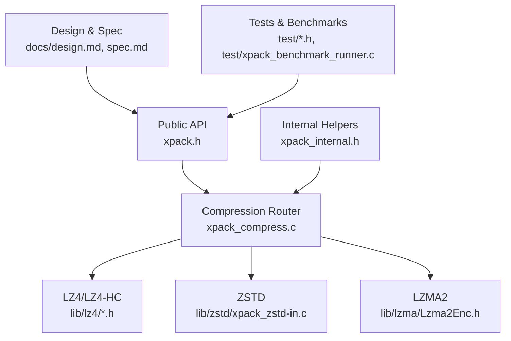
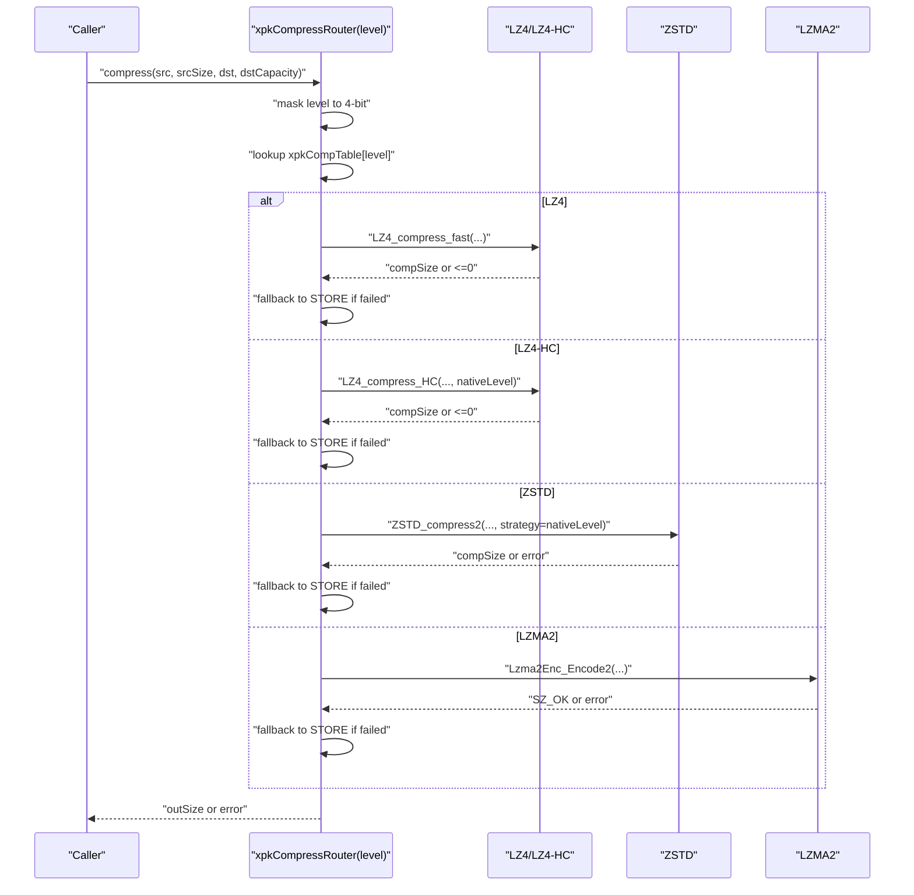
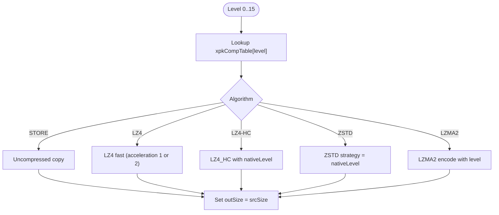
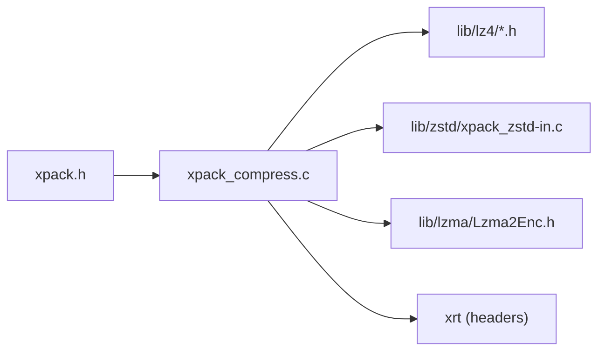

# Compression System

<cite>
**Referenced Files in This Document**
- [xpack_compress.c](file://src/xpack_compress.c)
- [xpack.h](file://src/xpack.h)
- [xpack_internal.h](file://src/xpack_internal.h)
- [xpack_zstd-in.c](file://lib/zstd/xpack_zstd-in.c)
- [lz4hc.h](file://lib/lz4/lz4hc.h)
- [Lzma2Enc.h](file://lib/lzma/Lzma2Enc.h)
- [design.md](file://docs/design.md)
- [spec.md](file://docs/spec.md)
- [28_performance_benchmark.h](file://test/28_performance_benchmark.h)
- [29_compression_ratio.h](file://test/29_compression_ratio.h)
- [xpack_benchmark_runner.c](file://test/xpack_benchmark_runner.c)
- [07_compression_data_patterns.h](file://test/07_compression_data_patterns.h)
- [08_compression_accuracy.h](file://test/08_compression_accuracy.h)
</cite>

## Table of Contents
1. [Introduction](#introduction)
2. [Project Structure](#project-structure)
3. [Core Components](#core-components)
4. [Architecture Overview](#architecture-overview)
5. [Detailed Component Analysis](#detailed-component-analysis)
6. [Dependency Analysis](#dependency-analysis)
7. [Performance Considerations](#performance-considerations)
8. [Troubleshooting Guide](#troubleshooting-guide)
9. [Conclusion](#conclusion)
10. [Appendices](#appendices)

## Introduction
This document explains xPack’s multi-algorithm compression architecture in Ver7, focusing on the 0–15 compression level system with strict monotonic behavior, the compression mapping table, and algorithm selection criteria. It covers LZ4’s high-speed compression, ZSTD’s balanced-to-high-compression approach, and the rationale for removing LZMA2/XZ in Ver7. It also provides performance benchmarks, compression ratio comparisons, scenario-based recommendations, and practical examples for selecting compression levels across different file types and use cases.

## Project Structure
The compression system spans several modules:
- Public API and data structures: [xpack.h](file://src/xpack.h)
- Internal routing and helpers: [xpack_internal.h](file://src/xpack_internal.h)
- Compression router and bounds estimation: [xpack_compress.c](file://src/xpack_compress.c)
- ZSTD integration (single-file optimized): [xpack_zstd-in.c](file://lib/zstd/xpack_zstd-in.c)
- LZ4 high-compression header: [lz4hc.h](file://lib/lz4/lz4hc.h)
- LZMA2 encoder interface: [Lzma2Enc.h](file://lib/lzma/Lzma2Enc.h)
- Design and specification documents: [design.md](file://docs/design.md), [spec.md](file://docs/spec.md)
- Tests and benchmarks: [28_performance_benchmark.h](file://test/28_performance_benchmark.h), [29_compression_ratio.h](file://test/29_compression_ratio.h), [xpack_benchmark_runner.c](file://test/xpack_benchmark_runner.c), [07_compression_data_patterns.h](file://test/07_compression_data_patterns.h), [08_compression_accuracy.h](file://test/08_compression_accuracy.h)

**Diagram sources**
- [xpack.h](file://src/xpack.h#L269-L286)
- [xpack_compress.c](file://src/xpack_compress.c#L20-L147)
- [xpack_zstd-in.c](file://lib/zstd/xpack_zstd-in.c#L1-L152)
- [lz4hc.h](file://lib/lz4/lz4hc.h#L1-L422)
- [Lzma2Enc.h](file://lib/lzma/Lzma2Enc.h#L1-L59)
- [xpack_internal.h](file://src/xpack_internal.h#L97-L126)
- [design.md](file://docs/design.md#L66-L92)
- [spec.md](file://docs/spec.md#L400-L432)

**Section sources**
- [xpack.h](file://src/xpack.h#L269-L286)
- [xpack_compress.c](file://src/xpack_compress.c#L20-L147)
- [xpack_internal.h](file://src/xpack_internal.h#L97-L126)
- [xpack_zstd-in.c](file://lib/zstd/xpack_zstd-in.c#L1-L152)
- [lz4hc.h](file://lib/lz4/lz4hc.h#L1-L422)
- [Lzma2Enc.h](file://lib/lzma/Lzma2Enc.h#L1-L59)
- [design.md](file://docs/design.md#L66-L92)
- [spec.md](file://docs/spec.md#L400-L432)

## Core Components
- Compression mapping table: Defines how each of the 16 levels (0–15) maps to an algorithm and a native parameter.
- Compression router: Routes compression/decompression based on the selected level and algorithm.
- Bounds estimator: Provides upper bounds for compressed size per algorithm.
- ZSTD integration: Single-file optimized build with safety and performance tweaks.
- LZ4/LZ4-HC: Fast and high-compression variants with acceleration modes.
- LZMA2: Legacy algorithm retained for highest compression scenarios.

Key elements:
- Mapping table: [xpack.h](file://src/xpack.h#L269-L286)
- Router: [xpack_compress.c](file://src/xpack_compress.c#L20-L147)
- Bounds: [xpack_compress.c](file://src/xpack_compress.c#L227-L250)
- ZSTD integration: [xpack_zstd-in.c](file://lib/zstd/xpack_zstd-in.c#L1-L152)
- LZ4-HC constants: [lz4hc.h](file://lib/lz4/lz4hc.h#L47-L50)
- LZMA2 interface: [Lzma2Enc.h](file://lib/lzma/Lzma2Enc.h#L1-L59)

**Section sources**
- [xpack.h](file://src/xpack.h#L269-L286)
- [xpack_compress.c](file://src/xpack_compress.c#L20-L147)
- [xpack_compress.c](file://src/xpack_compress.c#L227-L250)
- [xpack_zstd-in.c](file://lib/zstd/xpack_zstd-in.c#L1-L152)
- [lz4hc.h](file://lib/lz4/lz4hc.h#L47-L50)
- [Lzma2Enc.h](file://lib/lzma/Lzma2Enc.h#L1-L59)

## Architecture Overview
The compression system routes each level to a specific algorithm and native parameter, then executes compression or decompression accordingly. The router enforces capacity checks and fallback to uncompressed when compression fails. ZSTD is configured to disable checksums and apply strategy parameters mapped from the table.

**Diagram sources**
- [xpack_compress.c](file://src/xpack_compress.c#L20-L147)
- [xpack.h](file://src/xpack.h#L269-L286)

**Section sources**
- [xpack_compress.c](file://src/xpack_compress.c#L20-L147)
- [xpack.h](file://src/xpack.h#L269-L286)

## Detailed Component Analysis

### Compression Level Mapping Table
The mapping table defines strict monotonic behavior across 16 levels:
- Level 0: Store (no compression)
- Levels 1–4: LZ4 family (LZ4 fast, LZ4-HC)
- Levels 5–13: ZSTD strategies (from fast to ultra)
- Levels 14–15: LZMA2 (removed in Ver7 design, kept for completeness)

**Diagram sources**
- [xpack.h](file://src/xpack.h#L269-L286)
- [xpack_compress.c](file://src/xpack_compress.c#L20-L147)

**Section sources**
- [xpack.h](file://src/xpack.h#L269-L286)
- [design.md](file://docs/design.md#L66-L92)
- [spec.md](file://docs/spec.md#L400-L432)

### Algorithm Selection Criteria and Trade-offs
- LZ4: Extremely fast compression and decompression; suitable for real-time loading and frequent reads.
- ZSTD: Balanced to high compression with tunable strategies; good default for general-purpose packages.
- LZMA2: Highest compression ratio but slowest; removed from Ver7’s default mapping to simplify the system.

Trade-offs:
- Speed vs. ratio: Higher levels generally reduce ratio improvement per unit of speed cost.
- Decompression speed: LZ4 maintains the fastest decompression; ZSTD varies by strategy; LZMA2 has the slowest decompression.

**Section sources**
- [design.md](file://docs/design.md#L27-L55)
- [spec.md](file://docs/spec.md#L34-L76)

### LZ4 High-Speed Compression
- Fast acceleration modes: The router selects acceleration based on nativeLevel thresholds for LZ4 fast.
- LZ4-HC levels: Defined constants indicate typical ranges; higher levels increase compression ratio at the cost of speed.
- Fallback behavior: On compression failure, the router falls back to uncompressed mode.

Implementation highlights:
- Acceleration selection: [xpack_compress.c](file://src/xpack_compress.c#L40-L44)
- LZ4-HC constants: [lz4hc.h](file://lib/lz4/lz4hc.h#L47-L50)
- Failure fallback: [xpack_compress.c](file://src/xpack_compress.c#L45-L51)

**Section sources**
- [xpack_compress.c](file://src/xpack_compress.c#L40-L51)
- [lz4hc.h](file://lib/lz4/lz4hc.h#L47-L50)

### ZSTD Balanced Approach
- Strategy mapping: Native levels correspond to ZSTD strategies (fast, dfast, greedy, lazy, etc.).
- Performance tuning: ZSTD is configured to disable checksums and apply strategy parameters.
- Bounds estimation: Uses ZSTD_compressBound for worst-case estimates.

Implementation highlights:
- Strategy parameterization: [xpack_compress.c](file://src/xpack_compress.c#L78-L82)
- Strategy constants: [xpack.h](file://src/xpack.h#L53-L63)
- Bounds: [xpack_compress.c](file://src/xpack_compress.c#L239-L240)

**Section sources**
- [xpack_compress.c](file://src/xpack_compress.c#L78-L82)
- [xpack.h](file://src/xpack.h#L53-L63)
- [xpack_compress.c](file://src/xpack_compress.c#L239-L240)
- [xpack_zstd-in.c](file://lib/zstd/xpack_zstd-in.c#L1-L152)

### LZMA2/XZ Removal Rationale in Ver7
- Simplified architecture: Reduces external dependencies and complexity.
- Performance focus: LZ4 and ZSTD cover most real-world scenarios; LZMA2 reserved for extreme compression needs.
- Backward compatibility: LZMA2 remains available in the mapping table for legacy or special cases.

**Section sources**
- [design.md](file://docs/design.md#L17-L23)
- [xpack.h](file://src/xpack.h#L269-L286)

### Compression Bounds Estimation
The router provides conservative upper bounds per algorithm to assist buffer sizing:
- LZ4: Uses LZ4_compressBound.
- ZSTD: Uses ZSTD_compressBound.
- LZMA2: Conservative estimate including property overhead and block headers.

**Section sources**
- [xpack_compress.c](file://src/xpack_compress.c#L227-L250)

### Compression Router Behavior
- Input validation and capacity checks.
- Algorithm dispatch with error handling and fallback.
- Decompression route mirrors compression mapping.

**Section sources**
- [xpack_compress.c](file://src/xpack_compress.c#L20-L147)

## Dependency Analysis
The compression system depends on:
- xrt library for file operations, arrays, hashing, and memory management.
- LZ4/LZ4-HC for fast compression.
- ZSTD for balanced/high compression.
- LZMA2 for highest compression (optional).

**Diagram sources**
- [xpack.h](file://src/xpack.h#L22-L24)
- [xpack_compress.c](file://src/xpack_compress.c#L9-L14)
- [xpack_zstd-in.c](file://lib/zstd/xpack_zstd-in.c#L1-L152)
- [lz4hc.h](file://lib/lz4/lz4hc.h#L1-L422)
- [Lzma2Enc.h](file://lib/lzma/Lzma2Enc.h#L1-L59)

**Section sources**
- [xpack.h](file://src/xpack.h#L22-L24)
- [xpack_compress.c](file://src/xpack_compress.c#L9-L14)

## Performance Considerations
- Monotonicity: Each level increases compression ratio and decreases speed compared to the previous level.
- Algorithm choice: Prefer LZ4 for real-time loading; ZSTD for general-purpose; LZMA2 for archival.
- Strategy tuning: ZSTD strategies offer a wide spectrum; greedy/btultra families balance ratio and speed.
- Fallback safety: Router falls back to uncompressed on compression failure.

Benchmarking and ratio tests demonstrate:
- Compression level performance across algorithms.
- Compression ratios for repeated, random, and mixed data patterns.
- Accuracy and integrity across levels and operations.

**Section sources**
- [design.md](file://docs/design.md#L27-L55)
- [spec.md](file://docs/spec.md#L34-L76)
- [28_performance_benchmark.h](file://test/28_performance_benchmark.h#L299-L317)
- [29_compression_ratio.h](file://test/29_compression_ratio.h#L15-L36)
- [xpack_benchmark_runner.c](file://test/xpack_benchmark_runner.c#L19-L80)

## Troubleshooting Guide
Common issues and remedies:
- Compression failures: Router falls back to uncompressed; verify destination capacity and retry with a lower level.
- Decompression errors: Ensure the correct level is used; verify file integrity and hash consistency.
- Capacity problems: Use xpkCompressBound to estimate maximum compressed size before allocation.
- Algorithm-specific pitfalls: LZ4-HC requires sufficient memory for high levels; ZSTD strategies vary in memory usage.

**Section sources**
- [xpack_compress.c](file://src/xpack_compress.c#L33-L51)
- [xpack_compress.c](file://src/xpack_compress.c#L160-L184)
- [xpack_compress.c](file://src/xpack_compress.c#L227-L250)
- [08_compression_accuracy.h](file://test/08_compression_accuracy.h#L44-L81)

## Conclusion
xPack Ver7’s compression system provides a clean, monotonic 0–15 level scheme with strict trade-offs between compression ratio and speed. LZ4 excels in speed, ZSTD offers a broad balance, and LZMA2 remains available for archival scenarios. The mapping table, router, and bounds estimation ensure predictable behavior and robustness across diverse workloads.

## Appendices

### Compression Level Usage Guidelines
- Real-time loading: Levels 1–3 (LZ4 family) for fastest decompression.
- General applications: Level 6 (ZSTD greedy) for balanced performance.
- Software distribution: Levels 8–10 (ZSTD) for higher compression.
- Archival storage: Levels 12–15 (ZSTD or LZMA2) for maximum ratio.
- Already compressed files (e.g., images/audio): Level 0 to avoid recompression.

**Section sources**
- [design.md](file://docs/design.md#L56-L65)
- [spec.md](file://docs/spec.md#L387-L397)

### Practical Examples
- Text-heavy assets: Prefer ZSTD levels 7–10 for balanced ratio and speed.
- Binary logs: LZ4 fast (level 1) for quick packaging; ZSTD greedy (level 6) for distribution.
- Media archives: LZMA2 levels 14–15 for maximum ratio.
- Game resources: LZ4 fast (level 1) for rapid loading; LZ4-HC (levels 3) for higher ratio with acceptable speed.

**Section sources**
- [07_compression_data_patterns.h](file://test/07_compression_data_patterns.h#L184-L215)
- [29_compression_ratio.h](file://test/29_compression_ratio.h#L109-L138)

### Performance Benchmarks and Ratio Comparisons
- Benchmarks: Compression throughput for LZ4, ZSTD, and LZMA2 across multiple runs.
- Ratios: Repeated data, random data, zero data, text, JSON/XML, binary, and mixed patterns.
- Tools: Dedicated runner and test suites validate performance and correctness.

**Section sources**
- [xpack_benchmark_runner.c](file://test/xpack_benchmark_runner.c#L19-L80)
- [28_performance_benchmark.h](file://test/28_performance_benchmark.h#L299-L317)
- [29_compression_ratio.h](file://test/29_compression_ratio.h#L15-L36)