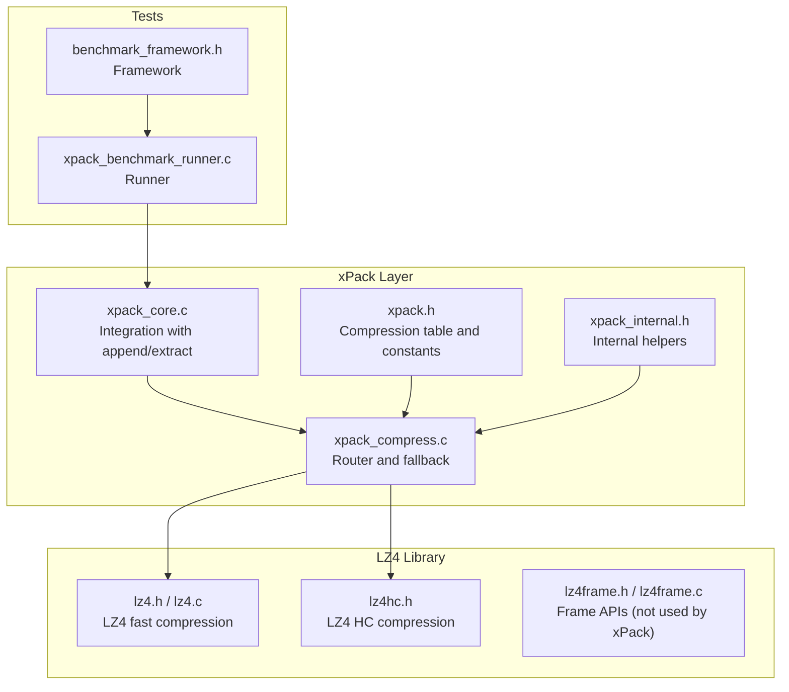
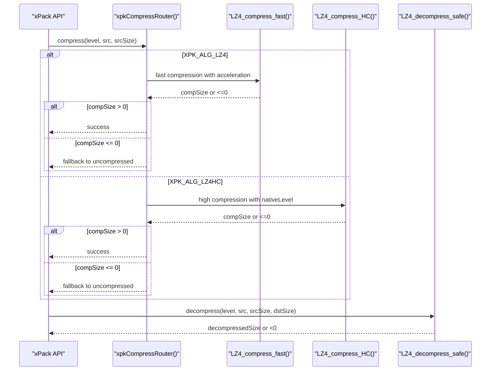
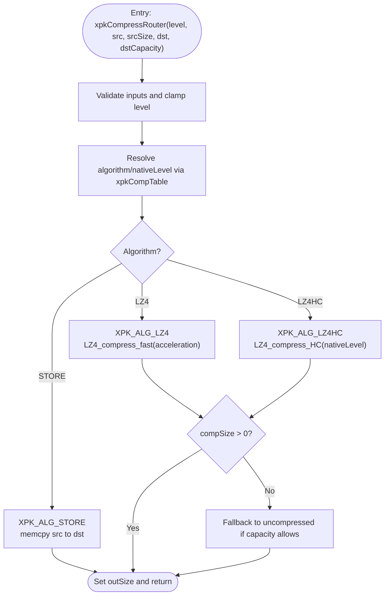
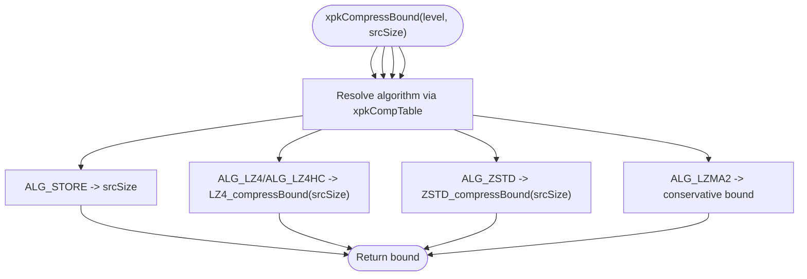
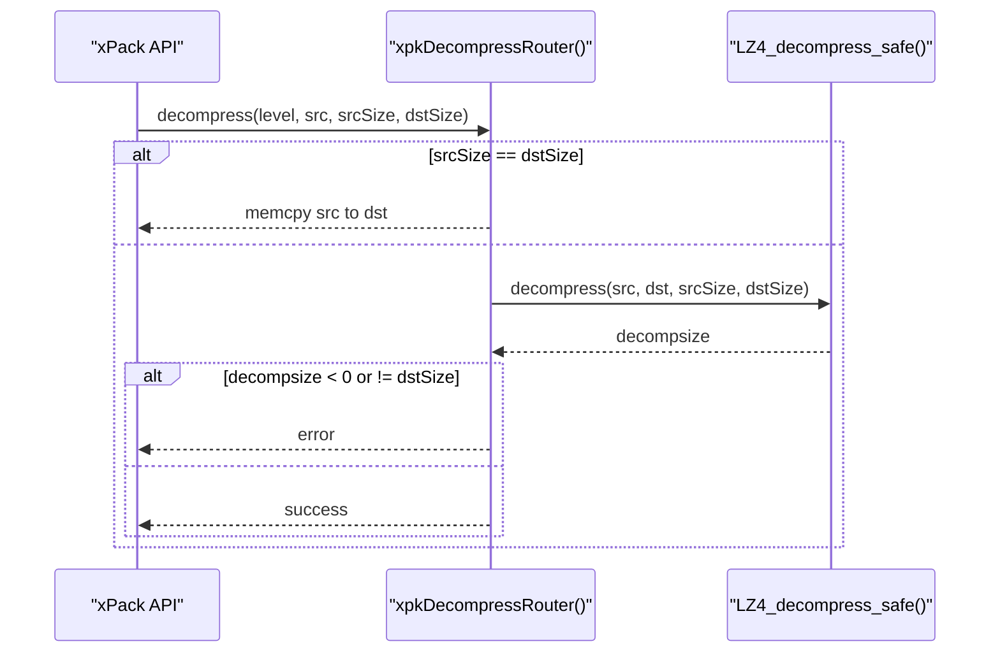
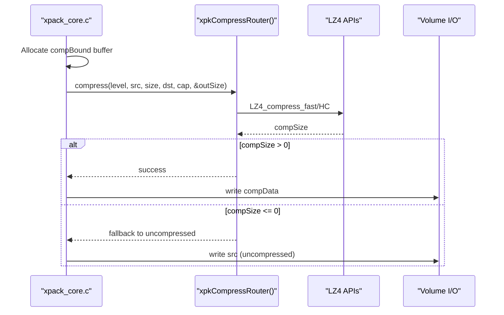
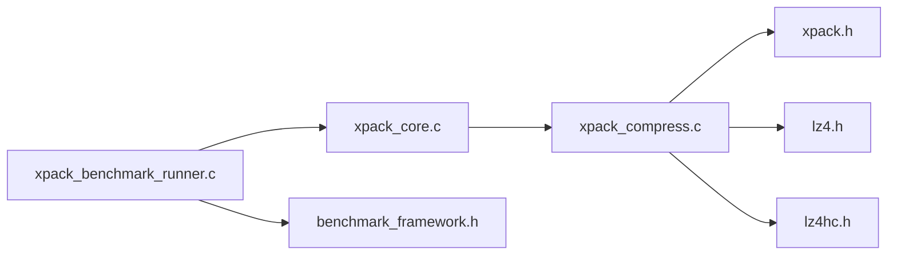

# LZ4 Compression

<cite>
**Referenced Files in This Document**
- [xpack_compress.c](file://src/xpack_compress.c)
- [xpack.h](file://src/xpack.h)
- [xpack_internal.h](file://src/xpack_internal.h)
- [xpack_core.c](file://src/xpack_core.c)
- [lz4.h](file://lib/lz4/lz4.h)
- [lz4.c](file://lib/lz4/lz4.c)
- [lz4hc.h](file://lib/lz4/lz4hc.h)
- [lz4frame.h](file://lib/lz4/lz4frame.h)
- [lz4frame.c](file://lib/lz4/lz4frame.c)
- [xpack_benchmark_runner.c](file://test/xpack_benchmark_runner.c)
- [benchmark_framework.h](file://test/benchmark_framework.h)
</cite>

## Table of Contents
1. [Introduction](#introduction)
2. [Project Structure](#project-structure)
3. [Core Components](#core-components)
4. [Architecture Overview](#architecture-overview)
5. [Detailed Component Analysis](#detailed-component-analysis)
6. [Dependency Analysis](#dependency-analysis)
7. [Performance Considerations](#performance-considerations)
8. [Troubleshooting Guide](#troubleshooting-guide)
9. [Conclusion](#conclusion)

## Introduction
This document explains the LZ4 compression implementation in xPack, focusing on the dual-mode architecture that routes to:
- XPK_ALG_LZ4: fast compression using LZ4_compress_fast with acceleration factors
- XPK_ALG_LZ4HC: high-compression variants using LZ4_compress_HC with nativeLevel mapped to LZ4 HC levels

It documents the nativeLevel mapping, compression bounds calculation via LZ4_compressBound(), performance characteristics, memory usage patterns, practical usage scenarios, benchmarking, and integration with xPack’s routing system including fallback to uncompressed mode.

## Project Structure
The LZ4 implementation spans three layers:
- xPack routing and API: compression/decompression router, compression bounds, and integration with xPack’s compression table
- LZ4 library: fast and high-compression APIs, compression bounds, and frame APIs
- Test and benchmarking: runner and framework for measuring performance

**Diagram sources**
- [xpack_compress.c](file://src/xpack_compress.c#L20-L147)
- [xpack.h](file://src/xpack.h#L269-L286)
- [xpack_internal.h](file://src/xpack_internal.h#L97-L126)
- [xpack_core.c](file://src/xpack_core.c#L39-L128)
- [lz4.h](file://lib/lz4/lz4.h#L214-L236)
- [lz4.c](file://lib/lz4/lz4.c#L1456-L1478)
- [lz4hc.h](file://lib/lz4/lz4hc.h#L56-L66)
- [lz4frame.h](file://lib/lz4/lz4frame.h#L208-L235)
- [lz4frame.c](file://lib/lz4/lz4frame.c#L877-L888)
- [xpack_benchmark_runner.c](file://test/xpack_benchmark_runner.c#L19-L80)
- [benchmark_framework.h](file://test/benchmark_framework.h#L22-L53)

**Section sources**
- [xpack_compress.c](file://src/xpack_compress.c#L1-L147)
- [xpack.h](file://src/xpack.h#L269-L286)
- [xpack_internal.h](file://src/xpack_internal.h#L97-L126)
- [xpack_core.c](file://src/xpack_core.c#L39-L128)
- [lz4.h](file://lib/lz4/lz4.h#L214-L236)
- [lz4.c](file://lib/lz4/lz4.c#L1456-L1478)
- [lz4hc.h](file://lib/lz4/lz4hc.h#L56-L66)
- [lz4frame.h](file://lib/lz4/lz4frame.h#L208-L235)
- [lz4frame.c](file://lib/lz4/lz4frame.c#L877-L888)
- [xpack_benchmark_runner.c](file://test/xpack_benchmark_runner.c#L19-L80)
- [benchmark_framework.h](file://test/benchmark_framework.h#L22-L53)

## Core Components
- Compression router: selects LZ4 fast or LZ4-HC based on the mapping table and handles fallback to uncompressed mode when compression fails
- Compression bounds: uses LZ4_compressBound() for worst-case estimation
- Decompression: uses LZ4_decompress_safe() for both LZ4 and LZ4-HC
- Integration: xPack’s compression table maps 0–15 levels to algorithms and native levels

Key responsibilities:
- Route compression/decompression by level
- Compute maximum compressed size
- Fallback to uncompressed when compression fails
- Preserve xPack’s file-level semantics (offsets, sizes, hashes)

**Section sources**
- [xpack_compress.c](file://src/xpack_compress.c#L20-L147)
- [xpack.h](file://src/xpack.h#L269-L286)
- [xpack_internal.h](file://src/xpack_internal.h#L119-L120)

## Architecture Overview
The LZ4 integration follows a simple, layered design:
- xPack compression table defines algorithm and nativeLevel per logical level
- Router translates logical level to LZ4 fast or LZ4-HC calls
- Bounds computation uses LZ4_compressBound()
- Decompression uses LZ4_decompress_safe() for both modes
- Fallback to uncompressed occurs when LZ4 returns non-positive sizes

**Diagram sources**
- [xpack_compress.c](file://src/xpack_compress.c#L20-L147)
- [lz4.h](file://lib/lz4/lz4.h#L214-L236)
- [lz4hc.h](file://lib/lz4/lz4hc.h#L56-L66)

## Detailed Component Analysis

### Compression Router and Dual-Mode Architecture
- XPK_ALG_LZ4 maps to LZ4_compress_fast with acceleration factor:
  - nativeLevel 1 → acceleration 1 (default)
  - nativeLevel 2 → acceleration 2 (64KB block processing emphasis)
- XPK_ALG_LZ4HC maps to LZ4_compress_HC with nativeLevel passed through
- Fallback to uncompressed occurs when LZ4 returns non-positive sizes and dstCapacity ≥ srcSize

**Diagram sources**
- [xpack_compress.c](file://src/xpack_compress.c#L20-L70)
- [xpack.h](file://src/xpack.h#L269-L286)

**Section sources**
- [xpack_compress.c](file://src/xpack_compress.c#L20-L70)
- [xpack.h](file://src/xpack.h#L269-L286)

### Native Level Mapping
- Levels 0–15 map to algorithms and nativeLevel values:
  - Level 1: XPK_ALG_LZ4, nativeLevel 1 (fast)
  - Level 2: XPK_ALG_LZ4, nativeLevel 2 (fast with acceleration 2)
  - Level 3: XPK_ALG_LZ4HC, nativeLevel 4
  - Level 4: XPK_ALG_LZ4HC, nativeLevel 12
- These values are passed to LZ4_compress_fast() and LZ4_compress_HC() respectively

Note: The mapping aligns with xPack’s logical levels and translates to LZ4’s native parameters.

**Section sources**
- [xpack.h](file://src/xpack.h#L269-L286)

### Compression Bounds Calculation
- xpkCompressBound(level, srcSize) delegates to LZ4_compressBound() for LZ4/LZ4-HC
- For LZMA2, a conservative upper bound is computed
- xPack uses this bound to allocate temporary buffers before compression

**Diagram sources**
- [xpack_compress.c](file://src/xpack_compress.c#L227-L250)
- [lz4.h](file://lib/lz4/lz4.h#L214-L226)

**Section sources**
- [xpack_compress.c](file://src/xpack_compress.c#L227-L250)
- [lz4.h](file://lib/lz4/lz4.h#L214-L226)

### Decompression Path
- xpkDecompressRouter detects uncompressed data by comparing srcSize and dstSize
- For LZ4/LZ4-HC, LZ4_decompress_safe() is used
- Error handling checks return codes and compares to expected dstSize

**Diagram sources**
- [xpack_compress.c](file://src/xpack_compress.c#L153-L220)
- [lz4.h](file://lib/lz4/lz4.h#L193-L208)

**Section sources**
- [xpack_compress.c](file://src/xpack_compress.c#L153-L220)
- [lz4.h](file://lib/lz4/lz4.h#L193-L208)

### Integration with xPack Core Operations
- xpkAppendData allocates a buffer sized by xpkCompressBound(), calls xpkCompressRouter(), and writes compressed data to disk
- xpkExtractData reads compressed data, allocates output buffer sized by info->fileSize, and calls xpkDecompressRouter()

**Diagram sources**
- [xpack_core.c](file://src/xpack_core.c#L39-L128)
- [xpack_compress.c](file://src/xpack_compress.c#L20-L70)

**Section sources**
- [xpack_core.c](file://src/xpack_core.c#L39-L128)
- [xpack_compress.c](file://src/xpack_compress.c#L20-L70)

## Dependency Analysis
- xpack_compress.c depends on:
  - xpack.h for xpkCompTable and algorithm constants
  - lz4.h and lz4hc.h for LZ4 fast and high-compression APIs
- xpack_core.c depends on xpack_compress.c for compression and xpkCompressBound for buffer sizing
- Tests depend on xpack_benchmark_runner.c and benchmark_framework.h for performance measurement

**Diagram sources**
- [xpack_core.c](file://src/xpack_core.c#L39-L128)
- [xpack_compress.c](file://src/xpack_compress.c#L1-L147)
- [xpack.h](file://src/xpack.h#L269-L286)
- [lz4.h](file://lib/lz4/lz4.h#L214-L236)
- [lz4hc.h](file://lib/lz4/lz4hc.h#L56-L66)
- [xpack_benchmark_runner.c](file://test/xpack_benchmark_runner.c#L19-L80)
- [benchmark_framework.h](file://test/benchmark_framework.h#L22-L53)

**Section sources**
- [xpack_core.c](file://src/xpack_core.c#L39-L128)
- [xpack_compress.c](file://src/xpack_compress.c#L1-L147)
- [xpack.h](file://src/xpack.h#L269-L286)
- [lz4.h](file://lib/lz4/lz4.h#L214-L236)
- [lz4hc.h](file://lib/lz4/lz4hc.h#L56-L66)
- [xpack_benchmark_runner.c](file://test/xpack_benchmark_runner.c#L19-L80)
- [benchmark_framework.h](file://test/benchmark_framework.h#L22-L53)

## Performance Considerations
- LZ4 fast compression:
  - Acceleration factor trades compression ratio for speed
  - Default acceleration 1 equals LZ4_compress_default()
  - Higher acceleration reduces ratio but increases throughput
- LZ4-HC compression:
  - Uses LZ4_compress_HC with nativeLevel mapped from xPack levels
  - Higher nativeLevel increases compression ratio at the cost of speed
- Memory usage:
  - LZ4_MEMORY_USAGE controls hash table size; default 14 (16KB) balances speed and ratio
  - In-place compression requires margins per LZ4 guidelines
- Practical scenarios:
  - Small files (< 64KB): LZ4 fast with acceleration 1 or 2
  - Text/log data: LZ4-HC with moderate nativeLevel for better ratio
  - Binary data: LZ4 fast for speed; LZ4-HC for archival scenarios

[No sources needed since this section provides general guidance]

## Troubleshooting Guide
Common issues and resolutions:
- Compression returns non-positive size:
  - Fallback to uncompressed mode is automatic when dstCapacity ≥ srcSize
  - Ensure sufficient destination capacity before calling router
- Decompression returns negative or size mismatch:
  - Indicates corrupted or mismatched data; verify srcSize and dstSize
  - Check that the same level is used for compression and decompression
- Empty data handling:
  - xPack treats empty data specially; ensure correct handling in append/extract paths
- Buffer sizing:
  - Use xpkCompressBound() to compute worst-case compressed size before allocating buffers

**Section sources**
- [xpack_compress.c](file://src/xpack_compress.c#L40-L70)
- [xpack_compress.c](file://src/xpack_compress.c#L176-L185)
- [xpack_core.c](file://src/xpack_core.c#L69-L83)

## Conclusion
xPack’s LZ4 integration provides a dual-mode compression pipeline:
- Fast mode via LZ4_compress_fast with tunable acceleration
- High-compression mode via LZ4_compress_HC with mapped native levels
- Robust fallback to uncompressed mode and accurate bounds estimation
- Seamless integration with xPack’s file model and I/O subsystem

This design enables flexible performance/ratio trade-offs across diverse file types and workloads.