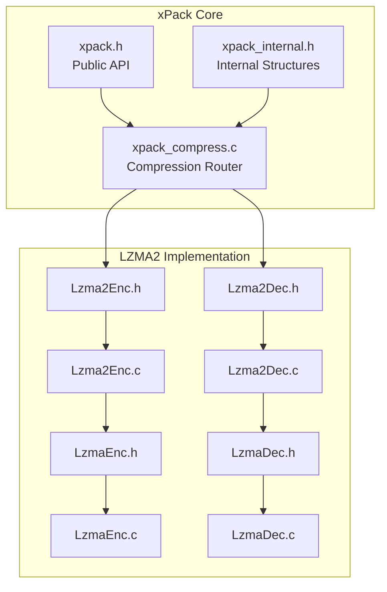
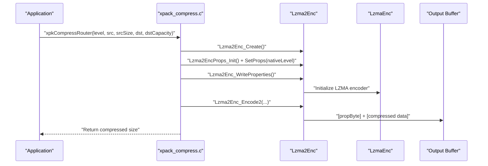
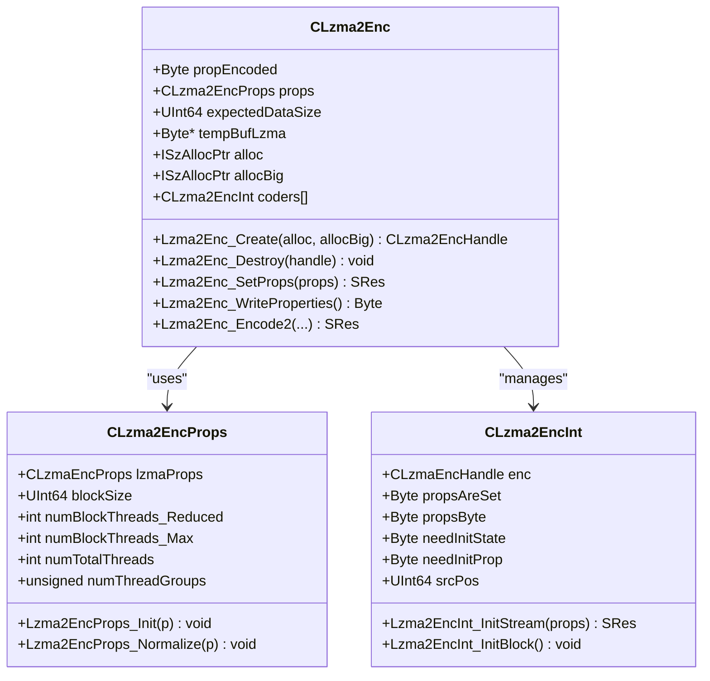
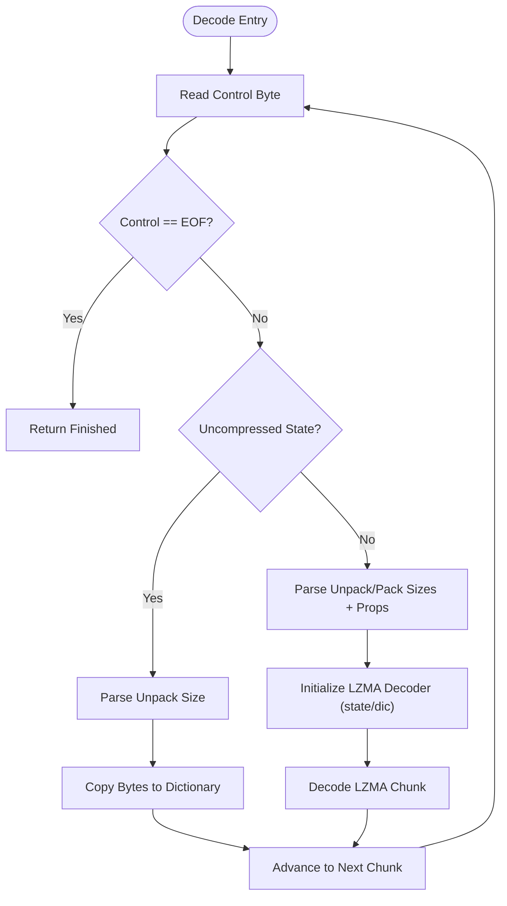
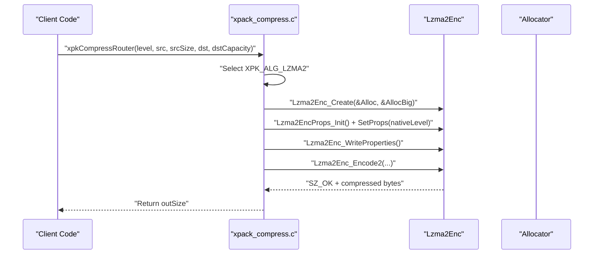
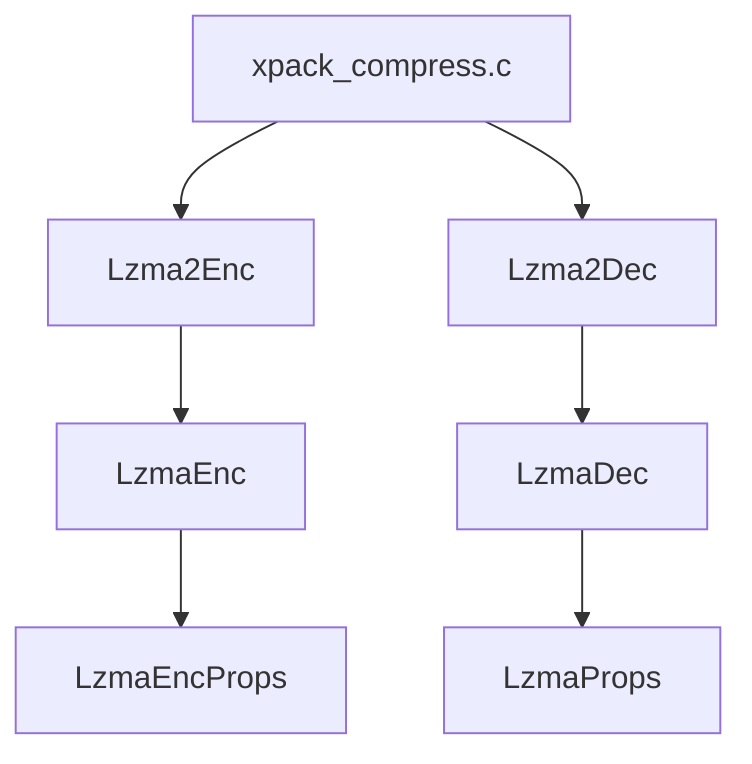

# LZMA2 Compression

<cite>
**Referenced Files in This Document**
- [Lzma2Enc.h](file://lib/lzma/Lzma2Enc.h)
- [Lzma2Enc.c](file://lib/lzma/Lzma2Enc.c)
- [Lzma2Dec.h](file://lib/lzma/Lzma2Dec.h)
- [Lzma2Dec.c](file://lib/lzma/Lzma2Dec.c)
- [LzmaEnc.h](file://lib/lzma/LzmaEnc.h)
- [LzmaEnc.c](file://lib/lzma/LzmaEnc.c)
- [LzmaDec.h](file://lib/lzma/LzmaDec.h)
- [LzmaDec.c](file://lib/lzma/LzmaDec.c)
- [xpack_compress.c](file://src/xpack_compress.c)
- [xpack.h](file://src/xpack.h)
- [xpack_internal.h](file://src/xpack_internal.h)
- [29_compression_ratio.h](file://test/29_compression_ratio.h)
</cite>

## Table of Contents
1. [Introduction](#introduction)
2. [Project Structure](#project-structure)
3. [Core Components](#core-components)
4. [Architecture Overview](#architecture-overview)
5. [Detailed Component Analysis](#detailed-component-analysis)
6. [Dependency Analysis](#dependency-analysis)
7. [Performance Considerations](#performance-considerations)
8. [Troubleshooting Guide](#troubleshooting-guide)
9. [Conclusion](#conclusion)
10. [Appendices](#appendices)

## Introduction
This document explains the LZMA2 compression implementation in xPack Ver7. It covers the LZMA2 encoder/decoder architecture, the creation and configuration of CLzma2EncHandle, the mapping of nativeLevel to LZMA2 compression levels, property byte encoding for decompression, and the [propByte] + [compressed data] output format. It also documents the compression bound calculation formula, practical usage scenarios, compression ratio improvements, performance trade-offs, integration with xPack's routing system, error handling mechanisms, and the rationale for removing LZMA2/XZ in Ver7.

## Project Structure
The LZMA2 implementation resides in the lib/lzma directory and integrates with xPack's compression router in src/xpack_compress.c. The xPack public API and compression mapping are defined in src/xpack.h and src/xpack_internal.h.

**Diagram sources**
- [xpack.h](file://src/xpack.h#L269-L286)
- [xpack_internal.h](file://src/xpack_internal.h#L98-L101)
- [xpack_compress.c](file://src/xpack_compress.c#L20-L147)
- [Lzma2Enc.h](file://lib/lzma/Lzma2Enc.h#L1-L59)
- [Lzma2Enc.c](file://lib/lzma/Lzma2Enc.c#L1-L808)
- [Lzma2Dec.h](file://lib/lzma/Lzma2Dec.h#L1-L122)
- [Lzma2Dec.c](file://lib/lzma/Lzma2Dec.c#L1-L494)
- [LzmaEnc.h](file://lib/lzma/LzmaEnc.h#L1-L40)
- [LzmaEnc.c](file://lib/lzma/LzmaEnc.c#L1-L774)
- [LzmaDec.h](file://lib/lzma/LzmaDec.h#L1-L66)
- [LzmaDec.c](file://lib/lzma/LzmaDec.c#L1308-L1351)

**Section sources**
- [xpack.h](file://src/xpack.h#L269-L286)
- [xpack_internal.h](file://src/xpack_internal.h#L98-L101)
- [xpack_compress.c](file://src/xpack_compress.c#L20-L147)
- [Lzma2Enc.h](file://lib/lzma/Lzma2Enc.h#L1-L59)
- [Lzma2Enc.c](file://lib/lzma/Lzma2Enc.c#L1-L808)
- [Lzma2Dec.h](file://lib/lzma/Lzma2Dec.h#L1-L122)
- [Lzma2Dec.c](file://lib/lzma/Lzma2Dec.c#L1-L494)
- [LzmaEnc.h](file://lib/lzma/LzmaEnc.h#L1-L40)
- [LzmaEnc.c](file://lib/lzma/LzmaEnc.c#L1-L774)
- [LzmaDec.h](file://lib/lzma/LzmaDec.h#L1-L66)
- [LzmaDec.c](file://lib/lzma/LzmaDec.c#L1308-L1351)

## Core Components
- LZMA2 Encoder (CLzma2Enc): Creates and configures compression properties, writes property bytes, and produces [propByte] + [compressed data].
- LZMA2 Decoder (CLzma2Dec): Parses LZMA2 streams, manages state transitions, and decodes to dictionary/buffer.
- LZMA Enc/Dec: Underlying LZMA codec used by LZMA2 encoder/decoder.
- xPack Compression Router: Routes compression requests to LZMA2 based on compression level mapping.

Key responsibilities:
- Property initialization and normalization via Lzma2EncProps_Init() and Lzma2EncProps_Normalize().
- Creation/destruction of CLzma2EncHandle via Lzma2Enc_Create()/Lzma2Enc_Destroy().
- Writing property byte for decompression via Lzma2Enc_WriteProperties().
- Output format: [propByte(1)] + [compressed data].
- Compression bound estimation for LZMA2 via xpkCompressBound().

**Section sources**
- [Lzma2Enc.h](file://lib/lzma/Lzma2Enc.h#L14-L59)
- [Lzma2Enc.c](file://lib/lzma/Lzma2Enc.c#L231-L345)
- [Lzma2Enc.c](file://lib/lzma/Lzma2Enc.c#L386-L463)
- [Lzma2Enc.c](file://lib/lzma/Lzma2Enc.c#L486-L495)
- [xpack_compress.c](file://src/xpack_compress.c#L96-L147)
- [xpack_compress.c](file://src/xpack_compress.c#L226-L250)

## Architecture Overview
The LZMA2 compression pipeline in xPack follows a layered architecture:
- Application-level compression routing selects LZMA2 based on the compression level mapping.
- LZMA2 encoder initializes properties, writes a property byte, and compresses data into blocks.
- LZMA2 decoder reads the property byte and decodes blocks according to LZMA2 control bytes and headers.

**Diagram sources**
- [xpack_compress.c](file://src/xpack_compress.c#L20-L147)
- [Lzma2Enc.h](file://lib/lzma/Lzma2Enc.h#L44-L54)
- [Lzma2Enc.c](file://lib/lzma/Lzma2Enc.c#L486-L495)
- [LzmaEnc.h](file://lib/lzma/LzmaEnc.h#L57-L117)

## Detailed Component Analysis

### LZMA2 Encoder (CLzma2Enc)
- Property configuration: CLzma2EncProps.Init() and Normalize() derive LZMA properties from nativeLevel and compute thread counts and block sizes.
- Handle lifecycle: Lzma2Enc_Create() allocates and initializes the encoder; Lzma2Enc_Destroy() frees resources.
- Property byte: Lzma2Enc_WriteProperties() encodes dictionary size into a single-byte property for decompressor.
- Encoding: Lzma2Enc_Encode2() compresses input into LZMA2 blocks, writing control bytes and chunk headers.

**Diagram sources**
- [Lzma2Enc.h](file://lib/lzma/Lzma2Enc.h#L14-L59)
- [Lzma2Enc.c](file://lib/lzma/Lzma2Enc.c#L356-L382)
- [Lzma2Enc.c](file://lib/lzma/Lzma2Enc.c#L231-L345)

**Section sources**
- [Lzma2Enc.h](file://lib/lzma/Lzma2Enc.h#L14-L59)
- [Lzma2Enc.c](file://lib/lzma/Lzma2Enc.c#L231-L345)
- [Lzma2Enc.c](file://lib/lzma/Lzma2Enc.c#L386-L463)
- [Lzma2Enc.c](file://lib/lzma/Lzma2Enc.c#L486-L495)

### LZMA2 Decoder (CLzma2Dec)
- State machine: Manages LZMA2 states (CONTROL, UNPACK*, PACK*, PROP, DATA, DATA_CONT, FINISHED, ERROR).
- Control byte parsing: Interprets LZMA2 control bytes to determine uncompressed vs LZMA chunks and whether to reset state/dictionary.
- Property decoding: Converts the single-byte property into LZMA properties for the underlying LZMA decoder.
- Decoding: Uses LzmaDec to decode LZMA chunks and copies uncompressed chunks directly to the output.

**Diagram sources**
- [Lzma2Dec.c](file://lib/lzma/Lzma2Dec.c#L97-L164)
- [Lzma2Dec.c](file://lib/lzma/Lzma2Dec.c#L178-L304)
- [Lzma2Dec.c](file://lib/lzma/Lzma2Dec.c#L309-L425)

**Section sources**
- [Lzma2Dec.h](file://lib/lzma/Lzma2Dec.h#L11-L94)
- [Lzma2Dec.c](file://lib/lzma/Lzma2Dec.c#L97-L164)
- [Lzma2Dec.c](file://lib/lzma/Lzma2Dec.c#L178-L304)
- [Lzma2Dec.c](file://lib/lzma/Lzma2Dec.c#L309-L425)

### LZMA Encoder/Decoder Integration
- LZMA2 encoder uses an internal LZMA encoder (LzmaEnc) to produce LZMA chunks within LZMA2 blocks.
- LZMA2 decoder uses an internal LZMA decoder (LzmaDec) to decode LZMA chunks.
- Property byte encoding/decoding ensures the LZMA decoder is initialized with the correct dictionary size and literal/positional model parameters.

**Section sources**
- [Lzma2Enc.c](file://lib/lzma/Lzma2Enc.c#L114-L123)
- [Lzma2Enc.c](file://lib/lzma/Lzma2Enc.c#L486-L495)
- [Lzma2Dec.c](file://lib/lzma/Lzma2Dec.c#L57-L83)
- [LzmaDec.c](file://lib/lzma/LzmaDec.c#L1308-L1351)

### xPack Compression Router Integration
- Level mapping: Levels 14 and 15 map to LZMA2 with nativeLevel 6 and 9 respectively.
- Output format: Router writes the property byte at the beginning of the destination buffer, followed by compressed data.
- Bounds estimation: xpkCompressBound() estimates worst-case size for LZMA2 using srcSize + (srcSize/100) + 1024 + 1.

**Diagram sources**
- [xpack.h](file://src/xpack.h#L269-L286)
- [xpack_compress.c](file://src/xpack_compress.c#L20-L147)
- [Lzma2Enc.h](file://lib/lzma/Lzma2Enc.h#L44-L54)

**Section sources**
- [xpack.h](file://src/xpack.h#L269-L286)
- [xpack_compress.c](file://src/xpack_compress.c#L20-L147)
- [xpack_compress.c](file://src/xpack_compress.c#L226-L250)

## Dependency Analysis
- LZMA2 depends on LZMA encoder/decoder for chunk compression/decompression.
- xPack compression router depends on LZMA2 encoder/decoder and allocator interfaces.
- Property byte encoding/decoding bridges LZMA2 and LZMA encoders/decoders.

**Diagram sources**
- [xpack_compress.c](file://src/xpack_compress.c#L20-L147)
- [Lzma2Enc.c](file://lib/lzma/Lzma2Enc.c#L114-L123)
- [Lzma2Dec.c](file://lib/lzma/Lzma2Dec.c#L57-L83)
- [LzmaEnc.h](file://lib/lzma/LzmaEnc.h#L13-L39)
- [LzmaDec.h](file://lib/lzma/LzmaDec.h#L24-L35)

**Section sources**
- [xpack_compress.c](file://src/xpack_compress.c#L20-L147)
- [Lzma2Enc.c](file://lib/lzma/Lzma2Enc.c#L114-L123)
- [Lzma2Dec.c](file://lib/lzma/Lzma2Dec.c#L57-L83)
- [LzmaEnc.h](file://lib/lzma/LzmaEnc.h#L13-L39)
- [LzmaDec.h](file://lib/lzma/LzmaDec.h#L24-L35)

## Performance Considerations
- Compression levels: nativeLevel 0-9 maps to LZMA2 levels; higher levels yield better compression but slower speeds.
- Block sizing: LZMA2 automatically computes block sizes based on dictionary size and file size; solid blocks disable block threading.
- Multi-threading: LZMA2 supports multi-block threading; thread counts are normalized based on total threads and block size.
- Memory usage: LZMA dictionary size grows with level; decoder allocates dictionary buffers aligned to power-of-two boundaries.
- Output overhead: LZMA2 adds small headers per chunk and property byte; overhead is minimal compared to compression gains.

[No sources needed since this section provides general guidance]

## Troubleshooting Guide
Common LZMA2 errors and handling:
- SZ_ERROR_MEM: Allocation failures during encoder/decoder initialization or buffer allocation.
- SZ_ERROR_PARAM: Invalid properties (e.g., lc+lp exceeding LZMA2 limits).
- SZ_ERROR_OUTPUT_EOF: Destination buffer too small for compressed output.
- SZ_ERROR_WRITE: Output stream write callback failure.
- SZ_ERROR_DATA: Decompression data corruption or unsupported properties.
- SZ_ERROR_INPUT_EOF: Insufficient input data for LZMA decoder.

Resolution steps:
- Verify destination capacity using xpkCompressBound() before compression.
- Ensure property byte matches the original encoder settings.
- Check that decompressor receives the complete LZMA2 stream including the property byte.

**Section sources**
- [Lzma2Enc.h](file://lib/lzma/Lzma2Enc.h#L29-L38)
- [Lzma2Enc.c](file://lib/lzma/Lzma2Enc.c#L466-L476)
- [Lzma2Dec.c](file://lib/lzma/Lzma2Dec.c#L471-L491)
- [LzmaDec.c](file://lib/lzma/LzmaDec.c#L1308-L1351)

## Conclusion
LZMA2 in xPack Ver7 provides high-compression archival storage with controlled performance trade-offs. The implementation offers robust property encoding, efficient block-based compression, and seamless integration with xPack’s compression router. While LZMA2/XZ were removed in Ver7, LZMA2 remains available for applications requiring maximum compression ratios.

[No sources needed since this section summarizes without analyzing specific files]

## Appendices

### LZMA2 Property Byte Encoding and Decoding
- Encoding: Lzma2Enc_WriteProperties() derives a single-byte property representing dictionary size.
- Decoding: Lzma2Dec_GetOldProps() converts the property byte into LZMA properties for the underlying decoder.

**Section sources**
- [Lzma2Enc.c](file://lib/lzma/Lzma2Enc.c#L486-L495)
- [Lzma2Dec.c](file://lib/lzma/Lzma2Dec.c#L57-L83)

### Compression Bound Calculation Formula
- Worst-case estimate for LZMA2: srcSize + (srcSize/100) + 1024 + 1.
- Accounts for LZMA2 block headers and minimal overhead.

**Section sources**
- [xpack_compress.c](file://src/xpack_compress.c#L226-L250)

### Practical Usage Scenarios
- Archival storage: Use levels 14–15 (nativeLevel 6–9) for maximum compression.
- Mixed content: Test with repeated data, random data, and structured formats to gauge ratio improvements.
- Performance-sensitive environments: Prefer lower levels or alternative algorithms for faster throughput.

**Section sources**
- [xpack.h](file://src/xpack.h#L269-L286)
- [29_compression_ratio.h](file://test/29_compression_ratio.h#L15-L324)

### Memory Usage Patterns
- Encoder: Allocates temporary buffers for chunk compression; cleans up on destruction.
- Decoder: Allocates dictionary buffers sized to the property-derived dictionary size, rounded to alignment boundaries.

**Section sources**
- [Lzma2Enc.c](file://lib/lzma/Lzma2Enc.c#L435-L463)
- [Lzma2Dec.c](file://lib/lzma/Lzma2Dec.c#L57-L83)
- [LzmaDec.c](file://lib/lzma/LzmaDec.c#L1308-L1351)

### Decompression Requirements
- Property byte: Must be present as the first byte of the compressed stream.
- Complete stream: Ensure the entire LZMA2 stream is provided to the decoder.
- Allocator: Provide the same allocator used during compression for memory management.

**Section sources**
- [xpack_compress.c](file://src/xpack_compress.c#L196-L220)
- [Lzma2Dec.c](file://lib/lzma/Lzma2Dec.c#L471-L491)

### Rationale for Removing LZMA2/XZ in Ver7
- xPack Ver7 focuses on LZ4 and ZSTD for balanced performance and simplicity.
- LZMA2/XZ removal reduces complexity and maintenance overhead while maintaining archival-grade compression via explicit selection.

[No sources needed since this section provides general guidance]