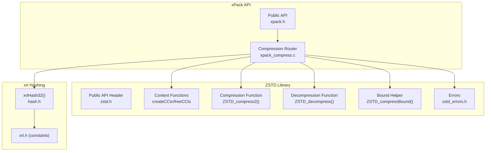
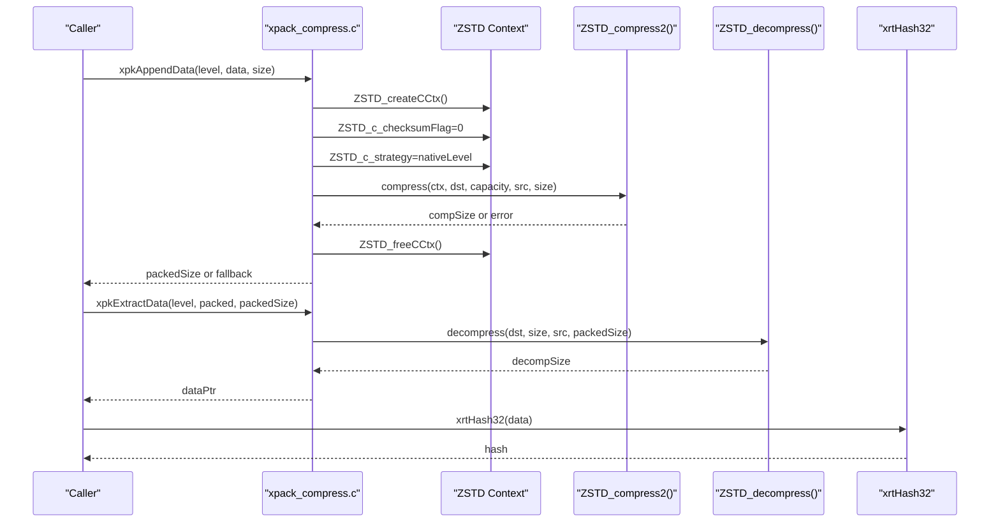
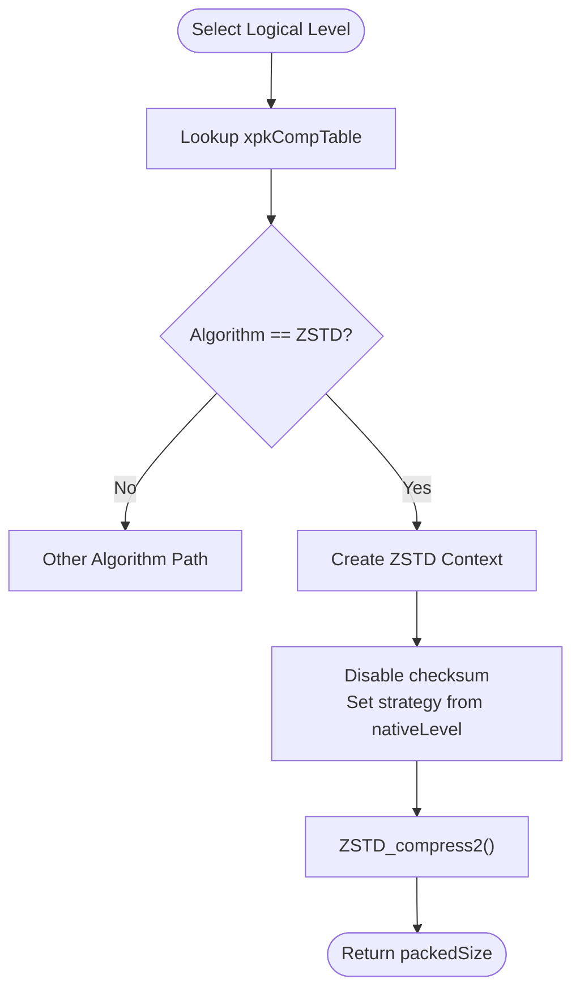
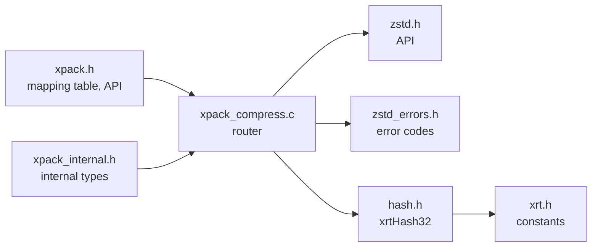

# ZSTD Compression

<cite>
**Referenced Files in This Document**
- [xpack_compress.c](file://src/xpack_compress.c)
- [xpack.h](file://src/xpack.h)
- [xpack_internal.h](file://src/xpack_internal.h)
- [zstd.h](file://lib/zstd/zstd.h)
- [zstddeclib.c](file://lib/zstd/zstddeclib.c)
- [zstd_errors.h](file://lib/zstd/zstd_errors.h)
- [hash.h](file://lib/xrt/lib/hash.h)
- [xrt.h](file://lib/xrt/xrt.h)
- [28_performance_benchmark.h](file://test/28_performance_benchmark.h)
- [29_compression_ratio.h](file://test/29_compression_ratio.h)
- [07_compression_data_patterns.h](file://test/07_compression_data_patterns.h)
- [15_verify_operations.h](file://test/15_verify_operations.h)
- [08_compression_accuracy.h](file://test/08_compression_accuracy.h)
</cite>

## Table of Contents
1. [Introduction](#introduction)
2. [Project Structure](#project-structure)
3. [Core Components](#core-components)
4. [Architecture Overview](#architecture-overview)
5. [Detailed Component Analysis](#detailed-component-analysis)
6. [Dependency Analysis](#dependency-analysis)
7. [Performance Considerations](#performance-considerations)
8. [Troubleshooting Guide](#troubleshooting-guide)
9. [Conclusion](#conclusion)
10. [Appendices](#appendices)

## Introduction
This document explains the ZSTD compression implementation in xPack. It focuses on how xPack integrates ZSTD with a strategy-based compression model, where the native compression level directly maps to ZSTD’s strategy enumeration values. It covers context lifecycle, parameter configuration (excluding checksums, which are handled by xPack’s own hashing), the usage of ZSTD_compress2(), performance characteristics, and integration with xPack’s compression router. Practical examples demonstrate usage across different compression levels, comparisons with LZ4 variants, and guidance for selecting optimal levels for typical file types.

## Project Structure
ZSTD integration is implemented in the compression router and exposed via xPack’s public API. The key elements are:
- Compression router: maps logical compression levels to ZSTD strategies and invokes ZSTD_compress2()
- ZSTD public API: exposes ZSTD_compress2(), ZSTD_createCCtx(), ZSTD_freeCCtx(), ZSTD_decompress(), ZSTD_compressBound(), and error helpers
- Hashing: xPack uses xrtHash32 instead of ZSTD checksums; ZSTD checksum is disabled in router
- Tests: validate compression accuracy, ratios, and performance across levels

**Diagram sources**
- [xpack_compress.c](file://src/xpack_compress.c#L20-L147)
- [xpack.h](file://src/xpack.h#L269-L286)
- [zstd.h](file://lib/zstd/zstd.h#L280-L315)
- [zstddeclib.c](file://lib/zstd/zstddeclib.c#L1-L70)
- [zstd_errors.h](file://lib/zstd/zstd_errors.h#L65-L107)
- [hash.h](file://lib/xrt/lib/hash.h#L594-L602)
- [xrt.h](file://lib/xrt/xrt.h#L938-L963)

**Section sources**
- [xpack_compress.c](file://src/xpack_compress.c#L1-L147)
- [xpack.h](file://src/xpack.h#L269-L286)

## Core Components
- Compression router: selects algorithm and native level based on the logical compression level, configures ZSTD context, and performs compression/decompression
- ZSTD strategy mapping: logical levels 5–13 map to ZSTD strategies fast, dfast, greedy, lazy, lazy2, btlazy2, btopt, btultra, btultra2
- Context lifecycle: ZSTD_createCCtx() and ZSTD_freeCCtx() are used around ZSTD_compress2()
- Parameter configuration: checksum disabled (xPack uses xrtHash32), strategy set from mapped native level
- Compression bound: xpkCompressBound() delegates to ZSTD_compressBound()

Key implementation references:
- Router switch and ZSTD path: [xpack_compress.c](file://src/xpack_compress.c#L20-L147)
- Strategy constants and mapping table: [xpack.h](file://src/xpack.h#L53-L64), [xpack.h](file://src/xpack.h#L269-L286)
- ZSTD context and compression API: [zstd.h](file://lib/zstd/zstd.h#L280-L315), [zstd.h](file://lib/zstd/zstd.h#L623-L625)
- Compression bound: [xpack_compress.c](file://src/xpack_compress.c#L226-L250), [zstd.h](file://lib/zstd/zstd.h#L248-L250)

**Section sources**
- [xpack_compress.c](file://src/xpack_compress.c#L20-L147)
- [xpack.h](file://src/xpack.h#L53-L64)
- [xpack.h](file://src/xpack.h#L269-L286)
- [zstd.h](file://lib/zstd/zstd.h#L248-L250)
- [zstd.h](file://lib/zstd/zstd.h#L280-L315)
- [zstd.h](file://lib/zstd/zstd.h#L623-L625)

## Architecture Overview
The compression pipeline routes logical levels to ZSTD strategies, configures a ZSTD compression context, and executes ZSTD_compress2(). Decompression uses ZSTD_decompress(). Compression bounds are computed via ZSTD_compressBound(). Integrity verification relies on xrtHash32 rather than ZSTD checksums.

**Diagram sources**
- [xpack_compress.c](file://src/xpack_compress.c#L20-L147)
- [zstd.h](file://lib/zstd/zstd.h#L280-L315)
- [zstd.h](file://lib/zstd/zstd.h#L623-L625)
- [hash.h](file://lib/xrt/lib/hash.h#L594-L602)

## Detailed Component Analysis

### ZSTD Strategy-Based Compression
- Strategy mapping: logical levels 5–13 map to ZSTD strategies fast, dfast, greedy, lazy, lazy2, btlazy2, btopt, btultra, btultra2
- Native level to strategy: the router passes map->nativeLevel as ZSTD_c_strategy
- Checksum policy: ZSTD_c_checksumFlag is set to 0; xPack computes and stores xrtHash32 for integrity

Implementation references:
- Strategy constants: [xpack.h](file://src/xpack.h#L53-L64)
- Mapping table: [xpack.h](file://src/xpack.h#L269-L286)
- Router configuration: [xpack_compress.c](file://src/xpack_compress.c#L72-L94)

**Diagram sources**
- [xpack.h](file://src/xpack.h#L269-L286)
- [xpack_compress.c](file://src/xpack_compress.c#L72-L94)

**Section sources**
- [xpack.h](file://src/xpack.h#L53-L64)
- [xpack.h](file://src/xpack.h#L269-L286)
- [xpack_compress.c](file://src/xpack_compress.c#L72-L94)

### Compression Context Lifecycle and Parameter Configuration
- Context creation and destruction: ZSTD_createCCtx() and ZSTD_freeCCtx() bracket ZSTD_compress2()
- Parameters set via ZSTD_CCtx_setParameter():
  - ZSTD_c_checksumFlag = 0 (checksum disabled)
  - ZSTD_c_strategy = map->nativeLevel (strategy selection)
- ZSTD_compress2() is used for single-pass compression with explicit parameters

References:
- Context functions: [zstd.h](file://lib/zstd/zstd.h#L280-L315)
- Compression function: [zstd.h](file://lib/zstd/zstd.h#L623-L625)
- Router usage: [xpack_compress.c](file://src/xpack_compress.c#L72-L94)

**Section sources**
- [zstd.h](file://lib/zstd/zstd.h#L280-L315)
- [zstd.h](file://lib/zstd/zstd.h#L623-L625)
- [xpack_compress.c](file://src/xpack_compress.c#L72-L94)

### Compression Bound Calculation
- xpkCompressBound() returns ZSTD_compressBound(srcSize) for ZSTD levels
- This is used to pre-size destination buffers and avoid “too small” errors

References:
- Bound helper: [zstd.h](file://lib/zstd/zstd.h#L248-L250)
- Router bound: [xpack_compress.c](file://src/xpack_compress.c#L226-L250)

**Section sources**
- [zstd.h](file://lib/zstd/zstd.h#L248-L250)
- [xpack_compress.c](file://src/xpack_compress.c#L226-L250)

### Decompression Path
- ZSTD_decompress() is used for ZSTD files
- Router validates return size and error status

References:
- Decompression function: [zstd.h](file://lib/zstd/zstd.h#L173-L174)
- Router decompression: [xpack_compress.c](file://src/xpack_compress.c#L187-L194)

**Section sources**
- [zstd.h](file://lib/zstd/zstd.h#L173-L174)
- [xpack_compress.c](file://src/xpack_compress.c#L187-L194)

### Error Handling and Robustness
- ZSTD_isError() is used to detect compression failures
- On failure, router falls back to storing uncompressed data (if capacity permits)
- Router validates inputs and returns appropriate error codes

References:
- Error detection: [xpack_compress.c](file://src/xpack_compress.c#L85-L91)
- Error codes enumeration: [zstd_errors.h](file://lib/zstd/zstd_errors.h#L65-L107)

**Section sources**
- [xpack_compress.c](file://src/xpack_compress.c#L85-L91)
- [zstd_errors.h](file://lib/zstd/zstd_errors.h#L65-L107)

### Integrity Verification Without ZSTD Checksum
- xPack disables ZSTD checksums and uses xrtHash32 for integrity
- Hash is computed post-extraction and compared to stored hash

References:
- Router checksum disable: [xpack_compress.c](file://src/xpack_compress.c#L77-L78)
- Hash usage in verify: [hash.h](file://lib/xrt/lib/hash.h#L594-L602)
- Verify API: [xrt.h](file://lib/xrt/xrt.h#L938-L963)

**Section sources**
- [xpack_compress.c](file://src/xpack_compress.c#L77-L78)
- [hash.h](file://lib/xrt/lib/hash.h#L594-L602)
- [xrt.h](file://lib/xrt/xrt.h#L938-L963)

## Dependency Analysis
ZSTD integration depends on:
- xPack public API and internal structures
- ZSTD public API for compression, decompression, bounds, and error handling
- xrt hashing for integrity verification

**Diagram sources**
- [xpack.h](file://src/xpack.h#L269-L286)
- [xpack_internal.h](file://src/xpack_internal.h#L97-L126)
- [xpack_compress.c](file://src/xpack_compress.c#L20-L147)
- [zstd.h](file://lib/zstd/zstd.h#L248-L250)
- [zstd_errors.h](file://lib/zstd/zstd_errors.h#L65-L107)
- [hash.h](file://lib/xrt/lib/hash.h#L594-L602)
- [xrt.h](file://lib/xrt/xrt.h#L938-L963)

**Section sources**
- [xpack.h](file://src/xpack.h#L269-L286)
- [xpack_internal.h](file://src/xpack_internal.h#L97-L126)
- [xpack_compress.c](file://src/xpack_compress.c#L20-L147)
- [zstd.h](file://lib/zstd/zstd.h#L248-L250)
- [zstd_errors.h](file://lib/zstd/zstd_errors.h#L65-L107)
- [hash.h](file://lib/xrt/lib/hash.h#L594-L602)
- [xrt.h](file://lib/xrt/xrt.h#L938-L963)

## Performance Considerations
- Strategy vs. speed/ratio trade-offs: Higher ZSTD strategies generally yield better compression ratios at the cost of speed
- Memory usage: ZSTD strategies influence memory footprint; ultra strategies require more memory
- Throughput: For large files, higher strategies may reduce throughput; choose based on workload
- Compression bounds: Using ZSTD_compressBound() avoids buffer errors and reduces retries

Practical guidance:
- Text-heavy files: Strategies greedy and lazy often achieve good ratios
- Binary files: Higher strategies (lazy2, btlazy2, btopt, btultra) may improve ratios
- Real-time constraints: Prefer lower strategies (fast, dfast, greedy) for speed

Validation references:
- Compression ratio tests: [29_compression_ratio.h](file://test/29_compression_ratio.h#L15-L36)
- Multi-pattern tests: [07_compression_data_patterns.h](file://test/07_compression_data_patterns.h#L321-L354)
- Performance benchmarking harness: [28_performance_benchmark.h](file://test/28_performance_benchmark.h#L299-L317)

**Section sources**
- [29_compression_ratio.h](file://test/29_compression_ratio.h#L15-L36)
- [07_compression_data_patterns.h](file://test/07_compression_data_patterns.h#L321-L354)
- [28_performance_benchmark.h](file://test/28_performance_benchmark.h#L299-L317)

## Troubleshooting Guide
Common issues and resolutions:
- Compression fails: Router falls back to uncompressed storage if destination capacity is insufficient or compression returns an error
- Decompression mismatch: Ensure the logical level maps to the same ZSTD strategy used during compression
- Integrity verification failures: Confirm xrtHash32 is computed on the original data and matches stored hash

References:
- Router fallback behavior: [xpack_compress.c](file://src/xpack_compress.c#L85-L91)
- Verify operations: [15_verify_operations.h](file://test/15_verify_operations.h#L7-L24), [08_compression_accuracy.h](file://test/08_compression_accuracy.h#L63-L81)

**Section sources**
- [xpack_compress.c](file://src/xpack_compress.c#L85-L91)
- [15_verify_operations.h](file://test/15_verify_operations.h#L7-L24)
- [08_compression_accuracy.h](file://test/08_compression_accuracy.h#L63-L81)

## Conclusion
xPack’s ZSTD integration leverages strategy-based compression with a direct mapping from logical levels to ZSTD strategies. The router manages context lifecycle, disables ZSTD checksums in favor of xrtHash32, and uses ZSTD_compress2() for efficient single-pass compression. Compression bounds and robust error handling ensure reliability. Performance characteristics vary by strategy and data type, with guidelines provided for selecting optimal levels.

## Appendices

### Practical Examples and Usage Patterns
- Basic compression with ZSTD greedy (level 7):
  - Use logical level 7; router maps to ZSTD_greedy and calls ZSTD_compress2()
- High-ratio compression with btultra (level 12):
  - Use logical level 12; router maps to ZSTD_btultra
- Fallback behavior:
  - If compression fails or destination is too small, router stores uncompressed data

References:
- Mapping table: [xpack.h](file://src/xpack.h#L269-L286)
- Router logic: [xpack_compress.c](file://src/xpack_compress.c#L72-L94)

**Section sources**
- [xpack.h](file://src/xpack.h#L269-L286)
- [xpack_compress.c](file://src/xpack_compress.c#L72-L94)

### Performance and Accuracy Validation References
- Compression ratio tests across data types: [29_compression_ratio.h](file://test/29_compression_ratio.h#L15-L191)
- Multi-file accuracy and rebuild tests: [08_compression_accuracy.h](file://test/08_compression_accuracy.h#L63-L358), [15_verify_operations.h](file://test/15_verify_operations.h#L1-L66)

**Section sources**
- [29_compression_ratio.h](file://test/29_compression_ratio.h#L15-L191)
- [08_compression_accuracy.h](file://test/08_compression_accuracy.h#L63-L358)
- [15_verify_operations.h](file://test/15_verify_operations.h#L1-L66)