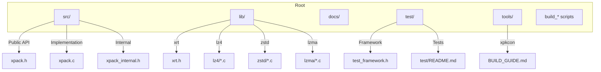
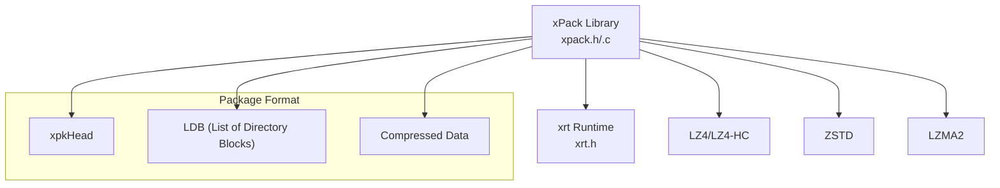
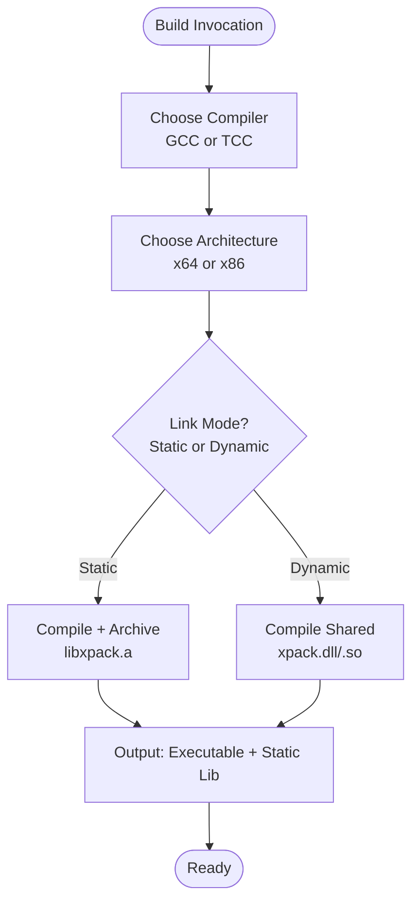
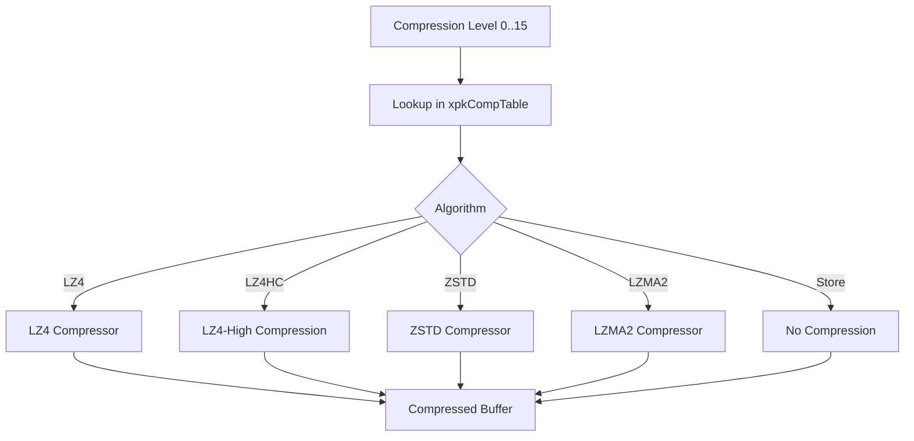
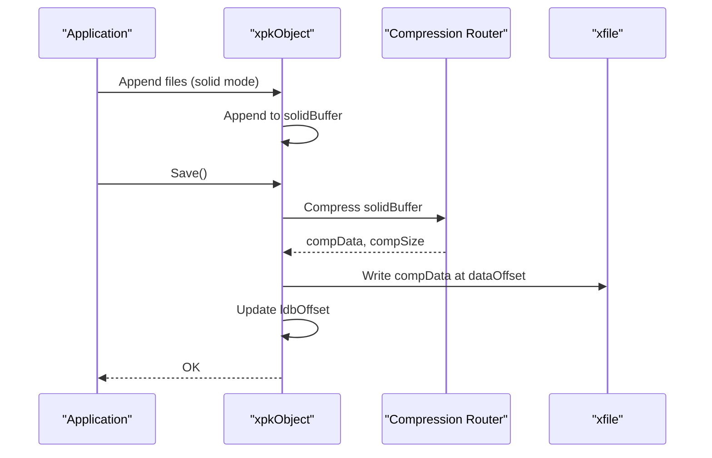
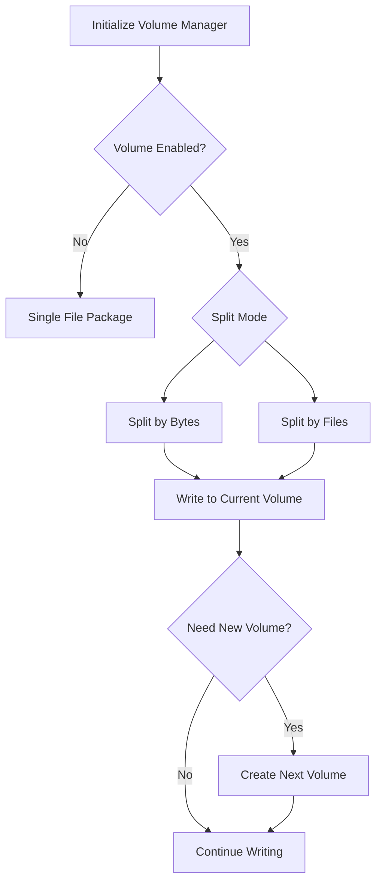
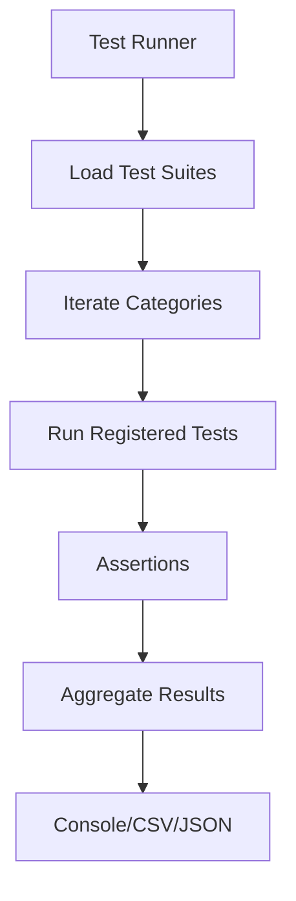
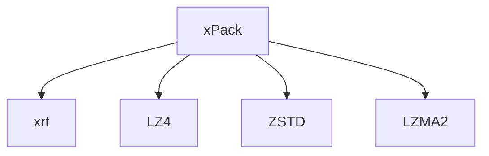

# Development Guide

<cite>
**Referenced Files in This Document**
- [xpack.h](file://src/xpack.h)
- [xpack.c](file://src/xpack.c)
- [xpack_internal.h](file://src/xpack_internal.h)
- [design.md](file://docs/design.md)
- [spec.md](file://docs/spec.md)
- [test_framework.h](file://test/test_framework.h)
- [README.md (Test)](file://test/README.md)
- [BUILD_GUIDE.md (xpkcon)](file://tools/xpkcon/BUILD_GUIDE.md)
- [build_GCC_DLL_x64.bat](file://build_GCC_DLL_x64.bat)
- [build_GCC_LIB_x64.bat](file://build_GCC_LIB_x64.bat)
- [build_TCC_DLL_x64.bat](file://build_TCC_DLL_x64.bat)
- [build_TCC_LIB_x64.bat](file://build_TCC_LIB_x64.bat)
- [xrt.h](file://lib/xrt/xrt.h)
</cite>

## Table of Contents
1. [Introduction](#introduction)
2. [Project Structure](#project-structure)
3. [Core Components](#core-components)
4. [Architecture Overview](#architecture-overview)
5. [Detailed Component Analysis](#detailed-component-analysis)
6. [Dependency Analysis](#dependency-analysis)
7. [Performance Considerations](#performance-considerations)
8. [Troubleshooting Guide](#troubleshooting-guide)
9. [Contribution Workflow](#contribution-workflow)
10. [Extending the Library](#extending-the-library)
11. [Release Process and Versioning](#release-process-and-versioning)
12. [Development Best Practices](#development-best-practices)
13. [Practical Examples](#practical-examples)
14. [Conclusion](#conclusion)

## Introduction
This development guide provides a comprehensive overview of the xPack Ver7 project, focusing on build system configuration, contribution workflows, and development best practices. It explains the multi-platform build system using GCC and TCC compilers, static and dynamic linking options, platform-specific considerations, and the internal architecture. It also covers coding standards, debugging techniques, environment setup, extending the library with new compression algorithms and package types, release processes, versioning strategy, backward compatibility, and testing requirements.

## Project Structure
The repository is organized into several key areas:
- docs: Design and specification documents
- lib: Third-party libraries integrated into the project (xrt, lz4, zstd, lzma)
- src: Core library implementation and public headers
- test: Unified test framework and suites
- tools: Command-line utilities and their build scripts
- build scripts: Top-level build configurations for GCC/TCC

**Diagram sources**
- [xpack.h](file://src/xpack.h#L1-L447)
- [xpack.c](file://src/xpack.c#L1-L762)
- [xpack_internal.h](file://src/xpack_internal.h#L1-L145)
- [xrt.h](file://lib/xrt/xrt.h#L1-L800)

**Section sources**
- [xpack.h](file://src/xpack.h#L1-L447)
- [xpack.c](file://src/xpack.c#L1-L762)
- [xpack_internal.h](file://src/xpack_internal.h#L1-L145)
- [design.md](file://docs/design.md#L1-L485)
- [spec.md](file://docs/spec.md#L1-L458)

## Core Components
- Public API: Defined in xpack.h, including data structures, constants, and exported functions for lifecycle, attributes, modes, traversal, batch operations, and utilities.
- Internal runtime: xpack_internal.h defines the internal xpkStruct, volume management, compression routing, and helper macros.
- Implementation: xpack.c implements lifecycle, attributes, solid compression, volume management, and error handling.

Key responsibilities:
- Lifecycle: Open, save, close packages; initialize and finalize runtime environments.
- Attributes: Type, count, disc code, and header accessors.
- Modes: Core/Index/Path modes with appropriate APIs per mode.
- Solid compression: Single-block compression for improved density.
- Volume: Multi-file packaging with split modes and metadata.
- Utilities: Hashing, verification, statistics, rebuild, and last-error reporting.

**Section sources**
- [xpack.h](file://src/xpack.h#L100-L447)
- [xpack_internal.h](file://src/xpack_internal.h#L47-L145)
- [xpack.c](file://src/xpack.c#L49-L297)

## Architecture Overview
The library integrates a unified runtime (xrt) for file operations, memory management, hashing, and time utilities. Compression is routed through a compression table mapping 0–15 levels to algorithms and native parameters. The package format supports four modes (Core, Index, Linux, Win32) with bit-packed headers and LDB (List of Directory Blocks) for file metadata.

**Diagram sources**
- [xpack.h](file://src/xpack.h#L118-L237)
- [xpack.c](file://src/xpack.c#L14-L19)
- [xrt.h](file://lib/xrt/xrt.h#L649-L769)

**Section sources**
- [xpack.h](file://src/xpack.h#L118-L237)
- [xpack.c](file://src/xpack.c#L14-L19)
- [xrt.h](file://lib/xrt/xrt.h#L649-L769)

## Detailed Component Analysis

### Build System and Multi-Platform Configuration
The project supports building with GCC and TCC compilers across Windows and Linux, with static and dynamic linking options. Build scripts demonstrate:
- Compiler selection (GCC vs TCC)
- Architecture targeting (x64/x86)
- Linking modes (static vs dynamic)
- Platform-specific flags and libraries

**Diagram sources**
- [build_GCC_DLL_x64.bat](file://build_GCC_DLL_x64.bat#L1-L32)
- [build_GCC_LIB_x64.bat](file://build_GCC_LIB_x64.bat#L1-L32)
- [build_TCC_DLL_x64.bat](file://build_TCC_DLL_x64.bat#L1-L32)
- [build_TCC_LIB_x64.bat](file://build_TCC_LIB_x64.bat#L1-L32)

**Section sources**
- [BUILD_GUIDE.md (xpkcon)](file://tools/xpkcon/BUILD_GUIDE.md#L1-L295)
- [build_GCC_DLL_x64.bat](file://build_GCC_DLL_x64.bat#L1-L32)
- [build_GCC_LIB_x64.bat](file://build_GCC_LIB_x64.bat#L1-L32)
- [build_TCC_DLL_x64.bat](file://build_TCC_DLL_x64.bat#L1-L32)
- [build_TCC_LIB_x64.bat](file://build_TCC_LIB_x64.bat#L1-L32)

### Compression Routing and Levels
Compression levels are mapped to algorithms and native parameters via a compact table. The router selects the appropriate compression/decompression routine based on the level.

**Diagram sources**
- [xpack.h](file://src/xpack.h#L269-L286)
- [xpack_internal.h](file://src/xpack_internal.h#L98-L101)

**Section sources**
- [xpack.h](file://src/xpack.h#L269-L286)
- [xpack_internal.h](file://src/xpack_internal.h#L98-L101)

### Solid Compression Mode
Solid mode concatenates all files into a single compressed block, reducing overhead and improving compression density. On save, the solid buffer is compressed and written; on load, the entire block is decompressed and accessed by offset.

**Diagram sources**
- [xpack.c](file://src/xpack.c#L480-L525)
- [xpack.c](file://src/xpack.c#L527-L606)

**Section sources**
- [xpack.c](file://src/xpack.c#L427-L616)

### Volume Management
Volume support enables multi-file packaging with configurable split modes (byte-wise or file-wise). The system maintains metadata for each volume and manages offsets and paths.

**Diagram sources**
- [xpack_internal.h](file://src/xpack_internal.h#L23-L42)
- [xpack.c](file://src/xpack.c#L646-L761)

**Section sources**
- [xpack_internal.h](file://src/xpack_internal.h#L23-L42)
- [xpack.c](file://src/xpack.c#L646-L761)

### Testing Framework
The unified test framework provides categorized tests, assertions, and reporting. Tests are organized by categories (Core, Index, Path, Compression, Error, etc.) and executed via runners.

**Diagram sources**
- [test_framework.h](file://test/test_framework.h#L1-L114)
- [README.md (Test)](file://test/README.md#L1-L555)

**Section sources**
- [test_framework.h](file://test/test_framework.h#L1-L114)
- [README.md (Test)](file://test/README.md#L1-L555)

## Dependency Analysis
External dependencies and their roles:
- xrt: File operations, memory management, hashing, arrays, time utilities
- lz4: LZ4 and LZ4-High Compression
- zstd: Zstandard Compression
- lzma: LZMA2 Compression

**Diagram sources**
- [xpack.h](file://src/xpack.h#L22-L23)
- [spec.md](file://docs/spec.md#L318-L350)

**Section sources**
- [xpack.h](file://src/xpack.h#L22-L23)
- [spec.md](file://docs/spec.md#L318-L350)

## Performance Considerations
- Compression levels: Prefer balanced defaults (e.g., ZSTD greedy) for general use; adjust for latency or throughput needs.
- Solid mode: Improves compression density for small files but increases memory usage during creation and read-through cost during extraction.
- Volume split modes: Choose byte-wise splitting for predictable sizes; file-wise for atomicity.
- Platform specifics: TCC builds are faster to compile and smaller; GCC builds offer better optimization for production.

[No sources needed since this section provides general guidance]

## Troubleshooting Guide
Common issues and resolutions:
- Dynamic link failures: Ensure xpack.dll/.so exists before building executables that depend on it.
- Version mismatches: The library validates file signatures; older versions will reject newer formats.
- Memory errors: Use provided allocators and ensure proper cleanup via xpkClose and xpkFree.
- Error reporting: Use xpkLastError and xpkLastErrorMsg for diagnostics.

**Section sources**
- [xpack.c](file://src/xpack.c#L622-L640)
- [xpack.h](file://src/xpack.h#L439-L440)

## Contribution Workflow
Recommended steps:
1. Fork and branch for features or fixes
2. Follow coding standards (see Development Best Practices)
3. Add or update tests under test/ with appropriate categories
4. Build and run tests locally (Windows/Linux)
5. Document changes in design/spec docs if applicable
6. Submit PR with clear description and test evidence

**Section sources**
- [README.md (Test)](file://test/README.md#L1-L555)
- [BUILD_GUIDE.md (xpkcon)](file://tools/xpkcon/BUILD_GUIDE.md#L1-L295)

## Extending the Library
Adding new compression algorithms:
- Extend the compression table mapping and router to select the new algorithm
- Implement compression/decompression routines and integrate with the router
- Add tests covering accuracy, performance, and edge cases

Adding new package types:
- Define new file info structures and sizes
- Update mode selection logic and APIs
- Add path hashing and case sensitivity handling as needed
- Update tests to cover new type behavior

Integrating custom features:
- Keep internal APIs minimal and encapsulated
- Use xrt for cross-platform file/memory/time operations
- Maintain backward compatibility and version checks

**Section sources**
- [xpack.h](file://src/xpack.h#L14-L17)
- [xpack.h](file://src/xpack.h#L118-L237)
- [xpack_internal.h](file://src/xpack_internal.h#L104-L145)

## Release Process and Versioning
Versioning strategy:
- File signature includes version number embedded in the file head
- Backward compatibility maintained; newer versions detect older formats and reject invalid ones

Release checklist:
- Verify all tests pass across platforms
- Confirm build scripts produce expected artifacts
- Update documentation and design/spec as needed
- Tag and publish releases with checksums

**Section sources**
- [xpack.h](file://src/xpack.h#L12-L17)
- [xpack.c](file://src/xpack.c#L98-L104)

## Development Best Practices
- Coding standards: Use consistent naming (camelCase), keep APIs minimal and stable, document public interfaces
- Debugging: Utilize xpkOnError callbacks, xpkLastError, and test framework assertions
- Environment setup: Use provided build scripts; ensure dependencies are available
- Testing: Add tests for new features; categorize by functional area; run stability and performance suites

**Section sources**
- [xpack.h](file://src/xpack.h#L279-L283)
- [test_framework.h](file://test/test_framework.h#L76-L114)
- [README.md (Test)](file://test/README.md#L152-L216)

## Practical Examples
Common development tasks:
- Building statically linked executables with GCC or TCC
- Building shared libraries for dynamic linking
- Running full, stability, and benchmark test suites
- Profiling performance using built-in benchmark runner

Debugging sessions:
- Enable error callbacks and inspect last error messages
- Use assertions in tests to pinpoint failures
- Validate compression ratios and verify hashes

Performance profiling:
- Use benchmark runner to measure compression and decompression speeds
- Compare levels and algorithms to choose optimal settings

**Section sources**
- [BUILD_GUIDE.md (xpkcon)](file://tools/xpkcon/BUILD_GUIDE.md#L234-L295)
- [README.md (Test)](file://test/README.md#L368-L404)
- [xpack.c](file://src/xpack.c#L622-L640)

## Conclusion
This guide outlined the xPack Ver7 architecture, build system, testing, and contribution practices. By following the documented workflows and leveraging the provided tools, contributors can efficiently extend the library, maintain backward compatibility, and deliver robust, high-performance compression packages across platforms.