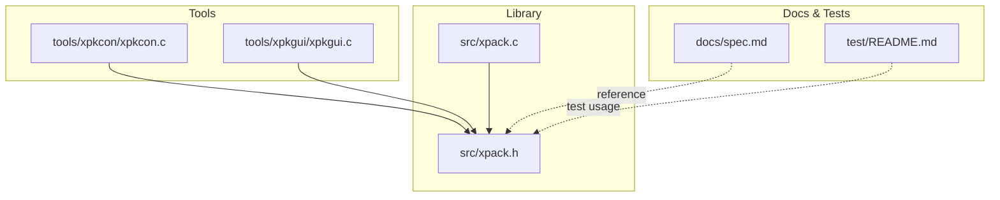
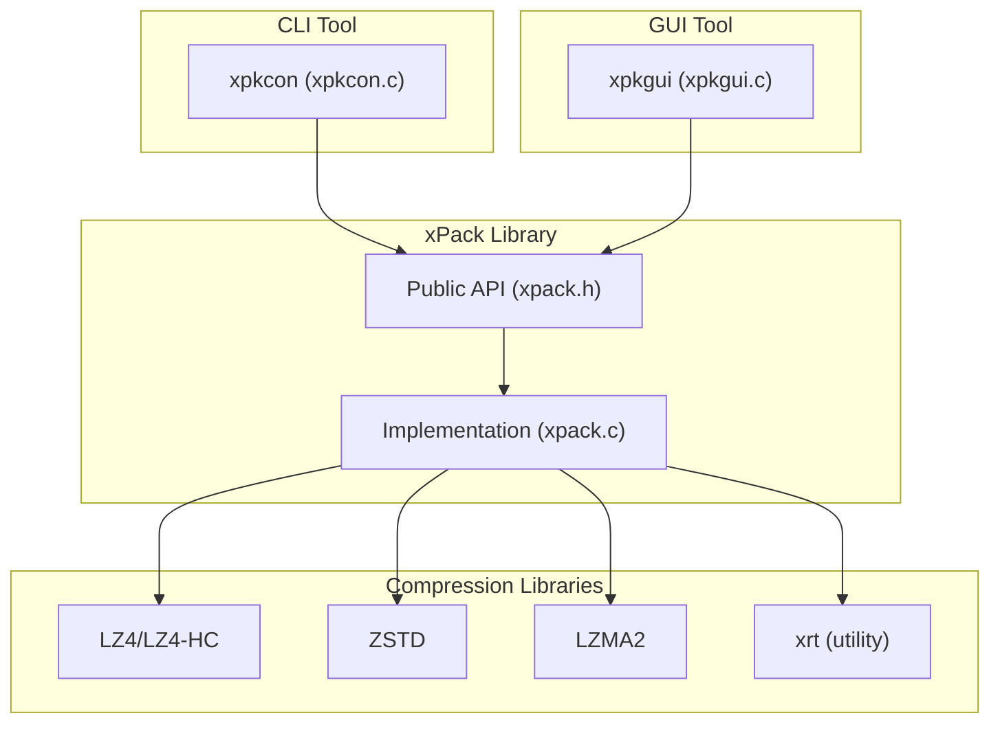
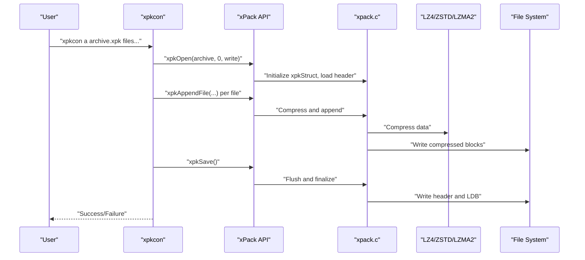
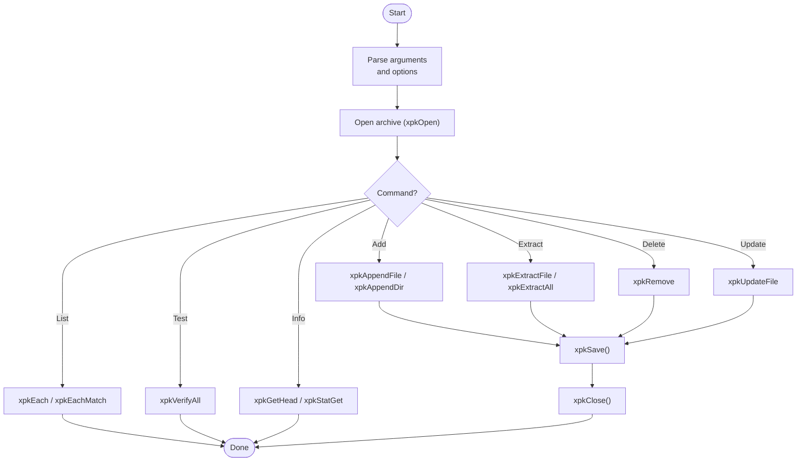
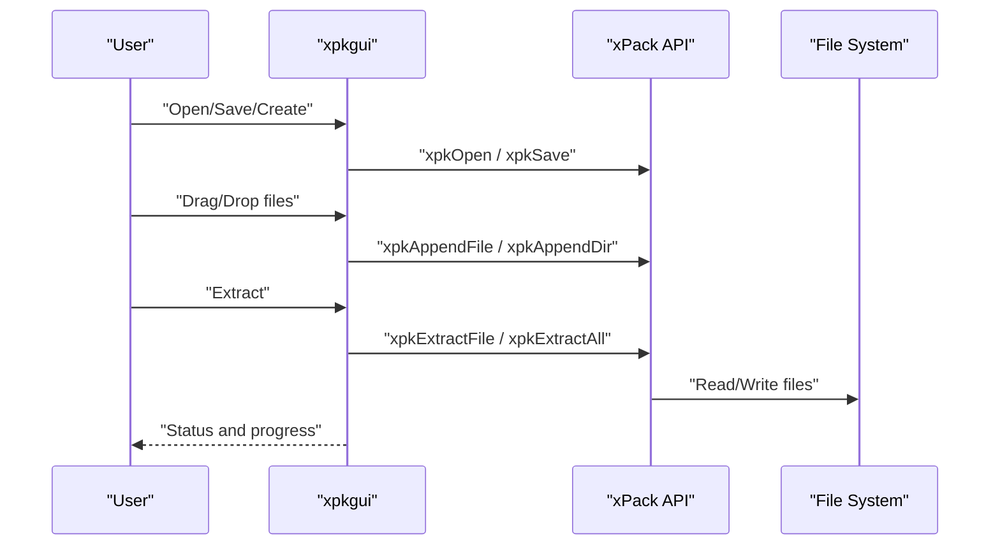
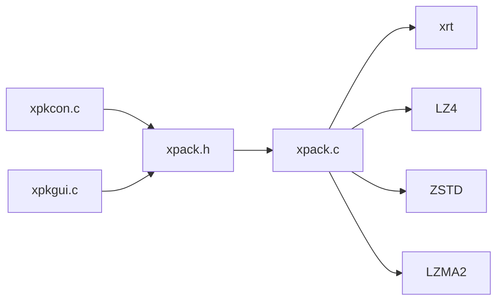

# Getting Started

<cite>
**Referenced Files in This Document**
- [spec.md](file://docs/spec.md)
- [xpack.h](file://src/xpack.h)
- [xpack.c](file://src/xpack.c)
- [xpkcon README](file://tools/xpkcon/README.md)
- [xpkcon BUILD_INSTRUCTIONS](file://tools/xpkcon/BUILD_INSTRUCTIONS.md)
- [xpkgui README](file://tools/xpkgui/README.md)
- [xpkgui BUILD_GUIDE](file://tools/xpkgui/BUILD_GUIDE.md)
- [xpkgui install.bat](file://tools/xpkgui/install.bat)
- [xpkgui uninstall.bat](file://tools/xpkgui/uninstall.bat)
- [xpkcon.c](file://tools/xpkcon/xpkcon.c)
- [xpkgui.c](file://tools/xpkgui/xpkgui.c)
- [test_xpkcon.c](file://tools/xpkcon/test/test_xpkcon.c)
- [test README](file://test/README.md)
</cite>

## Table of Contents
1. [Introduction](#introduction)
2. [Project Structure](#project-structure)
3. [Core Components](#core-components)
4. [Architecture Overview](#architecture-overview)
5. [Detailed Component Analysis](#detailed-component-analysis)
6. [Dependency Analysis](#dependency-analysis)
7. [Performance Considerations](#performance-considerations)
8. [Troubleshooting Guide](#troubleshooting-guide)
9. [Conclusion](#conclusion)
10. [Appendices](#appendices)

## Introduction
This guide helps you quickly get started with xPack on Windows and Linux. It covers installing and using both the command-line tool (xpkcon) and the graphical tool (xpkgui), performing basic operations like creating packages, adding and extracting files, and managing packages. It also includes step-by-step tutorials for common scenarios, quick reference examples, prerequisites, and troubleshooting tips.

## Project Structure
xPack consists of:
- A core C library (xpack.h and implementation) providing compression and packaging APIs
- Tools:
  - xpkcon: cross-platform command-line tool for creating, extracting, and managing xPack archives
  - xpkgui: Windows GUI tool with shell integration and batch operations
- Documentation and tests supporting development and validation

**Diagram sources**
- [xpack.h](file://src/xpack.h#L1-L447)
- [xpack.c](file://src/xpack.c#L1-L200)
- [xpkcon.c](file://tools/xpkcon/xpkcon.c#L1-L200)
- [xpkgui.c](file://tools/xpkgui/xpkgui.c#L1-L200)
- [spec.md](file://docs/spec.md#L1-L458)
- [test README](file://test/README.md#L1-L555)

**Section sources**
- [xpack.h](file://src/xpack.h#L1-L447)
- [xpack.c](file://src/xpack.c#L1-L200)
- [spec.md](file://docs/spec.md#L1-L458)
- [test README](file://test/README.md#L1-L555)

## Core Components
- xPack library (xpack.h): Defines the public API, data structures, compression levels, and modes (Core, Index, Linux, Win32). It exposes lifecycle, attributes, file operations, traversal, and utility functions.
- xpkcon (tools/xpkcon): Cross-platform CLI implementing commands for add, extract, list, test, delete, update, and info. Supports compression levels, solid mode, recursion, and volume splitting.
- xpkgui (tools/xpkgui): Windows GUI with shell integration, drag-and-drop, settings persistence, and optional command-line modes.

Key capabilities:
- Four package types with distinct access patterns
- 16 compression levels mapped to LZ4, LZ4-HC, ZSTD, and LZMA2
- Solid compression and volume splitting
- Batch operations and pattern-based selection

**Section sources**
- [xpack.h](file://src/xpack.h#L320-L447)
- [xpkcon README](file://tools/xpkcon/README.md#L1-L374)
- [xpkgui README](file://tools/xpkgui/README.md#L1-L313)

## Architecture Overview
High-level architecture showing how tools interact with the xPack library and external compression libraries.

**Diagram sources**
- [xpkcon.c](file://tools/xpkcon/xpkcon.c#L1-L200)
- [xpkgui.c](file://tools/xpkgui/xpkgui.c#L1-L200)
- [xpack.h](file://src/xpack.h#L1-L447)
- [xpack.c](file://src/xpack.c#L1-L200)
- [spec.md](file://docs/spec.md#L318-L351)

## Detailed Component Analysis

### Installation and Setup

#### Prerequisites
- Windows: Visual C++ runtime and Windows 7+ recommended
- Linux: Static builds available; GUI requires GTK3 on Linux
- Build tools: TCC or GCC (TCC for quick dev builds; GCC for optimized releases)
- Optional: xpack.dll for dynamic linking; otherwise static builds produce standalone executables

**Section sources**
- [xpkgui README](file://tools/xpkgui/README.md#L301-L313)
- [xpkgui BUILD_GUIDE](file://tools/xpkgui/BUILD_GUIDE.md#L178-L224)
- [xpkcon BUILD_INSTRUCTIONS](file://tools/xpkcon/BUILD_INSTRUCTIONS.md#L3-L115)

#### Building xpkcon (Windows)
- Static link (recommended for portability):
  - Use the provided build script to statically link all dependencies into a single executable
- Dynamic link (requires xpack.dll):
  - Build xpack.dll first, then build xpkcon to link against it

Common steps:
- Navigate to tools/xpkcon
- Run the appropriate build script for your target (x64/x86, static/dynamic)
- Verify output in release/x64 or release/x86

**Section sources**
- [xpkcon BUILD_INSTRUCTIONS](file://tools/xpkcon/BUILD_INSTRUCTIONS.md#L9-L115)
- [xpkcon README](file://tools/xpkcon/README.md#L14-L75)

#### Building xpkgui (Windows)
- Choose between static and dynamic builds
- Install script copies binaries to Program Files and registers file associations and shell extensions
- Uninstall script reverses registration and deletes files

**Section sources**
- [xpkgui BUILD_GUIDE](file://tools/xpkgui/BUILD_GUIDE.md#L124-L177)
- [xpkgui install.bat](file://tools/xpkgui/install.bat#L1-L122)
- [xpkgui uninstall.bat](file://tools/xpkgui/uninstall.bat#L1-L85)

#### Building xpkgui (Linux)
- Static and dynamic builds supported
- GUI requires GTK3 development libraries installed

**Section sources**
- [xpkgui BUILD_GUIDE](file://tools/xpkgui/BUILD_GUIDE.md#L49-L57)
- [xpkgui BUILD_GUIDE](file://tools/xpkgui/BUILD_GUIDE.md#L210-L219)

### Basic Usage Examples

#### Command-Line (xpkcon)
- Create a Win32-type archive with default compression:
  - xpkcon a archive.xpk file1.txt file2.txt
- Add files recursively:
  - xpkcon a archive.xpk -r C:\mydata
- Extract with full paths:
  - xpkcon x archive.xpk -o C:\output
- Extract without preserving paths:
  - xpkcon e archive.xpk file1.txt
- List contents:
  - xpkcon l archive.xpk
- Test integrity:
  - xpkcon t archive.xpk
- Delete a file:
  - xpkcon d archive.xpk oldfile.txt
- Update a file:
  - xpkcon u archive.xpk -l7 file1.txt
- Show archive info:
  - xpkcon i archive.xpk

Notes:
- Default package type is Win32
- Compression levels 0–15 are supported
- Solid mode and volume splitting are available via options

**Section sources**
- [xpkcon README](file://tools/xpkcon/README.md#L152-L264)

#### Graphical (xpkgui)
- Launch the GUI and use menus to create/open packages
- Drag-and-drop files to add
- Use “Extract” to unpack entire archives or selected items
- Configure compression level, package type, and solid mode from dialogs
- Use command-line modes for automation:
  - xpkgui.exe -extract <file>, -extract_here <file>, -verify <file>, -properties <file>

**Section sources**
- [xpkgui README](file://tools/xpkgui/README.md#L79-L111)
- [xpkgui README](file://tools/xpkgui/README.md#L112-L125)

### Step-by-Step Tutorials

#### Tutorial 1: Compress Game Assets
Goal: Create a Win32 package containing textures and audio for a game client.

Steps:
1. Prepare asset folder (textures/, audio/)
2. Create package:
   - xpkcon a game_assets.xpk -twin32 -l7 -r assets/
3. Verify:
   - xpkcon l game_assets.xpk
   - xpkcon t game_assets.xpk
4. Distribute:
   - Ship game_assets.xpk with your application

Optional (GUI):
- Open xpkgui, choose Win32 type, set compression level, drag assets into the list, save.

**Section sources**
- [xpkcon README](file://tools/xpkcon/README.md#L203-L218)
- [xpkgui README](file://tools/xpkgui/README.md#L136-L144)

#### Tutorial 2: Create Software Distribution Package
Goal: Package application binaries and resources for distribution.

Steps:
1. Collect binaries and resources
2. Create package:
   - xpkcon a app_dist.xpk -twin32 -l8 -r dist/
3. Optional: Enable solid mode for higher compression:
   - xpkcon a app_dist.xpk -twin32 -l8 -s1 dist/
4. Verify and extract locally to test:
   - xpkcon x app_dist.xpk -o test_extract/

**Section sources**
- [xpkcon README](file://tools/xpkcon/README.md#L203-L218)
- [xpkcon README](file://tools/xpkcon/README.md#L314-L326)

#### Tutorial 3: Manage Data Archives
Goal: Maintain a growing archive with periodic updates.

Steps:
1. Initial creation:
   - xpkcon a data_archive.xpk -tlinux -l6 *.dat
2. Add new files:
   - xpkcon a data_archive.xpk new1.dat new2.dat
3. Remove outdated files:
   - xpkcon d data_archive.xpk old.dat
4. Update changed files:
   - xpkcon u data_archive.xpk -l6 updated.dat
5. List and verify:
   - xpkcon l data_archive.xpk
   - xpkcon t data_archive.xpk

Note: Linux mode preserves case-sensitive paths.

**Section sources**
- [xpkcon README](file://tools/xpkcon/README.md#L292-L313)
- [xpkcon README](file://tools/xpkcon/README.md#L314-L326)

### Quick Reference

#### Command-Line Quick Reference
- Create: xpkcon a <archive> [-t<type>] [-l<level>] [-s<0|1>] [-r] [files...]
- Extract (full paths): xpkcon x <archive> -o <dir> [files...]
- Extract (no paths): xpkcon e <archive> [files...]
- List: xpkcon l <archive>
- Test: xpkcon t <archive>
- Delete: xpkcon d <archive> [-y] <file>
- Update: xpkcon u <archive> -l<level> <file>
- Info: xpkcon i <archive>

**Section sources**
- [xpkcon README](file://tools/xpkcon/README.md#L152-L183)
- [xpkcon README](file://tools/xpkcon/README.md#L203-L264)

#### GUI Quick Reference
- Modes: New/Open/Save/Add/Extract/Verify/Properties
- Shortcuts: Ctrl+N, Ctrl+O, Ctrl+S, Ctrl+A, Ctrl+D, Ctrl+E, F5, Del, F2
- Shell integration: Right-click menu for .xpk and folders
- Command-line modes: -extract, -extract_here, -verify, -properties

**Section sources**
- [xpkgui README](file://tools/xpkgui/README.md#L112-L125)
- [xpkgui README](file://tools/xpkgui/README.md#L266-L280)
- [xpkgui README](file://tools/xpkgui/README.md#L79-L111)

### Prerequisite Knowledge
- Basic C programming concepts:
  - Pointers, memory management, file I/O
  - Understanding of enums, structs, and function signatures
- Compression fundamentals:
  - Trade-offs between compression ratio and speed
  - Solid vs separate compression modes
  - Package types and their access patterns (Core/Index/Linux/Win32)
- Platform basics:
  - Windows registry and shell integration
  - Linux package managers and GTK3 availability

**Section sources**
- [spec.md](file://docs/spec.md#L15-L31)
- [spec.md](file://docs/spec.md#L80-L106)
- [xpkgui README](file://tools/xpkgui/README.md#L301-L313)

## Architecture Overview

**Diagram sources**
- [xpkcon.c](file://tools/xpkcon/xpkcon.c#L61-L128)
- [xpack.h](file://src/xpack.h#L329-L378)
- [xpack.c](file://src/xpack.c#L49-L200)
- [spec.md](file://docs/spec.md#L318-L351)

## Detailed Component Analysis

### xpkcon Command Flow

**Diagram sources**
- [xpkcon.c](file://tools/xpkcon/xpkcon.c#L61-L128)
- [xpack.h](file://src/xpack.h#L329-L441)

**Section sources**
- [xpkcon.c](file://tools/xpkcon/xpkcon.c#L61-L128)
- [xpkcon README](file://tools/xpkcon/README.md#L152-L264)

### xpkgui Workflow

**Diagram sources**
- [xpkgui.c](file://tools/xpkgui/xpkgui.c#L166-L200)
- [xpack.h](file://src/xpack.h#L329-L441)

**Section sources**
- [xpkgui.c](file://tools/xpkgui/xpkgui.c#L166-L200)
- [xpkgui README](file://tools/xpkgui/README.md#L1-L313)

## Dependency Analysis
- xPack library depends on:
  - xrt (utility library for file/memory/path/time operations)
  - LZ4/LZ4-HC (fast compression)
  - ZSTD (balanced compression)
  - LZMA2 (high compression)
- Tools depend on the xPack library and optionally on xpack.dll (dynamic) or static linking.

**Diagram sources**
- [xpack.h](file://src/xpack.h#L318-L351)
- [xpack.c](file://src/xpack.c#L1-L200)
- [spec.md](file://docs/spec.md#L318-L351)

**Section sources**
- [xpack.h](file://src/xpack.h#L318-L351)
- [spec.md](file://docs/spec.md#L318-L351)

## Performance Considerations
- Compression levels:
  - Lower levels (0–4): Fastest, lowest compression
  - Mid-range (5–13): Balanced speed/ratio
  - Higher levels (14–15): Highest compression, slowest
- Solid mode:
  - Improves compression ratio for similar files but increases decompression cost
- Algorithm choice:
  - LZ4/LZ4-HC: fastest for real-time loading
  - ZSTD: best balance for general-purpose use
  - LZMA2: highest compression for archival
- Batch operations:
  - Use recursive directory processing and pattern matching to reduce overhead

**Section sources**
- [spec.md](file://docs/spec.md#L34-L77)
- [xpkcon README](file://tools/xpkcon/README.md#L184-L202)
- [xpkgui README](file://tools/xpkgui/README.md#L126-L135)

## Troubleshooting Guide

### Common Setup Issues
- Missing xpack.dll when using dynamic linking:
  - Copy xpack.dll next to xpkcon.exe or add release/x64 to PATH
- TCC not found:
  - Install TCC and ensure tcc.exe is in PATH
- Shell extension registration failures (Windows):
  - Run install.bat as Administrator

**Section sources**
- [xpkcon BUILD_INSTRUCTIONS](file://tools/xpkcon/BUILD_INSTRUCTIONS.md#L102-L115)
- [xpkgui install.bat](file://tools/xpkgui/install.bat#L194-L209)

### Platform-Specific Notes
- Windows:
  - GUI requires Visual C++ runtime and Windows 7+
  - Shell integration adds right-click context menus
- Linux:
  - GUI requires GTK3 development libraries
  - Static builds are recommended for portability

**Section sources**
- [xpkgui README](file://tools/xpkgui/README.md#L301-L313)
- [xpkgui BUILD_GUIDE](file://tools/xpkgui/BUILD_GUIDE.md#L210-L219)

### Validation and Testing
- Use built-in tests to validate functionality:
  - Full test suite, stability tests, and benchmarks
- CLI tests cover:
  - Basic add/extract/list/info
  - Compression levels and solid mode
  - Package types and edge cases
  - Volume mode (by size and file count)

**Section sources**
- [test README](file://test/README.md#L87-L151)
- [test_xpkcon.c](file://tools/xpkcon/test/test_xpkcon.c#L1-L96)

## Conclusion
You now have the essentials to install, configure, and use xPack tools on Windows and Linux. Start with the CLI for scripting and automation, and use the GUI for interactive workflows. Explore the tutorials to apply xPack to real-world tasks like game asset packaging, software distribution, and data archiving.

## Appendices

### Compression Levels and Algorithms
- Levels 0–15 map to STORE, LZ4/LZ4-HC, ZSTD, and LZMA2
- Defaults favor balanced performance (ZSTD greedy at level 7)

**Section sources**
- [spec.md](file://docs/spec.md#L34-L77)
- [xpkcon README](file://tools/xpkcon/README.md#L184-L202)
- [xpkgui README](file://tools/xpkgui/README.md#L126-L135)

### Package Types and Access Patterns
- Core: sequential position access
- Index: integer index access
- Linux: case-sensitive path access
- Win32: case-insensitive path access

**Section sources**
- [spec.md](file://docs/spec.md#L80-L106)
- [xpkcon README](file://tools/xpkcon/README.md#L292-L313)
- [xpkgui README](file://tools/xpkgui/README.md#L136-L144)