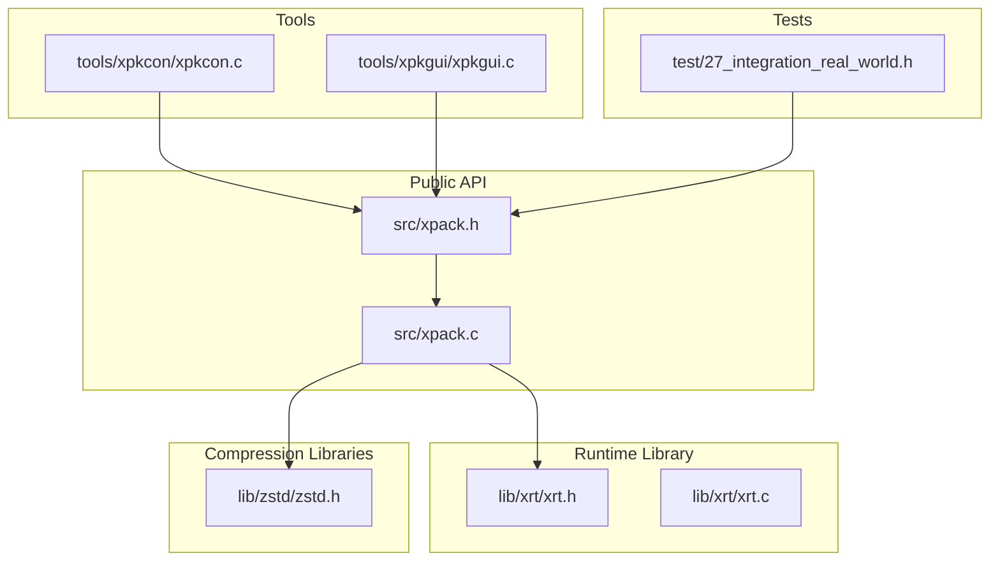
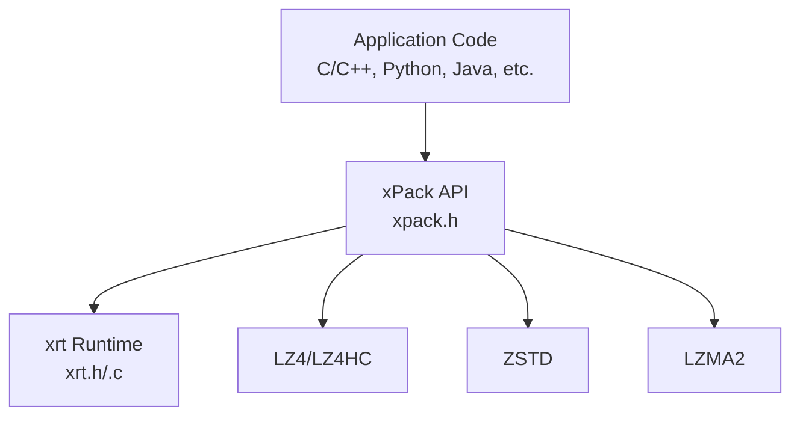
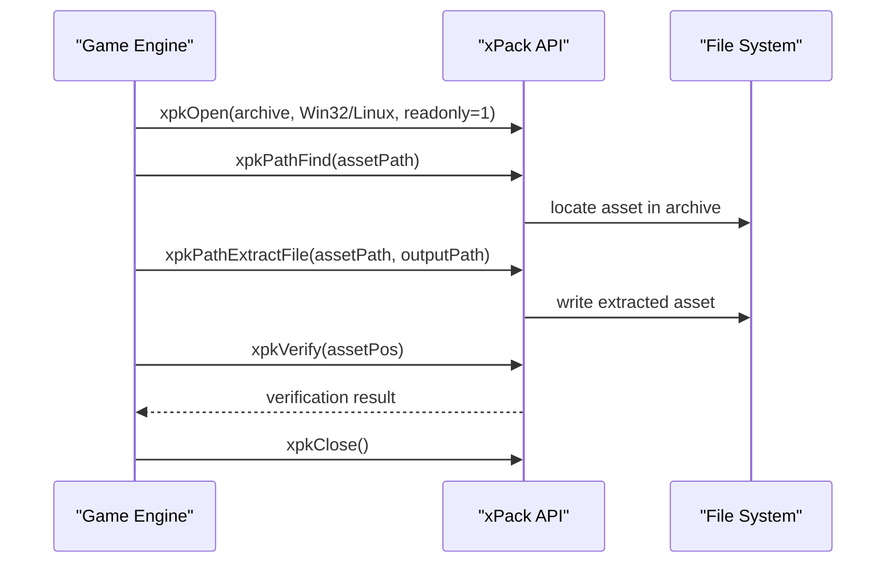
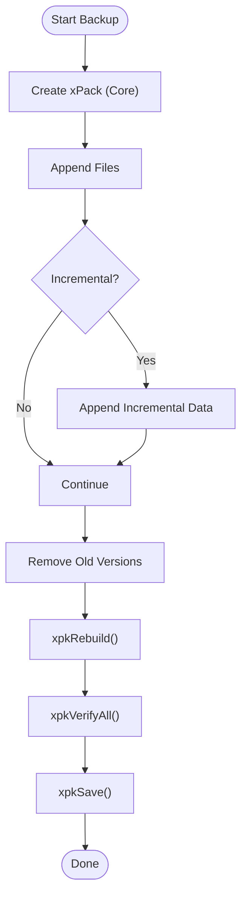
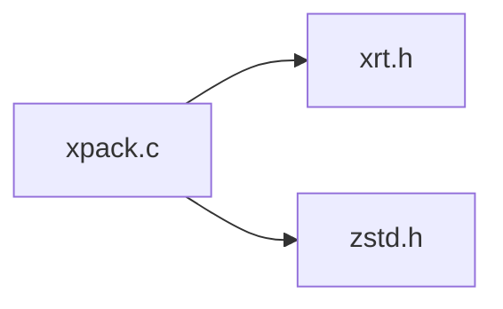

# Integration Examples

<cite>
**Referenced Files in This Document**
- [xpack.h](file://src/xpack.h)
- [xpack.c](file://src/xpack.c)
- [xrt.h](file://lib/xrt/xrt.h)
- [xrt.c](file://lib/xrt/xrt.c)
- [zstd.h](file://lib/zstd/zstd.h)
- [spec.md](file://docs/spec.md)
- [design.md](file://docs/design.md)
- [27_integration_real_world.h](file://test/27_integration_real_world.h)
- [xpkcon.c](file://tools/xpkcon/xpkcon.c)
- [xpkgui.c](file://tools/xpkgui/xpkgui.c)
</cite>

## Table of Contents
1. [Introduction](#introduction)
2. [Project Structure](#project-structure)
3. [Core Components](#core-components)
4. [Architecture Overview](#architecture-overview)
5. [Detailed Component Analysis](#detailed-component-analysis)
6. [Dependency Analysis](#dependency-analysis)
7. [Performance Considerations](#performance-considerations)
8. [Troubleshooting Guide](#troubleshooting-guide)
9. [Conclusion](#conclusion)
10. [Appendices](#appendices)

## Introduction
This document provides practical integration examples for xPack Ver7 across multiple programming languages and environments. It focuses on programmatic integration patterns, including C/C++ library usage, API binding examples for other languages, and framework integration approaches. It covers real-world scenarios such as game engine asset pipelines, software installer creation, backup system integration, and cloud storage optimization. Additionally, it includes performance optimization techniques, memory management strategies, threading considerations, cross-platform deployment strategies, packaging considerations, runtime environment requirements, integration challenges, common pitfalls, and troubleshooting techniques.

## Project Structure
The xPack Ver7 project is organized into:
- Public API headers and core implementation in src/
- Internal libraries in lib/, including xrt (runtime), lz4, zstd, and lzma
- Tools in tools/ (CLI and GUI)
- Comprehensive tests in test/ covering integration scenarios

**Diagram sources**
- [xpack.h](file://src/xpack.h#L1-L447)
- [xpack.c](file://src/xpack.c#L1-L762)
- [xrt.h](file://lib/xrt/xrt.h#L1-L800)
- [xrt.c](file://lib/xrt/xrt.c#L1-L254)
- [zstd.h](file://lib/zstd/zstd.h#L1-L800)
- [xpkcon.c](file://tools/xpkcon/xpkcon.c#L1-L820)
- [xpkgui.c](file://tools/xpkgui/xpkgui.c#L1-L800)
- [27_integration_real_world.h](file://test/27_integration_real_world.h#L1-L361)

**Section sources**
- [xpack.h](file://src/xpack.h#L1-L447)
- [xpack.c](file://src/xpack.c#L1-L762)
- [xrt.h](file://lib/xrt/xrt.h#L1-L800)
- [xrt.c](file://lib/xrt/xrt.c#L1-L254)
- [zstd.h](file://lib/zstd/zstd.h#L1-L800)
- [xpkcon.c](file://tools/xpkcon/xpkcon.c#L1-L820)
- [xpkgui.c](file://tools/xpkgui/xpkgui.c#L1-L800)
- [27_integration_real_world.h](file://test/27_integration_real_world.h#L1-L361)

## Core Components
- xPack public API: lifecycle management, package attributes, file operations, traversal, and utilities
- xrt runtime library: unified platform abstraction for file I/O, memory management, hashing, arrays, threading, and more
- Compression libraries: LZ4/LZ4-HC, ZSTD, and LZMA2 via embedded libraries

Key capabilities:
- Four package types: Core, Index, Linux, Win32
- Compression levels 0–15 with strict monotonicity
- Solid compression mode for reduced metadata overhead
- Volume mode for multi-file archives
- Robust error reporting and verification utilities

**Section sources**
- [xpack.h](file://src/xpack.h#L32-L447)
- [xpack.c](file://src/xpack.c#L49-L297)
- [xrt.h](file://lib/xrt/xrt.h#L1-L800)
- [xrt.c](file://lib/xrt/xrt.c#L88-L226)
- [spec.md](file://docs/spec.md#L34-L105)
- [design.md](file://docs/design.md#L27-L92)

## Architecture Overview
The integration architecture centers around the xPack API, backed by xrt for platform operations and compression libraries for data processing.

**Diagram sources**
- [xpack.h](file://src/xpack.h#L320-L447)
- [xrt.h](file://lib/xrt/xrt.h#L1-L800)
- [xrt.c](file://lib/xrt/xrt.c#L88-L226)
- [zstd.h](file://lib/zstd/zstd.h#L1-L800)

## Detailed Component Analysis

### C/C++ Library Usage
- Initialization and cleanup: xrtInit()/xrtUnit() are invoked internally by xPack; applications typically do not call them directly
- Basic operations: open/save/close, append/update/remove, extract to file or memory, traverse and verify
- Package modes: choose Core/Index/Linux/Win32 based on access patterns and platform requirements
- Compression levels: map 0–15 to algorithms using the internal compression table

Recommended patterns:
- Use xpkOpen with readonly=1 for read-only access
- Use xpkSave before closing to persist changes
- Use xpkVerifyAll for integrity checks post-extraction

**Section sources**
- [xpack.c](file://src/xpack.c#L49-L297)
- [xpack.h](file://src/xpack.h#L320-L447)
- [xrt.c](file://lib/xrt/xrt.c#L88-L226)

### API Binding Examples for Other Languages
- Python: Use ctypes or cffi to bind xPack functions; load the compiled shared library (.so/.dll/.dylib)
- Java: Use JNA or JNI to interface with the C API
- Go: Use CGO to call the C API directly
- Node.js: Use node-ffi-napi or ref-wchar bindings to access the C API

Guidelines:
- Bind xpkOpen/xpkSave/xpkClose for lifecycle
- Bind file operations (append/update/remove/extract)
- Bind traversal and verification utilities
- Handle error callbacks and memory management carefully

[No sources needed since this section provides general guidance]

### Framework Integration Approaches
- Game engines: integrate xPack for asset bundles; use Win32/Linux modes for platform-specific path handling
- Build systems: use CLI tool xpkcon for batch operations
- Desktop apps: integrate xpkgui for drag-and-drop and GUI workflows
- CI/CD: automate packaging and verification using xpkcon commands

**Section sources**
- [xpkcon.c](file://tools/xpkcon/xpkcon.c#L61-L128)
- [xpkgui.c](file://tools/xpkgui/xpkgui.c#L168-L249)

### Real-World Integration Scenarios

#### Game Engine Asset Pipeline
- Package type: Win32/Linux depending on target platform
- Compression: 1–3 for real-time loading (LZ4), 6–10 for distribution builds (ZSTD)
- Operations: append assets, extract on demand, verify integrity

**Diagram sources**
- [xpack.h](file://src/xpack.h#L405-L417)
- [27_integration_real_world.h](file://test/27_integration_real_world.h#L68-L96)

**Section sources**
- [27_integration_real_world.h](file://test/27_integration_real_world.h#L68-L96)
- [spec.md](file://docs/spec.md#L387-L397)

#### Software Installer Creation
- Package type: Win32 for Windows installers
- Compression: 8–10 for balanced size/speed
- Operations: append installer files, extract to target directory, rebuild if needed

**Section sources**
- [27_integration_real_world.h](file://test/27_integration_real_world.h#L211-L235)
- [xpkcon.c](file://tools/xpkcon/xpkcon.c#L339-L442)

#### Backup System Integration
- Package type: Core for fixed-position access
- Compression: 6–8 for general-purpose backups
- Operations: incremental additions, removals, rebuild, verify

**Diagram sources**
- [xpack.h](file://src/xpack.h#L347-L367)
- [27_integration_real_world.h](file://test/27_integration_real_world.h#L294-L318)

**Section sources**
- [27_integration_real_world.h](file://test/27_integration_real_world.h#L294-L318)

#### Cloud Storage Optimization
- Package type: Linux for cross-platform archives
- Compression: 12–15 for maximum compression ratio
- Operations: append large datasets, extract selectively, verify before upload

**Section sources**
- [27_integration_real_world.h](file://test/27_integration_real_world.h#L158-L182)
- [spec.md](file://docs/spec.md#L387-L397)

## Dependency Analysis
xPack depends on:
- xrt for file I/O, memory management, hashing, arrays, threading, and platform abstractions
- Compression libraries (LZ4, ZSTD, LZMA2) integrated via embedded headers

**Diagram sources**
- [xpack.c](file://src/xpack.c#L7-L10)
- [xrt.h](file://lib/xrt/xrt.h#L1-L800)
- [zstd.h](file://lib/zstd/zstd.h#L1-L800)

**Section sources**
- [xpack.c](file://src/xpack.c#L7-L10)
- [xrt.h](file://lib/xrt/xrt.h#L1-L800)
- [zstd.h](file://lib/zstd/zstd.h#L1-L800)

## Performance Considerations
- Compression levels: choose 0–3 for speed, 6–10 for balance, 12–15 for maximum ratio
- Solid mode: reduces metadata overhead for many small files
- Volume mode: splits archives for streaming and storage constraints
- Memory management: use xpkExtractData for in-memory extraction; free returned buffers with xpkFree
- Threading: xrt provides thread primitives; avoid concurrent writes to the same archive

[No sources needed since this section provides general guidance]

## Troubleshooting Guide
Common issues and resolutions:
- Invalid version or signature: ensure file header matches xPack 7.0
- Readonly mode write denied: open with readonly=0 or use appropriate mode
- Memory allocation failures: check available memory and reduce batch sizes
- Hash verification failures: re-extract and verify; check for corruption
- Volume-related errors: validate volume size and split mode settings

**Section sources**
- [xpack.c](file://src/xpack.c#L27-L43)
- [xpack.c](file://src/xpack.c#L622-L640)
- [xpack.h](file://src/xpack.h#L291-L296)

## Conclusion
xPack Ver7 provides a robust, cross-platform solution for packaging and compressing assets with flexible modes, compression levels, and strong verification capabilities. By leveraging the xrt runtime and embedded compression libraries, it enables efficient integration across diverse environments and frameworks. The provided integration scenarios and best practices should accelerate adoption in game engines, installers, backups, and cloud storage workflows.

[No sources needed since this section summarizes without analyzing specific files]

## Appendices

### API Reference Highlights
- Lifecycle: xpkOpen, xpkSave, xpkClose
- Attributes: xpkType, xpkTypeSet, xpkCount, xpkDiscCode, xpkDiscCodeSet, xpkGetHead
- Core operations: xpkAppendFile/Data, xpkExtractFile/Data, xpkUpdateFile/Data, xpkRemove
- Index operations: xpkIndexFind, xpkIndexAppendFile/Data, xpkIndexExtractFile/Data, xpkIndexUpdateFile/Data, xpkIndexRemove, xpkIndexUserData/Set
- Path operations: xpkPathFind, xpkPathExists, xpkPathAppendFile/Data, xpkPathExtractFile/Data, xpkPathUpdateFile/Data, xpkPathRemove, xpkPathGet
- Traversal: xpkEach, xpkEachMatch
- Utilities: xpkExtractAll, xpkAppendDir, xpkFree, xpkHash, xpkVerify, xpkVerifyAll, xpkStatGet, xpkRebuild, xpkLastError, xpkLastErrorMsg

**Section sources**
- [xpack.h](file://src/xpack.h#L320-L447)

### Compression Level Mapping
- Levels 0–15 map to LZ4/LZ4-HC/ZSTD/LZMA2 with strict monotonicity

**Section sources**
- [spec.md](file://docs/spec.md#L34-L77)
- [design.md](file://docs/design.md#L27-L92)