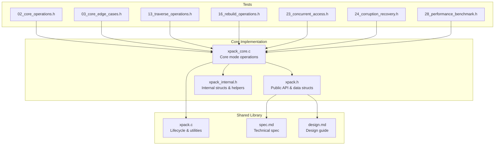
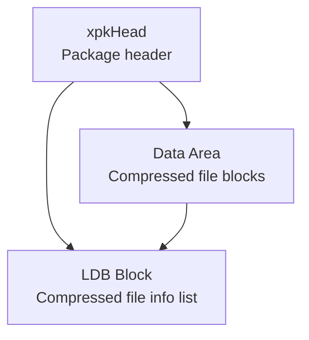
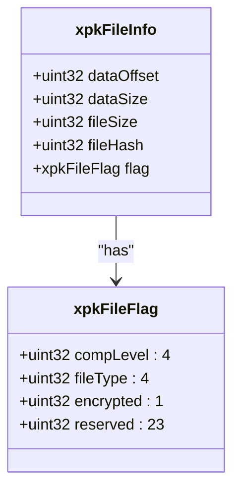
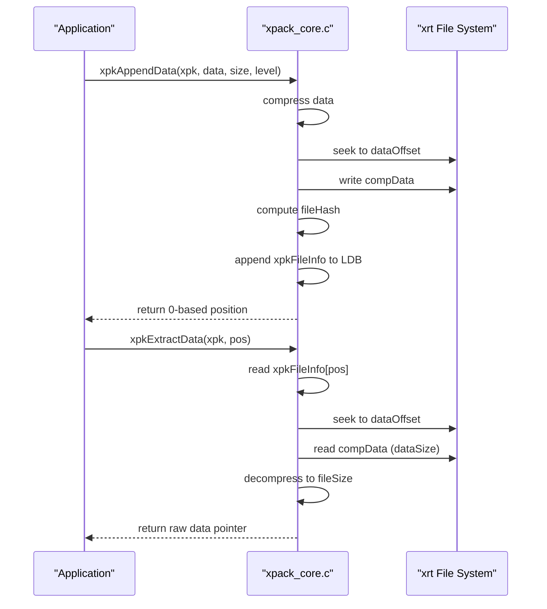
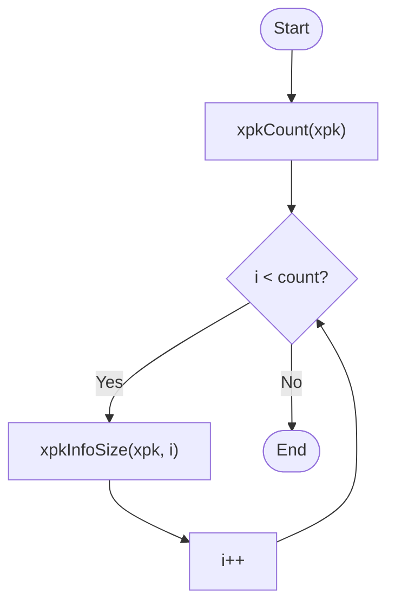
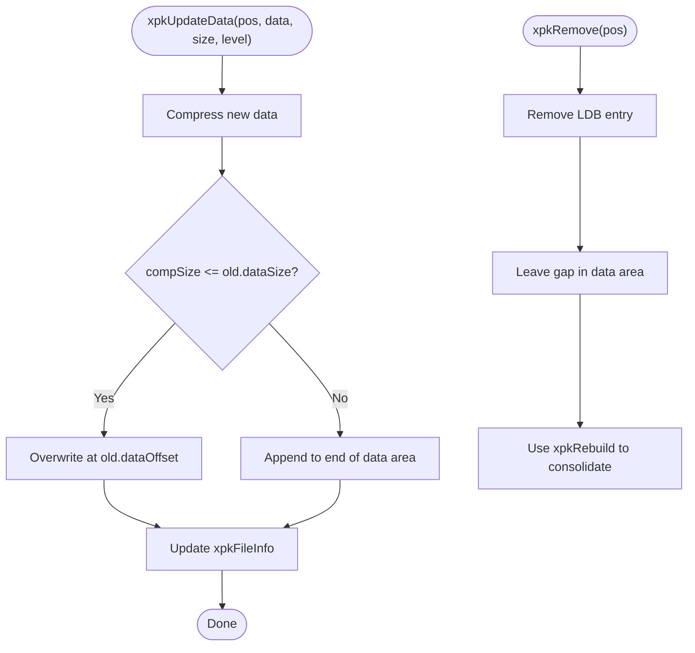
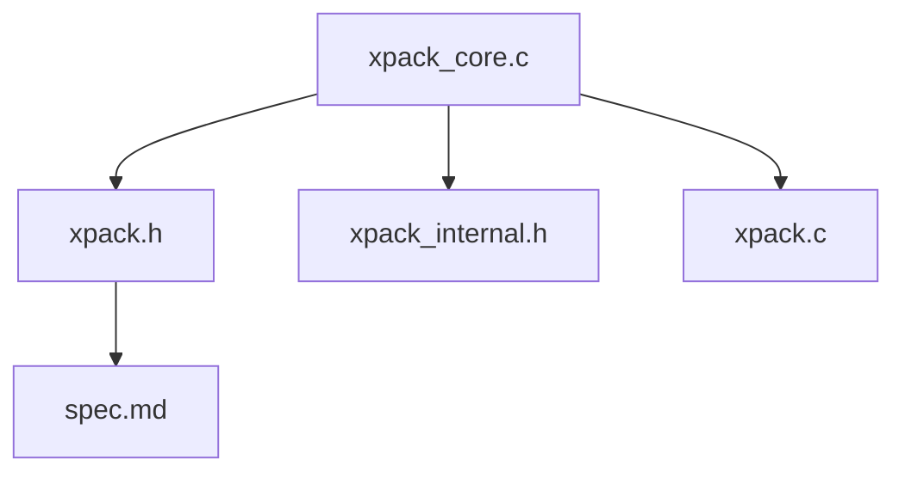

# Core Mode

<cite>
**Referenced Files in This Document**
- [xpack_core.c](file://src/xpack_core.c)
- [xpack.h](file://src/xpack.h)
- [xpack_internal.h](file://src/xpack_internal.h)
- [xpack.c](file://src/xpack.c)
- [spec.md](file://docs/spec.md)
- [design.md](file://docs/design.md)
- [02_core_operations.h](file://test/02_core_operations.h)
- [03_core_edge_cases.h](file://test/03_core_edge_cases.h)
- [13_traverse_operations.h](file://test/13_traverse_operations.h)
- [16_rebuild_operations.h](file://test/16_rebuild_operations.h)
- [23_concurrent_access.h](file://test/23_concurrent_access.h)
- [24_corruption_recovery.h](file://test/24_corruption_recovery.h)
- [28_performance_benchmark.h](file://test/28_performance_benchmark.h)
</cite>

## Table of Contents
1. [Introduction](#introduction)
2. [Project Structure](#project-structure)
3. [Core Components](#core-components)
4. [Architecture Overview](#architecture-overview)
5. [Detailed Component Analysis](#detailed-component-analysis)
6. [Dependency Analysis](#dependency-analysis)
7. [Performance Considerations](#performance-considerations)
8. [Troubleshooting Guide](#troubleshooting-guide)
9. [Conclusion](#conclusion)
10. [Appendices](#appendices)

## Introduction
Core mode is xPack’s simplest package type, designed for sequential access with minimal storage overhead. It stores files in the exact order they were added, making it ideal for straightforward backup scenarios and simple workflows where file enumeration is sequential. Core mode uses a compact 20-byte metadata structure per file and avoids indexing overhead, trading flexibility for simplicity and efficiency.

## Project Structure
Core mode is implemented primarily in the Core module and integrates with the shared xPack library and internal helpers.

**Diagram sources**
- [xpack_core.c](file://src/xpack_core.c#L1-L403)
- [xpack.h](file://src/xpack.h#L1-L447)
- [xpack_internal.h](file://src/xpack_internal.h#L1-L145)
- [xpack.c](file://src/xpack.c#L1-L200)
- [spec.md](file://docs/spec.md#L1-L458)
- [design.md](file://docs/design.md#L96-L126)

**Section sources**
- [xpack_core.c](file://src/xpack_core.c#L1-L403)
- [xpack.h](file://src/xpack.h#L38-L42)
- [spec.md](file://docs/spec.md#L80-L105)

## Core Components
- xpkFileInfo (Core): 20-byte metadata per file containing dataOffset, dataSize, fileSize, fileHash, and compLevel/type flags.
- Core API: Append, extract, update, remove, and info queries using 0-based positions.
- Sequential storage: Files are appended contiguously in the data area; removal leaves gaps; rebuild consolidates storage.

Key characteristics:
- Minimal metadata footprint: 20 bytes per file.
- No indexing overhead: LDB is a simple array of xpkFileInfo.
- Linear access: Position-based access only; no random lookup by name or index.
- Storage consolidation: Use rebuild to reclaim space after deletions or large updates.

**Section sources**
- [xpack.h](file://src/xpack.h#L164-L174)
- [spec.md](file://docs/spec.md#L175-L186)
- [xpack_core.c](file://src/xpack_core.c#L18-L128)

## Architecture Overview
Core mode organizes data as a linear sequence of compressed file blocks with a compact metadata table.

**Diagram sources**
- [spec.md](file://docs/spec.md#L108-L124)
- [xpack.h](file://src/xpack.h#L118-L147)

Core mode specifics:
- xpkFileInfo (20 bytes) holds dataOffset, dataSize, fileSize, fileHash, and flags.
- LDB stores xpkFileInfo entries sequentially; no index table.
- Access pattern: xpkExtractData(pos) reads compData at dataOffset for dataSize bytes, then decompresses to fileSize bytes.

**Section sources**
- [xpack.h](file://src/xpack.h#L164-L174)
- [xpack_core.c](file://src/xpack_core.c#L147-L207)

## Detailed Component Analysis

### xpkFileInfo Structure (Core)
The Core metadata structure is compact and efficient for sequential access.

- dataOffset: Byte offset from baseOffset + header to the compressed data block.
- dataSize: Compressed size of the file.
- fileSize: Original uncompressed size.
- fileHash: 32-bit hash of original data for integrity checks.
- flag: compLevel (compression level), fileType (user-defined), and reserved bits.

**Diagram sources**
- [xpack.h](file://src/xpack.h#L164-L174)
- [xpack.h](file://src/xpack.h#L150-L161)

**Section sources**
- [xpack.h](file://src/xpack.h#L164-L174)
- [xpack.h](file://src/xpack.h#L150-L161)

### Sequential Access Pattern
Core mode supports only position-based access. Files are stored in the order they were appended.

- Append: Compresses data, writes to end of data area, computes fileHash, and appends xpkFileInfo to LDB.
- Extract: Reads compData at dataOffset, decompresses to fileSize, and returns raw data.

**Diagram sources**
- [xpack_core.c](file://src/xpack_core.c#L39-L128)
- [xpack_core.c](file://src/xpack_core.c#L147-L207)

**Section sources**
- [xpack_core.c](file://src/xpack_core.c#L39-L128)
- [xpack_core.c](file://src/xpack_core.c#L147-L207)

### File Enumeration Methods
Core mode provides simple enumeration via position-based iteration.

- Traverse: Iterate from i=0..count-1 to enumerate files and query sizes.
- Match: Use xpkEachMatch for pattern-based filtering (available across modes; Core uses position iteration internally).

**Diagram sources**
- [xpack.h](file://src/xpack.h#L421-L422)
- [13_traverse_operations.h](file://test/13_traverse_operations.h#L64-L87)

**Section sources**
- [xpack.h](file://src/xpack.h#L421-L422)
- [13_traverse_operations.h](file://test/13_traverse_operations.h#L64-L87)

### Update and Remove Behavior
- Update: If new compressed data fits in existing slot, overwrite in place; otherwise append to end and update metadata.
- Remove: Removes entry from LDB; leaves gaps in data area; use rebuild to consolidate storage.

**Diagram sources**
- [xpack_core.c](file://src/xpack_core.c#L234-L326)
- [xpack_core.c](file://src/xpack_core.c#L332-L358)

**Section sources**
- [xpack_core.c](file://src/xpack_core.c#L234-L326)
- [xpack_core.c](file://src/xpack_core.c#L332-L358)

### Practical Usage Scenarios
Choose Core mode when:
- Small file counts and simple workflows are sufficient.
- Sequential access is acceptable; random access by name/index is not required.
- Minimal storage overhead is desired; prefer compact 20-byte metadata.
- Backup scenarios where files are added in a fixed order and retrieved sequentially.

Avoid Core mode when:
- Random access by name/index is required.
- Large file counts with frequent insertions/deletions cause fragmentation.
- Indexing overhead is acceptable for flexible access patterns.

**Section sources**
- [design.md](file://docs/design.md#L107-L124)
- [spec.md](file://docs/spec.md#L387-L397)

### Trade-offs and Migration Considerations
- Simplicity vs. flexibility: Core mode lacks indexing; Index/Linux/Win32 modes offer random access but increase metadata size.
- Storage overhead: Core uses 20 bytes per file; Index uses 28 bytes; Linux/Win32 use larger structures.
- Migration: Use xpkTypeSet to switch modes; note that some operations (e.g., update/remove) have restrictions in solid mode and require rebuild afterward.

**Section sources**
- [xpack.h](file://src/xpack.h#L80-L86)
- [xpack_core.c](file://src/xpack_core.c#L332-L358)
- [16_rebuild_operations.h](file://test/16_rebuild_operations.h#L113-L145)

## Dependency Analysis
Core mode depends on shared structures and utilities.

**Diagram sources**
- [xpack_core.c](file://src/xpack_core.c#L7-L12)
- [xpack.h](file://src/xpack.h#L1-L27)
- [xpack_internal.h](file://src/xpack_internal.h#L10-L11)
- [xpack.c](file://src/xpack.c#L1-L12)

**Section sources**
- [xpack_core.c](file://src/xpack_core.c#L7-L12)
- [xpack.h](file://src/xpack.h#L1-L27)
- [xpack_internal.h](file://src/xpack_internal.h#L10-L11)
- [xpack.c](file://src/xpack.c#L1-L12)

## Performance Considerations
- Sequential access cost: O(1) per file extraction; enumeration is O(n).
- Compression levels: Higher levels improve compression ratio but reduce throughput; default level balances performance and compression.
- Fragmentation: Updates that grow files can leave gaps; periodic rebuild reduces fragmentation and improves access locality.
- Concurrency: Rapid open/close and repeated operations are supported; ensure proper synchronization if sharing files across threads.

Practical tips:
- Use rebuild after bulk deletes or large updates to reclaim space.
- Prefer moderate compression levels for interactive applications.
- Monitor memory usage during extraction; raw buffers equal fileSize.

**Section sources**
- [28_performance_benchmark.h](file://test/28_performance_benchmark.h#L72-L96)
- [23_concurrent_access.h](file://test/23_concurrent_access.h#L1-L27)
- [16_rebuild_operations.h](file://test/16_rebuild_operations.h#L113-L145)

## Troubleshooting Guide
Common issues and resolutions:
- Invalid position errors: Ensure pos < xpkCount(xpk). Use xpkCount to validate.
- Read-only mode denials: Core write operations fail in read-only mode; open with write permission.
- Memory allocation failures: Extraction allocates buffers sized to fileSize; ensure adequate memory.
- Hash verification failures: Indicates corruption or mismatch; verify with xpkVerify or xpkVerifyAll.
- Solid mode restrictions: Update/remove are disallowed in solid mode; disable solid mode or rebuild.

**Section sources**
- [xpack_core.c](file://src/xpack_core.c#L147-L207)
- [xpack_core.c](file://src/xpack_core.c#L234-L326)
- [xpack_core.c](file://src/xpack_core.c#L332-L358)
- [xpack.c](file://src/xpack.c#L27-L43)
- [24_corruption_recovery.h](file://test/24_corruption_recovery.h#L379-L398)

## Conclusion
Core mode delivers a streamlined, low-overhead package type optimized for sequential access and simple workflows. Its 20-byte metadata and lack of indexing make it ideal for small file counts and straightforward backup scenarios. For applications requiring random access or frequent modifications, consider Index/Linux/Win32 modes, and use rebuild to manage storage fragmentation when using Core mode.

## Appendices

### API Reference Highlights (Core)
- Append: xpkAppendFile, xpkAppendData
- Extract: xpkExtractFile, xpkExtractData
- Update: xpkUpdateFile, xpkUpdateData
- Remove: xpkRemove
- Info: xpkInfo, xpkInfoSize, xpkInfoPacked, xpkInfoHash, xpkInfoLevel, xpkInfoType, xpkInfoTypeSet
- Enumeration: xpkEach, xpkEachMatch
- Utilities: xpkVerify, xpkVerifyAll, xpkRebuild

**Section sources**
- [xpack.h](file://src/xpack.h#L369-L441)

### Example Workflows (from tests)
- Basic append and extract: Demonstrates sequential addition and retrieval.
- Update operations: Shows updating existing files with new data.
- Remove and rebuild: Demonstrates deletion and consolidation.
- Edge cases: Handles empty data, large files, invalid positions, and null parameters.

**Section sources**
- [02_core_operations.h](file://test/02_core_operations.h#L7-L47)
- [02_core_operations.h](file://test/02_core_operations.h#L49-L104)
- [02_core_operations.h](file://test/02_core_operations.h#L106-L168)
- [03_core_edge_cases.h](file://test/03_core_edge_cases.h#L7-L28)
- [03_core_edge_cases.h](file://test/03_core_edge_cases.h#L54-L87)
- [16_rebuild_operations.h](file://test/16_rebuild_operations.h#L113-L145)