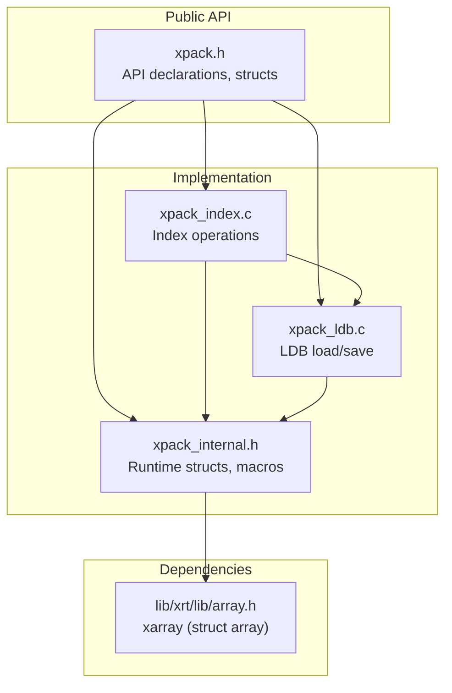
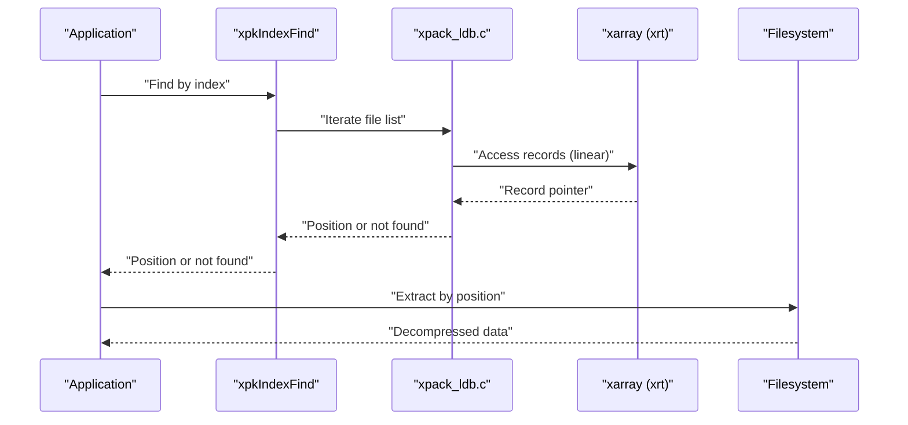
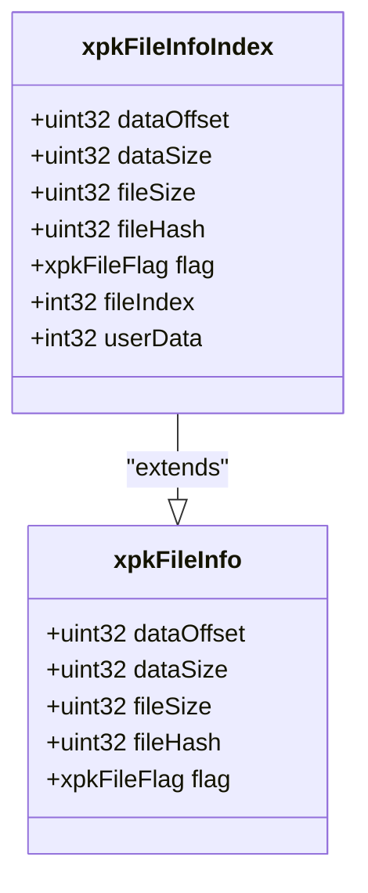
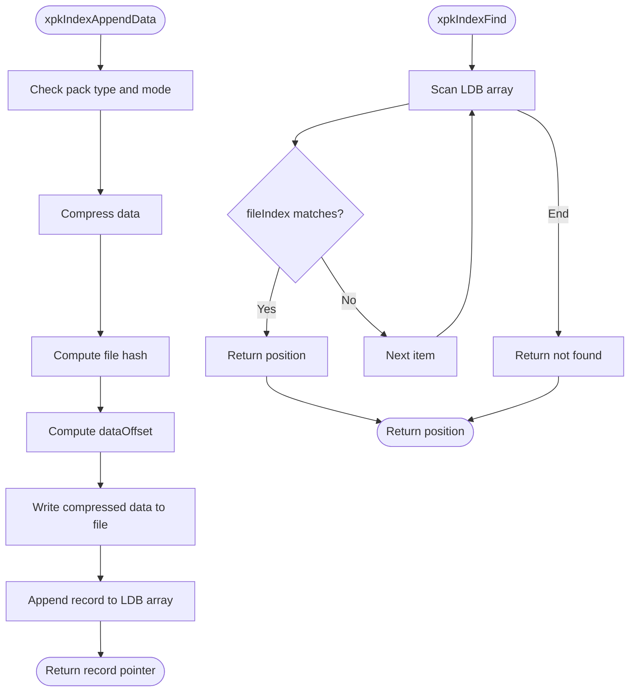
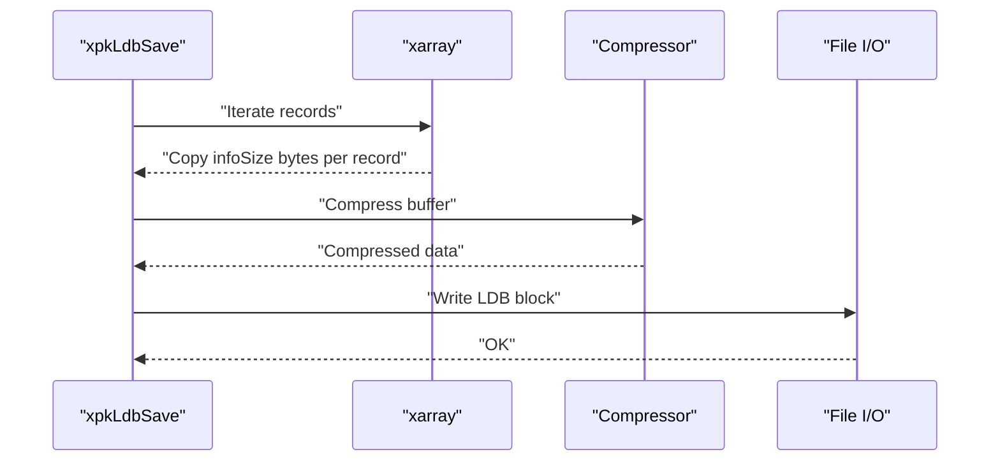
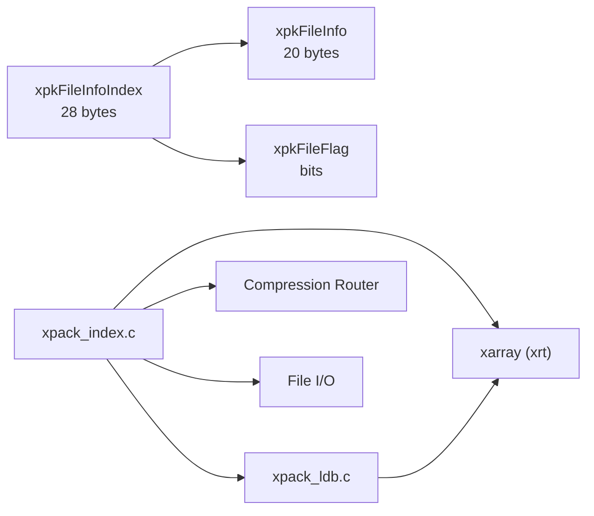

# Index Mode

<cite>
**Referenced Files in This Document**
- [xpack.h](file://src/xpack.h)
- [xpack_index.c](file://src/xpack_index.c)
- [xpack_internal.h](file://src/xpack_internal.h)
- [xpack_ldb.c](file://src/xpack_ldb.c)
- [array.h](file://lib/xrt/lib/array.h)
- [spec.md](file://docs/spec.md)
- [design.md](file://docs/design.md)
- [04_index_operations.h](file://test/04_index_operations.h)
</cite>

## Table of Contents
1. [Introduction](#introduction)
2. [Project Structure](#project-structure)
3. [Core Components](#core-components)
4. [Architecture Overview](#architecture-overview)
5. [Detailed Component Analysis](#detailed-component-analysis)
6. [Dependency Analysis](#dependency-analysis)
7. [Performance Considerations](#performance-considerations)
8. [Troubleshooting Guide](#troubleshooting-guide)
9. [Conclusion](#conclusion)
10. [Appendices](#appendices)

## Introduction
Index Mode is one of four package types in xPack Ver7. It enables O(1) random access to files using integer identifiers, eliminating the need for path traversal. Each file’s metadata record (file information) is extended with an integer index field and a user-defined data field. This makes Index Mode ideal for scenarios requiring fast, deterministic file lookup by application-defined IDs, such as databases, caches, and content-addressable stores.

## Project Structure
Index Mode is implemented as part of the xPack core library. The relevant components include:
- Public API and data structures in the public header
- Index-specific operations in the Index module
- Library Database (LDB) serialization logic
- Internal runtime structures and helpers
- Tests validating Index Mode behavior

**Diagram sources**
- [xpack.h](file://src/xpack.h#L101-L192)
- [xpack_index.c](file://src/xpack_index.c#L1-L290)
- [xpack_ldb.c](file://src/xpack_ldb.c#L1-L198)
- [xpack_internal.h](file://src/xpack_internal.h#L47-L84)
- [array.h](file://lib/xrt/lib/array.h#L1144-L1187)

**Section sources**
- [xpack.h](file://src/xpack.h#L38-L42)
- [xpack.h](file://src/xpack.h#L177-L192)
- [xpack_index.c](file://src/xpack_index.c#L1-L30)
- [xpack_ldb.c](file://src/xpack_ldb.c#L14-L20)
- [xpack_internal.h](file://src/xpack_internal.h#L47-L84)
- [array.h](file://lib/xrt/lib/array.h#L1144-L1187)

## Core Components
- xpkFileInfoIndex structure (28 bytes): Extends the base file info with two 32-bit fields:
  - fileIndex: Integer identifier used for O(1) lookup
  - userData: Arbitrary 32-bit user-defined data for embedding metadata
- Index operations:
  - xpkIndexFind: Linear scan by fileIndex
  - xpkIndexAppendFile/Data: Add new files with explicit index
  - xpkIndexExtractFile/Data: Retrieve files by index
  - xpkIndexUpdateFile/Data: Replace file content by index
  - xpkIndexRemove: Delete by index
  - xpkIndexUserData/UserDataSet: Access and update embedded metadata

These APIs operate on an internal array (xarray) that stores file records contiguously, enabling efficient random access to metadata while maintaining O(1) logical access by index.

**Section sources**
- [xpack.h](file://src/xpack.h#L177-L192)
- [xpack_index.c](file://src/xpack_index.c#L18-L30)
- [xpack_index.c](file://src/xpack_index.c#L36-L174)
- [xpack_index.c](file://src/xpack_index.c#L180-L204)
- [xpack_index.c](file://src/xpack_index.c#L210-L235)
- [xpack_index.c](file://src/xpack_index.c#L241-L252)
- [xpack_index.c](file://src/xpack_index.c#L258-L289)
- [xpack_ldb.c](file://src/xpack_ldb.c#L14-L20)

## Architecture Overview
Index Mode relies on:
- Fixed-size file info records stored in an array
- A linear scan to locate a record by fileIndex
- Direct data block access via precomputed offsets
- Optional user metadata stored per record

**Diagram sources**
- [xpack_index.c](file://src/xpack_index.c#L18-L30)
- [xpack_ldb.c](file://src/xpack_ldb.c#L26-L95)
- [array.h](file://lib/xrt/lib/array.h#L153-L166)

**Section sources**
- [xpack_index.c](file://src/xpack_index.c#L18-L30)
- [xpack_ldb.c](file://src/xpack_ldb.c#L26-L95)
- [array.h](file://lib/xrt/lib/array.h#L153-L166)

## Detailed Component Analysis

### xpkFileInfoIndex Structure
- Size: 28 bytes
- Base fields (20 bytes): dataOffset, dataSize, fileSize, fileHash, flag
- Extended fields (8 bytes): fileIndex (int32), userData (int32)
- Purpose: Enables O(1) logical access by index and embeds application metadata

**Diagram sources**
- [xpack.h](file://src/xpack.h#L164-L174)
- [xpack.h](file://src/xpack.h#L177-L192)

**Section sources**
- [xpack.h](file://src/xpack.h#L177-L192)
- [xpack_ldb.c](file://src/xpack_ldb.c#L14-L20)

### Index Operations Flow
- Append:
  - Validate package type and mode
  - Compress data
  - Compute offsets and hashes
  - Append record to LDB array
- Find:
  - Iterate LDB array and compare fileIndex
- Extract/Update/Remove:
  - Resolve index to position, then delegate to generic position-based operations

**Diagram sources**
- [xpack_index.c](file://src/xpack_index.c#L69-L174)
- [xpack_index.c](file://src/xpack_index.c#L18-L30)

**Section sources**
- [xpack_index.c](file://src/xpack_index.c#L69-L174)
- [xpack_index.c](file://src/xpack_index.c#L18-L30)

### LDB Serialization for Index Mode
- LDB stores fixed-size records (28 bytes for Index)
- Records are serialized contiguously with optional infoExtSize padding
- Load/Save routines compute raw and compressed sizes, compress/decompress, and write/read LDB blocks

**Diagram sources**
- [xpack_ldb.c](file://src/xpack_ldb.c#L101-L198)
- [xpack_ldb.c](file://src/xpack_ldb.c#L14-L20)

**Section sources**
- [xpack_ldb.c](file://src/xpack_ldb.c#L101-L198)
- [xpack_ldb.c](file://src/xpack_ldb.c#L14-L20)

### Practical Examples and Patterns
- Database-like access patterns:
  - Use fileIndex as a primary key
  - Store metadata in userData for auxiliary attributes (e.g., timestamps, categories)
  - Perform batch updates by index without path resolution
- Bulk operations:
  - Append many files with pre-assigned indices
  - Iterate positions to extract or verify all files
- Fast lookup scenarios:
  - Content-addressable stores where keys are integers
  - Caches keyed by numeric identifiers

Note: Example code is not included here; see the test suite for usage patterns.

**Section sources**
- [04_index_operations.h](file://test/04_index_operations.h#L7-L28)
- [04_index_operations.h](file://test/04_index_operations.h#L44-L66)
- [04_index_operations.h](file://test/04_index_operations.h#L68-L89)
- [04_index_operations.h](file://test/04_index_operations.h#L106-L131)

## Dependency Analysis
- xpkFileInfoIndex depends on:
  - xpkFileInfo (base fields)
  - xpkFileFlag (compression level and type)
  - xarray (runtime storage)
- Index operations depend on:
  - LDB load/save for persistence
  - Compression router for data encoding
  - File I/O and hashing utilities

**Diagram sources**
- [xpack.h](file://src/xpack.h#L164-L192)
- [xpack_index.c](file://src/xpack_index.c#L1-L30)
- [xpack_ldb.c](file://src/xpack_ldb.c#L1-L198)
- [array.h](file://lib/xrt/lib/array.h#L1144-L1187)

**Section sources**
- [xpack.h](file://src/xpack.h#L164-L192)
- [xpack_index.c](file://src/xpack_index.c#L1-L30)
- [xpack_ldb.c](file://src/xpack_ldb.c#L1-L198)
- [array.h](file://lib/xrt/lib/array.h#L1144-L1187)

## Performance Considerations
- Lookup complexity:
  - xpkIndexFind performs a linear scan over the LDB array; worst-case O(n)
  - For small to moderate n, this is very fast due to cache locality and compact records
- Memory footprint:
  - Each record is 28 bytes; memory scales linearly with file count
- Throughput:
  - Random access by index avoids path parsing and hashing
  - Batch operations benefit from contiguous LDB layout
- Trade-offs:
  - Index overhead: 8 extra bytes per record compared to Core mode
  - Index uniqueness: Enforced by the append logic (duplicate index rejected)
  - No built-in index structure: If extremely large n is expected, consider external indexing (see Integration Patterns)

[No sources needed since this section provides general guidance]

## Troubleshooting Guide
Common issues and resolutions:
- Index not found:
  - Ensure the index exists and the package type is Index
  - Verify the package was saved after modifications
- Duplicate index:
  - Append operations reject existing indices; choose a new index
- Read-only mode:
  - Index modification APIs return errors in read-only mode
- Solid mode conflict:
  - Index mode does not support solid compression; disable solid mode before appending

**Section sources**
- [xpack_index.c](file://src/xpack_index.c#L18-L30)
- [xpack_index.c](file://src/xpack_index.c#L89-L93)
- [xpack_index.c](file://src/xpack_index.c#L271-L274)
- [xpack_index.c](file://src/xpack_index.c#L83-L87)

## Conclusion
Index Mode in xPack provides a lightweight, deterministic way to manage files using integer identifiers. Its 28-byte records and O(1) logical access by index make it well-suited for high-throughput scenarios where path traversal is unnecessary. While lookups are O(n) due to linear scanning, the compact records and contiguous storage yield excellent performance for typical workloads. For very large datasets, consider maintaining an external index mapping application keys to xPack indices to achieve true O(1) application-level lookups.

[No sources needed since this section summarizes without analyzing specific files]

## Appendices

### API Reference Summary
- Index operations:
  - xpkIndexFind, xpkIndexAppendFile/Data, xpkIndexExtractFile/Data, xpkIndexUpdateFile/Data, xpkIndexRemove, xpkIndexUserData, xpkIndexUserDataSet

**Section sources**
- [xpack.h](file://src/xpack.h#L393-L402)
- [xpack_index.c](file://src/xpack_index.c#L18-L30)
- [xpack_index.c](file://src/xpack_index.c#L36-L174)
- [xpack_index.c](file://src/xpack_index.c#L180-L204)
- [xpack_index.c](file://src/xpack_index.c#L210-L235)
- [xpack_index.c](file://src/xpack_index.c#L241-L252)
- [xpack_index.c](file://src/xpack_index.c#L258-L289)

### Design Notes and Specifications
- Package types and sizes:
  - Index: 28 bytes per record
- Record layout and metadata:
  - Base fields plus fileIndex and userData
- Tests confirm:
  - Basic access, large counts, info retrieval, type setting, and removal behavior

**Section sources**
- [spec.md](file://docs/spec.md#L84-L89)
- [spec.md](file://docs/spec.md#L187-L194)
- [design.md](file://docs/design.md#L100-L106)
- [design.md](file://docs/design.md#L206-L220)
- [04_index_operations.h](file://test/04_index_operations.h#L7-L28)
- [04_index_operations.h](file://test/04_index_operations.h#L44-L66)
- [04_index_operations.h](file://test/04_index_operations.h#L68-L89)
- [04_index_operations.h](file://test/04_index_operations.h#L106-L131)