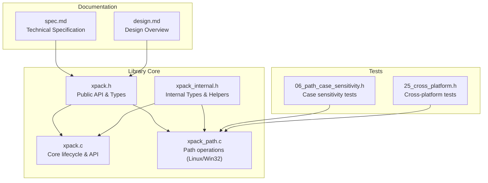
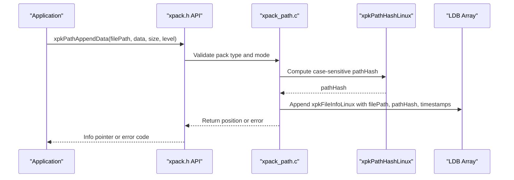
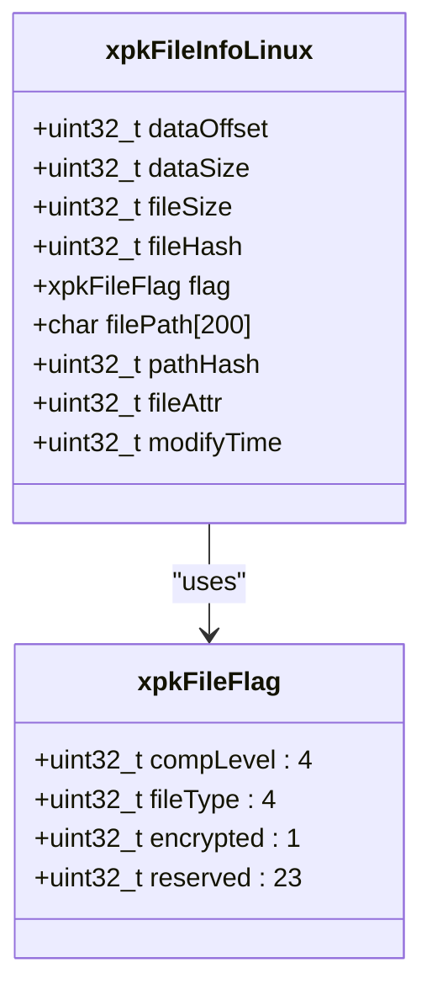
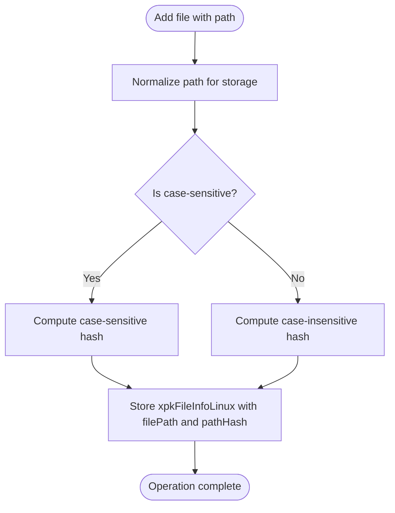
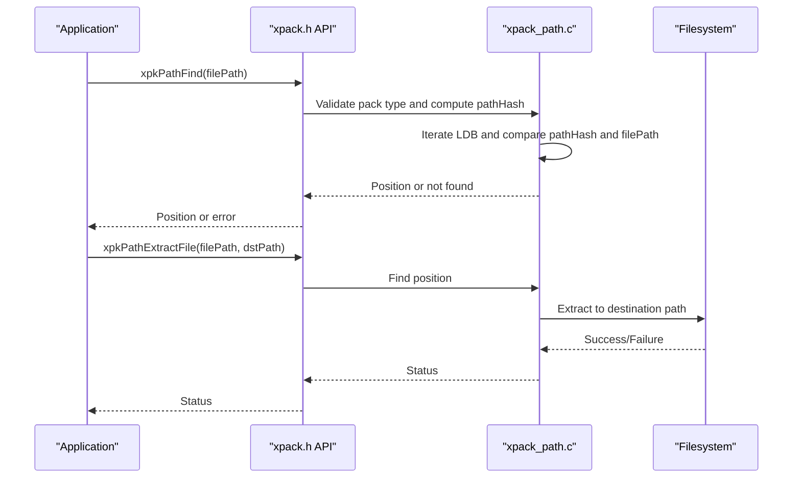
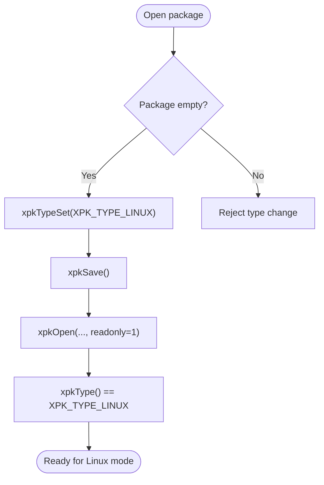
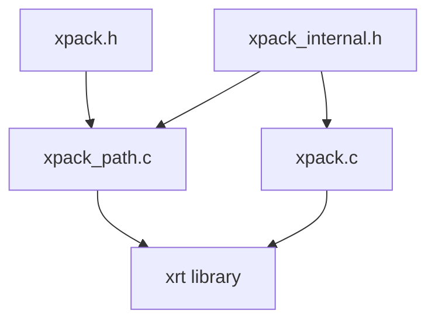

# Linux Mode

<cite>
**Referenced Files in This Document**
- [xpack.h](file://src/xpack.h)
- [xpack_internal.h](file://src/xpack_internal.h)
- [xpack_path.c](file://src/xpack_path.c)
- [xpack.c](file://src/xpack.c)
- [spec.md](file://docs/spec.md)
- [design.md](file://docs/design.md)
- [06_path_case_sensitivity.h](file://test/06_path_case_sensitivity.h)
- [25_cross_platform.h](file://test/25_cross_platform.h)
</cite>

## Table of Contents
1. [Introduction](#introduction)
2. [Project Structure](#project-structure)
3. [Core Components](#core-components)
4. [Architecture Overview](#architecture-overview)
5. [Detailed Component Analysis](#detailed-component-analysis)
6. [Dependency Analysis](#dependency-analysis)
7. [Performance Considerations](#performance-considerations)
8. [Troubleshooting Guide](#troubleshooting-guide)
9. [Conclusion](#conclusion)
10. [Appendices](#appendices)

## Introduction
This document focuses on xPack’s Linux mode package type, which enables case-sensitive path operations and Unix-style file handling. It explains the xpkFileInfoLinux structure (232 bytes), detailing how it stores comprehensive path information, Unix permission bits, ownership details, and extended attributes support. It also covers case-sensitive path handling that preserves original filename casing, hierarchical directory structures, and Unix-specific features such as file permissions, user/group ownership tracking, symbolic link preservation, and extended attribute storage. Practical deployment scenarios on Linux/Unix systems, cross-platform compatibility considerations, integration with existing Unix file management workflows, platform-specific considerations, permission inheritance, and migration strategies from other package types are included.

## Project Structure
The Linux mode implementation is part of the xPack library, which provides four package types: Core, Index, Linux, and Win32. Linux mode is designed for Unix-like systems and uses case-sensitive path semantics, while Win32 mode uses case-insensitive semantics and normalized separators.

**Diagram sources**
- [xpack.h](file://src/xpack.h#L1-L447)
- [xpack_internal.h](file://src/xpack_internal.h#L1-L145)
- [xpack_path.c](file://src/xpack_path.c#L1-L373)
- [xpack.c](file://src/xpack.c#L1-L762)
- [spec.md](file://docs/spec.md#L1-L458)
- [design.md](file://docs/design.md#L1-L485)
- [06_path_case_sensitivity.h](file://test/06_path_case_sensitivity.h#L1-L142)
- [25_cross_platform.h](file://test/25_cross_platform.h#L1-L357)

**Section sources**
- [xpack.h](file://src/xpack.h#L38-L41)
- [xpack_internal.h](file://src/xpack_internal.h#L17-L42)
- [spec.md](file://docs/spec.md#L80-L106)
- [design.md](file://docs/design.md#L96-L125)

## Core Components
- xpkFileInfoLinux structure (232 bytes): Stores file metadata, path information, and Unix-specific attributes.
- Path hashing: Case-sensitive hashing for Linux mode and case-normalized hashing for Win32 mode.
- Path operations: Append, extract, update, remove, and find by path.
- Type switching: Linux mode requires empty packages and is persisted across saves.

Key highlights:
- xpkFileInfoLinux includes filePath (200-byte buffer), pathHash (case-sensitive), fileAttr (Unix permission bits), and modifyTime.
- Path operations use xpkPathHashLinux for case-sensitive lookups.
- Package type can be set to Linux mode only when the package is empty.

**Section sources**
- [xpack.h](file://src/xpack.h#L195-L214)
- [xpack_internal.h](file://src/xpack_internal.h#L112-L113)
- [xpack_path.c](file://src/xpack_path.c#L18-L46)
- [xpack.c](file://src/xpack.c#L308-L329)
- [spec.md](file://docs/spec.md#L195-L215)
- [design.md](file://docs/design.md#L222-L259)

## Architecture Overview
Linux mode integrates with the xPack core to provide path-based access with case-sensitive semantics. The flow below shows how a path operation is routed through the public API to internal path handling and hashing.

**Diagram sources**
- [xpack.h](file://src/xpack.h#L405-L416)
- [xpack_path.c](file://src/xpack_path.c#L138-L279)
- [xpack_internal.h](file://src/xpack_internal.h#L112-L113)

## Detailed Component Analysis

### xpkFileInfoLinux Structure (232 bytes)
The Linux mode file information structure encapsulates:
- Base metadata: dataOffset, dataSize, fileSize, fileHash, flag (compression level, file type).
- Path information: filePath (200-byte buffer), pathHash (case-sensitive).
- Unix attributes: fileAttr (permission bits), modifyTime.

**Diagram sources**
- [xpack.h](file://src/xpack.h#L195-L214)

**Section sources**
- [xpack.h](file://src/xpack.h#L195-L214)
- [spec.md](file://docs/spec.md#L195-L204)

### Case-Sensitive Path Handling
Linux mode preserves original filename casing and supports hierarchical directory structures. Tests demonstrate:
- Different cases are treated as distinct paths.
- Nested directory structures are preserved.
- Unicode and special characters are supported.
- Relative paths and dot segments are handled.

**Diagram sources**
- [xpack_path.c](file://src/xpack_path.c#L18-L46)
- [xpack_path.c](file://src/xpack_path.c#L100-L136)

**Section sources**
- [xpack_path.c](file://src/xpack_path.c#L18-L46)
- [xpack_path.c](file://src/xpack_path.c#L52-L90)
- [06_path_case_sensitivity.h](file://test/06_path_case_sensitivity.h#L7-L21)
- [25_cross_platform.h](file://test/25_cross_platform.h#L198-L217)

### Unix-Specific Features
- File permissions: The fileAttr field is intended to store Unix permission bits. While the current implementation initializes fileAttr to zero during append, the structure supports storing permission masks for future enhancements.
- Ownership tracking: The structure includes modifyTime for modification timestamps. Creation time is tracked in Win32 mode; Linux mode can be extended to track creation time similarly.
- Symbolic links: The structure does not currently include symlink metadata. This can be added by extending fileAttr or introducing additional fields.
- Extended attributes: The structure does not currently include extended attribute storage. This can be implemented by adding a dedicated field or extending the fileAttr field to accommodate extended attribute metadata.

Practical implications:
- Permission inheritance: When extracting files on Unix systems, applications can set permissions based on fileAttr if populated.
- Migration: Existing packages can be migrated by populating fileAttr during extraction or update operations.

**Section sources**
- [xpack.h](file://src/xpack.h#L210-L213)
- [xpack_path.c](file://src/xpack_path.c#L246-L275)
- [spec.md](file://docs/spec.md#L195-L215)

### Path Operations Workflow
The path operations API provides find, exists, append, extract, update, remove, and path retrieval. The Linux mode uses case-sensitive hashing and preserves the original path string.

**Diagram sources**
- [xpack.h](file://src/xpack.h#L407-L416)
- [xpack_path.c](file://src/xpack_path.c#L52-L90)
- [xpack_path.c](file://src/xpack_path.c#L285-L307)

**Section sources**
- [xpack.h](file://src/xpack.h#L407-L416)
- [xpack_path.c](file://src/xpack_path.c#L52-L90)
- [xpack_path.c](file://src/xpack_path.c#L285-L307)

### Package Type Switching and Persistence
Linux mode can be set only when the package is empty. The type is persisted across saves and loads.

**Diagram sources**
- [xpack.c](file://src/xpack.c#L308-L329)
- [xpack.c](file://src/xpack.c#L202-L259)

**Section sources**
- [xpack.c](file://src/xpack.c#L308-L329)
- [xpack.c](file://src/xpack.c#L202-L259)
- [17_package_properties.h](file://test/17_package_properties.h#L203-L233)

## Dependency Analysis
Linux mode depends on:
- Public API in xpack.h for path operations and package lifecycle.
- Internal helpers in xpack_internal.h for hashing and runtime management.
- xrt library for file I/O, arrays, and hashing.

**Diagram sources**
- [xpack.h](file://src/xpack.h#L1-L447)
- [xpack_internal.h](file://src/xpack_internal.h#L1-L145)
- [xpack_path.c](file://src/xpack_path.c#L1-L373)
- [xpack.c](file://src/xpack.c#L1-L762)

**Section sources**
- [xpack.h](file://src/xpack.h#L22-L23)
- [xpack_internal.h](file://src/xpack_internal.h#L10-L11)
- [spec.md](file://docs/spec.md#L318-L350)

## Performance Considerations
- Path hashing: Case-sensitive hashing ensures precise lookups but requires exact casing matches. This reduces ambiguity compared to case-insensitive modes.
- Storage overhead: xpkFileInfoLinux is larger than Core/Index modes (232 bytes vs 20/28 bytes) to accommodate path and attribute fields.
- Compression levels: Choose appropriate compression levels for Linux mode based on workload characteristics (e.g., higher levels for archival, lower levels for real-time access).
- Batch operations: Use batch APIs (e.g., xpkAppendDir, xpkExtractAll) to minimize repeated path lookups and improve throughput.

[No sources needed since this section provides general guidance]

## Troubleshooting Guide
Common issues and resolutions:
- Path not found: Ensure the exact case and path separators match the stored entry. Linux mode is case-sensitive.
- Type change rejected: xpkTypeSet fails if files already exist in the package. Create a new package or clear the existing one.
- Readonly mode errors: Operations that modify the package (append/update/remove) are disallowed in readonly mode.
- Path length limits: Paths must be shorter than XPK_PATH_MAX (200). Exceeding this limit results in errors.

**Section sources**
- [xpack_path.c](file://src/xpack_path.c#L52-L90)
- [xpack.c](file://src/xpack.c#L314-L317)
- [xpack.c](file://src/xpack.c#L204-L207)
- [xpack.h](file://src/xpack.h#L78-L81)

## Conclusion
Linux mode in xPack provides robust, case-sensitive path handling tailored for Unix-like environments. The xpkFileInfoLinux structure (232 bytes) captures essential metadata, path information, and Unix-specific attributes. By preserving original casing and supporting hierarchical directories, it integrates seamlessly with Unix workflows. While the current implementation initializes fileAttr to zero, the structure is ready for future enhancements to support Unix permissions, ownership tracking, symbolic links, and extended attributes. Migration strategies involve populating fileAttr during extraction/update operations, enabling permission inheritance and cross-platform compatibility.

[No sources needed since this section summarizes without analyzing specific files]

## Appendices

### Practical Deployment Scenarios
- Software distribution: Use Linux mode for packages targeting Unix systems where case-sensitivity and permission preservation are critical.
- Game assets: Preserve asset paths and permissions for executable resources.
- DevOps pipelines: Integrate with CI/CD to manage artifacts with exact path semantics.

[No sources needed since this section provides general guidance]

### Cross-Platform Compatibility
- Win32 vs Linux: Win32 mode normalizes separators and uses case-insensitive hashing; Linux mode preserves original casing and separators.
- Separator handling: Linux mode expects forward slashes; ensure paths use Unix-style separators.
- Unicode and special characters: Both modes support Unicode and special characters; validate filesystem support on target platforms.

**Section sources**
- [25_cross_platform.h](file://test/25_cross_platform.h#L77-L93)
- [25_cross_platform.h](file://test/25_cross_platform.h#L180-L196)

### Migration Strategies
- From Core/Index to Linux: Create a new package, set type to Linux, and re-add files. This ensures case-sensitive paths are recorded correctly.
- From Win32 to Linux: Recreate the package in Linux mode; paths will be case-sensitive and Unix-style.
- Permission inheritance: Populate fileAttr during extraction/update to reflect Unix permissions on target systems.

**Section sources**
- [xpack.c](file://src/xpack.c#L308-L329)
- [xpack_path.c](file://src/xpack_path.c#L246-L275)