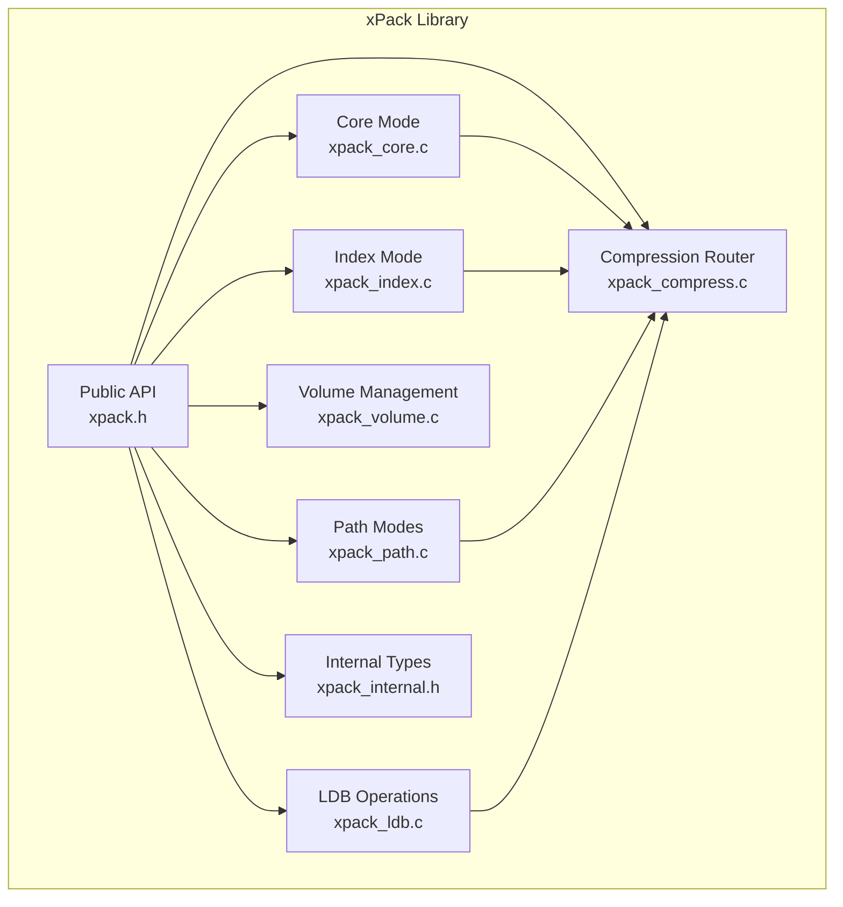
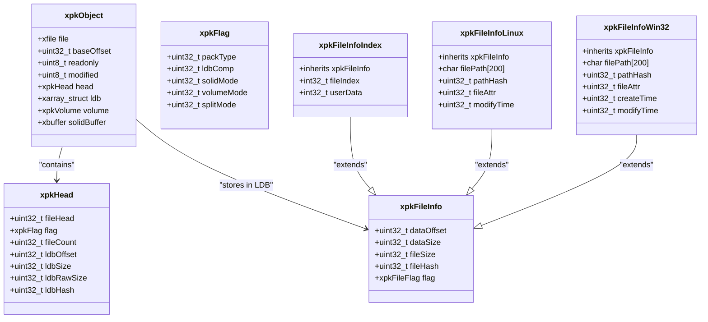
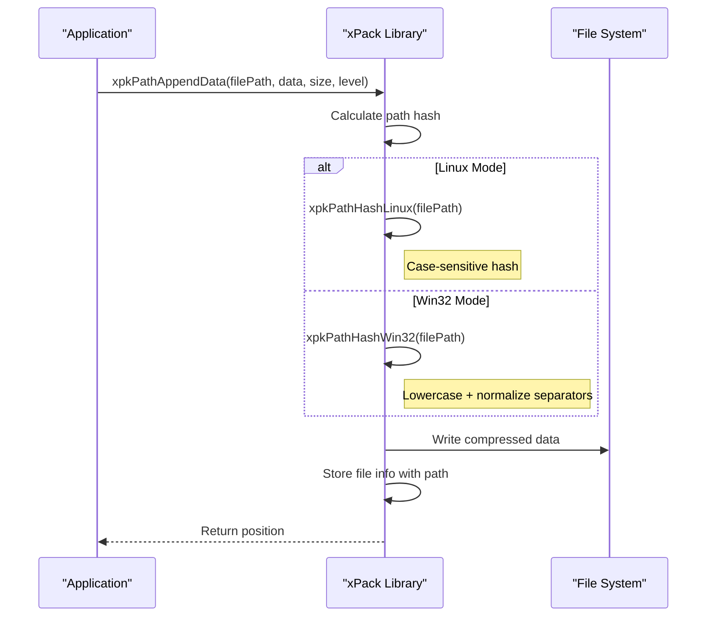
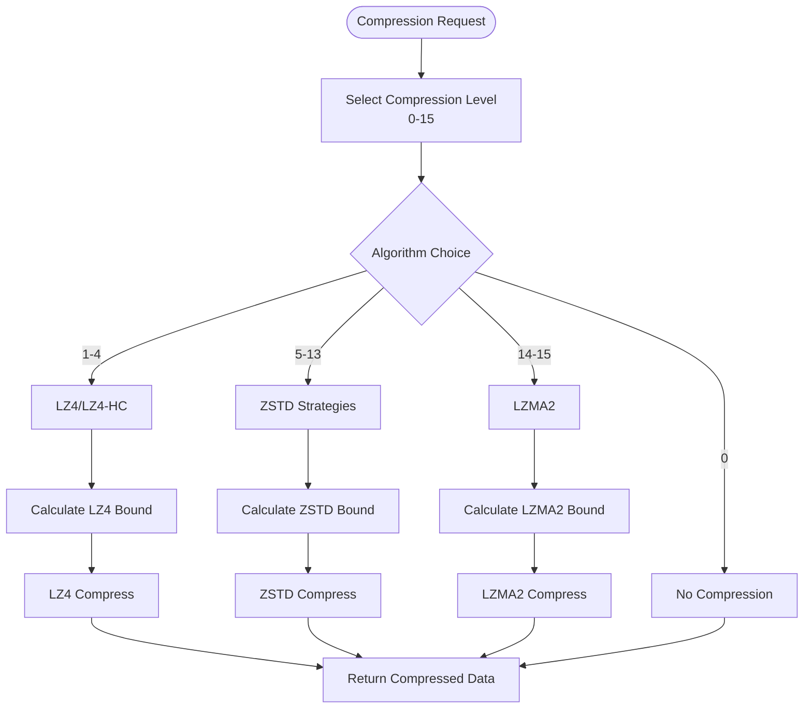
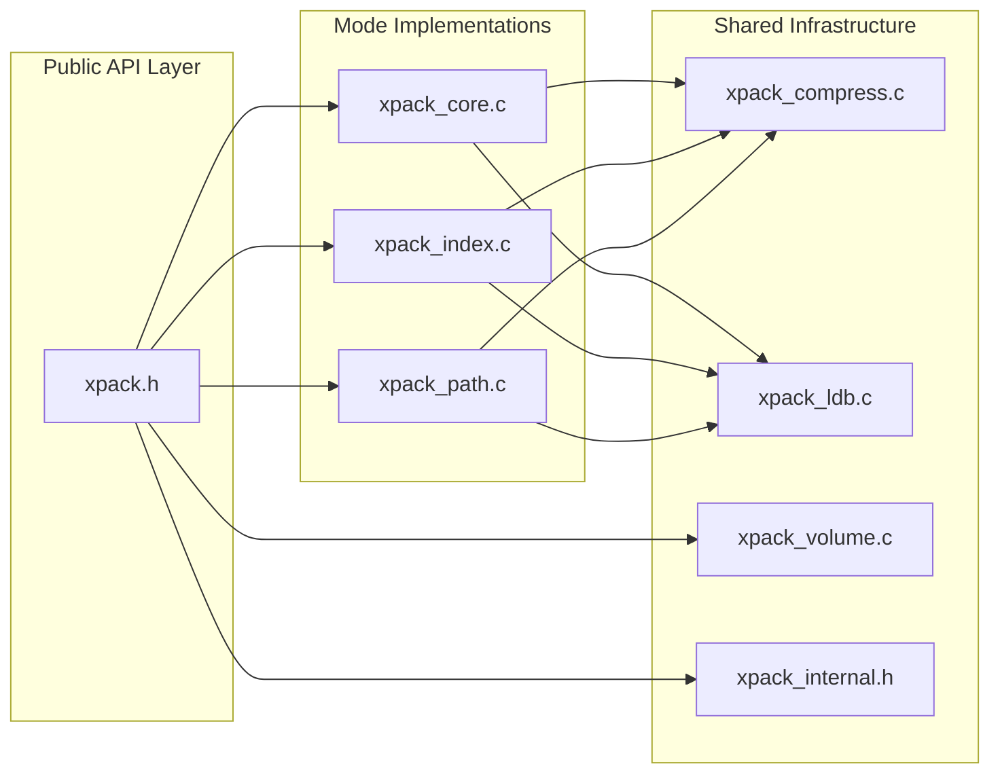
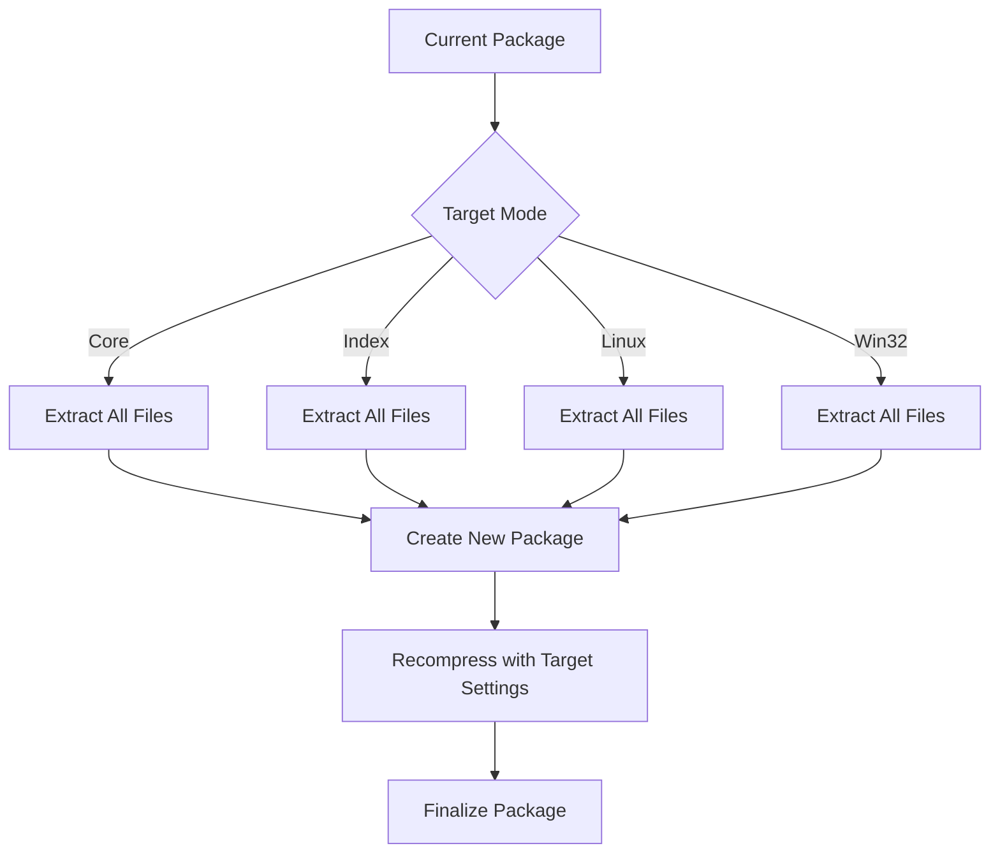
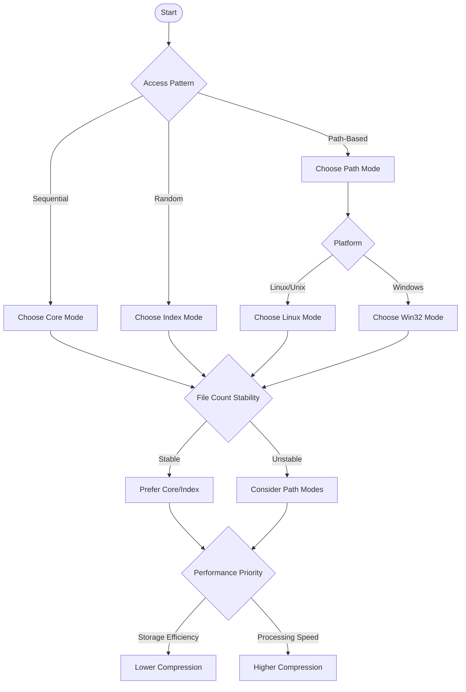

# Mode Selection Guide

<cite>
**Referenced Files in This Document**
- [xpack.h](file://src/xpack.h)
- [xpack_core.c](file://src/xpack_core.c)
- [xpack_index.c](file://src/xpack_index.c)
- [xpack_path.c](file://src/xpack_path.c)
- [xpack_volume.c](file://src/xpack_volume.c)
- [xpack_ldb.c](file://src/xpack_ldb.c)
- [xpack_compress.c](file://src/xpack_compress.c)
- [xpack_internal.h](file://src/xpack_internal.h)
- [spec.md](file://docs/spec.md)
- [25_cross_platform.h](file://test/25_cross_platform.h)
</cite>

## Table of Contents
1. [Introduction](#introduction)
2. [Project Structure](#project-structure)
3. [Core Components](#core-components)
4. [Architecture Overview](#architecture-overview)
5. [Detailed Component Analysis](#detailed-component-analysis)
6. [Dependency Analysis](#dependency-analysis)
7. [Performance Considerations](#performance-considerations)
8. [Troubleshooting Guide](#troubleshooting-guide)
9. [Conclusion](#conclusion)
10. [Appendices](#appendices)

## Introduction
This guide provides comprehensive decision criteria for selecting the appropriate xPack package type based on specific use cases and requirements. It explains the trade-offs between Core mode simplicity versus Index mode random access, Linux mode Unix compatibility versus Win32 mode Windows integration, and case-sensitive versus case-insensitive path handling. It also details migration strategies between modes, including data conversion procedures, compatibility considerations, and performance implications. Practical decision trees and checklists help choose the optimal package type for backup systems, distribution packages, cross-platform applications, and enterprise deployments.

## Project Structure
The xPack library organizes its package modes into distinct modules:
- Core mode: Sequential position-based access with minimal metadata overhead
- Index mode: Integer-indexed access with additional metadata for random access
- Path modes (Linux/Win32): Path-based access with platform-specific path handling and case sensitivity

**Diagram sources**
- [xpack.h](file://src/xpack.h#L322-L447)
- [xpack_core.c](file://src/xpack_core.c#L1-L403)
- [xpack_index.c](file://src/xpack_index.c#L1-L290)
- [xpack_path.c](file://src/xpack_path.c#L1-L373)
- [xpack_volume.c](file://src/xpack_volume.c#L1-L353)
- [xpack_ldb.c](file://src/xpack_ldb.c#L1-L198)
- [xpack_compress.c](file://src/xpack_compress.c#L1-L251)
- [xpack_internal.h](file://src/xpack_internal.h#L1-L145)

**Section sources**
- [xpack.h](file://src/xpack.h#L322-L447)
- [spec.md](file://docs/spec.md#L80-L106)

## Core Components
xPack defines four package types with distinct characteristics:

| Type | Value | Access Pattern | Metadata Size | Case Sensitivity | Platform |
|------|:-----:|----------------|---------------|------------------|----------|
| Core | 0 | Position-based | 20 bytes | N/A | Universal |
| Index | 1 | Integer index | 28 bytes | N/A | Universal |
| Linux | 2 | Path-based | 232 bytes | Case-sensitive | Unix/Linux |
| Win32 | 3 | Path-based | 236 bytes | Case-insensitive | Windows |

Key performance characteristics:
- Core mode offers minimal metadata overhead for simple sequential access
- Index mode enables O(1) random access by integer index at moderate metadata cost
- Path modes support human-readable paths with platform-specific normalization
- All modes support configurable compression levels (0-15) with LZ4, ZSTD, and LZMA2 algorithms

**Section sources**
- [xpack.h](file://src/xpack.h#L38-L41)
- [xpack.h](file://src/xpack.h#L84-L86)
- [xpack.h](file://src/xpack.h#L164-L237)
- [spec.md](file://docs/spec.md#L84-L89)

## Architecture Overview
The xPack architecture separates concerns across modes while sharing common infrastructure:

**Diagram sources**
- [xpack_internal.h](file://src/xpack_internal.h#L47-L84)
- [xpack.h](file://src/xpack.h#L120-L237)

**Section sources**
- [xpack_internal.h](file://src/xpack_internal.h#L47-L84)
- [xpack.h](file://src/xpack.h#L120-L237)

## Detailed Component Analysis

### Core Mode Analysis
Core mode provides the simplest and most efficient package type for sequential access patterns.

Key characteristics:
- Minimal metadata overhead (20 bytes per file)
- Sequential access only (0-based positions)
- No path or index overhead
- Supports solid compression for improved compression ratios
- Read-only mode restrictions apply to updates and removals

Performance considerations:
- Fastest append operations due to sequential layout
- Efficient sequential extraction without lookup overhead
- Best compression ratios when combined with solid mode for similar files
- Memory footprint scales linearly with file count

Limitations:
- Cannot update or remove files in solid mode
- No random access capability
- Not suitable for applications requiring path-based access

**Section sources**
- [xpack_core.c](file://src/xpack_core.c#L18-L128)
- [xpack_core.c](file://src/xpack_core.c#L213-L326)
- [xpack_core.c](file://src/xpack_core.c#L332-L358)

### Index Mode Analysis
Index mode enables random access through integer indices with additional metadata overhead.

Key characteristics:
- Integer index-based access (O(1) lookup)
- Additional 8 bytes of metadata per file (28 bytes total)
- Supports user-defined data associated with each index
- Disallows updates and removals in solid mode
- Requires unique index assignment

Performance considerations:
- Fast random access for applications with known indices
- Moderate metadata overhead for random access capability
- Suitable for dynamic content management with stable indices
- User data field enables custom metadata storage

Limitations:
- Index uniqueness requirement prevents duplicate entries
- No path-based navigation
- Index gaps require careful management

**Section sources**
- [xpack_index.c](file://src/xpack_index.c#L18-L30)
- [xpack_index.c](file://src/xpack_index.c#L69-L174)
- [xpack_index.c](file://src/xpack_index.c#L241-L252)

### Path Modes Analysis (Linux vs Win32)
Path modes provide human-readable access through file paths with platform-specific handling.

#### Linux Mode (Case-Sensitive)
- Path-based access with Unix-style paths
- Case-sensitive path handling
- 232 bytes of metadata per file
- Uses original path representation
- Supports Unix file attributes and modification times

#### Win32 Mode (Case-Insensitive)
- Path-based access with Windows-style normalization
- Case-insensitive path handling with lowercase conversion
- 236 bytes of metadata per file
- Normalizes backslashes to forward slashes
- Includes creation and modification times

**Diagram sources**
- [xpack_path.c](file://src/xpack_path.c#L18-L46)
- [xpack_path.c](file://src/xpack_path.c#L138-L279)

**Section sources**
- [xpack_path.c](file://src/xpack_path.c#L18-L46)
- [xpack_path.c](file://src/xpack_path.c#L52-L90)
- [xpack_path.c](file://src/xpack_path.c#L138-L279)
- [25_cross_platform.h](file://test/25_cross_platform.h#L15-L52)

### Compression and Storage Efficiency
xPack supports multiple compression algorithms with tunable performance characteristics:

**Diagram sources**
- [xpack_compress.c](file://src/xpack_compress.c#L20-L147)
- [xpack_compress.c](file://src/xpack_compress.c#L227-L250)

Compression characteristics:
- Level 0: Uncompressed data (fastest, largest)
- Levels 1-4: LZ4/LZ4-HC (fast compression, good speed)
- Levels 5-13: ZSTD (balanced compression ratio and speed)
- Levels 14-15: LZMA2 (highest compression, slowest)

**Section sources**
- [xpack_compress.c](file://src/xpack_compress.c#L20-L147)
- [xpack_compress.c](file://src/xpack_compress.c#L227-L250)
- [spec.md](file://docs/spec.md#L34-L77)

## Dependency Analysis
The xPack library maintains clear separation between modes while sharing common infrastructure:

**Diagram sources**
- [xpack.h](file://src/xpack.h#L322-L447)
- [xpack_core.c](file://src/xpack_core.c#L1-L403)
- [xpack_index.c](file://src/xpack_index.c#L1-L290)
- [xpack_path.c](file://src/xpack_path.c#L1-L373)
- [xpack_compress.c](file://src/xpack_compress.c#L1-L251)
- [xpack_ldb.c](file://src/xpack_ldb.c#L1-L198)
- [xpack_volume.c](file://src/xpack_volume.c#L1-L353)
- [xpack_internal.h](file://src/xpack_internal.h#L1-L145)

**Section sources**
- [xpack.h](file://src/xpack.h#L322-L447)
- [xpack_internal.h](file://src/xpack_internal.h#L1-L145)

## Performance Considerations
Performance varies significantly across modes and use cases:

### File Count Stability Impact
- **Core mode**: Linear scaling with file count, minimal metadata overhead
- **Index mode**: Additional O(n) metadata storage for indices
- **Path modes**: Highest metadata overhead (232-236 bytes per file)
- **Solid compression**: Reduces metadata overhead for similar files but restricts updates

### Access Pattern Characteristics
- **Sequential access**: Core mode optimal for streaming operations
- **Random access**: Index mode optimal for sparse access patterns
- **Path-based access**: Path modes optimal for human-readable navigation

### Platform Performance Notes
- **Linux mode**: Case-sensitive hashing provides deterministic access
- **Win32 mode**: Case-insensitive normalization adds processing overhead
- **Cross-platform**: Path modes handle platform differences transparently

### Compression Performance Trade-offs
- **High compression levels**: Better storage efficiency but slower processing
- **Low compression levels**: Faster processing but larger storage footprint
- **Solid compression**: Improves compression ratios for similar files but restricts modifications

**Section sources**
- [xpack_core.c](file://src/xpack_core.c#L18-L128)
- [xpack_index.c](file://src/xpack_index.c#L69-L174)
- [xpack_path.c](file://src/xpack_path.c#L18-L46)
- [xpack_compress.c](file://src/xpack_compress.c#L20-L147)

## Troubleshooting Guide

### Common Mode Selection Issues
- **Core mode limitations**: Cannot update or remove files in solid mode
- **Index mode conflicts**: Duplicate indices cause append failures
- **Path mode collisions**: Case-insensitive paths may collide on Windows
- **Memory constraints**: Path modes consume significantly more memory per file

### Migration Between Modes
Direct conversion between modes requires rebuilding the package:

**Diagram sources**
- [xpack_core.c](file://src/xpack_core.c#L18-L128)
- [xpack_index.c](file://src/xpack_index.c#L69-L174)
- [xpack_path.c](file://src/xpack_path.c#L138-L279)

### Compatibility Considerations
- **Version compatibility**: xPack maintains backward compatibility with version 6 format
- **Platform differences**: Path modes automatically handle platform-specific path differences
- **Case sensitivity**: Linux mode preserves case, Win32 mode normalizes case
- **Metadata preservation**: Some metadata may not transfer between modes during migration

**Section sources**
- [spec.md](file://docs/spec.md#L23-L31)
- [xpack_path.c](file://src/xpack_path.c#L24-L46)

## Conclusion
Selecting the optimal xPack package type depends on specific requirements for access patterns, platform compatibility, and performance characteristics. Core mode excels in simple sequential scenarios, Index mode provides flexible random access, and Path modes offer human-readable navigation with platform-specific handling. Consider file count stability, access patterns, platform requirements, storage efficiency, and performance characteristics when making your selection. For mixed environments, Path modes provide the most flexibility while maintaining compatibility across platforms.

## Appendices

### Decision Tree: Mode Selection Criteria

### Practical Checklists

#### Backup Systems
- **Sequential access**: Core mode preferred
- **Large file counts**: Consider solid compression
- **Cross-platform deployment**: Path modes with platform detection
- **Storage constraints**: Lower compression levels

#### Distribution Packages
- **Windows integration**: Win32 mode for case-insensitive access
- **Linux compatibility**: Linux mode for case-sensitive paths
- **Package size**: Higher compression levels acceptable
- **Installation speed**: Balance compression with extraction performance

#### Cross-Platform Applications
- **Consistent behavior**: Path modes handle platform differences
- **Case sensitivity**: Linux mode for Unix compatibility
- **Path normalization**: Win32 mode for Windows conventions
- **Deployment complexity**: Consider single-mode deployment

#### Enterprise Deployments
- **Management requirements**: Path modes for human-readable access
- **Performance monitoring**: Track compression ratios and access patterns
- **Upgrade paths**: Plan for version migrations and mode conversions
- **Support costs**: Balance feature richness with maintenance complexity

### Migration Procedures

#### Core to Path Mode
1. Extract all files from Core package
2. Create new Path package with target platform
3. Recompress files with desired compression level
4. Validate file integrity and access patterns

#### Index to Path Mode
1. Export index-to-path mapping from Index package
2. Extract files using index references
3. Create new Path package with preserved paths
4. Verify path resolution and case handling

#### Path to Core Mode
1. Extract all files with path information
2. Create new Core package in sequential order
3. Recompress with optimal settings
4. Update application logic to use position-based access

**Section sources**
- [xpack_core.c](file://src/xpack_core.c#L18-L128)
- [xpack_index.c](file://src/xpack_index.c#L69-L174)
- [xpack_path.c](file://src/xpack_path.c#L138-L279)