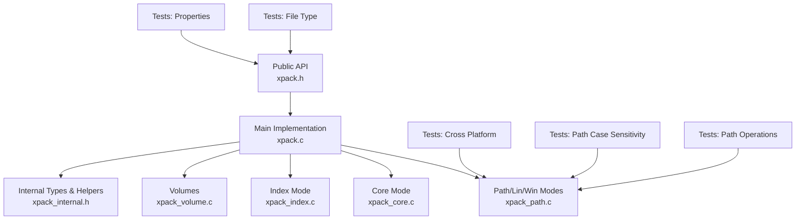
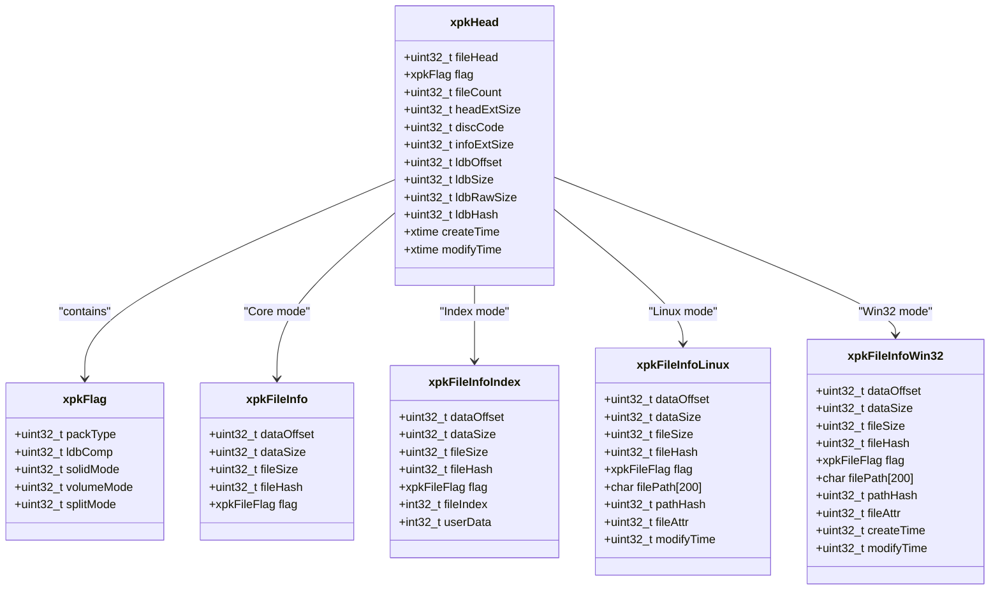
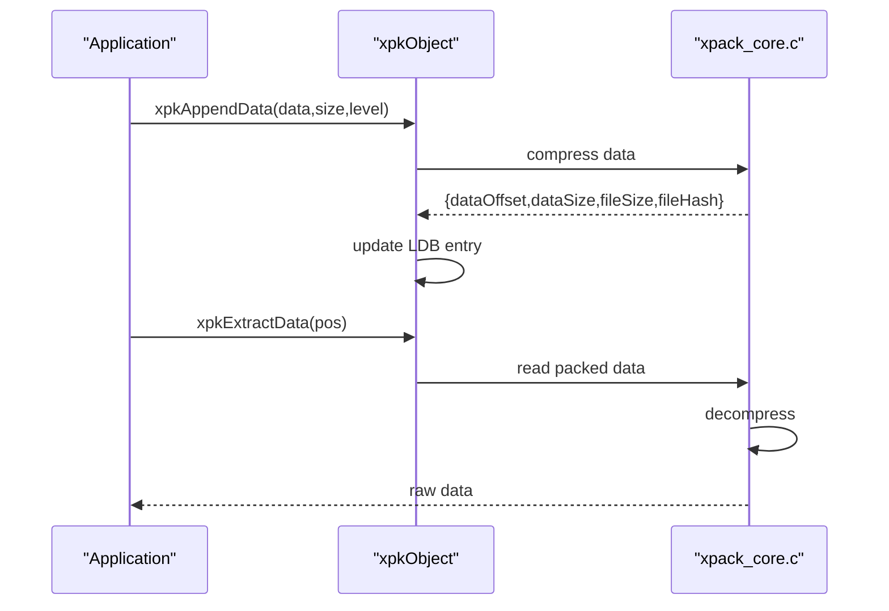
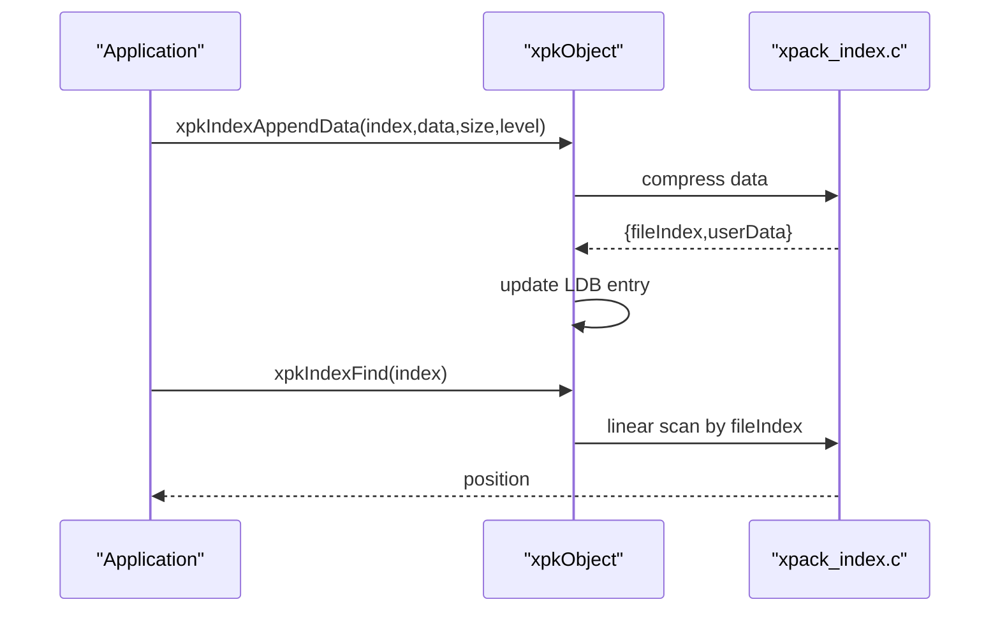
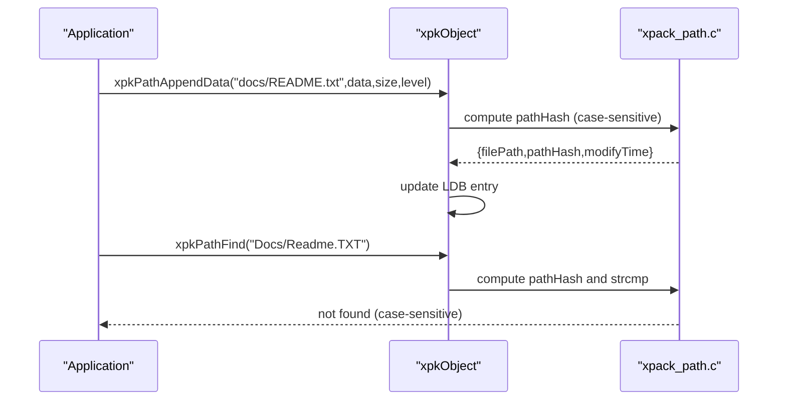
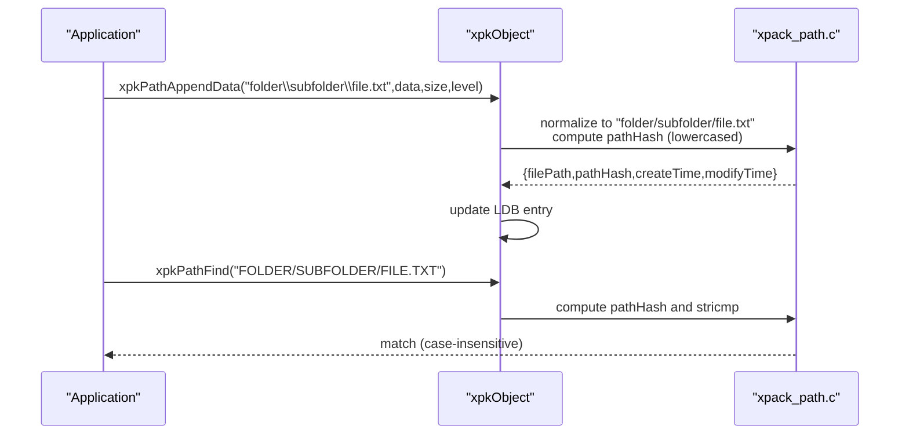
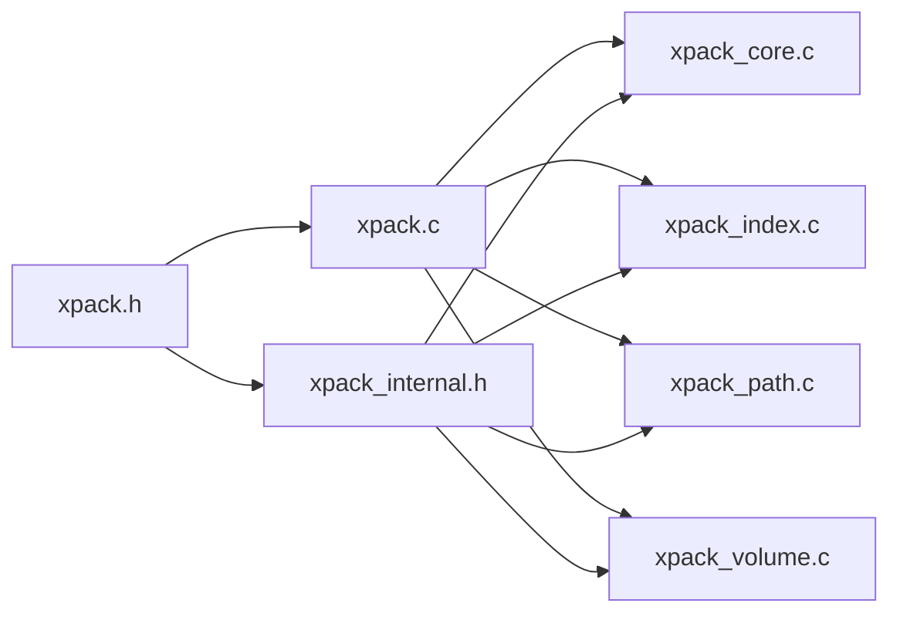

# Package Types

<cite>
**Referenced Files in This Document**
- [xpack.h](file://src/xpack.h)
- [xpack_internal.h](file://src/xpack_internal.h)
- [xpack.c](file://src/xpack.c)
- [xpack_core.c](file://src/xpack_core.c)
- [xpack_index.c](file://src/xpack_index.c)
- [xpack_path.c](file://src/xpack_path.c)
- [xpack_volume.c](file://src/xpack_volume.c)
- [17_package_properties.h](file://test/17_package_properties.h)
- [18_file_type.h](file://test/18_file_type.h)
- [25_cross_platform.h](file://test/25_cross_platform.h)
- [06_path_case_sensitivity.h](file://test/06_path_case_sensitivity.h)
- [05_path_operations.h](file://test/05_path_operations.h)
</cite>

## Table of Contents
1. [Introduction](#introduction)
2. [Project Structure](#project-structure)
3. [Core Components](#core-components)
4. [Architecture Overview](#architecture-overview)
5. [Detailed Component Analysis](#detailed-component-analysis)
6. [Dependency Analysis](#dependency-analysis)
7. [Performance Considerations](#performance-considerations)
8. [Troubleshooting Guide](#troubleshooting-guide)
9. [Conclusion](#conclusion)
10. [Appendices](#appendices)

## Introduction
This document explains xPack’s four package types and how to select and use them effectively. It covers:
- Core mode: sequential access with minimal storage overhead
- Index mode: integer-based file identification with custom user data
- Linux mode: case-sensitive path operations
- Win32 mode: case-insensitive Windows-compatible path handling

It also details selection criteria (file count stability, access patterns, platform requirements, storage efficiency), internal data structures, path handling differences, migration between modes, and cross-platform considerations.

## Project Structure
The package type system is implemented across public and internal headers, the main library implementation, and specialized operation modules for each mode. Tests demonstrate usage patterns and platform behaviors.

**Diagram sources**
- [xpack.h](file://src/xpack.h#L35-L42)
- [xpack.c](file://src/xpack.c#L14-L19)
- [xpack_core.c](file://src/xpack_core.c#L1-L403)
- [xpack_index.c](file://src/xpack_index.c#L1-L290)
- [xpack_path.c](file://src/xpack_path.c#L1-L373)
- [xpack_volume.c](file://src/xpack_volume.c#L1-L353)
- [xpack_internal.h](file://src/xpack_internal.h#L1-L145)
- [17_package_properties.h](file://test/17_package_properties.h#L1-L517)
- [18_file_type.h](file://test/18_file_type.h#L1-L389)
- [25_cross_platform.h](file://test/25_cross_platform.h#L1-L357)
- [06_path_case_sensitivity.h](file://test/06_path_case_sensitivity.h#L1-L142)
- [05_path_operations.h](file://test/05_path_operations.h#L1-L187)

**Section sources**
- [xpack.h](file://src/xpack.h#L35-L42)
- [xpack.c](file://src/xpack.c#L14-L19)

## Core Components
- Package types are defined as constants and selected via xpkTypeSet during initialization of an empty package.
- The library stores per-file metadata in a dynamic list (LDB) whose element size depends on the selected package type.
- Path modes (Linux/Win32) embed full paths and hashes for fast lookup; Index mode stores an integer index plus optional user data; Core mode stores only positional metadata.

Key behaviors:
- Type change is allowed only on empty packages and persists across saves.
- Path modes enforce uniqueness of stored paths; Index mode enforces uniqueness of indices.
- Solid mode is incompatible with update/remove operations and restricts type changes.

**Section sources**
- [xpack.h](file://src/xpack.h#L35-L42)
- [xpack.c](file://src/xpack.c#L308-L329)
- [xpack.c](file://src/xpack.c#L314-L317)
- [xpack.c](file://src/xpack.c#L366-L408)
- [xpack_core.c](file://src/xpack_core.c#L332-L358)
- [xpack_index.c](file://src/xpack_index.c#L89-L93)
- [xpack_path.c](file://src/xpack_path.c#L164-L168)

## Architecture Overview
The package type determines the file metadata layout and access method. The runtime LDB array holds entries sized according to the chosen mode. Path modes compute a hash of the path (case-sensitive for Linux, case-insensitive for Win32) and compare both hash and string to resolve collisions.

**Diagram sources**
- [xpack.h](file://src/xpack.h#L118-L236)

**Section sources**
- [xpack.h](file://src/xpack.h#L118-L236)

## Detailed Component Analysis

### Core Mode (Sequential Access)
- Purpose: Minimal storage overhead; files accessed by position.
- Metadata: Fixed-size record with data offset, packed/unpacked sizes, hash, and compression level/type flags.
- Operations: Append/extract/update/remove by position; supports solid mode.
- Storage efficiency: Best for large homogeneous datasets where order is stable and random access is not required.

Selection criteria:
- Stable file counts
- Sequential or batch processing
- Need for solid compression
- No path-based lookups

Migration:
- Can change type only when empty; otherwise use xpkTypeSet on a new package.

Practical example:
- Batch compress logs or telemetry data where order matters and paths are not needed.

**Diagram sources**
- [xpack_core.c](file://src/xpack_core.c#L39-L128)
- [xpack_core.c](file://src/xpack_core.c#L147-L207)

**Section sources**
- [xpack_core.c](file://src/xpack_core.c#L18-L128)
- [xpack_core.c](file://src/xpack_core.c#L134-L207)
- [xpack_core.c](file://src/xpack_core.c#L332-L358)
- [xpack.c](file://src/xpack.c#L308-L329)

### Index Mode (Integer-Based Identification)
- Purpose: Random access by integer index; supports custom user data per file.
- Metadata: Core fields plus fileIndex and userData.
- Operations: Find/append/extract/update/remove by index; index must be unique.
- Storage efficiency: Slightly larger than Core due to index and user data fields.

Selection criteria:
- Known integer identifiers
- Need to store small per-file metadata alongside files
- Random access by ID preferred over path lookups

Migration:
- Can change type only when empty; otherwise use xpkTypeSet on a new package.

Practical example:
- Packaging assets with numeric IDs, attaching per-file flags or categories.

**Diagram sources**
- [xpack_index.c](file://src/xpack_index.c#L36-L174)
- [xpack_index.c](file://src/xpack_index.c#L18-L30)

**Section sources**
- [xpack_index.c](file://src/xpack_index.c#L18-L30)
- [xpack_index.c](file://src/xpack_index.c#L36-L174)
- [xpack_index.c](file://src/xpack_index.c#L241-L252)

### Linux Mode (Case-Sensitive Paths)
- Purpose: POSIX-style path handling with case sensitivity.
- Metadata: Core fields plus filePath (up to 200 chars), pathHash (case-sensitive), file attributes, and modification time.
- Operations: Path-based find/append/extract/update/remove; path uniqueness enforced.
- Storage efficiency: Larger records due to embedded path and hash.

Selection criteria:
- Unix-like systems or portable POSIX semantics
- Need case-sensitive distinction between files like README.txt and readme.txt

Migration:
- Can change type only when empty; otherwise use xpkTypeSet on a new package.

Practical example:
- Packaging source code or documentation where case-sensitivity matters.

**Diagram sources**
- [xpack_path.c](file://src/xpack_path.c#L100-L136)
- [xpack_path.c](file://src/xpack_path.c#L52-L90)
- [xpack_path.c](file://src/xpack_path.c#L18-L46)

**Section sources**
- [xpack_path.c](file://src/xpack_path.c#L18-L46)
- [xpack_path.c](file://src/xpack_path.c#L52-L90)
- [xpack_path.c](file://src/xpack_path.c#L100-L136)
- [xpack_path.c](file://src/xpack_path.c#L359-L372)

### Win32 Mode (Case-Insensitive Paths)
- Purpose: Windows-compatible path handling with case insensitivity and normalized separators.
- Metadata: Core fields plus filePath (up to 200 chars), pathHash (lowercased + forward slashes), file attributes, creation and modification times.
- Operations: Path-based find/append/extract/update/remove; path uniqueness enforced with case-insensitive matching.
- Storage efficiency: Slightly larger than Core due to embedded path and hash.

Selection criteria:
- Windows environments or cross-platform archives targeting Windows
- Need case-insensitive path semantics and backslash normalization

Migration:
- Can change type only when empty; otherwise use xpkTypeSet on a new package.

Practical example:
- Distributing binaries or resources on Windows where paths may vary in case and separators.

**Diagram sources**
- [xpack_path.c](file://src/xpack_path.c#L24-L46)
- [xpack_path.c](file://src/xpack_path.c#L52-L90)
- [xpack_path.c](file://src/xpack_path.c#L138-L279)

**Section sources**
- [xpack_path.c](file://src/xpack_path.c#L24-L46)
- [xpack_path.c](file://src/xpack_path.c#L52-L90)
- [xpack_path.c](file://src/xpack_path.c#L138-L279)

### Selection Criteria and Practical Guidance
- File count stability: Prefer Core or Index for fixed counts; Path modes require unique paths.
- Access patterns: Core/Index for sequential/batch; Path modes for random access by path or ID.
- Platform requirements: Use Linux mode for POSIX semantics; Win32 mode for Windows compatibility.
- Storage efficiency: Core smallest; Index adds index+userData; Path modes add path and hash fields.
- Solid mode: Not compatible with updates/removals; affects type choice for mutable archives.

Migration between types:
- Allowed only when the package is empty; otherwise create a new package and copy data.

**Section sources**
- [xpack.c](file://src/xpack.c#L308-L329)
- [xpack.c](file://src/xpack.c#L314-L317)
- [xpack_core.c](file://src/xpack_core.c#L242-L245)
- [xpack_core.c](file://src/xpack_core.c#L339-L343)
- [xpack_index.c](file://src/xpack_index.c#L89-L93)
- [xpack_path.c](file://src/xpack_path.c#L164-L168)

## Dependency Analysis
- Public API defines constants and structures; main implementation selects LDB element size based on packType.
- Mode-specific modules depend on shared compression and volume helpers.
- Path hashing differs by mode and is encapsulated in dedicated functions.

**Diagram sources**
- [xpack.h](file://src/xpack.h#L35-L42)
- [xpack.c](file://src/xpack.c#L14-L19)
- [xpack_internal.h](file://src/xpack_internal.h#L1-L145)

**Section sources**
- [xpack.h](file://src/xpack.h#L118-L236)
- [xpack.c](file://src/xpack.c#L14-L19)
- [xpack_internal.h](file://src/xpack_internal.h#L1-L145)

## Performance Considerations
- Core mode minimizes metadata overhead and is efficient for sequential scans and solid compression.
- Index mode trades off space for O(1) logical access by index; scanning remains linear by index.
- Path modes incur path storage and hash computation; Linux mode uses direct string comparison; Win32 mode uses case-insensitive comparison.
- Solid mode reduces I/O by storing concatenated data and recomputing offsets at read time.

[No sources needed since this section provides general guidance]

## Troubleshooting Guide
Common issues and resolutions:
- Type change fails after adding files: Ensure package is empty before changing type.
- Path not found in Path modes: Verify case and separators; Linux mode is case-sensitive; Win32 mode normalizes backslashes and lowercases.
- Index already exists: Ensure unique indices before appending.
- Readonly mode write denied: Save operations require write mode.
- Volume errors: Check volume capacity and availability; ensure proper split mode and size configuration.

**Section sources**
- [xpack.c](file://src/xpack.c#L314-L317)
- [xpack_path.c](file://src/xpack_path.c#L164-L168)
- [xpack_index.c](file://src/xpack_index.c#L89-L93)
- [xpack.c](file://src/xpack.c#L204-L207)
- [xpack_volume.c](file://src/xpack_volume.c#L166-L172)

## Conclusion
Choose the package type based on access patterns, platform needs, and storage constraints:
- Core for minimal overhead and sequential workloads
- Index for integer-based random access with small metadata
- Linux for strict case sensitivity
- Win32 for Windows-friendly, case-insensitive paths

Ensure type changes occur only on empty packages and validate path/index uniqueness before append operations.

[No sources needed since this section summarizes without analyzing specific files]

## Appendices

### Internal Data Structures and Sizes
- Core: fixed-size record with minimal fields
- Index: Core fields plus index and user data
- Linux/Win32: Core fields plus path, hash, and timestamps/attributes

**Section sources**
- [xpack.h](file://src/xpack.h#L14-L19)
- [xpack.h](file://src/xpack.h#L164-L236)

### Platform-Specific Notes
- Linux mode preserves case; Win32 mode normalizes separators and lowercases for case-insensitive matching.
- Tests demonstrate case sensitivity, separator handling, and cross-platform comparisons.

**Section sources**
- [xpack_path.c](file://src/xpack_path.c#L18-L46)
- [25_cross_platform.h](file://test/25_cross_platform.h#L15-L52)
- [06_path_case_sensitivity.h](file://test/06_path_case_sensitivity.h#L7-L116)

### Migration Examples
- Empty package: set type, append data, save
- Non-empty package: create new package, set type, copy metadata and data, save

**Section sources**
- [xpack.c](file://src/xpack.c#L308-L329)
- [17_package_properties.h](file://test/17_package_properties.h#L235-L247)