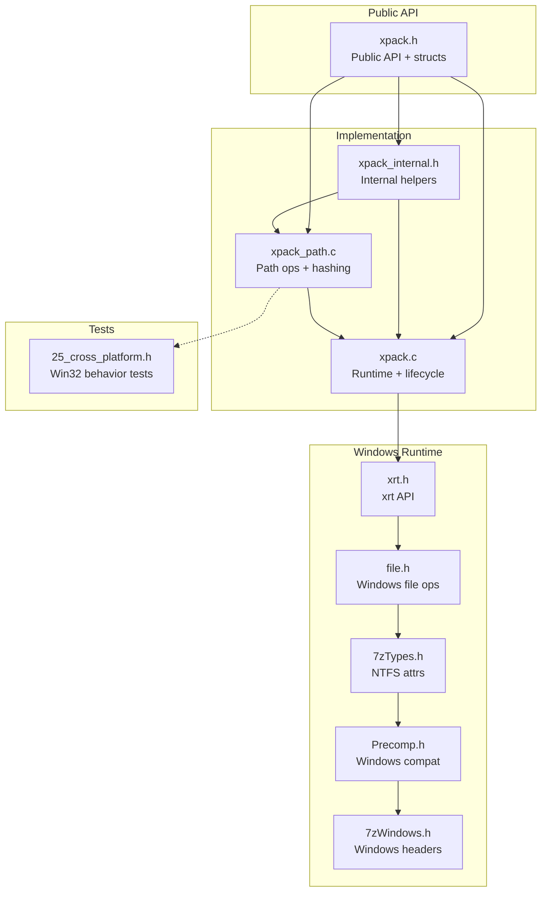
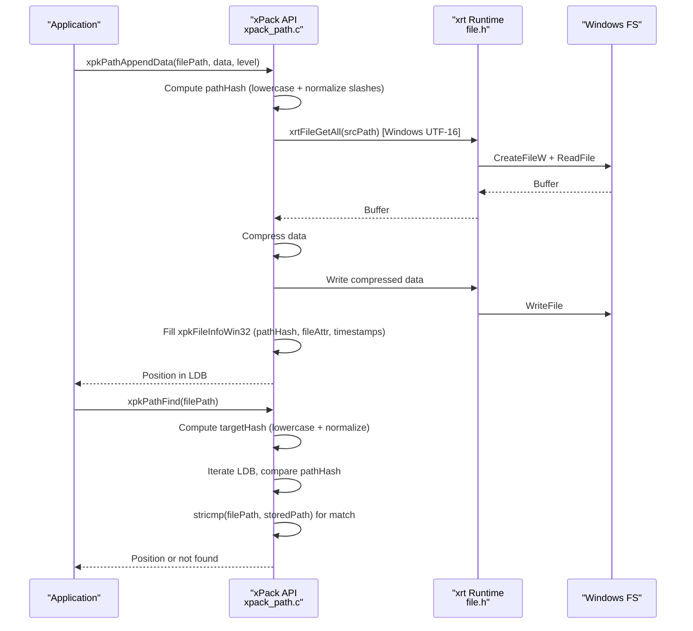
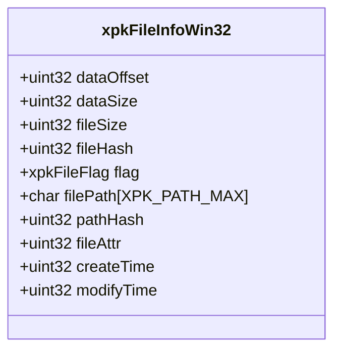
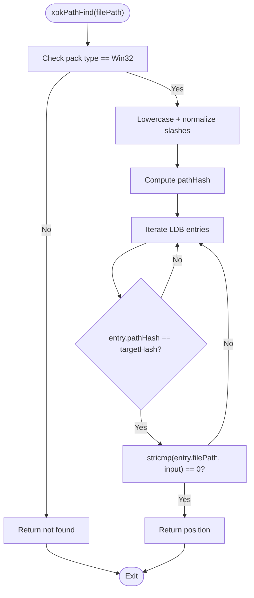
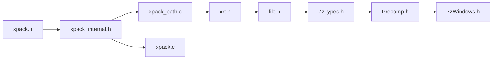

# Win32 Mode

<cite>
**Referenced Files in This Document**
- [xpack.h](file://src/xpack.h)
- [xpack_internal.h](file://src/xpack_internal.h)
- [xpack_path.c](file://src/xpack_path.c)
- [xpack.c](file://src/xpack.c)
- [file.h](file://lib/xrt/lib/file.h)
- [xrt.h](file://lib/xrt/xrt.h)
- [7zTypes.h](file://lib/lzma/7zTypes.h)
- [Precomp.h](file://lib/lzma/Precomp.h)
- [7zWindows.h](file://lib/lzma/7zWindows.h)
- [25_cross_platform.h](file://test/25_cross_platform.h)
</cite>

## Table of Contents
1. [Introduction](#introduction)
2. [Project Structure](#project-structure)
3. [Core Components](#core-components)
4. [Architecture Overview](#architecture-overview)
5. [Detailed Component Analysis](#detailed-component-analysis)
6. [Dependency Analysis](#dependency-analysis)
7. [Performance Considerations](#performance-considerations)
8. [Troubleshooting Guide](#troubleshooting-guide)
9. [Conclusion](#conclusion)
10. [Appendices](#appendices)

## Introduction
This document focuses on xPack’s Win32 mode package type, designed for Windows-compatible environments with case-insensitive file handling and NTFS-specific features. It explains the xpkFileInfoWin32 structure (236 bytes), covering Windows-specific path handling, case-insensitive filename matching, and Windows attribute/time preservation. It also documents path normalization strategies, platform-specific considerations, and migration guidance from other package types while maintaining Windows filesystem compatibility.

## Project Structure
The Win32 mode is implemented across several modules:
- Public API and data structures: [xpack.h](file://src/xpack.h)
- Internal helpers and path hashing: [xpack_internal.h](file://src/xpack_internal.h), [xpack_path.c](file://src/xpack_path.c)
- Core runtime and lifecycle: [xpack.c](file://src/xpack.c)
- Windows file operations and attributes: [file.h](file://lib/xrt/lib/file.h), [xrt.h](file://lib/xrt/xrt.h)
- NTFS constants and Windows compatibility: [7zTypes.h](file://lib/lzma/7zTypes.h), [Precomp.h](file://lib/lzma/Precomp.h), [7zWindows.h](file://lib/lzma/7zWindows.h)
- Cross-platform tests demonstrating Win32 behavior: [25_cross_platform.h](file://test/25_cross_platform.h)

**Diagram sources**
- [xpack.h](file://src/xpack.h#L1-L447)
- [xpack_internal.h](file://src/xpack_internal.h#L1-L145)
- [xpack_path.c](file://src/xpack_path.c#L1-L373)
- [xpack.c](file://src/xpack.c#L1-L200)
- [xrt.h](file://lib/xrt/xrt.h#L687-L765)
- [file.h](file://lib/xrt/lib/file.h#L1-L200)
- [7zTypes.h](file://lib/lzma/7zTypes.h#L143-L159)
- [Precomp.h](file://lib/lzma/Precomp.h#L55-L59)
- [7zWindows.h](file://lib/lzma/7zWindows.h#L1-L56)
- [25_cross_platform.h](file://test/25_cross_platform.h#L1-L357)

**Section sources**
- [xpack.h](file://src/xpack.h#L1-L447)
- [xpack_internal.h](file://src/xpack_internal.h#L1-L145)
- [xpack_path.c](file://src/xpack_path.c#L1-L373)
- [xpack.c](file://src/xpack.c#L1-L200)
- [xrt.h](file://lib/xrt/xrt.h#L687-L765)
- [file.h](file://lib/xrt/lib/file.h#L1-L200)
- [7zTypes.h](file://lib/lzma/7zTypes.h#L143-L159)
- [Precomp.h](file://lib/lzma/Precomp.h#L55-L59)
- [7zWindows.h](file://lib/lzma/7zWindows.h#L1-L56)
- [25_cross_platform.h](file://test/25_cross_platform.h#L1-L357)

## Core Components
- xpkFileInfoWin32: The Win32 mode file record structure with:
  - Basic fields: dataOffset, dataSize, fileSize, fileHash, flag
  - Path fields: filePath[XPK_PATH_MAX], pathHash (case-normalized)
  - Windows attributes: fileAttr, createTime, modifyTime
  - Total size: 236 bytes
- Path hashing and case-insensitivity:
  - Win32 path hash converts to lowercase and normalizes separators, enabling case-insensitive matching
- Windows file operations:
  - xrtFileGetAll/xrtFilePutAll provide UTF-16 path handling and Windows-native file APIs
  - Attribute and timestamp retrieval/setters are available via xrtFileGetAttr/xrtFileSetAttr and time getters

Key implementation references:
- Structure definition: [xpack.h](file://src/xpack.h#L216-L237)
- Path hashing (Win32): [xpack_path.c](file://src/xpack_path.c#L24-L46)
- Path operations (find/add/extract/update/remove): [xpack_path.c](file://src/xpack_path.c#L52-L372)
- Windows file APIs: [file.h](file://lib/xrt/lib/file.h#L795-L840), [xrt.h](file://lib/xrt/xrt.h#L687-L765)
- NTFS attribute constants: [7zTypes.h](file://lib/lzma/7zTypes.h#L143-L159)

**Section sources**
- [xpack.h](file://src/xpack.h#L216-L237)
- [xpack_path.c](file://src/xpack_path.c#L24-L46)
- [xpack_path.c](file://src/xpack_path.c#L52-L372)
- [file.h](file://lib/xrt/lib/file.h#L795-L840)
- [xrt.h](file://lib/xrt/xrt.h#L687-L765)
- [7zTypes.h](file://lib/lzma/7zTypes.h#L143-L159)

## Architecture Overview
Win32 mode integrates tightly with the xrt runtime for Windows-native file operations and preserves NTFS semantics in the package metadata.

**Diagram sources**
- [xpack_path.c](file://src/xpack_path.c#L138-L279)
- [xpack_path.c](file://src/xpack_path.c#L52-L90)
- [file.h](file://lib/xrt/lib/file.h#L795-L840)

**Section sources**
- [xpack_path.c](file://src/xpack_path.c#L52-L90)
- [xpack_path.c](file://src/xpack_path.c#L138-L279)
- [file.h](file://lib/xrt/lib/file.h#L795-L840)

## Detailed Component Analysis

### xpkFileInfoWin32 Structure
- Purpose: Store file metadata for Win32 mode with Windows-aware path handling and attribute preservation.
- Layout highlights:
  - Basic: dataOffset, dataSize, fileSize, fileHash, flag
  - Path: filePath[XPK_PATH_MAX], pathHash (computed from lowercase path with normalized slashes)
  - Attributes: fileAttr, createTime, modifyTime
- Size: 236 bytes total.

**Diagram sources**
- [xpack.h](file://src/xpack.h#L216-L237)

**Section sources**
- [xpack.h](file://src/xpack.h#L216-L237)

### Case-Insensitive Path Operations
- Hashing strategy:
  - Convert to lowercase and normalize backslashes to forward slashes before computing the hash
  - Enables case-insensitive lookup while preserving original casing in filePath for display/metadata
- Lookup flow:
  - Compute targetHash from input path
  - Scan LDB entries whose pathHash equals targetHash
  - Verify match using case-insensitive comparison against stored filePath

**Diagram sources**
- [xpack_path.c](file://src/xpack_path.c#L52-L90)
- [xpack_path.c](file://src/xpack_path.c#L24-L46)

**Section sources**
- [xpack_path.c](file://src/xpack_path.c#L52-L90)
- [xpack_path.c](file://src/xpack_path.c#L24-L46)

### Windows-Specific Features
- File attributes:
  - fileAttr field stores Windows attributes (e.g., read-only, hidden, system, archive, reparse point, compressed)
  - NTFS attribute constants are defined for compatibility
- Timestamps:
  - createTime and modifyTime are preserved in the Win32 file record
- Long path support:
  - The library uses UTF-16 Windows APIs for file operations, enabling long path handling
- Alternate data streams and junction/symlink:
  - While the Win32 mode structure includes fileAttr, the current implementation focuses on basic attributes and timestamps; advanced NTFS features (ADS, junctions) are not explicitly exposed in the public API

References:
- Attribute constants: [7zTypes.h](file://lib/lzma/7zTypes.h#L143-L159)
- Windows file APIs: [file.h](file://lib/xrt/lib/file.h#L795-L840)
- Windows headers: [7zWindows.h](file://lib/lzma/7zWindows.h#L1-L56), [Precomp.h](file://lib/lzma/Precomp.h#L55-L59)

**Section sources**
- [7zTypes.h](file://lib/lzma/7zTypes.h#L143-L159)
- [file.h](file://lib/xrt/lib/file.h#L795-L840)
- [7zWindows.h](file://lib/lzma/7zWindows.h#L1-L56)
- [Precomp.h](file://lib/lzma/Precomp.h#L55-L59)

### Practical Windows Deployment Scenarios
- Case-insensitive deployment:
  - Add files with mixed-case paths; subsequent lookups succeed regardless of case
  - Tests demonstrate case-insensitive matching: [25_cross_platform.h](file://test/25_cross_platform.h#L15-L32)
- Drive letters and absolute paths:
  - Absolute paths with drive letters are supported and retrievable
  - Tests show drive-letter paths work: [25_cross_platform.h](file://test/25_cross_platform.h#L298-L317)
- Separator normalization:
  - Backslashes are normalized to forward slashes during hashing; both slash styles can be used for lookups
  - Tests cover separator handling: [25_cross_platform.h](file://test/25_cross_platform.h#L54-L75)
- Legacy system compatibility:
  - Win32 mode is ideal for Windows-centric environments; cross-platform tests compare Win32 vs Linux behavior
  - Tests demonstrate differences in case sensitivity: [25_cross_platform.h](file://test/25_cross_platform.h#L34-L52), [25_cross_platform.h](file://test/25_cross_platform.h#L95-L124)
- Integration with Windows file management tools:
  - Windows-native file operations and attribute handling enable compatibility with Windows Explorer and PowerShell workflows

**Section sources**
- [25_cross_platform.h](file://test/25_cross_platform.h#L15-L32)
- [25_cross_platform.h](file://test/25_cross_platform.h#L298-L317)
- [25_cross_platform.h](file://test/25_cross_platform.h#L54-L75)
- [25_cross_platform.h](file://test/25_cross_platform.h#L34-L52)
- [25_cross_platform.h](file://test/25_cross_platform.h#L95-L124)

### Migration from Other Package Types
- From Core/Index/Linux to Win32:
  - Use xpkTypeSet to switch to XPK_TYPE_WIN32; existing packages persist their type across save/load cycles
  - Tests demonstrate type persistence and switching: [17_package_properties.h](file://test/17_package_properties.h#L13-L21), [17_package_properties.h](file://test/17_package_properties.h#L219-L233)
- Path behavior changes:
  - After switching to Win32, path lookups become case-insensitive and normalized
  - Existing Linux packages remain case-sensitive; cross-platform tests illustrate differences: [25_cross_platform.h](file://test/25_cross_platform.h#L34-L52), [25_cross_platform.h](file://test/25_cross_platform.h#L95-L124)

**Section sources**
- [17_package_properties.h](file://test/17_package_properties.h#L13-L21)
- [17_package_properties.h](file://test/17_package_properties.h#L219-L233)
- [25_cross_platform.h](file://test/25_cross_platform.h#L34-L52)
- [25_cross_platform.h](file://test/25_cross_platform.h#L95-L124)

## Dependency Analysis
Win32 mode depends on:
- xPack public API and internal helpers for path hashing and file operations
- xrt runtime for Windows-native file I/O and attribute/time accessors
- LZMA/7-Zip headers for NTFS attribute constants and Windows compatibility macros

**Diagram sources**
- [xpack.h](file://src/xpack.h#L1-L447)
- [xpack_internal.h](file://src/xpack_internal.h#L1-L145)
- [xpack_path.c](file://src/xpack_path.c#L1-L373)
- [xpack.c](file://src/xpack.c#L1-L200)
- [xrt.h](file://lib/xrt/xrt.h#L687-L765)
- [file.h](file://lib/xrt/lib/file.h#L1-L200)
- [7zTypes.h](file://lib/lzma/7zTypes.h#L143-L159)
- [Precomp.h](file://lib/lzma/Precomp.h#L55-L59)
- [7zWindows.h](file://lib/lzma/7zWindows.h#L1-L56)

**Section sources**
- [xpack.h](file://src/xpack.h#L1-L447)
- [xpack_internal.h](file://src/xpack_internal.h#L1-L145)
- [xpack_path.c](file://src/xpack_path.c#L1-L373)
- [xpack.c](file://src/xpack.c#L1-L200)
- [xrt.h](file://lib/xrt/xrt.h#L687-L765)
- [file.h](file://lib/xrt/lib/file.h#L1-L200)
- [7zTypes.h](file://lib/lzma/7zTypes.h#L143-L159)
- [Precomp.h](file://lib/lzma/Precomp.h#L55-L59)
- [7zWindows.h](file://lib/lzma/7zWindows.h#L1-L56)

## Performance Considerations
- Path hashing:
  - Win32 hashing converts to lowercase and normalizes slashes, reducing collision risk and enabling efficient O(1) hash comparisons
- Compression overhead:
  - Data is compressed before storage; compression level selection affects CPU and I/O trade-offs
- File I/O:
  - Windows UTF-16 APIs minimize conversion overhead for long paths and improve reliability on modern Windows systems

[No sources needed since this section provides general guidance]

## Troubleshooting Guide
Common issues and remedies:
- Path not found in Win32 mode:
  - Ensure the path uses the same casing and separator style as stored; case-insensitive matching is performed internally
  - Reference: [xpack_path.c](file://src/xpack_path.c#L52-L90)
- Readonly mode write failures:
  - Win32 mode does not permit appending when the package is opened in readonly mode
  - Reference: [xpack_path.c](file://src/xpack_path.c#L100-L136)
- Pack type mismatch:
  - Switch to Win32 mode using xpkTypeSet before adding path-mode files
  - Reference: [xpack.c](file://src/xpack.c#L49-L200)
- Attribute/time retrieval:
  - Use xrtFileGetAttr/xrtFileGetChangeTime for Windows-native attribute/time access
  - References: [xrt.h](file://lib/xrt/xrt.h#L730-L740), [file.h](file://lib/xrt/lib/file.h#L1077-L1174)

**Section sources**
- [xpack_path.c](file://src/xpack_path.c#L52-L90)
- [xpack_path.c](file://src/xpack_path.c#L100-L136)
- [xpack.c](file://src/xpack.c#L49-L200)
- [xrt.h](file://lib/xrt/xrt.h#L730-L740)
- [file.h](file://lib/xrt/lib/file.h#L1077-L1174)

## Conclusion
Win32 mode provides robust Windows-compatible packaging with case-insensitive path handling, NTFS attribute preservation, and Windows-native file operations. Its 236-byte xpkFileInfoWin32 structure balances metadata richness with compactness, while the path hashing strategy ensures efficient and reliable lookups. The design enables seamless migration from other modes and interoperability with Windows file management tools.

[No sources needed since this section summarizes without analyzing specific files]

## Appendices

### Windows Attribute Constants
- Read-only, hidden, system, archive, reparse point, compressed, offline, not-content-indexed, encrypted
- Reference: [7zTypes.h](file://lib/lzma/7zTypes.h#L143-L159)

**Section sources**
- [7zTypes.h](file://lib/lzma/7zTypes.h#L143-L159)