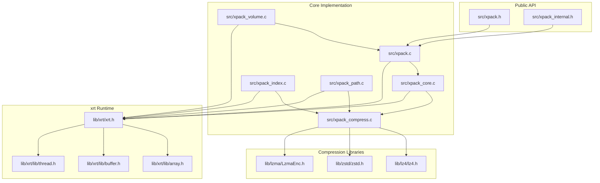
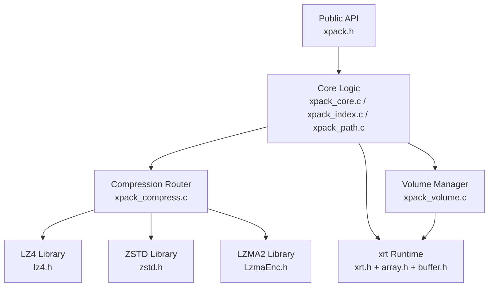
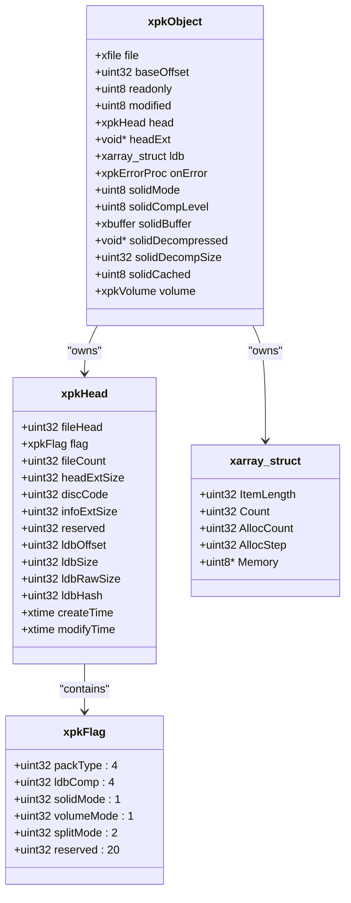
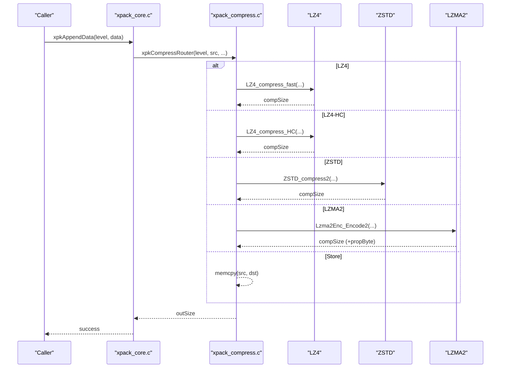
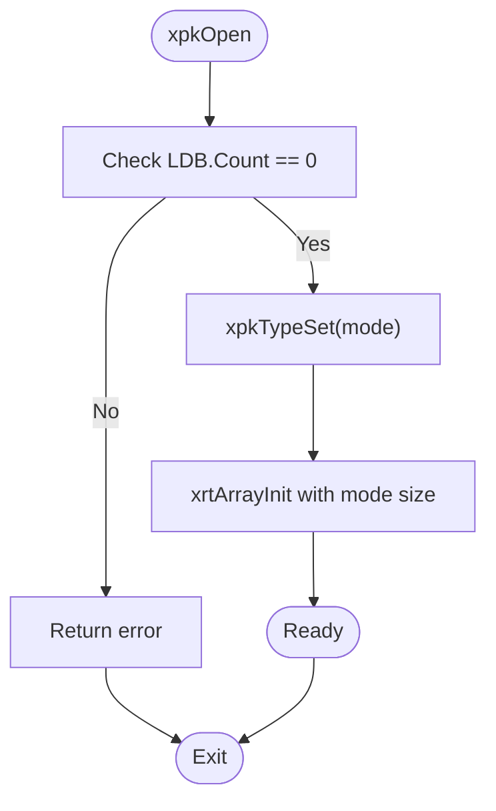
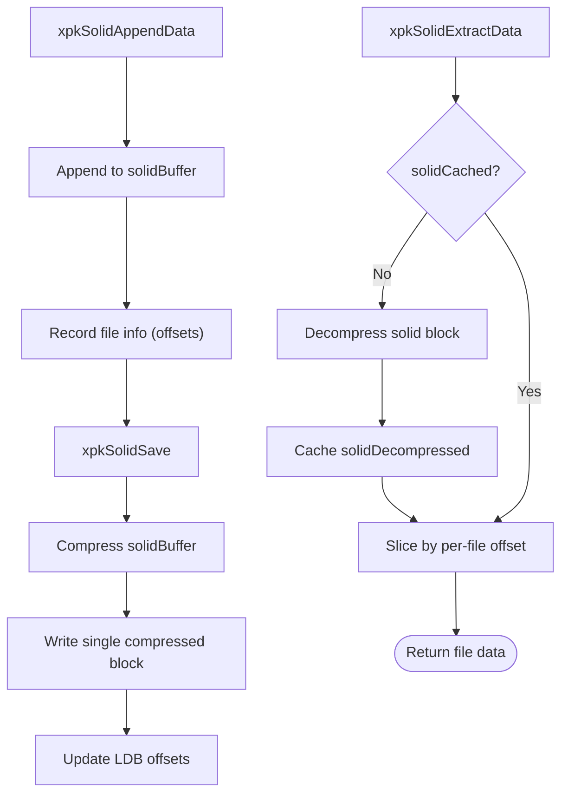
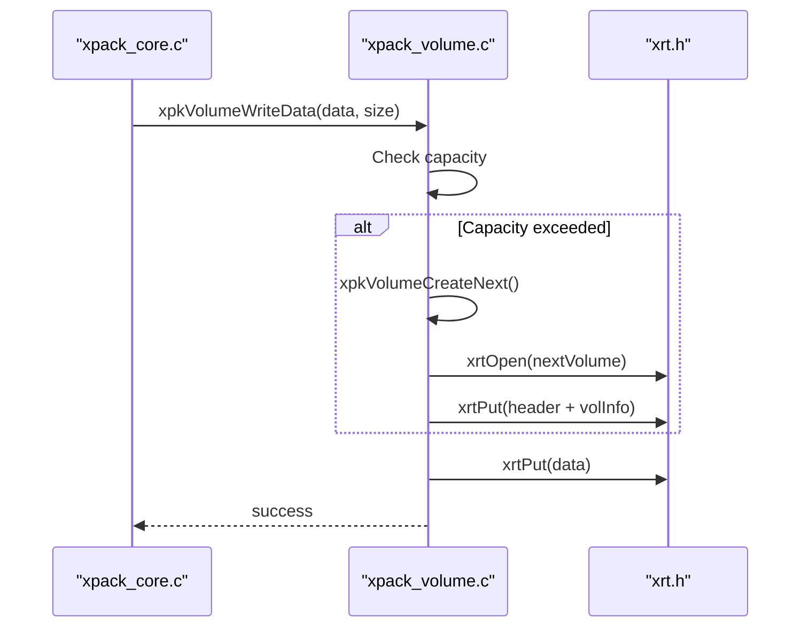
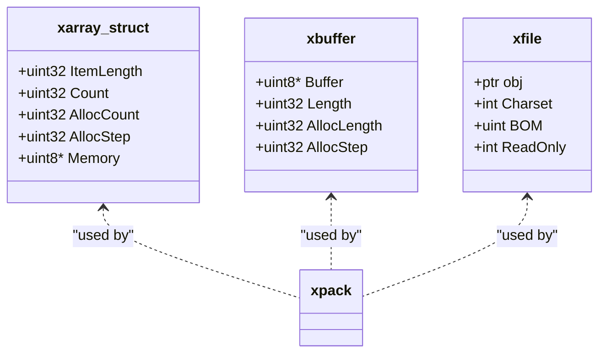
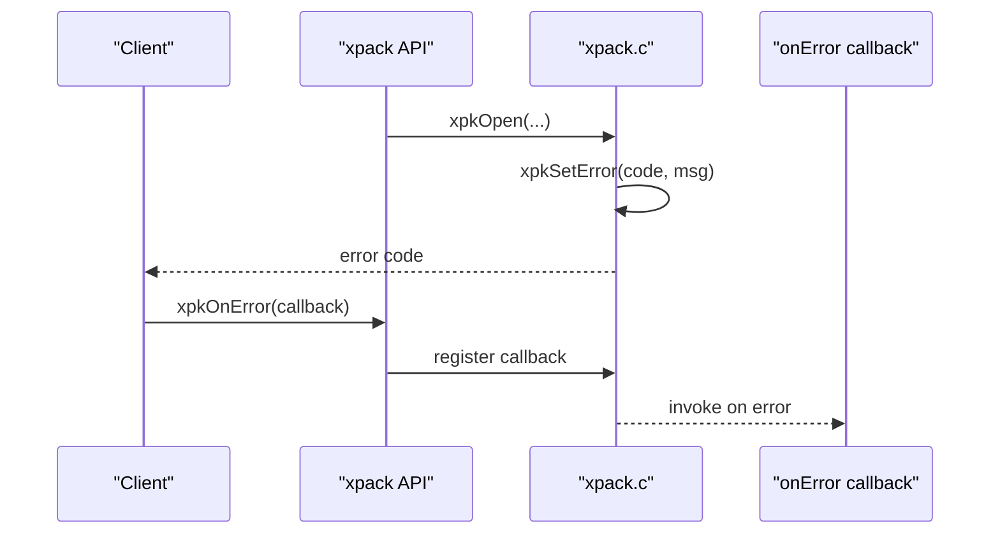
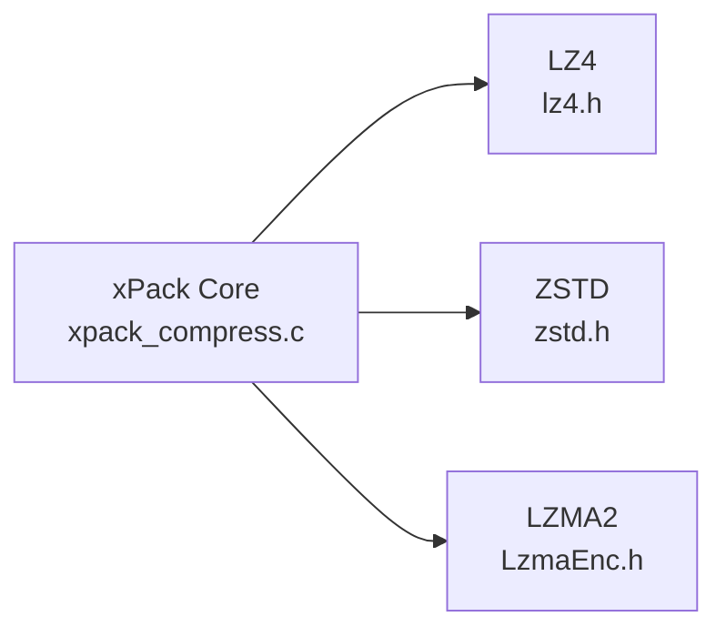

# Architectural Overview

<cite>
**Referenced Files in This Document**
- [xpack.h](file://src/xpack.h)
- [xpack_internal.h](file://src/xpack_internal.h)
- [xpack.c](file://src/xpack.c)
- [xpack_core.c](file://src/xpack_core.c)
- [xpack_compress.c](file://src/xpack_compress.c)
- [xpack_index.c](file://src/xpack_index.c)
- [xpack_path.c](file://src/xpack_path.c)
- [xpack_volume.c](file://src/xpack_volume.c)
- [xrt.h](file://lib/xrt/xrt.h)
- [array.h](file://lib/xrt/lib/array.h)
- [buffer.h](file://lib/xrt/lib/buffer.h)
- [thread.h](file://lib/xrt/lib/thread.h)
- [lz4.h](file://lib/lz4/lz4.h)
- [zstd.h](file://lib/zstd/zstd.h)
- [LzmaEnc.h](file://lib/lzma/LzmaEnc.h)
</cite>

## Table of Contents
1. [Introduction](#introduction)
2. [Project Structure](#project-structure)
3. [Core Components](#core-components)
4. [Architecture Overview](#architecture-overview)
5. [Detailed Component Analysis](#detailed-component-analysis)
6. [Dependency Analysis](#dependency-analysis)
7. [Performance Considerations](#performance-considerations)
8. [Troubleshooting Guide](#troubleshooting-guide)
9. [Conclusion](#conclusion)

## Introduction
This document presents the architectural overview of the xPack library, a layered compression and packaging system supporting multiple compression algorithms (LZ4, ZSTD, LZMA2) and multiple package modes (Core, Index, Linux, Win32). The design emphasizes:
- Clear separation between compression algorithms and core logic via strategy and routing patterns
- Modular data models (xpkHead, xpkObject, xarray_struct) for extensibility
- Robust memory management through the xrt library
- Observer-like error handling with callbacks
- Extensible factory-like behavior for package type creation and algorithm substitution

## Project Structure
The repository is organized into:
- src/: Public API and core implementation
- lib/xrt/: Cross-platform runtime and memory management
- lib/{lz4,zstd,lzma}/: Third-party compression libraries integrated via strategy routing

**Diagram sources**
- [xpack.h](file://src/xpack.h#L1-L447)
- [xpack_internal.h](file://src/xpack_internal.h#L1-L145)
- [xpack.c](file://src/xpack.c#L1-L762)
- [xpack_core.c](file://src/xpack_core.c#L1-L403)
- [xpack_compress.c](file://src/xpack_compress.c#L1-L251)
- [xpack_index.c](file://src/xpack_index.c#L1-L290)
- [xpack_path.c](file://src/xpack_path.c#L1-L373)
- [xpack_volume.c](file://src/xpack_volume.c#L1-L353)
- [xrt.h](file://lib/xrt/xrt.h#L1-L800)
- [array.h](file://lib/xrt/lib/array.h#L1-L180)
- [buffer.h](file://lib/xrt/lib/buffer.h#L1-L116)
- [thread.h](file://lib/xrt/lib/thread.h#L1-L749)
- [lz4.h](file://lib/lz4/lz4.h#L1-L800)
- [zstd.h](file://lib/zstd/zstd.h#L1-L800)
- [LzmaEnc.h](file://lib/lzma/LzmaEnc.h#L1-L86)

**Section sources**
- [xpack.h](file://src/xpack.h#L1-L447)
- [xpack_internal.h](file://src/xpack_internal.h#L1-L145)

## Core Components
- xpkObject: Opaque handle representing an open package instance. It encapsulates file handle, base offset, flags, LDB array, callbacks, solid compression buffers, and volume manager.
- xpkHead: Persistent package header containing version signature, flags, counts, offsets, timestamps, and optional volume info.
- xarray_struct: xrt-managed resizable array used as the LDB (Library Database) to store per-file metadata.
- Compression router: Strategy-based dispatcher mapping 4-bit compression levels to concrete algorithms (LZ4, ZSTD, LZMA2).
- Volume manager: Multi-file packaging abstraction supporting split-by-size or split-by-file modes.

Key design decisions:
- Bit-field structures (xpkFlag, xpkFileFlag) pack metadata compactly into 32-bit words for storage efficiency.
- 4-bit compression level storage maps to a unified level table, enabling algorithm substitution without API changes.
- Unified API surface across modes (Core/Index/Linux/Win32) hides internal differences.

**Section sources**
- [xpack.h](file://src/xpack.h#L100-L447)
- [xpack_internal.h](file://src/xpack_internal.h#L47-L84)
- [xpack.c](file://src/xpack.c#L14-L19)

## Architecture Overview
The system follows a layered architecture:
- Presentation Layer: Public API (xpack.h) exposing unified operations
- Core Logic Layer: Mode-specific handlers (Core/Index/Path) and lifecycle management
- Compression Abstraction: Strategy router dispatching to LZ4/ZSTD/LZMA2
- Persistence Layer: xrt-backed file I/O and memory management
- External Integrations: LZ4, ZSTD, LZMA2 libraries

**Diagram sources**
- [xpack.h](file://src/xpack.h#L320-L447)
- [xpack_core.c](file://src/xpack_core.c#L1-L403)
- [xpack_index.c](file://src/xpack_index.c#L1-L290)
- [xpack_path.c](file://src/xpack_path.c#L1-L373)
- [xpack_compress.c](file://src/xpack_compress.c#L1-L251)
- [xpack_volume.c](file://src/xpack_volume.c#L1-L353)
- [xrt.h](file://lib/xrt/xrt.h#L650-L769)
- [array.h](file://lib/xrt/lib/array.h#L1-L180)
- [buffer.h](file://lib/xrt/lib/buffer.h#L1-L116)
- [lz4.h](file://lib/lz4/lz4.h#L1-L800)
- [zstd.h](file://lib/zstd/zstd.h#L1-L800)
- [LzmaEnc.h](file://lib/lzma/LzmaEnc.h#L1-L86)

## Detailed Component Analysis

### Data Model Layer
The data model centers on three structures:
- xpkHead: Immutable header persisted to disk; includes version signature, flags, counts, offsets, and optional volume info
- xpkObject: Runtime handle aggregating file handle, base offset, flags, LDB, callbacks, solid buffers, and volume manager
- xarray_struct: xrt-managed array storing per-file metadata (mode-dependent structs)

**Diagram sources**
- [xpack.h](file://src/xpack.h#L118-L148)
- [xpack.h](file://src/xpack.h#L105-L115)
- [xpack_internal.h](file://src/xpack_internal.h#L47-L84)
- [array.h](file://lib/xrt/lib/array.h#L25-L40)

**Section sources**
- [xpack.h](file://src/xpack.h#L100-L148)
- [xpack_internal.h](file://src/xpack_internal.h#L47-L84)

### Strategy Pattern: Compression Routing
The compression router maps a unified 4-bit compression level to concrete algorithms:
- Level-to-algorithm mapping via xpkCompTable
- Dispatch to LZ4 fast/fast-hc, ZSTD strategies, or LZMA2 with property byte
- Fallback to no-compression when compression fails

**Diagram sources**
- [xpack_core.c](file://src/xpack_core.c#L39-L128)
- [xpack_compress.c](file://src/xpack_compress.c#L20-L147)
- [lz4.h](file://lib/lz4/lz4.h#L177-L246)
- [zstd.h](file://lib/zstd/zstd.h#L154-L174)
- [LzmaEnc.h](file://lib/lzma/LzmaEnc.h#L71-L81)

**Section sources**
- [xpack_compress.c](file://src/xpack_compress.c#L1-L251)

### Factory Pattern: Package Type Creation
Package type selection is dynamic and enforced at creation time:
- xpkTypeSet validates mode change only when LDB is empty
- xrtArrayInit reconfigures element size based on mode
- Mode-specific file info structures (Core/Index/Linux/Win32) are selected accordingly

**Diagram sources**
- [xpack.c](file://src/xpack.c#L308-L329)
- [xpack.h](file://src/xpack.h#L14-L19)

**Section sources**
- [xpack.c](file://src/xpack.c#L303-L329)

### Solid Compression: Interleaved Storage
Solid mode concatenates all files into a single compressed block:
- xpkSolidAppendData accumulates raw data into a buffer and records per-file offsets
- xpkSolidSave compresses the buffer and writes a single block
- xpkSolidExtractData lazily decompresses the block and slices per-file data

**Diagram sources**
- [xpack.c](file://src/xpack.c#L427-L556)
- [xpack.c](file://src/xpack.c#L558-L606)

**Section sources**
- [xpack.c](file://src/xpack.c#L427-L606)

### Volume Management: Multi-File Packaging
Volume manager supports multi-file packages:
- xpkVolumeInit initializes runtime state
- xpkVolumeWriteData writes across volumes based on capacity and split mode
- xpkVolumeReadData reconstructs data spanning multiple volumes
- xpkVolumeCreateNext opens and initializes the next volume file

**Diagram sources**
- [xpack_core.c](file://src/xpack_core.c#L99-L107)
- [xpack_volume.c](file://src/xpack_volume.c#L178-L229)
- [xrt.h](file://lib/xrt/xrt.h#L668-L698)

**Section sources**
- [xpack_volume.c](file://src/xpack_volume.c#L1-L353)

### Memory Management with xrt
xrt provides:
- Array management (xarray_struct) with dynamic growth and element access
- Buffer management (xbuffer) for growing data accumulation (e.g., solid buffer)
- File I/O primitives (xfile) abstracting platform differences
- Threading primitives (mutex, semaphore, condition) for concurrency

**Diagram sources**
- [array.h](file://lib/xrt/lib/array.h#L25-L40)
- [buffer.h](file://lib/xrt/lib/buffer.h#L24-L38)
- [xrt.h](file://lib/xrt/xrt.h#L652-L660)

**Section sources**
- [array.h](file://lib/xrt/lib/array.h#L1-L180)
- [buffer.h](file://lib/xrt/lib/buffer.h#L1-L116)
- [xrt.h](file://lib/xrt/xrt.h#L650-L769)

### Observer Pattern: Error Handling and Callbacks
- xpkOnError registers a callback for error notifications
- xpkSetError updates thread-local error code and message
- Public getters xpkLastError and xpkLastErrorMsg expose last error state

**Diagram sources**
- [xpack.c](file://src/xpack.c#L622-L640)
- [xpack.h](file://src/xpack.h#L289-L291)

**Section sources**
- [xpack.c](file://src/xpack.c#L22-L640)
- [xpack.h](file://src/xpack.h#L289-L291)

## Dependency Analysis
External dependencies and integration points:
- LZ4: Fast compression with acceleration and fast-hc variants
- ZSTD: Rich strategy set and streaming APIs
- LZMA2: Property-byte format with configurable levels

Integration strategy:
- xpack_compress.c routes compression/decompression based on mapped levels
- LZ4/ZSTD/LZMA2 are linked statically or dynamically as configured
- xrt abstracts file I/O and memory management across platforms

**Diagram sources**
- [xpack_compress.c](file://src/xpack_compress.c#L9-L14)
- [lz4.h](file://lib/lz4/lz4.h#L1-L800)
- [zstd.h](file://lib/zstd/zstd.h#L1-L800)
- [LzmaEnc.h](file://lib/lzma/LzmaEnc.h#L1-L86)

**Section sources**
- [xpack_compress.c](file://src/xpack_compress.c#L1-L251)

## Performance Considerations
- Bit-field packing reduces metadata overhead and improves cache locality
- 4-bit compression levels enable unified API while supporting diverse algorithms
- Solid mode minimizes per-file overhead at the cost of random access complexity
- xrt’s buffer and array abstractions provide amortized growth and efficient memory usage
- Volume mode trades I/O locality for portability across file systems

[No sources needed since this section provides general guidance]

## Troubleshooting Guide
Common issues and diagnostics:
- Invalid version/signature: Verify fileHead equals XPK_VERSION
- Readonly mode violations: Ensure xpkOpen called with appropriate flags
- Solid mode restrictions: Updates/removals are disallowed in solid archives
- Volume mode errors: Validate volume size and split mode; check volume availability
- Compression failures: Router falls back to no-compression; verify buffer sizes

Operational helpers:
- xpkLastError and xpkLastErrorMsg provide last error details
- xpkOnError allows custom error notification hooks
- xpkVerify and xpkVerifyAll assist in integrity checks

**Section sources**
- [xpack.c](file://src/xpack.c#L622-L640)
- [xpack.h](file://src/xpack.h#L439-L440)

## Conclusion
The xPack library achieves a clean separation between compression algorithms and core logic through a strategy router and unified API. Its modular design leverages xrt for robust memory and file management, supports multi-mode packages, and integrates external compression libraries seamlessly. The bit-field structures, 4-bit compression level mapping, and factory-like package type selection enable extensibility and algorithm substitution without API churn. Cross-cutting concerns like error propagation, resource cleanup, and thread-safety are addressed through observer-style callbacks, RAII-like lifecycle management, and xrt’s platform abstractions.