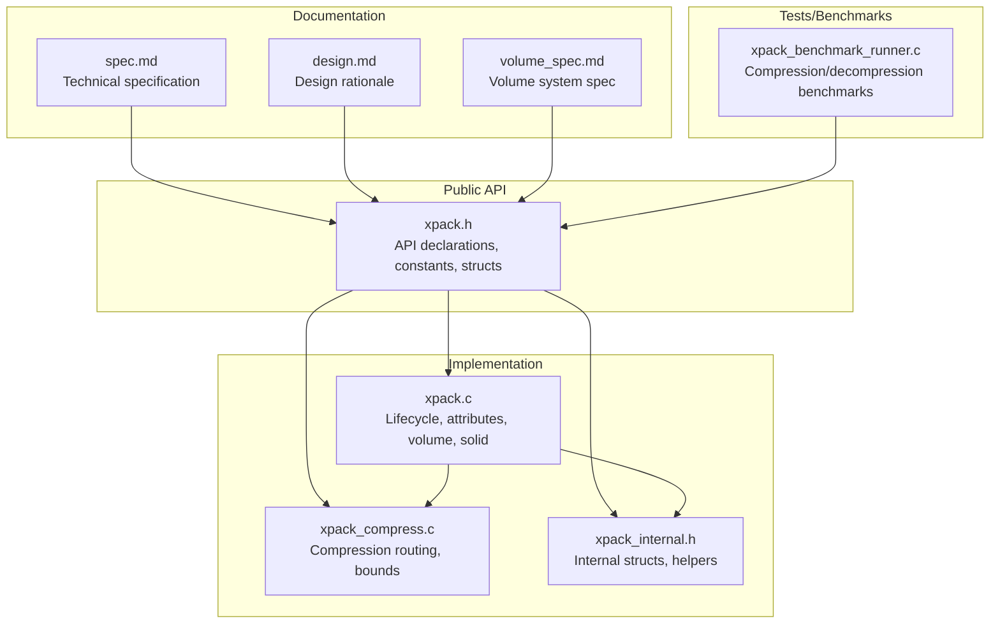
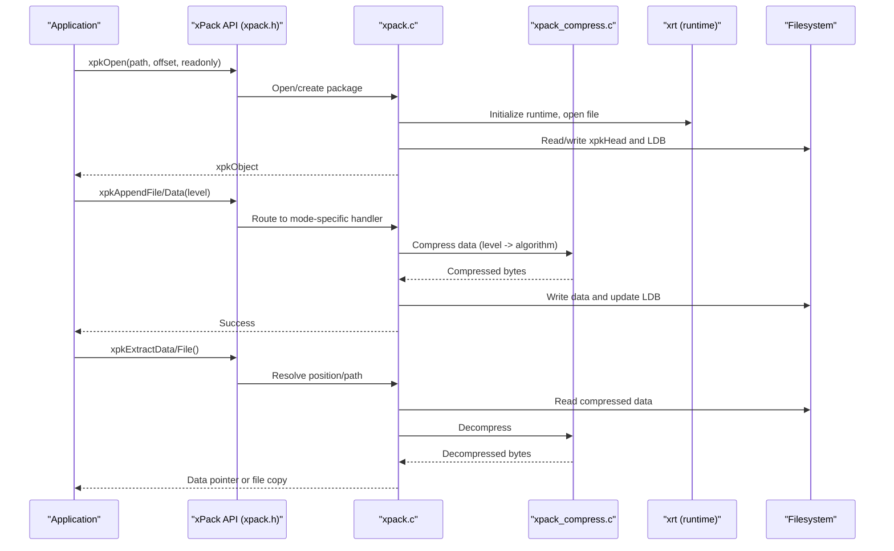
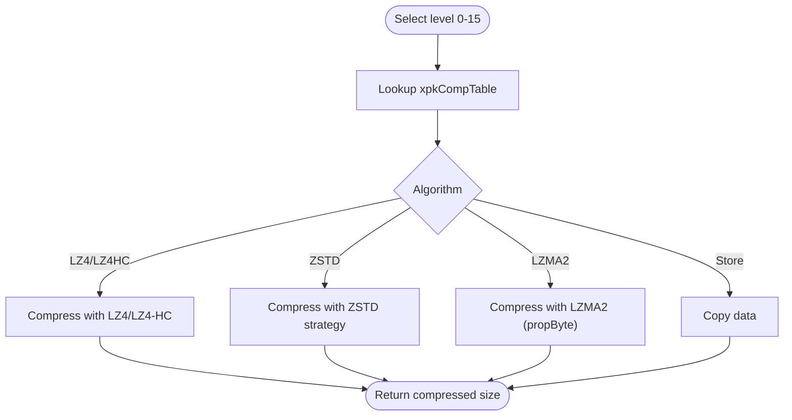
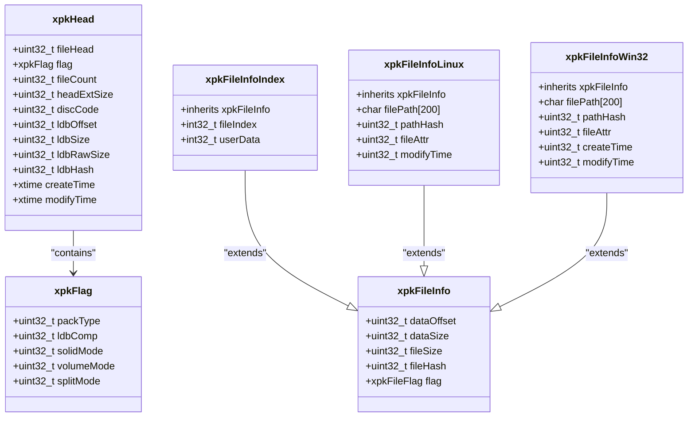
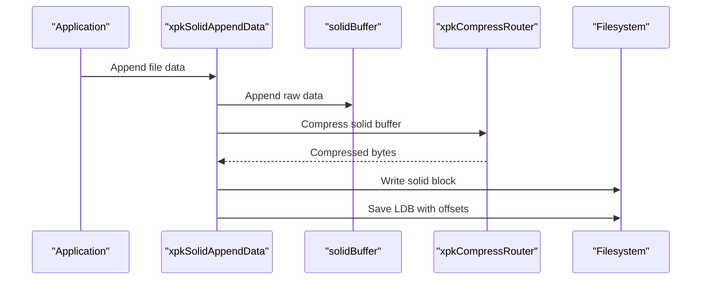
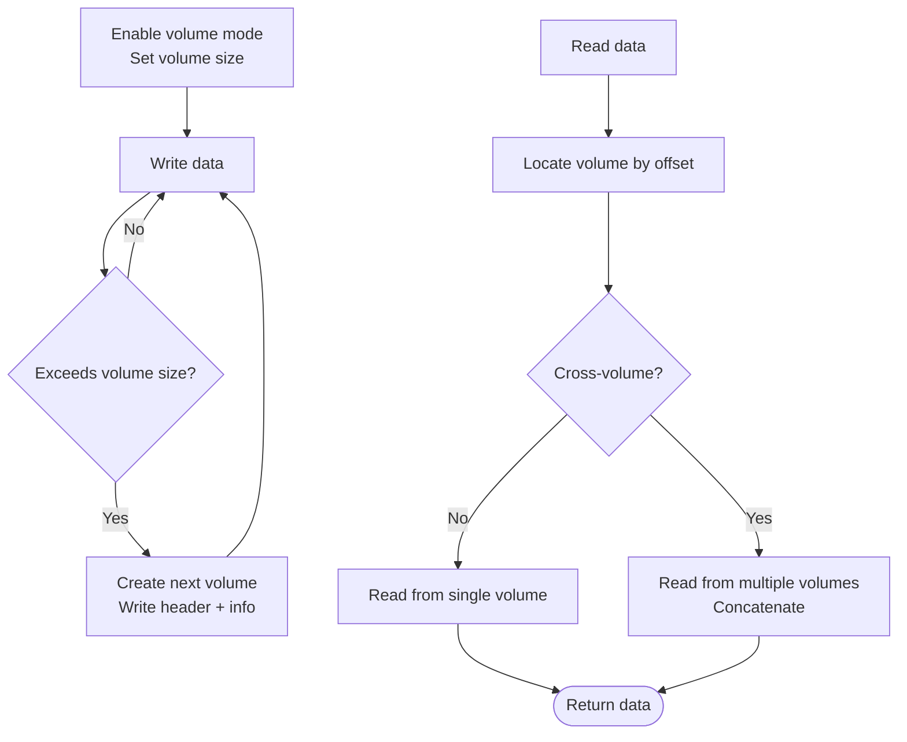
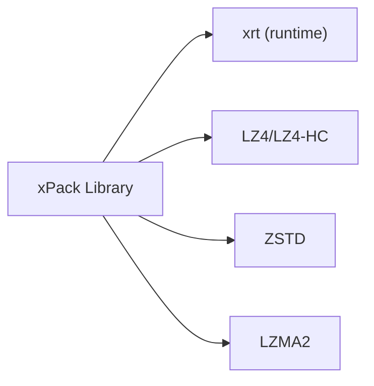

# Introduction and Purpose

<cite>
**Referenced Files in This Document**
- [xpack.h](file://src/xpack.h)
- [xpack.c](file://src/xpack.c)
- [xpack_internal.h](file://src/xpack_internal.h)
- [xpack_compress.c](file://src/xpack_compress.c)
- [spec.md](file://docs/spec.md)
- [design.md](file://docs/design.md)
- [volume_spec.md](file://docs/volume_spec.md)
- [xpack_benchmark_runner.c](file://test/xpack_benchmark_runner.c)
</cite>

## Table of Contents
1. [Introduction](#introduction)
2. [Project Structure](#project-structure)
3. [Core Components](#core-components)
4. [Architecture Overview](#architecture-overview)
5. [Detailed Component Analysis](#detailed-component-analysis)
6. [Dependency Analysis](#dependency-analysis)
7. [Performance Considerations](#performance-considerations)
8. [Troubleshooting Guide](#troubleshooting-guide)
9. [Conclusion](#conclusion)

## Introduction
xPack is a lightweight, unified file compression package library designed to streamline packaging, compression, and extraction of files across diverse platforms and use cases. Its core mission is to provide a consistent, high-performance compression solution that supports multiple algorithms and flexible package types, enabling efficient storage and transport of assets while maintaining simplicity and reliability.

Key value propositions:
- Unified compression solution with multiple algorithms (LZ4, ZSTD, LZMA2) and compression levels (0–15) mapped to strict monotonic behavior for predictable trade-offs between speed and compression ratio.
- Flexible package types (Core, Index, Linux, Win32) tailored to different access patterns and platform requirements.
- Cross-platform compatibility backed by a robust runtime library (xrt) and standardized file format with version-aware signatures.
- Advanced features such as solid compression for improved ratio on small files and multi-volume support for large archives.

Target use cases:
- Game asset management: rapid loading and streaming of compressed resources with minimal CPU overhead.
- Software distribution: balanced compression ratios and fast extraction for installer and update workflows.
- Data archiving: high compression ratios and reliable integrity checks for long-term storage.

## Project Structure
At a high level, xPack consists of:
- Public API and data structures in the header files.
- Implementation modules for lifecycle management, compression routing, and specialized modes (Core/Index/Path).
- Internal structures and helpers for runtime state, volume management, and error handling.
- Documentation and specifications that define the file format, compression levels, and usage guidelines.
- A comprehensive test suite and benchmark runner for performance validation.

**Diagram sources**
- [xpack.h](file://src/xpack.h#L1-L447)
- [xpack.c](file://src/xpack.c#L1-L762)
- [xpack_compress.c](file://src/xpack_compress.c#L1-L251)
- [xpack_internal.h](file://src/xpack_internal.h#L1-L145)
- [spec.md](file://docs/spec.md#L1-L458)
- [design.md](file://docs/design.md#L1-L485)
- [volume_spec.md](file://docs/volume_spec.md#L1-L835)
- [xpack_benchmark_runner.c](file://test/xpack_benchmark_runner.c#L400-L432)

**Section sources**
- [xpack.h](file://src/xpack.h#L1-L447)
- [xpack.c](file://src/xpack.c#L1-L762)
- [xpack_compress.c](file://src/xpack_compress.c#L1-L251)
- [xpack_internal.h](file://src/xpack_internal.h#L1-L145)
- [spec.md](file://docs/spec.md#L1-L458)
- [design.md](file://docs/design.md#L1-L485)
- [volume_spec.md](file://docs/volume_spec.md#L1-L835)
- [xpack_benchmark_runner.c](file://test/xpack_benchmark_runner.c#L400-L432)

## Core Components
- xpkObject: An opaque handle representing an open package instance. It encapsulates file handles, runtime state, and configuration for the current session.
- xpkHead: The package header containing metadata such as file count, offsets, timestamps, and flags indicating package type, compression level for the LDB, and whether solid or volume modes are enabled.
- xpkFlag/xpkFileFlag: Bitfield structures that compactly encode package-level and per-file flags, including compression level, file type, and operational modes.
- Compression levels and mapping: A 0–15 level system mapped to LZ4/LZ4-HC, ZSTD strategies, and LZMA2 levels, ensuring monotonic behavior across levels.
- Package types:
  - Core: Position-based access with minimal per-entry overhead.
  - Index: Integer-indexed access with optional user data.
  - Linux/Win32: Path-based access with platform-appropriate path hashing and attributes.

Benefits highlighted by the codebase:
- Version-aware file signature ensures compatibility and prevents accidental corruption by older readers.
- Solid compression reduces overhead for many small files by compressing them into a single block.
- Multi-volume support enables large archives to be split across files with transparent I/O routing.

**Section sources**
- [xpack.h](file://src/xpack.h#L100-L447)
- [xpack.c](file://src/xpack.c#L49-L297)
- [xpack_internal.h](file://src/xpack_internal.h#L47-L145)
- [spec.md](file://docs/spec.md#L34-L98)

## Architecture Overview
The library’s architecture centers around a unified API surface with internal routing for compression algorithms, flexible package layouts, and optional advanced features like solid compression and multi-volume support.

**Diagram sources**
- [xpack.h](file://src/xpack.h#L328-L441)
- [xpack.c](file://src/xpack.c#L49-L297)
- [xpack_compress.c](file://src/xpack_compress.c#L20-L147)

**Section sources**
- [xpack.h](file://src/xpack.h#L328-L441)
- [xpack.c](file://src/xpack.c#L49-L297)
- [xpack_compress.c](file://src/xpack_compress.c#L20-L147)

## Detailed Component Analysis

### Compression Routing and Levels
xPack maps user-selected compression levels (0–15) to concrete algorithms and parameters:
- Level 0: No compression.
- Levels 1–4: LZ4 family (fast and higher-compression variants).
- Levels 5–13: ZSTD strategies ranging from fast to ultra strategies.
- Levels 14–15: LZMA2 at moderate to highest compression levels.

The router selects the appropriate algorithm and sets native parameters accordingly, with fallback to no compression if compression fails.

**Diagram sources**
- [xpack_compress.c](file://src/xpack_compress.c#L20-L147)
- [xpack.h](file://src/xpack.h#L269-L286)

**Section sources**
- [xpack_compress.c](file://src/xpack_compress.c#L20-L147)
- [xpack.h](file://src/xpack.h#L269-L286)

### Package Types and Access Patterns
xPack supports four package types, each optimized for different scenarios:
- Core: Minimal overhead, position-based access.
- Index: Integer indices with optional user data for custom metadata.
- Linux/Win32: Path-based access with platform-appropriate hashing and attributes.

**Diagram sources**
- [xpack.h](file://src/xpack.h#L118-L237)

**Section sources**
- [xpack.h](file://src/xpack.h#L118-L237)

### Solid Compression
Solid compression aggregates multiple files into a single compressed block, reducing per-file overhead and improving compression ratio for small files. The implementation:
- Buffers incoming data until a flush occurs.
- Compresses the aggregated buffer at a configurable level.
- Stores per-file offsets within the solid block for random access.

**Diagram sources**
- [xpack.c](file://src/xpack.c#L427-L525)

**Section sources**
- [xpack.c](file://src/xpack.c#L427-L525)

### Multi-Volume Support
xPack supports splitting large archives across multiple files with transparent I/O routing. Features include:
- Configurable volume size and split mode (byte-wise or file-wise).
- Automatic creation of subsequent volumes when capacity is exceeded.
- Uniform API for reading/writing regardless of volume boundaries.

**Diagram sources**
- [volume_spec.md](file://docs/volume_spec.md#L380-L542)
- [xpack.c](file://src/xpack.c#L646-L761)

**Section sources**
- [volume_spec.md](file://docs/volume_spec.md#L1-L835)
- [xpack.c](file://src/xpack.c#L646-L761)

### Practical Scenarios and Benefits
- Game asset management: Use Core or Win32 packages with LZ4 levels (1–3) for real-time loading and streaming.
- Software distribution: Use ZSTD levels (6–10) for balanced compression and fast extraction.
- Data archiving: Use LZMA2 levels (14–15) for maximum compression ratio.
- Cross-platform deployment: Leverage the unified API and version-aware format to ensure compatibility across environments.

These scenarios align with the documented usage guidelines and compression performance characteristics.

**Section sources**
- [spec.md](file://docs/spec.md#L387-L397)
- [design.md](file://docs/design.md#L56-L64)

## Dependency Analysis
xPack integrates several external libraries and a unified runtime:
- xrt: Provides file I/O, arrays, buffers, hashing, and OS abstractions.
- LZ4/LZ4-HC: High-speed compression for latency-sensitive scenarios.
- ZSTD: Balanced compression with tunable strategies.
- LZMA2: Highest compression ratio for archival use.

**Diagram sources**
- [spec.md](file://docs/spec.md#L318-L350)
- [design.md](file://docs/design.md#L392-L410)

**Section sources**
- [spec.md](file://docs/spec.md#L318-L350)
- [design.md](file://docs/design.md#L392-L410)

## Performance Considerations
- Compression levels: Choose levels based on workload. Lower levels favor speed; higher levels favor compression ratio.
- Solid compression: Effective for many small files to reduce overhead and improve ratio.
- Multi-volume: Enables manageable file sizes and efficient transfer, with minimal overhead for sequential access.
- Benchmarking: Use the provided benchmark runner to measure compression and decompression speeds under realistic conditions.

Practical tips:
- For real-time asset loading, prefer LZ4 levels 1–3.
- For general-purpose distribution, ZSTD level 6–8 offers a strong balance.
- For archival, LZMA2 levels 14–15 yield the best ratio.

**Section sources**
- [xpack_benchmark_runner.c](file://test/xpack_benchmark_runner.c#L400-L432)
- [spec.md](file://docs/spec.md#L34-L77)

## Troubleshooting Guide
Common issues and resolutions:
- Invalid version or signature: Indicates incompatible reader or corrupted file. Verify the file signature and ensure the reader supports the version.
- Readonly mode write denied: Attempting to modify a package opened in readonly mode. Reopen with write access.
- Maximum volume count exceeded: Exceeded the maximum number of supported volumes. Reduce volume count or adjust configuration.
- Volume file not available or volume data incomplete: Missing or truncated volumes during cross-volume operations. Ensure all volumes are present and intact.

Diagnostic utilities:
- Use last-error APIs to retrieve detailed error codes and messages.
- Verify package integrity with built-in verification routines.

**Section sources**
- [xpack.c](file://src/xpack.c#L622-L640)
- [xpack.h](file://src/xpack.h#L289-L291)
- [volume_spec.md](file://docs/volume_spec.md#L698-L717)

## Conclusion
xPack delivers a cohesive, high-performance compression solution that balances flexibility, portability, and ease of use. By supporting multiple algorithms and package types, it adapts to varied workloads—from real-time asset streaming to archival storage—while maintaining a consistent API and robust file format. Whether you are building games, distributing software, or archiving data, xPack provides the tools to optimize both performance and storage efficiency.