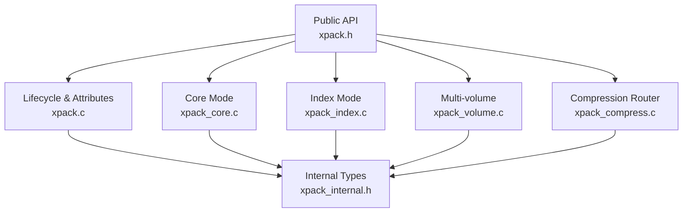
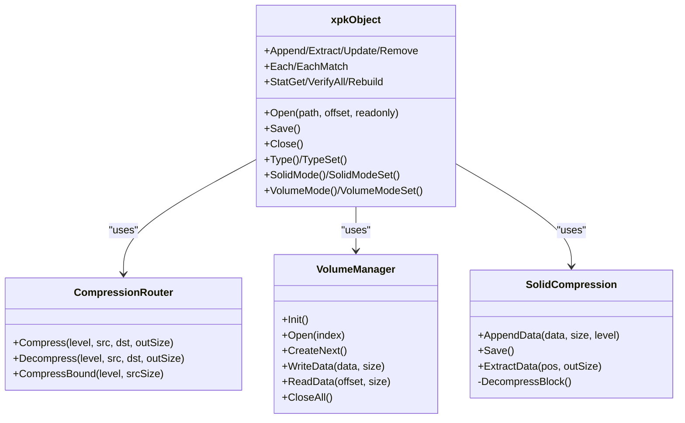
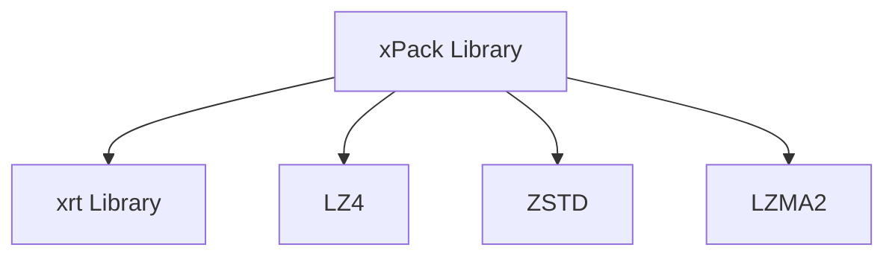

# Key Features and Benefits

<cite>
**Referenced Files in This Document**
- [xpack.h](file://src/xpack.h)
- [xpack.c](file://src/xpack.c)
- [xpack_core.c](file://src/xpack_core.c)
- [xpack_index.c](file://src/xpack_index.c)
- [xpack_compress.c](file://src/xpack_compress.c)
- [xpack_volume.c](file://src/xpack_volume.c)
- [xpack_internal.h](file://src/xpack_internal.h)
- [10_solid_compression.h](file://test/10_solid_compression.h)
- [31_volume_basic.h](file://test/31_volume_basic.h)
- [25_cross_platform.h](file://test/25_cross_platform.h)
- [26_memory_management.h](file://test/26_memory_management.h)
- [28_performance_benchmark.h](file://test/28_performance_benchmark.h)
- [11_error_handling.h](file://test/11_error_handling.h)
- [30_regression_tests.h](file://test/30_regression_tests.h)
</cite>

## Table of Contents
1. [Introduction](#introduction)
2. [Project Structure](#project-structure)
3. [Core Components](#core-components)
4. [Architecture Overview](#architecture-overview)
5. [Detailed Component Analysis](#detailed-component-analysis)
6. [Dependency Analysis](#dependency-analysis)
7. [Performance Considerations](#performance-considerations)
8. [Troubleshooting Guide](#troubleshooting-guide)
9. [Conclusion](#conclusion)

## Introduction
This document presents the key features and benefits of xPack, focusing on its core capabilities and advantages. It explains the four package types (Core, Index, Linux, Win32), the compression level system (0–15), multi-algorithm support (LZ4, ZSTD, LZMA2), solid compression, multi-volume support, and cross-platform compatibility. It also highlights the unified API design, memory-efficient implementations, and comprehensive error handling. Practical examples demonstrate how each feature addresses real-world compression challenges, and comparisons with alternative libraries emphasize xPack’s unique strengths.

## Project Structure
xPack is organized around a unified C API with modular implementations:
- Public API and data structures: [xpack.h](file://src/xpack.h)
- Core lifecycle, attributes, and volume management: [xpack.c](file://src/xpack.c)
- Core-mode operations (position-based): [xpack_core.c](file://src/xpack_core.c)
- Index-mode operations (indexed access): [xpack_index.c](file://src/xpack_index.c)
- Compression routing and algorithms: [xpack_compress.c](file://src/xpack_compress.c)
- Multi-volume support: [xpack_volume.c](file://src/xpack_volume.c)
- Internal structures and helpers: [xpack_internal.h](file://src/xpack_internal.h)

**Diagram sources**
- [xpack.h](file://src/xpack.h#L325-L447)
- [xpack.c](file://src/xpack.c#L49-L297)
- [xpack_core.c](file://src/xpack_core.c#L1-L403)
- [xpack_index.c](file://src/xpack_index.c#L1-L290)
- [xpack_compress.c](file://src/xpack_compress.c#L1-L251)
- [xpack_volume.c](file://src/xpack_volume.c#L1-L353)
- [xpack_internal.h](file://src/xpack_internal.h#L1-L145)

**Section sources**
- [xpack.h](file://src/xpack.h#L1-L447)
- [xpack.c](file://src/xpack.c#L1-L762)
- [xpack_internal.h](file://src/xpack_internal.h#L1-L145)

## Core Components
- Package types and access patterns:
  - Core: position-based access for simple sequential workflows.
  - Index: integer-indexed access for deterministic ordering.
  - Linux: path-based access with case-sensitive hashing.
  - Win32: path-based access with case-insensitive hashing and Windows-specific semantics.
- Compression levels and algorithms:
  - Levels 0–15 map to LZ4 fast/fast(64KB), LZ4-HC levels, ZSTD strategies, and LZMA2 levels.
  - Router selects algorithm and native parameters per level.
- Solid compression:
  - Single compressed block containing all files for improved compression ratios on similar data.
- Multi-volume:
  - Automatic splitting across multiple files with configurable capacity and split modes.
- Cross-platform:
  - Robust path handling for Windows and Linux semantics.
- Unified API:
  - Consistent function naming and behavior across modes.
- Memory efficiency:
  - Lightweight buffers, streaming I/O, and optional caching for solid blocks.
- Comprehensive error handling:
  - Centralized error codes and messages, with callbacks and graceful degradation.

**Section sources**
- [xpack.h](file://src/xpack.h#L35-L115)
- [xpack.h](file://src/xpack.h#L269-L286)
- [xpack_compress.c](file://src/xpack_compress.c#L20-L147)
- [xpack.c](file://src/xpack.c#L366-L421)
- [xpack_volume.c](file://src/xpack_volume.c#L15-L353)
- [xpack.c](file://src/xpack.c#L622-L640)

## Architecture Overview
The architecture centers on a single xpkObject that encapsulates file I/O, metadata, and compression state. Modes share a common compression router and differ primarily in how file metadata is stored and accessed.

**Diagram sources**
- [xpack.h](file://src/xpack.h#L322-L440)
- [xpack_compress.c](file://src/xpack_compress.c#L20-L251)
- [xpack_volume.c](file://src/xpack_volume.c#L44-L160)
- [xpack.c](file://src/xpack.c#L427-L606)

**Section sources**
- [xpack.h](file://src/xpack.h#L322-L440)
- [xpack_compress.c](file://src/xpack_compress.c#L20-L251)
- [xpack_volume.c](file://src/xpack_volume.c#L44-L160)
- [xpack.c](file://src/xpack.c#L427-L606)

## Detailed Component Analysis

### Four Package Types and Use Cases
- Core (0):
  - Sequential position-based access.
  - Best for simple append-and-extract workflows.
  - Minimal metadata overhead.
- Index (1):
  - Integer index-based access with user-defined indices.
  - Ideal for deterministic ordering and programmatic access.
- Linux (2):
  - Path-based access with case-sensitive hashing.
  - Suitable for Unix-like systems and portable archives.
- Win32 (3):
  - Path-based access with case-insensitive hashing and Windows semantics.
  - Designed for Windows environments and legacy compatibility.

Benefits:
- Flexible access patterns enable diverse workflows.
- Mode switching is supported only on empty packages, preventing corruption.
- Path modes include robust hashing and duplicate detection.

Practical examples:
- Batch processing: Use Core for straightforward pipelines.
- Deterministic indexing: Use Index for predictable retrieval.
- Cross-platform distribution: Use Linux for portability; Win32 for Windows-native tools.

**Section sources**
- [xpack.h](file://src/xpack.h#L38-L42)
- [xpack.c](file://src/xpack.c#L308-L329)
- [xpack_core.c](file://src/xpack_core.c#L18-L128)
- [xpack_index.c](file://src/xpack_index.c#L36-L174)
- [xpack.h](file://src/xpack.h#L195-L237)

### Compression Level System (0–15) and Algorithms
Mapping table:
- 0: Store (no compression)
- 1–4: LZ4 fast/fast(64KB) and LZ4-HC levels
- 5–13: ZSTD strategies (from fast to ultra)
- 14–15: LZMA2 levels

Router behavior:
- Selects algorithm and native parameters based on level.
- Falls back to no-compression if compression fails.
- Provides upper bound estimation for buffer sizing.

Performance characteristics:
- Level 0: Fastest, minimal CPU, worst compression ratio.
- Levels 1–4: Very fast, good for real-time scenarios.
- Levels 5–13: Balanced throughput and ratio; ZSTD strategies vary from greedy to ultra.
- Levels 14–15: Highest compression ratios, slower, more CPU.

Practical examples:
- Log files: Levels 1–3 for speed.
- Media assets: Levels 5–9 for balanced ratio.
- Backup archives: Levels 14–15 for maximum compression.

**Section sources**
- [xpack.h](file://src/xpack.h#L269-L286)
- [xpack_compress.c](file://src/xpack_compress.c#L20-L147)
- [xpack_compress.c](file://src/xpack_compress.c#L227-L250)
- [28_performance_benchmark.h](file://test/28_performance_benchmark.h#L299-L317)

### Solid Compression Feature
Solid mode stores all files in a single compressed block, improving compression ratios for similar data.

Key behaviors:
- Enabled only on empty packages.
- Uses a dedicated buffer during creation and caches decompressed block during extraction.
- Disables updates and removals to preserve integrity.

Performance:
- Better compression for repetitive or similar files.
- Higher memory usage during creation and extraction.
- Efficient random access via precomputed offsets.

Practical examples:
- Firmware images with shared headers.
- Software distributions with common binaries.
- Logs with repeated patterns.

**Section sources**
- [xpack.c](file://src/xpack.c#L371-L408)
- [xpack.c](file://src/xpack.c#L427-L525)
- [xpack.c](file://src/xpack.c#L527-L606)
- [10_solid_compression.h](file://test/10_solid_compression.h#L7-L33)
- [10_solid_compression.h](file://test/10_solid_compression.h#L189-L228)
- [10_solid_compression.h](file://test/10_solid_compression.h#L269-L313)

### Multi-Volume Support
Multi-volume enables splitting archives across multiple files with configurable capacity and split modes.

Key features:
- Automatic creation of subsequent volumes when capacity is reached.
- Supports byte-based and file-based splitting.
- Maintains consistent headers and metadata across volumes.
- Reads transparently across volumes.

Practical examples:
- Distributing large archives across fixed-size media.
- Streaming or chunked uploads.
- Backup to removable storage.

**Section sources**
- [xpack_volume.c](file://src/xpack_volume.c#L15-L353)
- [xpack.c](file://src/xpack.c#L646-L720)
- [31_volume_basic.h](file://test/31_volume_basic.h#L7-L64)

### Cross-Platform Compatibility
xPack adapts path semantics to platform conventions:
- Win32: Case-insensitive hashing, Windows separators, drive letters.
- Linux: Case-sensitive hashing, Unix separators, relative paths.

Robustness:
- Handles nested directories, special characters, unicode, and long paths.
- Normalizes path separators and case differences where appropriate.

Practical examples:
- Portable archives across Windows and Linux.
- Legacy Windows tools requiring case-insensitive paths.
- Modern Linux environments requiring strict case sensitivity.

**Section sources**
- [xpack.h](file://src/xpack.h#L195-L237)
- [xpack.c](file://src/xpack.c#L558-L606)
- [25_cross_platform.h](file://test/25_cross_platform.h#L15-L32)
- [25_cross_platform.h](file://test/25_cross_platform.h#L34-L52)
- [25_cross_platform.h](file://test/25_cross_platform.h#L54-L93)
- [25_cross_platform.h](file://test/25_cross_platform.h#L198-L217)

### Unified API Design and Memory Efficiency
Unified API:
- Consistent function naming across modes (e.g., Append/Extract/Update/Remove).
- Shared lifecycle and attribute operations.
- Callbacks for traversal and iteration.

Memory efficiency:
- Lightweight arrays and buffers via xrt library.
- Optional solid block caching reduces repeated decompressions.
- Streaming I/O avoids loading entire archives into memory.

Practical examples:
- Rapid prototyping with interchangeable access patterns.
- Resource-constrained environments with predictable memory usage.

**Section sources**
- [xpack.h](file://src/xpack.h#L325-L440)
- [xpack.c](file://src/xpack.c#L261-L297)
- [xpack.c](file://src/xpack.c#L527-L606)
- [xpack_internal.h](file://src/xpack_internal.h#L89-L96)
- [26_memory_management.h](file://test/26_memory_management.h#L15-L26)
- [26_memory_management.h](file://test/26_memory_management.h#L146-L162)

### Comprehensive Error Handling
Error model:
- Centralized error codes and messages.
- Functions return meaningful statuses; callers can query last error.
- Graceful handling of invalid inputs, missing files, and unsupported operations.

Practical examples:
- Detecting invalid positions and returning safe defaults.
- Handling read-only violations and type changes after files are added.
- Recovering from corrupted or unsupported archives.

**Section sources**
- [xpack.c](file://src/xpack.c#L622-L640)
- [11_error_handling.h](file://test/11_error_handling.h#L7-L21)
- [11_error_handling.h](file://test/11_error_handling.h#L42-L61)
- [11_error_handling.h](file://test/11_error_handling.h#L225-L237)

## Dependency Analysis
xPack depends on:
- xrt library for file I/O, arrays, buffers, and hashing.
- Third-party compression libraries: LZ4, ZSTD, LZMA2.

**Diagram sources**
- [xpack_compress.c](file://src/xpack_compress.c#L9-L14)
- [xpack_internal.h](file://src/xpack_internal.h#L10-L11)

**Section sources**
- [xpack_compress.c](file://src/xpack_compress.c#L9-L14)
- [xpack_internal.h](file://src/xpack_internal.h#L10-L11)

## Performance Considerations
- Compression levels:
  - Prefer lower levels (1–4) for real-time or CPU-constrained scenarios.
  - Use higher levels (14–15) for archival and storage-limited environments.
- Solid compression:
  - Beneficial for similar files; may increase memory usage during creation and extraction.
- Multi-volume:
  - Enables streaming and chunked workflows; overhead is minimal compared to benefits.
- Traversal and verification:
  - Use batch operations (e.g., Each/EachMatch) for efficient scans.
  - Verify operations are lightweight and help detect corruption early.

[No sources needed since this section provides general guidance]

## Troubleshooting Guide
Common issues and resolutions:
- Invalid or unsupported signatures:
  - Opening archives with bad signatures returns NULL; verify file integrity.
- Readonly mode write attempts:
  - Writes are rejected; open in read-write mode or adjust flags.
- Out-of-range operations:
  - Accessing non-existent positions returns safe defaults; validate indices.
- Type changes after files:
  - Changing pack type after adding files fails; set type on empty packages.
- Duplicate paths or indices:
  - Adding duplicates fails; ensure uniqueness before append.
- Corrupted archives:
  - Use verify operations to detect issues; rebuild if necessary.

**Section sources**
- [11_error_handling.h](file://test/11_error_handling.h#L131-L153)
- [11_error_handling.h](file://test/11_error_handling.h#L192-L198)
- [11_error_handling.h](file://test/11_error_handling.h#L225-L237)
- [11_error_handling.h](file://test/11_error_handling.h#L258-L270)
- [11_error_handling.h](file://test/11_error_handling.h#L272-L283)

## Conclusion
xPack delivers a cohesive, high-performance compression solution with flexible access patterns, robust multi-volume support, and platform-aware path handling. Its unified API, memory-efficient implementations, and comprehensive error handling make it suitable for diverse real-world scenarios—from real-time logging to archival backups. The combination of LZ4 for speed, ZSTD for balance, and LZMA2 for high ratios, along with solid compression and multi-volume capabilities, sets xPack apart for applications requiring both flexibility and reliability.