# Project Overview

<cite>
**Referenced Files in This Document**
- [xpack.h](file://src/xpack.h)
- [xpack.c](file://src/xpack.c)
- [xpack_internal.h](file://src/xpack_internal.h)
- [xpack_core.c](file://src/xpack_core.c)
- [xpack_index.c](file://src/xpack_index.c)
- [xpack_compress.c](file://src/xpack_compress.c)
- [zstd.h](file://lib/zstd/zstd.h)
- [xrt.h](file://lib/xrt/xrt.h)
- [spec.md](file://docs/spec.md)
- [design.md](file://docs/design.md)
- [27_integration_real_world.h](file://test/27_integration_real_world.h)
</cite>

## Table of Contents
1. [Introduction](#introduction)
2. [Project Structure](#project-structure)
3. [Core Components](#core-components)
4. [Architecture Overview](#architecture-overview)
5. [Detailed Component Analysis](#detailed-component-analysis)
6. [Dependency Analysis](#dependency-analysis)
7. [Performance Considerations](#performance-considerations)
8. [Troubleshooting Guide](#troubleshooting-guide)
9. [Conclusion](#conclusion)

## Introduction

xPack Ver7 is a lightweight file compression package library designed to provide a unified compression solution supporting multiple algorithms and package types. The library serves as a comprehensive file packaging and compression system that enables efficient storage and retrieval of files across diverse use cases.

### Purpose and Scope

The primary purpose of xPack is to offer a flexible, high-performance compression solution that can adapt to various scenarios:
- **Multi-algorithm support**: Integrates LZ4, ZSTD, and LZMA2 compression algorithms
- **Multi-package types**: Supports four distinct package modes (Core, Index, Linux, Win32)
- **Unified compression levels**: Provides a standardized 0-15 compression scale
- **Cross-platform compatibility**: Designed for both Linux and Windows environments

### Evolution from Ver5 to Ver7

The journey from Ver5 to Ver7 represents a significant architectural transformation:

**Ver5 (FreeBASIC)**: Initial implementation with basic compression capabilities
**Ver6 (C rewrite)**: Introduced four package types and custom compression callbacks
**Ver7 (Pure ZSTD)**: Major simplification focusing on ZSTD as the primary compression algorithm

Key improvements in Ver7 include:
- **Pure ZSTD scheme**: Simplified compression pipeline using ZSTD exclusively
- **Compression level system**: Standardized 0-15 level compression with strict monotonicity
- **xrt library integration**: Unified dependency management through the xrt ecosystem
- **Bit-field structures**: Modernized data representation using bit-fields instead of traditional masks

## Project Structure

The xPack Ver7 project follows a modular architecture with clear separation of concerns:

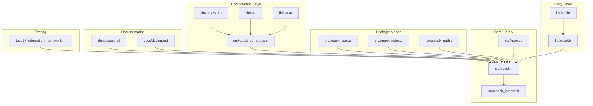

**Diagram sources**
- [xpack.h](file://src/xpack.h#L1-L447)
- [xpack.c](file://src/xpack.c#L1-L762)
- [xpack_internal.h](file://src/xpack_internal.h#L1-L145)

**Section sources**
- [xpack.h](file://src/xpack.h#L1-L447)
- [xpack.c](file://src/xpack.c#L1-L762)
- [xpack_internal.h](file://src/xpack_internal.h#L1-L145)

## Core Components

### xPack Object Model

The central abstraction in xPack is the `xpkObject` handle, which encapsulates all package state and operations:

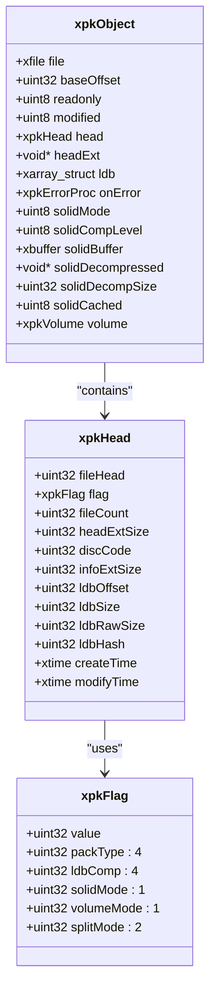

**Diagram sources**
- [xpack.h](file://src/xpack.h#L120-L148)
- [xpack_internal.h](file://src/xpack_internal.h#L47-L84)

### Package Types

xPack supports four distinct package types, each optimized for specific use cases:

| Type | Value | Access Method | Use Case |
|------|:-----:|---------------|----------|
| Core | 0 | Position-based (1-based) | Fixed-order files, minimal overhead |
| Index | 1 | Integer index | ID-based access, user data storage |
| Linux | 2 | Path-based (case-sensitive) | Unix/Linux systems, preserves case |
| Win32 | 3 | Path-based (case-insensitive) | Windows systems, case normalization |

**Section sources**
- [xpack.h](file://src/xpack.h#L38-L41)
- [xpack.h](file://src/xpack.h#L164-L237)

### Compression Level System

The compression system implements a sophisticated 0-15 level scale with strict monotonicity guarantees:

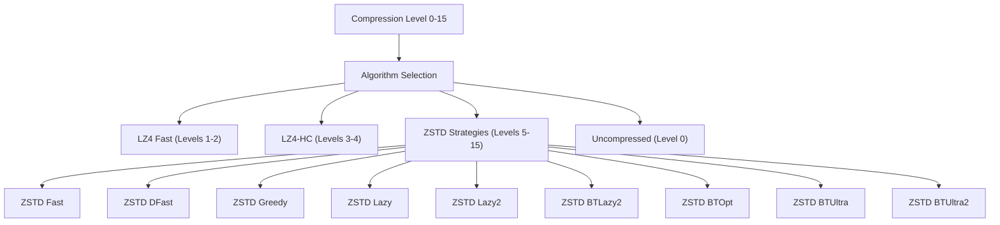

**Diagram sources**
- [xpack.h](file://src/xpack.h#L269-L286)
- [xpack_compress.c](file://src/xpack_compress.c#L20-L147)

**Section sources**
- [xpack.h](file://src/xpack.h#L269-L286)
- [xpack_compress.c](file://src/xpack_compress.c#L20-L147)

## Architecture Overview

The xPack architecture follows a layered design pattern with clear separation between compression, packaging, and utility layers:

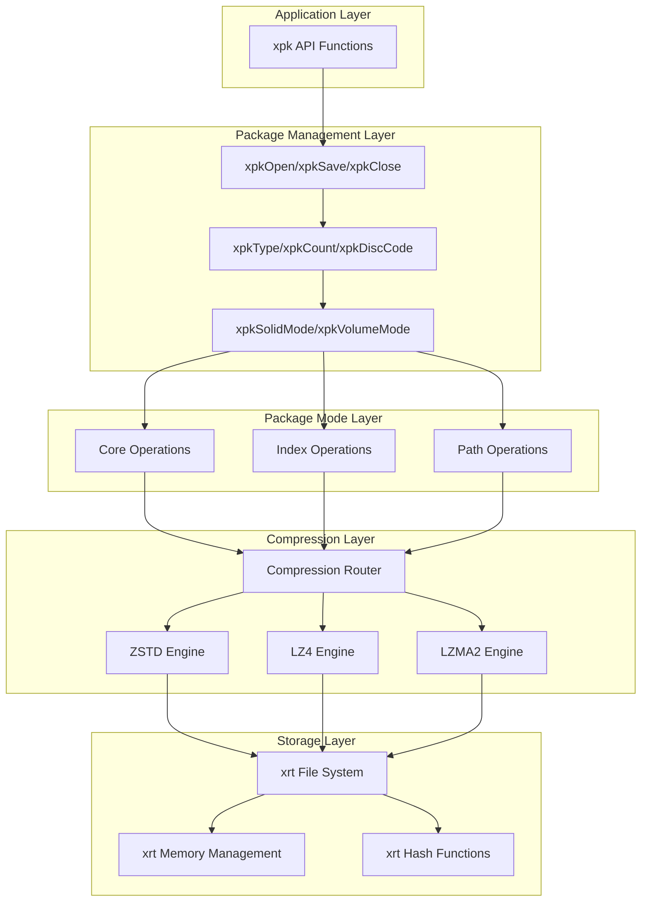

**Diagram sources**
- [xpack.c](file://src/xpack.c#L49-L297)
- [xpack_core.c](file://src/xpack_core.c#L18-L128)
- [xpack_compress.c](file://src/xpack_compress.c#L20-L147)

**Section sources**
- [xpack.c](file://src/xpack.c#L49-L297)
- [xpack_core.c](file://src/xpack_core.c#L18-L128)
- [xpack_compress.c](file://src/xpack_compress.c#L20-L147)

## Detailed Component Analysis

### Compression Engine

The compression engine serves as the heart of xPack's performance characteristics:

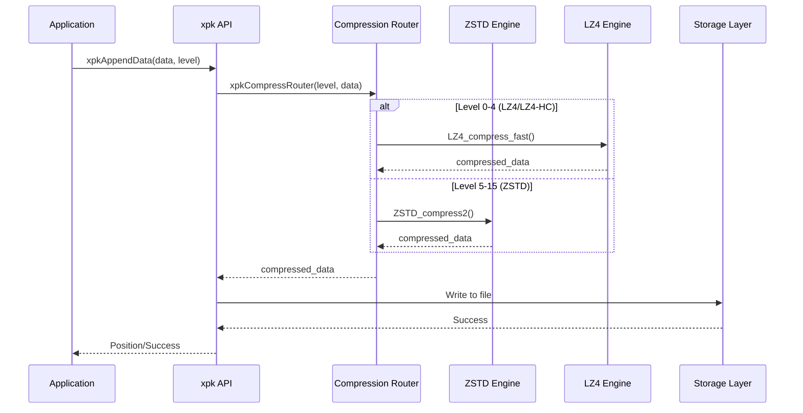

**Diagram sources**
- [xpack_compress.c](file://src/xpack_compress.c#L20-L147)
- [zstd.h](file://lib/zstd/zstd.h#L154-L175)

**Section sources**
- [xpack_compress.c](file://src/xpack_compress.c#L20-L147)
- [zstd.h](file://lib/zstd/zstd.h#L154-L175)

### Package Type Implementations

Each package type implements specialized operations optimized for its access pattern:

#### Core Mode Implementation
Core mode provides the simplest access pattern with sequential position-based indexing:

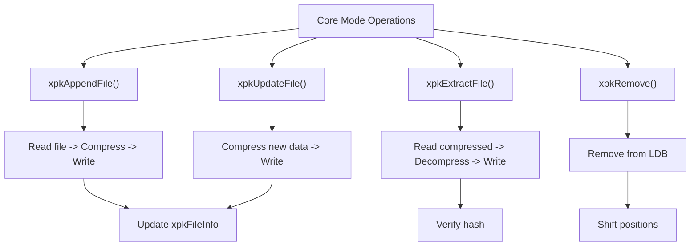

**Diagram sources**
- [xpack_core.c](file://src/xpack_core.c#L18-L128)

**Section sources**
- [xpack_core.c](file://src/xpack_core.c#L18-L128)

#### Index Mode Implementation
Index mode supports integer-based access with additional metadata storage:

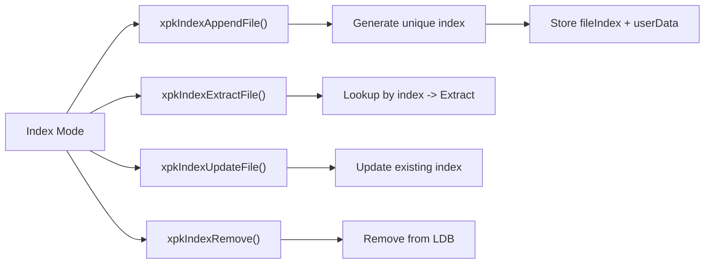

**Diagram sources**
- [xpack_index.c](file://src/xpack_index.c#L36-L174)

**Section sources**
- [xpack_index.c](file://src/xpack_index.c#L36-L174)

### Storage and Volume Management

xPack implements sophisticated storage management including volume splitting for large archives:

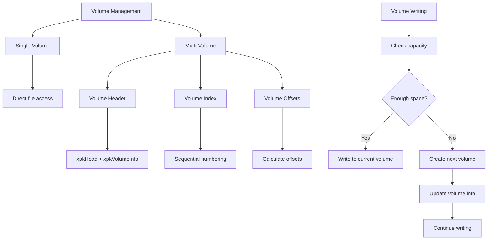

**Diagram sources**
- [xpack.c](file://src/xpack.c#L646-L761)
- [xpack_internal.h](file://src/xpack_internal.h#L23-L42)

**Section sources**
- [xpack.c](file://src/xpack.c#L646-L761)
- [xpack_internal.h](file://src/xpack_internal.h#L23-L42)

## Dependency Analysis

### External Dependencies

xPack maintains a minimal dependency footprint while leveraging powerful compression libraries:

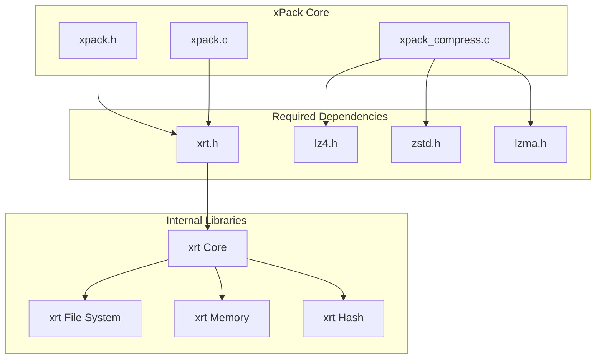

**Diagram sources**
- [xpack.h](file://src/xpack.h#L22-L23)
- [xpack_compress.c](file://src/xpack_compress.c#L9-L14)
- [xrt.h](file://lib/xrt/xrt.h#L1-L800)

### Internal Dependencies

The library exhibits clear internal dependency relationships:

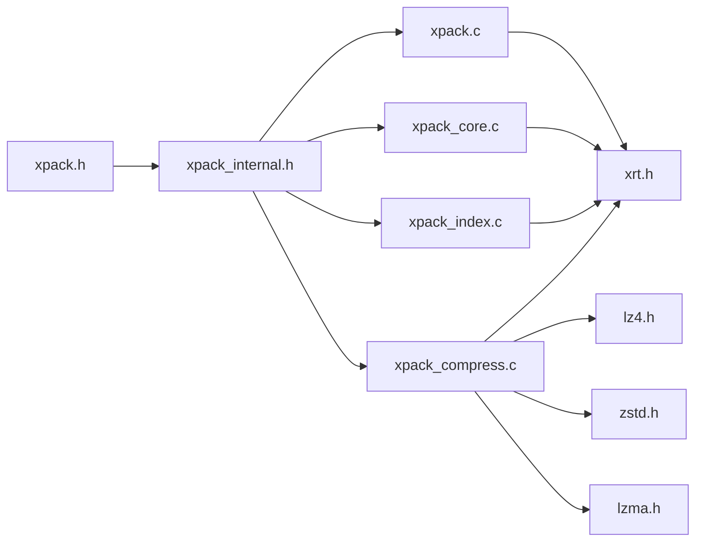

**Diagram sources**
- [xpack.h](file://src/xpack.h#L1-L447)
- [xpack_internal.h](file://src/xpack_internal.h#L10-L11)

**Section sources**
- [xpack.h](file://src/xpack.h#L1-L447)
- [xpack_internal.h](file://src/xpack_internal.h#L10-L11)

## Performance Considerations

### Compression Performance Characteristics

xPack's compression performance varies significantly across different levels and algorithms:

| Level | Algorithm | Compression Speed | Decompression Speed | Typical Ratio |
|-------|-----------|-------------------|-------------------|---------------|
| 0 | Uncompressed | ∞ | ∞ | 1.00 |
| 1 | LZ4 Fast | 780 MB/s | 4500 MB/s | ~2.10 |
| 2 | LZ4-HC Level 4 | 120 MB/s | 4500 MB/s | ~2.45 |
| 3 | LZ4-HC Level 9 | 40 MB/s | 4500 MB/s | ~2.72 |
| 4-15 | ZSTD Levels | 2-500 MB/s | 950-1400 MB/s | ~2.88-3.52 |

### Memory Management

The library employs sophisticated memory management strategies:

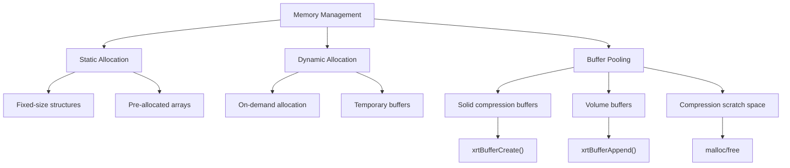

**Diagram sources**
- [xpack.c](file://src/xpack.c#L480-L525)
- [xpack_compress.c](file://src/xpack_compress.c#L227-L250)

### File System Integration

xPack integrates seamlessly with the underlying file system through the xrt library:

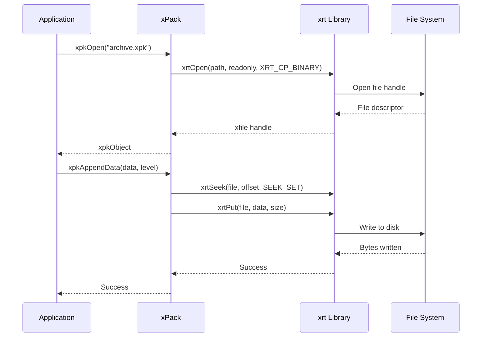

**Diagram sources**
- [xpack.c](file://src/xpack.c#L81-L82)
- [xpack_core.c](file://src/xpack_core.c#L100-L107)

**Section sources**
- [xpack.c](file://src/xpack.c#L480-L525)
- [xpack_compress.c](file://src/xpack_compress.c#L227-L250)
- [xpack.c](file://src/xpack.c#L81-L82)

## Troubleshooting Guide

### Common Error Scenarios

The library provides comprehensive error reporting through a centralized error system:

| Error Code | Description | Typical Cause | Solution |
|------------|-------------|---------------|----------|
| 1 | File open failed | Permission denied, path not found | Verify file path and permissions |
| 2 | File read failed | Disk corruption, incomplete file | Check file integrity, retry operation |
| 3 | Memory allocation failed | Insufficient RAM, fragmentation | Free memory, reduce compression level |
| 4 | Invalid pack format | Wrong file format, corrupted header | Verify file is valid xPack archive |
| 5 | Version not supported | Newer library version | Update xPack library |
| 6 | Invalid file position | Index out of bounds | Check file count and indices |
| 7 | Compression failed | Algorithm error, unsupported level | Try different compression level |
| 8 | Decompression failed | Corrupted data, wrong level | Verify data integrity, check level |
| 9 | Hash verification failed | Data corruption, tampering | Recreate archive, verify checksums |
| 10 | Readonly mode write denied | Attempted modification | Open with write permissions |
| 11 | Pack type mismatch | Wrong mode for operation | Set correct package type |

### Debugging Strategies

Effective debugging of xPack operations involves several key approaches:

1. **Error Checking**: Always check return values and use `xpkLastError()` for detailed error information
2. **Validation**: Use `xpkVerify()` and `xpkVerifyAll()` to validate archive integrity
3. **Statistics**: Monitor compression ratios and performance using `xpkStatGet()`
4. **Logging**: Implement custom error handlers via `xpkOnError()` for detailed diagnostics

**Section sources**
- [xpack.c](file://src/xpack.c#L27-L43)
- [xpack.h](file://src/xpack.h#L291-L296)

## Conclusion

xPack Ver7 represents a mature, production-ready compression library that successfully balances simplicity with powerful functionality. The library's evolution from Ver5 to Ver7 demonstrates a clear commitment to architectural refinement, focusing on ZSTD as the primary compression algorithm while maintaining flexibility through the 0-15 compression level system.

### Key Strengths

1. **Unified Design**: Single API surface supporting multiple compression algorithms and package types
2. **Performance Focus**: Optimized for both compression speed and decompression performance
3. **Cross-platform Compatibility**: Seamless operation across Linux and Windows environments
4. **Robust Architecture**: Clear separation of concerns with well-defined interfaces
5. **Comprehensive Testing**: Extensive test suite covering real-world usage scenarios

### Practical Applications

The library excels in several domains:

- **Game Asset Management**: Efficient compression of textures, models, and audio assets
- **Software Distribution**: Reliable packaging and delivery of application updates
- **Data Archiving**: Long-term storage solutions with excellent compression ratios
- **Real-time Systems**: Fast decompression for interactive applications

### Future Directions

The xPack Ver7 foundation provides a solid platform for future enhancements, including potential support for additional compression algorithms, enhanced parallel processing capabilities, and expanded platform support.