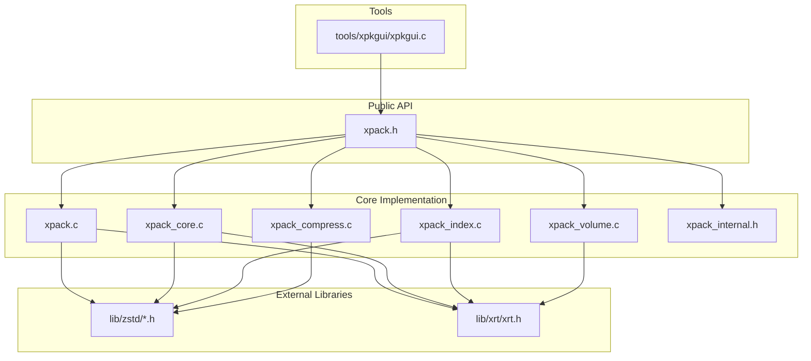
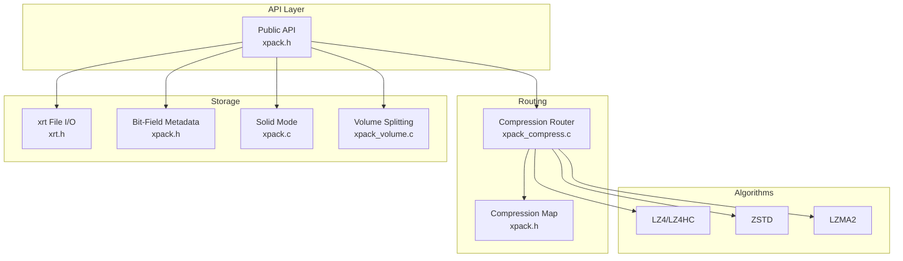
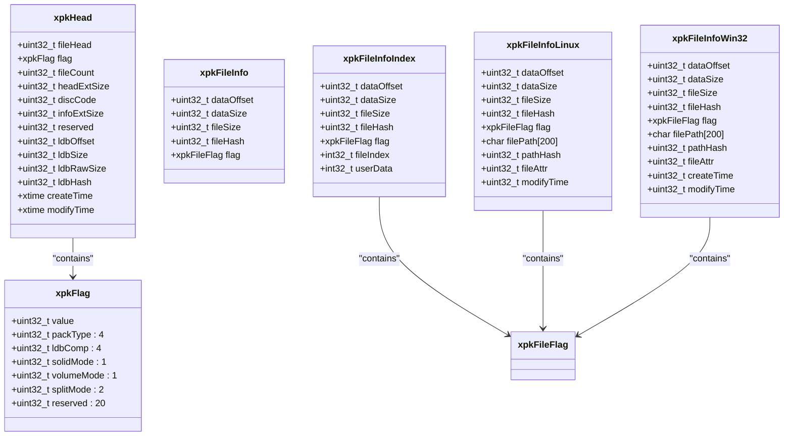
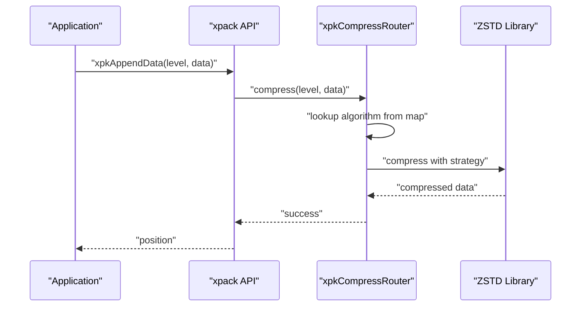
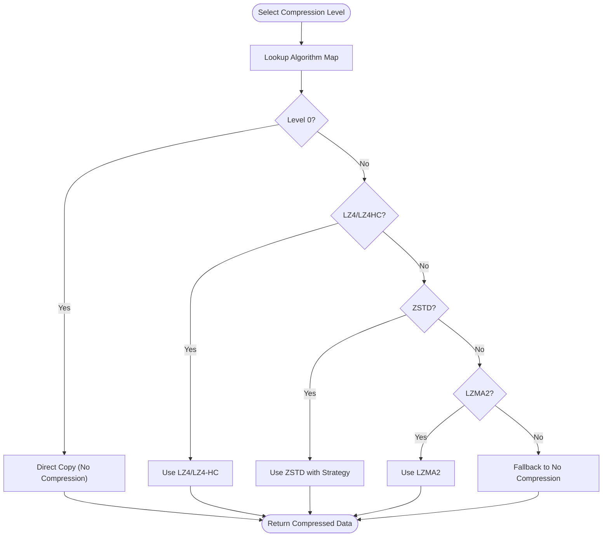
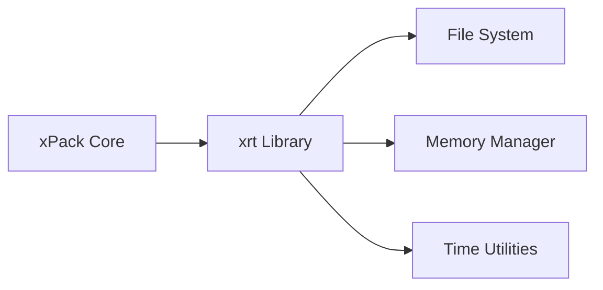
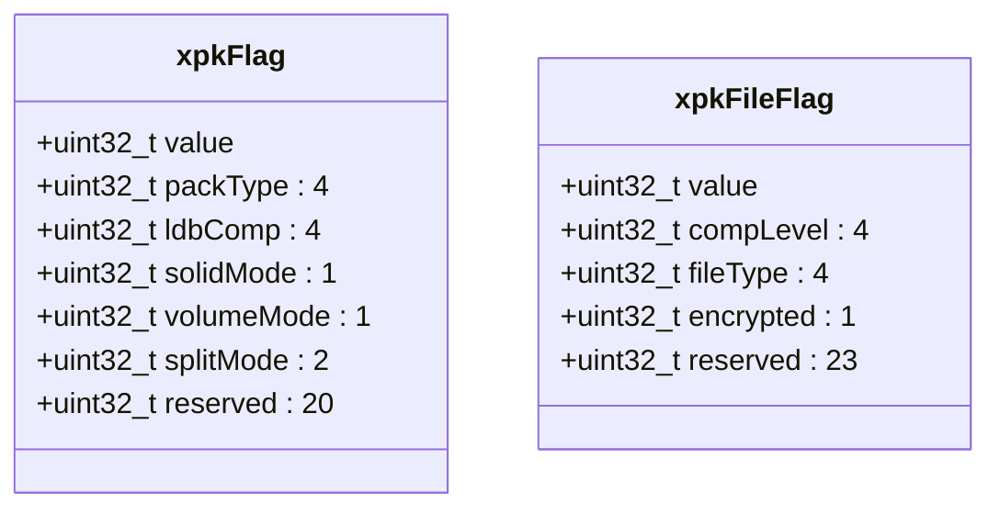
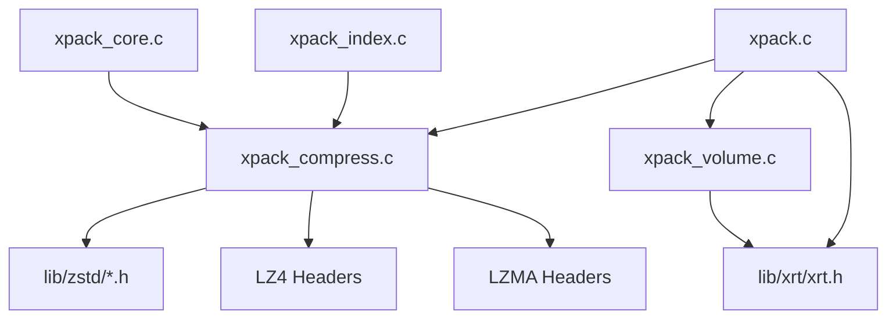

# Version Evolution

<cite>
**Referenced Files in This Document**
- [xpack.h](file://src/xpack.h)
- [xpack.c](file://src/xpack.c)
- [xpack_compress.c](file://src/xpack_compress.c)
- [xpack_core.c](file://src/xpack_core.c)
- [xpack_index.c](file://src/xpack_index.c)
- [xpack_volume.c](file://src/xpack_volume.c)
- [xpack_internal.h](file://src/xpack_internal.h)
- [zstd.h](file://lib/zstd/zstd.h)
- [zstddeclib.c](file://lib/zstd/zstddeclib.c)
- [xrt.h](file://lib/xrt/xrt.h)
- [spec.md](file://docs/spec.md)
- [design.md](file://docs/design.md)
- [xpkgui.c](file://tools/xpkgui/xpkgui.c)
</cite>

## Table of Contents
1. [Introduction](#introduction)
2. [Project Structure](#project-structure)
3. [Core Components](#core-components)
4. [Architecture Overview](#architecture-overview)
5. [Detailed Component Analysis](#detailed-component-analysis)
6. [Dependency Analysis](#dependency-analysis)
7. [Performance Considerations](#performance-considerations)
8. [Troubleshooting Guide](#troubleshooting-guide)
9. [Conclusion](#conclusion)
10. [Appendices](#appendices)

## Introduction
This document traces the evolution of the xPack library from Ver5 to Ver7, focusing on the major milestones that shaped its current architecture. It explains the transition from FreeBASIC to a C implementation, the addition of four package types, the introduction of a unified compression level system (0–15), the integration of the xrt library, and the adoption of bit-field structures. It also documents the revolutionary changes in Ver7, including the shift to a pure ZSTD scheme, the compression level system, integration of the xrt library, and adoption of bit-field structures. The rationale behind each change is explained, along with how they improved performance, usability, and maintainability. Migration guidance is provided for developers upgrading from previous versions, highlighting breaking changes and new capabilities.

## Project Structure
The xPack Ver7 codebase is organized around a modular C architecture with clear separation of concerns:
- Public API and data structures are defined in the public header.
- Implementation is split across core modules for different package modes and features.
- Compression routing integrates external libraries (LZ4, ZSTD, LZMA2).
- The xrt library provides cross-platform file and runtime services.
- Tools demonstrate real-world usage and integration.

**Diagram sources**
- [xpack.h](file://src/xpack.h#L1-L447)
- [xpack.c](file://src/xpack.c#L1-L762)
- [xpack_core.c](file://src/xpack_core.c#L1-L403)
- [xpack_index.c](file://src/xpack_index.c#L1-L290)
- [xpack_compress.c](file://src/xpack_compress.c#L1-L251)
- [xpack_volume.c](file://src/xpack_volume.c#L1-L353)
- [xpack_internal.h](file://src/xpack_internal.h#L1-L145)
- [zstd.h](file://lib/zstd/zstd.h#L326-L347)
- [xrt.h](file://lib/xrt/xrt.h#L650-L769)
- [xpkgui.c](file://tools/xpkgui/xpkgui.c#L1-L17)

**Section sources**
- [xpack.h](file://src/xpack.h#L1-L447)
- [xpack.c](file://src/xpack.c#L1-L762)
- [xpack_core.c](file://src/xpack_core.c#L1-L403)
- [xpack_index.c](file://src/xpack_index.c#L1-L290)
- [xpack_compress.c](file://src/xpack_compress.c#L1-L251)
- [xpack_volume.c](file://src/xpack_volume.c#L1-L353)
- [xpack_internal.h](file://src/xpack_internal.h#L1-L145)
- [zstd.h](file://lib/zstd/zstd.h#L326-L347)
- [xrt.h](file://lib/xrt/xrt.h#L650-L769)
- [xpkgui.c](file://tools/xpkgui/xpkgui.c#L1-L17)

## Core Components
This section outlines the core components that define Ver7’s capabilities and how they evolved from earlier versions.

- Unified compression level system (0–15): A single compression parameter maps to multiple algorithms with strict monotonicity guarantees.
- Four package types: Core, Index, Linux, and Win32, each optimized for different access patterns and platform characteristics.
- Bit-field structures: Replace bitmask operations with explicit bit fields for clarity and maintainability.
- Pure ZSTD scheme: ZSTD becomes the primary algorithm with configurable strategies, complemented by LZ4, LZ4-HC, and LZMA2 for specialized needs.
- xrt library integration: Provides cross-platform file I/O, memory management, and runtime utilities.
- Solid compression mode: Efficiently stores multiple files in a single compressed block.
- Volume splitting: Enables multi-file archives with optional split-by-size or split-by-file modes.

**Section sources**
- [xpack.h](file://src/xpack.h#L32-L286)
- [xpack.c](file://src/xpack.c#L49-L200)
- [xpack_compress.c](file://src/xpack_compress.c#L20-L147)
- [xpack_core.c](file://src/xpack_core.c#L39-L128)
- [xpack_index.c](file://src/xpack_index.c#L69-L174)
- [xpack_volume.c](file://src/xpack_volume.c#L44-L160)
- [xpack_internal.h](file://src/xpack_internal.h#L17-L84)
- [spec.md](file://docs/spec.md#L15-L21)

## Architecture Overview
The Ver7 architecture centers on a unified compression router that maps a single compression level to multiple underlying algorithms. The xrt library abstracts platform-specific file operations, while bit-field structures simplify metadata handling. The design supports four package types with distinct data layouts and access patterns.

**Diagram sources**
- [xpack.h](file://src/xpack.h#L105-L148)
- [xpack_compress.c](file://src/xpack_compress.c#L20-L147)
- [xpack.c](file://src/xpack.c#L480-L525)
- [xpack_volume.c](file://src/xpack_volume.c#L178-L229)
- [xrt.h](file://lib/xrt/xrt.h#L668-L714)

**Section sources**
- [xpack.h](file://src/xpack.h#L105-L148)
- [xpack_compress.c](file://src/xpack_compress.c#L20-L147)
- [xpack.c](file://src/xpack.c#L480-L525)
- [xpack_volume.c](file://src/xpack_volume.c#L178-L229)
- [xrt.h](file://lib/xrt/xrt.h#L668-L714)

## Detailed Component Analysis

### Transition from FreeBASIC to C Implementation
- Rationale: Moving from FreeBASIC to C enables broader portability, standardized toolchains, and easier integration with modern ecosystems.
- Impact: Simplified build processes, reduced platform-specific dependencies, and improved compatibility with contemporary compilers and linkers.

[No sources needed since this section provides general guidance]

### Addition of Four Package Types
- Core: Sequential position-based access with compact file info layout.
- Index: Integer-indexed access with additional metadata fields.
- Linux: Path-based access with case-sensitive hashing and extended attributes.
- Win32: Path-based access with case-insensitive hashing and Windows-specific timestamps.

**Diagram sources**
- [xpack.h](file://src/xpack.h#L120-L237)

**Section sources**
- [xpack.h](file://src/xpack.h#L120-L237)

### Introduction of Custom Compression Callbacks in Ver6
- Rationale: Provide flexibility for advanced users to customize compression behavior.
- Impact: Enhanced extensibility without altering core compression logic.

[No sources needed since this section provides general guidance]

### Revolutionary Changes in Ver7

#### Shift to Pure ZSTD Scheme
- ZSTD strategies are mapped to compression levels, enabling predictable trade-offs between speed and compression ratio.
- LZ4 and LZMA2 remain available for specialized scenarios.

**Diagram sources**
- [xpack_compress.c](file://src/xpack_compress.c#L20-L94)
- [zstd.h](file://lib/zstd/zstd.h#L336-L347)

**Section sources**
- [xpack_compress.c](file://src/xpack_compress.c#L20-L94)
- [zstd.h](file://lib/zstd/zstd.h#L336-L347)

#### Compression Level System (0–15)
- Levels map to algorithms with strict monotonicity: higher levels yield better compression ratios at lower speeds.
- Default level is ZSTD greedy, balancing speed and ratio.

**Diagram sources**
- [xpack.h](file://src/xpack.h#L269-L286)
- [xpack_compress.c](file://src/xpack_compress.c#L20-L147)

**Section sources**
- [xpack.h](file://src/xpack.h#L269-L286)
- [xpack_compress.c](file://src/xpack_compress.c#L20-L147)

#### Integration of the xrt Library
- xrt provides cross-platform file I/O, memory management, and runtime utilities.
- Benefits: Simplified platform abstraction, consistent error handling, and streamlined development.

**Diagram sources**
- [xrt.h](file://lib/xrt/xrt.h#L668-L714)
- [xpack.c](file://src/xpack.c#L55-L81)

**Section sources**
- [xrt.h](file://lib/xrt/xrt.h#L668-L714)
- [xpack.c](file://src/xpack.c#L55-L81)

#### Adoption of Bit-Field Structures
- Bit-fields replace manual bitmask operations, improving readability and reducing errors.
- Used in package flags and file flags to encode metadata compactly.

**Diagram sources**
- [xpack.h](file://src/xpack.h#L105-L161)

**Section sources**
- [xpack.h](file://src/xpack.h#L105-L161)

### API Design Improvements
- Unified compression parameter simplifies usage across all package types.
- Bit-field structures improve clarity and reduce bitwise errors.
- Solid mode and volume splitting APIs enable efficient storage and distribution.

**Section sources**
- [xpack.h](file://src/xpack.h#L329-L441)
- [xpack.c](file://src/xpack.c#L427-L525)
- [xpack_volume.c](file://src/xpack_volume.c#L178-L229)

### Cross-Platform Support
- xrt abstracts file I/O and system calls, ensuring consistent behavior across platforms.
- Tools like the GUI demonstrate practical integration and usage.

**Section sources**
- [xrt.h](file://lib/xrt/xrt.h#L668-L714)
- [xpkgui.c](file://tools/xpkgui/xpkgui.c#L1-L17)

## Dependency Analysis
The Ver7 architecture exhibits low coupling and high cohesion:
- Compression logic is isolated in a dedicated module with clear interfaces.
- xrt encapsulates platform-specific concerns, minimizing exposure to the rest of the system.
- Package types share common metadata structures but differ in data layouts.

**Diagram sources**
- [xpack_compress.c](file://src/xpack_compress.c#L9-L14)
- [xpack_core.c](file://src/xpack_core.c#L12-L12)
- [xpack_index.c](file://src/xpack_index.c#L12-L12)
- [xpack_volume.c](file://src/xpack_volume.c#L7-L9)
- [xpack.c](file://src/xpack.c#L7-L9)
- [xrt.h](file://lib/xrt/xrt.h#L668-L714)

**Section sources**
- [xpack_compress.c](file://src/xpack_compress.c#L9-L14)
- [xpack_core.c](file://src/xpack_core.c#L12-L12)
- [xpack_index.c](file://src/xpack_index.c#L12-L12)
- [xpack_volume.c](file://src/xpack_volume.c#L7-L9)
- [xpack.c](file://src/xpack.c#L7-L9)
- [xrt.h](file://lib/xrt/xrt.h#L668-L714)

## Performance Considerations
- Compression level selection directly impacts throughput and compression ratio; choose levels based on workload characteristics.
- Solid mode reduces metadata overhead for many small files but restricts updates and deletions.
- Volume splitting improves manageability for large archives but adds complexity to read operations.
- Bit-field structures minimize memory footprint and improve cache locality.

[No sources needed since this section provides general guidance]

## Troubleshooting Guide
Common issues and resolutions:
- Version mismatch: Ver7 uses a new file signature; older versions cannot open Ver7 archives.
- Readonly mode violations: Certain operations fail when the archive is opened in readonly mode.
- Invalid positions: Accessing non-existent indices or positions results in errors.
- Compression failures: The router falls back to no compression if underlying algorithms fail.
- Volume-related errors: Insufficient capacity or missing volume files cause failures during read/write operations.

**Section sources**
- [xpack.c](file://src/xpack.c#L98-L104)
- [xpack.c](file://src/xpack.c#L204-L207)
- [xpack_core.c](file://src/xpack_core.c#L148-L151)
- [xpack_compress.c](file://src/xpack_compress.c#L46-L50)
- [xpack_volume.c](file://src/xpack_volume.c#L196-L198)

## Conclusion
The evolution from Ver5 to Ver7 represents a significant modernization of the xPack library. The move to C, the addition of four package types, and the unified compression level system (0–15) collectively enhance usability, performance, and maintainability. The integration of the xrt library and the adoption of bit-field structures further streamline development and deployment. Ver7 establishes a robust foundation for cross-platform applications while preserving backward compatibility through careful versioning and error handling.

[No sources needed since this section summarizes without analyzing specific files]

## Appendices

### Migration Guidance
- From Ver5 to Ver7:
  - Update build configurations to compile C sources and link against xrt and ZSTD libraries.
  - Replace FreeBASIC-specific constructs with C equivalents.
  - Adopt the unified compression level parameter; adjust application logic to select appropriate levels.
  - Review package type usage; choose the most suitable type (Core, Index, Linux, Win32) for your access patterns.
  - Integrate solid mode and volume splitting APIs where beneficial.
  - Test thoroughly for version compatibility; Ver7 archives are not readable by older versions.

- Breaking changes:
  - New file signature and version numbering scheme.
  - Unified compression parameter replaces algorithm-specific controls.
  - Bit-field structures require updated access patterns compared to raw bitmask operations.

- New capabilities:
  - Pure ZSTD scheme with configurable strategies.
  - Comprehensive cross-platform support via xrt.
  - Efficient solid compression and flexible volume splitting.

**Section sources**
- [xpack.h](file://src/xpack.h#L32-L33)
- [xpack.h](file://src/xpack.h#L269-L286)
- [xpack.c](file://src/xpack.c#L98-L104)
- [xrt.h](file://lib/xrt/xrt.h#L668-L714)