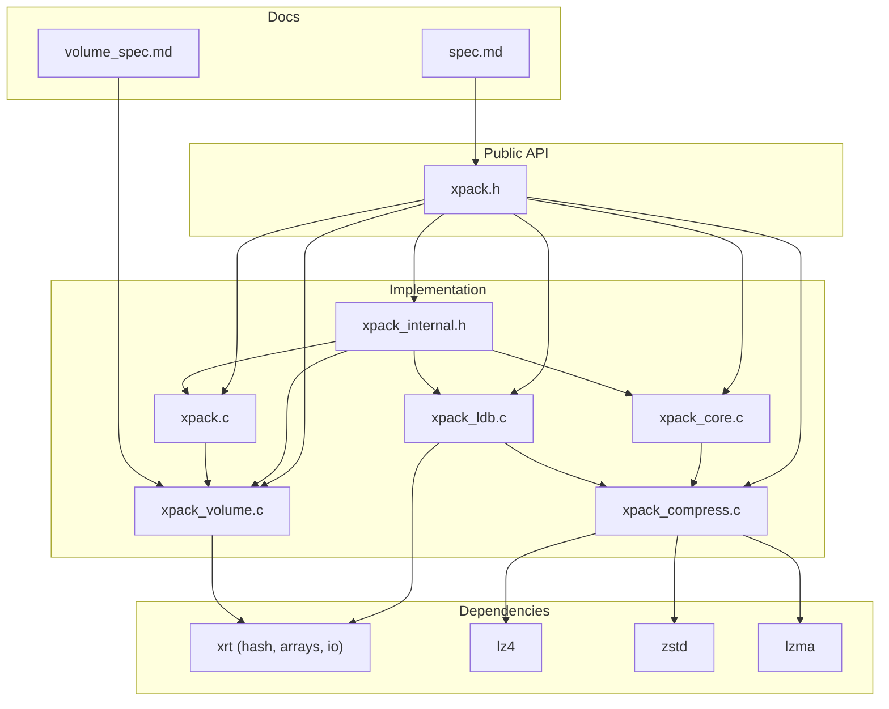
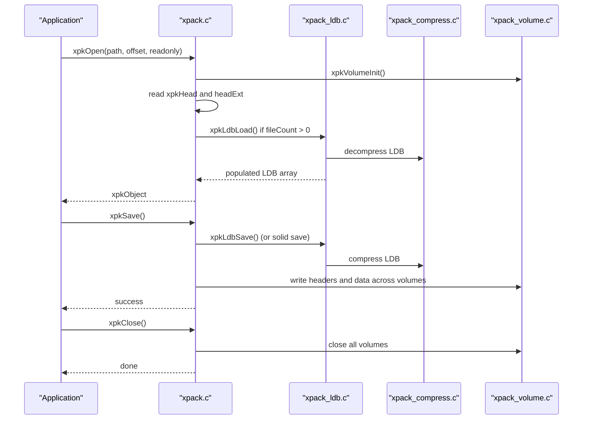
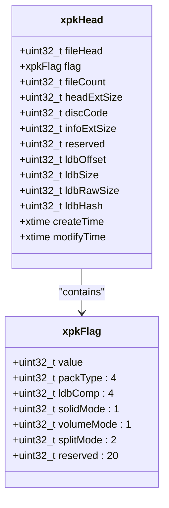
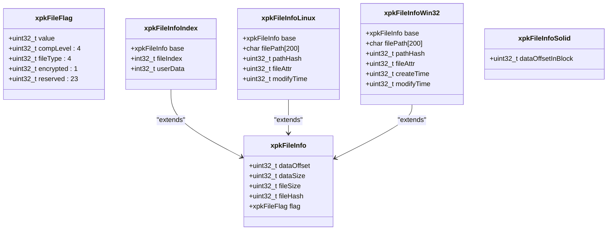
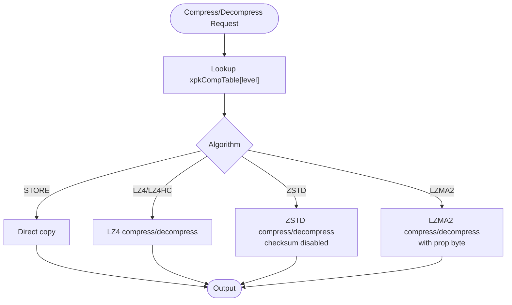
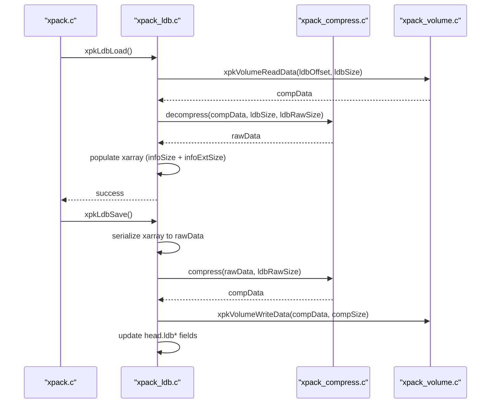
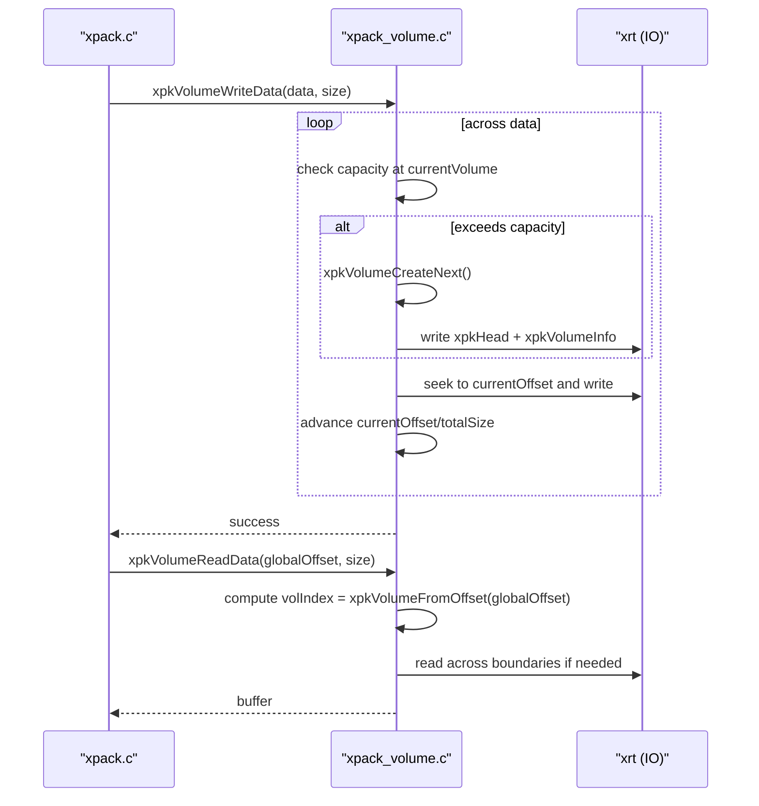
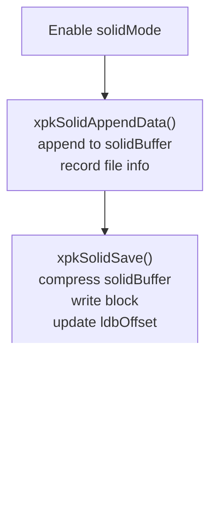
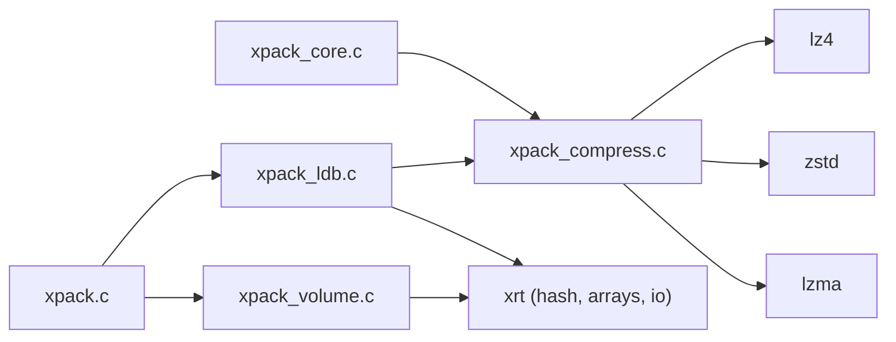

# Technical Specifications

<cite>
**Referenced Files in This Document**
- [xpack.h](file://src/xpack.h)
- [xpack_internal.h](file://src/xpack_internal.h)
- [xpack.c](file://src/xpack.c)
- [xpack_core.c](file://src/xpack_core.c)
- [xpack_ldb.c](file://src/xpack_ldb.c)
- [xpack_compress.c](file://src/xpack_compress.c)
- [xpack_volume.c](file://src/xpack_volume.c)
- [spec.md](file://docs/spec.md)
- [volume_spec.md](file://docs/volume_spec.md)
- [xpack.h](file://lib/xrt/lib/base.h)
- [xpack.h](file://lib/xrt/lib/hash.h)
</cite>

## Table of Contents
1. [Introduction](#introduction)
2. [Project Structure](#project-structure)
3. [Core Components](#core-components)
4. [Architecture Overview](#architecture-overview)
5. [Detailed Component Analysis](#detailed-component-analysis)
6. [Dependency Analysis](#dependency-analysis)
7. [Performance Considerations](#performance-considerations)
8. [Troubleshooting Guide](#troubleshooting-guide)
9. [Conclusion](#conclusion)
10. [Appendices](#appendices)

## Introduction
This document specifies the xPack Ver7 file format and protocol, focusing on the complete 48-byte package header, bit-field organization, compression metadata, and Library Database (LDB) format. It also documents the multi-volume specification, split archive handling, and volume management protocols. The content is derived from the repository’s public headers, internal headers, implementation files, and design/specification documents.

## Project Structure
The xPack library is organized around a compact set of core files and supporting modules:
- Public API and data structures: src/xpack.h
- Internal runtime structures and helpers: src/xpack_internal.h
- Main lifecycle and volume management: src/xpack.c
- Core operations (add/extract/update/remove): src/xpack_core.c
- LDB load/save and hashing: src/xpack_ldb.c
- Compression routing and bounds: src/xpack_compress.c
- Multi-volume manager: src/xpack_volume.c
- Design/specifications: docs/spec.md, docs/volume_spec.md
- Dependencies: xrt library (hash, arrays, file IO), lz4, zstd, lzma

**Diagram sources**
- [xpack.h](file://src/xpack.h#L1-L447)
- [xpack_internal.h](file://src/xpack_internal.h#L1-L145)
- [xpack.c](file://src/xpack.c#L1-L762)
- [xpack_core.c](file://src/xpack_core.c#L1-L403)
- [xpack_ldb.c](file://src/xpack_ldb.c#L1-L198)
- [xpack_compress.c](file://src/xpack_compress.c#L1-L251)
- [xpack_volume.c](file://src/xpack_volume.c#L1-L353)
- [spec.md](file://docs/spec.md#L1-L458)
- [volume_spec.md](file://docs/volume_spec.md#L1-L835)

**Section sources**
- [xpack.h](file://src/xpack.h#L1-L447)
- [xpack_internal.h](file://src/xpack_internal.h#L1-L145)
- [spec.md](file://docs/spec.md#L1-L458)
- [volume_spec.md](file://docs/volume_spec.md#L1-L835)

## Core Components
This section defines the fundamental data structures and their bit-field organization, along with the package header and LDB layout.

- Package Header (xpkHead)
  - Fixed-size 48-byte header containing file signature, flags, counts, offsets, timestamps, and LDB metadata.
  - Bit-field organization via xpkFlag controls pack type, LDB compression level, solid mode, volume mode, and split mode.
  - LDB metadata includes offset, compressed size, raw size, and hash.

- File Information Structures
  - Core mode: xpkFileInfo (20 bytes) with dataOffset, dataSize, fileSize, fileHash, and xpkFileFlag.
  - Index mode: xpkFileInfoIndex (28 bytes) extends Core with fileIndex and userData.
  - Linux mode: xpkFileInfoLinux (232 bytes) extends Core with filePath[XPK_PATH_MAX], pathHash, fileAttr, modifyTime.
  - Win32 mode: xpkFileInfoWin32 (236 bytes) extends Core with filePath[XPK_PATH_MAX], pathHash, fileAttr, createTime, modifyTime.
  - Solid mode extension: xpkFileInfoSolid (4 bytes) stores per-file offset within a solid block.

- Compression Metadata
  - xpkFileFlag holds compLevel (4 bits), fileType (4 bits), and encrypted marker (1 bit).
  - Compression mapping table xpkCompTable[16] maps xPack levels to algorithms and native parameters.

- Multi-volume Structures
  - xpkVolumeInfo (8 bytes) stored in headExt for multi-volume support.
  - Runtime xpkVolume tracks enabled state, volumeSize, splitMode, currentVolume/currentOffset, basePath, handles, and volumeOffsets.

**Section sources**
- [xpack.h](file://src/xpack.h#L105-L148)
- [xpack.h](file://src/xpack.h#L153-L246)
- [xpack.h](file://src/xpack.h#L269-L286)
- [xpack_internal.h](file://src/xpack_internal.h#L23-L42)
- [spec.md](file://docs/spec.md#L108-L171)

## Architecture Overview
The xPack architecture separates concerns across layers:
- Public API layer exposes xpkOpen/xpkSave/xpkClose and operation APIs.
- Implementation layer manages lifecycle, LDB, compression, and solid mode.
- Volume manager abstracts multi-volume I/O and routing.
- Compression router selects LZ4, LZ4-HC, ZSTD, or LZMA2 based on mapped levels.
- LDB is stored as a compressed array of file info records.

**Diagram sources**
- [xpack.c](file://src/xpack.c#L49-L200)
- [xpack_ldb.c](file://src/xpack_ldb.c#L26-L95)
- [xpack_compress.c](file://src/xpack_compress.c#L20-L147)
- [xpack_volume.c](file://src/xpack_volume.c#L44-L160)

**Section sources**
- [xpack.c](file://src/xpack.c#L202-L259)
- [xpack_ldb.c](file://src/xpack_ldb.c#L101-L197)
- [xpack_compress.c](file://src/xpack_compress.c#L20-L147)
- [xpack_volume.c](file://src/xpack_volume.c#L178-L229)

## Detailed Component Analysis

### Package Header and Bit-Field Organization
- Signature and Version
  - fileHead contains “xpk” plus version (0x116B7078 for Ver7).
  - Compatibility: Ver6 files use 0x106B7078; Ver7 ignores volumeMode for backward compatibility.
- Flags (xpkFlag)
  - packType (4 bits): Core/Index/Linux/Win32.
  - ldbComp (4 bits): LDB compression level.
  - solidMode (1 bit): Enables solid compression.
  - volumeMode (1 bit): Enables multi-volume mode.
  - splitMode (2 bits): 0=byte-split, 1=file-split.
  - reserved (20 bits): Reserved for future use.
- LDB Metadata
  - ldbOffset, ldbSize, ldbRawSize, ldbHash.
- Timestamps
  - createTime and modifyTime encoded via xtime.

**Diagram sources**
- [xpack.h](file://src/xpack.h#L105-L148)

**Section sources**
- [xpack.h](file://src/xpack.h#L120-L148)
- [xpack.h](file://src/xpack.h#L105-L115)
- [spec.md](file://docs/spec.md#L126-L157)

### File Information Structures and Variants
- Core Mode (xpkFileInfo)
  - 20 bytes: dataOffset, dataSize, fileSize, fileHash, xpkFileFlag.
- Index Mode (xpkFileInfoIndex)
  - Extends Core with fileIndex (int32) and userData (int32).
- Linux Mode (xpkFileInfoLinux)
  - Extends Core with filePath[XPK_PATH_MAX], pathHash, fileAttr, modifyTime.
- Win32 Mode (xpkFileInfoWin32)
  - Extends Core with filePath[XPK_PATH_MAX], pathHash, fileAttr, createTime, modifyTime.
- Solid Extension (xpkFileInfoSolid)
  - Per-file offset within a solid block.

**Diagram sources**
- [xpack.h](file://src/xpack.h#L153-L246)

**Section sources**
- [xpack.h](file://src/xpack.h#L166-L246)
- [spec.md](file://docs/spec.md#L175-L216)

### Compression Mapping and Routing
- Level-to-algorithm mapping
  - Levels 0–15 map to STORE, LZ4, LZ4-HC, ZSTD, LZMA2 with native parameters.
- Compression/Decompression
  - Router selects algorithm and strategy; ZSTD checksum disabled in favor of xrtHash32.
  - Bounds estimation for allocation safety.

**Diagram sources**
- [xpack_compress.c](file://src/xpack_compress.c#L20-L147)
- [xpack.h](file://src/xpack.h#L269-L286)

**Section sources**
- [xpack_compress.c](file://src/xpack_compress.c#L20-L147)
- [xpack.h](file://src/xpack.h#L269-L286)

### LDB (Library Database) Format and Operations
- Layout
  - Stored after file data, referenced by ldbOffset, ldbSize, ldbRawSize, ldbHash.
  - Compressed using level ldbComp; hash validated during load.
- Load/Save
  - Load reads compressed LDB, validates hash, decompresses, and populates xarray.
  - Save serializes xarray entries (including infoExtSize padding), compresses, writes, updates header.

**Diagram sources**
- [xpack_ldb.c](file://src/xpack_ldb.c#L26-L95)
- [xpack_ldb.c](file://src/xpack_ldb.c#L101-L197)
- [xpack_volume.c](file://src/xpack_volume.c#L235-L319)
- [xpack_compress.c](file://src/xpack_compress.c#L227-L250)

**Section sources**
- [xpack_ldb.c](file://src/xpack_ldb.c#L26-L95)
- [xpack_ldb.c](file://src/xpack_ldb.c#L101-L197)

### Multi-Volume Specification and Protocol
- Volume Header Extension
  - headExtSize = 8; xpkVolumeInfo contains volumeCount and volumeIndex.
- Flags Expansion
  - volumeMode enables multi-volume; splitMode selects byte vs file splitting.
- Volume Management
  - xpkVolumeInit initializes state; xpkVolumeOpen opens subsequent volumes on demand.
  - xpkVolumeWriteData and xpkVolumeReadData route across volumes using volumeOffsets.
  - xpkVolumeCreateNext creates new volumes and writes headers.
- Naming and Offsets
  - First volume retains original extension; subsequent volumes use .xNN suffix.
  - volumeOffsets track cumulative sizes for cross-volume addressing.

**Diagram sources**
- [xpack_volume.c](file://src/xpack_volume.c#L178-L229)
- [xpack_volume.c](file://src/xpack_volume.c#L235-L319)
- [xpack_volume.c](file://src/xpack_volume.c#L44-L160)
- [volume_spec.md](file://docs/volume_spec.md#L198-L276)

**Section sources**
- [xpack_internal.h](file://src/xpack_internal.h#L23-L42)
- [xpack_volume.c](file://src/xpack_volume.c#L15-L38)
- [xpack_volume.c](file://src/xpack_volume.c#L113-L160)
- [xpack_volume.c](file://src/xpack_volume.c#L166-L172)
- [xpack_volume.c](file://src/xpack_volume.c#L325-L338)
- [volume_spec.md](file://docs/volume_spec.md#L198-L276)

### Solid Compression Mode
- Behavior
  - All files appended to a single solid block; LDB entries record per-file offsets within the block.
  - On extract, the entire solid block is decompressed once and sliced per-file.
- Creation and Save
  - xpkSolidAppendData accumulates data and metadata; xpkSolidSave compresses and writes the block, updates ldbOffset.
- Extraction
  - xpkSolidExtractData computes offsetInBlock and slices from cached decompressed buffer.

**Diagram sources**
- [xpack.c](file://src/xpack.c#L427-L478)
- [xpack.c](file://src/xpack.c#L480-L525)
- [xpack.c](file://src/xpack.c#L527-L556)
- [xpack.c](file://src/xpack.c#L558-L606)
- [xpack.c](file://src/xpack.c#L608-L616)

**Section sources**
- [xpack.c](file://src/xpack.c#L427-L478)
- [xpack.c](file://src/xpack.c#L480-L525)
- [xpack.c](file://src/xpack.c#L527-L556)
- [xpack.c](file://src/xpack.c#L558-L606)
- [xpack.c](file://src/xpack.c#L608-L616)

### Cross-Platform Compatibility, Version Negotiation, and Upgrade Procedures
- Version Negotiation
  - fileHead encodes version; Ver6 (0x106B7078) and Ver7 (0x116B7078) supported.
  - Ver7 ignores volumeMode for backward compatibility; newer versions (future) will support multi-volume.
- Platform Modes
  - Linux mode: pathHash computed with case sensitivity.
  - Win32 mode: pathHash normalized to lowercase.
- Upgrade Path
  - Newer versions can add reserved fields; existing readers should ignore unknown bits.
  - Multi-volume requires Ver7.1+; older versions treat volumeMode as unsupported.

**Section sources**
- [xpack.h](file://src/xpack.h#L32-L33)
- [xpack.c](file://src/xpack.c#L98-L104)
- [volume_spec.md](file://docs/volume_spec.md#L674-L696)

## Dependency Analysis
- Internal Coupling
  - xpack.c depends on xpack_internal.h for runtime structures and volume helpers.
  - xpack_core.c depends on xpack_compress.c for compression routines.
  - xpack_ldb.c depends on xpack_compress.c and xrt for hashing and arrays.
  - xpack_volume.c depends on xrt for file I/O and on xpack.c for shared constants.
- External Dependencies
  - xrt: hash (xrtHash32), arrays (xrtArray), file I/O (xrtOpen/Put/Get), time (xtime).
  - Compression libraries: lz4, zstd, lzma.

**Diagram sources**
- [xpack.c](file://src/xpack.c#L1-L762)
- [xpack_core.c](file://src/xpack_core.c#L1-L403)
- [xpack_ldb.c](file://src/xpack_ldb.c#L1-L198)
- [xpack_compress.c](file://src/xpack_compress.c#L1-L251)
- [xpack_volume.c](file://src/xpack_volume.c#L1-L353)

**Section sources**
- [xpack.c](file://src/xpack.c#L1-L762)
- [xpack_core.c](file://src/xpack_core.c#L1-L403)
- [xpack_ldb.c](file://src/xpack_ldb.c#L1-L198)
- [xpack_compress.c](file://src/xpack_compress.c#L1-L251)
- [xpack_volume.c](file://src/xpack_volume.c#L1-L353)

## Performance Considerations
- Compression Levels
  - Levels 0–15 map to algorithms with increasing compression ratios and decreasing speed.
- Solid Mode
  - Reduces metadata overhead and improves ratio for repeated data; decompresses once per block on read.
- Multi-volume
  - Minimal overhead for sequential access; cross-volume reads incur boundary checks and potential reopens.
- Hashing
  - xrtHash32 used for file and LDB integrity; fast and suitable for large archives.

[No sources needed since this section provides general guidance]

## Troubleshooting Guide
Common errors and their likely causes:
- Invalid pack format (4)
  - Occurs when fileHead does not match XPK_VERSION.
- Version not supported (5)
  - Attempting to open Ver7 file with older reader that ignores volumeMode.
- Compression/Decompression failures (7/8)
  - Compression router fallback to STORE when underlying library fails.
- Hash verification failed (9)
  - LDB hash mismatch indicates corruption or tampering.
- Readonly mode write denied (10)
  - Write attempted on read-only handle.
- Maximum volume count exceeded (12)
  - Exceeded XPK_MAX_VOLUMES (256).
- Volume file not available (13)
  - Missing or inaccessible volume file.
- Volume data incomplete (14)
  - Cross-volume read could not locate a required volume.

Mitigation steps:
- Verify fileHead and version compatibility.
- Rebuild LDB if hash verification fails.
- Ensure all volumes are present and readable.
- Use xpkRebuild to optimize fragmented independent archives.

**Section sources**
- [xpack.c](file://src/xpack.c#L27-L43)
- [xpack_ldb.c](file://src/xpack_ldb.c#L47-L53)
- [xpack_volume.c](file://src/xpack_volume.c#L117-L120)
- [xpack_volume.c](file://src/xpack_volume.c#L287-L289)
- [xpack_volume.c](file://src/xpack_volume.c#L281-L283)

## Conclusion
xPack Ver7 defines a compact, extensible archive format with strong bit-field organization, flexible compression mapping, robust LDB storage, and transparent multi-volume support. The design balances performance, portability, and maintainability, with clear upgrade paths and compatibility safeguards.

[No sources needed since this section summarizes without analyzing specific files]

## Appendices

### A. File Format Layout and Encoding
- Header: 48 bytes fixed; headExt optional; data area compressed; LDB compressed after data.
- Endianness: Defined by platform-specific xrt I/O; bit-fields packed per xpack.h.
- Alignment: Structs declared with #pragma pack(1) to ensure strict binary layout.

**Section sources**
- [xpack.h](file://src/xpack.h#L120-L148)
- [spec.md](file://docs/spec.md#L108-L125)

### B. API Reference Highlights
- Lifecycle: xpkOpen, xpkSave, xpkClose.
- Attributes: xpkType, xpkTypeSet, xpkCount, xpkDiscCode, xpkDiscCodeSet, xpkGetHead.
- Solid: xpkSolidMode, xpkSolidModeSet, xpkSolidBlockInfo.
- Volume: xpkVolumeMode, xpkVolumeModeSet, xpkVolumeSize, xpkVolumeSizeSet, xpkVolumeCount, xpkVolumeCurrent, xpkVolumeSplitMode, xpkVolumeSplitModeSet, xpkVolumePath, xpkVolumeStatGet.
- Core operations: xpkAppendFile/Data, xpkExtractFile/Data, xpkUpdateFile/Data, xpkRemove, xpkInfo, xpkInfoSize/Packed/Hash/Level/Type, xpkInfoTypeSet.
- Utilities: xpkFree, xpkHash, xpkVerify/All, xpkStatGet, xpkRebuild, xpkLastError/Msg.

**Section sources**
- [xpack.h](file://src/xpack.h#L332-L441)
- [spec.md](file://docs/spec.md#L218-L315)

### C. Compression Level Mapping Table
- Levels 0–15 map to STORE, LZ4, LZ4-HC, ZSTD, LZMA2 with native strategy/level parameters.

**Section sources**
- [xpack.h](file://src/xpack.h#L269-L286)
- [spec.md](file://docs/spec.md#L400-L432)

### D. Hash and Integrity Mechanisms
- File hashes: xrtHash32 computed per file and stored in file info.
- LDB integrity: LDB compressed data hashed and stored in head.ldbHash; verified on load.
- ZSTD checksum: Disabled in router to avoid duplication; rely on xrtHash32.

**Section sources**
- [xpack_core.c](file://src/xpack_core.c#L85-L86)
- [xpack_ldb.c](file://src/xpack_ldb.c#L47-L53)
- [xpack_compress.c](file://src/xpack_compress.c#L77-L82)
- [xpack.h](file://lib/xrt/lib/hash.h#L942-L943)