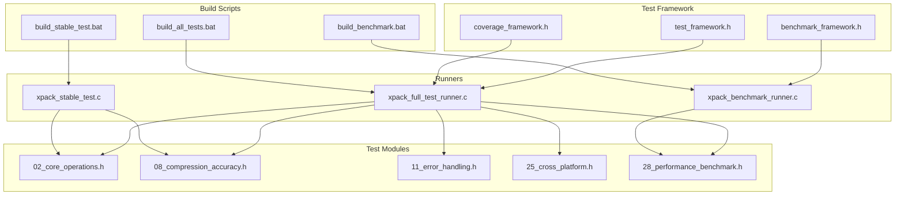
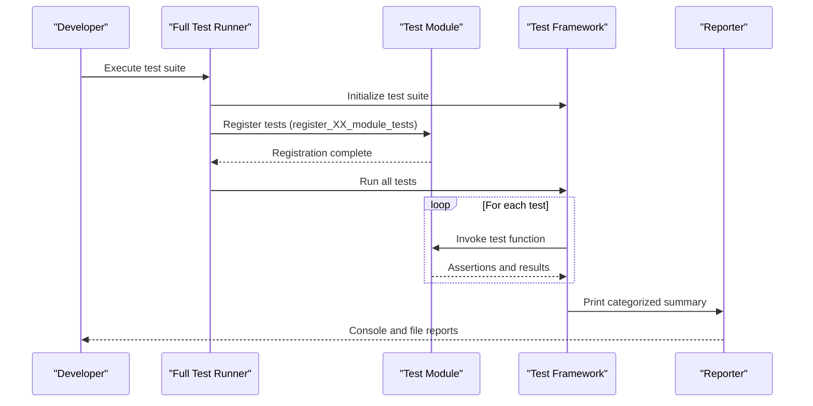
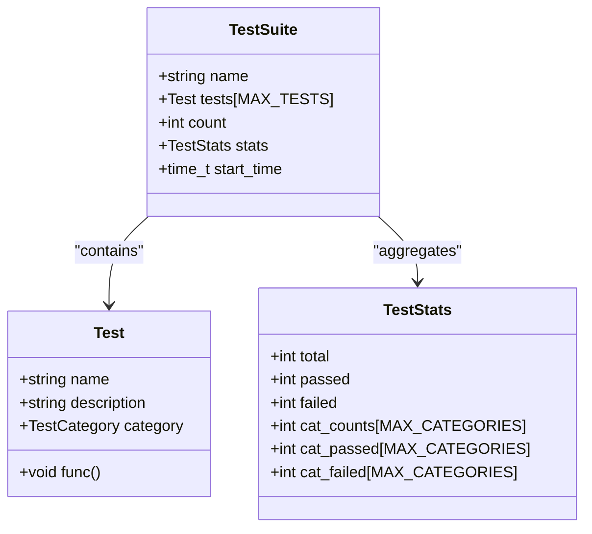
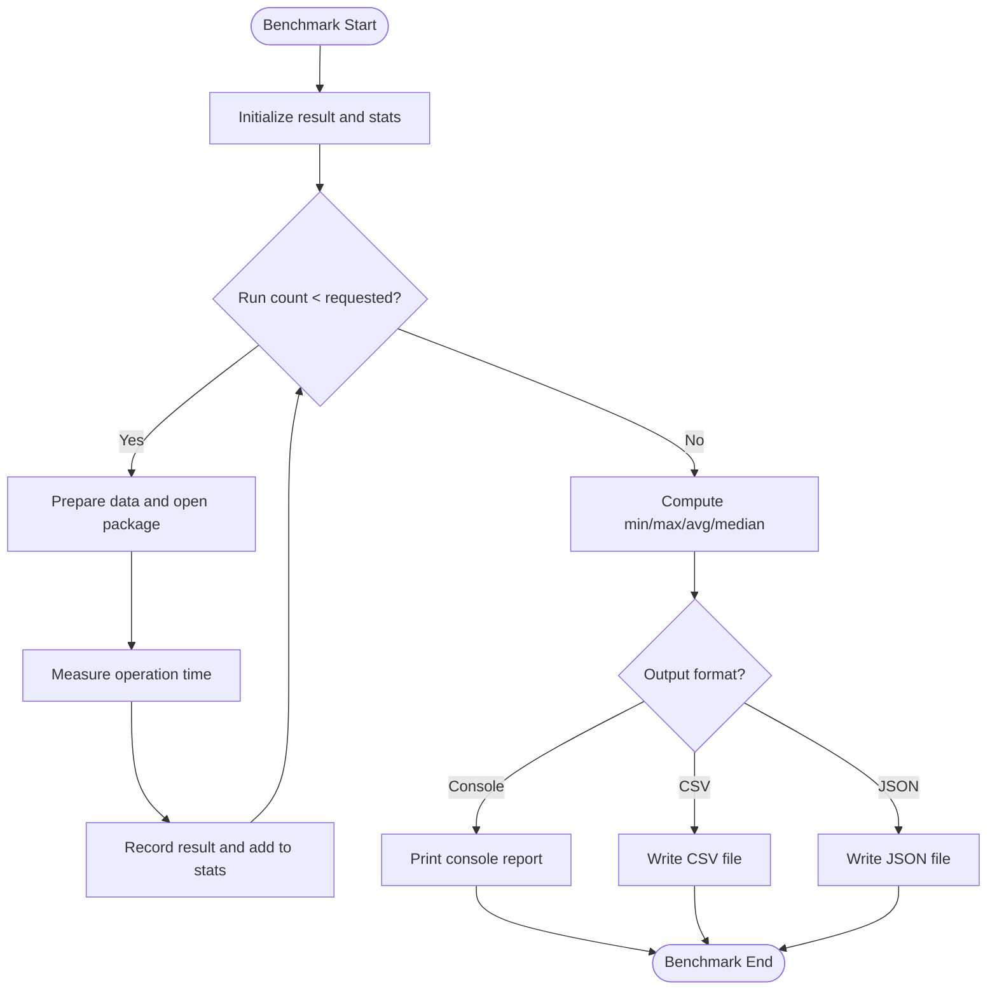
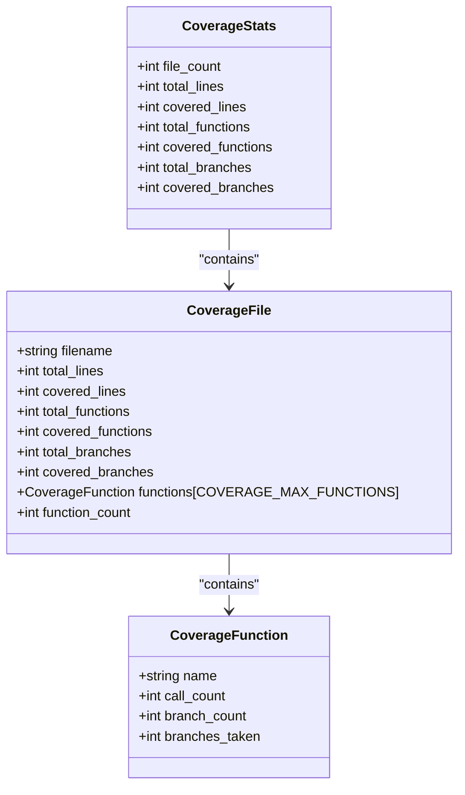
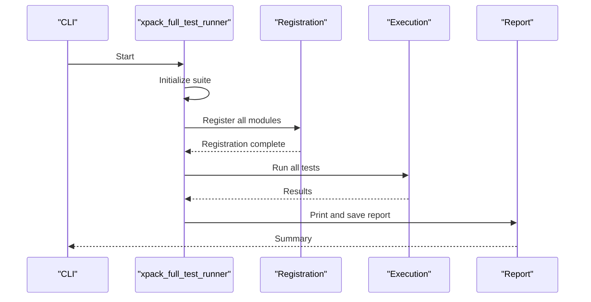
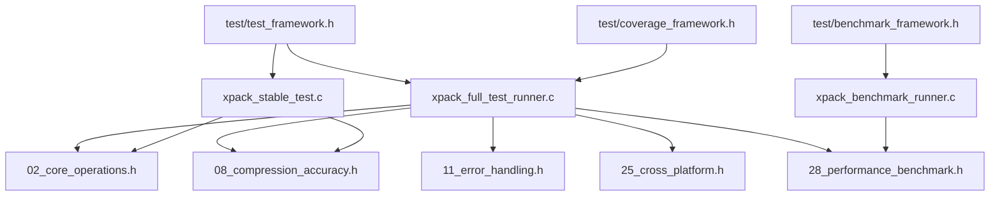

# Testing Framework

<cite>
**Referenced Files in This Document**
- [test/README.md](file://test/README.md)
- [test/test_framework.h](file://test/test_framework.h)
- [test/benchmark_framework.h](file://test/benchmark_framework.h)
- [test/coverage_framework.h](file://test/coverage_framework.h)
- [test/xpack_full_test_runner.c](file://test/xpack_full_test_runner.c)
- [test/xpack_stable_test.c](file://test/xpack_stable_test.c)
- [test/xpack_benchmark_runner.c](file://test/xpack_benchmark_runner.c)
- [test/build_all_tests.bat](file://test/build_all_tests.bat)
- [test/build_stable_test.bat](file://test/build_stable_test.bat)
- [test/build_benchmark.bat](file://test/build_benchmark.bat)
- [test/02_core_operations.h](file://test/02_core_operations.h)
- [test/08_compression_accuracy.h](file://test/08_compression_accuracy.h)
- [test/28_performance_benchmark.h](file://test/28_performance_benchmark.h)
- [test/11_error_handling.h](file://test/11_error_handling.h)
- [test/25_cross_platform.h](file://test/25_cross_platform.h)
- [test/TEST_FIX_PLAN.md](file://test/TEST_FIX_PLAN.md)
- [test/TEST_FIX_SUMMARY.md](file://test/TEST_FIX_SUMMARY.md)
- [docs/test_cases_manifest.md](file://docs/test_cases_manifest.md)
</cite>

## Table of Contents
1. [Introduction](#introduction)
2. [Project Structure](#project-structure)
3. [Core Components](#core-components)
4. [Architecture Overview](#architecture-overview)
5. [Detailed Component Analysis](#detailed-component-analysis)
6. [Dependency Analysis](#dependency-analysis)
7. [Performance Considerations](#performance-considerations)
8. [Troubleshooting Guide](#troubleshooting-guide)
9. [Conclusion](#conclusion)
10. [Appendices](#appendices)

## Introduction
This document describes the comprehensive testing infrastructure for xPack, focusing on the extensive test suite that covers 33 test modules and hundreds of individual tests. The framework provides unified macros for test definition and assertion, supports categorized reporting, and includes specialized runners for full suites, stability checks, and performance benchmarks. It also documents the current state of test coverage, ongoing fixes, and guidance for contributors to write, run, and maintain tests effectively.

## Project Structure
The testing system is organized around a unified header-based framework and modular test categories. Each test category is implemented as a separate header file that defines tests and registers them via a central registration mechanism. Dedicated runners compile and execute subsets of tests, and build scripts orchestrate compilation against the core library and third-party compression libraries.

**Diagram sources**
- [test/test_framework.h](file://test/test_framework.h#L1-L114)
- [test/benchmark_framework.h](file://test/benchmark_framework.h#L1-L216)
- [test/coverage_framework.h](file://test/coverage_framework.h#L1-L302)
- [test/xpack_full_test_runner.c](file://test/xpack_full_test_runner.c#L1-L355)
- [test/xpack_stable_test.c](file://test/xpack_stable_test.c#L1-L650)
- [test/xpack_benchmark_runner.c](file://test/xpack_benchmark_runner.c#L1-L433)
- [test/build_all_tests.bat](file://test/build_all_tests.bat#L1-L55)
- [test/build_stable_test.bat](file://test/build_stable_test.bat#L1-L56)
- [test/build_benchmark.bat](file://test/build_benchmark.bat#L1-L66)

**Section sources**
- [test/README.md](file://test/README.md#L1-L555)
- [test/test_framework.h](file://test/test_framework.h#L1-L114)
- [test/xpack_full_test_runner.c](file://test/xpack_full_test_runner.c#L188-L355)
- [test/xpack_stable_test.c](file://test/xpack_stable_test.c#L588-L650)
- [test/xpack_benchmark_runner.c](file://test/xpack_benchmark_runner.c#L1-L433)
- [test/build_all_tests.bat](file://test/build_all_tests.bat#L1-L55)
- [test/build_stable_test.bat](file://test/build_stable_test.bat#L1-L56)
- [test/build_benchmark.bat](file://test/build_benchmark.bat#L1-L66)

## Core Components
- Unified test framework header defines test categories, test registration macros, assertion macros, and shared test suite structures and APIs.
- Benchmark framework provides timing utilities, result aggregation, and output formatting for performance tests.
- Coverage framework tracks function calls, branches, and line coverage across files for quality analysis.
- Runners:
  - Full test runner compiles and executes all 33 modules, aggregates results, and prints categorized reports.
  - Stable test runner focuses on a curated subset of tests for daily validation.
  - Benchmark runner executes performance scenarios and generates console, CSV, or JSON reports.

Key capabilities:
- Test categorization and classification for targeted reporting.
- Assertion macros with standardized failure reporting and category tracking.
- Benchmark statistics computation (min/max/avg/median) and configurable output formats.
- Coverage metrics collection and export to CSV/JSON.

**Section sources**
- [test/test_framework.h](file://test/test_framework.h#L1-L114)
- [test/benchmark_framework.h](file://test/benchmark_framework.h#L1-L216)
- [test/coverage_framework.h](file://test/coverage_framework.h#L1-L302)
- [test/xpack_full_test_runner.c](file://test/xpack_full_test_runner.c#L1-L187)
- [test/xpack_stable_test.c](file://test/xpack_stable_test.c#L1-L191)
- [test/xpack_benchmark_runner.c](file://test/xpack_benchmark_runner.c#L1-L118)

## Architecture Overview
The testing architecture centers on a unified header that defines the test model and assertion mechanisms. Test modules implement individual tests and register them through a common interface. Runners initialize the test suite, register all tests from modules, execute them, and produce categorized reports. The benchmark runner encapsulates performance measurement logic and integrates with the benchmark framework.

**Diagram sources**
- [test/xpack_full_test_runner.c](file://test/xpack_full_test_runner.c#L230-L355)
- [test/test_framework.h](file://test/test_framework.h#L106-L114)
- [test/02_core_operations.h](file://test/02_core_operations.h#L365-L378)

**Section sources**
- [test/xpack_full_test_runner.c](file://test/xpack_full_test_runner.c#L188-L355)
- [test/test_framework.h](file://test/test_framework.h#L19-L114)

## Detailed Component Analysis

### Test Framework and Categories
The unified framework defines:
- TestCategory enumeration covering all 26 categories (Core, Index, Path, Compression, Solid, Error, Utils, Batch, Traverse, Stats, Verify, Rebuild, Properties, FileType, Cycle, Multiple, Edge, Concurrent, Recovery, Platform, Memory, Integration, Performance, Ratio, Regression, Volume).
- Test structure with name, description, category, and function pointer.
- TestSuite structure with counts, pass/fail tallies, and category-wise statistics.
- Macros for test definition, registration, and assertions with standardized failure reporting.

**Diagram sources**
- [test/test_framework.h](file://test/test_framework.h#L49-L71)

**Section sources**
- [test/test_framework.h](file://test/test_framework.h#L19-L114)

### Benchmark Framework
The benchmark framework provides:
- Timing utilities using clock ticks converted to milliseconds.
- BenchmarkResult and BenchmarkStats structures for collecting run metrics.
- Aggregation functions to compute totals, min/max, average, and median.
- Formatters for console, CSV, and JSON outputs.

**Diagram sources**
- [test/benchmark_framework.h](file://test/benchmark_framework.h#L41-L123)
- [test/benchmark_framework.h](file://test/benchmark_framework.h#L125-L213)

**Section sources**
- [test/benchmark_framework.h](file://test/benchmark_framework.h#L1-L216)
- [test/xpack_benchmark_runner.c](file://test/xpack_benchmark_runner.c#L19-L80)

### Coverage Framework
The coverage framework tracks:
- Function-level call counts and branch coverage per file.
- Aggregate coverage across files with percentages.
- Exporters for CSV and JSON formats.

**Diagram sources**
- [test/coverage_framework.h](file://test/coverage_framework.h#L16-L44)

**Section sources**
- [test/coverage_framework.h](file://test/coverage_framework.h#L1-L302)

### Full Test Runner
The full test runner:
- Initializes the test suite and registers tests from all 33 modules.
- Executes tests sequentially, updating pass/fail counters and category statistics.
- Prints a summary report and saves it to a file.

**Diagram sources**
- [test/xpack_full_test_runner.c](file://test/xpack_full_test_runner.c#L230-L355)

**Section sources**
- [test/xpack_full_test_runner.c](file://test/xpack_full_test_runner.c#L1-L355)

### Stable Test Runner
The stable test runner focuses on a curated subset of tests for daily validation, including core operations, compression algorithms, solid compression, batch operations, statistics, package properties, memory management, and volume functionality. It cleans up test artifacts, runs tests with structured reporting, and saves a summary report.

**Section sources**
- [test/xpack_stable_test.c](file://test/xpack_stable_test.c#L1-L650)

### Benchmark Runner
The benchmark runner executes predefined performance scenarios:
- LZ4, ZSTD, and LZMA2 compression benchmarks with fixed data sizes.
- Decompression benchmark using pre-compressed data.
- File operations benchmark measuring append/remove/update performance.
- Configurable run count and output format (console, CSV, JSON).

**Section sources**
- [test/xpack_benchmark_runner.c](file://test/xpack_benchmark_runner.c#L1-L433)

### Test Modules and Categorization
The test suite is divided into 33 modules, each targeting specific functionality areas. Categories include core operations, compression accuracy, error handling, performance benchmarking, cross-platform compatibility, and volume operations. The manifest provides detailed counts and coverage statistics.

Representative modules:
- Core operations: Add, extract, update, remove, info functions, type setting, readonly protection, multiple updates, append-after-remove, and all compression levels.
- Compression accuracy: Byte-for-byte verification, hash consistency, independent multiple files, compress-decompress cycles, file operations, update preservation, remove preservation, rebuild preservation, mixed compression levels.
- Performance benchmark: Append small/large files, extract all, verify all, traverse all, find operations, rebuild, save/load cycles, update/remove operations, statistics, compression levels.
- Error handling: Null pointer, invalid path, readonly write attempts, out-of-range access, invalid compression levels, empty data handling, remove/update non-existent items, corrupted package detection, invalid signatures, unsupported versions, file not found, invalid positions.
- Cross-platform: Windows/Linux path case sensitivity, separator handling, absolute/relative paths, nested directories, Unicode paths.

**Section sources**
- [test/02_core_operations.h](file://test/02_core_operations.h#L1-L378)
- [test/08_compression_accuracy.h](file://test/08_compression_accuracy.h#L1-L421)
- [test/28_performance_benchmark.h](file://test/28_performance_benchmark.h#L1-L333)
- [test/11_error_handling.h](file://test/11_error_handling.h#L1-L200)
- [test/25_cross_platform.h](file://test/25_cross_platform.h#L1-L200)
- [docs/test_cases_manifest.md](file://docs/test_cases_manifest.md#L1-L498)

## Dependency Analysis
The testing system exhibits clear separation of concerns:
- Framework headers define the core abstractions and macros used by all test modules.
- Runners depend on the framework and include module registration functions.
- Benchmark and coverage frameworks are integrated into the full test runner and benchmark runner respectively.
- Build scripts compile the runners against the core library and third-party compression libraries.

**Diagram sources**
- [test/test_framework.h](file://test/test_framework.h#L1-L114)
- [test/benchmark_framework.h](file://test/benchmark_framework.h#L1-L216)
- [test/coverage_framework.h](file://test/coverage_framework.h#L1-L302)
- [test/xpack_full_test_runner.c](file://test/xpack_full_test_runner.c#L188-L355)
- [test/xpack_stable_test.c](file://test/xpack_stable_test.c#L588-L650)
- [test/xpack_benchmark_runner.c](file://test/xpack_benchmark_runner.c#L1-L118)

**Section sources**
- [test/xpack_full_test_runner.c](file://test/xpack_full_test_runner.c#L188-L355)
- [test/xpack_stable_test.c](file://test/xpack_stable_test.c#L588-L650)
- [test/xpack_benchmark_runner.c](file://test/xpack_benchmark_runner.c#L1-L118)

## Performance Considerations
- Benchmark runner uses millisecond-precision timing and computes robust statistics (min, max, average, median) to minimize noise.
- Tests are designed to isolate operations (e.g., pure append vs. mixed operations) to measure specific performance characteristics.
- Output formats support machine-readable CSV/JSON for automated analysis and trend tracking.

[No sources needed since this section provides general guidance]

## Troubleshooting Guide
Common issues and resolutions:
- Compilation errors due to missing or mismatched API signatures: Review API definitions in the core header and adjust test calls accordingly.
- Partial test availability: Some modules are currently empty shells awaiting implementation; refer to the fix plan and summary for progress and next steps.
- Runtime failures in advanced features: Certain APIs may not be fully implemented; stabilize by focusing on working modules (stable test runner) until core APIs are finalized.
- Debugging test failures: Use debug prints, check return values, and verify expected vs. actual behavior. The stable runner demonstrates proper patterns for opening, saving, and verifying packages.

Contributor guidance:
- Writing new tests: Use the TEST macro, include the framework header, and register tests via TEST_REGISTER with appropriate category and description.
- Interpreting results: Review categorized summaries and per-test output; use the stable runner for reliable daily checks.
- Maintaining quality: Keep assertions explicit, clean up temporary files, and validate both normal and edge cases.

**Section sources**
- [test/TEST_FIX_PLAN.md](file://test/TEST_FIX_PLAN.md#L1-L221)
- [test/TEST_FIX_SUMMARY.md](file://test/TEST_FIX_SUMMARY.md#L1-L235)
- [test/xpack_stable_test.c](file://test/xpack_stable_test.c#L103-L128)

## Conclusion
The xPack testing infrastructure provides a robust, modular, and extensible foundation for validating library functionality across multiple domains. With unified macros, categorized reporting, and dedicated runners for full suites, stability checks, and performance benchmarks, contributors can efficiently develop and maintain high-quality tests. Ongoing work focuses on completing remaining modules, stabilizing API usage, and integrating automated workflows for continuous validation.

[No sources needed since this section summarizes without analyzing specific files]

## Appendices

### Build and Execution Instructions
- Full test suite: Compile and run the complete test runner.
- Stability tests: Compile and run the stable test program for daily validation.
- Benchmark tests: Compile and run the benchmark program with configurable options for output formats.

**Section sources**
- [test/build_all_tests.bat](file://test/build_all_tests.bat#L1-L55)
- [test/build_stable_test.bat](file://test/build_stable_test.bat#L1-L56)
- [test/build_benchmark.bat](file://test/build_benchmark.bat#L1-L66)
- [test/README.md](file://test/README.md#L87-L151)

### Test Environment Setup
- Ensure the development environment includes the compiler and required libraries.
- Build scripts link against the core library and third-party compression libraries.
- Use the provided batch scripts to compile and run tests on Windows.

**Section sources**
- [test/build_all_tests.bat](file://test/build_all_tests.bat#L14-L36)
- [test/build_stable_test.bat](file://test/build_stable_test.bat#L14-L36)
- [test/build_benchmark.bat](file://test/build_benchmark.bat#L14-L36)

### Continuous Integration Guidance
- Integrate the build scripts into CI pipelines to automatically compile and execute tests.
- Capture console output and export benchmark results in CSV/JSON for historical tracking.
- Monitor categorized pass/fail rates and alert on regressions.

[No sources needed since this section provides general guidance]