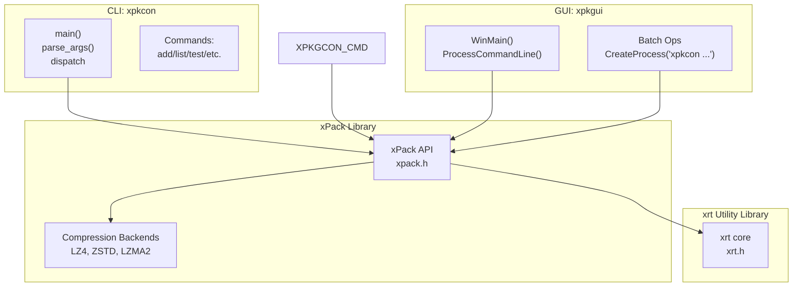
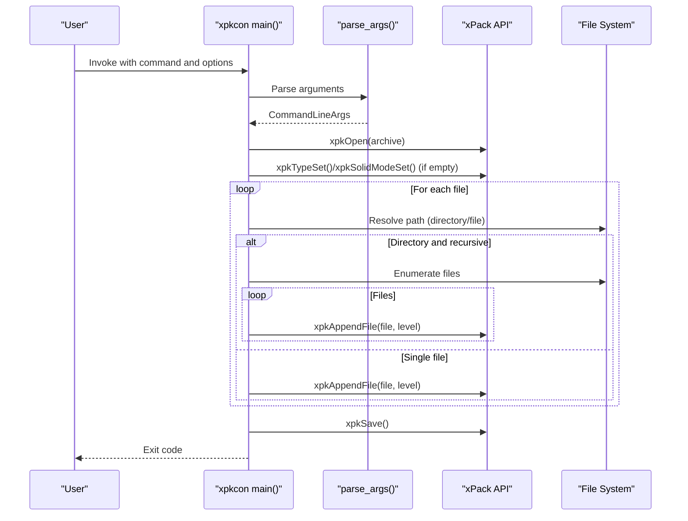
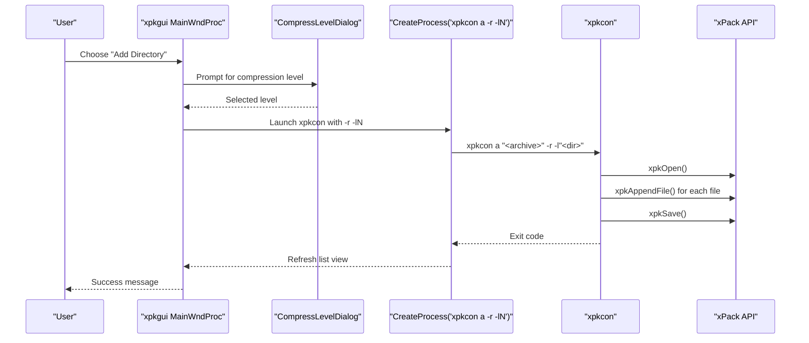
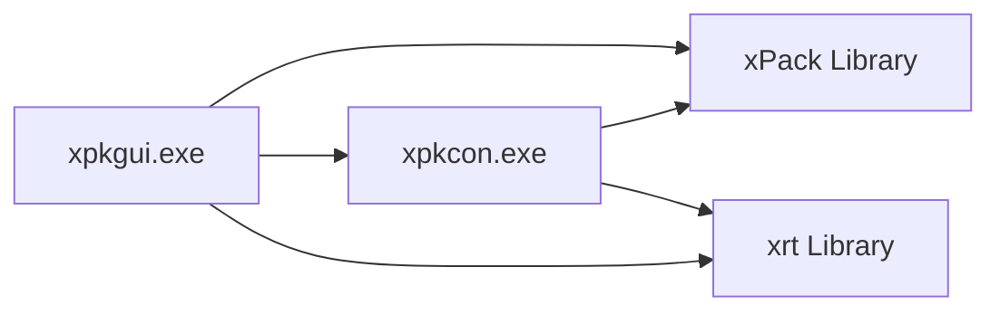

# Tools and Utilities

<cite>
**Referenced Files in This Document**
- [xpkcon README](file://tools/xpkcon/README.md)
- [xpkcon BUILD_INSTRUCTIONS](file://tools/xpkcon/BUILD_INSTRUCTIONS.md)
- [xpkcon source](file://tools/xpkcon/xpkcon.c)
- [xpkgui README](file://tools/xpkgui/README.md)
- [xpkgui BUILD_GUIDE](file://tools/xpkgui/BUILD_GUIDE.md)
- [xpkgui source](file://tools/xpkgui/xpkgui.c)
- [xpkgui install script](file://tools/xpkgui/install.bat)
- [xpkgui uninstall script](file://tools/xpkgui/uninstall.bat)
- [xpkgui build_all script](file://tools/xpkgui/build_all.bat)
- [xpkcon build helper](file://tools/xpkcon/build.bat)
</cite>

## Table of Contents
1. [Introduction](#introduction)
2. [Project Structure](#project-structure)
3. [Core Components](#core-components)
4. [Architecture Overview](#architecture-overview)
5. [Detailed Component Analysis](#detailed-component-analysis)
6. [Dependency Analysis](#dependency-analysis)
7. [Performance Considerations](#performance-considerations)
8. [Troubleshooting Guide](#troubleshooting-guide)
9. [Conclusion](#conclusion)
10. [Appendices](#appendices)

## Introduction
This document describes the xPack tool ecosystem with a focus on two primary utilities:
- xpkcon: A command-line tool for creating, modifying, extracting, and inspecting xPack archives.
- xpkgui: A graphical tool for visual package management, including shell integration and automation support.

It covers command reference, build and installation procedures, configuration options, practical examples, integration patterns, and troubleshooting guidance.

## Project Structure
The repository organizes the tool ecosystem under tools/xpkcon and tools/xpkgui, each with dedicated documentation, build scripts, and source code. The xpkgui project also includes a Windows Shell extension (xpkshext.dll) and installer/uninstaller scripts for system-wide integration.

**Diagram sources**
- [xpkcon source](file://tools/xpkcon/xpkcon.c#L1-L120)
- [xpkgui source](file://tools/xpkgui/xpkgui.c#L1-L120)

**Section sources**
- [xpkcon README](file://tools/xpkcon/README.md#L1-L374)
- [xpkgui README](file://tools/xpkgui/README.md#L1-L313)

## Core Components
- xpkcon: A console application implementing a compact command parser and dispatching to xPack library APIs for archive operations. It supports multiple compression levels, package types, solid/volume modes, and recursive directory processing.
- xpkgui: A Windows GUI application providing a file list view, dialogs for settings, and integration with xpkcon for batch operations. It supports drag-and-drop, shell integration, and persistent configuration.

Key capabilities:
- CLI: Create, add, extract, list, test, delete, update, and inspect archives.
- GUI: Full-featured archive management with compression level selection, package type selection, solid mode toggle, volume mode, pattern-based operations, and shell integration.

**Section sources**
- [xpkcon source](file://tools/xpkcon/xpkcon.c#L61-L128)
- [xpkgui source](file://tools/xpkgui/xpkgui.c#L166-L247)

## Architecture Overview
The tools share the xPack core library and the cross-platform xrt utility library. xpkgui integrates with xpkcon for operations that benefit from batch processing or recursion.

**Diagram sources**
- [xpkcon source](file://tools/xpkcon/xpkcon.c#L61-L128)
- [xpkgui source](file://tools/xpkgui/xpkgui.c#L166-L247)
- [xpkgui source](file://tools/xpkgui/xpkgui.c#L1017-L1039)

## Detailed Component Analysis

### xpkcon Command-Line Tool

#### Command Reference
Supported commands and options:
- Commands: a (add), x (extract with full paths), e (extract to current directory), l (list), t (test), d (delete), u (update), i (information)
- Options: -t<type>, -l<level>, -s<0|1>, -V<size>, --split-mode, -o<path>, -y, -r, -v, -h/--help, --version

Compression levels and algorithms:
- Levels 0-15 map to STORE, LZ4/LZ4-HC, ZSTD variants, and LZMA2, with detailed descriptions in the documentation.

Package types:
- Core, Index, Linux, Win32, each with distinct access semantics and compatibility.

Solid and volume modes:
- Solid mode merges all files into a single block for higher compression.
- Volume mode splits archives into multiple files with configurable sizes and split modes.

Examples:
- Create archives with various compression levels and modes.
- Extract selectively using wildcards and recursive directory addition.
- Inspect archives and verify integrity.

Output formats:
- List command prints a formatted table of files, sizes, packed sizes, ratios, and compression levels.
- Information command prints archive metadata including type, file count, sizes, ratio, solid mode, and optional volume details.

**Section sources**
- [xpkcon README](file://tools/xpkcon/README.md#L152-L374)
- [xpkcon source](file://tools/xpkcon/xpkcon.c#L130-L168)
- [xpkcon source](file://tools/xpkcon/xpkcon.c#L339-L442)
- [xpkcon source](file://tools/xpkcon/xpkcon.c#L540-L583)
- [xpkcon source](file://tools/xpkcon/xpkcon.c#L673-L726)

#### Build Instructions
Build methods:
- Static linking: produces standalone executables without runtime DLL dependencies.
- Dynamic linking: requires xpack.dll at runtime.
- Cross-platform builds: Windows batch scripts and Linux shell scripts are provided.

Manual compilation examples:
- TCC static/dynamic builds and GCC builds are documented with include paths and linker flags.

Testing:
- Basic tests via command-line help/version and simple operations.
- Automated test suites exist under tools/xpkcon/test.

**Section sources**
- [xpkcon BUILD_INSTRUCTIONS](file://tools/xpkcon/BUILD_INSTRUCTIONS.md#L1-L115)
- [xpkcon README](file://tools/xpkcon/README.md#L14-L131)

#### CLI Workflow Sequence (Add Operation)

**Diagram sources**
- [xpkcon source](file://tools/xpkcon/xpkcon.c#L61-L128)
- [xpkcon source](file://tools/xpkcon/xpkcon.c#L207-L337)
- [xpkcon source](file://tools/xpkcon/xpkcon.c#L339-L442)

### xpkgui Graphical Tool

#### Interface and Features
- Main window with a list view showing file name, size, packed size, ratio, algorithm, type, and hash.
- Menus for file operations (add, extract, delete, rename), rebuild, verify/test, and tools (solid mode, volume mode, disc code, pattern select).
- Dialogs for creating packages, selecting compression levels, setting volume size, and pattern-based operations.
- Drag-and-drop support for adding files to archives.
- Shell integration via xpkshext.dll for right-click actions and file associations.

Command-line modes:
- Supports opening archives, extracting to a folder, extracting to current directory, verifying, and viewing properties.

Configuration persistence:
- Settings stored in %APPDATA%\xPack\settings.ini (compression level, package type, solid mode, volume mode/size, UI preferences).
- Recent files history stored in %APPDATA%\xPack\history.ini.

Integration with xpkcon:
- Batch operations (e.g., adding directories recursively) are delegated to xpkcon via CreateProcess.

**Section sources**
- [xpkgui README](file://tools/xpkgui/README.md#L1-L313)
- [xpkgui source](file://tools/xpkgui/xpkgui.c#L166-L247)
- [xpkgui source](file://tools/xpkgui/xpkgui.c#L815-L890)
- [xpkgui source](file://tools/xpkgui/xpkgui.c#L1017-L1040)

#### GUI Workflow Sequence (Add Directory)

**Diagram sources**
- [xpkgui source](file://tools/xpkgui/xpkgui.c#L994-L1040)
- [xpkgui source](file://tools/xpkgui/xpkgui.c#L1017-L1039)
- [xpkcon source](file://tools/xpkcon/xpkcon.c#L339-L442)

#### Build and Installation
Build system:
- Comprehensive build_all.bat orchestrates building xpack.dll, xpkgui (multiple variants), xpkcon (multiple variants), and xpkshext.dll.
- Per-target scripts for TCC/GCC x64/x86 static/dynamic builds are provided.

Installation:
- install.bat copies binaries to Program Files, registers .xpk file association, registers shell extension, and refreshes icons.
- uninstall.bat removes registry entries, files, and configuration directory.

**Section sources**
- [xpkgui BUILD_GUIDE](file://tools/xpkgui/BUILD_GUIDE.md#L1-L272)
- [xpkgui build_all script](file://tools/xpkgui/build_all.bat#L1-L184)
- [xpkgui install script](file://tools/xpkgui/install.bat#L1-L122)
- [xpkgui uninstall script](file://tools/xpkgui/uninstall.bat#L1-L85)

## Dependency Analysis
- Both tools depend on the xPack library and xrt utility library.
- xpkgui optionally depends on xpack.dll (dynamic) or bundles statically linked libraries.
- xpkgui integrates with xpkcon for batch operations, enabling robust directory handling and pattern-based extraction.

**Diagram sources**
- [xpkcon source](file://tools/xpkcon/xpkcon.c#L1-L12)
- [xpkgui source](file://tools/xpkgui/xpkgui.c#L1-L16)

**Section sources**
- [xpkgui source](file://tools/xpkgui/xpkgui.c#L1017-L1040)
- [xpkcon source](file://tools/xpkcon/xpkcon.c#L61-L128)

## Performance Considerations
- Compression levels: Higher levels improve compression ratio but increase processing time. Use appropriate levels for your workload.
- Solid mode: Improves compression ratio for similar files but requires decompressing larger blocks.
- Volume mode: Splits archives for storage/transport constraints; slight overhead in processing and extraction.
- Batch operations: Prefer xpkgui’s integration with xpkcon for recursive directory operations to leverage optimized file enumeration.
- I/O: Ensure sufficient disk throughput and avoid simultaneous heavy I/O from multiple processes.

[No sources needed since this section provides general guidance]

## Troubleshooting Guide
Common issues and resolutions:
- Missing xpack.dll when using dynamic linking:
  - Place xpack.dll alongside xpkcon.exe or in PATH.
  - Alternatively, build statically linked executables.
- TCC not found during manual builds:
  - Install TCC and ensure tcc.exe is in PATH.
- Shell extension registration failures:
  - Run install.bat with administrator privileges.
- Linux compilation missing GTK3:
  - Install GTK3 development libraries (e.g., libgtk-3-dev on Debian/Ubuntu).
- xpkgui cannot open archives:
  - Verify file permissions and that the archive is not corrupted.
- Pattern-based operations fail:
  - Confirm wildcard patterns and ensure files match expected paths.

**Section sources**
- [xpkcon BUILD_INSTRUCTIONS](file://tools/xpkcon/BUILD_INSTRUCTIONS.md#L102-L115)
- [xpkgui BUILD_GUIDE](file://tools/xpkgui/BUILD_GUIDE.md#L192-L224)
- [xpkgui install script](file://tools/xpkgui/install.bat#L94-L107)

## Conclusion
The xPack tool ecosystem provides a cohesive set of utilities for managing compressed archives efficiently. xpkcon offers a powerful command-line interface suitable for scripting and automation, while xpkgui delivers a user-friendly GUI with shell integration and advanced features. Together, they support diverse workflows from interactive management to automated batch processing.

[No sources needed since this section summarizes without analyzing specific files]

## Appendices

### Practical Examples and Automation Patterns
- Create archives with specific compression levels and modes:
  - Example: Create a Win32 archive with ZSTD fast mode and enable solid mode.
- Extract selectively using wildcards:
  - Example: Extract files matching a pattern to a target directory.
- Integrate with CI/CD:
  - Use xpkcon in scripts to build, test, and verify archives as part of pipelines.
- Shell integration:
  - Use installed right-click menu actions to quickly add files or verify archives.

[No sources needed since this section provides general guidance]