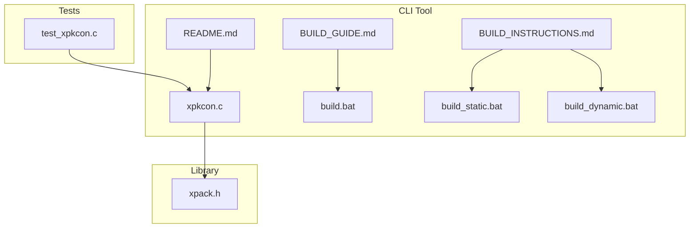
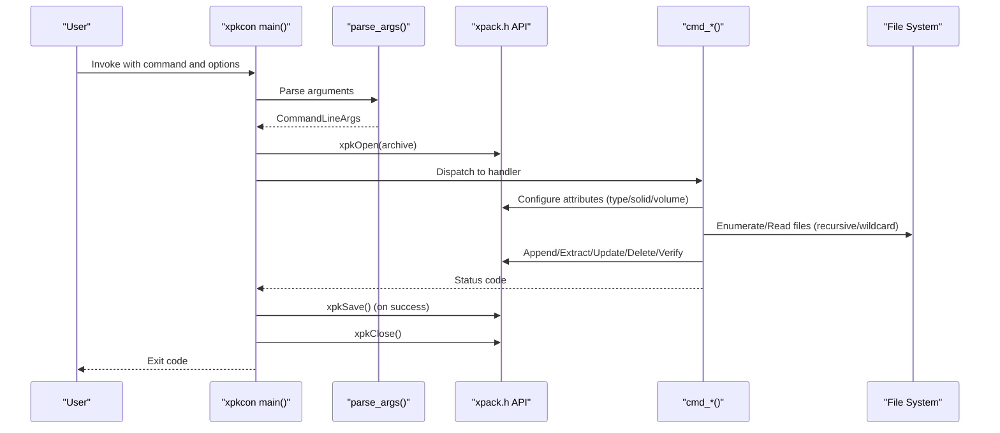
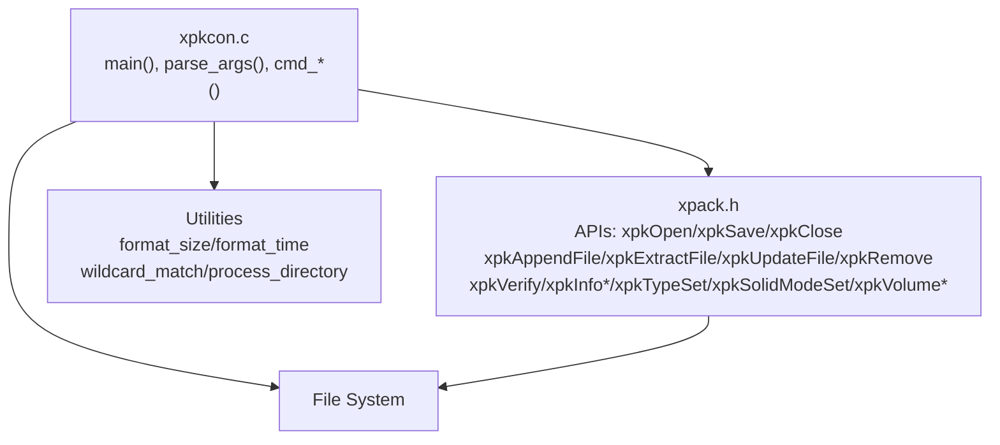
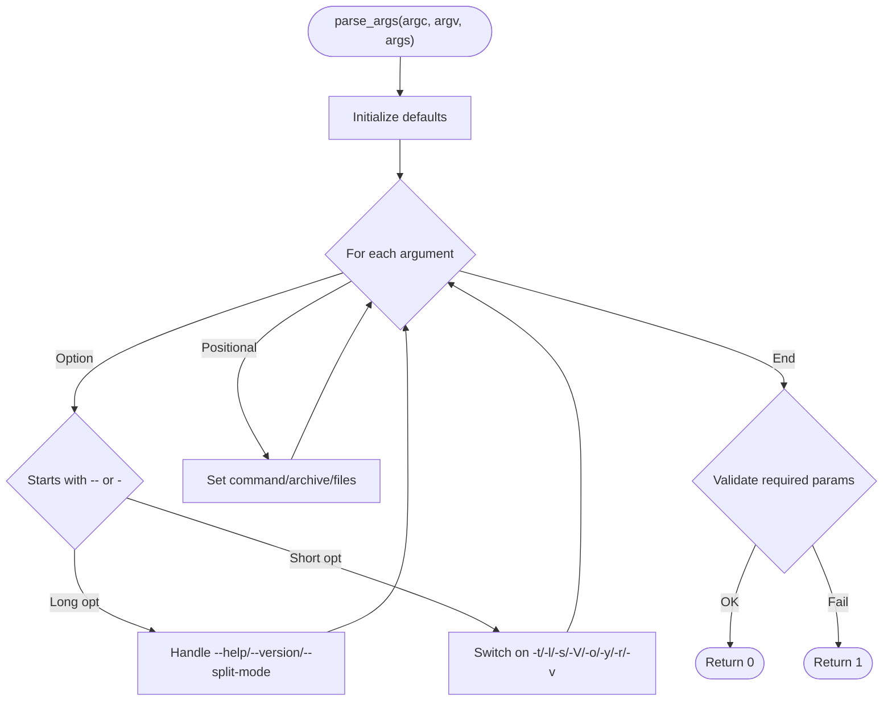
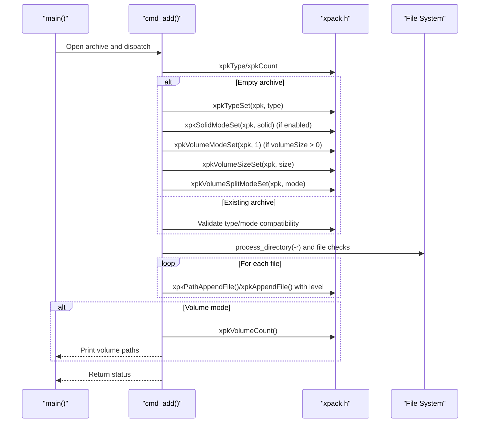
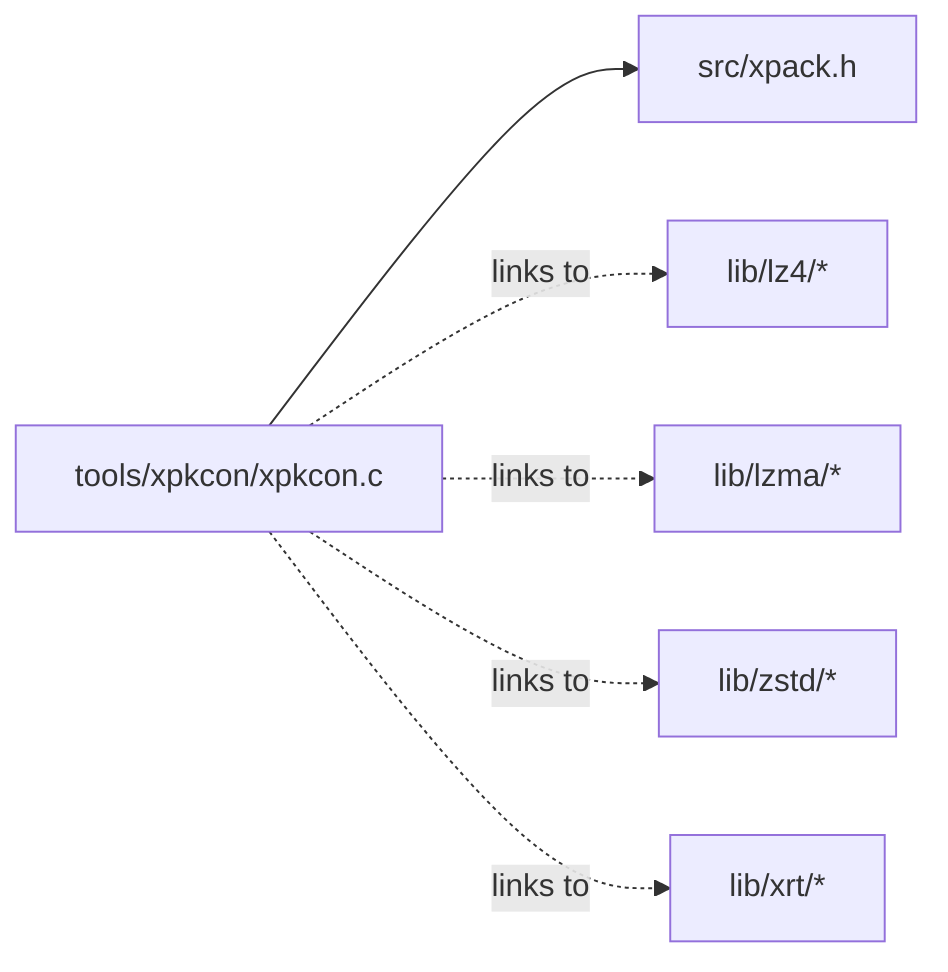

# xpkcon CLI Tool

<cite>
**Referenced Files in This Document**
- [xpkcon.c](file://tools/xpkcon/xpkcon.c)
- [README.md](file://tools/xpkcon/README.md)
- [BUILD_INSTRUCTIONS.md](file://tools/xpkcon/BUILD_INSTRUCTIONS.md)
- [BUILD_GUIDE.md](file://tools/xpkcon/BUILD_GUIDE.md)
- [build.bat](file://tools/xpkcon/build.bat)
- [build_static.bat](file://tools/xpkcon/build_static.bat)
- [build_dynamic.bat](file://tools/xpkcon/build_dynamic.bat)
- [xpack.h](file://src/xpack.h)
- [test_xpkcon.c](file://tools/xpkcon/test/test_xpkcon.c)
</cite>

## Table of Contents
1. [Introduction](#introduction)
2. [Project Structure](#project-structure)
3. [Core Components](#core-components)
4. [Architecture Overview](#architecture-overview)
5. [Detailed Component Analysis](#detailed-component-analysis)
6. [Dependency Analysis](#dependency-analysis)
7. [Performance Considerations](#performance-considerations)
8. [Troubleshooting Guide](#troubleshooting-guide)
9. [Conclusion](#conclusion)
10. [Appendices](#appendices)

## Introduction
xpkcon is a command-line interface tool for creating, extracting, testing, listing, updating, deleting, and inspecting xPack archives. It supports four package types (Core, Index, Linux, Win32), 16 compression levels mapped to LZ4, LZ4-HC, ZSTD, and LZMA2, and offers solid compression mode, recursive directory processing, and volume splitting. The tool integrates with the xPack library and provides both static and dynamic linking options across Windows and Linux platforms.

## Project Structure
The xpkcon tool resides under tools/xpkcon and consists of:
- CLI entry point and command handlers
- Build scripts for Windows and Linux
- Documentation and usage examples
- Integration tests validating CLI behavior

**Diagram sources**
- [xpkcon.c](file://tools/xpkcon/xpkcon.c#L61-L128)
- [README.md](file://tools/xpkcon/README.md#L1-L374)
- [BUILD_GUIDE.md](file://tools/xpkcon/BUILD_GUIDE.md#L1-L295)
- [BUILD_INSTRUCTIONS.md](file://tools/xpkcon/BUILD_INSTRUCTIONS.md#L1-L115)
- [build.bat](file://tools/xpkcon/build.bat#L1-L70)
- [build_static.bat](file://tools/xpkcon/build_static.bat#L1-L48)
- [build_dynamic.bat](file://tools/xpkcon/build_dynamic.bat#L1-L39)
- [xpack.h](file://src/xpack.h#L1-L447)
- [test_xpkcon.c](file://tools/xpkcon/test/test_xpkcon.c#L1-L96)

**Section sources**
- [xpkcon.c](file://tools/xpkcon/xpkcon.c#L61-L128)
- [README.md](file://tools/xpkcon/README.md#L1-L374)
- [BUILD_GUIDE.md](file://tools/xpkcon/BUILD_GUIDE.md#L1-L295)
- [BUILD_INSTRUCTIONS.md](file://tools/xpkcon/BUILD_INSTRUCTIONS.md#L1-L115)
- [build.bat](file://tools/xpkcon/build.bat#L1-L70)
- [build_static.bat](file://tools/xpkcon/build_static.bat#L1-L48)
- [build_dynamic.bat](file://tools/xpkcon/build_dynamic.bat#L1-L39)
- [xpack.h](file://src/xpack.h#L1-L447)
- [test_xpkcon.c](file://tools/xpkcon/test/test_xpkcon.c#L1-L96)

## Core Components
- Command dispatcher: routes arguments to specific command handlers
- Argument parser: processes options and positional parameters
- Command handlers: implement add, extract, list, test, delete, update, info
- Utility functions: size/time formatting, wildcard matching, directory traversal
- Library integration: opens, manipulates, and saves xPack archives via xpack.h APIs

Key behaviors:
- Defaults for compression level, package type, and modes
- Validation of options and required parameters
- Support for recursive directory processing and wildcard filters
- Volume mode support with configurable split mode and sizes

**Section sources**
- [xpkcon.c](file://tools/xpkcon/xpkcon.c#L130-L175)
- [xpkcon.c](file://tools/xpkcon/xpkcon.c#L207-L337)
- [xpkcon.c](file://tools/xpkcon/xpkcon.c#L339-L457)
- [xpkcon.c](file://tools/xpkcon/xpkcon.c#L459-L592)
- [xpkcon.c](file://tools/xpkcon/xpkcon.c#L594-L651)
- [xpkcon.c](file://tools/xpkcon/xpkcon.c#L653-L680)
- [xpkcon.c](file://tools/xpkcon/xpkcon.c#L682-L711)
- [xpkcon.c](file://tools/xpkcon/xpkcon.c#L713-L739)
- [xpkcon.c](file://tools/xpkcon/xpkcon.c#L741-L794)
- [xpkcon.c](file://tools/xpkcon/xpkcon.c#L808-L826)
- [xpkcon.c](file://tools/xpkcon/xpkcon.c#L828-L858)
- [xpkcon.c](file://tools/xpkcon/xpkcon.c#L860-L895)

## Architecture Overview
The CLI orchestrates operations against the xPack library. Commands operate on an opened archive handle, optionally configure package attributes (type, solid mode, volume mode), and perform file operations.

**Diagram sources**
- [xpkcon.c](file://tools/xpkcon/xpkcon.c#L61-L128)
- [xpkcon.c](file://tools/xpkcon/xpkcon.c#L207-L337)
- [xpkcon.c](file://tools/xpkcon/xpkcon.c#L339-L457)
- [xpkcon.c](file://tools/xpkcon/xpkcon.c#L459-L592)
- [xpkcon.c](file://tools/xpkcon/xpkcon.c#L594-L651)
- [xpkcon.c](file://tools/xpkcon/xpkcon.c#L653-L680)
- [xpkcon.c](file://tools/xpkcon/xpkcon.c#L682-L711)
- [xpkcon.c](file://tools/xpkcon/xpkcon.c#L713-L739)
- [xpkcon.c](file://tools/xpkcon/xpkcon.c#L741-L794)
- [xpack.h](file://src/xpack.h#L329-L441)

## Detailed Component Analysis

### Command Reference

#### add (a)
- Purpose: Add files to an archive; sets package type and modes on empty archives
- Syntax: xpkcon a <archive> [-t<type>] [-l<level>] [-s<0|1>] [-V<size>] [--split-mode] [-r] [-v] [files...]
- Options:
  - -t<type>: core, index, linux, win32
  - -l<level>: 0-15
  - -s<0|1>: solid mode
  - -V<size>: volume size with K/M/G suffix
  - --split-mode: 0=bytes, 1=files
  - -r: recursive directory processing
  - -v: verbose
- Behavior:
  - On empty archives, initializes type, solid, volume mode, and split mode
  - Supports recursive directory traversal and wildcard matching for selection
  - Reports number of volumes created when volume mode is enabled

**Section sources**
- [xpkcon.c](file://tools/xpkcon/xpkcon.c#L339-L457)
- [README.md](file://tools/xpkcon/README.md#L152-L183)
- [README.md](file://tools/xpkcon/README.md#L203-L218)

#### extract (x)
- Purpose: Extract files preserving full paths
- Syntax: xpkcon x <archive> [-o<path>] [-v] [files...]
- Behavior:
  - Filters by wildcard patterns when files are specified
  - Uses output directory if provided, otherwise current directory
  - Prints total extracted count

**Section sources**
- [xpkcon.c](file://tools/xpkcon/xpkcon.c#L459-L522)
- [README.md](file://tools/xpkcon/README.md#L220-L230)

#### extract-to-current (e)
- Purpose: Extract files to current directory without preserving paths
- Syntax: xpkcon e <archive> [-o<path>] [-v] [files...]
- Behavior:
  - Strips directory components from paths during extraction
  - Respects output directory and filtering

**Section sources**
- [xpkcon.c](file://tools/xpkcon/xpkcon.c#L524-L592)
- [README.md](file://tools/xpkcon/README.md#L220-L230)

#### list (l)
- Purpose: List archive contents with size, packed size, ratio, and compression level
- Syntax: xpkcon l <archive>
- Output format:
  - Header row with columns for filename/path, size, packed, ratio, level
  - Totals for files, size, packed, and overall ratio

**Section sources**
- [xpkcon.c](file://tools/xpkcon/xpkcon.c#L594-L651)
- [README.md](file://tools/xpkcon/README.md#L265-L291)

#### test (t)
- Purpose: Verify integrity of archive entries
- Syntax: xpkcon t <archive> [-v]
- Behavior:
  - Verifies each entry; prints per-entry status when verbose
  - Returns failure if any verification fails

**Section sources**
- [xpkcon.c](file://tools/xpkcon/xpkcon.c#L653-L680)
- [README.md](file://tools/xpkcon/README.md#L238-L242)

#### delete (d)
- Purpose: Remove files from archive
- Syntax: xpkcon d <archive> [-y] [files...]
- Behavior:
  - Requires confirmation unless -y is specified
  - Removes entries by path or position depending on package type

**Section sources**
- [xpkcon.c](file://tools/xpkcon/xpkcon.c#L682-L711)
- [README.md](file://tools/xpkcon/README.md#L244-L251)

#### update (u)
- Purpose: Update existing files in archive with new content
- Syntax: xpkcon u <archive> [-l<level>] [files...]
- Behavior:
  - Updates files by position/path using provided compression level

**Section sources**
- [xpkcon.c](file://tools/xpkcon/xpkcon.c#L713-L739)
- [README.md](file://tools/xpkcon/README.md#L253-L257)

#### info (i)
- Purpose: Display archive metadata and statistics
- Syntax: xpkcon i <archive>
- Output:
  - Path, type, file count, raw and packed sizes, overall ratio
  - Solid mode and volume mode indicators
  - Volume count and per-volume paths/sizes when applicable

**Section sources**
- [xpkcon.c](file://tools/xpkcon/xpkcon.c#L741-L794)
- [README.md](file://tools/xpkcon/README.md#L259-L291)

### Option System
- -t<type>: Sets package type (core, index, linux, win32)
- -l<level>: Sets compression level (0-15)
- -s<0|1>: Enables solid mode
- -V<size>: Enables volume mode with specified size (supports K/M/G suffixes)
- --split-mode: Controls split mode (0=bytes, 1=files)
- -o<path>: Sets output directory for extraction
- -y: Assumes yes for prompts (non-interactive)
- -r: Enables recursive directory processing
- -v: Enables verbose output

Volume size parsing supports suffixes K, M, G (case-insensitive) and defaults to raw bytes if no suffix is present.

**Section sources**
- [xpkcon.c](file://tools/xpkcon/xpkcon.c#L130-L175)
- [xpkcon.c](file://tools/xpkcon/xpkcon.c#L177-L205)
- [xpkcon.c](file://tools/xpkcon/xpkcon.c#L207-L337)
- [README.md](file://tools/xpkcon/README.md#L172-L183)
- [README.md](file://tools/xpkcon/README.md#L159-L171)

### Compression Level Mapping
Levels 0-15 map to specific algorithms and strategies:
- 0: No compression
- 1-2: LZ4 (fast levels)
- 3-4: LZ4-HC (higher compression)
- 5-13: ZSTD (progressively more aggressive)
- 14-15: LZMA2 (high compression)

The mapping is defined in the xPack header and applied during file append/update operations.

**Section sources**
- [xpack.h](file://src/xpack.h#L269-L286)
- [README.md](file://tools/xpkcon/README.md#L184-L202)

### Practical Workflows
- Creating packages:
  - Basic: xpkcon a archive.xpk file1.txt file2.txt
  - With compression level: xpkcon a archive.xpk -l7 file1.txt
  - Solid mode: xpkcon a archive.xpk -s1 file1.txt
  - Recursive: xpkcon a archive.xpk -r C:\data
- Extracting files:
  - Full paths: xpkcon x archive.xpk -o C:\out
  - Current directory: xpkcon e archive.xpk file1.txt
- Managing content:
  - Test integrity: xpkcon t archive.xpk
  - Delete files: xpkcon d archive.xpk -y oldfile.txt
  - Update files: xpkcon u archive.xpk -l8 updated.txt
- Batch operations:
  - Wildcards: xpkcon x archive.xpk "*.txt"
  - List and info for reporting: xpkcon l archive.xpk; xpkcon i archive.xpk

**Section sources**
- [README.md](file://tools/xpkcon/README.md#L203-L263)

## Architecture Overview

**Diagram sources**
- [xpkcon.c](file://tools/xpkcon/xpkcon.c#L61-L128)
- [xpack.h](file://src/xpack.h#L329-L441)
- [xpkcon.c](file://tools/xpkcon/xpkcon.c#L808-L826)
- [xpkcon.c](file://tools/xpkcon/xpkcon.c#L828-L858)
- [xpkcon.c](file://tools/xpkcon/xpkcon.c#L860-L895)

## Detailed Component Analysis

### Argument Parsing Flow

**Diagram sources**
- [xpkcon.c](file://tools/xpkcon/xpkcon.c#L207-L337)

**Section sources**
- [xpkcon.c](file://tools/xpkcon/xpkcon.c#L207-L337)

### Command Execution Sequence (Example: add)

**Diagram sources**
- [xpkcon.c](file://tools/xpkcon/xpkcon.c#L339-L457)
- [xpack.h](file://src/xpack.h#L339-L377)

**Section sources**
- [xpkcon.c](file://tools/xpkcon/xpkcon.c#L339-L457)

### Output Formatting
- list: Fixed-width columns for filename/path, size, packed, ratio, level; totals summary
- info: Human-readable fields for path, type, counts, sizes, ratios, solid/volume flags, and per-volume details

**Section sources**
- [xpkcon.c](file://tools/xpkcon/xpkcon.c#L594-L651)
- [xpkcon.c](file://tools/xpkcon/xpkcon.c#L741-L794)

### Error Codes and Meanings
- 0: Success
- 1: Parameter or operation failure
- -1: Underlying library error

Notes:
- Non-zero exit indicates failure; xpkSave warnings are printed but do not change the return code
- Deletion requires confirmation unless -y is specified

**Section sources**
- [README.md](file://tools/xpkcon/README.md#L327-L334)
- [xpkcon.c](file://tools/xpkcon/xpkcon.c#L120-L127)
- [xpkcon.c](file://tools/xpkcon/xpkcon.c#L689-L697)

### Integration with Automation Scripts
- Use exit codes for CI/CD gating
- Leverage -v for verbose logging in scripts
- Combine wildcards and filters for targeted operations
- Use info output for reporting and dashboards

**Section sources**
- [README.md](file://tools/xpkcon/README.md#L259-L291)
- [xpkcon.c](file://tools/xpkcon/xpkcon.c#L653-L680)

## Dependency Analysis

**Diagram sources**
- [xpkcon.c](file://tools/xpkcon/xpkcon.c#L1-L10)
- [xpack.h](file://src/xpack.h#L1-L447)

**Section sources**
- [xpkcon.c](file://tools/xpkcon/xpkcon.c#L1-L10)
- [xpack.h](file://src/xpack.h#L1-L447)

## Performance Considerations
- Choose compression level based on workload:
  - 0: Fastest, minimal CPU
  - 1-4: Good balance for speed and ratio
  - 5-13: Progressive trade-off toward higher ratio
  - 14-15: Highest ratio, slowest
- Solid mode improves ratio for similar files but increases decompression cost
- Recursive operations traverse entire directory trees; use -r judiciously
- Volume mode splits archives by size or file count; tune --split-mode and -V for storage constraints

[No sources needed since this section provides general guidance]

## Troubleshooting Guide
Common issues and resolutions:
- Missing xpack.dll (dynamic linking):
  - Ensure xpack.dll exists in release/x64 or is on PATH
  - Build the DLL first using the provided scripts
- TCC not found:
  - Install TCC and add it to PATH
- Compilation errors:
  - Verify source paths and architecture flags (-m64/-m32)
  - Confirm correct script variant for target platform/architecture
- Unexpected behavior:
  - Use -v for verbose output to diagnose operations
  - Validate compression levels and package types

**Section sources**
- [BUILD_INSTRUCTIONS.md](file://tools/xpkcon/BUILD_INSTRUCTIONS.md#L102-L115)
- [BUILD_GUIDE.md](file://tools/xpkcon/BUILD_GUIDE.md#L202-L233)

## Conclusion
xpkcon provides a robust CLI for managing xPack archives with comprehensive control over compression, packaging, and extraction. Its build system supports multiple compilers and link modes across Windows and Linux, enabling flexible deployment scenarios. The included tests and documentation facilitate reliable automation and integration.

[No sources needed since this section summarizes without analyzing specific files]

## Appendices

### Build System Overview
- Interactive menu: build.bat
- Static linking: build_static.bat (embeds libraries)
- Dynamic linking: build_dynamic.bat (requires xpack.dll)
- Cross-platform: BUILD_GUIDE.md and BUILD_INSTRUCTIONS.md

**Section sources**
- [build.bat](file://tools/xpkcon/build.bat#L1-L70)
- [build_static.bat](file://tools/xpkcon/build_static.bat#L1-L48)
- [build_dynamic.bat](file://tools/xpkcon/build_dynamic.bat#L1-L39)
- [BUILD_GUIDE.md](file://tools/xpkcon/BUILD_GUIDE.md#L1-L295)
- [BUILD_INSTRUCTIONS.md](file://tools/xpkcon/BUILD_INSTRUCTIONS.md#L1-L115)

### Platform-Specific Notes
- Windows:
  - Use TCC or GCC; choose static or dynamic linking
  - Volume mode supports byte-based or file-based splitting
- Linux:
  - Use GCC static or dynamic builds
  - Ensure executable permissions for shell scripts

**Section sources**
- [BUILD_GUIDE.md](file://tools/xpkcon/BUILD_GUIDE.md#L74-L113)
- [BUILD_GUIDE.md](file://tools/xpkcon/BUILD_GUIDE.md#L147-L181)

### Test Coverage Areas
- Basic operations: add single/multiple files
- Extraction: full-path and current-directory modes
- Listing and info: content and metadata display
- Integrity testing: per-file verification
- Management: delete and update
- Compression: all 16 levels
- Advanced: solid mode, package types, recursion, large files, volume mode

**Section sources**
- [README.md](file://tools/xpkcon/README.md#L133-L151)
- [test_xpkcon.c](file://tools/xpkcon/test/test_xpkcon.c#L1-L96)