# xpkgui GUI Tool

<cite>
**Referenced Files in This Document**
- [README.md](file://tools/xpkgui/README.md)
- [xpkgui_full_spec.md](file://tools/xpkgui/xpkgui_full_spec.md)
- [xpkgui.c](file://tools/xpkgui/xpkgui.c)
- [xpkgui.rc](file://tools/xpkgui/xpkgui.rc)
- [resource.h](file://tools/xpkgui/resource.h)
- [xpkshext.c](file://tools/xpkgui/xpkshext.c)
- [xpkshext.h](file://tools/xpkgui/xpkshext.h)
- [xpkgui.reg](file://tools/xpkgui/xpkgui.reg)
- [xpkshext.reg](file://tools/xpkgui/xpkshext.reg)
- [install.bat](file://tools/xpkgui/install.bat)
- [uninstall.bat](file://tools/xpkgui/uninstall.bat)
- [build_all.bat](file://tools/xpkgui/build_all.bat)
- [build_linux.sh](file://tools/xpkgui/build_linux.sh)
- [build_linux_dynamic.sh](file://tools/xpkgui/build_linux_dynamic.sh)
</cite>

## Table of Contents
1. [Introduction](#introduction)
2. [Project Structure](#project-structure)
3. [Core Components](#core-components)
4. [Architecture Overview](#architecture-overview)
5. [Detailed Component Analysis](#detailed-component-analysis)
6. [Dependency Analysis](#dependency-analysis)
7. [Performance Considerations](#performance-considerations)
8. [Troubleshooting Guide](#troubleshooting-guide)
9. [Conclusion](#conclusion)
10. [Appendices](#appendices)

## Introduction
xpkgui is the graphical user interface tool for the xPack compression library. It provides an intuitive Windows desktop environment for creating, opening, editing, and managing xPack archives, integrating deeply with Windows Explorer via a COM-based shell extension. The tool supports modern compression algorithms, advanced packaging modes (solid/volume), pattern-based operations, and robust error handling. It also offers command-line integration for automation and scripting.

## Project Structure
The xpkgui project is organized around a Windows GUI application, a shell extension DLL, installer/uninstaller scripts, and cross-platform build scripts. The GUI is implemented in a single C source file with resource definitions for menus and dialogs. The shell extension integrates with Windows Explorer to provide right-click actions.

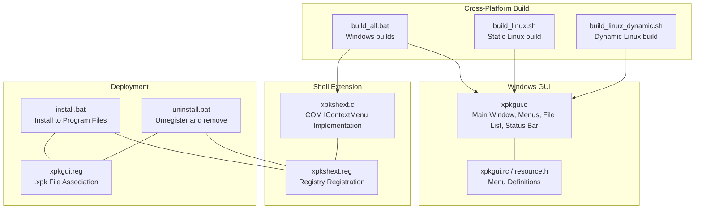

**Diagram sources**
- [xpkgui.c](file://tools/xpkgui/xpkgui.c#L188-L269)
- [xpkgui.rc](file://tools/xpkgui/xpkgui.rc#L5-L54)
- [xpkshext.c](file://tools/xpkgui/xpkshext.c#L1-L388)
- [xpkshext.reg](file://tools/xpkgui/xpkshext.reg#L1-L26)
- [xpkgui.reg](file://tools/xpkgui/xpkgui.reg#L1-L29)
- [install.bat](file://tools/xpkgui/install.bat#L1-L122)
- [uninstall.bat](file://tools/xpkgui/uninstall.bat#L1-L85)
- [build_all.bat](file://tools/xpkgui/build_all.bat#L1-L184)
- [build_linux.sh](file://tools/xpkgui/build_linux.sh#L1-L61)
- [build_linux_dynamic.sh](file://tools/xpkgui/build_linux_dynamic.sh#L1-L75)

**Section sources**
- [README.md](file://tools/xpkgui/README.md#L1-L313)
- [xpkgui.c](file://tools/xpkgui/xpkgui.c#L188-L269)
- [xpkgui.rc](file://tools/xpkgui/xpkgui.rc#L5-L54)
- [xpkshext.c](file://tools/xpkgui/xpkshext.c#L1-L388)
- [xpkshext.reg](file://tools/xpkgui/xpkshext.reg#L1-L26)
- [xpkgui.reg](file://tools/xpkgui/xpkgui.reg#L1-L29)
- [install.bat](file://tools/xpkgui/install.bat#L1-L122)
- [uninstall.bat](file://tools/xpkgui/uninstall.bat#L1-L85)
- [build_all.bat](file://tools/xpkgui/build_all.bat#L1-L184)
- [build_linux.sh](file://tools/xpkgui/build_linux.sh#L1-L61)
- [build_linux_dynamic.sh](file://tools/xpkgui/build_linux_dynamic.sh#L1-L75)

## Core Components
- Main Window and Controls
  - File list view with columns for name, original size, packed size, ratio, algorithm, type, and hash.
  - Status bar displaying file count, total size, compression ratio, solid mode, and volume info.
  - Menu system covering file operations, view options, tools, and help.
- Toolbar Operations
  - File menu: New, Open, Save, Add file(s), Add directory, Extract, Delete, Rename, Rebuild, Properties, Close, Exit.
  - View menu: Refresh, Grid lines, Status bar.
  - Tools menu: Verify, Test, Extract all, Pattern select, Solid mode toggle, Volume mode toggle, Volume size, Disc code.
  - Help menu: About.
- File Browser Integration
  - Open/Save dialogs for .xpk archives.
  - Folder selection for extraction targets.
  - Drag-and-drop support to add files to the current archive.
- Context Menu Functionality
  - Right-click on .xpk files: Open with xpkgui, Extract to..., Extract here, Verify, Properties.
  - Right-click on regular files/folders: Add to xPack..., Add to xPack (auto-name).
- Desktop Integration
  - File association registration for .xpk.
  - Shell extension registration for context menu handlers.
  - Icon handler and info tip handler integration (see Shell Extension section).
- Package Management Features
  - Compression level selection dialog with 0–15 levels mapped to STORE/LZ4/ZSTD/LZMA2.
  - Package type selection (Win32/Linux/Index/Core).
  - Solid compression mode toggle.
  - Volume mode with configurable size and automatic multi-part naming.
  - Pattern-based selection and batch operations.
  - Disc code management.
  - Compression testing and verification.
- Command-Line Integration
  - Modes: open, -extract, -extract_here, -add, -add_auto, -verify, -properties.
  - Used by shell extension and automated workflows.

**Section sources**
- [xpkgui.c](file://tools/xpkgui/xpkgui.c#L508-L757)
- [xpkgui.c](file://tools/xpkgui/xpkgui.c#L759-L847)
- [xpkgui.c](file://tools/xpkgui/xpkgui.c#L849-L877)
- [xpkgui.c](file://tools/xpkgui/xpkgui.c#L879-L954)
- [xpkgui.c](file://tools/xpkgui/xpkgui.c#L1011-L1111)
- [xpkgui.c](file://tools/xpkgui/xpkgui.c#L1113-L1180)
- [xpkgui.c](file://tools/xpkgui/xpkgui.c#L1182-L1200)
- [xpkgui.c](file://tools/xpkgui/xpkgui.c#L271-L313)
- [xpkgui.c](file://tools/xpkgui/xpkgui.c#L315-L447)
- [xpkgui.c](file://tools/xpkgui/xpkgui.c#L449-L506)
- [xpkgui.rc](file://tools/xpkgui/xpkgui.rc#L5-L54)
- [resource.h](file://tools/xpkgui/resource.h#L6-L46)
- [README.md](file://tools/xpkgui/README.md#L7-L125)

## Architecture Overview
The GUI tool integrates with the xPack library for archive operations and leverages a COM-based shell extension for Windows Explorer integration. The shell extension forwards Explorer actions to xpkgui or xpkcon for execution.

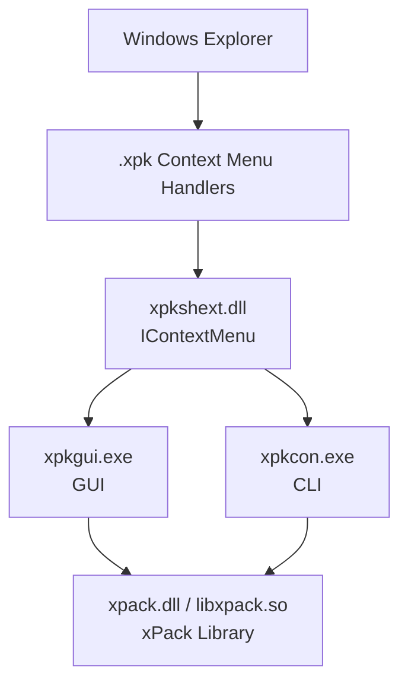

**Diagram sources**
- [xpkgui_full_spec.md](file://tools/xpkgui/xpkgui_full_spec.md#L24-L51)
- [xpkgui.c](file://tools/xpkgui/xpkgui.c#L188-L269)
- [xpkshext.c](file://tools/xpkgui/xpkshext.c#L178-L236)

**Section sources**
- [xpkgui_full_spec.md](file://tools/xpkgui/xpkgui_full_spec.md#L24-L51)
- [xpkgui.c](file://tools/xpkgui/xpkgui.c#L188-L269)
- [xpkshext.c](file://tools/xpkgui/xpkshext.c#L178-L236)

## Detailed Component Analysis

### Main Window Layout and Controls
- Window creation registers a class, creates the main window, initializes common controls, and sets up drag-and-drop.
- The client area hosts a report-style ListView with seven columns and a status bar at the bottom.
- Menu items are defined in resources and mapped to command IDs.

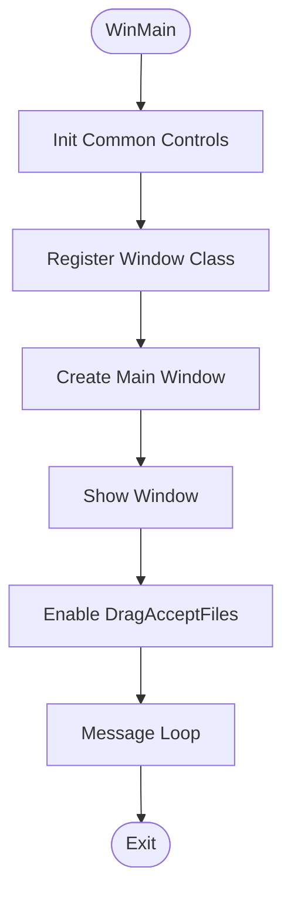

**Diagram sources**
- [xpkgui.c](file://tools/xpkgui/xpkgui.c#L188-L269)

**Section sources**
- [xpkgui.c](file://tools/xpkgui/xpkgui.c#L188-L269)
- [xpkgui.c](file://tools/xpkgui/xpkgui.c#L759-L847)
- [xpkgui.rc](file://tools/xpkgui/xpkgui.rc#L5-L54)
- [resource.h](file://tools/xpkgui/resource.h#L6-L46)

### Toolbar Operations and Menus
- File operations: New, Open, Save, Add file(s), Add directory, Extract, Delete, Rename, Rebuild, Properties, Close, Exit.
- View options: Refresh, Grid lines, Status bar.
- Tools: Verify, Test, Extract all, Pattern select, Solid mode, Volume mode, Volume size, Disc code.
- Help: About.

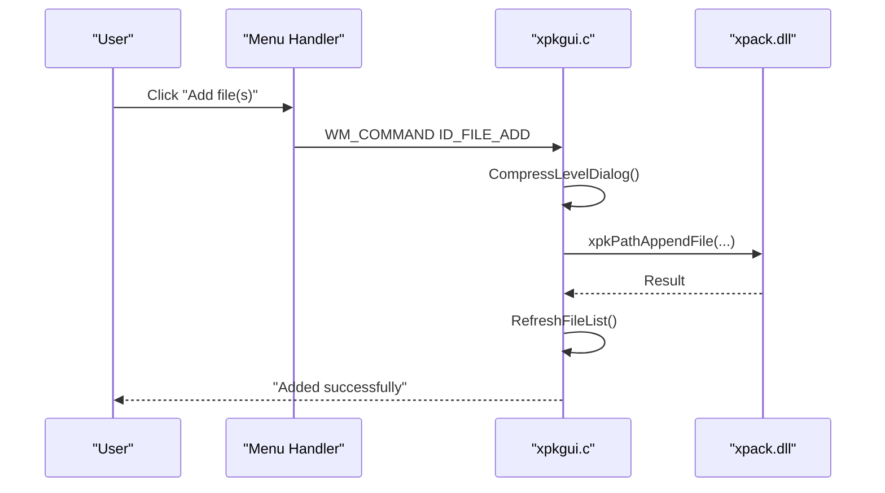

**Diagram sources**
- [xpkgui.c](file://tools/xpkgui/xpkgui.c#L1011-L1063)
- [xpkgui.c](file://tools/xpkgui/xpkgui.c#L1031-L1034)
- [xpkgui.rc](file://tools/xpkgui/xpkgui.rc#L15-L25)
- [resource.h](file://tools/xpkgui/resource.h#L11-L18)

**Section sources**
- [xpkgui.c](file://tools/xpkgui/xpkgui.c#L595-L701)
- [xpkgui.c](file://tools/xpkgui/xpkgui.c#L1011-L1063)
- [xpkgui.rc](file://tools/xpkgui/xpkgui.rc#L5-L54)
- [resource.h](file://tools/xpkgui/resource.h#L6-L46)

### File Browser Integration and Drag-and-Drop
- File dialogs for selecting archives, adding files, and choosing extraction directories.
- Drag-and-drop support adds files to the current archive after validating package type and converting names.

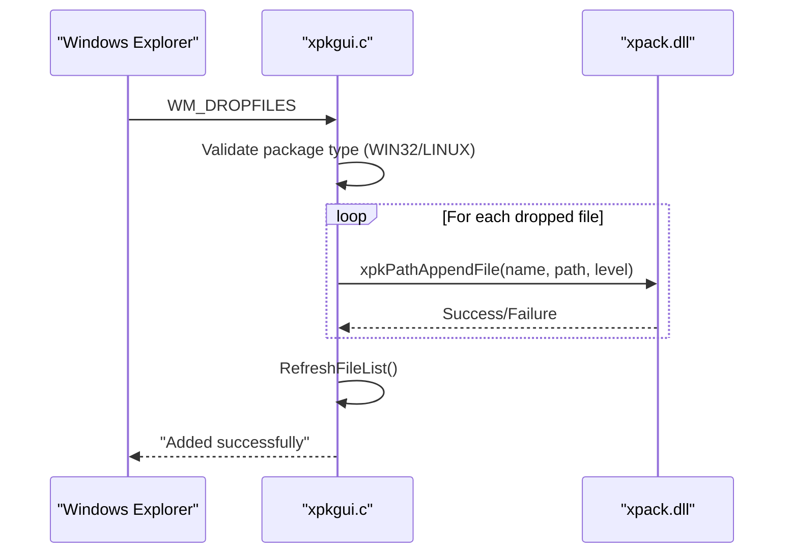

**Diagram sources**
- [xpkgui.c](file://tools/xpkgui/xpkgui.c#L552-L593)
- [xpkgui.c](file://tools/xpkgui/xpkgui.c#L1048-L1050)

**Section sources**
- [xpkgui.c](file://tools/xpkgui/xpkgui.c#L552-L593)
- [xpkgui.c](file://tools/xpkgui/xpkgui.c#L1011-L1063)

### Context Menu Functionality (Shell Extension)
- The shell extension implements IContextMenu and IShellExtInit to populate context menus and handle commands.
- Right-click on .xpk files: Open, Extract to..., Extract here, Verify, Properties.
- Right-click on files/folders: Add to xPack..., Add to xPack (auto-name).
- Commands spawn xpkgui with appropriate command-line arguments.

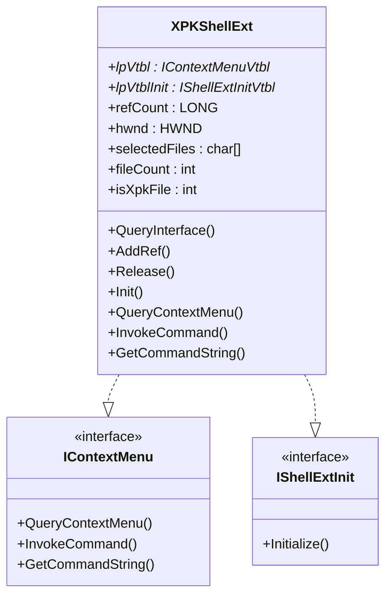

**Diagram sources**
- [xpkshext.c](file://tools/xpkgui/xpkshext.c#L17-L40)
- [xpkshext.c](file://tools/xpkgui/xpkshext.c#L41-L75)
- [xpkshext.c](file://tools/xpkgui/xpkshext.c#L77-L128)
- [xpkshext.c](file://tools/xpkgui/xpkshext.c#L130-L176)
- [xpkshext.c](file://tools/xpkgui/xpkshext.c#L178-L236)
- [xpkshext.c](file://tools/xpkgui/xpkshext.c#L238-L268)
- [xpkshext.c](file://tools/xpkgui/xpkshext.c#L286-L295)
- [xpkshext.c](file://tools/xpkgui/xpkshext.c#L297-L358)
- [xpkshext.c](file://tools/xpkgui/xpkshext.c#L360-L374)
- [xpkshext.c](file://tools/xpkgui/xpkshext.c#L376-L387)

**Section sources**
- [xpkshext.c](file://tools/xpkgui/xpkshext.c#L1-L388)
- [xpkshext.h](file://tools/xpkgui/xpkshext.h#L1-L7)

### Desktop Integration: File Associations and Shell Extension
- File association (.xpk) registers default icon and open command pointing to xpkgui.
- Shell extension registration installs CLSID and context menu handlers for .xpk, *, Directory, and Folder.
- Installation script copies binaries, registers associations, registers the shell extension, and refreshes icons.
- Uninstallation script reverses all registrations and deletes files.

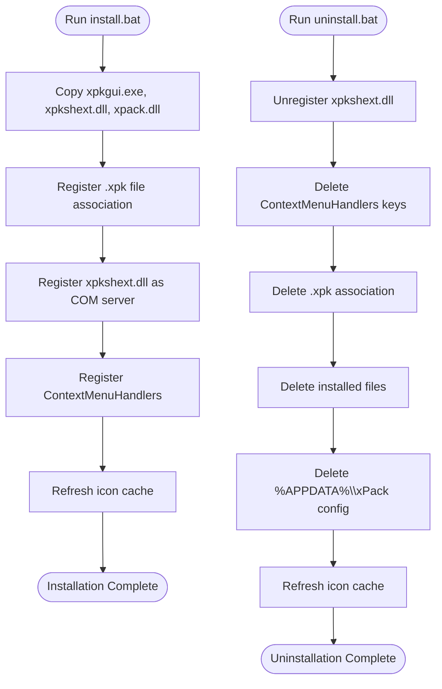

**Diagram sources**
- [xpkgui.reg](file://tools/xpkgui/xpkgui.reg#L1-L29)
- [xpkshext.reg](file://tools/xpkgui/xpkshext.reg#L1-L26)
- [install.bat](file://tools/xpkgui/install.bat#L79-L111)
- [install.bat](file://tools/xpkgui/install.bat#L93-L107)
- [uninstall.bat](file://tools/xpkgui/uninstall.bat#L18-L41)
- [uninstall.bat](file://tools/xpkgui/uninstall.bat#L44-L77)

**Section sources**
- [xpkgui.reg](file://tools/xpkgui/xpkgui.reg#L1-L29)
- [xpkshext.reg](file://tools/xpkgui/xpkshext.reg#L1-L26)
- [install.bat](file://tools/xpkgui/install.bat#L1-L122)
- [uninstall.bat](file://tools/xpkgui/uninstall.bat#L1-L85)

### Package Management Features
- Compression Levels: Dialog maps numeric levels to STORE/LZ4/ZSTD/LZMA2 with descriptions.
- Package Types: Win32/Linux/Index/Core with distinct characteristics.
- Solid Mode: Toggle to enable/disable solid compression.
- Volume Mode: Enable/disable multi-part archives with configurable size.
- Pattern Matching: Select files by wildcard patterns for batch operations.
- Disc Code: Set and display disc code for identification.
- Testing and Verification: Non-destructive checks of archive integrity.

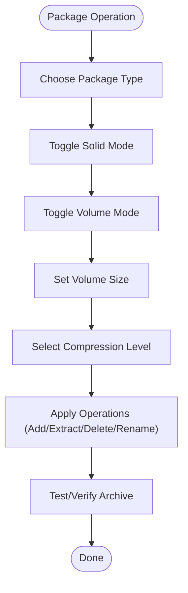

**Diagram sources**
- [xpkgui_full_spec.md](file://tools/xpkgui/xpkgui_full_spec.md#L248-L313)
- [xpkgui_full_spec.md](file://tools/xpkgui/xpkgui_full_spec.md#L314-L344)
- [xpkgui_full_spec.md](file://tools/xpkgui/xpkgui_full_spec.md#L346-L374)
- [xpkgui_full_spec.md](file://tools/xpkgui/xpkgui_full_spec.md#L376-L410)
- [xpkgui_full_spec.md](file://tools/xpkgui/xpkgui_full_spec.md#L412-L442)
- [xpkgui_full_spec.md](file://tools/xpkgui/xpkgui_full_spec.md#L443-L458)
- [xpkgui_full_spec.md](file://tools/xpkgui/xpkgui_full_spec.md#L594-L624)

**Section sources**
- [xpkgui_full_spec.md](file://tools/xpkgui/xpkgui_full_spec.md#L248-L313)
- [xpkgui_full_spec.md](file://tools/xpkgui/xpkgui_full_spec.md#L314-L344)
- [xpkgui_full_spec.md](file://tools/xpkgui/xpkgui_full_spec.md#L346-L374)
- [xpkgui_full_spec.md](file://tools/xpkgui/xpkgui_full_spec.md#L376-L410)
- [xpkgui_full_spec.md](file://tools/xpkgui/xpkgui_full_spec.md#L412-L442)
- [xpkgui_full_spec.md](file://tools/xpkgui/xpkgui_full_spec.md#L443-L458)
- [xpkgui_full_spec.md](file://tools/xpkgui/xpkgui_full_spec.md#L594-L624)

### Command-Line Integration and Automation
- xpkgui supports modes: open, -extract, -extract_here, -add, -add_auto, -verify, -properties.
- The shell extension invokes xpkgui with these arguments for seamless automation.

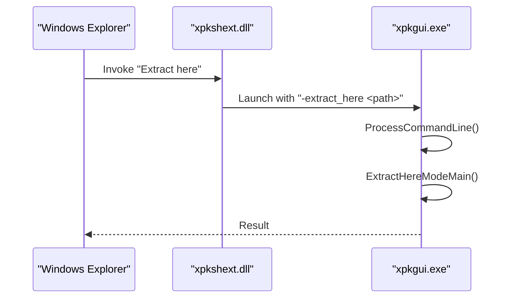

**Diagram sources**
- [xpkgui.c](file://tools/xpkgui/xpkgui.c#L271-L313)
- [xpkgui.c](file://tools/xpkgui/xpkgui.c#L379-L417)
- [xpkshext.c](file://tools/xpkgui/xpkshext.c#L194-L235)

**Section sources**
- [xpkgui.c](file://tools/xpkgui/xpkgui.c#L271-L313)
- [xpkgui.c](file://tools/xpkgui/xpkgui.c#L379-L417)
- [xpkshext.c](file://tools/xpkgui/xpkshext.c#L194-L235)

### Build Process and Platform Support
- Windows builds:
  - Static and dynamic linking variants for xpkgui and xpkshext.
  - Build orchestration via build_all.bat, detecting compilers (TCC/GCC) and architectures.
- Linux builds:
  - Static build script links all libraries into a standalone executable.
  - Dynamic build script compiles a shared library and a separate GUI binary linked against it.

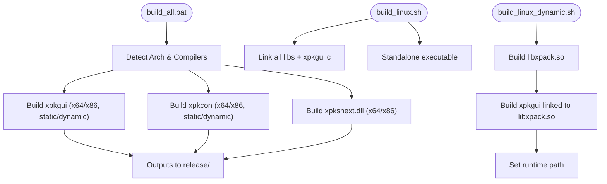

**Diagram sources**
- [build_all.bat](file://tools/xpkgui/build_all.bat#L1-L184)
- [build_linux.sh](file://tools/xpkgui/build_linux.sh#L1-L61)
- [build_linux_dynamic.sh](file://tools/xpkgui/build_linux_dynamic.sh#L1-L75)

**Section sources**
- [build_all.bat](file://tools/xpkgui/build_all.bat#L1-L184)
- [build_linux.sh](file://tools/xpkgui/build_linux.sh#L1-L61)
- [build_linux_dynamic.sh](file://tools/xpkgui/build_linux_dynamic.sh#L1-L75)

### Installation and Uninstallation Procedures
- Portable vs System-wide:
  - System-wide installation copies binaries to Program Files and registers file associations and shell extensions.
  - Uninstallation removes registry entries, binaries, and configuration directory.
- Installer behavior:
  - Copies xpkgui.exe, xpkshext.dll, xpack.dll (if present).
  - Registers .xpk association and context menu handlers.
  - Refreshes icon cache for immediate visual feedback.

**Section sources**
- [install.bat](file://tools/xpkgui/install.bat#L1-L122)
- [uninstall.bat](file://tools/xpkgui/uninstall.bat#L1-L85)
- [xpkgui.reg](file://tools/xpkgui/xpkgui.reg#L1-L29)
- [xpkshext.reg](file://tools/xpkgui/xpkshext.reg#L1-L26)

### Relationship to xPack Library and API Calls
- xpkgui translates GUI actions into xPack API calls:
  - Opening archives, saving, listing files, appending files, extracting, verifying, rebuilding, and setting properties.
- The shell extension and CLI (xpkcon) complement the GUI for automation and advanced operations.

**Section sources**
- [xpkgui.c](file://tools/xpkgui/xpkgui.c#L969-L995)
- [xpkgui.c](file://tools/xpkgui/xpkgui.c#L1011-L1063)
- [xpkgui.c](file://tools/xpkgui/xpkgui.c#L1113-L1180)
- [xpkgui.c](file://tools/xpkgui/xpkgui.c#L1182-L1200)
- [xpkgui.c](file://tools/xpkgui/xpkgui.c#L419-L447)
- [xpkgui.c](file://tools/xpkgui/xpkgui.c#L449-L506)

## Dependency Analysis
- Internal Dependencies
  - xpkgui.c depends on xpack.h/xpack.c for archive operations and xrt.h for utilities.
  - Resource definitions in resource.h and xpkgui.rc define UI elements and menu IDs.
- External Dependencies
  - Windows APIs: shell32, comctl32, shlwapi, user32, advapi32.
  - Shell extension depends on ole32 for COM interfaces.
- Cross-Platform Notes
  - Linux builds statically link all dependencies into a single executable or dynamically link against a shared library.

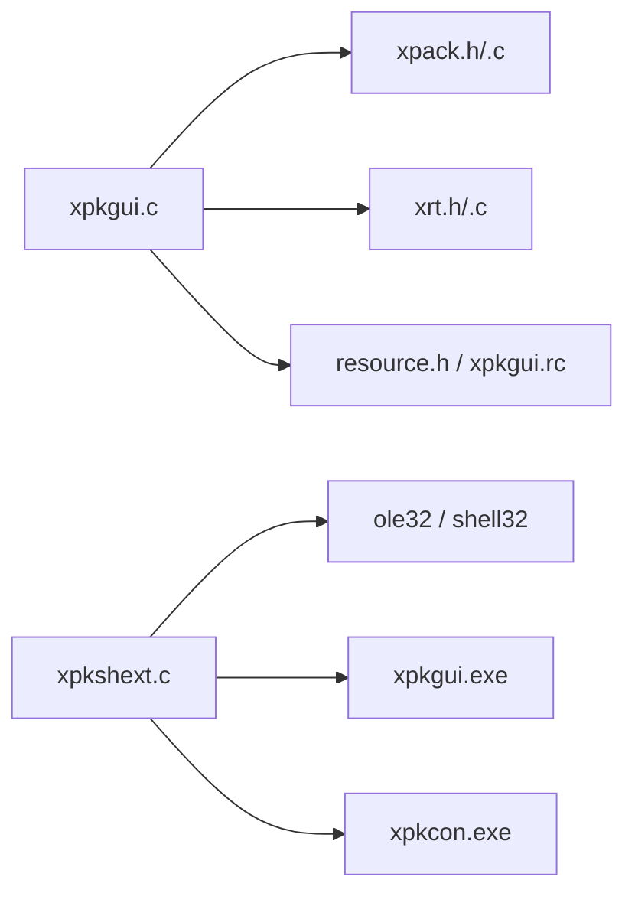

**Diagram sources**
- [xpkgui.c](file://tools/xpkgui/xpkgui.c#L1-L17)
- [xpkgui.rc](file://tools/xpkgui/xpkgui.rc#L1-L4)
- [xpkshext.c](file://tools/xpkgui/xpkshext.c#L1-L10)

**Section sources**
- [xpkgui.c](file://tools/xpkgui/xpkgui.c#L1-L17)
- [xpkgui.rc](file://tools/xpkgui/xpkgui.rc#L1-L4)
- [xpkshext.c](file://tools/xpkgui/xpkshext.c#L1-L10)

## Performance Considerations
- Compression levels impact speed and ratio; choose levels appropriate for workload.
- Solid compression improves ratio but may increase extraction time.
- Volume mode increases safety for large archives but requires sequential reads during extraction.
- Batch operations benefit from delegating to xpkcon for recursive directory handling and pattern matching.

## Troubleshooting Guide
- Shell extension not appearing:
  - Ensure xpkshext.dll is registered and CLSID keys exist under HKCR.
  - Re-run installation script or manually register using regsvr32.
- Icons not updating:
  - Run icon cache refresh (ie4uinit.exe -show) after installation/uninstallation.
- File association issues:
  - Verify .xpk association and open command in registry.
- Extraction failures:
  - Confirm target directory exists and is writable.
  - For volume archives, ensure all parts are present in the same folder.
- Error messages:
  - Use detailed error reporting to capture xPack error codes and messages.

**Section sources**
- [install.bat](file://tools/xpkgui/install.bat#L110-L111)
- [uninstall.bat](file://tools/xpkgui/uninstall.bat#L76-L77)
- [xpkgui.c](file://tools/xpkgui/xpkgui.c#L140-L141)

## Conclusion
xpkgui delivers a comprehensive, Windows-integrated graphical environment for managing xPack archives, combining a rich GUI with deep shell integration and robust automation support. Its modular design, clear separation of concerns, and extensive configuration options make it suitable for both everyday users and advanced workflows requiring scripting and batch processing.

## Appendices

### Typical User Workflows
- Creating a new package:
  - Use New from File menu, choose package type and compression level, add files or directories.
- Browsing contents:
  - Open an existing archive; browse the file list with status bar metadata.
- Extracting files:
  - Select files and use Extract, or extract all to a chosen directory.
- Managing multiple archives:
  - Use recent history and settings persistence for quick access and preferred defaults.

### Configuration Options and Customization
- Settings file location: %APPDATA%\xPack\settings.ini
- History file location: %APPDATA%\xPack\history.ini
- Customize grid lines, status bar visibility, default compression level, and window geometry.

**Section sources**
- [README.md](file://tools/xpkgui/README.md#L218-L257)
- [xpkgui.c](file://tools/xpkgui/xpkgui.c#L142-L146)