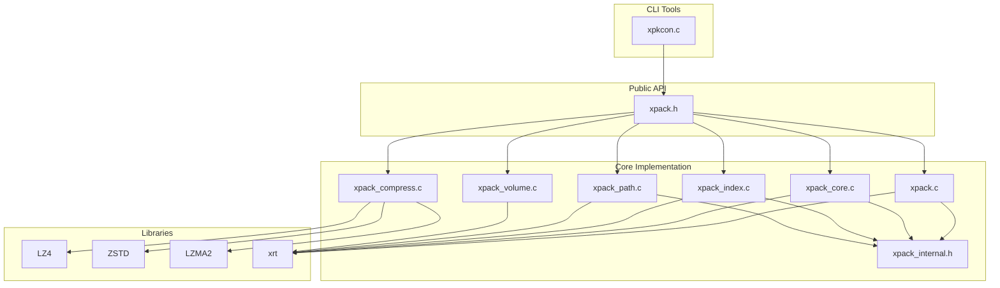
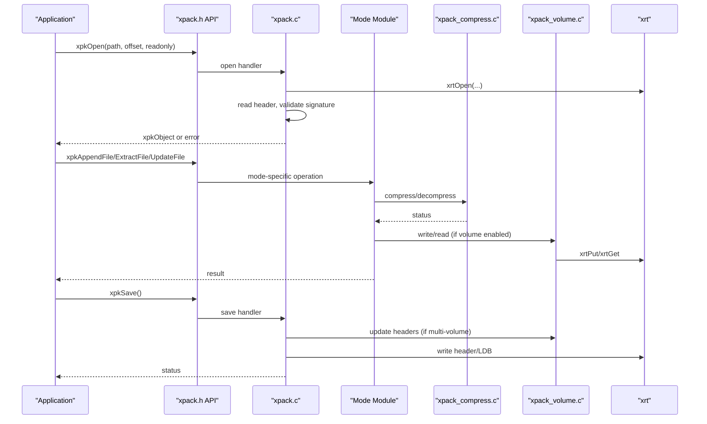
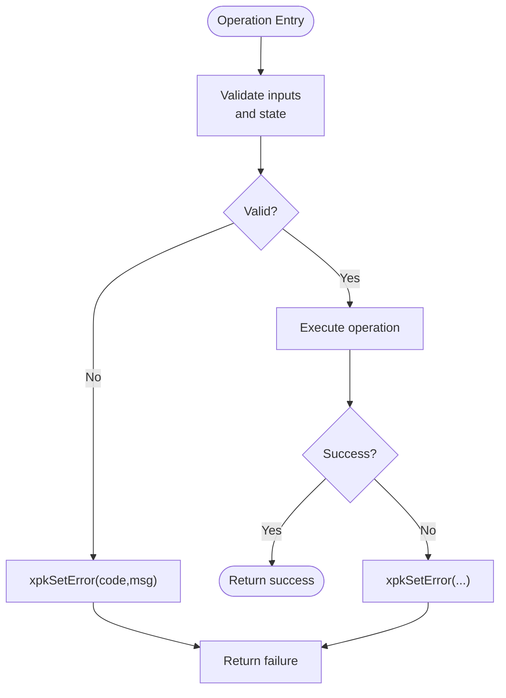
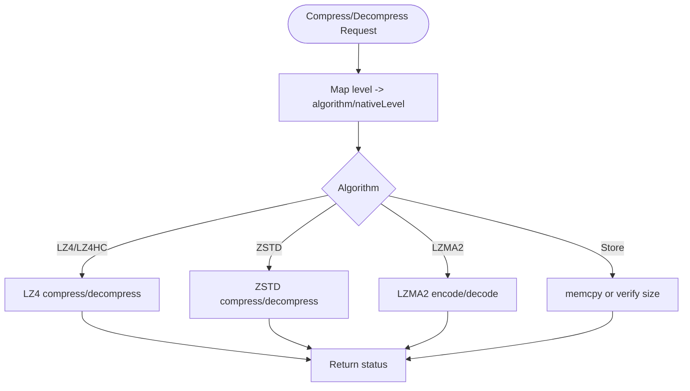
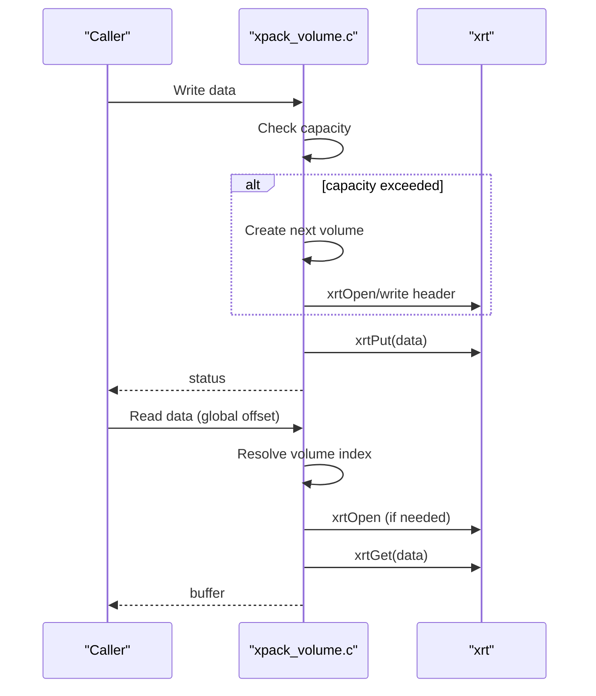
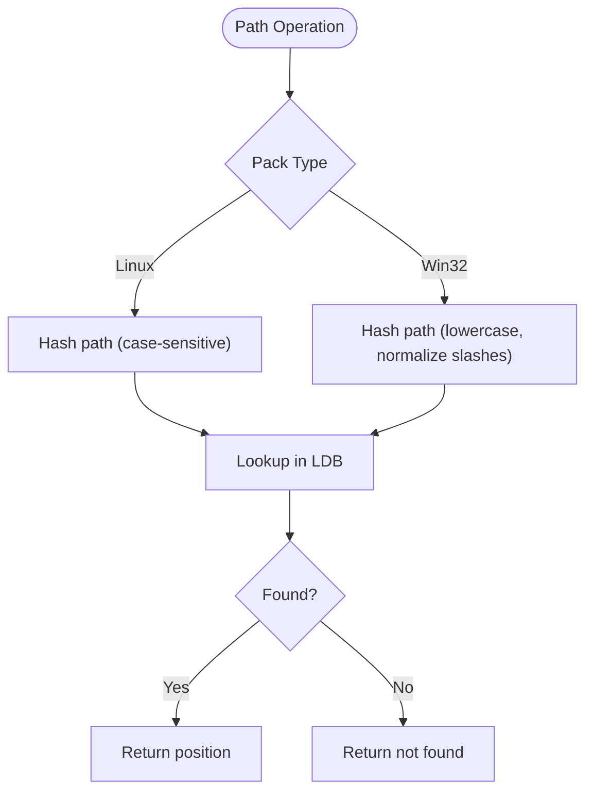
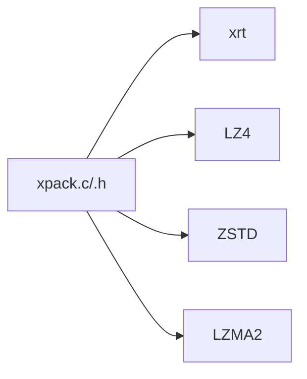
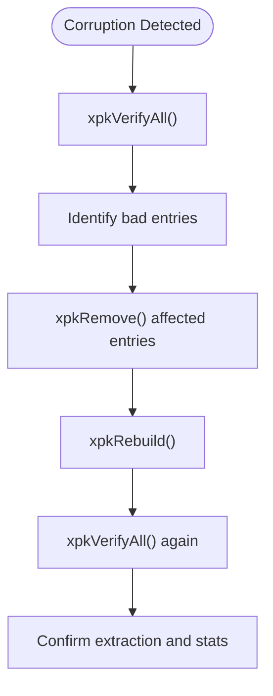

# Troubleshooting and FAQ

<cite>
**Referenced Files in This Document**
- [xpack.h](file://src/xpack.h)
- [xpack_internal.h](file://src/xpack_internal.h)
- [xpack.c](file://src/xpack.c)
- [xpack_compress.c](file://src/xpack_compress.c)
- [xpack_core.c](file://src/xpack_core.c)
- [xpack_index.c](file://src/xpack_index.c)
- [xpack_path.c](file://src/xpack_path.c)
- [xpack_volume.c](file://src/xpack_volume.c)
- [zstd_errors.h](file://lib/zstd/zstd_errors.h)
- [design.md](file://docs/design.md)
- [spec.md](file://docs/spec.md)
- [11_error_handling.h](file://test/11_error_handling.h)
- [24_corruption_recovery.h](file://test/24_corruption_recovery.h)
- [25_cross_platform.h](file://test/25_cross_platform.h)
- [26_memory_management.h](file://test/26_memory_management.h)
- [xpkcon.c](file://tools/xpkcon/xpkcon.c)
</cite>

## Table of Contents
1. [Introduction](#introduction)
2. [Project Structure](#project-structure)
3. [Core Components](#core-components)
4. [Architecture Overview](#architecture-overview)
5. [Detailed Component Analysis](#detailed-component-analysis)
6. [Dependency Analysis](#dependency-analysis)
7. [Performance Considerations](#performance-considerations)
8. [Troubleshooting Guide](#troubleshooting-guide)
9. [Conclusion](#conclusion)
10. [Appendices](#appendices)

## Introduction
This document provides comprehensive troubleshooting and FAQ guidance for xPack Ver7. It covers error diagnosis, recovery procedures, platform-specific pitfalls, and practical troubleshooting workflows. It also documents the complete error code reference, diagnostic steps for package corruption and compression failures, memory-related issues, and integration challenges. Guidance is grounded in the library’s APIs, internal implementation, and test suites.

## Project Structure
The xPack library is organized around a public API surface and modular internal components:
- Public API and constants: [xpack.h](file://src/xpack.h)
- Internal structures and helpers: [xpack_internal.h](file://src/xpack_internal.h)
- Lifecycle, save/close, volume, and error handling: [xpack.c](file://src/xpack.c)
- Compression/decompression routing: [xpack_compress.c](file://src/xpack_compress.c)
- Core mode operations (position-based): [xpack_core.c](file://src/xpack_core.c)
- Index mode operations (integer index): [xpack_index.c](file://src/xpack_index.c)
- Path modes (Linux/Win32): [xpack_path.c](file://src/xpack_path.c)
- Volume management (multi-volume support): [xpack_volume.c](file://src/xpack_volume.c)
- Zstandard error definitions: [zstd_errors.h](file://lib/zstd/zstd_errors.h)
- Design and specification documents: [design.md](file://docs/design.md), [spec.md](file://docs/spec.md)
- Tests covering error handling, corruption recovery, cross-platform behavior, and memory management: [11_error_handling.h](file://test/11_error_handling.h), [24_corruption_recovery.h](file://test/24_corruption_recovery.h), [25_cross_platform.h](file://test/25_cross_platform.h), [26_memory_management.h](file://test/26_memory_management.h)
- CLI tool for diagnostics and operations: [xpkcon.c](file://tools/xpkcon/xpkcon.c)

**Diagram sources**
- [xpack.h](file://src/xpack.h#L328-L447)
- [xpack.c](file://src/xpack.c#L49-L297)
- [xpack_core.c](file://src/xpack_core.c#L18-L128)
- [xpack_index.c](file://src/xpack_index.c#L36-L174)
- [xpack_path.c](file://src/xpack_path.c#L100-L279)
- [xpack_compress.c](file://src/xpack_compress.c#L20-L147)
- [xpack_volume.c](file://src/xpack_volume.c#L44-L160)
- [xpack_internal.h](file://src/xpack_internal.h#L47-L84)
- [xpkcon.c](file://tools/xpkcon/xpkcon.c#L86-L128)

**Section sources**
- [xpack.h](file://src/xpack.h#L1-L447)
- [xpack_internal.h](file://src/xpack_internal.h#L1-L145)
- [xpack.c](file://src/xpack.c#L1-L762)
- [xpack_compress.c](file://src/xpack_compress.c#L1-L251)
- [xpack_core.c](file://src/xpack_core.c#L1-L403)
- [xpack_index.c](file://src/xpack_index.c#L1-L290)
- [xpack_path.c](file://src/xpack_path.c#L1-L373)
- [xpack_volume.c](file://src/xpack_volume.c#L1-L353)
- [zstd_errors.h](file://lib/zstd/zstd_errors.h#L60-L98)
- [design.md](file://docs/design.md#L1-L485)
- [spec.md](file://docs/spec.md#L1-L458)
- [11_error_handling.h](file://test/11_error_handling.h#L1-L388)
- [24_corruption_recovery.h](file://test/24_corruption_recovery.h#L1-L438)
- [25_cross_platform.h](file://test/25_cross_platform.h#L1-L357)
- [26_memory_management.h](file://test/26_memory_management.h#L1-L300)
- [xpkcon.c](file://tools/xpkcon/xpkcon.c#L1-L859)

## Core Components
- Public API surface: lifecycle, attributes, modes, operations, traversal, statistics, and diagnostics.
- Compression router: maps logical compression levels to LZ4, ZSTD, LZMA2, or store.
- Volume manager: multi-volume support with automatic splitting and cross-volume reads.
- Path hashing: case-sensitive vs case-insensitive hashing per platform mode.
- Error reporting: centralized error code and message storage with thread-local state.

Key responsibilities:
- xpack.c: open/save/close, error state, solid/volume modes, path helpers.
- xpack_compress.c: compression/decompression routing and bounds calculation.
- xpack_core.c/xpack_index.c/xpack_path.c: mode-specific operations.
- xpack_volume.c: volume creation, writing, reading, and metadata.
- xpack_internal.h: shared structures, macros, and helper declarations.

**Section sources**
- [xpack.h](file://src/xpack.h#L328-L447)
- [xpack.c](file://src/xpack.c#L21-L640)
- [xpack_compress.c](file://src/xpack_compress.c#L20-L251)
- [xpack_core.c](file://src/xpack_core.c#L18-L207)
- [xpack_index.c](file://src/xpack_index.c#L18-L253)
- [xpack_path.c](file://src/xpack_path.c#L52-L372)
- [xpack_volume.c](file://src/xpack_volume.c#L44-L353)
- [xpack_internal.h](file://src/xpack_internal.h#L47-L142)

## Architecture Overview
The library integrates xrt for file and memory operations, and external libraries for compression. Operations flow from public API to mode-specific handlers, which route compression/decompression via a unified router. Volume operations are transparent to most APIs.

**Diagram sources**
- [xpack.c](file://src/xpack.c#L49-L297)
- [xpack_core.c](file://src/xpack_core.c#L18-L128)
- [xpack_compress.c](file://src/xpack_compress.c#L20-L220)
- [xpack_volume.c](file://src/xpack_volume.c#L178-L319)
- [xpack.h](file://src/xpack.h#L328-L447)

## Detailed Component Analysis

### Error Handling and Diagnostics
- Centralized error state: thread-local code and message.
- Error codes and messages are defined and mapped in the implementation.
- Tests validate error propagation for invalid paths, positions, and unsupported versions.

**Diagram sources**
- [xpack.c](file://src/xpack.c#L21-L640)
- [11_error_handling.h](file://test/11_error_handling.h#L7-L198)

**Section sources**
- [xpack.c](file://src/xpack.c#L21-L640)
- [11_error_handling.h](file://test/11_error_handling.h#L1-L388)

### Compression and Decompression Routing
- Level-to-algorithm mapping supports LZ4, LZ4-HC, ZSTD, LZMA2, and store.
- Fallback behavior: on compression failure, falls back to store.
- Decompression validates sizes and returns errors when mismatches occur.

**Diagram sources**
- [xpack_compress.c](file://src/xpack_compress.c#L20-L220)
- [xpack.h](file://src/xpack.h#L269-L286)

**Section sources**
- [xpack_compress.c](file://src/xpack_compress.c#L1-L251)
- [xpack.h](file://src/xpack.h#L269-L286)

### Volume Management
- Multi-volume creation and switching when capacity is exceeded.
- Cross-volume reads resolve offsets and open required volumes on demand.
- Errors include maximum volume count exceeded and incomplete data.

**Diagram sources**
- [xpack_volume.c](file://src/xpack_volume.c#L113-L319)
- [xpack.c](file://src/xpack.c#L646-L762)

**Section sources**
- [xpack_volume.c](file://src/xpack_volume.c#L1-L353)
- [xpack.c](file://src/xpack.c#L646-L762)

### Path Modes and Platform Behavior
- Linux mode: case-sensitive hashing and path storage.
- Win32 mode: case-insensitive hashing and normalization.
- Tests demonstrate case sensitivity, separators, absolute/relative paths, and Unicode handling.

**Diagram sources**
- [xpack_path.c](file://src/xpack_path.c#L18-L90)
- [xpack.h](file://src/xpack.h#L38-L75)

**Section sources**
- [xpack_path.c](file://src/xpack_path.c#L1-L373)
- [25_cross_platform.h](file://test/25_cross_platform.h#L1-L357)

### Memory Management and Buffer Handling
- Extraction allocates buffers sized to decompressed data; tests verify robustness with null/out-of-bounds buffers.
- Proper freeing is required; helper API provided.

**Section sources**
- [xpack_core.c](file://src/xpack_core.c#L147-L207)
- [26_memory_management.h](file://test/26_memory_management.h#L1-L300)

## Dependency Analysis
External dependencies and their roles:
- xrt: file I/O, arrays, hashing, memory management, time utilities.
- LZ4/LZ4HC: fast compression paths.
- ZSTD: balanced to ultra-high compression.
- LZMA2: highest compression ratio fallback.

**Diagram sources**
- [xpack.h](file://src/xpack.h#L22-L24)
- [xpack_compress.c](file://src/xpack_compress.c#L9-L15)
- [spec.md](file://docs/spec.md#L318-L350)

**Section sources**
- [xpack.h](file://src/xpack.h#L22-L24)
- [xpack_compress.c](file://src/xpack_compress.c#L9-L15)
- [spec.md](file://docs/spec.md#L318-L350)

## Performance Considerations
- Compression level mapping favors ZSTD for balanced performance; LZ4 for speed.
- Solid mode reduces metadata overhead but restricts updates/removals.
- Volume mode trades I/O locality for multi-file convenience; ensure appropriate split mode and sizes.

[No sources needed since this section provides general guidance]

## Troubleshooting Guide

### Error Code Reference
The library defines a set of error codes and messages. These are surfaced via the last-error accessor and used throughout the implementation.

- 0: Success
- 1: File open failed
- 2: File read failed
- 3: Memory allocation failed
- 4: Invalid pack format
- 5: Version not supported
- 6: Invalid file position
- 7: Compression failed
- 8: Decompression failed
- 9: Hash verification failed
- 10: Readonly mode write denied
- 11: Pack type mismatch
- 12: Maximum volume count exceeded
- 13: Volume file not available
- 14: Volume data incomplete

Common causes and resolutions:
- File open/read failures: verify path existence and permissions; ensure file is not locked.
- Memory allocation failures: check available RAM; reduce batch sizes; avoid oversized allocations.
- Invalid pack format/version: confirm file integrity and version compatibility; use rebuild if applicable.
- Position errors: ensure indices are within bounds; re-check counts after deletions.
- Compression/decompression failures: retry with lower compression levels; validate input data; check fallback behavior.
- Hash verification failures: suspect corruption; use verify and rebuild.
- Readonly mode denials: open with write permission or use a copy.
- Pack type mismatch: set type only on empty archives; avoid changing type mid-archive.
- Volume errors: ensure all volumes are present; check split mode and sizes.

**Section sources**
- [xpack.c](file://src/xpack.c#L27-L43)
- [xpack.c](file://src/xpack.c#L622-L640)
- [spec.md](file://docs/spec.md#L368-L385)

### Diagnostic Procedures

#### Package Corruption Detection and Recovery
- Use verification APIs to detect damaged entries.
- Remove corrupted entries and rebuild to compact and optimize.
- Validate post-rebuild integrity and extract all to confirm.

**Diagram sources**
- [xpack.c](file://src/xpack.c#L436-L440)
- [24_corruption_recovery.h](file://test/24_corruption_recovery.h#L79-L160)

**Section sources**
- [24_corruption_recovery.h](file://test/24_corruption_recovery.h#L1-L438)
- [xpack.c](file://src/xpack.c#L436-L440)

#### Compression Failures
- If compression fails, the router falls back to store; verify effective compression ratio.
- Retry with lower levels or different algorithms; inspect mapping table for level-to-algorithm mapping.

**Section sources**
- [xpack_compress.c](file://src/xpack_compress.c#L20-L147)
- [xpack.h](file://src/xpack.h#L269-L286)

#### Memory Issues
- Allocation failures indicate insufficient memory; reduce workloads or free buffers promptly.
- Always free extracted buffers using the provided helper; avoid leaks.

**Section sources**
- [xpack_core.c](file://src/xpack_core.c#L147-L207)
- [26_memory_management.h](file://test/26_memory_management.h#L1-L300)

#### Platform-Specific Problems
- Case sensitivity: Linux mode is case-sensitive; Win32 mode normalizes to lowercase.
- Path separators: Win32 accepts both forward and backslashes; normalization occurs.
- Absolute/relative paths: supported; ensure paths match the chosen mode semantics.
- Unicode and special characters: tested; ensure filesystem support.

**Section sources**
- [xpack_path.c](file://src/xpack_path.c#L18-L90)
- [25_cross_platform.h](file://test/25_cross_platform.h#L1-L357)

#### Integration Problems
- CLI tool usage: use the command-line interface to diagnose and operate on archives.
- Commands include add, extract, list, test, delete, update, and info; volume and split options are supported.

**Section sources**
- [xpkcon.c](file://tools/xpkcon/xpkcon.c#L130-L168)
- [xpkcon.c](file://tools/xpkcon/xpkcon.c#L339-L442)
- [xpkcon.c](file://tools/xpkcon/xpkcon.c#L624-L651)

### Step-by-Step Troubleshooting Scenarios

#### Failed Extractions
1. Confirm position or path validity.
2. Check for decompression errors and verify compression levels.
3. Re-extract with a different mode or level.
4. Validate file integrity with verification.

**Section sources**
- [xpack_core.c](file://src/xpack_core.c#L147-L207)
- [xpack_path.c](file://src/xpack_path.c#L285-L307)
- [xpack.c](file://src/xpack.c#L436-L440)

#### Corrupted Packages
1. Attempt to open and immediately verify.
2. Remove problematic entries and rebuild.
3. Save and re-open to confirm recovery.

**Section sources**
- [24_corruption_recovery.h](file://test/24_corruption_recovery.h#L79-L160)

#### Performance Issues
1. Profile compression levels and choose appropriate defaults.
2. Consider solid mode for large batches; note restrictions on updates/removals.
3. Use volume mode to manage large archives; tune split mode and sizes.

**Section sources**
- [design.md](file://docs/design.md#L27-L92)
- [xpack.c](file://src/xpack.c#L366-L421)

#### Integration Challenges
1. Use the CLI to validate operations and diagnose issues.
2. Ensure correct pack type selection and mode-specific path semantics.
3. Handle read-only constraints and adjust accordingly.

**Section sources**
- [xpkcon.c](file://tools/xpkcon/xpkcon.c#L130-L168)
- [xpack_path.c](file://src/xpack_path.c#L100-L136)

### Debugging Techniques and Logging Strategies
- Retrieve last error code and message to pinpoint failures.
- Use verification routines to detect silent corruption.
- Employ rebuild to recover from partial damage.
- Utilize CLI commands to list, test, and inspect archives.

**Section sources**
- [xpack.c](file://src/xpack.c#L634-L640)
- [xpack.c](file://src/xpack.c#L436-L440)
- [xpkcon.c](file://tools/xpkcon/xpkcon.c#L579-L651)

## Conclusion
This guide consolidates error handling, recovery workflows, and platform-specific considerations for xPack Ver7. By leveraging built-in diagnostics, understanding compression routing, and following structured troubleshooting steps, most issues can be diagnosed and resolved efficiently. Use the CLI for quick checks and the API for deeper integration and automation.

[No sources needed since this section summarizes without analyzing specific files]

## Appendices

### Frequently Asked Questions

- What compression ratios can I expect?
  - Ratios vary by level and content; refer to the compression level mapping and design/spec documents for approximate ranges.

- How do I tune performance?
  - Choose appropriate compression levels; consider solid mode for large batches; use volume mode for very large archives.

- Are there file size limits?
  - Practical limits depend on available memory and disk; ensure sufficient resources for decompression and reconstruction.

- How do I migrate between versions?
  - Newer versions can refuse older files; verify signatures and consider rebuilding if necessary.

- How does platform portability work?
  - Select the appropriate path mode; Linux mode is case-sensitive; Win32 mode normalizes case and separators.

**Section sources**
- [design.md](file://docs/design.md#L27-L92)
- [spec.md](file://docs/spec.md#L368-L385)
- [xpack_path.c](file://src/xpack_path.c#L18-L90)
- [xpack.c](file://src/xpack.c#L98-L104)