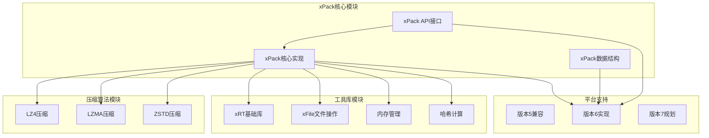
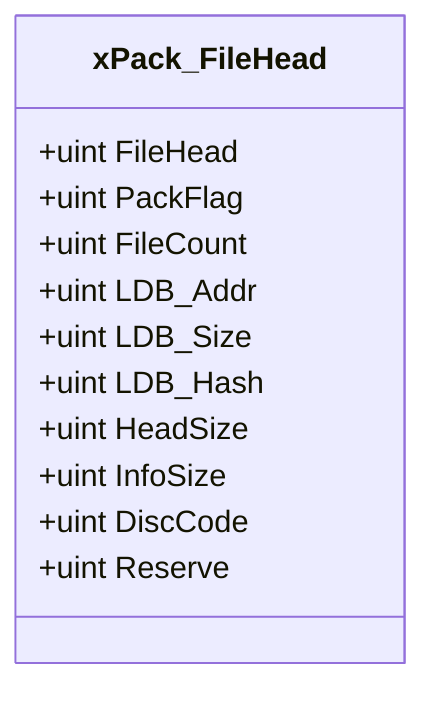
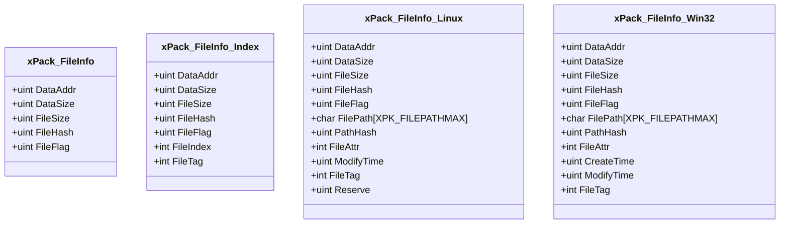
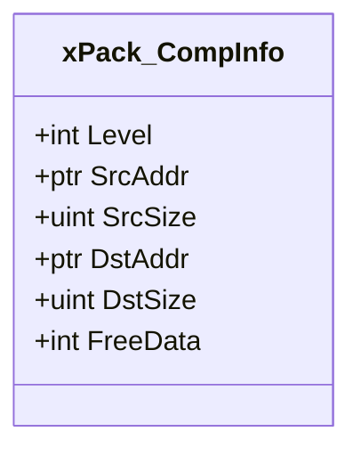
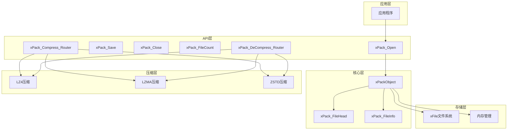
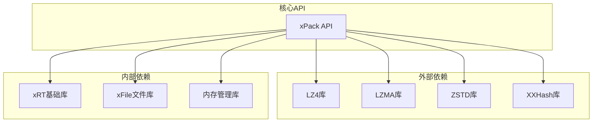
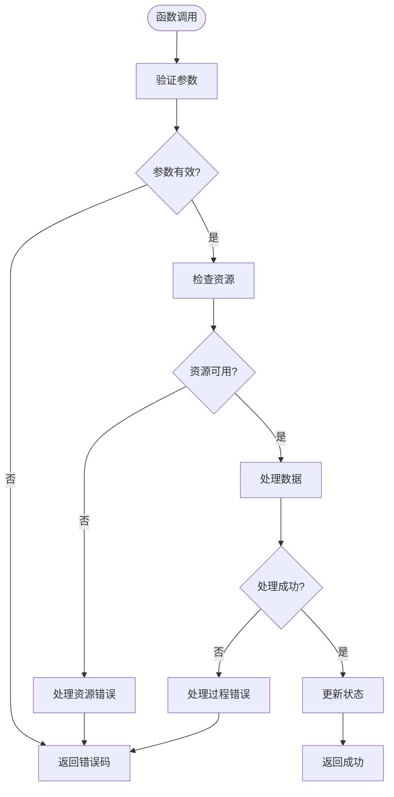

# API参考手册

<cite>
**本文档引用的文件**
- [xPack.h](file://ver6/xpack/xPack.h)
- [xPack.c](file://ver6/xpack/xPack.c)
- [test.c](file://ver6/xpack/test.c)
- [压缩级别参数.txt](file://压缩级别参数.txt)
</cite>

## 目录
1. [简介](#简介)
2. [项目结构](#项目结构)
3. [核心组件](#核心组件)
4. [架构概览](#架构概览)
5. [详细组件分析](#详细组件分析)
6. [依赖关系分析](#依赖关系分析)
7. [性能考虑](#性能考虑)
8. [故障排除指南](#故障排除指南)
9. [结论](#结论)

## 简介

xPack是一个高性能的文件压缩包管理系统，提供了完整的文件包操作、文件操作和查询操作API。该系统支持多种包类型（Core、Index、Linux、Win32），每种类型都有特定的功能和用途。xPack采用模块化设计，集成了多种压缩算法（LZ4、LZMA、ZSTD），并提供了灵活的扩展机制。

## 项目结构

xPack项目采用分层架构设计，主要包含以下核心模块：



**图表来源**
- [xPack.h](file://ver6/xpack/xPack.h#L1-L252)
- [xPack.c](file://ver6/xpack/xPack.c#L1-L970)

**章节来源**
- [xPack.h](file://ver6/xpack/xPack.h#L1-L252)
- [xPack.c](file://ver6/xpack/xPack.c#L1-L970)

## 核心组件

### 数据结构定义

xPack系统定义了多个核心数据结构来管理压缩包的不同方面：

#### 包文件头结构 (xPack_FileHead)


**图表来源**
- [xPack.h](file://ver6/xpack/xPack.h#L22-L34)

#### 文件信息结构 (xPack_FileInfo)


**图表来源**
- [xPack.h](file://ver6/xpack/xPack.h#L36-L84)

#### 压缩信息结构 (xPack_CompInfo)


**图表来源**
- [xPack.h](file://ver6/xpack/xPack.h#L86-L94)

**章节来源**
- [xPack.h](file://ver6/xpack/xPack.h#L22-L94)

### 枚举常量说明

#### 包类型常量
- `XPK_CLASS_Core`: 核心压缩包，支持顺序读取
- `XPK_CLASS_Index`: Index访问包，支持无序索引访问
- `XPK_CLASS_Linux`: Linux文件系统兼容包
- `XPK_CLASS_Win32`: Win32文件系统兼容包
- `XPK_CLASS_MASK`: 包类型掩码

#### 压缩级别常量
- `XPK_COMP_NO`: 不压缩
- `XPK_COMP_FAST`: 快速压缩（LZ4）
- `XPK_COMP_HIGH`: 高压缩比（LZMA）
- `XPK_COMP_CUSTOM`: 自定义压缩

#### 其他常量
- `XPK_FILEPATHMAX`: 文件路径最大长度（160字符）
- `XPK_LDBCOMP`: LDB数据段压缩标志
- `XPK_LDBCOMPTYPE`: LDB数据段压缩方式标志

**章节来源**
- [xPack.h](file://ver6/xpack/xPack.h#L4-L18)
- [xPack.h](file://ver6/xpack/xPack.h#L7-L13)

## 架构概览

xPack采用分层架构设计，实现了清晰的职责分离：



**图表来源**
- [xPack.h](file://ver6/xpack/xPack.h#L98-L109)
- [xPack.c](file://ver6/xpack/xPack.c#L54-L159)

## 详细组件分析

### 文件包操作API

#### xPack_Open - 打开文件包
**功能**: 打开或创建文件包，支持只读和读写模式

**参数**:
- `sFile`: 文件路径字符串
- `iOffset`: 文件偏移量（用于嵌入式存储）
- `bReadOnly`: 只读标志（0=读写，非0=只读）

**返回值**: 
- 成功：xPackObject指针（包对象句柄）
- 失败：NULL（通过OnError回调报告错误）

**使用示例**:
```c
// 创建新包
xPackObject xpk = xPack_Open("data.xpk", 0, FALSE);

// 打开现有包进行只读访问
xPackObject xpk = xPack_Open("data.xpk", 0, TRUE);
```

**注意事项**:
- 如果文件不存在且bReadOnly为0，会自动创建新包
- 打开包时会验证文件头和版本兼容性
- 支持偏移量参数用于嵌入式存储场景

**章节来源**
- [xPack.h](file://ver6/xpack/xPack.h#L125-L126)
- [xPack.c](file://ver6/xpack/xPack.c#L219-L302)

#### xPack_Close - 关闭文件包
**功能**: 关闭文件包并清理资源

**参数**:
- `xpk`: xPackObject指针（包对象句柄）

**返回值**: 无

**使用示例**:
```c
xPack_Close(xpk);
```

**注意事项**:
- 如果包处于修改状态且不是只读模式，会自动保存更改
- 会清理文件句柄、内存管理器和包对象
- 关闭后应避免使用已关闭的包对象

**章节来源**
- [xPack.h](file://ver6/xpack/xPack.h#L122-L123)
- [xPack.c](file://ver6/xpack/xPack.c#L205-L216)

#### xPack_Save - 保存文件包
**功能**: 将内存中的包数据保存到磁盘

**参数**:
- `xpk`: xPackObject指针（包对象句柄）
- `bReBuild`: 重建标志（通常传入FALSE）

**返回值**: 
- 成功：-1
- 失败：0（通过OnError回调报告错误）

**使用示例**:
```c
// 自动保存（在Close时自动调用）
xPack_Close(xpk);

// 手动保存
xPack_Save(xpk, FALSE);
```

**注意事项**:
- 会重新计算LDB（文件列表）的哈希值
- 支持LZMA压缩LDB数据段
- 保存前会验证文件列表数据完整性

**章节来源**
- [xPack.h](file://ver6/xpack/xPack.h#L119-L120)
- [xPack.c](file://ver6/xpack/xPack.c#L163-L203)

#### xPack_FileCount - 获取包文件数量
**功能**: 返回包中文件的数量

**参数**:
- `xpk`: xPackObject指针（包对象句柄）

**返回值**: 
- 成功：文件数量
- 失败：0

**使用示例**:
```c
uint count = xPack_FileCount(xpk);
printf("包中有 %d 个文件\n", count);
```

**注意事项**:
- 返回的是当前内存中LDB（文件列表）的条目数
- 不会重新扫描磁盘文件

**章节来源**
- [xPack.h](file://ver6/xpack/xPack.h#L128-L129)
- [xPack.c](file://ver6/xpack/xPack.c#L306-L311)

### 文件操作API

#### xPack_Core_AppendFile - 添加文件（核心模式）
**功能**: 向包中添加文件（核心模式）

**参数**:
- `xpk`: xPackObject指针（包对象句柄）
- `sFile`: 源文件路径
- `iCompLevel`: 压缩级别

**返回值**: 
- 成功：文件位置索引
- 失败：0（通过OnError回调报告错误）

**使用示例**:
```c
// 添加未压缩文件
uint pos = xPack_Core_AppendFile(xpk, "data.txt", XPK_COMP_NO);

// 添加LZ4压缩文件
uint pos = xPack_Core_AppendFile(xpk, "data.txt", XPK_COMP_FAST);

// 添加LZMA压缩文件
uint pos = xPack_Core_AppendFile(xpk, "data.txt", XPK_COMP_HIGH);
```

**注意事项**:
- 会自动计算文件哈希值
- 支持多种压缩算法
- 文件数据直接追加到包末尾

**章节来源**
- [xPack.h](file://ver6/xpack/xPack.h#L170-L171)
- [xPack.c](file://ver6/xpack/xPack.c#L496-L515)

#### xPack_Core_AppendData - 添加数据（核心模式）
**功能**: 向包中添加内存数据（核心模式）

**参数**:
- `xpk`: xPackObject指针（包对象句柄）
- `pIn`: 输入数据指针
- `iSize`: 数据大小
- `iCompLevel`: 压缩级别

**返回值**: 
- 成功：文件位置索引
- 失败：0（通过OnError回调报告错误）

**使用示例**:
```c
char* data = "Hello World";
uint pos = xPack_Core_AppendData(xpk, data, strlen(data), XPK_COMP_FAST);
```

**注意事项**:
- 直接处理内存中的数据
- 适用于动态生成的数据

**章节来源**
- [xPack.h](file://ver6/xpack/xPack.h#L173-L174)
- [xPack.c](file://ver6/xpack/xPack.c#L451-L494)

#### xPack_Core_ChangeFile - 修改文件（核心模式）
**功能**: 修改包中现有文件（核心模式）

**参数**:
- `xpk`: xPackObject指针（包对象句柄）
- `iPos`: 文件位置索引
- `sFile`: 新文件路径
- `iCompLevel`: 压缩级别

**返回值**: 
- 成功：指向文件信息的指针
- 失败：NULL（通过OnError回调报告错误）

**使用示例**:
```c
xPack_FileInfo* info = xPack_Core_ChangeFile(xpk, 1, "new_data.txt", XPK_COMP_HIGH);
```

**注意事项**:
- 修改操作会重新分配文件空间
- 会更新文件的哈希值和压缩信息

**章节来源**
- [xPack.h](file://ver6/xpack/xPack.h#L176-L177)
- [xPack.c](file://ver6/xpack/xPack.c#L561-L580)

#### xPack_Core_ChangeData - 修改数据（核心模式）
**功能**: 修改包中现有数据（核心模式）

**参数**:
- `xpk`: xPackObject指针（包对象句柄）
- `iPos`: 文件位置索引
- `pIn`: 新数据指针
- `iSize`: 新数据大小
- `iCompLevel`: 压缩级别

**返回值**: 
- 成功：指向文件信息的指针
- 失败：NULL（通过OnError回调报告错误）

**使用示例**:
```c
char* newData = "Updated Content";
xPack_FileInfo* info = xPack_Core_ChangeData(xpk, 1, newData, strlen(newData), XPK_COMP_FAST);
```

**注意事项**:
- 与ChangeFile类似，但直接处理内存数据

**章节来源**
- [xPack.h](file://ver6/xpack/xPack.h#L179-L180)
- [xPack.c](file://ver6/xpack/xPack.c#L517-L559)

#### xPack_Core_UnpackFile - 解包文件（核心模式）
**功能**: 将包中的文件解包到磁盘（核心模式）

**参数**:
- `xpk`: xPackObject指针（包对象句柄）
- `iPos`: 文件位置索引
- `sFile`: 目标文件路径

**返回值**: 
- 成功：指向文件信息的指针
- 失败：NULL（通过OnError回调报告错误）

**使用示例**:
```c
// 解包第一个文件
xPack_Core_UnpackFile(xpk, 1, "output.txt");

// 解包到指定目录
xPack_Core_UnpackFile(xpk, 2, "extracted/data.bin");
```

**注意事项**:
- 会自动创建目标目录
- 支持空文件的创建
- 会验证文件哈希值

**章节来源**
- [xPack.h](file://ver6/xpack/xPack.h#L182-L183)
- [xPack.c](file://ver6/xpack/xPack.c#L629-L654)

#### xPack_Core_UnpackData - 解包数据（核心模式）
**功能**: 将包中的数据解包到内存（核心模式）

**参数**:
- `xpk`: xPackObject指针（包对象句柄）
- `iPos`: 文件位置索引
- `pData`: 输出数据指针（需要使用xCore.free释放）

**返回值**: 
- 成功：指向文件信息的指针
- 失败：NULL（通过OnError回调报告错误）

**使用示例**:
```c
ptr dataPtr;
xPack_FileInfo* info = xPack_Core_UnpackData(xpk, 1, &dataPtr);
if (info) {
    // 使用数据...
    xCore.free(dataPtr); // 释放内存
}
```

**注意事项**:
- 返回的数据以null结尾，便于字符串处理
- 需要调用xCore.free释放内存
- 会验证文件哈希值

**章节来源**
- [xPack.h](file://ver6/xpack/xPack.h#L185-L186)
- [xPack.c](file://ver6/xpack/xPack.c#L582-L627)

#### xPack_Core_DeleteFile - 删除文件（核心模式）
**功能**: 从包中删除文件（核心模式）

**参数**:
- `xpk`: xPackObject指针（包对象句柄）
- `iPos`: 文件位置索引

**返回值**: 
- 成功：1
- 失败：0（通过OnError回调报告错误）

**使用示例**:
```c
xPack_Core_DeleteFile(xpk, 1); // 删除第一个文件
```

**注意事项**:
- 删除操作会重新排列后续文件的位置
- 不会立即释放磁盘空间

**章节来源**
- [xPack.h](file://ver6/xpack/xPack.h#L188-L189)
- [xPack.c](file://ver6/xpack/xPack.c#L656-L664)

### 查询操作API

#### xPack_GetFileInfo - 获取文件信息结构体指针
**功能**: 获取指定位置文件的信息结构体

**参数**:
- `xpk`: xPackObject指针（包对象句柄）
- `iPos`: 文件位置索引

**返回值**: 
- 成功：指向文件信息的指针
- 失败：NULL

**使用示例**:
```c
xPack_FileInfo* info = xPack_GetFileInfo(xpk, 1);
if (info) {
    printf("文件大小: %d\n", info->FileSize);
    printf("压缩大小: %d\n", info->DataSize);
    printf("压缩级别: %d\n", info->FileFlag & 0xF);
}
```

**注意事项**:
- 返回的是内部内存中的指针，不要手动释放
- 适用于所有包类型

**章节来源**
- [xPack.h](file://ver6/xpack/xPack.h#L155-L156)
- [xPack.c](file://ver6/xpack/xPack.c#L399-L407)

#### xPack_GetFileSize - 获取文件大小
**功能**: 获取文件的原始大小

**参数**:
- `xpk`: xPackObject指针（包对象句柄）
- `iPos`: 文件位置索引

**返回值**: 
- 成功：文件原始大小
- 失败：0

**使用示例**:
```c
uint size = xPack_GetFileSize(xpk, 1);
printf("文件大小: %d 字节\n", size);
```

**章节来源**
- [xPack.h](file://ver6/xpack/xPack.h#L158-L159)
- [xPack.c](file://ver6/xpack/xPack.c#L409-L417)

#### xPack_GetFileDataSize - 获取数据大小
**功能**: 获取文件压缩后的大小

**参数**:
- `xpk`: xPackObject指针（包对象句柄）
- `iPos`: 文件位置索引

**返回值**: 
- 成功：文件压缩后大小
- 失败：0

**使用示例**:
```c
uint size = xPack_GetFileDataSize(xpk, 1);
printf("压缩后大小: %d 字节\n", size);
```

**章节来源**
- [xPack.h](file://ver6/xpack/xPack.h#L161-L162)
- [xPack.c](file://ver6/xpack/xPack.c#L419-L427)

#### xPack_GetFileHash - 获取文件哈希值
**功能**: 获取文件的哈希值

**参数**:
- `xpk`: xPackObject指针（包对象句柄）
- `iPos`: 文件位置索引

**返回值**: 
- 成功：文件哈希值
- 失败：0

**使用示例**:
```c
uint hash = xPack_GetFileHash(xpk, 1);
printf("文件哈希: 0x%X\n", hash);
```

**章节来源**
- [xPack.h](file://ver6/xpack/xPack.h#L164-L165)
- [xPack.c](file://ver6/xpack/xPack.c#L429-L437)

#### xPack_GetFileCompLevel - 获取文件压缩级别
**功能**: 获取文件的压缩级别

**参数**:
- `xpk`: xPackObject指针（包对象句柄）
- `iPos`: 文件位置索引

**返回值**: 
- 成功：压缩级别
- 失败：0

**使用示例**:
```c
uint level = xPack_GetFileCompLevel(xpk, 1);
printf("压缩级别: %d\n", level);
```

**章节来源**
- [xPack.h](file://ver6/xpack/xPack.h#L167-L168)
- [xPack.c](file://ver6/xpack/xPack.c#L439-L447)

### 包类型管理API

#### xPack_SetPackType - 设置包类型
**功能**: 设置包的类型（必须在添加任何文件之前调用）

**参数**:
- `xpk`: xPackObject指针（包对象句柄）
- `iVal`: 包类型值

**返回值**: 
- 成功：-1
- 失败：0（通过OnError回调报告错误）

**使用示例**:
```c
// 设置为Index模式
xPack_SetPackType(xpk, XPK_CLASS_Index);

// 设置为Win32模式
xPack_SetPackType(xpk, XPK_CLASS_Win32);
```

**注意事项**:
- 只能在添加任何文件之前调用
- 会自动调整文件信息结构的大小

**章节来源**
- [xPack.h](file://ver6/xpack/xPack.h#L131-L132)
- [xPack.c](file://ver6/xpack/xPack.c#L313-L336)

#### xPack_GetPackType - 获取包类型
**功能**: 获取当前包的类型

**参数**:
- `xpk`: xPackObject指针（包对象句柄）

**返回值**: 
- 成功：包类型
- 失败：0

**使用示例**:
```c
int type = xPack_GetPackType(xpk);
printf("包类型: %d\n", type);
```

**章节来源**
- [xPack.h](file://ver6/xpack/xPack.h#L134-L135)
- [xPack.c](file://ver6/xpack/xPack.c#L338-L343)

#### xPack_SetPackDiscCode - 设置包识别代码
**功能**: 设置包的识别代码（用于二次开发识别）

**参数**:
- `xpk`: xPackObject指针（包对象句柄）
- `iVal`: 识别代码值

**返回值**: 
- 成功：-1
- 失败：0

**使用示例**:
```c
xPack_SetPackDiscCode(xpk, 0x12345678);
```

**章节来源**
- [xPack.h](file://ver6/xpack/xPack.h#L149-L150)
- [xPack.c](file://ver6/xpack/xPack.c#L381-L389)

### 特殊模式API

#### Index模式API
Index模式支持无序索引访问，适用于需要随机访问文件的场景。

**核心函数**:
- `xPack_IndexToPos`: 通过索引获取位置
- `xPack_Index_AppendFile`: 添加文件（Index模式）
- `xPack_Index_ChangeFile`: 修改文件（Index模式）
- `xPack_Index_UnpackFile`: 解包文件（Index模式）
- `xPack_Index_DeleteFile`: 删除文件（Index模式）

**使用示例**:
```c
// 设置包类型为Index模式
xPack_SetPackType(xpk, XPK_CLASS_Index);

// 添加文件并指定索引
xPack_Index_AppendFile(xpk, 1001, "file1.txt", XPK_COMP_FAST);
xPack_Index_AppendFile(xpk, 1002, "file2.txt", XPK_COMP_HIGH);

// 通过索引访问文件
xPack_Index_UnpackFile(xpk, 1001, "output1.txt");
```

**章节来源**
- [xPack.h](file://ver6/xpack/xPack.h#L191-L213)
- [xPack.c](file://ver6/xpack/xPack.c#L668-L767)

#### Linux模式API
Linux模式支持文件路径和属性信息，适用于Linux环境。

**核心函数**:
- `xPack_LinuxToPos`: 通过路径获取位置
- `xPack_Linux_AppendFile`: 添加文件（Linux模式）
- `xPack_Linux_ChangeFile`: 修改文件（Linux模式）
- `xPack_Linux_UnpackFile`: 解包文件（Linux模式）
- `xPack_Linux_DeleteFile`: 删除文件（Linux模式）

**使用示例**:
```c
// 设置包类型为Linux模式
xPack_SetPackType(xpk, XPK_CLASS_Linux);

// 添加文件并指定路径
xPack_Linux_AppendFile(xpk, "/home/user/data.txt", "data.txt", XPK_COMP_FAST);
```

**章节来源**
- [xPack.h](file://ver6/xpack/xPack.h#L215-L231)
- [xPack.c](file://ver6/xpack/xPack.c#L771-L853)

#### Win32模式API
Win32模式支持Windows文件系统特性，包括文件属性和时间戳。

**核心函数**:
- `xPack_Win32ToPos`: 通过路径获取位置（大小写不敏感）
- `xPack_Win32_AppendFile`: 添加文件（Win32模式）
- `xPack_Win32_ChangeFile`: 修改文件（Win32模式）
- `xPack_Win32_UnpackFile`: 解包文件（Win32模式）
- `xPack_Win32_DeleteFile`: 删除文件（Win32模式）

**使用示例**:
```c
// 设置包类型为Win32模式
xPack_SetPackType(xpk, XPK_CLASS_Win32);

// 添加文件并指定Windows路径
xPack_Win32_AppendFile(xpk, "Program Files\\App\\config.ini", "config.ini", XPK_COMP_HIGH);
```

**章节来源**
- [xPack.h](file://ver6/xpack/xPack.h#L233-L249)
- [xPack.c](file://ver6/xpack/xPack.c#L857-L944)

## 依赖关系分析

xPack系统具有清晰的依赖关系：



**图表来源**
- [xPack.c](file://ver6/xpack/xPack.c#L9-L27)

### 错误处理机制

xPack实现了完善的错误处理机制：



**图表来源**
- [xPack.c](file://ver6/xpack/xPack.c#L35-L53)

**章节来源**
- [xPack.c](file://ver6/xpack/xPack.c#L35-L53)

## 性能考虑

### 压缩级别选择

根据压缩级别参数文档，不同压缩级别的性能特征如下：

| 级别 | 算法 | 原生参数 | 压缩比 | 压缩速度 | 解压速度 | 适用场景 |
|------|------|----------|--------|----------|----------|----------|
| 0 | 无压缩 | - | 1.00 | ∞ | ∞ | 已压缩数据 |
| 1 | LZ4 | default | ~2.10 | 780 MB/s | 4500 MB/s | 实时加载 |
| 2 | LZ4-HC | level 4 | ~2.45 | 120 MB/s | 4500 MB/s | 极速解压 |
| 3 | LZ4-HC | level 9 | ~2.72 | 40 MB/s | 4500 MB/s | LZ4 极限 |
| 4 | ZSTD | level 1 | ~2.88 | 500 MB/s | 1400 MB/s | 快速压缩 |
| 5 | ZSTD | level 2 | ~2.95 | 400 MB/s | 1380 MB/s | 较快压缩 |
| 6 | ZSTD | level 4 | ~3.08 | 250 MB/s | 1350 MB/s | 通用默认 |

**最佳实践建议**:
- 游戏资源实时加载：级别1-3（LZ4系列）
- 一般应用资源包：级别6（默认平衡）
- 软件分发包：级别8-10（较高压缩比）
- 数据归档存储：级别12-15（追求压缩比）
- 已压缩文件：级别0（避免重复压缩）

### 内存管理优化

xPack采用了多层内存管理策略：

1. **SMMU内存池**：用于管理文件列表（LDB）
2. **固定大小内存池**：用于临时数据处理
3. **标准内存分配**：用于大块数据

**内存使用建议**:
- 大文件解包时注意内存峰值
- 使用UnpackData时及时释放内存
- 避免同时解包过多大文件

### I/O性能优化

1. **顺序写入**：文件数据按添加顺序存储
2. **批量操作**：支持批量添加和修改操作
3. **缓存机制**：利用操作系统文件系统缓存

## 故障排除指南

### 常见错误码对照表

| 错误码 | 错误描述 | 可能原因 | 解决方案 |
|--------|----------|----------|----------|
| 1 | 文件无法访问 | 权限不足或文件被占用 | 检查文件权限和占用情况 |
| 2 | 文件格式不正确 | 非xPack格式或版本不兼容 | 验证文件格式和版本 |
| 3 | 内存申请失败 | 系统内存不足 | 释放内存或减少并发操作 |
| 4 | 文件列表读取失败 | LDB损坏或读取错误 | 检查文件完整性 |
| 5 | 文件列表数据添加失败 | 内存不足或数据无效 | 检查输入数据和可用内存 |
| 6 | 无效的文件位置 | 索引超出范围 | 验证文件索引有效性 |
| 7 | 文件hash校验失败 | 数据损坏或修改 | 重新添加文件或检查数据源 |
| 8 | 文件读取失败 | 磁盘错误或文件损坏 | 检查磁盘状态和文件完整性 |
| 9 | 文件写入失败 | 磁盘空间不足或权限问题 | 检查磁盘空间和写入权限 |
| 10 | 文件读写位置移动失败 | 文件指针异常 | 重新打开文件包 |
| 11 | 包类型不匹配 | 模式不兼容 | 检查包类型设置 |
| 12 | 找不到文件 | 文件索引不存在 | 验证文件是否存在 |
| 13 | 文件名超长 | 路径超过限制 | 缩短文件路径 |

### 调试技巧

1. **启用错误回调**：
```c
void OnError(int code, const char* msg) {
    printf("错误 %d: %s\n", code, msg);
}

xpk->OnError = OnError;
```

2. **检查包状态**：
```c
printf("文件数量: %d\n", xPack_FileCount(xpk));
printf("包类型: %d\n", xPack_GetPackType(xpk));
```

3. **验证文件完整性**：
```c
xPack_FileInfo* info = xPack_GetFileInfo(xpk, 1);
if (info) {
    printf("原始大小: %d\n", info->FileSize);
    printf("压缩大小: %d\n", info->DataSize);
    printf("哈希值: 0x%X\n", info->FileHash);
}
```

**章节来源**
- [xPack.c](file://ver6/xpack/xPack.c#L36-L50)

## 结论

xPack是一个功能完整、性能优异的文件压缩包管理系统。其特点包括：

1. **多模式支持**：Core、Index、Linux、Win32四种包类型满足不同应用场景
2. **高效压缩**：集成LZ4、LZMA、ZSTD等多种压缩算法
3. **灵活扩展**：支持自定义压缩算法和文件信息扩展
4. **完善错误处理**：提供详细的错误码和回调机制
5. **内存优化**：采用多层内存管理策略

使用建议：
- 根据应用场景选择合适的压缩级别
- 合理使用不同包类型模式
- 注意内存和磁盘空间的合理使用
- 建立完善的错误处理和恢复机制

通过遵循本文档的指导和最佳实践，开发者可以充分利用xPack的强大功能，构建高性能的应用程序。