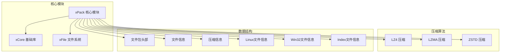
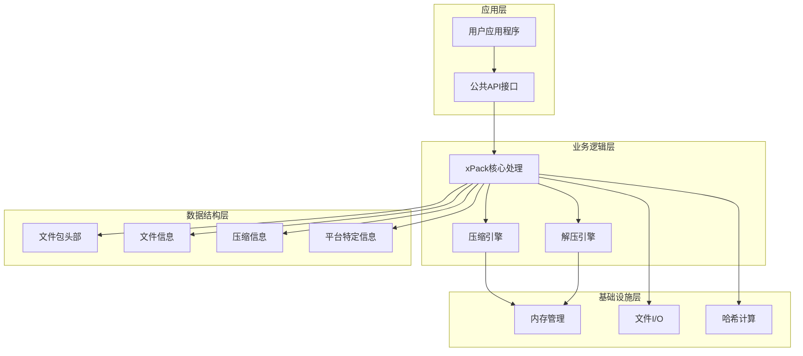
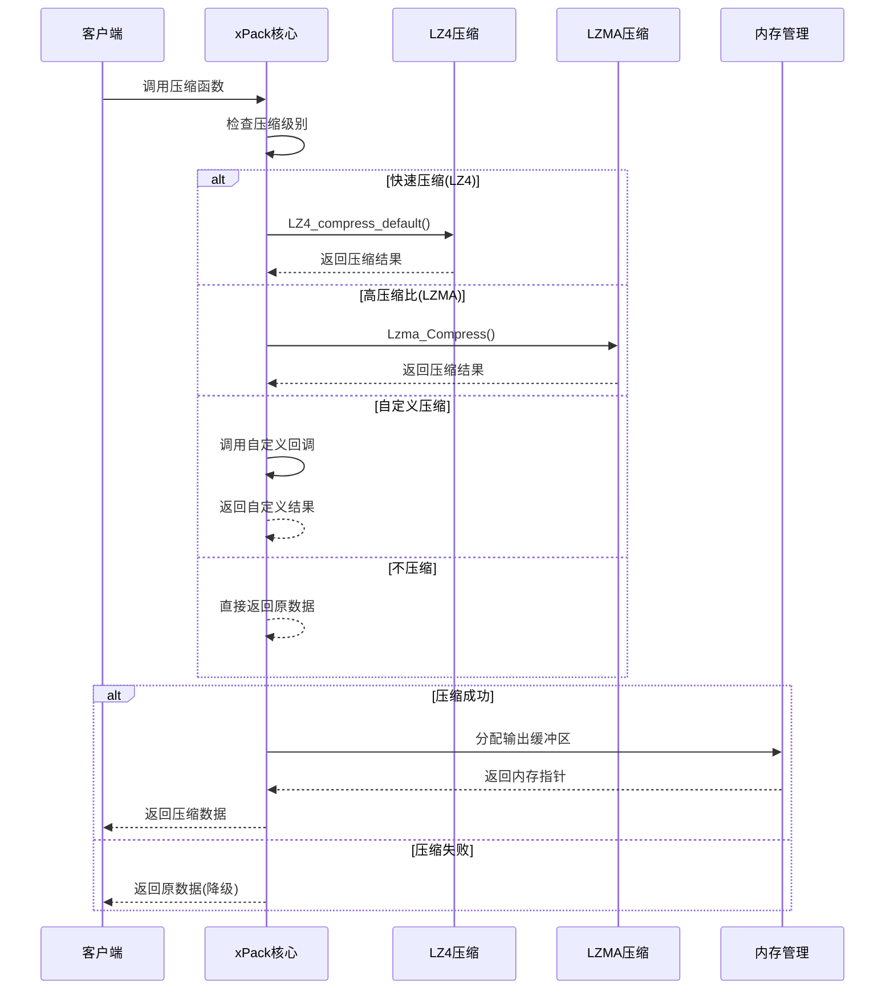
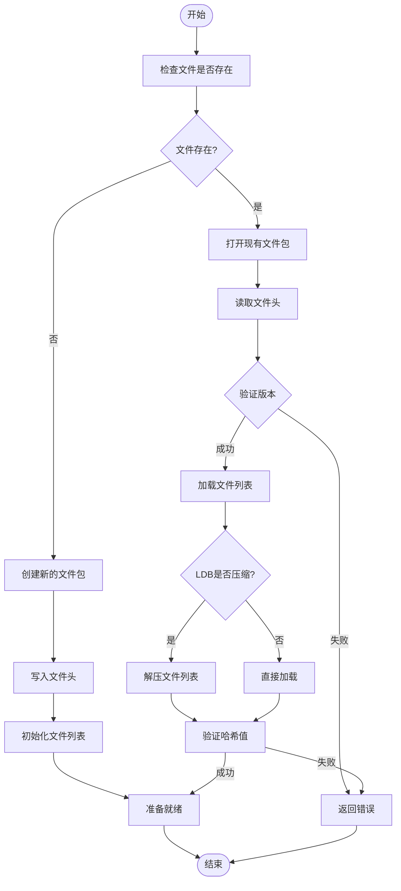
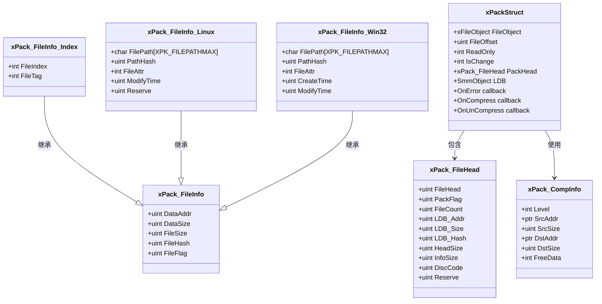
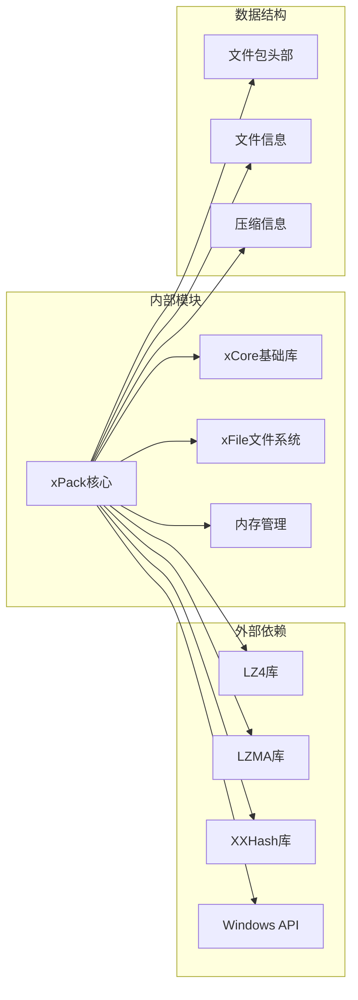
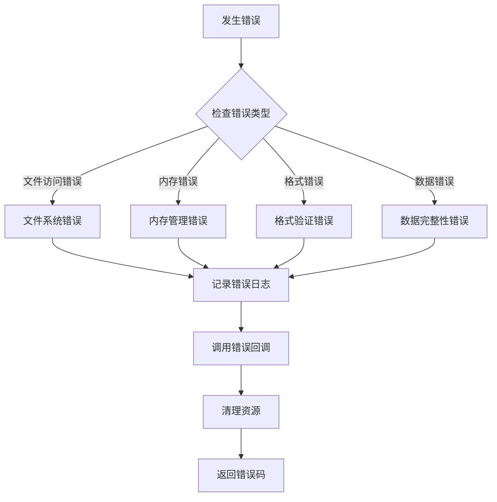

# 数据结构定义

<cite>
**本文档引用的文件**
- [xPack.h](file://ver6/xpack/xPack.h)
- [xPack.c](file://ver6/xpack/xPack.c)
- [xPack.h](file://ver6/xpack/release/inc/xPack.h)
- [xCore.h](file://ver6/xCore/xCore.h)
- [xFile.h](file://ver6/xFile/xFile.h)
</cite>

## 目录
1. [简介](#简介)
2. [项目结构](#项目结构)
3. [核心数据结构](#核心数据结构)
4. [架构概览](#架构概览)
5. [详细组件分析](#详细组件分析)
6. [依赖关系分析](#依赖关系分析)
7. [性能考虑](#性能考虑)
8. [故障排除指南](#故障排除指南)
9. [结论](#结论)

## 简介

xPack是一个高效的文件压缩包系统，提供了多种数据结构来管理和操作压缩包中的文件信息。本文档详细介绍了所有核心数据结构的定义、用途和相互关系，包括文件包头部信息、文件信息结构以及各种平台特定的文件信息变体。

## 项目结构

xPack项目采用模块化设计，主要包含以下核心组件：

**图表来源**
- [xPack.h](file://ver6/xpack/xPack.h#L22-L94)
- [xPack.c](file://ver6/xpack/xPack.c#L99-L109)

**章节来源**
- [xPack.h](file://ver6/xpack/xPack.h#L1-L252)
- [xPack.c](file://ver6/xpack/xPack.c#L1-L970)

## 核心数据结构

### xPack_FileHead - 文件包头部信息

文件包头部是整个压缩包的元数据容器，包含了包的基本信息和文件列表的描述。

| 字段名称 | 数据类型 | 大小(bytes) | 描述 | 取值范围 | 使用场景 |
|---------|---------|------------|------|----------|----------|
| FileHead | uint | 4 | 文件标识头 | 0x106B7078 | 验证文件格式，标识xPack版本 |
| PackFlag | uint | 4 | 文件位标记 | 0x0-0xFFFFFFFF | 存储包类型、压缩状态等标志位 |
| FileCount | uint | 4 | 文件数量 | 0-∞ | 记录包中文件总数 |
| LDB_Addr | uint | 4 | 列表数据偏移 | 0-∞ | 文件列表在文件中的偏移位置 |
| LDB_Size | uint | 4 | 列表数据大小 | 0-∞ | 文件列表压缩后的大小 |
| LDB_Hash | uint | 4 | 列表数据哈希值 | 0-0xFFFFFFFF | 验证文件列表完整性 |
| HeadSize | uint | 4 | 文件头扩展数据大小 | 0-∞ | 包头扩展区域大小 |
| InfoSize | uint | 4 | 文件信息段扩展数据大小 | 0-∞ | 文件信息扩展区域大小 |
| DiscCode | uint | 4 | 识别代码 | 0-0xFFFFFFFF | 用户自定义识别码 |
| Reserve | uint | 4 | 保留数据 | 0-0xFFFFFFFF | 未来功能预留 |

**章节来源**
- [xPack.h](file://ver6/xpack/xPack.h#L22-L34)
- [xPack.c](file://ver6/xpack/xPack.c#L219-L238)

### xPack_FileInfo - 基础文件信息结构

基础文件信息结构是所有文件信息类型的基类，包含了所有文件共有的基本信息。

| 字段名称 | 数据类型 | 大小(bytes) | 描述 | 取值范围 | 使用场景 |
|---------|---------|------------|------|----------|----------|
| DataAddr | uint | 4 | 数据位置 | 0-∞ | 文件数据在包中的偏移地址 |
| DataSize | uint | 4 | 数据大小 | 0-∞ | 压缩后文件数据的大小 |
| FileSize | uint | 4 | 文件大小 | 0-∞ | 解压后文件的实际大小 |
| FileHash | uint | 4 | 文件哈希值 | 0-0xFFFFFFFF | 验证文件完整性的哈希值 |
| FileFlag | uint | 4 | 文件位标记 | 0x0-0xFFFFFFFF | 压缩级别、文件类型等标志信息 |

**章节来源**
- [xPack.h](file://ver6/xpack/xPack.h#L36-L43)

### xPack_FileInfo_Index - 索引文件信息

索引文件信息结构扩展了基础文件信息，增加了索引支持，允许通过自定义索引号访问文件。

| 字段名称 | 数据类型 | 大小(bytes) | 描述 | 取值范围 | 使用场景 |
|---------|---------|------------|------|----------|----------|
| DataAddr | uint | 4 | 数据位置 | 0-∞ | 文件数据在包中的偏移地址 |
| DataSize | uint | 4 | 数据大小 | 0-∞ | 压缩后文件数据的大小 |
| FileSize | uint | 4 | 文件大小 | 0-∞ | 解压后文件的实际大小 |
| FileHash | uint | 4 | 文件哈希值 | 0-0xFFFFFFFF | 验证文件完整性的哈希值 |
| FileFlag | uint | 4 | 文件位标记 | 0x0-0xFFFFFFFF | 压缩级别、文件类型等标志信息 |
| FileIndex | int | 4 | 文件编号 | -2³¹-1 到 2³¹-1 | 自定义文件索引号 |
| FileTag | int | 4 | 文件附加数据 | -2³¹-1 到 2³¹-1 | 用户自定义的附加信息 |

**章节来源**
- [xPack.h](file://ver6/xpack/xPack.h#L45-L54)

### xPack_FileInfo_Linux - Linux文件信息

Linux文件信息结构扩展了基础文件信息，增加了Linux文件系统的特有属性。

| 字段名称 | 数据类型 | 大小(bytes) | 描述 | 取值范围 | 使用场景 |
|---------|---------|------------|------|----------|----------|
| DataAddr | uint | 4 | 数据位置 | 0-∞ | 文件数据在包中的偏移地址 |
| DataSize | uint | 4 | 数据大小 | 0-∞ | 压缩后文件数据的大小 |
| FileSize | uint | 4 | 文件大小 | 0-∞ | 解压后文件的实际大小 |
| FileHash | uint | 4 | 文件哈希值 | 0-0xFFFFFFFF | 验证文件完整性的哈希值 |
| FileFlag | uint | 4 | 文件位标记 | 0x0-0xFFFFFFFF | 压缩级别、文件类型等标志信息 |
| FilePath | char[XPK_FILEPATHMAX] | 160 | 文件路径 | 字符串 | 完整的Linux文件路径 |
| PathHash | uint | 4 | 文件路径哈希值 | 0-0xFFFFFFFF | 快速路径查找的哈希值 |
| FileAttr | int | 4 | 文件属性 | -2³¹-1 到 2³¹-1 | 文件权限、类型等属性 |
| ModifyTime | uint | 4 | 文件修改时间 | 0-∞ | 文件最后修改时间戳 |
| FileTag | int | 4 | 文件附加数据 | -2³¹-1 到 2³¹-1 | 用户自定义的附加信息 |
| Reserve | uint | 4 | 保留数据 | 0-0xFFFFFFFF | 未来功能预留 |

**章节来源**
- [xPack.h](file://ver6/xpack/xPack.h#L56-L69)

### xPack_FileInfo_Win32 - Win32文件信息

Win32文件信息结构扩展了基础文件信息，增加了Windows文件系统的特有属性。

| 字段名称 | 数据类型 | 大小(bytes) | 描述 | 取值范围 | 使用场景 |
|---------|---------|------------|------|----------|----------|
| DataAddr | uint | 4 | 数据位置 | 0-∞ | 文件数据在包中的偏移地址 |
| DataSize | uint | 4 | 数据大小 | 0-∞ | 压缩后文件数据的大小 |
| FileSize | uint | 4 | 文件大小 | 0-∞ | 解压后文件的实际大小 |
| FileHash | uint | 4 | 文件哈希值 | 0-0xFFFFFFFF | 验证文件完整性的哈希值 |
| FileFlag | uint | 4 | 文件位标记 | 0x0-0xFFFFFFFF | 压缩级别、文件类型等标志信息 |
| FilePath | char[XPK_FILEPATHMAX] | 160 | 文件路径 | 字符串 | 完整的Windows文件路径 |
| PathHash | uint | 4 | 文件路径哈希值 | 0-0xFFFFFFFF | 快速路径查找的哈希值 |
| FileAttr | int | 4 | 文件属性 | -2³¹-1 到 2³¹-1 | Windows文件属性 |
| CreateTime | uint | 4 | 文件创建时间 | 0-∞ | 文件创建时间戳 |
| ModifyTime | uint | 4 | 文件修改时间 | 0-∞ | 文件最后修改时间戳 |
| FileTag | int | 4 | 文件附加数据 | -2³¹-1 到 2³¹-1 | 用户自定义的附加信息 |

**章节来源**
- [xPack.h](file://ver6/xpack/xPack.h#L71-L84)

### xPack_CompInfo - 压缩信息结构

压缩信息结构用于描述压缩和解压过程中的数据交换。

| 字段名称 | 数据类型 | 大小(bytes) | 描述 | 取值范围 | 使用场景 |
|---------|---------|------------|------|----------|----------|
| Level | int | 4 | 压缩级别 | -2³¹-1 到 2³¹-1 | 指定压缩算法和级别 |
| SrcAddr | ptr | 4/8 | 数据位置 | 指针地址 | 输入数据的内存地址 |
| SrcSize | uint | 4 | 数据大小 | 0-∞ | 输入数据的大小 |
| DstAddr | ptr | 4/8 | 压缩或解压后的数据 | 指针地址 | 输出数据的内存地址 |
| DstSize | uint | 4 | 压缩或解压后的数据大小 | 0-∞ | 输出数据的大小 |
| FreeData | int | 4 | 原始数据是否可以释放 | 0/1 | 控制内存释放策略 |

**章节来源**
- [xPack.h](file://ver6/xpack/xPack.h#L86-L94)

## 架构概览

xPack系统采用分层架构设计，各层职责明确：

**图表来源**
- [xPack.c](file://ver6/xpack/xPack.c#L55-L159)
- [xPack.h](file://ver6/xpack/xPack.h#L98-L109)

## 详细组件分析

### 压缩流程分析

**图表来源**
- [xPack.c](file://ver6/xpack/xPack.c#L55-L101)

### 文件包打开流程

**图表来源**
- [xPack.c](file://ver6/xpack/xPack.c#L219-L302)

### 结构体关系图

**图表来源**
- [xPack.h](file://ver6/xpack/xPack.h#L22-L109)

**章节来源**
- [xPack.h](file://ver6/xpack/xPack.h#L22-L109)
- [xPack.c](file://ver6/xpack/xPack.c#L55-L159)

## 依赖关系分析

xPack系统具有清晰的模块依赖关系：

**图表来源**
- [xPack.c](file://ver6/xpack/xPack.c#L9-L27)

### 压缩级别定义

系统支持多种压缩级别，每种级别都有其特定的应用场景：

| 压缩级别 | 常量定义 | 算法 | 性能特点 | 适用场景 |
|---------|----------|------|----------|----------|
| 不压缩 | XPK_COMP_NO | 无 | 最快，无CPU开销 | 小文件或已压缩数据 |
| 快速压缩 | XPK_COMP_FAST | LZ4 | 高速压缩，较小压缩比 | 实时应用，对速度要求高 |
| 高压缩比 | XPK_COMP_HIGH | LZMA | 高压缩比，较慢 | 存储空间敏感的应用 |
| 自定义压缩 | XPK_COMP_CUSTOM | 用户定义 | 灵活可配置 | 特殊需求的压缩算法 |

**章节来源**
- [xPack.h](file://ver6/xpack/xPack.h#L15-L18)
- [xPack.c](file://ver6/xpack/xPack.c#L57-L101)

## 性能考虑

### 内存管理策略

xPack采用了智能的内存管理策略来优化性能：

1. **延迟分配**：只有在需要时才分配内存
2. **内存池**：使用内存池减少频繁的内存分配开销
3. **自动释放**：通过FreeData标志控制内存释放时机

### 哈希验证机制

系统通过多层哈希验证确保数据完整性：

1. **文件列表哈希**：验证文件列表的完整性
2. **文件内容哈希**：验证单个文件的完整性
3. **LDB段哈希**：验证整个文件列表段的完整性

### 压缩策略选择

根据文件大小和应用场景选择合适的压缩策略：

- **小文件(<1KB)**：建议不压缩，避免压缩开销
- **中等文件(1KB-10MB)**：建议快速压缩(LZ4)
- **大文件(>10MB)**：建议高压缩比(LZMA)
- **重复数据**：建议使用自定义压缩算法

## 故障排除指南

### 常见错误类型

系统定义了完善的错误处理机制：

| 错误代码 | 错误类型 | 描述 | 可能原因 | 解决方案 |
|---------|----------|------|----------|----------|
| 1 | 文件无法访问 | 文件读写失败 | 权限不足或文件被占用 | 检查文件权限和占用情况 |
| 2 | 文件格式不正确 | 包头验证失败 | 文件损坏或版本不兼容 | 验证文件完整性和版本 |
| 3 | 内存申请失败 | 内存不足 | 系统内存不足 | 释放内存或增加系统内存 |
| 4 | 文件列表读取失败 | LDB段读取错误 | 文件损坏或格式错误 | 检查文件完整性 |
| 5 | 文件列表数据添加失败 | 文件信息写入失败 | 磁盘空间不足 | 清理磁盘空间 |
| 6 | 无效的文件位置 | 文件索引越界 | 索引超出范围 | 检查文件索引值 |
| 7 | 文件hash校验失败 | 数据完整性验证失败 | 文件损坏 | 重新生成或修复文件 |
| 8 | 文件读取失败 | 文件内容读取错误 | 磁盘错误 | 检查磁盘健康状况 |
| 9 | 文件写入失败 | 文件内容写入错误 | 磁盘空间不足或权限问题 | 检查磁盘空间和权限 |
| 10 | 文件读写位置移动失败 | 文件指针定位错误 | 文件损坏 | 重新打开文件包 |
| 11 | 包类型不匹配 | 平台特定功能调用错误 | 调用了不支持的功能 | 检查包类型设置 |
| 12 | 找不到文件 | 文件查找失败 | 文件不存在或路径错误 | 验证文件路径和存在性 |
| 13 | 文件名超长 | 路径长度超过限制 | 超过系统限制 | 缩短文件路径 |

### 错误处理流程

**图表来源**
- [xPack.c](file://ver6/xpack/xPack.c#L36-L52)

**章节来源**
- [xPack.c](file://ver6/xpack/xPack.c#L36-L52)

## 结论

xPack数据结构系统设计精良，具有以下特点：

1. **模块化设计**：清晰的层次结构和职责分离
2. **扩展性强**：支持多种平台和压缩算法
3. **性能优化**：智能的内存管理和哈希验证机制
4. **错误处理完善**：全面的错误类型和处理策略
5. **跨平台兼容**：支持Linux和Windows文件系统特性

这些数据结构为xPack系统的高效运行提供了坚实的基础，使得开发者能够轻松地创建、管理和访问压缩包中的文件数据。