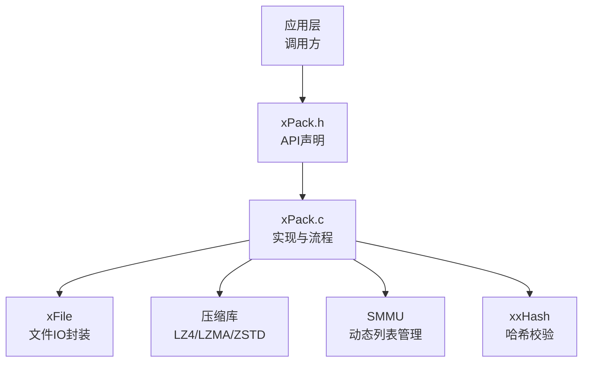
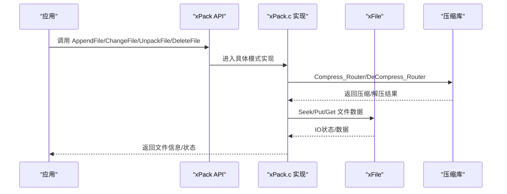
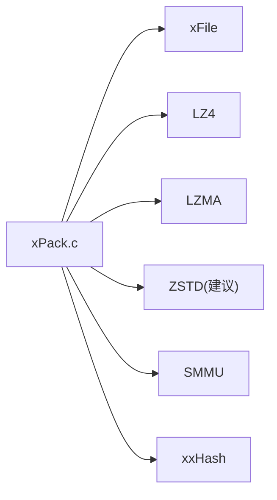

# 文件操作API

<cite>
**本文引用的文件**
- [xPack.h](file://ver6/xpack/xPack.h)
- [xPack.c](file://ver6/xpack/xPack.c)
- [test.c](file://ver6/xpack/test.c)
- [压缩级别参数.txt](file://压缩级别参数.txt)
</cite>

## 目录
1. [简介](#简介)
2. [项目结构](#项目结构)
3. [核心组件](#核心组件)
4. [架构总览](#架构总览)
5. [详细组件分析](#详细组件分析)
6. [依赖关系分析](#依赖关系分析)
7. [性能考量](#性能考量)
8. [故障排查指南](#故障排查指南)
9. [结论](#结论)
10. [附录](#附录)

## 简介
本文件为 xPack 文件操作API的权威参考文档，覆盖以下主题：
- 文件添加与修改：AppendFile/AppendData、ChangeFile/ChangeData
- 文件解包：UnpackFile/UnpackData
- 文件删除：DeleteFile
- 多模式支持：Core模式、Index模式、Linux模式、Win32模式
- 参数说明、返回值语义、使用示例与注意事项
- 错误码与回调机制
- 压缩策略与性能建议

## 项目结构
围绕文件操作API的核心文件与模块如下：
- 头文件与API声明：ver6/xpack/xPack.h
- API实现与流程控制：ver6/xpack/xPack.c
- 使用示例与多模式测试：ver6/xpack/test.c
- 压缩级别参数说明：压缩级别参数.txt

图表来源
- [xPack.h](file://ver6/xpack/xPack.h#L170-L250)
- [xPack.c](file://ver6/xpack/xPack.c#L1-L200)

章节来源
- [xPack.h](file://ver6/xpack/xPack.h#L1-L252)
- [xPack.c](file://ver6/xpack/xPack.c#L1-L200)

## 核心组件
- xPackObject：包对象，包含文件句柄、偏移、只读标志、包头、列表段内存、错误回调与自定义压缩回调。
- 数据结构族：
  - xPack_FileHead：包头
  - xPack_FileInfo：核心模式文件信息
  - xPack_FileInfo_Index：Index模式文件信息
  - xPack_FileInfo_Linux：Linux模式文件信息
  - xPack_FileInfo_Win32：Win32模式文件信息
- 压缩路由：xPack_Compress_Router、xPack_DeCompress_Router
- 基础操作：Open/Save/Close、SetPackType/GetPackType、GetFileInfo/GetFileSize/GetFileDataSize/GetFileHash/GetFileCompLevel

章节来源
- [xPack.h](file://ver6/xpack/xPack.h#L22-L109)
- [xPack.c](file://ver6/xpack/xPack.c#L54-L159)

## 架构总览
xPack 的文件操作遵循“包对象 + 多模式 + 路由压缩”的架构。核心流程：
- 打开包：xPack_Open，读取包头与LDB段，校验哈希
- 文件操作：根据模式选择对应API（Core/Index/Linux/Win32）
- 压缩/解压：通过压缩路由统一调度
- 保存：xPack_Save，更新包头、写回LDB并计算哈希

图表来源
- [xPack.c](file://ver6/xpack/xPack.c#L54-L159)
- [xPack.c](file://ver6/xpack/xPack.c#L451-L515)

章节来源
- [xPack.c](file://ver6/xpack/xPack.c#L218-L302)
- [xPack.c](file://ver6/xpack/xPack.c#L163-L203)

## 详细组件分析

### Core 模式（顺序访问）
- 添加文件：xPack_Core_AppendFile
  - 输入：包对象、源文件路径、压缩级别
  - 行为：读取文件到内存，计算哈希，按压缩级别压缩，追加到数据区，更新LDB项
  - 返回：新增条目的索引位置（从1开始）
  - 注意：仅支持顺序读取，适合通用场景
- 添加数据：xPack_Core_AppendData
  - 输入：内存指针、大小、压缩级别
  - 行为：同上，适用于内存数据
- 修改文件：xPack_Core_ChangeFile
  - 输入：目标索引、源文件路径、压缩级别
  - 行为：替换指定索引的数据，更新LDB项
- 修改数据：xPack_Core_ChangeData
  - 输入：目标索引、内存指针、大小、压缩级别
- 解包文件：xPack_Core_UnpackFile
  - 输入：目标索引、输出文件路径
  - 行为：解压并写出文件；空文件特殊处理
- 解包数据：xPack_Core_UnpackData
  - 输入：目标索引
  - 输出：解压后的数据指针（需调用释放接口）
- 删除文件：xPack_Core_DeleteFile
  - 输入：目标索引
  - 行为：删除LDB中对应项

章节来源
- [xPack.h](file://ver6/xpack/xPack.h#L170-L189)
- [xPack.c](file://ver6/xpack/xPack.c#L496-L515)
- [xPack.c](file://ver6/xpack/xPack.c#L517-L580)
- [xPack.c](file://ver6/xpack/xPack.c#L582-L654)
- [xPack.c](file://ver6/xpack/xPack.c#L656-L664)

### Index 模式（无序索引）
- 设置包类型：xPack_SetPackType（需在添加任何文件前调用）
- 通过索引定位：xPack_IndexToPos
- 添加/修改/解包/删除均以索引为键
- 典型流程：先设置包类型为Index，再使用 Index_* 系列API

章节来源
- [xPack.h](file://ver6/xpack/xPack.h#L191-L213)
- [xPack.c](file://ver6/xpack/xPack.c#L668-L767)

### Linux 模式（类Unix路径）
- 路径查找：xPack_LinuxToPos（大小写敏感）
- 添加/修改/解包/删除：xPack_Linux_AppendFile/ChangeFile/UnpackFile/UnpackData/DeleteFile
- 路径长度限制：XPK_FILEPATHMAX
- 文件信息包含路径、路径哈希、属性、修改时间等

章节来源
- [xPack.h](file://ver6/xpack/xPack.h#L215-L231)
- [xPack.c](file://ver6/xpack/xPack.c#L771-L809)
- [xPack.c](file://ver6/xpack/xPack.c#L812-L853)

### Win32 模式（Windows路径）
- 路径查找：xPack_Win32ToPos（大小写不敏感）
- 添加/修改/解包/删除：xPack_Win32_AppendFile/ChangeFile/UnpackFile/UnpackData/DeleteFile
- 文件信息包含路径、路径哈希、属性、创建/修改时间等

章节来源
- [xPack.h](file://ver6/xpack/xPack.h#L233-L249)
- [xPack.c](file://ver6/xpack/xPack.c#L857-L876)
- [xPack.c](file://ver6/xpack/xPack.c#L878-L944)

### 压缩与解压路由
- 压缩路由：xPack_Compress_Router
  - 支持：无压缩、快速压缩（LZ4）、高压缩（LZMA）、自定义压缩
  - 失败回退：自动降级为无压缩
- 解压路由：xPack_DeCompress_Router
  - 对齐与字符串截断处理，确保可直接访问

章节来源
- [xPack.h](file://ver6/xpack/xPack.h#L113-L117)
- [xPack.c](file://ver6/xpack/xPack.c#L54-L101)
- [xPack.c](file://ver6/xpack/xPack.c#L103-L159)

### 基础查询与元数据
- 查询：xPack_FileCount、xPack_GetFileInfo、xPack_GetFileSize、xPack_GetFileDataSize、xPack_GetFileHash、xPack_GetFileCompLevel
- 包类型与扩展：xPack_SetPackType、xPack_GetPackType、xPack_SetFileInfoExtSize、xPack_GetFileInfoExtSize、xPack_SetPackInfoExtSize、xPack_GetPackInfoExtSize
- 识别码：xPack_SetPackDiscCode、xPack_GetPackDiscCode

章节来源
- [xPack.h](file://ver6/xpack/xPack.h#L125-L168)
- [xPack.c](file://ver6/xpack/xPack.c#L306-L396)

### 使用示例与最佳实践
- Core模式示例：见测试程序中的循环添加与解包
- Index模式示例：设置包类型为Index，使用索引进行增删改查
- Win32模式示例：批量添加Windows路径文件，按路径解包

章节来源
- [test.c](file://ver6/xpack/test.c#L31-L66)
- [test.c](file://ver6/xpack/test.c#L70-L105)
- [test.c](file://ver6/xpack/test.c#L109-L145)
- [test.c](file://ver6/xpack/test.c#L149-L271)

## 依赖关系分析
- 组件耦合
  - xPack.c 依赖 xFile（文件IO）、压缩库（LZ4/LZMA/ZSTD）、SMMU（动态列表）、xxHash（哈希）
  - API声明集中在 xPack.h，实现集中在 xPack.c
- 外部依赖
  - xFile：封装底层文件读写与寻址
  - 压缩库：LZ4（快速）、LZMA（高压缩）、ZSTD（未来版本建议）
  - SMMU：动态数组容器，管理LDB
  - xxHash：32位哈希，用于LDB与文件数据校验

图表来源
- [xPack.c](file://ver6/xpack/xPack.c#L9-L27)

章节来源
- [xPack.c](file://ver6/xpack/xPack.c#L9-L27)

## 性能考量
- 压缩级别与权衡
  - 无压缩：最快解压，体积最大
  - 快速压缩（LZ4）：实时加载友好
  - 高压缩（LZMA）：体积最小，CPU开销高
  - 建议：通用场景优先考虑ZSTD（未来版本），兼顾压缩比与速度
- I/O策略
  - 追加写入：顺序写入数据区，减少随机IO
  - LDB压缩：默认使用高压缩（LZMA），可显著减小索引体积
- 哈希校验
  - LDB与文件数据均进行哈希校验，保障一致性

章节来源
- [压缩级别参数.txt](file://压缩级别参数.txt#L1-L20)
- [xPack.c](file://ver6/xpack/xPack.c#L163-L203)
- [xPack.c](file://ver6/xpack/xPack.c#L268-L298)

## 故障排查指南
- 常见错误码
  - 文件无法访问、格式不正确、内存申请失败、文件列表读取/添加失败、无效文件位置、哈希校验失败、读取/写入失败、寻址失败、包类型不匹配、找不到文件、文件名超长
- 错误回调
  - 通过 xPackObject.OnError 注册回调，接收错误码与文本
- 排查步骤
  - 确认包类型设置时机（添加任何文件前）
  - 检查路径长度与大小写敏感性（Linux vs Win32）
  - 核对压缩级别与算法可用性
  - 校验LDB哈希与文件数据哈希

章节来源
- [xPack.c](file://ver6/xpack/xPack.c#L36-L51)
- [xPack.c](file://ver6/xpack/xPack.c#L313-L336)
- [xPack.c](file://ver6/xpack/xPack.c#L771-L787)
- [xPack.c](file://ver6/xpack/xPack.c#L857-L876)

## 结论
xPack 提供了统一且可扩展的文件包管理API，支持多种访问模式与压缩策略。通过合理的包类型选择与压缩配置，可在性能与体积之间取得平衡。建议在新项目中优先采用ZSTD压缩方案，并在需要跨平台兼容时选择Win32或Linux模式。

## 附录

### API一览与参数说明
- Core 模式
  - AppendFile(xpk, sFile, iCompLevel) -> uint：添加文件，返回索引位置
  - AppendData(xpk, pIn, iSize, iCompLevel) -> uint：添加内存数据，返回索引位置
  - ChangeFile(xpk, iPos, sFile, iCompLevel) -> FileInfo*：修改指定索引文件
  - ChangeData(xpk, iPos, pIn, iSize, iCompLevel) -> FileInfo*：修改指定索引数据
  - UnpackFile(xpk, iPos, sFile) -> FileInfo*：解包到文件
  - UnpackData(xpk, iPos, ppData) -> FileInfo*：解包到内存（需释放）
  - DeleteFile(xpk, iPos) -> int：删除指定索引文件
- Index 模式
  - SetPackType(xpk, XPK_CLASS_Index)：设置包类型为Index
  - IndexToPos(xpk, iIndex) -> uint：根据索引获取位置
  - Index_AppendFile/AppendData/ChangeFile/ChangeData/UnpackFile/UnpackData/DeleteFile：基于索引的操作
- Linux 模式
  - LinuxToPos(xpk, sPath) -> uint：根据路径获取位置（大小写敏感）
  - Linux_AppendFile/ChangeFile/UnpackFile/UnpackData/DeleteFile：基于路径的操作
- Win32 模式
  - Win32ToPos(xpk, sPath) -> uint：根据路径获取位置（大小写不敏感）
  - Win32_AppendFile/ChangeFile/UnpackFile/UnpackData/DeleteFile：基于路径的操作

章节来源
- [xPack.h](file://ver6/xpack/xPack.h#L170-L249)
- [xPack.c](file://ver6/xpack/xPack.c#L668-L944)

### 返回值与释放约定
- 解包数据返回的内存需使用分配器提供的释放接口释放
- 成功返回非零/非空指针，失败返回0或空指针，并触发错误回调

章节来源
- [xPack.c](file://ver6/xpack/xPack.c#L582-L627)