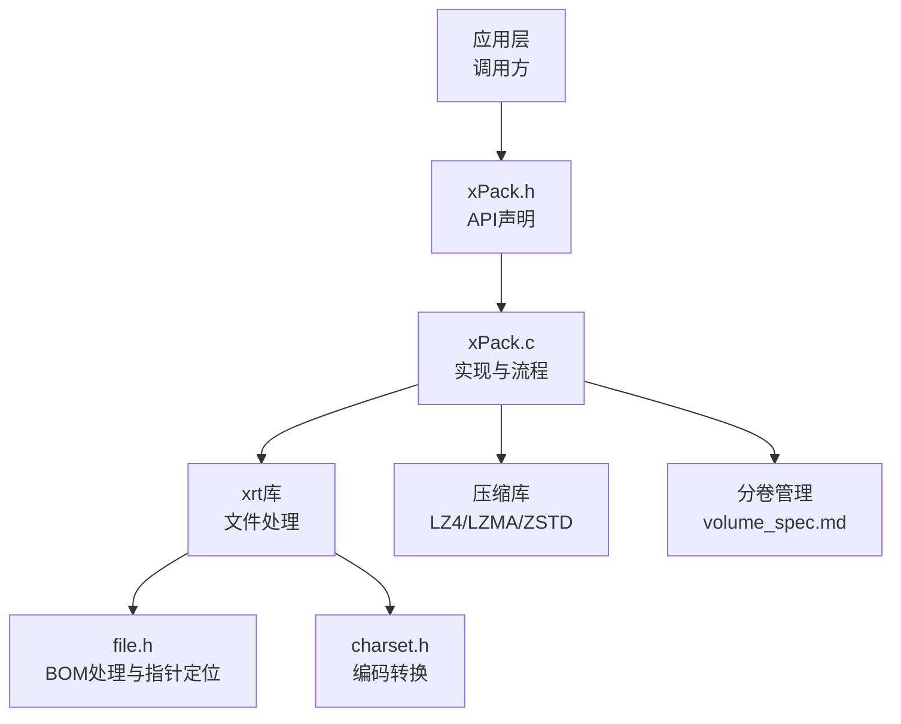
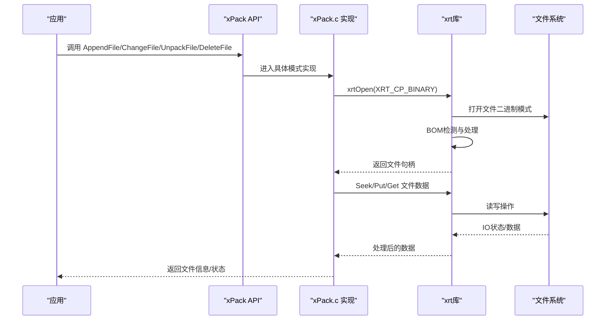
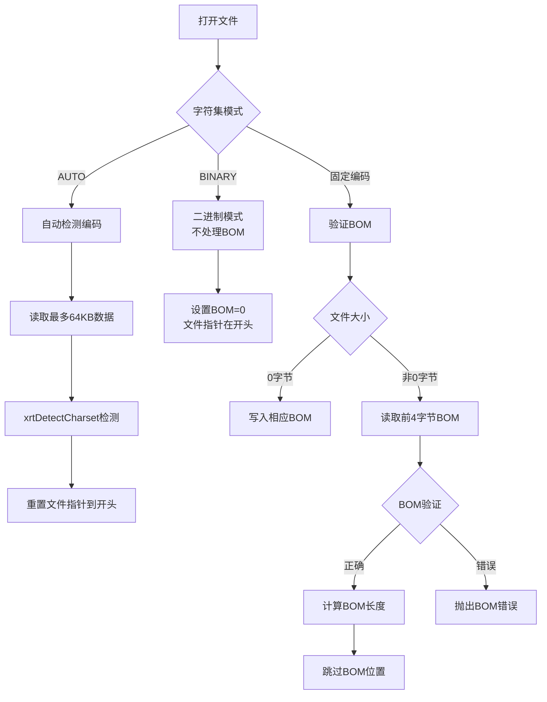
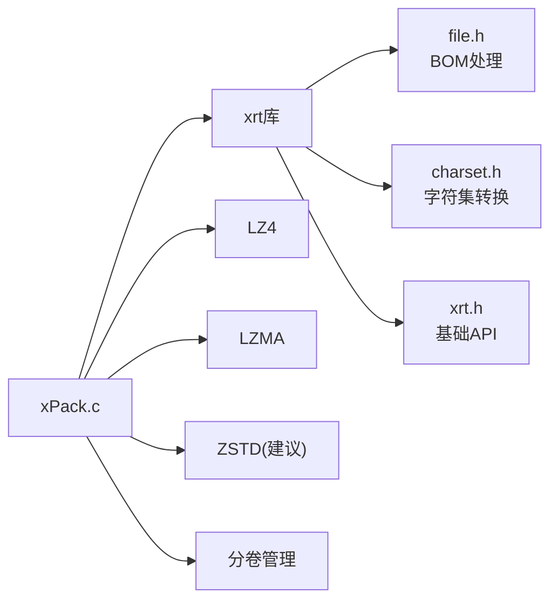

# 文件操作API

<cite>
**本文引用的文件**
- [xPack.h](file://src/xpack.h)
- [xPack.c](file://src/xpack.c)
- [xpack_core.c](file://src/xpack_core.c)
- [file.h](file://lib/xrt/lib/file.h)
- [xrt.h](file://lib/xrt/xrt.h)
- [charset.h](file://lib/xrt/lib/charset.h)
- [volume_spec.md](file://docs/volume_spec.md)
- [test_xpk_debug.c](file://tools/xpkcon/test/test_xpk_debug.c)
</cite>

## 更新摘要
**变更内容**
- 新增BOM（字节顺序标记）处理一致性修复的详细说明
- 更新二进制模式操作中的文件指针定位改进
- 增强xrt库文件处理模块的技术细节
- 完善xPack与xrt库集成的文件操作流程

## 目录
1. [简介](#简介)
2. [项目结构](#项目结构)
3. [核心组件](#核心组件)
4. [架构总览](#架构总览)
5. [详细组件分析](#详细组件分析)
6. [BOM处理与文件指针定位改进](#bom处理与文件指针定位改进)
7. [依赖关系分析](#依赖关系分析)
8. [性能考量](#性能考量)
9. [故障排查指南](#故障排查指南)
10. [结论](#结论)
11. [附录](#附录)

## 简介
本文件为 xPack 文件操作API的权威参考文档，覆盖以下主题：
- 文件添加与修改：AppendFile/AppendData、ChangeFile/ChangeData
- 文件解包：UnpackFile/UnpackData
- 文件删除：DeleteFile
- 多模式支持：Core模式、Index模式、Linux模式、Win32模式
- **新增**：BOM（字节顺序标记）处理一致性修复
- **新增**：二进制模式操作中的文件指针定位改进
- 参数说明、返回值语义、使用示例与注意事项
- 错误码与回调机制
- 压缩策略与性能建议

## 项目结构
围绕文件操作API的核心文件与模块如下：
- 头文件与API声明：src/xpack.h
- API实现与流程控制：src/xpack.c、src/xpack_core.c
- xrt库文件处理：lib/xrt/lib/file.h、lib/xrt/xrt.h
- 字符编码处理：lib/xrt/lib/charset.h
- 分卷操作文档：docs/volume_spec.md
- 使用示例与测试：tools/xpkcon/test/test_xpk_debug.c



**图表来源**
- [xPack.h](file://src/xpack.h#L1-L200)
- [xPack.c](file://src/xpack.c#L1-L200)
- [file.h](file://lib/xrt/lib/file.h#L1-L278)

**章节来源**
- [xPack.h](file://src/xpack.h#L1-L200)
- [xPack.c](file://src/xpack.c#L1-L200)
- [file.h](file://lib/xrt/lib/file.h#L1-L278)

## 核心组件
- xPackObject：包对象，包含文件句柄、偏移、只读标志、包头、列表段内存、错误回调与自定义压缩回调。
- **新增**：xfile结构体，封装文件句柄、字符集、BOM大小和只读标志。
- 数据结构族：
  - xPack_FileHead：包头
  - xPack_FileInfo：核心模式文件信息
  - xPack_FileInfo_Index：Index模式文件信息
  - xPack_FileInfo_Linux：Linux模式文件信息
  - xPack_FileInfo_Win32：Win32模式文件信息
- 压缩路由：xPack_Compress_Router、xPack_DeCompress_Router
- **新增**：BOM处理常量：XRT_CP_BOM、XRT_MASK_BOM
- 基础操作：Open/Save/Close、SetPackType/GetPackType、GetFileInfo/GetFileSize/GetFileDataSize/GetFileHash/GetFileCompLevel

**章节来源**
- [xPack.h](file://src/xpack.h#L100-L175)
- [xrt.h](file://lib/xrt/xrt.h#L650-L661)
- [file.h](file://lib/xrt/lib/file.h#L12-L14)

## 架构总览
xPack 的文件操作遵循"包对象 + 多模式 + 路由压缩 + BOM处理"的架构。核心流程：
- 打开包：xPack_Open，使用XRT_CP_BINARY模式打开文件，确保二进制一致性
- 文件操作：根据模式选择对应API（Core/Index/Linux/Win32）
- **新增**：BOM处理：通过xrt库的file.h实现完整的BOM检测、验证和跳过机制
- 压缩/解压：通过压缩路由统一调度
- 保存：xPack_Save，更新包头、写回LDB并计算哈希



**图表来源**
- [xPack.c](file://src/xpack.c#L78-L84)
- [file.h](file://lib/xrt/lib/file.h#L17-L278)

**章节来源**
- [xPack.c](file://src/xpack.c#L49-L197)
- [xpack_core.c](file://src/xpack_core.c#L18-L37)

## 详细组件分析

### Core 模式（顺序访问）
- 添加文件：xPack_Core_AppendFile
  - 输入：包对象、源文件路径、压缩级别
  - 行为：读取文件到内存，计算哈希，按压缩级别压缩，追加到数据区，更新LDB项
  - 返回：新增条目的索引位置（从1开始）
  - 注意：仅支持顺序读取，适合通用场景
- 添加数据：xPack_Core_AppendData
  - 输入：内存指针、大小、压缩级别
  - 行为：同上，适用于内存数据
- 修改文件：xPack_Core_ChangeFile
  - 输入：目标索引、源文件路径、压缩级别
  - 行为：替换指定索引的数据，更新LDB项
- 修改数据：xPack_Core_ChangeData
  - 输入：目标索引、内存指针、大小、压缩级别
- 解包文件：xPack_Core_UnpackFile
  - 输入：目标索引、输出文件路径
  - 行为：解压并写出文件；空文件特殊处理
- 解包数据：xPack_Core_UnpackData
  - 输入：目标索引
  - 输出：解压后的数据指针（需调用释放接口）
- 删除文件：xPack_Core_DeleteFile
  - 输入：目标索引
  - 行为：删除LDB中对应项

**章节来源**
- [xpack_core.c](file://src/xpack_core.c#L18-L117)
- [xpack_core.c](file://src/xpack_core.c#L123-L185)

### Index 模式（无序索引）
- 设置包类型：xPack_SetPackType（需在添加任何文件前调用）
- 通过索引定位：xPack_IndexToPos
- 添加/修改/解包/删除均以索引为键
- 典型流程：先设置包类型为Index，再使用 Index_* 系列API

**章节来源**
- [xPack.h](file://src/xpack.h#L170-L189)

### Linux 模式（类Unix路径）
- 路径查找：xPack_LinuxToPos（大小写敏感）
- 添加/修改/解包/删除：xPack_Linux_AppendFile/ChangeFile/UnpackFile/UnpackData/DeleteFile
- 路径长度限制：XPK_FILEPATHMAX
- 文件信息包含路径、路径哈希、属性、修改时间等

**章节来源**
- [xPack.h](file://src/xpack.h#L191-L213)

### Win32 模式（Windows路径）
- 路径查找：xPack_Win32ToPos（大小写不敏感）
- 添加/修改/解包/删除：xPack_Win32_AppendFile/ChangeFile/UnpackFile/UnpackData/DeleteFile
- 文件信息包含路径、路径哈希、属性、创建/修改时间等

**章节来源**
- [xPack.h](file://src/xpack.h#L215-L231)

### 压缩与解压路由
- 压缩路由：xPack_Compress_Router
  - 支持：无压缩、快速压缩（LZ4）、高压缩（LZMA）、自定义压缩
  - 失败回退：自动降级为无压缩
- 解压路由：xPack_DeCompress_Router
  - 对齐与字符串截断处理，确保可直接访问

**章节来源**
- [xPack.h](file://src/xpack.h#L44-L51)

### 基础查询与元数据
- 查询：xPack_FileCount、xPack_GetFileInfo、xPack_GetFileSize、xPack_GetFileDataSize、xPack_GetFileHash、xPack_GetFileCompLevel
- 包类型与扩展：xPack_SetPackType、xPack_GetPackType、xPack_SetFileInfoExtSize、xPack_GetFileInfoExtSize、xPack_SetPackInfoExtSize、xPack_GetPackInfoExtSize
- 识别码：xPack_SetPackDiscCode、xPack_GetPackDiscCode

**章节来源**
- [xPack.h](file://src/xpack.h#L125-L168)

## BOM处理与文件指针定位改进

### BOM处理一致性修复

xrt库实现了完整的BOM（字节顺序标记）处理机制，确保跨平台文件操作的一致性：

#### Windows平台BOM处理


**图表来源**
- [file.h](file://lib/xrt/lib/file.h#L41-L147)

#### Linux/Unix平台BOM处理
- 使用`lseek()`系统调用进行文件指针定位
- 保持与Windows平台相同的BOM处理逻辑
- 统一的文件指针重置机制

### 二进制模式操作中的文件指针定位改进

**更新**：在二进制模式下，xrt库确保文件指针始终位于文件开头，避免BOM处理导致的指针位置问题：

- **二进制模式特性**：
  - `iCharset = XRT_CP_BINARY`时，`objFile->BOM = 0`
  - 文件指针强制重置到`FILE_BEGIN`或`SEEK_SET`位置
  - 不进行任何BOM检测或跳过操作

- **文件指针定位改进**：
  - 打开文件时：`SetFilePointer(hFile, 0, NULL, FILE_BEGIN)` 或 `lseek(fd, 0, SEEK_SET)`
  - BOM模式下：`SetFilePointer(hFile, objFile->BOM, NULL, FILE_BEGIN)` 或 `lseek(fd, objFile->BOM, SEEK_SET)`
  - 二进制模式下：始终在文件开头进行读写操作

### xPack与xrt库的集成

**更新**：xPack在打开文件时使用XRT_CP_BINARY模式，确保文件操作的二进制一致性：

```c
// xPack打开文件时使用二进制模式
xpk->file = xrtOpen((str)path, readonly, XRT_CP_BINARY);

// 在文件操作中使用二进制模式
xrtSeek(xpk->file, dataOffset, XRT_SEEK_SET);
xrtGet(xpk->file, size, &actualRead);
```

这种设计确保：
- 所有文件数据以二进制形式存储和传输
- 避免字符编码转换带来的数据损坏
- 统一的文件指针定位行为
- 与分卷管理系统的兼容性

**章节来源**
- [file.h](file://lib/xrt/lib/file.h#L63-L67)
- [file.h](file://lib/xrt/lib/file.h#L145-L147)
- [xPack.c](file://src/xpack.c#L78-L84)

## 依赖关系分析
- 组件耦合
  - xPack.c 依赖 xrt库（文件IO、BOM处理、字符集转换）、压缩库（LZ4/LZMA/ZSTD）、分卷管理
  - API声明集中在 xPack.h，实现集中在 xPack.c 和 xpack_core.c
- **新增**：xrt库依赖
  - file.h：封装底层文件读写、BOM处理与指针定位
  - charset.h：字符集检测与转换
  - xrt.h：全局数据结构和基础API
- 外部依赖
  - xrt库：提供跨平台文件操作和BOM处理
  - 压缩库：LZ4（快速）、LZMA（高压缩）、ZSTD（未来版本建议）
  - 分卷管理：支持多卷文件包的读写



**图表来源**
- [xPack.c](file://src/xpack.c#L1-L200)
- [file.h](file://lib/xrt/lib/file.h#L1-L278)

**章节来源**
- [xPack.c](file://src/xpack.c#L1-L200)
- [xrt.h](file://lib/xrt/xrt.h#L1-L200)

## 性能考量
- 压缩级别与权衡
  - 无压缩：最快解压，体积最大
  - 快速压缩（LZ4）：实时加载友好
  - 高压缩（LZMA）：体积最小，CPU开销高
  - 建议：通用场景优先考虑ZSTD（未来版本），兼顾压缩比与速度
- **新增**：BOM处理性能影响
  - AUTO模式：最多读取64KB数据进行编码检测，数据越大检测越准确
  - BINARY模式：无BOM处理开销，性能最优
  - 固定编码模式：BOM验证和跳过操作，开销很小
- I/O策略
  - 追加写入：顺序写入数据区，减少随机IO
  - LDB压缩：默认使用高压缩（LZMA），可显著减小索引体积
- 哈希校验
  - LDB与文件数据均进行哈希校验，保障一致性

**章节来源**
- [xPack.c](file://src/xpack.c#L163-L203)
- [file.h](file://lib/xrt/lib/file.h#L47-L59)

## 故障排查指南
- 常见错误码
  - 文件无法访问、格式不正确、内存申请失败、文件列表读取/添加失败、无效文件位置、哈希校验失败、读取/写入失败、寻址失败、包类型不匹配、找不到文件、文件名超长
  - **新增**：BOM错误（sErrorFile_BOM）、文件句柄错误（sErrorFile_Handle）
- 错误回调
  - 通过 xPackObject.OnError 注册回调，接收错误码与文本
- **新增**：BOM相关故障排查
  - 检查文件是否包含有效的BOM标记
  - 确认字符集模式与文件实际编码一致
  - 验证二进制模式下文件指针是否正确重置
- 排查步骤
  - 确认包类型设置时机（添加任何文件前）
  - 检查路径长度与大小写敏感性（Linux vs Win32）
  - 核对压缩级别与算法可用性
  - 校验LDB哈希与文件数据哈希
  - **新增**：验证BOM处理是否正确执行

**章节来源**
- [xPack.c](file://src/xpack.c#L27-L43)
- [file.h](file://lib/xrt/lib/file.h#L5-L12)

## 结论
xPack 提供了统一且可扩展的文件包管理API，支持多种访问模式与压缩策略。通过xrt库的BOM处理一致性修复和二进制模式下的文件指针定位改进，确保了跨平台文件操作的可靠性和性能。新的BOM处理机制提供了自动检测、手动验证和二进制模式支持，满足了各种应用场景的需求。建议在新项目中优先采用ZSTD压缩方案，并在需要跨平台兼容时选择合适的字符集模式。

## 附录

### API一览与参数说明
- Core 模式
  - AppendFile(xpk, sFile, iCompLevel) -> uint：添加文件，返回索引位置
  - AppendData(xpk, pIn, iSize, iCompLevel) -> uint：添加内存数据，返回索引位置
  - ChangeFile(xpk, iPos, sFile, iCompLevel) -> FileInfo*：修改指定索引文件
  - ChangeData(xpk, iPos, pIn, iSize, iCompLevel) -> FileInfo*：修改指定索引数据
  - UnpackFile(xpk, iPos, sFile) -> FileInfo*：解包到文件
  - UnpackData(xpk, iPos, ppData) -> FileInfo*：解包到内存（需释放）
  - DeleteFile(xpk, iPos) -> int：删除指定索引文件
- Index 模式
  - SetPackType(xpk, XPK_CLASS_Index)：设置包类型为Index
  - IndexToPos(xpk, iIndex) -> uint：根据索引获取位置
  - Index_AppendFile/AppendData/ChangeFile/ChangeData/UnpackFile/UnpackData/DeleteFile：基于索引的操作
- Linux 模式
  - LinuxToPos(xpk, sPath) -> uint：根据路径获取位置（大小写敏感）
  - Linux_AppendFile/ChangeFile/UnpackFile/UnpackData/DeleteFile：基于路径的操作
- Win32 模式
  - Win32ToPos(xpk, sPath) -> uint：根据路径获取位置（大小写不敏感）
  - Win32_AppendFile/ChangeFile/UnpackFile/UnpackData/DeleteFile：基于路径的操作

**章节来源**
- [xPack.h](file://src/xpack.h#L170-L231)

### 返回值与释放约定
- 解包数据返回的内存需使用分配器提供的释放接口释放
- 成功返回非零/非空指针，失败返回0或空指针，并触发错误回调

**章节来源**
- [xpack_core.c](file://src/xpack_core.c#L123-L134)

### BOM处理常量与模式
- 字符集常量：XRT_CP_AUTO、XRT_CP_BINARY、XRT_CP_UTF8、XRT_CP_UTF16、XRT_CP_UTF16_BE、XRT_CP_UTF32、XRT_CP_UTF32_BE
- BOM相关常量：XRT_CP_BOM（带BOM标记）、XRT_MASK_BOM（BOM掩码）
- 模式切换：根据字符集模式自动选择BOM处理策略

**章节来源**
- [xrt.h](file://lib/xrt/xrt.h#L241-L252)