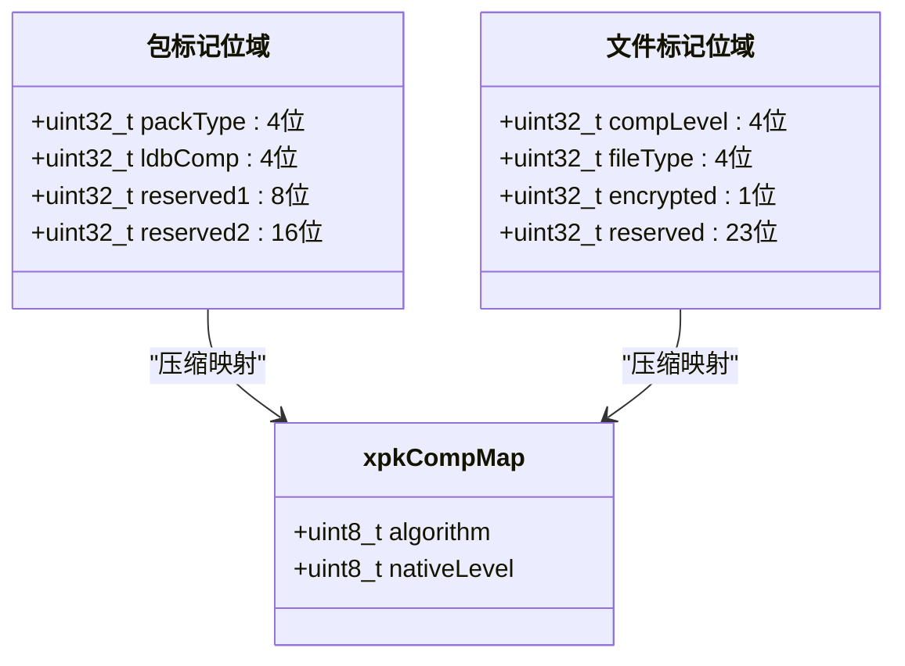
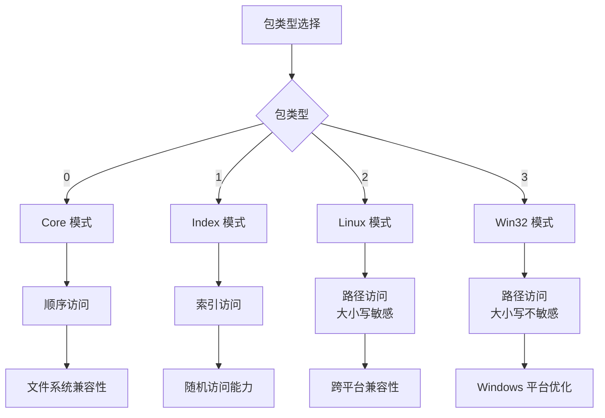
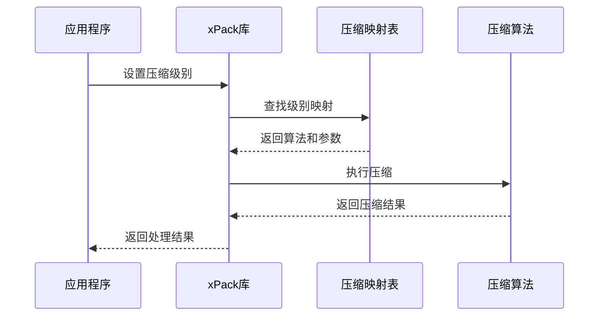
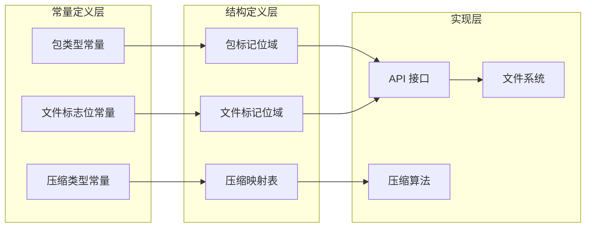

# 枚举常量

<cite>
**本文档中引用的文件**
- [xPack.h (ver6)](file://ver6/xpack/xPack.h)
- [xPack.h (ver7)](file://ver7/xpack/xpack.h)
- [xPack.h (ver6 发布版)](file://ver6/xpack/release/inc/xPack.h)
- [压缩级别参数.txt](file://压缩级别参数.txt)
</cite>

## 目录
1. [简介](#简介)
2. [项目结构](#项目结构)
3. [核心组件](#核心组件)
4. [架构概览](#架构概览)
5. [详细组件分析](#详细组件分析)
6. [依赖关系分析](#依赖关系分析)
7. [性能考虑](#性能考虑)
8. [故障排除指南](#故障排除指南)
9. [结论](#结论)

## 简介

本文档为 xPack 枚举常量提供了全面的参考文档。xPack 是一个高性能的文件压缩包库，支持多种包类型和压缩算法。本文档详细记录了所有重要的枚举和常量定义，包括文件包类型常量、压缩类型常量以及文件标志位常量等。

xPack 支持四种包类型：Core、Index、Linux 和 Win32，每种类型都有其特定的使用场景和优势。同时，xPack 提供了灵活的压缩级别系统，支持从无压缩到极高压缩比的各种配置。

## 项目结构

xPack 项目采用多版本架构，主要包含以下关键文件：

```mermaid
graph TB
subgraph "xPack 项目结构"
A[xPack.h (ver6)] --> B[核心常量定义]
C[xPack.h (ver7)] --> D[增强功能]
E[xPack.h (ver6 发布版)] --> F[简化版本]
G[压缩级别参数.txt] --> H[性能参数]
B --> I[包类型常量]
B --> J[压缩类型常量]
B --> K[文件标志位常量]
D --> L[位域结构]
D --> M[压缩映射表]
D --> N[API 接口]
H --> O[算法选择]
H --> P[性能优化]
end
```

**图表来源**
- [xPack.h (ver6)](file://ver6/xpack/xPack.h#L1-L252)
- [xPack.h (ver7)](file://ver7/xpack/xpack.h#L1-L372)

**章节来源**
- [xPack.h (ver6)](file://ver6/xpack/xPack.h#L1-L252)
- [xPack.h (ver7)](file://ver7/xpack/xpack.h#L1-L372)

## 核心组件

### 包类型常量

xPack 定义了四种不同的包类型，每种类型都有其特定的功能和使用场景：

| 常量名 | 值 | 描述 | 使用场景 |
|--------|----|------|----------|
| XPK_CLASS_Core | 0x0 | 核心压缩包，仅支持使用顺序读取数据 | 通用场景，兼容性最佳 |
| XPK_CLASS_Index | 0x1 | Index访问包，可以通过索引访问数据 | 需要随机访问的场景 |
| XPK_CLASS_Linux | 0x2 | Linux文件系统兼容包，保存Linux文件数据 | 跨平台兼容性 |
| XPK_CLASS_Win32 | 0x3 | Win32文件系统兼容包，保存Windows文件数据 | Windows平台 |

**章节来源**
- [xPack.h (ver6)](file://ver6/xpack/xPack.h#L9-L13)
- [xPack.h (ver6 发布版)](file://ver6/xpack/release/inc/xPack.h#L19-L23)

### 压缩类型常量

xPack 提供了多种压缩选项，适用于不同的性能需求：

| 常量名 | 值 | 描述 | 算法类型 | 性能特点 |
|--------|----|------|----------|----------|
| XPK_COMP_NO | 0x0 | 不压缩 | 无压缩 | 最快解压速度 |
| XPK_COMP_FAST | 0x1 | 快速压缩（LZ4） | LZ4 | 极速解压 |
| XPK_COMP_HIGH | 0x2 | 高压缩比（LZMA） | LZMA | 最高压缩比 |
| XPK_COMP_CUSTOM | 0x3 | 自定义压缩 | 用户定义 | 灵活配置 |

**章节来源**
- [xPack.h (ver6)](file://ver6/xpack/xPack.h#L14-L18)
- [xPack.h (ver6 发布版)](file://ver6/xpack/release/inc/xPack.h#L24-L28)

### 压缩级别常量（Ver7）

在 xPack Ver7 中，引入了更精细的压缩级别系统：

| 级别 | 算法 | 原生参数 | 压缩比 | 压缩速度 | 解压速度 | 适用场景 |
|------|------|----------|--------|----------|----------|----------|
| 0 | 无压缩 | - | 1.00 | ∞ | ∞ | 已压缩数据 |
| 1 | LZ4 | default | ~2.10 | 780 MB/s | 4500 MB/s | 实时加载 |
| 2 | LZ4-HC | level 4 | ~2.45 | 120 MB/s | 4500 MB/s | 极速解压 |
| 3 | LZ4-HC | level 9 | ~2.72 | 40 MB/s | 4500 MB/s | LZ4 极限 |
| 4-15 | ZSTD | 1-22 | ~2.88-~3.52 | 500-2 MB/s | 1400-950 MB/s | 通用到极高压缩 |

**章节来源**
- [压缩级别参数.txt](file://压缩级别参数.txt#L1-L71)
- [xPack.h (ver7)](file://ver7/xpack/xpack.h#L226-L243)

## 架构概览

xPack 的常量系统采用位域结构进行高效存储，确保内存使用效率和性能表现：



**图表来源**
- [xPack.h (ver7)](file://ver7/xpack/xpack.h#L84-L92)
- [xPack.h (ver7)](file://ver7/xpack/xpack.h#L129-L137)
- [xPack.h (ver7)](file://ver7/xpack/xpack.h#L218-L221)

## 详细组件分析

### 包类型位域结构

xPack 使用位域结构来存储包类型信息，确保高效的内存使用：



**图表来源**
- [xPack.h (ver7)](file://ver7/xpack/xpack.h#L31-L34)
- [xPack.h (ver7)](file://ver7/xpack/xpack.h#L87-L91)

### 压缩级别映射机制

xPack Ver7 引入了智能的压缩级别映射系统：



**图表来源**
- [xPack.h (ver7)](file://ver7/xpack/xpack.h#L226-L243)
- [压缩级别参数.txt](file://压缩级别参数.txt#L47-L67)

**章节来源**
- [xPack.h (ver7)](file://ver7/xpack/xpack.h#L226-L243)
- [压缩级别参数.txt](file://压缩级别参数.txt#L47-L67)

### 文件标志位常量

文件标志位系统提供了灵活的文件属性管理：

| 位域 | 名称 | 大小 | 范围 | 描述 |
|------|------|------|------|------|
| [0-3] | compLevel | 4位 | 0-15 | 压缩级别 |
| [4-7] | fileType | 4位 | 0-15 | 文件类型标识 |
| [8] | encrypted | 1位 | 0-1 | 加密标记 |
| [9-31] | reserved | 23位 | - | 保留位 |

**章节来源**
- [xPack.h (ver7)](file://ver7/xpack/xpack.h#L129-L137)

## 依赖关系分析

xPack 的常量系统具有清晰的依赖关系：



**图表来源**
- [xPack.h (ver7)](file://ver7/xpack/xpack.h#L84-L92)
- [xPack.h (ver7)](file://ver7/xpack/xpack.h#L129-L137)
- [xPack.h (ver7)](file://ver7/xpack/xpack.h#L218-L243)

**章节来源**
- [xPack.h (ver7)](file://ver7/xpack/xpack.h#L84-L92)
- [xPack.h (ver7)](file://ver7/xpack/xpack.h#L129-L137)
- [xPack.h (ver7)](file://ver7/xpack/xpack.h#L218-L243)

## 性能考虑

### 压缩级别选择指南

根据压缩级别参数文档，推荐的使用场景如下：

- **游戏资源实时加载**: 级别 1-3 (LZ4 极速解压)
- **一般应用资源包**: 级别 6 (默认平衡)
- **软件分发包**: 级别 8-10 (较高压缩比)
- **数据归档存储**: 级别 12-15 (追求压缩比)
- **已压缩文件(jpg/mp3)**: 级别 0 (避免重复压缩)

### 内存使用优化

xPack 通过位域结构实现了高效的内存使用：
- 包标记位域占用 32 位，其中 8 位用于包类型和 LDB 压缩级别
- 文件标记位域占用 32 位，其中 8 位用于压缩级别和文件类型
- 路径最大长度限制为 200 字节，平衡内存使用和功能需求

**章节来源**
- [压缩级别参数.txt](file://压缩级别参数.txt#L32-L37)
- [xPack.h (ver7)](file://ver7/xpack/xpack.h#L58-L59)

## 故障排除指南

### 常见问题及解决方案

1. **包类型冲突**
   - 症状：设置包类型时报错
   - 解决方案：确保在添加任何文件之前设置包类型

2. **压缩级别无效**
   - 症状：压缩级别超出 0-15 范围
   - 解决方案：使用有效的压缩级别或使用默认级别

3. **文件路径过长**
   - 症状：路径超过 200 字节导致错误
   - 解决方案：缩短文件路径或使用索引模式

**章节来源**
- [xPack.h (ver7)](file://ver7/xpack/xpack.h#L58-L59)

## 结论

xPack 的枚举常量系统设计精良，提供了高度的灵活性和性能优化。通过合理的位域结构设计和智能的压缩级别映射，xPack 能够满足从实时应用到大数据存储的各种使用场景。

关键优势包括：
- **高效内存使用**：通过位域结构减少内存占用
- **灵活的压缩策略**：支持从无压缩到极高压缩比的完整范围
- **跨平台兼容性**：针对不同操作系统提供优化的文件系统支持
- **易于使用**：清晰的常量命名和直观的使用场景

建议开发者根据具体的应用场景选择合适的包类型和压缩级别，以获得最佳的性能和用户体验。