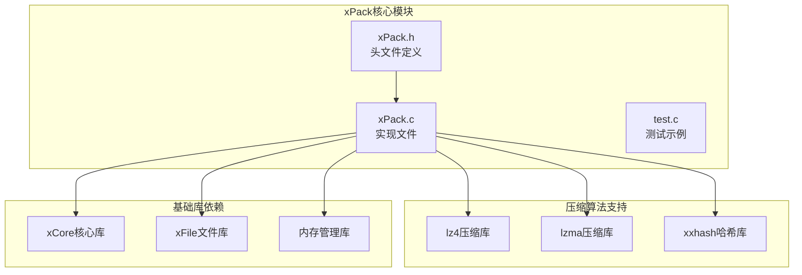
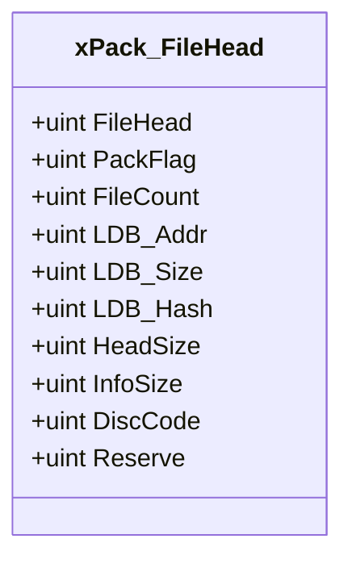
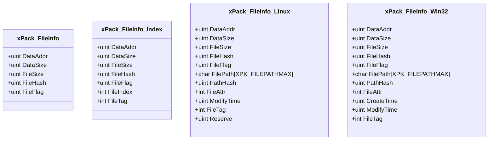
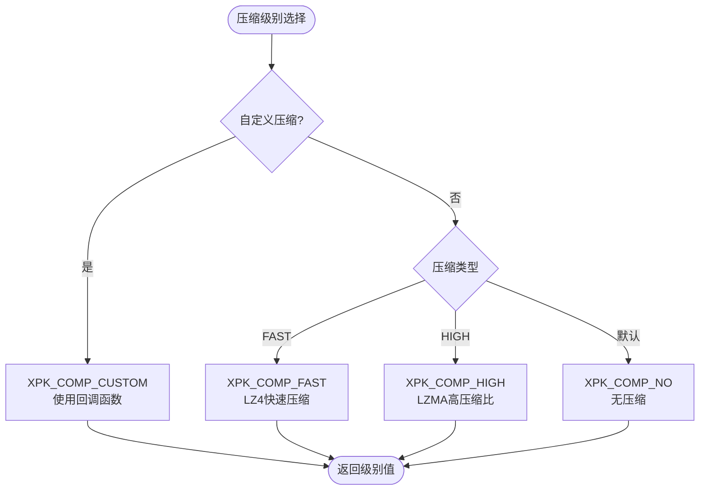
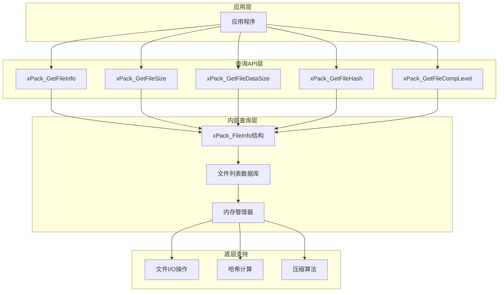
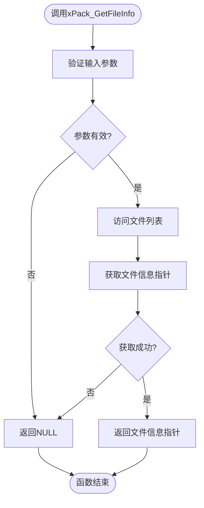
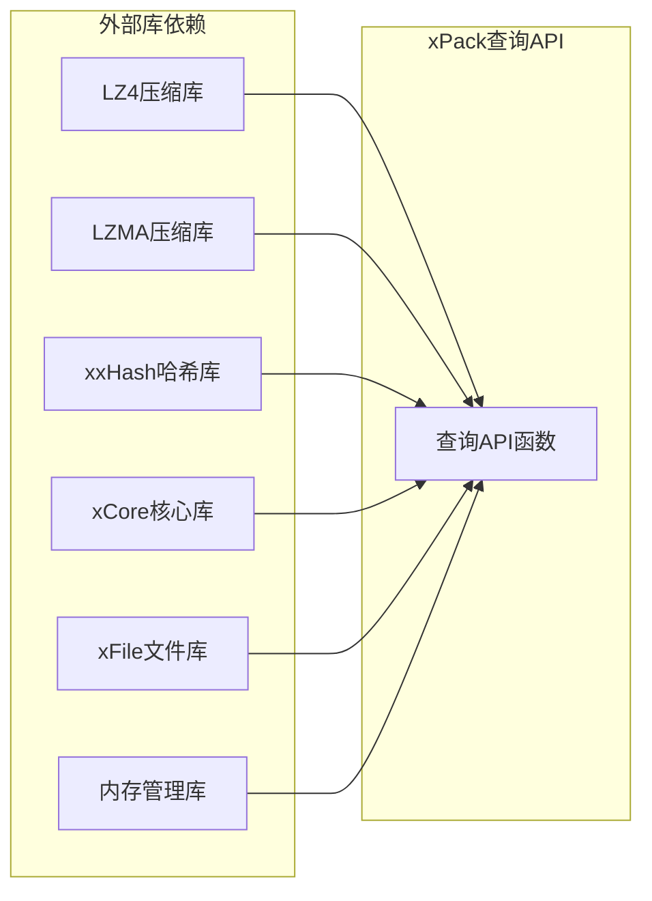
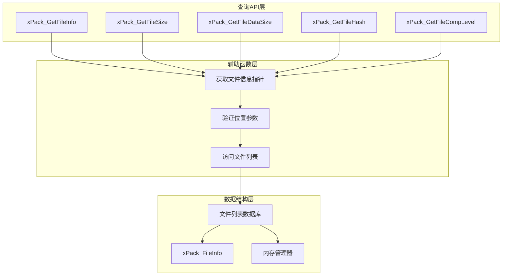
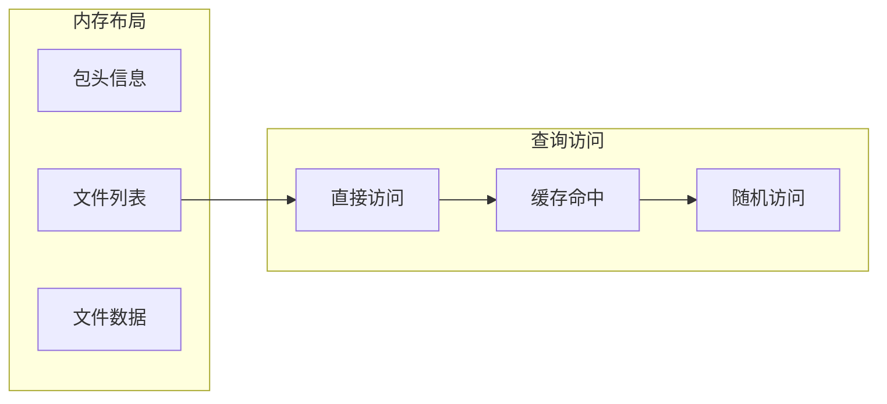

# 查询操作API

<cite>
**本文档中引用的文件**
- [xPack.h](file://ver6/xpack/xPack.h)
- [xPack.c](file://ver6/xpack/xPack.c)
- [test.c](file://ver6/xpack/test.c)
- [压缩级别参数.txt](file://压缩级别参数.txt)
</cite>

## 目录
1. [简介](#简介)
2. [项目结构](#项目结构)
3. [核心组件](#核心组件)
4. [架构概览](#架构概览)
5. [详细组件分析](#详细组件分析)
6. [依赖关系分析](#依赖关系分析)
7. [性能考虑](#性能考虑)
8. [故障排除指南](#故障排除指南)
9. [结论](#结论)

## 简介

xPack查询操作API是一套用于从xPack压缩包中检索文件元数据信息的接口集合。该API允许开发者获取文件包中的各种元数据信息，包括文件属性、压缩信息、存储位置等关键数据。本文档详细介绍了所有查询相关的函数，包括`xPack_GetFileInfo`、`xPack_GetFileSize`、`xPack_GetFileDataSize`、`xPack_GetFileHash`和`xPack_GetFileCompLevel`等核心查询函数。

## 项目结构

xPack查询操作API位于ver6/xpack目录下，主要包含以下关键文件：



**图表来源**
- [xPack.h](file://ver6/xpack/xPack.h#L1-L252)
- [xPack.c](file://ver6/xpack/xPack.c#L1-L50)

**章节来源**
- [xPack.h](file://ver6/xpack/xPack.h#L1-L252)
- [xPack.c](file://ver6/xpack/xPack.c#L1-L50)

## 核心组件

### 数据结构定义

xPack查询API基于以下核心数据结构：

#### 包文件头结构 (xPack_FileHead)


**图表来源**
- [xPack.h](file://ver6/xpack/xPack.h#L22-L34)

#### 文件信息结构 (xPack_FileInfo)


**图表来源**
- [xPack.h](file://ver6/xpack/xPack.h#L36-L84)

**章节来源**
- [xPack.h](file://ver6/xpack/xPack.h#L22-L84)

### 压缩级别枚举

xPack支持多种压缩级别，通过位标志进行编码：



**图表来源**
- [xPack.h](file://ver6/xpack/xPack.h#L15-L18)

**章节来源**
- [xPack.h](file://ver6/xpack/xPack.h#L15-L18)

## 架构概览

xPack查询操作API采用分层架构设计，提供统一的查询接口：



**图表来源**
- [xPack.c](file://ver6/xpack/xPack.c#L400-L447)
- [xPack.h](file://ver6/xpack/xPack.h#L155-L168)

## 详细组件分析

### xPack_GetFileInfo - 获取文件信息

`xPack_GetFileInfo`函数返回指向文件信息结构的指针，是所有查询操作的基础。

#### 函数原型与参数
```c
XXAPI ptr xPack_GetFileInfo(xPackObject xpk, uint iPos);
```

**参数说明：**
- `xpk`: xPack对象指针
- `iPos`: 文件位置索引

**返回值：**
- 成功：指向xPack_FileInfo结构的指针
- 失败：NULL

#### 实现逻辑流程



**图表来源**
- [xPack.c](file://ver6/xpack/xPack.c#L400-L407)

**章节来源**
- [xPack.c](file://ver6/xpack/xPack.c#L400-L407)

### xPack_GetFileSize - 获取文件大小

`xPack_GetFileSize`函数获取文件的原始大小（解压后大小）。

#### 函数实现
```c
XXAPI uint xPack_GetFileSize(xPackObject xpk, uint iPos)
{
    xPack_FileInfo* pInfo = xPack_GetFileInfo(xpk, iPos);
    if ( pInfo ) {
        return pInfo->FileSize;
    }
    return 0;
}
```

#### 使用场景
- 磁盘空间管理
- 进度显示
- 内存分配预估

**章节来源**
- [xPack.c](file://ver6/xpack/xPack.c#L409-L417)

### xPack_GetFileDataSize - 获取数据大小

`xPack_GetFileDataSize`函数获取文件的压缩后大小。

#### 函数实现
```c
XXAPI uint xPack_GetFileDataSize(xPackObject xpk, uint iPos)
{
    xPack_FileInfo* pInfo = xPack_GetFileInfo(xpk, iPos);
    if ( pInfo ) {
        return pInfo->DataSize;
    }
    return 0;
}
```

#### 使用场景
- 存储空间统计
- 网络传输优化
- 压缩率计算

**章节来源**
- [xPack.c](file://ver6/xpack/xPack.c#L419-L427)

### xPack_GetFileHash - 获取文件哈希值

`xPack_GetFileHash`函数获取文件内容的哈希值，用于完整性验证。

#### 函数实现
```c
XXAPI uint xPack_GetFileHash(xPackObject xpk, uint iPos)
{
    xPack_FileInfo* pInfo = xPack_GetFileInfo(xpk, iPos);
    if ( pInfo ) {
        return pInfo->FileHash;
    }
    return 0;
}
```

#### 哈希算法
- 使用xxHash算法进行快速哈希计算
- 支持32位哈希值
- 用于文件完整性验证和去重

**章节来源**
- [xPack.c](file://ver6/xpack/xPack.c#L429-L437)

### xPack_GetFileCompLevel - 获取压缩级别

`xPack_GetFileCompLevel`函数获取文件的压缩级别信息。

#### 函数实现
```c
XXAPI uint xPack_GetFileCompLevel(xPackObject xpk, uint iPos)
{
    xPack_FileInfo* pInfo = xPack_GetFileInfo(xpk, iPos);
    if ( pInfo ) {
        return pInfo->FileFlag & XPK_COMP_CUSTOM;
    }
    return 0;
}
```

#### 压缩级别含义
- `XPK_COMP_NO` (0): 无压缩
- `XPK_COMP_FAST` (1): 快速压缩（LZ4）
- `XPK_COMP_HIGH` (2): 高压缩比（LZMA）
- `XPK_COMP_CUSTOM` (3): 自定义压缩

**章节来源**
- [xPack.c](file://ver6/xpack/xPack.c#L439-L447)

## 依赖关系分析

### 外部依赖



**图表来源**
- [xPack.c](file://ver6/xpack/xPack.c#L8-L27)

### 内部依赖关系



**图表来源**
- [xPack.c](file://ver6/xpack/xPack.c#L400-L447)

**章节来源**
- [xPack.c](file://ver6/xpack/xPack.c#L8-L27)

## 性能考虑

### 查询性能特征

| 查询函数 | 时间复杂度 | 空间复杂度 | 特点 |
|---------|-----------|-----------|------|
| xPack_GetFileInfo | O(1) | O(1) | 直接访问内存 |
| xPack_GetFileSize | O(1) | O(1) | 直接读取字段 |
| xPack_GetFileDataSize | O(1) | O(1) | 直接读取字段 |
| xPack_GetFileHash | O(1) | O(1) | 直接读取字段 |
| xPack_GetFileCompLevel | O(1) | O(1) | 位运算提取 |

### 内存访问模式



### 最佳实践建议

1. **批量查询优化**：对于多个文件的查询，优先使用`xPack_GetFileInfo`获取完整信息
2. **缓存策略**：对频繁访问的文件信息建立应用层缓存
3. **内存管理**：注意查询返回的指针生命周期，避免悬空指针
4. **错误处理**：始终检查返回值的有效性

## 故障排除指南

### 常见错误及解决方案

| 错误类型 | 错误码 | 描述 | 解决方案 |
|---------|--------|------|----------|
| 参数无效 | 6 | 无效的文件位置 | 检查文件索引范围 |
| 文件不存在 | 12 | 找不到文件 | 验证文件包完整性 |
| 内存不足 | 3 | 内存申请失败 | 释放内存或增加可用内存 |
| 文件损坏 | 7 | 文件hash校验失败 | 重新构建文件包 |

### 调试技巧

1. **启用错误回调**：设置`OnError`回调函数捕获详细错误信息
2. **验证文件包状态**：使用`xPack_FileCount()`确认文件数量
3. **检查压缩级别**：使用`xPack_GetFileCompLevel()`验证压缩状态
4. **验证哈希值**：使用`xPack_GetFileHash()`进行完整性检查

**章节来源**
- [xPack.c](file://ver6/xpack/xPack.c#L36-L52)

## 结论

xPack查询操作API提供了高效、可靠的文件元数据查询功能。通过统一的接口设计和优化的实现，开发者可以轻松获取文件包中的各种元数据信息。该API具有以下优势：

1. **简单易用**：提供直观的查询接口
2. **高性能**：O(1)时间复杂度的查询操作
3. **内存友好**：直接内存访问，避免不必要的数据复制
4. **功能完整**：覆盖文件元数据查询的所有核心需求

建议在实际应用中结合具体的使用场景，合理选择查询函数，并实施适当的缓存和错误处理策略，以获得最佳的性能和用户体验。