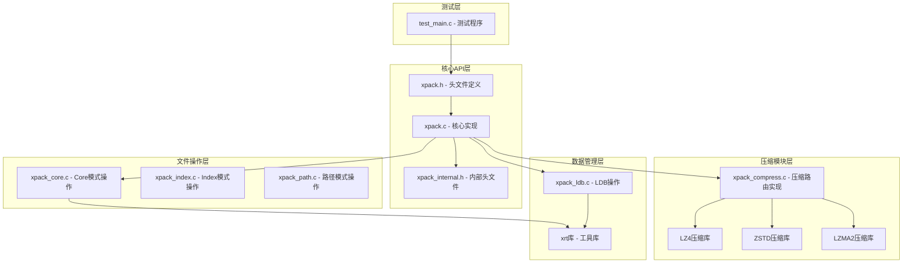
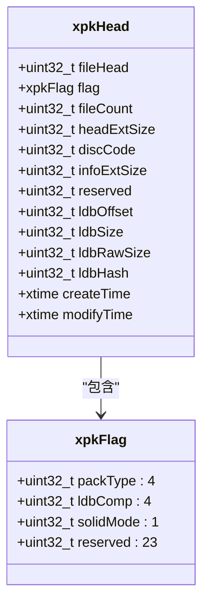
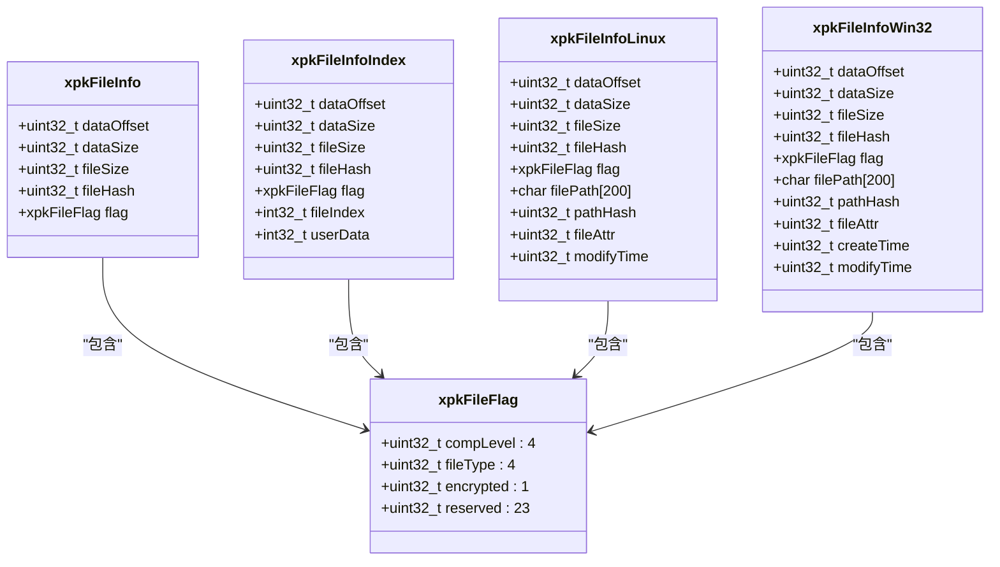
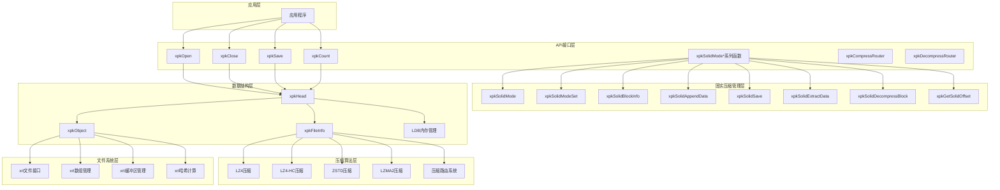
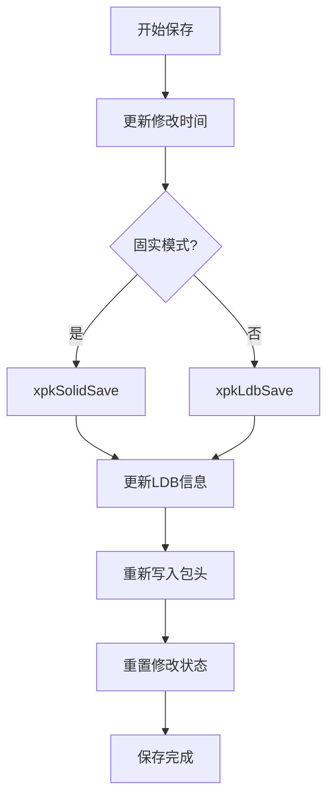
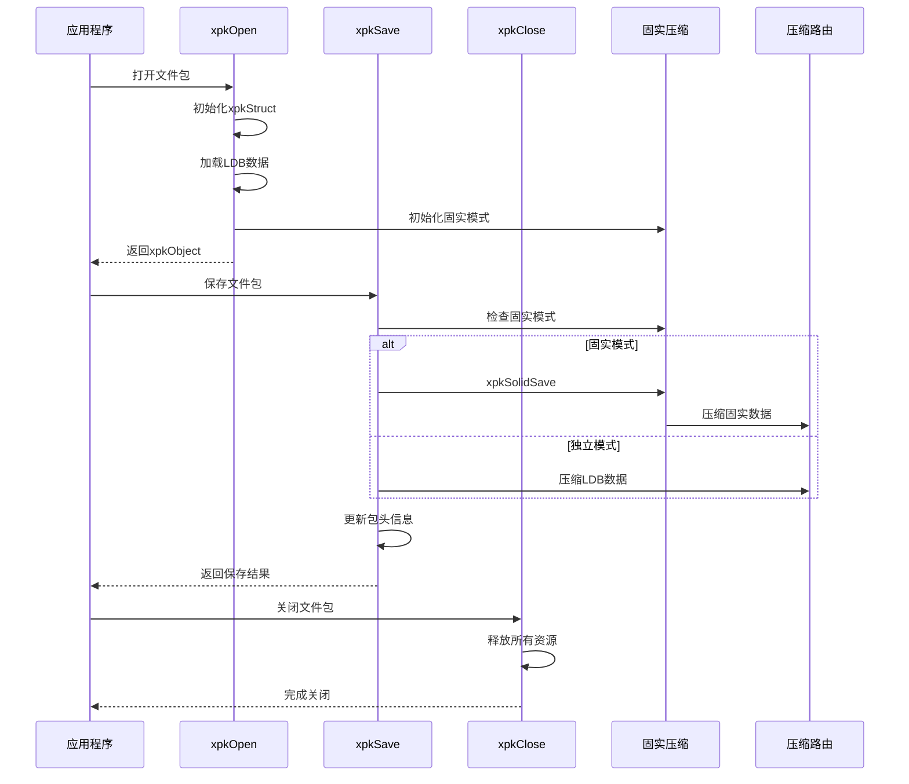
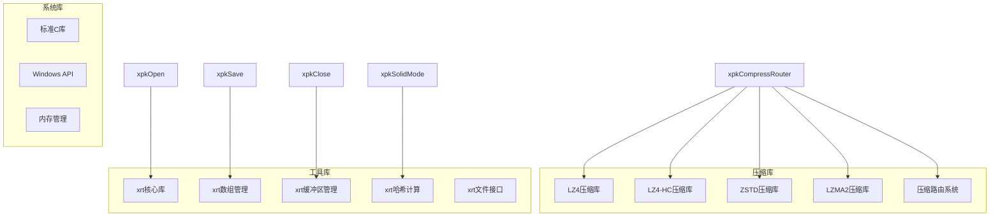
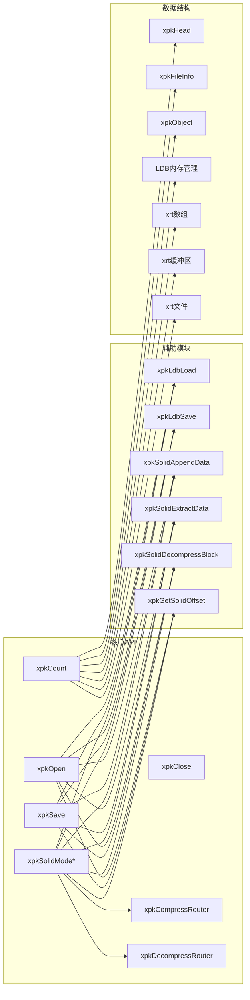

# 核心API函数

<cite>
**本文档引用的文件**
- [xpack.h](file://src/xpack.h)
- [xpack.c](file://src/xpack.c)
- [xpack_internal.h](file://src/xpack_internal.h)
- [xpack_compress.c](file://src/xpack_compress.c)
- [xpack_core.c](file://src/xpack_core.c)
- [xpack_ldb.c](file://src/xpack_ldb.c)
- [test_main.c](file://test/test_main.c)
</cite>

## 更新摘要
**变更内容**
- 新增固实压缩模式支持，包括xpkSolidMode、xpkSolidModeSet、xpkSolidBlockInfo等接口
- 引入统一的压缩路由系统，支持LZ4、LZ4-HC、ZSTD、LZMA2四种算法
- 更新数据结构定义，新增xpkHead、xpkFileInfo等结构体
- 扩展包类型支持，包括Core、Index、Linux、Win32四种模式
- 新增文件类型标识和压缩级别映射表
- 增强错误处理机制和统计功能

## 目录
1. [简介](#简介)
2. [项目结构](#项目结构)
3. [核心组件](#核心组件)
4. [架构概览](#架构概览)
5. [详细组件分析](#详细组件分析)
6. [依赖关系分析](#依赖关系分析)
7. [性能考虑](#性能考虑)
8. [故障排除指南](#故障排除指南)
9. [结论](#结论)

## 简介

xPack Ver7是xPack文件压缩包系统的全新版本，采用了革命性的架构设计，提供了完整的文件包管理功能。本文档专注于核心API函数的详细参考，包括文件包操作的基础函数：xpkOpen（打开文件包）、xpkClose（关闭文件包）、xpkSave（保存文件包）、xpkCount（获取文件数量）等，以及新增的固实压缩模式控制接口。

xPack Ver7采用模块化设计，支持四种文件包类型（Core、Index、Linux、Win32），通过统一的压缩路由系统支持多种压缩算法（LZ4、LZ4-HC、ZSTD、LZMA2），并提供高效的文件压缩功能。所有API函数都遵循统一的命名规范和参数约定，确保了良好的可维护性和易用性。

## 项目结构

xPack Ver7项目采用分层架构设计，主要包含以下核心组件：



**图表来源**
- [xpack.h](file://src/xpack.h#L1-L410)
- [xpack.c](file://src/xpack.c#L1-L586)
- [xpack_compress.c](file://src/xpack_compress.c#L1-L251)

**章节来源**
- [xpack.h](file://src/xpack.h#L1-L410)
- [xpack.c](file://src/xpack.c#L1-L586)

## 核心组件

### 数据结构定义

xPack Ver7系统基于全新的数据结构构建，提供了更灵活和高效的文件包管理能力：

#### xpkHead 包头结构体


#### 文件信息结构体


**图表来源**
- [xpack.h](file://src/xpack.h#L118-L235)

### 压缩级别映射表

Ver7版本引入了统一的压缩级别映射系统，支持16个压缩级别：

| 压缩级别 | 算法类型 | 原生级别 | 描述 |
|---------|----------|----------|------|
| 0 | STORE | 0 | 无压缩 |
| 1 | LZ4 | 1 | LZ4快速压缩 |
| 2 | LZ4 | 2 | LZ4快速压缩(64KB块) |
| 3 | LZ4HC | 4 | LZ4-HC压缩级别4 |
| 4 | LZ4HC | 12 | LZ4-HC压缩级别12 |
| 5 | ZSTD | FAST | ZSTD快速压缩 |
| 6 | ZSTD | DFAST | ZSTD双快速压缩 |
| 7 | ZSTD | GREEDY | ZSTD贪婪压缩(默认) |
| 8 | ZSTD | LAZY | ZSTD懒惰压缩 |
| 9 | ZSTD | LAZY2 | ZSTD懒惰压缩2 |
| 10 | ZSTD | BTLAZY2 | ZSTD二叉树懒惰压缩2 |
| 11 | ZSTD | BTOPT | ZSTD二叉树最优压缩 |
| 12 | ZSTD | BTULTRA | ZSTD二叉树超快压缩 |
| 13 | ZSTD | BTULTRA2 | ZSTD二叉树超快压缩2 |
| 14 | LZMA2 | 6 | LZMA2压缩级别6 |
| 15 | LZMA2 | 9 | LZMA2压缩级别9 |

**章节来源**
- [xpack.h](file://src/xpack.h#L257-L274)
- [xpack_compress.c](file://src/xpack_compress.c#L20-L147)

## 架构概览

xPack Ver7采用全新的分层架构设计，从底层到上层依次为：文件系统接口层、压缩算法层、数据结构层、API接口层和固实压缩管理层。



**图表来源**
- [xpack.c](file://src/xpack.c#L46-L165)
- [xpack_compress.c](file://src/xpack_compress.c#L20-L147)
- [xpack_internal.h](file://src/xpack_internal.h#L20-L54)

## 详细组件分析

### xpkOpen - 打开文件包

#### 函数原型
```c
xpkObject xpkOpen(const char* path, uint32_t offset, int readonly)
```

#### 参数说明
- `path`: 文件包路径字符串
- `offset`: 文件包在宿主文件中的偏移量（通常为0）
- `readonly`: 只读模式标志（0=读写，非0=只读）

#### 返回值
- 成功：返回xpkObject指针（文件包句柄）
- 失败：返回NULL，并触发错误回调

#### 功能特性
1. **自动创建机制**：如果文件不存在且处于读写模式，会自动创建新的文件包
2. **版本验证**：检查文件包版本兼容性（XPK_VERSION = 0x116B7078）
3. **内存分配**：初始化LDB（文件列表数据）内存管理器
4. **固实模式初始化**：设置固实压缩相关字段
5. **文件列表加载**：根据压缩标志决定是否需要解压文件列表

#### 使用示例
```c
// 创建新文件包
xpkObject xpk = xpkOpen("data.xpk", 0, 0);

// 以只读模式打开现有文件包
xpkObject xpk = xpkOpen("data.xpk", 0, 1);
```

#### 错误处理
- 文件无法访问：返回错误码1
- 文件格式不正确：返回错误码4  
- 内存申请失败：返回错误码3
- 文件列表读取失败：返回错误码2

**章节来源**
- [xpack.c](file://src/xpack.c#L46-L165)
- [xpack.h](file://src/xpack.h#L309)

### xpkClose - 关闭文件包

#### 函数原型
```c
void xpkClose(xpkObject xpk)
```

#### 参数说明
- `xpk`: 文件包对象指针

#### 返回值
- 无返回值

#### 功能特性
1. **资源清理**：释放LDB数组、包头扩展数据、固实缓冲区
2. **文件句柄关闭**：关闭xrt文件句柄
3. **内存释放**：释放xpkStruct内存
4. **固实块缓存清理**：释放读取时使用的固实块缓存

#### 使用示例
```c
xpkObject xpk = xpkOpen("data.xpk", 0, 0);
// ... 进行文件包操作 ...
xpkClose(xpk);
```

#### 调用时机
- 在程序退出前必须调用
- 发生异常时也应调用以释放资源
- 不要重复调用同一对象的Close

**章节来源**
- [xpack.c](file://src/xpack.c#L213-L242)
- [xpack.h](file://src/xpack.h#L311)

### xpkSave - 保存文件包

#### 函数原型
```c
int xpkSave(xpkObject xpk)
```

#### 参数说明
- `xpk`: 文件包对象指针

#### 返回值
- 成功：返回0
- 失败：返回-1，并触发错误回调

#### 功能特性
1. **修改时间更新**：更新包的modifyTime字段
2. **文件头更新**：更新文件包头部信息
3. **固实模式处理**：根据固实模式选择保存策略
4. **LDB保存**：保存文件列表数据
5. **包头重写**：更新并写回文件包头部信息

#### 保存流程


**图表来源**
- [xpack.c](file://src/xpack.c#L167-L211)

#### 使用示例
```c
xpkObject xpk = xpkOpen("data.xpk", 0, 0);
// ... 进行文件包操作 ...
xpkSave(xpk);
```

#### 错误处理
- 文件读写位置移动失败：返回错误码2
- 文件写入失败：返回错误码10
- 只读模式保存：返回错误码10

**章节来源**
- [xpack.c](file://src/xpack.c#L167-L211)
- [xpack.h](file://src/xpack.h#L310)

### xpkCount - 获取文件数量

#### 函数原型
```c
uint32_t xpkCount(xpkObject xpk)
```

#### 参数说明
- `xpk`: 文件包对象指针

#### 返回值
- 文件包中文件的数量

#### 功能特性
1. **简单查询**：直接返回LDB（文件列表数据）中的条目数量
2. **空包处理**：对于空文件包返回0
3. **安全性检查**：验证xpk的有效性

#### 使用示例
```c
xpkObject xpk = xpkOpen("data.xpk", 0, 1);
uint count = xpkCount(xpk);
printf("文件包包含 %d 个文件", count);
```

#### 注意事项
- 该函数不改变文件包的状态
- 可以在任何模式下使用（只读或读写）

**章节来源**
- [xpack.c](file://src/xpack.c#L276-L279)
- [xpack.h](file://src/xpack.h#L318)

### 固实压缩控制接口

#### xpkSolidMode - 查询固实模式状态

##### 函数原型
```c
int xpkSolidMode(xpkObject xpk)
```

##### 参数说明
- `xpk`: 文件包对象指针

##### 返回值
- 1：固实模式已启用
- 0：固实模式未启用
- -1：错误

##### 功能特性
- 查询当前文件包的固实模式状态
- 支持在读取模式下使用

##### 使用示例
```c
xpkObject xpk = xpkOpen("data.xpk", 0, 1);
int solidMode = xpkSolidMode(xpk);
if (solidMode) {
    printf("固实模式已启用");
}
```

**章节来源**
- [xpack.c](file://src/xpack.c#L311-L314)
- [xpack.h](file://src/xpack.h#L327)

#### xpkSolidModeSet - 设置固实模式

##### 函数原型
```c
int xpkSolidModeSet(xpkObject xpk, int enabled)
```

##### 参数说明
- `xpk`: 文件包对象指针
- `enabled`: 是否启用固实模式（1=启用，0=禁用）

##### 返回值
- 0：设置成功
- -1：设置失败

##### 功能特性
1. **空包检查**：只允许在空包时设置固实模式
2. **写入模式要求**：只允许在写入模式下设置
3. **缓冲区初始化**：启用时初始化固实缓冲区
4. **资源清理**：禁用时清理固实缓冲区

##### 使用示例
```c
xpkObject xpk = xpkOpen("data.xpk", 0, 0);
// 先添加文件会导致设置失败
if (xpkSolidModeSet(xpk, 1) == 0) {
    printf("固实模式设置成功");
}
```

##### 错误处理
- 非空包设置：返回错误码11
- 只读模式设置：返回错误码10

**章节来源**
- [xpack.c](file://src/xpack.c#L316-L353)
- [xpack.h](file://src/xpack.h#L328)

#### xpkSolidBlockInfo - 获取固实块信息

##### 函数原型
```c
int xpkSolidBlockInfo(xpkObject xpk, uint32_t* offset, uint32_t* size)
```

##### 参数说明
- `xpk`: 文件包对象指针
- `offset`: 输出参数，固实块在文件中的偏移
- `size`: 输出参数，固实块的大小

##### 返回值
- 0：获取成功
- -1：获取失败

##### 功能特性
- 仅在固实模式下有效
- 计算固实块的起始偏移和大小
- 返回固实块的元数据信息

##### 使用示例
```c
xpkObject xpk = xpkOpen("data.xpk", 0, 1);
uint32_t offset, size;
if (xpkSolidBlockInfo(xpk, &offset, &size) == 0) {
    printf("固实块偏移: %u, 大小: %u", offset, size);
}
```

**章节来源**
- [xpack.c](file://src/xpack.c#L355-L366)
- [xpack.h](file://src/xpack.h#L329)

### 压缩路由系统

#### xpkCompressRouter - 压缩路由函数

##### 函数原型
```c
int xpkCompressRouter(int level, const void* src, uint32_t srcSize, 
                     void* dst, uint32_t dstCapacity, uint32_t* outSize)
```

##### 参数说明
- `level`: 压缩级别（0-15）
- `src`: 源数据指针
- `srcSize`: 源数据大小
- `dst`: 目标缓冲区指针
- `dstCapacity`: 目标缓冲区容量
- `outSize`: 输出参数，压缩后数据大小

##### 返回值
- 0：压缩成功
- -1：压缩失败

##### 功能特性
1. **算法选择**：根据压缩级别选择相应算法
2. **回退机制**：压缩失败时自动回退到无压缩
3. **边界检查**：验证输入输出参数的有效性

##### 支持的算法
- STORE：无压缩
- LZ4：快速压缩
- LZ4HC：高压缩比压缩
- ZSTD：现代压缩算法
- LZMA2：高压缩比传统算法

**章节来源**
- [xpack_compress.c](file://src/xpack_compress.c#L20-L147)
- [xpack.h](file://src/xpack.h#L249-L252)

#### xpkDecompressRouter - 解压路由函数

##### 函数原型
```c
int xpkDecompressRouter(int level, const void* src, uint32_t srcSize,
                       void* dst, uint32_t dstSize)
```

##### 参数说明
- `level`: 压缩级别（0-15）
- `src`: 源数据指针（压缩数据）
- `srcSize`: 源数据大小
- `dst`: 目标缓冲区指针
- `dstSize`: 目标缓冲区大小

##### 返回值
- 0：解压成功
- -1：解压失败

##### 功能特性
1. **算法匹配**：根据压缩级别选择相应解压算法
2. **无压缩优化**：当压缩后大小等于原始大小时直接复制
3. **一致性验证**：验证解压后的数据大小

**章节来源**
- [xpack_compress.c](file://src/xpack_compress.c#L153-L220)
- [xpack.h](file://src/xpack.h#L249-L252)

### 核心API调用关系图



**图表来源**
- [xpack.c](file://src/xpack.c#L46-L165)
- [xpack.c](file://src/xpack.c#L167-L211)
- [xpack.c](file://src/xpack.c#L213-L242)

## 依赖关系分析

### 外部依赖

xPack Ver7核心API函数依赖于以下外部库：



**图表来源**
- [xpack_compress.c](file://src/xpack_compress.c#L9-L14)
- [xpack_internal.h](file://src/xpack_internal.h#L10-L11)

### 内部依赖关系



**图表来源**
- [xpack.c](file://src/xpack.c#L74-L165)
- [xpack_compress.c](file://src/xpack_compress.c#L68-L96)
- [xpack_internal.h](file://src/xpack_internal.h#L67-L96)

**章节来源**
- [xpack.c](file://src/xpack.c#L1-L586)
- [xpack_compress.c](file://src/xpack_compress.c#L1-L251)

## 性能考虑

### 压缩策略选择

xPack Ver7提供了16种压缩策略，每种都有不同的性能特征：

| 压缩级别 | 算法类型 | 速度 | 压缩率 | 内存占用 | 适用场景 |
|---------|----------|------|--------|----------|----------|
| 0 | STORE | 最快 | 最低 | 最低 | 实时数据、临时文件 |
| 1-2 | LZ4 | 快速 | 中等 | 中等 | 日常使用、平衡需求 |
| 3-4 | LZ4-HC | 中等 | 高 | 中等 | 需要高压缩比的场景 |
| 5-13 | ZSTD | 中等-快速 | 高 | 中等-较高 | 现代压缩需求 |
| 14-15 | LZMA2 | 较慢 | 最高 | 较高 | 存档文件、空间敏感 |

### 固实压缩优化

1. **内存效率**：固实模式将多个文件压缩到单一块中，减少重复压缩开销
2. **I/O优化**：减少文件系统调用次数，提高读取性能
3. **缓存机制**：固实块解压后缓存，避免重复解压
4. **延迟加载**：按需解压固实块，减少内存占用

### I/O性能优化

1. **顺序访问**：Core模式支持高效的顺序读取
2. **批量操作**：支持批量文件添加和删除操作
3. **零拷贝技术**：在可能的情况下避免不必要的数据复制
4. **缓冲区管理**：智能缓冲区分配和回收

## 故障排除指南

### 常见错误代码

| 错误码 | 错误描述 | 可能原因 | 解决方案 |
|-------|----------|----------|----------|
| 1 | 文件无法访问 | 权限不足、文件被占用 | 检查文件权限，关闭占用进程 |
| 2 | 文件读取失败 | 文件损坏、I/O错误 | 检查磁盘健康，重新创建文件包 |
| 3 | 内存申请失败 | 内存不足、碎片化严重 | 释放内存，重启系统，检查内存使用 |
| 4 | 版本不支持 | 文件格式不正确 | 验证文件完整性，使用正确版本 |
| 6 | 无效的文件位置 | 索引越界、文件已删除 | 验证文件索引，重新获取文件列表 |
| 7 | 压缩失败 | 算法错误、数据损坏 | 检查压缩级别，重新添加文件 |
| 8 | 解压失败 | 数据损坏、算法不匹配 | 检查数据完整性，使用正确算法 |
| 9 | 哈希验证失败 | 数据损坏、完整性验证失败 | 检查数据完整性，重新添加文件 |
| 10 | 只读模式写入拒绝 | 在只读模式执行写操作 | 使用读写模式打开文件包 |
| 11 | 操作类型不匹配 | 包类型不支持该操作 | 检查包类型，使用正确的API |

### 调试技巧

1. **启用错误回调**：
```c
void onError(int code, const char* message) {
    printf("错误代码: %d, 描述: %s\n", code, message);
}

xpkObject xpk = xpkOpen("data.xpk", 0, 0);
xpkOnError(xpk, onError);
```

2. **检查文件包状态**：
```c
// 检查固实模式
if (xpkSolidMode(xpk)) {
    printf("固实模式已启用");
}

// 检查包类型
printf("包类型: %d", xpkType(xpk));

// 获取统计信息
xpkStat stat;
if (xpkStatGet(xpk, &stat) == 0) {
    printf("文件数量: %d, 原始大小: %llu", 
           stat.fileCount, stat.totalSize);
}
```

3. **验证文件包完整性**：
```c
// 获取文件包统计信息
uint32_t count = xpkCount(xpk);
xpkHead* head = xpkGetHead(xpk);
printf("文件数量: %d, 版本: 0x%x\n", count, head->fileHead);

// 验证特定文件
if (xpkVerify(xpk, 0) == 0) {
    printf("文件验证通过");
}
```

**章节来源**
- [xpack.c](file://src/xpack.c#L27-L40)
- [xpack.c](file://src/xpack.c#L567-L585)

## 结论

xPack Ver7核心API函数提供了革命性的文件包管理解决方案。通过引入固实压缩模式、统一的压缩路由系统和全新的数据结构定义，xPack Ver7能够满足从简单文件打包到复杂多平台文件包管理的各种需求。

### 主要优势

1. **固实压缩支持**：通过xpkSolidMode系列函数提供高效的固实压缩功能
2. **统一压缩路由**：支持LZ4、LZ4-HC、ZSTD、LZMA2四种算法的统一管理
3. **多模式支持**：Core、Index、Linux、Win32四种包类型满足不同使用场景
4. **16级压缩级别**：提供从快速压缩到高压缩比的完整选择
5. **增强的错误处理**：详细的错误码和回调机制
6. **性能优化**：固实压缩模式显著提升压缩效率和存储利用率

### 最佳实践建议

1. **正确的生命周期管理**：始终遵循Open-使用-Close的模式
2. **固实模式选择**：根据文件相似度和使用频率选择合适的压缩模式
3. **压缩级别优化**：根据应用场景选择合适的压缩级别
4. **及时的错误处理**：利用错误回调机制进行有效的错误处理
5. **资源的合理使用**：注意内存和文件句柄的管理
6. **版本兼容性**：确保文件包版本与API版本兼容

xPack Ver7作为新一代xPack文件压缩包系统的核心，为开发者提供了更加高效、灵活和可靠的文件包管理工具，适用于各种规模的应用程序和系统集成场景。