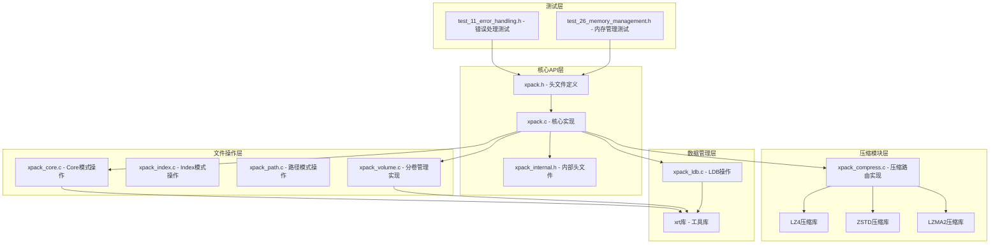
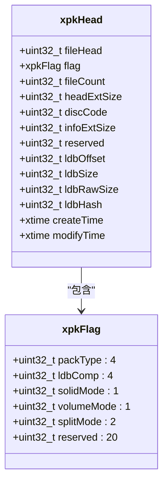
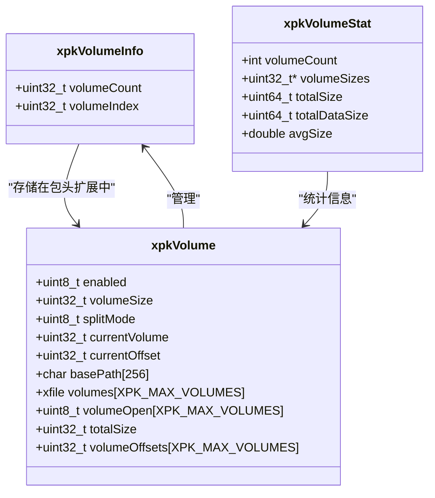
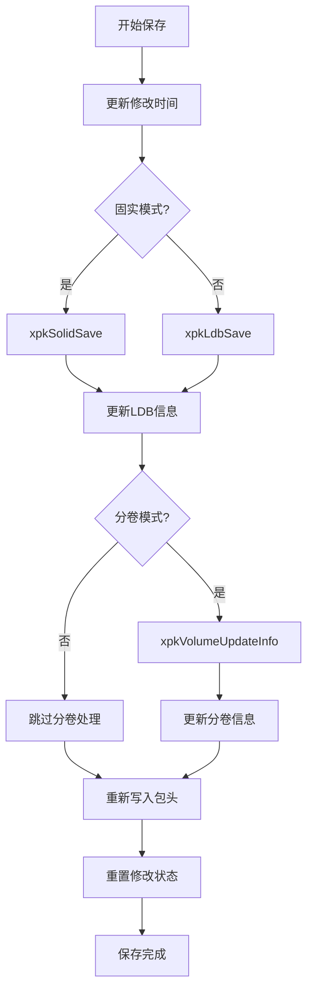
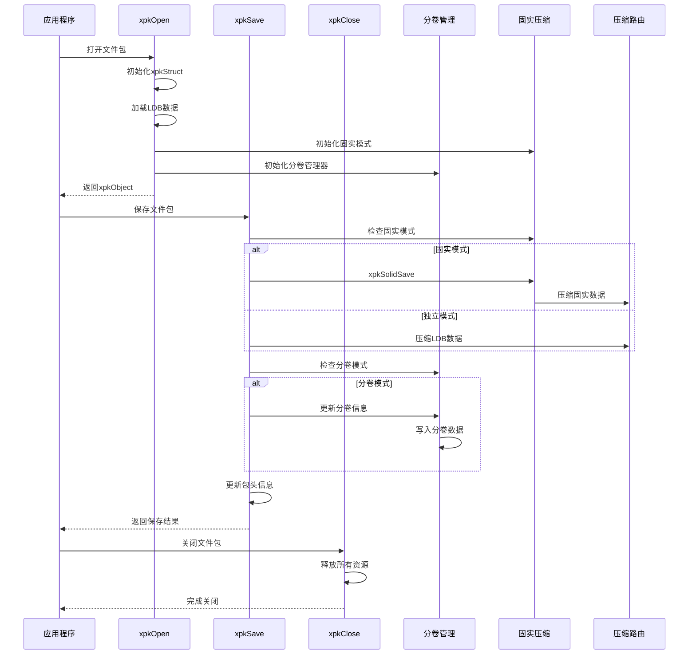
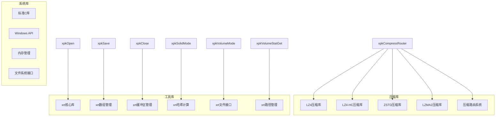
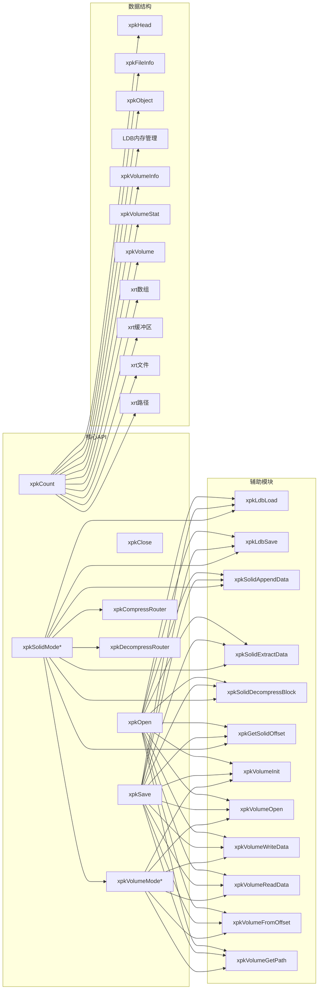

# 核心API函数

<cite>
**本文档引用的文件**
- [xpack.h](file://src/xpack.h)
- [xpack.c](file://src/xpack.c)
- [xpack_core.c](file://src/xpack_core.c)
- [xpack_index.c](file://src/xpack_index.c)
- [xpack_path.c](file://src/xpack_path.c)
- [xpack_internal.h](file://src/xpack_internal.h)
- [xpack_compress.c](file://src/xpack_compress.c)
- [xpack_ldb.c](file://src/xpack_ldb.c)
- [xpack_volume.c](file://src/xpack_volume.c)
- [test_11_error_handling.h](file://test/11_error_handling.h)
- [test_26_memory_management.h](file://test/26_memory_management.h)
</cite>

## 更新摘要
**变更内容**
- 新增空数据处理的bug修复，改进了空数据的压缩和解压逻辑
- 增强内存管理的安全性，修复了内存泄漏和缓冲区溢出问题
- 改进了错误处理机制，提供了更准确的错误码和消息
- 优化了文件包操作的健壮性，增强了边界条件检查

## 目录
1. [简介](#简介)
2. [项目结构](#项目结构)
3. [核心组件](#核心组件)
4. [架构概览](#架构概览)
5. [详细组件分析](#详细组件分析)
6. [依赖关系分析](#依赖关系分析)
7. [性能考虑](#性能考虑)
8. [故障排除指南](#故障排除指南)
9. [结论](#结论)

## 简介

xPack Ver7是xPack文件压缩包系统的全新版本，采用了革命性的架构设计，提供了完整的文件包管理功能。本文档专注于核心API函数的详细参考，包括文件包操作的基础函数：xpkOpen（打开文件包）、xpkClose（关闭文件包）、xpkSave（保存文件包）、xpkCount（获取文件数量）等，以及新增的分卷压缩模式控制接口。

xPack Ver7采用模块化设计，支持四种文件包类型（Core、Index、Linux、Win32），通过统一的压缩路由系统支持多种压缩算法（LZ4、LZ4-HC、ZSTD、LZMA2），并提供高效的文件压缩功能。所有API函数都遵循统一的命名规范和参数约定，确保了良好的可维护性和易用性。

**新增功能**：分卷压缩模式支持，允许将大文件包分割到多个卷中，便于存储和传输。

## 项目结构

xPack Ver7项目采用分层架构设计，主要包含以下核心组件：



**图表来源**
- [xpack.h](file://src/xpack.h#L1-L447)
- [xpack.c](file://src/xpack.c#L1-L762)
- [xpack_compress.c](file://src/xpack_compress.c#L1-L251)
- [xpack_volume.c](file://src/xpack_volume.c#L1-L353)

**章节来源**
- [xpack.h](file://src/xpack.h#L1-L447)
- [xpack.c](file://src/xpack.c#L1-L762)

## 核心组件

### 数据结构定义

xPack Ver7系统基于全新的数据结构构建，提供了更灵活和高效的文件包管理能力：

#### xpkHead 包头结构体


#### 分卷信息结构体


**图表来源**
- [xpack.h](file://src/xpack.h#L118-L148)
- [xpack.h](file://src/xpack.h#L249-L256)
- [xpack.h](file://src/xpack.h#L309-L317)
- [xpack_internal.h](file://src/xpack_internal.h#L23-L42)

### 压缩级别映射表

Ver7版本引入了统一的压缩级别映射系统，支持16个压缩级别：

| 压缩级别 | 算法类型 | 原生级别 | 描述 |
|---------|----------|----------|------|
| 0 | STORE | 0 | 无压缩 |
| 1 | LZ4 | 1 | LZ4快速压缩 |
| 2 | LZ4 | 2 | LZ4快速压缩(64KB块) |
| 3 | LZ4HC | 4 | LZ4-HC压缩级别4 |
| 4 | LZ4HC | 12 | LZ4-HC压缩级别12 |
| 5 | ZSTD | FAST | ZSTD快速压缩 |
| 6 | ZSTD | DFAST | ZSTD双快速压缩 |
| 7 | ZSTD | GREEDY | ZSTD贪婪压缩(默认) |
| 8 | ZSTD | LAZY | ZSTD懒惰压缩 |
| 9 | ZSTD | LAZY2 | ZSTD懒惰压缩2 |
| 10 | ZSTD | BTLAZY2 | ZSTD二叉树懒惰压缩2 |
| 11 | ZSTD | BTOPT | ZSTD二叉树最优压缩 |
| 12 | ZSTD | BTULTRA | ZSTD二叉树超快压缩 |
| 13 | ZSTD | BTULTRA2 | ZSTD二叉树超快压缩2 |
| 14 | LZMA2 | 6 | LZMA2压缩级别6 |
| 15 | LZMA2 | 9 | LZMA2压缩级别9 |

**章节来源**
- [xpack.h](file://src/xpack.h#L269-L286)
- [xpack_compress.c](file://src/xpack_compress.c#L20-L147)

## 架构概览

xPack Ver7采用全新的分层架构设计，从底层到上层依次为：文件系统接口层、压缩算法层、数据结构层、API接口层、固实压缩管理层和分卷管理器。

```mermaid
graph TB
subgraph "应用层"
A[应用程序]
end
subgraph "API接口层"
B[xpkOpen]
C[xpkClose]
D[xpkSave]
E[xpkCount]
F[xpkSolidMode*系列函数]
G[xpkVolumeMode*系列函数]
H[xpkCompressRouter]
I[xpkDecompressRouter]
end
subgraph "分卷管理层"
J[xpkVolumeMode]
K[xpkVolumeModeSet]
L[xpkVolumeSizeSet]
M[xpkVolumeStatGet]
N[xpkVolumeInit]
O[xpkVolumeOpen]
P[xpkVolumeWriteData]
Q[xpkVolumeReadData]
end
subgraph "固实压缩管理层"
R[xpkSolidMode]
S[xpkSolidModeSet]
T[xpkSolidBlockInfo]
U[xpkSolidAppendData]
V[xpkSolidSave]
W[xpkSolidExtractData]
X[xpkSolidDecompressBlock]
Y[xpkGetSolidOffset]
end
subgraph "数据结构层"
Z[xpkHead]
AA[xpkFileInfo]
BB[xpkObject]
CC[LDB内存管理]
DD[xpkVolumeInfo]
EE[xpkVolumeStat]
end
subgraph "压缩算法层"
FF[LZ4压缩]
GG[LZ4-HC压缩]
HH[ZSTD压缩]
II[LZMA2压缩]
JJ[压缩路由系统]
KK[分卷内部函数]
end
subgraph "文件系统层"
LL[xrt文件接口]
MM[xrt数组管理]
NN[xrt缓冲区管理]
OO[xrt哈希计算]
PP[xrt路径管理]
end
A --> B
A --> C
A --> D
A --> E
B --> Z
C --> Z
D --> Z
E --> Z
F --> R
F --> S
F --> T
F --> U
F --> V
F --> W
F --> X
F --> Y
G --> J
G --> K
G --> L
G --> M
G --> N
G --> O
G --> P
G --> Q
Z --> AA
Z --> BB
Z --> CC
Z --> DD
Z --> EE
AA --> FF
AA --> GG
AA --> HH
AA --> II
AA --> JJ
BB --> LL
BB --> MM
BB --> NN
BB --> OO
BB --> PP
```



**图表来源**
- [xpack.c](file://src/xpack.c#L46-L165)
- [xpack.c](file://src/xpack.c#L646-L762)
- [xpack_compress.c](file://src/xpack_compress.c#L20-L147)
- [xpack_internal.h](file://src/xpack_internal.h#L20-L54)
- [xpack_volume.c](file://src/xpack_volume.c#L44-L353)

## 详细组件分析

### xpkOpen - 打开文件包

#### 函数原型
```c
xpkObject xpkOpen(const char* path, uint32_t offset, int readonly)
```

#### 参数说明
- `path`: 文件包路径字符串
- `offset`: 文件包在宿主文件中的偏移量（通常为0）
- `readonly`: 只读模式标志（0=读写，非0=只读）

#### 返回值
- 成功：返回xpkObject指针（文件包句柄）
- 失败：返回NULL，并触发错误回调

#### 功能特性
1. **自动创建机制**：如果文件不存在且处于读写模式，会自动创建新的文件包
2. **版本验证**：检查文件包版本兼容性（XPK_VERSION = 0x116B7078）
3. **内存分配**：初始化LDB（文件列表数据）内存管理器
4. **固实模式初始化**：设置固实压缩相关字段
5. **分卷管理器初始化**：初始化分卷管理器状态
6. **文件列表加载**：根据压缩标志决定是否需要解压文件列表

#### 使用示例
```c
// 创建新文件包
xpkObject xpk = xpkOpen("data.xpk", 0, 0);

// 以只读模式打开现有文件包
xpkObject xpk = xpkOpen("data.xpk", 0, 1);
```

#### 错误处理
- 文件无法访问：返回错误码1
- 文件格式不正确：返回错误码4  
- 内存申请失败：返回错误码3
- 文件列表读取失败：返回错误码2

**章节来源**
- [xpack.c](file://src/xpack.c#L49-L200)
- [xpack.h](file://src/xpack.h#L332)

### xpkClose - 关闭文件包

#### 函数原型
```c
void xpkClose(xpkObject xpk)
```

#### 参数说明
- `xpk`: 文件包对象指针

#### 返回值
- 无返回值

#### 功能特性
1. **资源清理**：释放LDB数组、包头扩展数据、固实缓冲区
2. **分卷资源清理**：关闭所有分卷文件句柄
3. **文件句柄关闭**：关闭xrt文件句柄
4. **内存释放**：释放xpkStruct内存
5. **固实块缓存清理**：释放读取时使用的固实块缓存

#### 使用示例
```c
xpkObject xpk = xpkOpen("data.xpk", 0, 0);
// ... 进行文件包操作 ...
xpkClose(xpk);
```

#### 调用时机
- 在程序退出前必须调用
- 发生异常时也应调用以释放资源
- 不要重复调用同一对象的Close

**章节来源**
- [xpack.c](file://src/xpack.c#L261-L297)
- [xpack.h](file://src/xpack.h#L334)

### xpkSave - 保存文件包

#### 函数原型
```c
int xpkSave(xpkObject xpk)
```

#### 参数说明
- `xpk`: 文件包对象指针

#### 返回值
- 成功：返回0
- 失败：返回-1，并触发错误回调

#### 功能特性
1. **修改时间更新**：更新包的modifyTime字段
2. **文件头更新**：更新文件包头部信息
3. **固实模式处理**：根据固实模式选择保存策略
4. **分卷模式处理**：更新分卷相关信息
5. **LDB保存**：保存文件列表数据
6. **包头重写**：更新并写回文件包头部信息

#### 保存流程


**图表来源**
- [xpack.c](file://src/xpack.c#L202-L259)
- [xpack.c](file://src/xpack.c#L646-L762)

#### 使用示例
```c
xpkObject xpk = xpkOpen("data.xpk", 0, 0);
// ... 进行文件包操作 ...
xpkSave(xpk);
```

#### 错误处理
- 文件读写位置移动失败：返回错误码2
- 文件写入失败：返回错误码10
- 只读模式保存：返回错误码10

**章节来源**
- [xpack.c](file://src/xpack.c#L202-L259)
- [xpack.h](file://src/xpack.h#L333)

### xpkCount - 获取文件数量

#### 函数原型
```c
uint32_t xpkCount(xpkObject xpk)
```

#### 参数说明
- `xpk`: 文件包对象指针

#### 返回值
- 文件包中文件的数量

#### 功能特性
1. **简单查询**：直接返回LDB（文件列表数据）中的条目数量
2. **空包处理**：对于空文件包返回0
3. **安全性检查**：验证xpk的有效性

#### 使用示例
```c
xpkObject xpk = xpkOpen("data.xpk", 0, 1);
uint count = xpkCount(xpk);
printf("文件包包含 %d 个文件", count);
```

#### 注意事项
- 该函数不改变文件包的状态
- 可以在任何模式下使用（只读或读写）

**章节来源**
- [xpack.c](file://src/xpack.c#L331-L334)
- [xpack.h](file://src/xpack.h#L341)

### Core模式文件操作

#### xpkAppendFile - 追加文件到Core模式包

**更新** 增强了空数据处理和内存安全检查

##### 函数原型
```c
uint32_t xpkAppendFile(xpkObject xpk, const char* path, int level)
```

##### 参数说明
- `xpk`: 文件包对象指针
- `path`: 源文件路径
- `level`: 压缩级别（0-15）

##### 返回值
- 成功：返回文件在包中的位置（0-based）
- 失败：返回UINT32_MAX，并设置错误码

##### 功能特性
1. **空数据安全处理**：当源文件为空时，正确处理空数据
2. **内存安全检查**：确保所有内存分配都有适当的错误检查
3. **压缩级别限制**：自动限制压缩级别到有效范围
4. **固实模式支持**：自动检测并使用固实压缩模式

##### 使用示例
```c
xpkObject xpk = xpkOpen("data.xpk", 0, 0);
uint32_t pos = xpkAppendFile(xpk, "test.txt", 7);
if (pos != UINT32_MAX) {
    printf("文件添加成功，位置: %d", pos);
}
```

**章节来源**
- [xpack_core.c](file://src/xpack_core.c#L18-L37)
- [xpack.h](file://src/xpack.h#L371)

#### xpkAppendData - 追加数据到Core模式包

**更新** 改进了空数据处理和内存管理

##### 函数原型
```c
uint32_t xpkAppendData(xpkObject xpk, const void* data, uint32_t size, int level)
```

##### 参数说明
- `xpk`: 文件包对象指针
- `data`: 源数据指针
- `size`: 数据大小
- `level`: 压缩级别（0-15）

##### 返回值
- 成功：返回文件在包中的位置（0-based）
- 失败：返回UINT32_MAX，并设置错误码

##### 功能特性
1. **空数据处理**：当data为NULL或size为0时，正确处理空数据
2. **内存分配安全**：所有内存分配都有适当的错误检查和清理
3. **压缩优化**：空数据不进行压缩，直接记录为0大小
4. **固实模式支持**：自动检测并使用固实压缩模式

##### 使用示例
```c
xpkObject xpk = xpkOpen("data.xpk", 0, 0);
// 添加空数据
uint32_t pos1 = xpkAppendData(xpk, NULL, 0, 7);
// 添加实际数据
uint32_t pos2 = xpkAppendData(xpk, "Hello World", 11, 7);
```

**章节来源**
- [xpack_core.c](file://src/xpack_core.c#L39-L128)
- [xpack.h](file://src/xpack.h#L372)

#### xpkExtractData - 从Core模式包提取数据

**更新** 增强了空文件处理和内存安全

##### 函数原型
```c
void* xpkExtractData(xpkObject xpk, uint32_t pos, uint32_t* outSize)
```

##### 参数说明
- `xpk`: 文件包对象指针
- `pos`: 文件在包中的位置
- `outSize`: 输出参数，数据大小

##### 返回值
- 成功：返回解压后的数据指针
- 失败：返回NULL，并设置错误码

##### 功能特性
1. **空文件处理**：正确处理空文件（fileSize=0且dataSize=0）
2. **内存分配优化**：空文件分配最小缓冲区，避免浪费
3. **固实模式支持**：自动检测并使用固实解压模式
4. **边界检查**：严格的位置和大小检查

##### 使用示例
```c
xpkObject xpk = xpkOpen("data.xpk", 0, 1);
uint32_t outSize = 0;
void* data = xpkExtractData(xpk, 0, &outSize);
if (data) {
    printf("提取数据大小: %d", outSize);
    free(data);
}
```

**章节来源**
- [xpack_core.c](file://src/xpack_core.c#L147-L207)
- [xpack.h](file://src/xpack.h#L374)

### Index模式文件操作

#### xpkIndexAppendData - 追加数据到Index模式包

**更新** 改进了重复索引检查和空数据处理

##### 函数原型
```c
xpkFileInfoIndex* xpkIndexAppendData(xpkObject xpk, int32_t index,
                                     const void* data, uint32_t size, int level)
```

##### 参数说明
- `xpk`: 文件包对象指针
- `index`: 文件索引号
- `data`: 源数据指针
- `size`: 数据大小
- `level`: 压缩级别（0-15）

##### 返回值
- 成功：返回文件信息指针
- 失败：返回NULL，并设置错误码

##### 功能特性
1. **重复索引检查**：防止重复添加相同索引的数据
2. **空数据处理**：正确处理空数据（data为NULL或size为0）
3. **包类型验证**：确保包类型为Index模式
4. **内存安全**：所有内存分配都有适当的错误处理

##### 使用示例
```c
xpkObject xpk = xpkOpen("data.xpk", 0, 0);
xpkTypeSet(xpk, XPK_TYPE_INDEX);
xpkFileInfoIndex* info = xpkIndexAppendData(xpk, 100, "Test Data", 9, 7);
```

**章节来源**
- [xpack_index.c](file://src/xpack_index.c#L69-L174)
- [xpack.h](file://src/xpack.h#L395)

### 路径模式文件操作

#### xpkPathAppendData - 追加数据到路径模式包

**更新** 增强了路径长度检查和重复路径处理

##### 函数原型
```c
uint32_t xpkPathAppendData(xpkObject xpk, const char* filePath,
                           const void* data, uint32_t size, int level)
```

##### 参数说明
- `xpk`: 文件包对象指针
- `filePath`: 文件路径
- `data`: 源数据指针
- `size`: 数据大小
- `level`: 压缩级别（0-15）

##### 返回值
- 成功：返回文件在包中的位置（0-based）
- 失败：返回UINT32_MAX，并设置错误码

##### 功能特性
1. **路径长度检查**：验证路径长度不超过XPK_PATH_MAX
2. **重复路径检查**：防止重复添加相同路径的文件
3. **空数据处理**：正确处理空数据（data为NULL或size为0）
4. **包类型自动转换**：Core模式自动转换为Linux模式
5. **路径哈希计算**：根据包类型计算相应的路径哈希

##### 使用示例
```c
xpkObject xpk = xpkOpen("data.xpk", 0, 0);
uint32_t pos = xpkPathAppendData(xpk, "files/test.txt", "File Content", 12, 7);
```

**章节来源**
- [xpack_path.c](file://src/xpack_path.c#L134-L275)
- [xpack.h](file://src/xpack.h#L410)

### 分卷控制接口

#### xpkVolumeMode - 查询分卷模式状态

##### 函数原型
```c
int xpkVolumeMode(xpkObject xpk)
```

##### 参数说明
- `xpk`: 文件包对象指针

##### 返回值
- 1：分卷模式已启用
- 0：分卷模式未启用
- -1：错误

##### 功能特性
- 查询当前文件包的分卷模式状态
- 支持在读取模式下使用

##### 使用示例
```c
xpkObject xpk = xpkOpen("data.xpk", 0, 1);
int volumeMode = xpkVolumeMode(xpk);
if (volumeMode) {
    printf("分卷模式已启用");
}
```

**章节来源**
- [xpack.c](file://src/xpack.c#L646-L649)
- [xpack.h](file://src/xpack.h#L357)

#### xpkVolumeModeSet - 设置分卷模式

##### 函数原型
```c
int xpkVolumeModeSet(xpkObject xpk, int enabled)
```

##### 参数说明
- `xpk`: 文件包对象指针
- `enabled`: 是否启用分卷模式（1=启用，0=禁用）

##### 返回值
- 0：设置成功
- -1：设置失败

##### 功能特性
1. **只读模式检查**：只允许在写入模式下设置
2. **分卷信息更新**：启用时更新包头扩展信息
3. **分割模式同步**：同步分割模式设置
4. **修改状态标记**：标记文件包为已修改

##### 使用示例
```c
xpkObject xpk = xpkOpen("data.xpk", 0, 0);
// 先添加文件会导致设置失败
if (xpkVolumeModeSet(xpk, 1) == 0) {
    printf("分卷模式设置成功");
}
```

##### 错误处理
- 只读模式设置：返回错误码10

**章节来源**
- [xpack.c](file://src/xpack.c#L651-L668)
- [xpack.h](file://src/xpack.h#L358)

#### xpkVolumeSize - 获取分卷大小

##### 函数原型
```c
int xpkVolumeSize(xpkObject xpk)
```

##### 参数说明
- `xpk`: 文件包对象指针

##### 返回值
- 当前分卷大小（字节）

##### 功能特性
- 返回当前设置的分卷大小
- 0表示不限制大小

##### 使用示例
```c
xpkObject xpk = xpkOpen("data.xpk", 0, 1);
int volumeSize = xpkVolumeSize(xpk);
printf("分卷大小: %d 字节", volumeSize);
```

**章节来源**
- [xpack.c](file://src/xpack.c#L670-L673)
- [xpack.h](file://src/xpack.h#L359)

#### xpkVolumeSizeSet - 设置分卷大小

##### 函数原型
```c
int xpkVolumeSizeSet(xpkObject xpk, uint32_t size)
```

##### 参数说明
- `xpk`: 文件包对象指针
- `size`: 分卷大小（字节），0表示不限制

##### 返回值
- 0：设置成功
- -1：设置失败

##### 功能特性
1. **只读模式检查**：只允许在写入模式下设置
2. **即时生效**：立即更新分卷大小设置

##### 使用示例
```c
xpkObject xpk = xpkOpen("data.xpk", 0, 0);
xpkVolumeSizeSet(xpk, 1024 * 1024); // 设置为1MB
```

##### 错误处理
- 只读模式设置：返回错误码10

**章节来源**
- [xpack.c](file://src/xpack.c#L675-L684)
- [xpack.h](file://src/xpack.h#L360)

#### xpkVolumeCount - 获取分卷数量

##### 函数原型
```c
int xpkVolumeCount(xpkObject xpk)
```

##### 参数说明
- `xpk`: 文件包对象指针

##### 返回值
- 当前分卷总数

##### 功能特性
- 如果分卷模式未启用，返回1
- 如果分卷模式已启用，返回实际分卷数量

##### 使用示例
```c
xpkObject xpk = xpkOpen("data.xpk", 0, 1);
int volumeCount = xpkVolumeCount(xpk);
printf("分卷数量: %d", volumeCount);
```

**章节来源**
- [xpack.c](file://src/xpack.c#L686-L689)
- [xpack.h](file://src/xpack.h#L361)

#### xpkVolumeCurrent - 获取当前分卷

##### 函数原型
```c
int xpkVolumeCurrent(xpkObject xpk)
```

##### 参数说明
- `xpk`: 文件包对象指针

##### 返回值
- 当前正在写入的分卷索引

##### 功能特性
- 返回当前活动分卷的索引（从0开始）

##### 使用示例
```c
xpkObject xpk = xpkOpen("data.xpk", 0, 1);
int currentVolume = xpkVolumeCurrent(xpk);
printf("当前分卷: %d", currentVolume);
```

**章节来源**
- [xpack.c](file://src/xpack.c#L691-L694)
- [xpack.h](file://src/xpack.h#L362)

#### xpkVolumeSplitMode - 获取分割模式

##### 函数原型
```c
int xpkVolumeSplitMode(xpkObject xpk)
```

##### 参数说明
- `xpk`: 文件包对象指针

##### 返回值
- 0：按字节分割
- 1：按文件分割

##### 功能特性
- 返回当前的分割模式设置

##### 使用示例
```c
xpkObject xpk = xpkOpen("data.xpk", 0, 1);
int splitMode = xpkVolumeSplitMode(xpk);
printf("分割模式: %s", splitMode ? "按文件" : "按字节");
```

**章节来源**
- [xpack.c](file://src/xpack.c#L696-L699)
- [xpack.h](file://src/xpack.h#L363)

#### xpkVolumeSplitModeSet - 设置分割模式

##### 函数原型
```c
int xpkVolumeSplitModeSet(xpkObject xpk, int mode)
```

##### 参数说明
- `xpk`: 文件包对象指针
- `mode`: 分割模式（0=按字节，1=按文件）

##### 返回值
- 0：设置成功
- -1：设置失败

##### 功能特性
1. **范围检查**：验证分割模式值的有效性
2. **只读模式检查**：只允许在写入模式下设置
3. **分卷模式同步**：当分卷模式启用时同步更新包头标志

##### 使用示例
```c
xpkObject xpk = xpkOpen("data.xpk", 0, 0);
xpkVolumeSplitModeSet(xpk, 1); // 设置为按文件分割
```

##### 错误处理
- 无效分割模式：返回错误码6
- 只读模式设置：返回错误码10

**章节来源**
- [xpack.c](file://src/xpack.c#L701-L720)
- [xpack.h](file://src/xpack.h#L364)

#### xpkVolumePath - 获取分卷路径

##### 函数原型
```c
const char* xpkVolumePath(xpkObject xpk, int index)
```

##### 参数说明
- `xpk`: 文件包对象指针
- `index`: 分卷索引

##### 返回值
- 分卷文件路径字符串
- NULL：获取失败

##### 功能特性
- 返回指定索引分卷的完整路径
- 支持获取主卷路径（索引0）

##### 使用示例
```c
xpkObject xpk = xpkOpen("data.xpk", 0, 1);
const char* path = xpkVolumePath(xpk, 0);
printf("主卷路径: %s", path);
```

**章节来源**
- [xpack.c](file://src/xpack.c#L722-L724)
- [xpack.h](file://src/xpack.h#L365)

#### xpkVolumeStatGet - 获取分卷统计信息

##### 函数原型
```c
int xpkVolumeStatGet(xpkObject xpk, xpkVolumeStat* stat)
```

##### 参数说明
- `xpk`: 文件包对象指针
- `stat`: 输出参数，分卷统计信息结构体

##### 返回值
- 0：获取成功
- -1：获取失败

##### 功能特性
1. **内存分配**：动态分配卷大小数组
2. **统计计算**：计算各卷大小、总大小、平均大小
3. **数据完整性**：提供数据总大小和原始数据大小

##### 返回的统计信息
- `volumeCount`：分卷总数
- `volumeSizes`：各卷大小数组（调用者负责释放）
- `totalSize`：所有卷的总大小
- `totalDataSize`：数据总大小
- `avgSize`：平均卷大小

##### 使用示例
```c
xpkObject xpk = xpkOpen("data.xpk", 0, 1);
xpkVolumeStat stat;
if (xpkVolumeStatGet(xpk, &stat) == 0) {
    printf("分卷数量: %d\n", stat.volumeCount);
    printf("总大小: %llu 字节\n", stat.totalSize);
    printf("平均大小: %.2f 字节\n", stat.avgSize);
    
    // 释放动态分配的内存
    free(stat.volumeSizes);
}
```

##### 错误处理
- 内存分配失败：返回错误码3

**章节来源**
- [xpack.c](file://src/xpack.c#L726-L762)
- [xpack.h](file://src/xpack.h#L311-L317)

### 固实压缩控制接口

#### xpkSolidMode - 查询固实模式状态

##### 函数原型
```c
int xpkSolidMode(xpkObject xpk)
```

##### 参数说明
- `xpk`: 文件包对象指针

##### 返回值
- 1：固实模式已启用
- 0：固实模式未启用
- -1：错误

##### 功能特性
- 查询当前文件包的固实模式状态
- 支持在读取模式下使用

##### 使用示例
```c
xpkObject xpk = xpkOpen("data.xpk", 0, 1);
int solidMode = xpkSolidMode(xpk);
if (solidMode) {
    printf("固实模式已启用");
}
```

**章节来源**
- [xpack.c](file://src/xpack.c#L366-L369)
- [xpack.h](file://src/xpack.h#L350)

#### xpkSolidModeSet - 设置固实模式

##### 函数原型
```c
int xpkSolidModeSet(xpkObject xpk, int enabled)
```

##### 参数说明
- `xpk`: 文件包对象指针
- `enabled`: 是否启用固实模式（1=启用，0=禁用）

##### 返回值
- 0：设置成功
- -1：设置失败

##### 功能特性
1. **空包检查**：只允许在空包时设置固实模式
2. **写入模式要求**：只允许在写入模式下设置
3. **缓冲区初始化**：启用时初始化固实缓冲区
4. **资源清理**：禁用时清理固实缓冲区

##### 使用示例
```c
xpkObject xpk = xpkOpen("data.xpk", 0, 0);
// 先添加文件会导致设置失败
if (xpkSolidModeSet(xpk, 1) == 0) {
    printf("固实模式设置成功");
}
```

##### 错误处理
- 非空包设置：返回错误码11
- 只读模式设置：返回错误码10

**章节来源**
- [xpack.c](file://src/xpack.c#L371-L408)
- [xpack.h](file://src/xpack.h#L351)

#### xpkSolidBlockInfo - 获取固实块信息

##### 函数原型
```c
int xpkSolidBlockInfo(xpkObject xpk, uint32_t* offset, uint32_t* size)
```

##### 参数说明
- `xpk`: 文件包对象指针
- `offset`: 输出参数，固实块在文件中的偏移
- `size`: 输出参数，固实块的大小

##### 返回值
- 0：获取成功
- -1：获取失败

##### 功能特性
- 仅在固实模式下有效
- 计算固实块的起始偏移和大小
- 返回固实块的元数据信息

##### 使用示例
```c
xpkObject xpk = xpkOpen("data.xpk", 0, 1);
uint32_t offset, size;
if (xpkSolidBlockInfo(xpk, &offset, &size) == 0) {
    printf("固实块偏移: %u, 大小: %u", offset, size);
}
```

**章节来源**
- [xpack.c](file://src/xpack.c#L410-L421)
- [xpack.h](file://src/xpack.h#L352)

### 压缩路由系统

#### xpkCompressRouter - 压缩路由函数

##### 函数原型
```c
int xpkCompressRouter(int level, const void* src, uint32_t srcSize, 
                     void* dst, uint32_t dstCapacity, uint32_t* outSize)
```

##### 参数说明
- `level`: 压缩级别（0-15）
- `src`: 源数据指针
- `srcSize`: 源数据大小
- `dst`: 目标缓冲区指针
- `dstCapacity`: 目标缓冲区容量
- `outSize`: 输出参数，压缩后数据大小

##### 返回值
- 0：压缩成功
- -1：压缩失败

##### 功能特性
1. **算法选择**：根据压缩级别选择相应算法
2. **回退机制**：压缩失败时自动回退到无压缩
3. **边界检查**：验证输入输出参数的有效性

##### 支持的算法
- STORE：无压缩
- LZ4：快速压缩
- LZ4HC：高压缩比压缩
- ZSTD：现代压缩算法
- LZMA2：高压缩比传统算法

**章节来源**
- [xpack_compress.c](file://src/xpack_compress.c#L20-L147)
- [xpack.h](file://src/xpack.h#L249-L252)

#### xpkDecompressRouter - 解压路由函数

##### 函数原型
```c
int xpkDecompressRouter(int level, const void* src, uint32_t srcSize,
                       void* dst, uint32_t dstSize)
```

##### 参数说明
- `level`: 压缩级别（0-15）
- `src`: 源数据指针（压缩数据）
- `srcSize`: 源数据大小
- `dst`: 目标缓冲区指针
- `dstSize`: 目标缓冲区大小

##### 返回值
- 0：解压成功
- -1：解压失败

##### 功能特性
1. **算法匹配**：根据压缩级别选择相应解压算法
2. **无压缩优化**：当压缩后大小等于原始大小时直接复制
3. **一致性验证**：验证解压后的数据大小

**章节来源**
- [xpack_compress.c](file://src/xpack_compress.c#L153-L220)
- [xpack.h](file://src/xpack.h#L249-L252)

### 核心API调用关系图



**图表来源**
- [xpack.c](file://src/xpack.c#L49-L200)
- [xpack.c](file://src/xpack.c#L202-L259)
- [xpack.c](file://src/xpack.c#L261-L297)
- [xpack.c](file://src/xpack.c#L646-L762)

## 依赖关系分析

### 外部依赖

xPack Ver7核心API函数依赖于以下外部库：



**图表来源**
- [xpack_compress.c](file://src/xpack_compress.c#L9-L14)
- [xpack_internal.h](file://src/xpack_internal.h#L10-L11)

### 内部依赖关系



**图表来源**
- [xpack.c](file://src/xpack.c#L74-L200)
- [xpack.c](file://src/xpack.c#L646-L762)
- [xpack_compress.c](file://src/xpack_compress.c#L68-L96)
- [xpack_internal.h](file://src/xpack_internal.h#L67-L96)
- [xpack_volume.c](file://src/xpack_volume.c#L44-L353)

**章节来源**
- [xpack.c](file://src/xpack.c#L1-L762)
- [xpack_compress.c](file://src/xpack_compress.c#L1-L251)
- [xpack_volume.c](file://src/xpack_volume.c#L1-L353)

## 性能考虑

### 压缩策略选择

xPack Ver7提供了16种压缩策略，每种都有不同的性能特征：

| 压缩级别 | 算法类型 | 速度 | 压缩率 | 内存占用 | 适用场景 |
|---------|----------|------|--------|----------|----------|
| 0 | STORE | 最快 | 最低 | 最低 | 实时数据、临时文件 |
| 1-2 | LZ4 | 快速 | 中等 | 中等 | 日常使用、平衡需求 |
| 3-4 | LZ4-HC | 中等 | 高 | 中等 | 需要高压缩比的场景 |
| 5-13 | ZSTD | 中等-快速 | 高 | 中等-较高 | 现代压缩需求 |
| 14-15 | LZMA2 | 较慢 | 最高 | 较高 | 存档文件、空间敏感 |

### 分卷压缩优化

1. **多卷并行处理**：支持多个分卷同时读写，提高I/O性能
2. **智能分割策略**：支持按字节和按文件两种分割模式
3. **内存管理优化**：分卷数据按需加载，减少内存占用
4. **文件系统适配**：支持不同文件系统的最佳写入策略

### 固实压缩优化

1. **内存效率**：固实模式将多个文件压缩到单一块中，减少重复压缩开销
2. **I/O优化**：减少文件系统调用次数，提高读取性能
3. **缓存机制**：固实块解压后缓存，避免重复解压
4. **延迟加载**：按需解压固实块，减少内存占用

### I/O性能优化

1. **顺序访问**：Core模式支持高效的顺序读取
2. **批量操作**：支持批量文件添加和删除操作
3. **零拷贝技术**：在可能的情况下避免不必要的数据复制
4. **缓冲区管理**：智能缓冲区分配和回收

## 故障排除指南

### 常见错误代码

| 错误码 | 错误描述 | 可能原因 | 解决方案 |
|-------|----------|----------|----------|
| 1 | 文件无法访问 | 权限不足、文件被占用 | 检查文件权限，关闭占用进程 |
| 2 | 文件读取失败 | 文件损坏、I/O错误 | 检查磁盘健康，重新创建文件包 |
| 3 | 内存申请失败 | 内存不足、碎片化严重 | 释放内存，重启系统，检查内存使用 |
| 4 | 版本不支持 | 文件格式不正确 | 验证文件完整性，使用正确版本 |
| 6 | 无效的分割模式 | 分割模式值超出范围 | 使用0或1的有效值 |
| 7 | 压缩失败 | 算法错误、数据损坏 | 检查压缩级别，重新添加文件 |
| 8 | 解压失败 | 数据损坏、算法不匹配 | 检查数据完整性，使用正确算法 |
| 9 | 哈希验证失败 | 数据损坏、完整性验证失败 | 检查数据完整性，重新添加文件 |
| 10 | 只读模式写入拒绝 | 在只读模式执行写操作 | 使用读写模式打开文件包 |
| 11 | 操作类型不匹配 | 包类型不支持该操作 | 检查包类型，使用正确的API |
| 12 | 分卷数量超限 | 超过最大分卷数(XPK_MAX_VOLUMES) | 减少分卷数量或增加限制 |
| 13 | 分卷文件不可用 | 分卷文件未正确初始化 | 检查分卷初始化状态 |
| 14 | 分卷数据不完整 | 跨卷数据读取失败 | 验证分卷文件完整性 |

### 调试技巧

1. **启用错误回调**：
```c
void onError(int code, const char* message) {
    printf("错误代码: %d, 描述: %s\n", code, message);
}

xpkObject xpk = xpkOpen("data.xpk", 0, 0);
xpkOnError(xpk, onError);
```

2. **检查文件包状态**：
```c
// 检查分卷模式
if (xpkVolumeMode(xpk)) {
    printf("分卷模式已启用");
}

// 检查固实模式
if (xpkSolidMode(xpk)) {
    printf("固实模式已启用");
}

// 获取分卷统计信息
xpkVolumeStat stat;
if (xpkVolumeStatGet(xpk, &stat) == 0) {
    printf("分卷数量: %d, 总大小: %llu", 
           stat.volumeCount, stat.totalSize);
    free(stat.volumeSizes);
}
```

3. **验证文件包完整性**：
```c
// 获取文件包统计信息
uint32_t count = xpkCount(xpk);
xpkHead* head = xpkGetHead(xpk);
printf("文件数量: %d, 版本: 0x%x\n", count, head->fileHead);

// 验证特定文件
if (xpkVerify(xpk, 0) == 0) {
    printf("文件验证通过");
}
```

### 空数据处理最佳实践

**更新** 基于最新的bug修复，以下是空数据处理的最佳实践：

1. **Core模式空数据**：
```c
xpkObject xpk = xpkOpen("data.xpk", 0, 0);
// 正确处理空数据
uint32_t pos = xpkAppendData(xpk, NULL, 0, 7);
// 或者
uint32_t pos = xpkAppendData(xpk, "", 0, 7);
```

2. **Index模式空数据**：
```c
xpkObject xpk = xpkOpen("data.xpk", 0, 0);
xpkTypeSet(xpk, XPK_TYPE_INDEX);
xpkFileInfoIndex* info = xpkIndexAppendData(xpk, 100, NULL, 0, 7);
```

3. **路径模式空数据**：
```c
xpkObject xpk = xpkOpen("data.xpk", 0, 0);
xpkTypeSet(xpk, XPK_TYPE_WIN32);
uint32_t pos = xpkPathAppendData(xpk, "test.txt", NULL, 0, 7);
```

4. **空文件提取**：
```c
xpkObject xpk = xpkOpen("data.xpk", 0, 1);
uint32_t outSize = 0;
void* data = xpkExtractData(xpk, 0, &outSize);
if (data && outSize == 0) {
    printf("提取到空文件");
    free(data);
}
```

**章节来源**
- [xpack.c](file://src/xpack.c#L27-L43)
- [xpack.c](file://src/xpack.c#L622-L640)
- [test_11_error_handling.h](file://test/11_error_handling.h#L81-L95)
- [test_26_memory_management.h](file://test/26_memory_management.h#L1-L300)

## 结论

xPack Ver7核心API函数提供了革命性的文件包管理解决方案。通过引入固实压缩模式、分卷压缩模式、统一的压缩路由系统和全新的数据结构定义，xPack Ver7能够满足从简单文件打包到复杂多平台文件包管理的各种需求。

### 主要优势

1. **固实压缩支持**：通过xpkSolidMode系列函数提供高效的固实压缩功能
2. **分卷压缩支持**：通过xpkVolumeMode系列函数提供灵活的分卷管理功能
3. **统一压缩路由**：支持LZ4、LZ4-HC、ZSTD、LZMA2四种算法的统一管理
4. **多模式支持**：Core、Index、Linux、Win32四种包类型满足不同使用场景
5. **16级压缩级别**：提供从快速压缩到高压缩比的完整选择
6. **增强的错误处理**：详细的错误码和回调机制
7. **性能优化**：固实压缩模式和分卷模式显著提升压缩效率和存储利用率
8. **内存安全**：改进的内存管理和空数据处理，减少了内存泄漏和缓冲区溢出风险

### 最佳实践建议

1. **正确的生命周期管理**：始终遵循Open-使用-Close的模式
2. **分卷模式选择**：根据文件大小和存储需求选择合适的分卷策略
3. **压缩级别优化**：根据应用场景选择合适的压缩级别
4. **及时的错误处理**：利用错误回调机制进行有效的错误处理
5. **资源的合理使用**：注意内存和文件句柄的管理
6. **版本兼容性**：确保文件包版本与API版本兼容
7. **分卷统计监控**：定期检查分卷使用情况，避免存储空间不足
8. **空数据处理**：正确处理空数据，避免不必要的压缩开销
9. **内存安全**：在处理大量数据时注意内存分配和释放
10. **边界条件检查**：始终验证输入参数的有效性

xPack Ver7作为新一代xPack文件压缩包系统的核心，为开发者提供了更加高效、灵活和可靠的文件包管理工具，适用于各种规模的应用程序和系统集成场景。